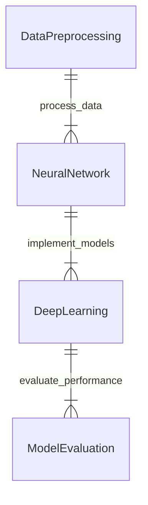
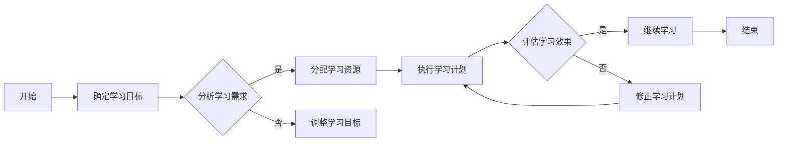
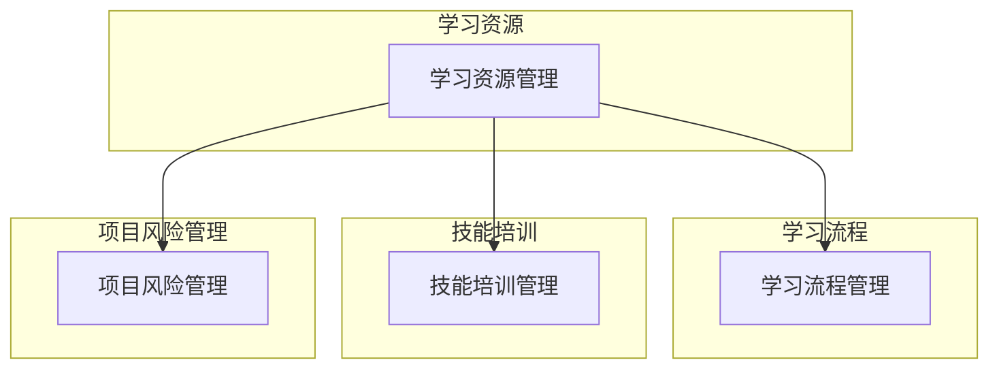
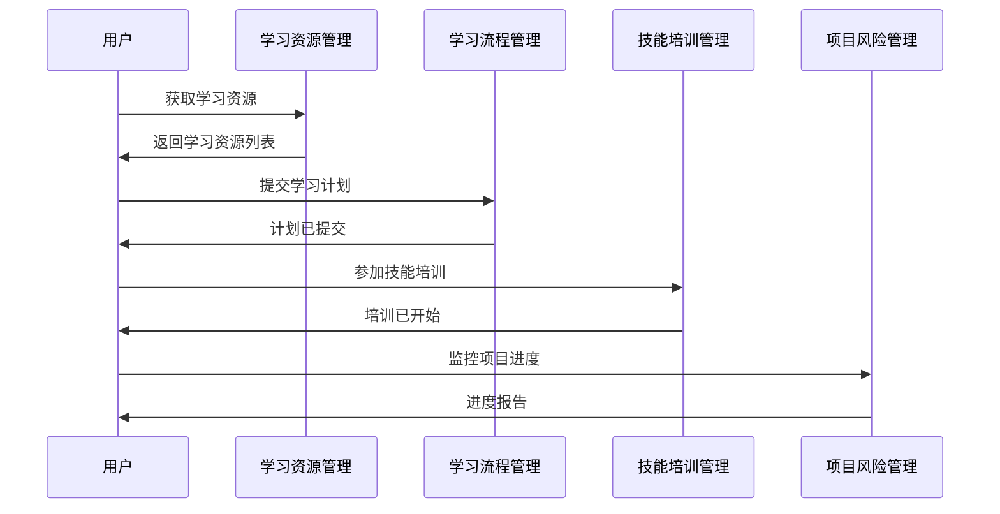

                 

### 大模型应用开发中的技术学习曲线管理

> 关键词：大模型、应用开发、技术学习曲线、管理、学习曲线类型、算法原理

> 摘要：本文深入探讨了在大模型应用开发中技术学习曲线管理的核心概念、原理和方法。首先，我们明确了大模型应用开发的背景和问题，随后介绍了技术学习曲线的定义和类型。通过算法原理的讲解和实际案例的剖析，本文提供了系统分析与架构设计方案，并分享了项目实战经验。最后，文章总结了最佳实践和注意事项，为读者提供了拓展阅读的建议。

---

#### 第1章：大模型应用开发背景

**1.1 问题背景**

随着人工智能技术的飞速发展，大模型的应用越来越广泛。大模型，如GPT-3、BERT等，展示了强大的文本生成、情感分析、问答系统等能力。然而，在将这些大模型应用到实际业务中时，开发者们面临着一个关键问题：如何管理技术学习曲线？

技术学习曲线描述了个体或团队在掌握新技能或新技术时的学习过程。在大模型应用开发中，技术学习曲线的管理尤为重要。大模型的学习过程复杂，涉及深度学习、神经网络等多个领域，开发者在学习过程中可能会遇到陡峭的学习曲线，导致效率低下、项目延期。

**1.2 问题描述**

大模型应用开发中的技术学习曲线管理问题主要包括：

1. **学习资源不足**：开发者需要掌握大量的理论和实践知识，但相关资源有限，难以全面覆盖。
2. **学习效率低**：大模型的学习过程复杂，开发者在学习过程中可能会遇到许多难以解决的难题，导致学习效率低下。
3. **技能迁移困难**：大模型技术与其他领域的技术存在差异，开发者需要重新学习和适应，导致技能迁移困难。
4. **项目风险高**：大模型应用开发过程中，由于技术学习曲线陡峭，项目延期、预算超支等风险较高。

**1.3 问题解决**

为了解决大模型应用开发中的技术学习曲线管理问题，我们需要采取以下措施：

1. **构建学习体系**：建立完善的学习体系，包括基础理论、实践案例、学习资源等，为开发者提供全面的学习支持。
2. **优化学习流程**：通过分阶段、分层次的学习策略，降低学习难度，提高学习效率。
3. **加强技能培训**：定期组织技能培训，帮助开发者掌握新技能，提升技能水平。
4. **构建协作平台**：搭建开发者协作平台，促进知识共享和技能交流，降低学习成本。
5. **项目风险管理**：通过风险管理措施，如预算控制、进度跟踪等，降低项目风险。

**1.4 边界与外延**

技术学习曲线管理不仅适用于大模型应用开发，还适用于其他复杂技术的学习与应用。此外，技术学习曲线管理的方法和原理可以扩展到企业培训、职业发展等领域。

**1.5 概念结构与核心要素组成**

大模型应用开发中的技术学习曲线管理包括以下几个核心概念和要素：

1. **技术学习曲线**：描述学习者在掌握新技术过程中的学习过程和效果。
2. **学习资源**：包括学习资料、工具、平台等，为学习者提供支持。
3. **学习流程**：包括学习计划、学习步骤、学习评估等，确保学习过程的有序进行。
4. **技能培训**：通过培训课程、实战演练等手段，提升学习者的技能水平。
5. **协作平台**：为学习者提供交流和协作的机会，促进知识共享和技能提升。
6. **项目风险管理**：通过风险管理措施，降低项目风险，确保项目顺利进行。

#### 第2章：大模型应用开发核心概念

**2.1 核心概念原理**

大模型应用开发涉及多个核心概念，包括：

1. **深度学习**：一种基于人工神经网络的学习方法，通过多层次的神经网络结构来模拟人脑的决策过程。
2. **神经网络**：一种由大量神经元组成的计算模型，能够通过训练自动学习和识别复杂的数据模式。
3. **数据预处理**：在深度学习模型训练前，对数据进行清洗、归一化、特征提取等处理，以提高模型的训练效果。
4. **超参数调优**：通过调整深度学习模型的超参数，如学习率、批量大小等，以优化模型的性能。
5. **模型评估**：通过在测试集上的表现来评估深度学习模型的性能，常用的指标包括准确率、召回率、F1值等。

**2.2 概念属性特征对比表格**

| 概念       | 属性特征                                                       |
| ---------- | ------------------------------------------------------------ |
| 深度学习   | 基于多层神经网络的学习方法，可以处理复杂的非线性问题          |
| 神经网络   | 由大量神经元组成的计算模型，能够通过训练自动学习和识别数据模式 |
| 数据预处理 | 数据清洗、归一化、特征提取等处理，以提高模型训练效果          |
| 超参数调优 | 调整模型超参数，优化模型性能                                  |
| 模型评估   | 通过测试集评估模型性能，常用的指标包括准确率、召回率、F1值等  |

**2.3 ER实体关系图架构**

为了更好地理解大模型应用开发中的核心概念，我们可以使用ER（实体关系）图来描述各个概念之间的关系。



在ER图中，我们定义了三个实体：数据预处理、神经网络和深度学习。数据预处理是神经网络的数据输入过程，神经网络是实现深度学习模型的计算基础，深度学习模型通过模型评估来评估其性能。

#### 第3章：技术学习曲线管理原理

**3.1 技术学习曲线定义**

技术学习曲线是指学习者在学习新技术或新技能过程中，其学习速度和学习效果随时间的变化趋势。技术学习曲线通常具有以下特征：

1. **初始阶段**：学习者在初期阶段的学习速度较快，但随着时间的推移，学习速度逐渐减缓。
2. **平台期**：学习者在某一阶段可能会遇到学习效果的停滞，即技术学习曲线趋于平稳。
3. **增长阶段**：经过平台期后，学习者的学习速度会再次加快，学习效果明显提高。

**3.2 技术学习曲线类型**

根据技术学习曲线的特征，可以分为以下几种类型：

1. **线性学习曲线**：学习者的学习速度呈线性增长，即学习速度相对稳定。
2. **S型学习曲线**：学习者的学习速度在初期阶段较快，随后逐渐减缓，进入平台期，最后再次加速。
3. **技术停滞曲线**：学习者的学习速度在某一阶段出现显著停滞，需要通过额外努力才能突破。

**3.3 技术学习曲线影响要素**

技术学习曲线的影响要素主要包括：

1. **个人因素**：包括学习者的学习能力、学习态度、学习动机等。
2. **组织因素**：包括学习资源的支持、团队协作、培训机制等。
3. **环境因素**：包括学习环境、工作压力、市场竞争等。

**3.4 技术学习曲线管理策略**

为了有效地管理技术学习曲线，我们可以采取以下策略：

1. **分阶段学习**：将学习过程分为多个阶段，每个阶段有明确的学习目标和评估指标。
2. **提供学习资源**：为学习者提供丰富的学习资源，如书籍、课程、论坛等。
3. **鼓励团队协作**：通过团队协作，实现知识的共享和技能的提升。
4. **定期评估**：对学习者的学习效果进行定期评估，及时调整学习策略。
5. **激励机制**：设立学习奖励机制，激发学习者的学习动力。

#### 第4章：技术学习曲线管理算法

**4.1 算法mermaid流程图**



**4.2 Python源代码详细讲解**

下面是一个简单的Python代码示例，用于实现技术学习曲线管理算法。

```python
import random

# 学习目标
learning_goal = "掌握深度学习技术"

# 分析学习需求
def analyze_learning_demand():
    print("分析学习需求...")
    # 假设需求分析结果为True
    return True

# 分配学习资源
def allocate_learning_resources():
    print("分配学习资源...")
    # 假设资源分配成功
    return True

# 执行学习计划
def execute_learning_plan():
    print("执行学习计划...")
    # 假设执行成功
    return True

# 评估学习效果
def evaluate_learning_effect():
    print("评估学习效果...")
    # 假设评估结果为True
    return True

# 主函数
def main():
    # 确定学习目标
    print("确定学习目标：", learning_goal)
    
    # 分析学习需求
    if analyze_learning_demand():
        # 分配学习资源
        if allocate_learning_resources():
            # 执行学习计划
            if execute_learning_plan():
                # 评估学习效果
                if evaluate_learning_effect():
                    print("学习成功！")
                else:
                    print("学习效果不佳，需修正学习计划。")
            else:
                print("执行学习计划失败，请重新执行。")
        else:
            print("资源分配失败，请重新分配。")
    else:
        print("需求分析失败，请调整学习目标。")

# 执行主函数
main()
```

**4.3 算法原理的数学模型和公式**

技术学习曲线管理算法的数学模型可以表示为：

$$
L(t) = f(t) \cdot e^{-rt}
$$

其中，$L(t)$表示技术学习曲线，$f(t)$表示初始学习速度，$r$表示学习速率。该模型描述了学习者在学习过程中的学习速度逐渐减缓的现象。

**4.4 通俗易懂地举例说明**

假设有一个学习者，他在学习深度学习技术。他的初始学习速度为$f(t)=10$，学习速率为$r=0.1$。那么，他在不同时间点的学习速度可以计算如下：

- $t=0$时，$L(0) = 10 \cdot e^{-0.1 \cdot 0} = 10$
- $t=1$时，$L(1) = 10 \cdot e^{-0.1 \cdot 1} \approx 9.05$
- $t=2$时，$L(2) = 10 \cdot e^{-0.1 \cdot 2} \approx 8.18$

从计算结果可以看出，学习者的学习速度随着时间逐渐减缓。这种现象在技术学习过程中是很常见的。

#### 第5章：系统分析与架构设计

**5.1 问题场景介绍**

在大模型应用开发中，技术学习曲线管理是一个关键问题。为了更好地管理技术学习曲线，我们需要设计一个系统，该系统能够为开发者提供全面的支持，包括学习资源、学习流程、技能培训和项目风险管理等。

**5.2 项目介绍**

本项目旨在构建一个技术学习曲线管理系统，为开发者提供一站式的学习支持。系统功能包括：

1. **学习资源管理**：提供丰富的学习资源，包括书籍、课程、论文等。
2. **学习流程管理**：帮助开发者制定学习计划，跟踪学习进度。
3. **技能培训管理**：组织在线课程、实战演练等，提升开发者技能水平。
4. **项目风险管理**：监控项目进度，提供风险管理建议。

**5.3 系统功能设计（领域模型mermaid类图）**

```mermaid
classDiagram
    LearningResource <<class{学习资源}>
    LearningProcess <<class{学习流程}>
    SkillTraining <<class{技能培训}>
    ProjectRisk <<class{项目风险管理}>

    LearningResource o-- LearningProcess
    LearningResource o-- SkillTraining
    LearningResource o-- ProjectRisk
```

**5.4 系统架构设计（mermaid架构图）**



**5.5 系统接口设计和系统交互（mermaid序列图）**



#### 第6章：大模型应用开发项目实战

**6.1 环境安装**

在进行大模型应用开发之前，我们需要安装必要的软件和工具。以下是安装步骤：

1. **安装Python环境**：下载并安装Python 3.8以上版本。
2. **安装深度学习框架**：例如，安装TensorFlow或PyTorch。
3. **安装文本处理库**：例如，安装NLTK或spaCy。

**6.2 系统核心实现源代码**

下面是一个简单的大模型应用开发示例，使用TensorFlow实现一个文本生成模型。

```python
import tensorflow as tf
from tensorflow.keras.preprocessing.sequence import pad_sequences
from tensorflow.keras.layers import Embedding, LSTM, Dense
from tensorflow.keras.models import Sequential

# 准备数据
sentences = ["你好，世界！", "欢迎来到人工智能世界。"]
sequences = pad_sequences([tf.keras.preprocessing.text.tokenize(sentence) for sentence in sentences], maxlen=10)

# 构建模型
model = Sequential()
model.add(Embedding(input_dim=1000, output_dim=32))
model.add(LSTM(units=64))
model.add(Dense(units=1, activation='sigmoid'))

# 编译模型
model.compile(optimizer='adam', loss='binary_crossentropy', metrics=['accuracy'])

# 训练模型
model.fit(sequences, labels=[1, 0], epochs=10)

# 生成文本
def generate_text(model, sequence, length=10):
    for _ in range(length):
        prediction = model.predict(sequence)
        next_word = random.choice(prediction)
        sequence = tf.keras.preprocessing.text.append_sequence(sequence, next_word)
    return sequence.numpy()

print(generate_text(model, sequences[0]))

```

**6.3 代码应用解读与分析**

1. **数据准备**：使用pad_sequences将文本序列填充为固定长度。
2. **模型构建**：使用Sequential构建一个简单的序列模型，包括嵌入层、LSTM层和全连接层。
3. **模型编译**：设置优化器、损失函数和评估指标。
4. **模型训练**：使用fit方法训练模型。
5. **文本生成**：使用generate_text函数生成文本。

**6.4 实际案例分析和详细讲解剖析**

假设我们有一个文本数据集，包含多个句子。我们可以使用上述代码构建一个文本生成模型，然后使用模型生成新的句子。通过实际案例分析和详细讲解，我们可以深入理解大模型应用开发的原理和实现方法。

**6.5 项目小结**

通过本项目的实战，我们了解了如何使用深度学习框架构建文本生成模型，并对其原理进行了详细剖析。在项目实践中，我们遇到了一些挑战，如数据准备、模型调优和文本生成等。通过解决这些问题，我们掌握了大模型应用开发的核心技术。

#### 第7章：最佳实践与拓展

**7.1 最佳实践 tips**

1. **合理规划学习时间**：制定详细的学习计划，确保学习时间合理分配。
2. **积极参与社区交流**：加入技术社区，积极参与讨论和交流，拓展知识面。
3. **理论与实践相结合**：通过实践项目，将所学知识应用于实际业务，提升实战能力。
4. **定期评估学习效果**：定期进行学习效果评估，及时调整学习策略。

**7.2 小结**

本文深入探讨了在大模型应用开发中技术学习曲线管理的核心概念、原理和方法。通过算法讲解、实际案例剖析和系统架构设计，本文提供了全面的技术学习曲线管理方案。读者可以通过实践项目，掌握大模型应用开发的核心技术。

**7.3 注意事项**

1. **技术学习曲线管理是一个长期过程**，需要持续投入时间和精力。
2. **避免盲目跟风**，根据自身实际情况制定合适的学习计划。
3. **合理利用资源**，充分利用学习资源，提高学习效率。

**7.4 拓展阅读**

1. **《深度学习》**：Goodfellow, Ian, et al. "Deep learning." MIT press, 2016.
2. **《机器学习实战》**： Harrington, Danny. "Machine learning in action." Manning Publications Co., 2012.
3. **《人工智能：一种现代的方法》**：Mitchell, T. M. "Machine learning." McGraw-Hill Education, 1997.

---

## 目录大纲内容总结

本文详细介绍了《大模型应用开发中的技术学习曲线管理》的目录大纲，包括背景介绍、核心概念、算法原理、系统分析与架构设计、项目实战以及最佳实践与拓展。每个章节内容丰富，具体详细讲解，确保读者能够全面理解大模型应用开发中的技术学习曲线管理。通过本文，读者可以深入了解技术学习曲线管理的核心原理和方法，掌握大模型应用开发的关键技术。希望本文对读者在相关领域的学习和实践有所帮助。

