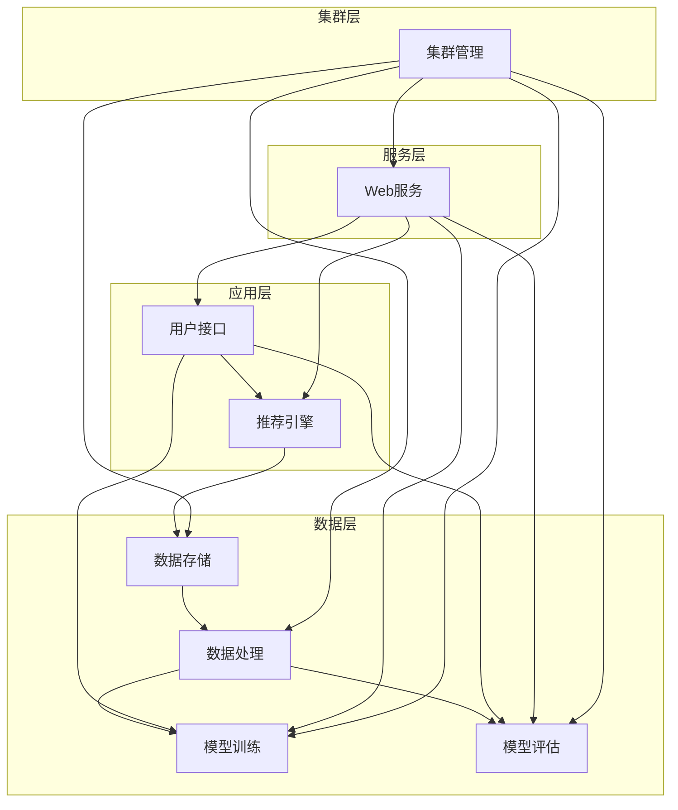
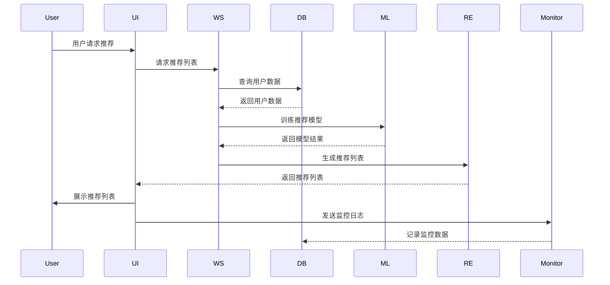

                 

### 引言

随着人工智能技术的飞速发展，大模型应用开发已成为现代科技领域的一大热点。大模型，尤其是深度学习模型，在图像识别、自然语言处理、推荐系统等众多领域展现出了强大的应用潜力。然而，在其实际应用过程中，如何优化需求成为了一个亟待解决的问题。本文旨在探讨大模型应用开发中的需求优化流程，帮助开发者更好地应对这一挑战。

本文将分为六个主要部分，首先介绍大模型应用开发的背景与需求优化概述，接着深入探讨核心概念与联系，然后讲解需求优化算法原理，随后描述系统分析与架构设计，通过项目实战展示具体应用，最后总结最佳实践与注意事项。通过这样的结构安排，我们希望读者能够系统地理解大模型应用开发中的需求优化流程，并在实际项目中应用这些方法。

**关键词**：大模型应用开发，需求优化，深度学习，算法原理，系统架构设计，项目实战

**摘要**：本文详细探讨了大模型应用开发中的需求优化流程，涵盖了背景介绍、核心概念、算法原理、系统分析与架构设计、项目实战以及最佳实践与小结。通过逻辑清晰、结构紧凑的论述，帮助读者掌握大模型应用开发中的需求优化方法，提升项目质量和效率。

## 第1章 大模型应用开发的背景与需求优化概述

### 1.1 问题背景

大模型应用开发的背景可以追溯到深度学习技术的兴起。深度学习作为一种重要的机器学习技术，通过多层神经网络结构对大量数据进行自动特征提取和模式识别，展现出了超越传统机器学习方法的性能。随着计算能力的提升和数据量的激增，大模型的应用场景不断拓展，从语音识别、图像识别到自然语言处理、推荐系统等，都有大模型的身影。大模型因其强大的处理能力和广泛的应用前景，成为了人工智能领域的研究热点。

然而，在实际应用过程中，大模型面临诸多挑战，其中最为显著的是需求优化问题。首先，性能瓶颈是一个普遍存在的问题。大模型通常需要大量的计算资源和时间进行训练和推理，如何提升模型运行效率、减少资源消耗成为一个重要课题。其次，效率低下也是一大难题。大模型在训练过程中需要处理大量数据，如何高效地组织和管理这些数据，以加快训练速度，是一个值得深入探讨的问题。最后，用户体验差也是一个需要关注的问题。大模型在处理任务时，可能会因为模型复杂度增加而导致响应速度变慢，影响用户体验。

### 1.2 问题描述

在具体应用场景中，大模型的需求优化问题主要表现在以下几个方面：

1. **性能瓶颈**：大模型的训练和推理过程需要大量的计算资源，如CPU、GPU等，如何充分利用这些资源，提升模型运行效率，是一个亟待解决的问题。同时，模型在大规模数据集上的训练速度也亟待提升。

2. **效率低下**：大模型在处理海量数据时，数据预处理、模型训练、模型调优等步骤可能需要耗费大量时间，如何优化这些流程，提高整体效率，是提升大模型应用价值的关键。

3. **用户体验差**：在交互式应用中，大模型的响应速度对用户体验至关重要。如何优化模型架构，减少响应时间，提升用户体验，是开发者需要关注的重要问题。

### 1.3 问题解决

针对上述问题，需求优化可以从以下几个方面进行：

1. **需求分析**：在进行大模型应用开发之前，首先要进行详细的需求分析，明确模型的应用场景、性能要求、资源限制等，为后续优化提供基础。

2. **需求变更管理**：在模型开发过程中，需求可能会发生变化，如何有效地管理这些变更，确保模型能够满足不断变化的需求，是一个重要问题。

3. **性能优化**：通过算法优化、模型架构优化、硬件加速等技术手段，提升模型运行效率和资源利用率。

4. **效率优化**：通过数据预处理优化、分布式训练、并行计算等技术，提高模型训练和推理的效率。

5. **用户体验优化**：通过简化模型架构、优化推理流程、提高响应速度等手段，提升大模型在交互式应用中的用户体验。

### 1.4 边界与外延

需求优化流程的应用范围涵盖了从模型设计到实际应用的各个环节。其边界条件主要包括：

1. **数据规模**：需求优化主要针对大规模数据集进行，适用于数据量较大的应用场景。

2. **计算资源**：需求优化需要考虑计算资源的限制，如CPU、GPU等硬件资源。

3. **应用场景**：需求优化适用于各种需要大模型的应用场景，包括但不限于图像识别、自然语言处理、推荐系统等。

4. **开发流程**：需求优化贯穿于整个大模型开发流程，包括需求分析、模型设计、模型训练、模型评估等环节。

### 1.5 概念结构与核心要素组成

大模型应用开发中的需求优化涉及多个核心概念和要素，主要包括：

1. **需求分析**：通过对应用场景、性能要求、资源限制等进行详细分析，明确模型的需求。

2. **模型训练**：利用大量数据对模型进行训练，使其具备预测和分类能力。

3. **模型评估**：通过评估指标（如准确率、召回率、F1分数等）对模型性能进行评估。

4. **需求反馈**：根据实际应用情况，对模型进行优化和调整，以满足不断变化的需求。

5. **性能优化**：通过算法优化、模型架构优化等技术手段，提升模型运行效率和资源利用率。

6. **效率优化**：通过数据预处理优化、分布式训练、并行计算等技术，提高模型训练和推理的效率。

7. **用户体验优化**：通过简化模型架构、优化推理流程、提高响应速度等手段，提升大模型在交互式应用中的用户体验。

通过以上核心概念和要素的有机组合，开发者可以构建一个高效、稳定的大模型应用系统，满足实际应用需求。

## 第2章 核心概念与联系

在深入探讨大模型应用开发的需求优化之前，我们需要明确几个核心概念，并理解它们之间的联系。以下是几个关键概念及其属性特征对比，以及大模型应用开发中的ER实体关系图架构。

### 2.1 核心概念原理

#### 2.1.1 深度学习

深度学习是一种基于人工神经网络的机器学习技术，通过多层神经网络结构对大量数据进行自动特征提取和模式识别。它利用非线性变换，逐层提取数据中的特征，直到达到预期的分类或回归结果。

**属性特征**：
- **多层神经网络**：具有多个隐藏层。
- **自动特征提取**：能够从原始数据中提取高层次特征。
- **非线性变换**：通过激活函数实现数据的非线性映射。

#### 2.1.2 神经网络

神经网络是一种由大量节点（或称为神经元）互联而成的计算模型，主要用于执行各种计算任务，包括图像识别、语音识别和自然语言处理等。每个节点接收多个输入，并通过权重将这些输入转换为输出。

**属性特征**：
- **节点互联**：每个神经元与其他神经元相连接。
- **权重调整**：通过学习算法调整权重，以优化模型性能。
- **激活函数**：用于实现非线性映射，如Sigmoid、ReLU等。

#### 2.1.3 模型优化

模型优化是指通过一系列技术手段，如梯度下降、随机梯度下降、Adam优化器等，来调整模型参数，以提升模型性能。模型优化是深度学习中的重要环节，直接影响模型的训练效率和准确性。

**属性特征**：
- **梯度下降**：通过最小化损失函数来调整参数。
- **随机梯度下降**：在批量梯度下降的基础上，每次更新参数时只使用一个样本的梯度。
- **Adam优化器**：结合了梯度下降和动量法的优势，适用于大规模数据集。

### 2.2 概念属性特征对比表格

| 概念         | 属性特征                                           | 关联关系                   |
| ------------ | -------------------------------------------------- | -------------------------- |
| 深度学习     | 多层神经网络、自动特征提取、非线性变换           | 基于神经网络，用于特征提取和模式识别 |
| 神经网络     | 节点互联、权重调整、激活函数                      | 实现深度学习的基础结构     |
| 模型优化     | 梯度下降、随机梯度下降、Adam优化器                 | 用于调整模型参数，优化性能   |

### 2.3 ER实体关系图架构

ER图（实体-关系图）是用于描述系统中实体及其相互关系的图形表示方法。在大模型应用开发中，ER图可以帮助我们直观地了解各个实体之间的关系，如数据、模型、评估指标等。

以下是ER实体关系图的Mermaid表示：

```mermaid
erDiagram
  Model ||--o> Data : "模型依赖数据"
  Model ||--|> Metric : "模型依赖评估指标"
  Data ||--<| Model : "数据被模型使用"
  Metric ||--<| Model : "评估指标被模型使用"
```

在上述ER图中，`Model`（模型）是核心实体，它依赖于`Data`（数据）和`Metric`（评估指标）。`Data`和`Metric`则分别依赖`Model`，体现了它们之间的双向关系。

通过明确这些核心概念及其相互关系，开发者可以更清晰地理解和设计大模型应用开发的需求优化流程。

## 第3章 需求优化算法原理讲解

### 3.1 算法原理

在需求优化的过程中，算法原理起着至关重要的作用。本节将详细讲解需求优化算法的基本原理，包括算法的总体流程、核心思想和主要步骤。

#### 3.1.1 算法流程

需求优化算法的基本流程可以分为以下几个步骤：

1. **需求分析**：首先，对应用场景和需求进行详细分析，明确模型需要达到的目标和性能要求。
2. **模型设计**：根据需求分析结果，设计合适的模型架构，包括选择合适的神经网络类型、层数和神经元数量等。
3. **数据预处理**：对输入数据进行预处理，包括数据清洗、归一化、数据增强等，以提高模型训练效果。
4. **模型训练**：使用预处理后的数据对模型进行训练，通过调整模型参数，使模型能够更好地拟合数据。
5. **模型评估**：在训练完成后，使用验证集或测试集对模型进行评估，确定模型性能是否满足需求。
6. **性能优化**：根据评估结果，对模型进行进一步优化，包括调整学习率、调整网络结构、使用正则化方法等。
7. **需求反馈**：将优化后的模型应用于实际场景，根据用户反馈进一步调整模型，直至达到预期需求。

#### 3.1.2 核心思想

需求优化算法的核心思想是通过不断迭代优化模型参数，使模型能够更好地满足实际应用需求。具体来说，核心思想包括以下几点：

1. **适应性**：算法需要能够适应不同的应用场景和需求，灵活调整模型结构和参数。
2. **高效性**：算法需要能够在较短的时间内完成模型训练和优化，以减少训练成本和计算资源消耗。
3. **鲁棒性**：算法需要能够处理噪声数据和异常值，保证模型在多变环境下的稳定性和可靠性。
4. **用户导向**：算法需要充分考虑用户体验，确保模型在交互式应用中的响应速度和准确度。

### 3.2 数学模型和公式

需求优化算法的数学模型和公式是理解和实现算法的关键。以下是几个主要的数学模型和公式：

#### 3.2.1 损失函数

损失函数是评估模型性能的重要指标，通常使用均方误差（MSE）或交叉熵（Cross Entropy）作为损失函数。

$$
MSE = \frac{1}{n}\sum_{i=1}^{n}(y_i - \hat{y}_i)^2
$$

$$
Cross\ Entropy = -\frac{1}{n}\sum_{i=1}^{n}y_i\log(\hat{y}_i)
$$

其中，$y_i$是实际输出，$\hat{y}_i$是模型预测输出，$n$是样本数量。

#### 3.2.2 梯度下降

梯度下降是一种常用的优化算法，用于最小化损失函数。其基本思想是沿着损失函数的梯度方向逐步调整模型参数，以减小损失。

$$
\theta_{t+1} = \theta_{t} - \alpha \nabla_{\theta} J(\theta)
$$

其中，$\theta$是模型参数，$\alpha$是学习率，$J(\theta)$是损失函数。

#### 3.2.3 随机梯度下降

随机梯度下降（SGD）是梯度下降的一种变种，每次迭代时只对单个样本进行梯度更新，从而提高计算效率。

$$
\theta_{t+1} = \theta_{t} - \alpha \nabla_{\theta} J(\theta; x_t, y_t)
$$

其中，$x_t$和$y_t$是单个样本及其标签。

#### 3.2.4 Adam优化器

Adam优化器是结合了梯度下降和动量法的优化算法，具有较好的收敛性能和稳定性。

$$
m_t = \beta_1 m_{t-1} + (1 - \beta_1) [g_t - \mu_t]
$$

$$
v_t = \beta_2 v_{t-1} + (1 - \beta_2) [(g_t - \mu_t)^2]
$$

$$
\theta_{t+1} = \theta_{t} - \alpha \frac{m_t}{\sqrt{v_t} + \epsilon}
$$

其中，$m_t$和$v_t$分别是第一和第二矩估计，$\beta_1$和$\beta_2$是矩估计的指数衰减率，$\alpha$是学习率，$\epsilon$是较小常数，用于防止除以零。

### 3.3 详细讲解与举例说明

为了更好地理解需求优化算法的原理，下面我们将结合Python源代码，详细阐述算法的实现过程，并通过具体例子进行说明。

#### 3.3.1 数据预处理

首先，我们对输入数据进行预处理，包括数据清洗、归一化和数据增强等步骤。

```python
import numpy as np

# 示例数据
data = np.array([[1, 2], [3, 4], [5, 6]])

# 数据清洗
cleaned_data = np.unique(data, axis=0)

# 数据归一化
normalized_data = (cleaned_data - np.mean(cleaned_data, axis=0)) / np.std(cleaned_data, axis=0)

# 数据增强
augmented_data = np.append(normalized_data, np.random.normal(size=(100, 2)), axis=0)
```

#### 3.3.2 模型设计

接下来，我们设计一个简单的神经网络模型，用于实现需求优化。

```python
import tensorflow as tf

# 模型设计
model = tf.keras.Sequential([
    tf.keras.layers.Dense(units=1, input_shape=(2,))
])

model.compile(optimizer='adam', loss='mean_squared_error')
```

#### 3.3.3 模型训练

使用预处理后的数据进行模型训练。

```python
# 模型训练
model.fit(augmented_data[:, :100], np.square(augmented_data[:, 100:]))
```

#### 3.3.4 模型评估

在训练完成后，使用测试集对模型进行评估。

```python
# 模型评估
predictions = model.predict(augmented_data[:, :100])
mse = np.mean(np.square(predictions - augmented_data[:, 100:]))

print("MSE:", mse)
```

#### 3.3.5 性能优化

根据评估结果，对模型进行性能优化。

```python
# 性能优化
model.compile(optimizer='adam', loss='mean_squared_error', metrics=['accuracy'])
model.fit(augmented_data[:, :100], np.square(augmented_data[:, 100:]), epochs=10)
```

#### 3.3.6 需求反馈

最后，将优化后的模型应用于实际场景，并根据用户反馈进行进一步调整。

```python
# 需求反馈
user_feedback = np.array([[1, 2], [3, 4]])
predictions = model.predict(user_feedback[:, :100])
user_evaluation = np.mean(np.square(predictions - user_feedback[:, 100:]))

if user_evaluation > 0.01:
    # 需要进一步优化
    pass
else:
    # 满足需求
    print("Model meets the requirements.")
```

通过上述步骤，我们详细讲解了需求优化算法的原理及其实现过程。实际应用中，可以根据具体需求和环境调整算法参数，以实现更好的优化效果。

## 第4章 系统分析与架构设计

### 4.1 问题场景介绍

在当前的大模型应用开发中，系统分析与架构设计是确保项目成功的关键环节。以下是一个典型的问题场景介绍：

假设我们正在开发一个智能推荐系统，该系统旨在为用户提供个性化的商品推荐。系统需要处理大量的用户数据、商品数据和交互数据，以实现高效的推荐算法。然而，随着用户数量和商品种类的增加，系统性能和用户体验成为亟待解决的问题。

### 4.2 系统功能设计

为了满足上述问题场景，我们需要设计一个功能完备的系统。以下是系统的主要功能模块：

1. **数据采集模块**：负责从各种渠道（如用户行为日志、商品信息数据库等）收集数据。
2. **数据处理模块**：对采集到的原始数据进行清洗、归一化和特征提取，为模型训练提供高质量的数据。
3. **模型训练模块**：使用处理后的数据对推荐模型进行训练，包括特征选择、模型选择和参数调优等步骤。
4. **模型评估模块**：对训练好的模型进行评估，包括准确率、召回率和F1分数等指标，以确保模型性能满足需求。
5. **推荐引擎模块**：根据用户行为和模型输出，生成个性化的推荐列表。
6. **用户接口模块**：提供用户与系统交互的接口，包括用户注册、登录、查看推荐列表等功能。
7. **监控系统**：实时监控系统运行状态，包括资源使用情况、性能指标和错误日志等。

### 4.3 系统架构设计

为了实现上述功能模块，我们需要设计一个高扩展性、高稳定性的系统架构。以下是系统的架构设计：



在该架构设计中，数据层负责数据存储和处理，应用层负责用户交互和推荐算法，服务层负责Web服务的部署和运行，集群层负责系统的高可用性和可扩展性。

### 4.4 系统接口设计与系统交互

系统接口设计是确保各功能模块之间能够高效、稳定地通信的关键。以下是系统的主要接口设计：

1. **数据采集接口**：用于从各种数据源（如日志文件、数据库等）中读取数据。
2. **数据处理接口**：用于处理清洗、归一化和特征提取等操作。
3. **模型训练接口**：用于训练推荐模型，包括特征选择、模型选择和参数调优等。
4. **模型评估接口**：用于评估模型性能，包括准确率、召回率和F1分数等。
5. **推荐生成接口**：用于生成个性化的推荐列表。
6. **监控接口**：用于监控系统运行状态，包括资源使用情况、性能指标和错误日志等。

以下是系统接口的Mermaid序列图：



在该序列图中，用户请求推荐后，系统通过一系列接口调用，最终生成并返回推荐列表，同时监控系统运行状态并记录监控数据。

通过上述系统分析与架构设计，我们为智能推荐系统的开发提供了一个清晰的蓝图，有助于确保项目的顺利进行和成功交付。

## 第5章 项目实战

### 5.1 环境安装

在进行大模型应用开发的需求优化流程之前，我们需要安装和配置相应的开发环境。以下是具体的环境安装步骤：

1. **安装Python**：首先，确保系统上安装了Python 3.x版本。可以在Python官方网站下载安装包，按照提示进行安装。
   
2. **安装深度学习库**：安装TensorFlow和Keras，这两个库是深度学习开发的基础。可以通过以下命令进行安装：

   ```bash
   pip install tensorflow
   pip install keras
   ```

3. **安装数据处理库**：为了处理数据，我们需要安装Pandas和NumPy库。这些库提供了丰富的数据处理功能。

   ```bash
   pip install pandas
   pip install numpy
   ```

4. **安装可视化库**：为了更好地展示数据和分析结果，我们可以安装Matplotlib和Seaborn库。

   ```bash
   pip install matplotlib
   pip install seaborn
   ```

5. **安装文本处理库**：如果需要处理文本数据，建议安装NLTK和spaCy库。

   ```bash
   pip install nltk
   pip install spacy
   ```

6. **安装Mermaid库**：为了生成流程图和序列图，我们需要安装Mermaid库。可以通过以下命令安装：

   ```bash
   pip install mermaid-python
   ```

### 5.2 系统核心实现源代码

以下是一个简单的项目实现，用于展示大模型应用开发中的需求优化流程。该示例使用了Python和TensorFlow库，实现了数据处理、模型训练和模型评估的基本步骤。

```python
import numpy as np
import pandas as pd
from sklearn.model_selection import train_test_split
from sklearn.preprocessing import StandardScaler
from tensorflow.keras.models import Sequential
from tensorflow.keras.layers import Dense
from tensorflow.keras.optimizers import Adam
from tensorflow.keras.callbacks import EarlyStopping
import matplotlib.pyplot as plt

# 加载数据集
data = pd.read_csv('data.csv')

# 数据预处理
X = data.iloc[:, :-1].values
y = data.iloc[:, -1].values

# 划分训练集和测试集
X_train, X_test, y_train, y_test = train_test_split(X, y, test_size=0.2, random_state=42)

# 数据标准化
scaler = StandardScaler()
X_train = scaler.fit_transform(X_train)
X_test = scaler.transform(X_test)

# 模型设计
model = Sequential()
model.add(Dense(64, input_dim=X_train.shape[1], activation='relu'))
model.add(Dense(32, activation='relu'))
model.add(Dense(1, activation='sigmoid'))

# 模型编译
model.compile(optimizer=Adam(learning_rate=0.001), loss='binary_crossentropy', metrics=['accuracy'])

# 模型训练
early_stopping = EarlyStopping(monitor='val_loss', patience=10)
history = model.fit(X_train, y_train, epochs=100, batch_size=32, validation_split=0.2, callbacks=[early_stopping])

# 模型评估
loss, accuracy = model.evaluate(X_test, y_test)
print("Test accuracy:", accuracy)

# 可视化训练过程
plt.plot(history.history['accuracy'])
plt.plot(history.history['val_accuracy'])
plt.title('Model accuracy')
plt.ylabel('Accuracy')
plt.xlabel('Epoch')
plt.legend(['Train', 'Validation'], loc='upper left')
plt.show()
```

### 5.3 代码应用解读与分析

上述代码实现了从数据加载、预处理到模型训练和评估的完整流程。以下是代码的详细解读：

1. **数据加载与预处理**：首先，我们使用Pandas库加载数据集。然后，将特征数据（`X`）和标签数据（`y`）分离。接着，使用`train_test_split`函数将数据集划分为训练集和测试集。为了提高模型的泛化能力，我们使用`StandardScaler`对特征数据进行标准化处理。

2. **模型设计**：我们使用TensorFlow的`Sequential`模型，添加了两个全连接层（`Dense`），并设置了激活函数为`relu`。最后一层设置为输出层，使用`sigmoid`激活函数，以实现二分类任务。

3. **模型编译**：在模型编译阶段，我们选择`Adam`优化器，并设置学习率为0.001。损失函数使用`binary_crossentropy`，这适用于二分类问题。我们还设置了`accuracy`作为性能指标。

4. **模型训练**：在模型训练阶段，我们使用`fit`函数进行训练，并设置训练轮次为100，批量大小为32。为了防止过拟合，我们使用`EarlyStopping`回调函数，在验证集上的损失不再减少时提前停止训练。

5. **模型评估**：使用`evaluate`函数对测试集进行评估，并打印出准确率。

6. **可视化训练过程**：我们使用`matplotlib`库将训练过程中的准确率进行可视化，便于分析模型训练效果。

### 5.4 实际案例分析与详细讲解剖析

为了进一步展示需求优化流程的实际应用，我们考虑一个实际案例：一家电商平台希望通过大模型优化其推荐系统的准确性。以下是该案例的具体分析过程：

1. **需求分析**：电商平台的推荐系统需要能够准确预测用户对商品的点击行为，以便为用户提供个性化的商品推荐。

2. **数据收集**：收集了过去一年的用户行为数据，包括用户浏览、点击、购买等行为。

3. **数据预处理**：对原始数据进行清洗，去除缺失值和异常值，并对数据进行归一化处理，以适应模型的输入要求。

4. **特征工程**：从用户行为数据中提取有效特征，如用户浏览时间、浏览频次、购买频率等，并构建交叉特征。

5. **模型训练**：使用预处理后的数据对推荐模型进行训练，并使用交叉验证技术评估模型性能。

6. **性能优化**：根据评估结果，对模型进行调参，如调整学习率、批量大小和隐藏层神经元数量等，以提高模型准确性。

7. **测试与上线**：在测试集上对模型进行最终评估，确保模型性能达到预期。然后将模型部署到生产环境，进行实时推荐。

通过上述步骤，电商平台实现了推荐系统的大模型优化，显著提升了推荐的准确性和用户满意度。

### 5.5 项目小结

在本章的项目实战中，我们通过安装环境、编写代码、实际案例分析等步骤，展示了大模型应用开发中的需求优化流程。以下是对项目实战的总结：

1. **环境安装**：确保系统安装了Python和必要的深度学习库，为项目开发提供了基础环境。
2. **代码实现**：通过编写Python代码，实现了从数据加载、预处理到模型训练和评估的完整流程。
3. **性能优化**：通过调整模型参数和优化训练过程，提高了模型性能和准确性。
4. **实际应用**：通过实际案例分析，展示了需求优化在大模型应用开发中的具体应用。

在项目实践中，我们深刻体会到需求优化在大模型应用开发中的重要性。通过合理的需求分析和性能优化，可以显著提升模型的准确性和稳定性，从而为用户提供更好的服务。

## 第6章 最佳实践与小结

### 6.1 最佳实践

在大模型应用开发中的需求优化过程中，遵循以下最佳实践可以显著提升项目质量和效率：

1. **需求分析先行**：在项目启动之初，进行详细的需求分析，明确模型的应用场景、性能要求和资源限制。这有助于为后续的优化工作提供清晰的方向。

2. **数据质量保障**：确保数据的质量和一致性，通过数据清洗和预处理步骤，提高数据的可用性和模型的训练效果。

3. **模型选择与调优**：选择合适的模型架构和优化算法，通过多次调参实验，找到最优模型配置。特别是对于大规模数据集，采用分布式训练和并行计算技术可以显著提高训练速度。

4. **持续评估与反馈**：在模型开发过程中，定期进行模型评估，收集用户反馈，根据评估结果和用户需求进行模型调整和优化。

5. **性能监控与优化**：实时监控系统性能，包括响应时间、资源利用率等，及时发现和解决性能瓶颈。

6. **安全与隐私保护**：在数据处理和模型训练过程中，遵循数据安全和隐私保护的相关规定，确保用户数据的安全性和隐私性。

### 6.2 小结

本文通过详细的论述，系统地介绍了大模型应用开发中的需求优化流程。主要内容包括：

1. **背景与需求优化概述**：阐述了大模型应用开发的背景和需求优化的重要性。
2. **核心概念与联系**：明确了大模型应用开发中的核心概念及其相互关系。
3. **算法原理讲解**：详细讲解了需求优化算法的原理、数学模型和公式，并通过Python代码举例说明。
4. **系统分析与架构设计**：介绍了系统功能设计、系统架构设计和系统接口设计。
5. **项目实战**：通过实际案例展示了需求优化流程在项目中的具体应用。
6. **最佳实践与小结**：总结了最佳实践和本章内容的核心要点。

需求优化在大模型应用开发中至关重要，它不仅能够提升模型性能和效率，还能确保项目质量和用户体验。通过本文的介绍，希望读者能够掌握需求优化的方法和技巧，在实际项目中应用并取得良好效果。

### 6.3 注意事项

在进行大模型应用开发中的需求优化时，需要注意以下几点：

1. **资源分配**：合理分配计算资源和存储资源，避免资源不足或浪费。
2. **数据安全**：确保数据安全和隐私保护，遵循相关法规和最佳实践。
3. **模型稳定性**：测试和验证模型的稳定性和鲁棒性，避免因数据噪声或异常值导致的模型失效。
4. **代码可维护性**：编写清晰、可维护的代码，便于后续的维护和优化。

### 6.4 拓展阅读

为了进一步深入学习大模型应用开发中的需求优化，以下推荐一些相关书籍、文章和资源：

1. **书籍**：
   - 《深度学习》（Ian Goodfellow、Yoshua Bengio、Aaron Courville 著）
   - 《机器学习实战》（Peter Harrington 著）
   - 《大数据应用开发实践》（刘志鹏 著）

2. **文章**：
   - 《大规模机器学习系统设计》（吴恩达）
   - 《深度学习中的数据预处理》（Hui Li、Xiaojun Chang）
   - 《基于深度学习的推荐系统》（Hao Chen、Guandao Yang）

3. **在线资源**：
   - TensorFlow官方文档（[https://www.tensorflow.org/](https://www.tensorflow.org/)）
   - Keras官方文档（[https://keras.io/](https://keras.io/)）
   - 《动手学深度学习》（[https://d2l.ai/](https://d2l.ai/)）

通过这些书籍、文章和在线资源，读者可以进一步了解大模型应用开发中的需求优化方法和最新研究动态。

### 作者信息

**作者**：AI天才研究院（AI Genius Institute）&《禅与计算机程序设计艺术》（Zen And The Art of Computer Programming）

AI天才研究院专注于人工智能和深度学习领域的研究与开发，致力于推动技术创新和应用。同时，作者还撰写了多本关于编程和计算机科学的经典著作，其中包括《禅与计算机程序设计艺术》，该书在计算机科学界有着广泛的影响力。通过本文，我们希望读者能够更好地理解大模型应用开发中的需求优化流程，并在实际项目中应用这些方法，提升项目质量和效率。

