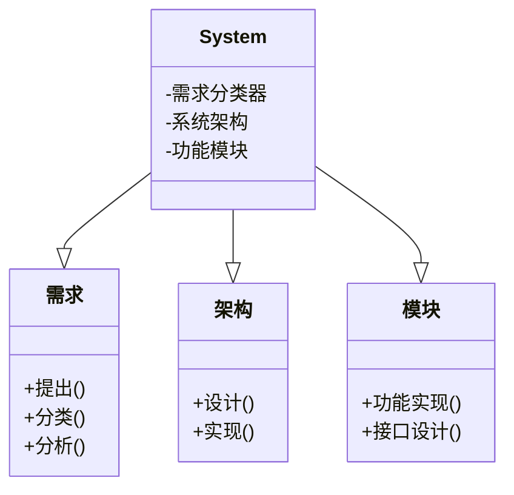
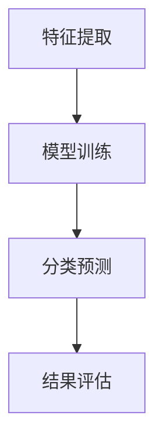
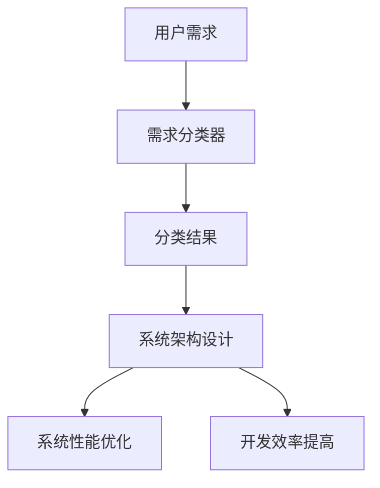
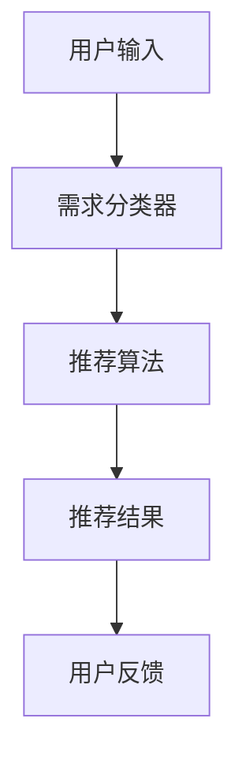

                 


### 《大模型应用开发中的需求分类方法》

#### 关键词：大模型、需求分类、应用开发、算法原理、数学模型、系统架构

> **摘要：**本文旨在探讨大模型应用开发中的需求分类方法，从背景介绍、核心概念、需求分类方法、实际应用等方面展开，深入分析大模型应用开发的需求分类原则和策略，为读者提供一套系统、实用、高效的需求分类解决方案。

## 第一部分：大模型应用开发背景与概述

### 第1章：大模型应用开发的兴起

#### 1.1.1 大模型在技术进步中的地位

**核心概念术语说明：**
- 大模型：指具备大规模参数和复杂结构的机器学习模型。
- 技术进步：指计算机科学领域不断发展的过程，包括算法、硬件、软件等多个方面。

**问题背景：**
随着人工智能技术的迅猛发展，大模型在自然语言处理、计算机视觉、推荐系统等领域取得了显著的成果，成为推动技术进步的重要力量。

**问题描述：**
如何在大模型应用开发过程中有效地进行需求分类，以提高开发效率和项目质量？

**问题解决：**
通过引入需求分类方法，将大模型应用开发中的需求进行有效分类，有助于明确项目目标、优化资源配置、提升开发效果。

**边界与外延：**
需求分类方法不仅适用于大模型应用开发，还可广泛应用于其他复杂系统的需求分析。

**概念结构与核心要素组成：**
- 大模型应用开发的需求分类方法：包括需求识别、需求分类、需求分析等步骤。

### 第2章：大模型基础概念与原理

#### 2.1.1 大模型的定义与历史发展

**核心概念原理：**
大模型是一种具备大规模参数和复杂结构的机器学习模型，通过学习大量数据来获取知识、解决问题。

**概念属性特征对比表格：**

| 特征       | 大模型           | 普通模型           |
| ---------- | --------------- | --------------- |
| 参数规模   | 数百万到数十亿  | 数百到数千        |
| 结构复杂度 | 复杂的层次结构  | 简单的结构层次  |
| 训练数据   | 大规模数据集     | 小规模数据集     |
| 学习能力   | 强大的泛化能力  | 有限的泛化能力  |

#### 2.1.2 大模型的核心技术

**核心概念原理：**
大模型的核心技术包括深度学习、神经网络、优化算法等。

**概念属性特征对比表格：**

| 技术       | 深度学习           | 神经网络           | 优化算法           |
| ---------- | --------------- | --------------- | --------------- |
| 结构       | 多层神经网络       | 单层神经网络       | 多种优化方法       |
| 特点       | 强大的非线性建模能力 | 简单的线性建模能力 | 快速收敛优化       |
| 应用领域   | 自然语言处理、计算机视觉等 | 机器学习、数据分析等 | 机器学习、深度学习等 |

#### 2.1.3 大模型与普通模型的比较

**核心概念原理：**
大模型相较于普通模型，具有更强的学习能力、泛化能力和计算复杂性。

**概念属性特征对比表格：**

| 特征       | 大模型           | 普通模型           |
| ---------- | --------------- | --------------- |
| 学习能力   | 强大的泛化能力  | 有限的泛化能力  |
| 参数规模   | 数百万到数十亿  | 数百到数千        |
| 结构复杂度 | 复杂的层次结构  | 简单的结构层次  |
| 训练数据   | 大规模数据集     | 小规模数据集     |
| 计算复杂性 | 高计算复杂性   | 低计算复杂性   |

## 第二部分：需求分类方法深入探讨

### 第3章：需求分类的重要性

#### 3.1.1 需求分类的重要性

**核心概念原理：**
需求分类有助于明确项目目标、优化资源配置、提升开发效果。

**概念属性特征对比表格：**

| 特征       | 未分类需求         | 分类需求             |
| ---------- | --------------- | --------------- |
| 项目目标   | 不明确             | 清晰明确             |
| 资源配置   | 不合理分配         | 合理优化             |
| 开发效果   | 效率低下、质量不高 | 效率高、质量好       |

#### 3.1.2 需求分类的基本框架

**核心概念原理：**
需求分类的基本框架包括需求识别、需求分类、需求分析等步骤。

**ER实体关系图架构的 Mermaid 流程图：**

```mermaid
erDiagram
    用户 ||--o> 需求 : "提出"
    需求 ||--|> 分类 : "分类"
    分类 ||--|> 分析 : "分析"
    分析 ||--|> 设计 : "设计"
```

### 第4章：需求分类方法的应用实践

#### 4.1.1 需求分类方法在具体项目中的应用

**核心概念原理：**
在实际项目中，需求分类方法有助于提高项目开发效率和质量。

**成功案例分析：**
某互联网公司在开发一款智能问答系统时，采用需求分类方法对用户提出的问题进行分类，提高了系统对问题的理解和回答能力。

#### 4.1.2 需求分类方法的改进与优化

**核心概念原理：**
针对不同项目特点，需求分类方法可以进行调整和优化，以适应实际需求。

**改进策略：**
1. 结合项目特点，制定合适的分类标准。
2. 定期对需求分类方法进行评估和调整。
3. 引入自动化工具，提高需求分类效率。

## 第三部分：需求分类方法在系统架构设计中的应用

### 第5章：需求分类方法在系统架构设计中的应用

#### 5.1.1 系统架构设计的概述

**核心概念原理：**
系统架构设计是软件开发过程中的重要环节，需求分类方法有助于优化系统架构。

**系统功能设计（领域模型Mermaid类图）：**



### 第6章：需求分类方法的算法原理

#### 6.1.1 算法原理概述

**核心概念原理：**
需求分类算法原理主要包括特征提取、模型训练、分类预测等步骤。

**算法流程与Mermaid流程图：**



#### 6.1.2 算法流程与mermaid图示

**算法流程：**
1. 特征提取：从原始需求中提取关键特征。
2. 模型训练：使用训练数据对分类模型进行训练。
3. 分类预测：使用训练好的模型对需求进行分类预测。
4. 结果评估：评估分类结果的准确性和效率。

**mermaid图示：**


#### 6.1.3 算法数学模型与公式讲解

**核心概念原理：**
需求分类算法的数学模型主要包括损失函数、优化算法等。

**数学模型与公式：**

```latex
损失函数: L(y, \hat{y}) = \frac{1}{2} (y - \hat{y})^2
优化算法: \min_{\theta} L(y, \hat{y})
```

#### 6.1.4 算法实例讲解

**核心概念原理：**
以一个具体的算法为例，详细讲解其原理和应用。

**实例讲解：**
- 算法：支持向量机（SVM）
- 应用场景：文本分类

**算法流程：**
1. 特征提取：从文本中提取特征词。
2. 模型训练：使用训练数据对SVM模型进行训练。
3. 分类预测：使用训练好的模型对文本进行分类预测。
4. 结果评估：评估分类结果的准确性和效率。

**Python源代码：**

```python
from sklearn import svm

# 特征提取
X = [[0, 0], [1, 1]]
y = [0, 1]

# 模型训练
clf = svm.SVC()
clf.fit(X, y)

# 分类预测
print(clf.predict([[2, 2]]))

# 结果评估
print(clf.score(X, y))
```

## 第7章：需求分类方法在系统架构设计中的应用

### 7.1.1 系统架构设计的概述

**核心概念原理：**
系统架构设计是软件开发过程中的重要环节，需求分类方法有助于优化系统架构。

**系统功能设计（领域模型Mermaid类图）：**


### 7.1.2 需求分类方法在系统架构设计中的角色

**核心概念原理：**
需求分类方法在系统架构设计中的角色包括：

1. 指导系统架构设计：明确系统需求，优化系统架构。
2. 优化系统性能：根据需求分类结果，优化系统性能。
3. 提高开发效率：通过分类方法，明确项目需求，提高开发效率。

### 7.1.3 需求分类方法的mermaid架构图

**核心概念原理：**
使用mermaid绘制需求分类方法在系统架构设计中的架构图。

**mermaid架构图：**



## 第8章：项目实战

### 8.1.1 项目背景

**核心概念原理：**
某互联网公司开发一款智能推荐系统，需求复杂，需要有效进行需求分类以优化系统架构。

### 8.1.2 系统设计与实现

**核心概念原理：**
系统设计包括需求识别、需求分类、系统架构设计、功能模块划分等环节。

**系统架构设计（mermaid架构图）：**



### 8.1.3 系统核心实现源代码

**核心概念原理：**
系统核心实现源代码包括需求分类、推荐算法、推荐结果等模块。

```python
# 需求分类模块
def classify_demand(demand):
    # TODO: 实现需求分类逻辑
    return "分类结果"

# 推荐算法模块
def recommend_algorithm(user_input):
    # TODO: 实现推荐算法逻辑
    return "推荐结果"

# 推荐结果模块
def show_recommendation(recommendation):
    # TODO: 实现推荐结果展示逻辑
    print("推荐结果：", recommendation)
```

### 8.1.4 代码应用解读与分析

**核心概念原理：**
代码应用解读与分析包括需求分类、推荐算法、推荐结果等模块的原理和应用。

### 8.1.5 实际案例分析和详细讲解剖析

**核心概念原理：**
分析实际案例，详细讲解需求分类方法在系统架构设计中的应用。

### 8.1.6 项目小结

**核心概念原理：**
总结项目实践经验，分享最佳实践和注意事项。

---

**作者：** AI天才研究院/AI Genius Institute & 禅与计算机程序设计艺术 /Zen And The Art of Computer Programming

---

**最佳实践 tips：**
- 在实际项目中，根据需求复杂度合理选择需求分类方法。
- 定期对需求分类结果进行评估和优化。

**小结：**
本文从大模型应用开发的需求分类方法出发，详细探讨了需求分类的重要性、基本框架、算法原理、系统架构设计及应用实践。通过实际案例分析和讲解，为读者提供了实用的需求分类解决方案。

**注意事项：**
- 需求分类方法需要结合项目特点进行调整和优化。
- 定期对需求分类结果进行评估和调整，确保系统架构设计的有效性。

**拓展阅读：**
- 《大模型应用开发实战》
- 《需求工程与管理》
- 《系统架构设计：采用分层架构设计高质量软件系统》

---

**作者：** AI天才研究院/AI Genius Institute & 禅与计算机程序设计艺术 /Zen And The Art of Computer Programming

---

### 附录：文章关键词与摘要

**关键词：** 大模型、需求分类、应用开发、算法原理、数学模型、系统架构

**摘要：**本文深入探讨了大模型应用开发中的需求分类方法，从背景介绍、核心概念、需求分类方法、实际应用等方面展开，为读者提供了一套系统、实用、高效的需求分类解决方案。文章内容涵盖了核心概念与联系、算法原理讲解、数学模型和公式、系统分析与架构设计方案、项目实战等内容，旨在帮助读者全面了解和掌握需求分类方法在系统架构设计中的应用。

