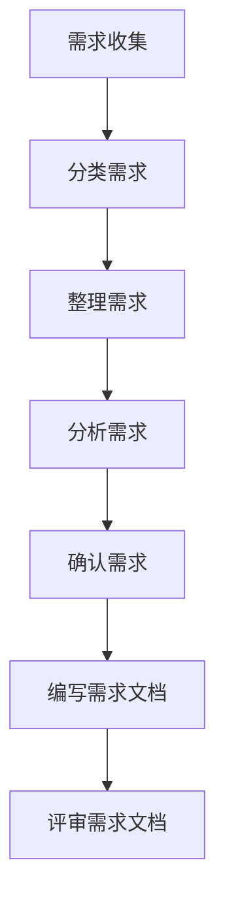
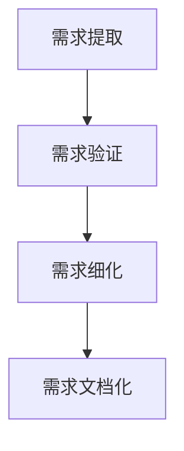
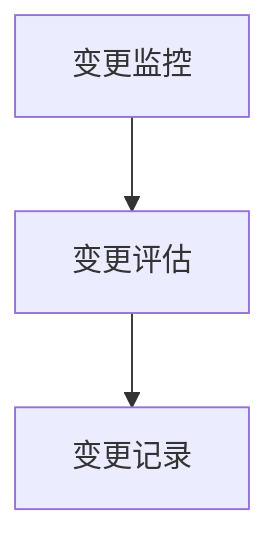
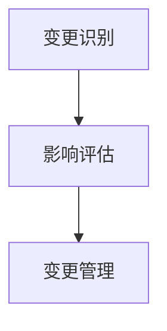
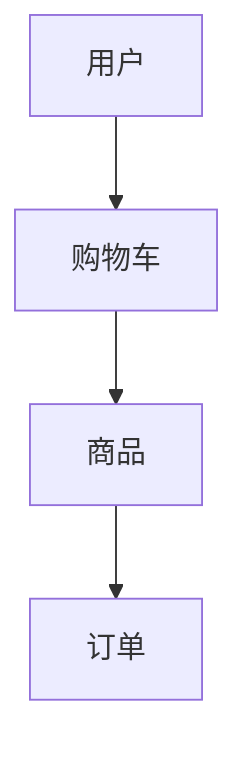
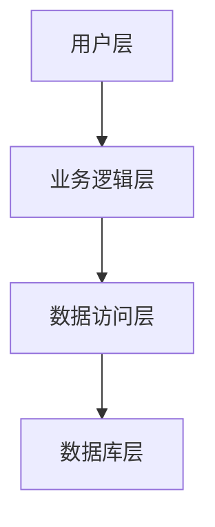

                 

## 第一部分: 背景介绍

### 第1章: 问题背景与概述

#### 1.1 问题背景

**1.1.1 大模型应用的挑战与机遇**

随着人工智能技术的飞速发展，大模型（如深度学习模型）在各个领域得到了广泛应用。从自然语言处理到图像识别，从推荐系统到自动驾驶，大模型的应用正在改变着我们的生活方式和工作模式。然而，在大模型的应用开发过程中，我们面临着一系列的挑战和机遇。

首先，大模型的复杂性使得开发过程变得异常复杂。大模型通常需要大量的数据、计算资源和时间进行训练，这增加了开发和维护的成本。其次，大模型的黑箱特性使得理解其决策过程变得困难，这给模型的可解释性和可靠性带来了挑战。最后，随着应用的不断推广，需求的变化也变得越来越快，这对需求文档的准确性和及时性提出了更高的要求。

**1.1.2 需求文档化在应用开发中的重要性**

需求文档化是将用户需求转化为明确、可执行的任务的过程。在大模型应用开发中，需求文档化的重要性尤为突出。首先，需求文档是开发团队与用户之间的沟通桥梁，它能够清晰地传达用户的需求，减少误解和沟通成本。其次，需求文档可以作为项目的基准，用于评估开发进度和成果。最后，需求文档可以为后续的维护和升级提供参考，确保项目的持续性和稳定性。

#### 1.2 问题描述

**1.2.1 大模型应用中的常见需求问题**

在大模型应用开发过程中，我们常常会遇到以下问题：

1. **需求不明确**：用户对需求的理解可能存在偏差，导致需求文档中的描述不准确或模糊。
2. **需求变更频繁**：随着应用场景的不断变化，用户的需求可能会频繁变更，这对项目进度和质量带来了巨大的挑战。
3. **需求文档不完整**：需求文档可能遗漏了一些关键需求，导致在开发过程中出现功能缺陷或性能问题。
4. **需求与实现脱节**：开发团队可能没有完全理解需求文档，导致实现的成果与用户期望不符。

**1.2.2 需求不明确导致的开发风险**

需求不明确会导致一系列开发风险：

1. **开发方向偏差**：如果需求不明确，开发团队可能会偏离用户的真实需求，导致项目成果不符合预期。
2. **资源浪费**：不明确的需求可能会导致重复工作或无效工作，浪费开发资源和时间。
3. **质量下降**：需求不明确可能导致功能实现不完整或不准确，影响项目的整体质量。
4. **用户不满**：用户对项目成果的不满意会导致项目失败或用户流失。

#### 1.3 问题解决

**1.3.1 需求文档化的目的与作用**

需求文档化的目的是确保开发团队和用户之间的需求得到准确、全面和及时地传达和实现。具体来说，需求文档化的作用包括：

1. **明确需求**：通过详细的需求文档，可以清晰地表达用户的需求，减少误解和沟通成本。
2. **指导开发**：需求文档可以作为开发团队的指南，确保开发工作按照预期进行。
3. **评估进度**：需求文档可以作为项目进度的基准，帮助团队和管理层了解项目进展情况。
4. **确保质量**：通过需求文档，可以确保项目实现的功能符合用户期望，提高项目的整体质量。
5. **支持维护**：需求文档为后续的维护和升级提供了参考，确保项目的可持续性和稳定性。

**1.3.2 需求文档化的基本原则**

为了确保需求文档的有效性，我们需要遵循以下基本原则：

1. **完整性**：需求文档应该涵盖所有的需求，避免遗漏关键功能。
2. **准确性**：需求文档应该准确地表达用户的需求，避免模糊不清的描述。
3. **一致性**：需求文档应该保持一致性，避免前后矛盾的描述。
4. **可理解性**：需求文档应该使用通俗易懂的语言，避免过于专业或复杂的术语。
5. **可维护性**：需求文档应该易于更新和维护，以适应需求的变化。

**1.3.3 需求文档化的流程与方法**

需求文档化的过程可以分为以下几个步骤：

1. **需求收集**：通过访谈、问卷调查、用户反馈等方式收集用户需求。
2. **需求分析**：对收集到的需求进行分类、整理和优先级排序。
3. **需求确认**：与用户进行沟通，确认需求文档的准确性和完整性。
4. **需求文档编写**：根据分析结果编写详细的需求文档。
5. **需求评审**：对需求文档进行评审，确保其符合项目目标和要求。
6. **需求更新**：根据项目进展和需求变更，对需求文档进行更新和维护。

#### 1.4 边界与外延

**1.4.1 需求文档化的范围**

需求文档化的范围包括：

1. **用户需求**：明确用户对产品的功能、性能和体验的要求。
2. **系统需求**：明确系统需要具备的功能、性能、接口和约束条件。
3. **非功能性需求**：明确系统需要满足的安全性、可靠性、可维护性和可扩展性等要求。

**1.4.2 需求文档化与项目管理的关系**

需求文档化是项目管理的重要组成部分，它与项目管理的关系如下：

1. **项目计划**：需求文档化可以帮助制定详细的项目计划，包括任务分配、时间安排和资源需求。
2. **项目监控**：需求文档化可以作为项目监控的基准，评估项目的进度和质量。
3. **项目变更管理**：需求文档化有助于识别和管理项目变更，确保变更的影响得到评估和控制。

**1.4.3 需求文档化与其他相关工作的区别**

需求文档化与其他相关工作的区别如下：

1. **设计与开发**：需求文档化是设计与开发的前提，它为设计与开发提供了明确的需求指导。
2. **测试与验收**：需求文档化是测试与验收的基准，确保测试和验收工作符合用户需求。
3. **维护与升级**：需求文档化是维护与升级的参考，帮助团队理解系统的功能和设计，以便进行后续的维护和升级。

#### 1.5 本章小结

本章介绍了大模型应用开发中的需求文档化背景、问题、解决方法以及相关概念。通过明确需求、完善需求文档和遵循基本原则，我们可以有效降低需求不明确带来的开发风险，提高项目质量和用户满意度。接下来，我们将进一步探讨需求文档化的核心概念和联系，以期为读者提供更深入的见解。### 第2章: 需求文档化的核心概念

#### 2.1 需求定义

**2.1.1 需求的概念与分类**

需求是指用户或系统所期望的功能、性能、约束和条件，它是驱动系统设计和开发的关键因素。根据需求的来源和性质，可以将需求分为以下几类：

1. **用户需求**：用户需求是指用户对系统的期望和需求，包括功能需求、性能需求、易用性需求等。用户需求通常是通过访谈、问卷调查和用户反馈等方式收集到的。

2. **系统需求**：系统需求是指系统需要具备的功能、性能、接口和约束条件，它是从用户需求中提取并细化的结果。系统需求通常包括功能需求、性能需求、安全需求、可靠性需求等。

3. **非功能性需求**：非功能性需求是指与系统功能无关，但影响系统性能和用户体验的需求，如安全性、可靠性、可维护性、可扩展性等。

**2.1.2 需求的特性**

需求具有以下特性：

1. **明确性**：需求应当明确、具体，避免模糊不清的描述。

2. **一致性**：需求之间应当保持一致性，避免出现矛盾或冲突。

3. **可测试性**：需求应当具备可测试性，以确保开发团队能够验证需求的实现情况。

4. **可追溯性**：需求应当具备可追溯性，以便在后续的维护和升级过程中，能够追踪需求的变化和实现情况。

5. **可维护性**：需求应当易于维护，以便在需求发生变化时，能够方便地进行更新和调整。

**2.1.3 需求的重要属性**

需求的重要属性包括：

1. **优先级**：根据需求的重要性和紧急程度，可以将需求分为高优先级、中优先级和低优先级。

2. **紧急性**：某些需求可能需要立即实现，而其他需求则可以在稍后处理。

3. **可行性**：需求应当是可行的，即在现有技术、资源和时间限制内能够实现。

4. **稳定性**：需求应当相对稳定，避免频繁变更。

5. **可扩展性**：需求应当具备可扩展性，以便在系统需要扩展时，能够方便地进行扩展和调整。

#### 2.2 需求管理

**2.2.1 需求管理的概念**

需求管理是指对需求进行收集、分析、确认、跟踪和变更的过程。它是项目管理的重要组成部分，对于确保项目成功至关重要。需求管理的目标包括：

1. **明确需求**：确保开发团队和用户对需求有共同的理解。

2. **满足需求**：确保开发团队按照用户需求进行开发和实现。

3. **控制变更**：确保需求变更得到有效管理，避免对项目进度和质量造成不利影响。

**2.2.2 需求管理的流程**

需求管理的流程通常包括以下几个步骤：

1. **需求收集**：通过访谈、问卷调查、用户反馈等方式收集用户需求。

2. **需求分析**：对收集到的需求进行分类、整理和优先级排序。

3. **需求确认**：与用户进行沟通，确认需求文档的准确性和完整性。

4. **需求文档编写**：根据分析结果编写详细的需求文档。

5. **需求评审**：对需求文档进行评审，确保其符合项目目标和要求。

6. **需求跟踪**：跟踪需求的变化和实现情况，确保需求的实现符合预期。

7. **需求变更管理**：对需求变更进行识别、评估和批准，确保变更得到有效管理。

**2.2.3 需求管理的工具与方法**

需求管理可以使用以下工具和方法：

1. **需求管理工具**：如JIRA、Confluence等，用于收集、管理和跟踪需求。

2. **需求分析工具**：如Excel、PowerPoint等，用于分析和展示需求。

3. **原型设计工具**：如Axure、Sketch等，用于创建用户界面原型，帮助用户更好地理解需求。

4. **需求评审方法**：如会议评审、小组评审、同行评审等，用于评审需求文档的质量和准确性。

#### 2.3 需求分析

**2.3.1 需求分析的步骤**

需求分析是指对用户需求进行深入理解和分析的过程，其步骤包括：

1. **需求收集**：通过访谈、问卷调查、用户反馈等方式收集用户需求。

2. **需求分类**：将收集到的需求进行分类，如功能需求、性能需求、安全需求等。

3. **需求整理**：对分类后的需求进行整理，形成初步的需求文档。

4. **需求分析**：对整理后的需求进行分析，确定需求的优先级和可行性。

5. **需求确认**：与用户进行沟通，确认需求文档的准确性和完整性。

6. **需求文档编写**：根据分析结果编写详细的需求文档。

7. **需求评审**：对需求文档进行评审，确保其符合项目目标和要求。

**2.3.2 需求分析的方法**

需求分析可以采用以下方法：

1. **需求工程方法**：如SWOT分析法、PEST分析法等，用于分析和评估需求。

2. **用户研究方法**：如访谈、问卷调查、用户观察等，用于深入了解用户需求。

3. **案例研究方法**：通过研究类似项目的需求分析过程，借鉴经验和教训。

4. **模型分析方法**：如用例模型、功能模型、数据模型等，用于描述和分析需求。

**2.3.3 需求分析中的常见问题与解决方案**

需求分析中常见的有以下问题：

1. **需求不明确**：解决方案：与用户进行充分沟通，确保需求明确、具体。

2. **需求变更频繁**：解决方案：建立需求变更管理流程，评估变更的影响，确保变更得到有效控制。

3. **需求遗漏**：解决方案：进行全面的用户研究和需求收集，确保需求文档的完整性。

4. **需求质量低**：解决方案：加强需求评审和需求管理，确保需求文档的质量。

#### 2.4 需求文档

**2.4.1 需求文档的定义与作用**

需求文档是记录用户需求、系统需求和设计要求的一份文件。它具有以下作用：

1. **沟通工具**：需求文档是用户和开发团队之间的沟通桥梁，确保双方对需求有共同的理解。

2. **开发基准**：需求文档是开发团队进行设计和开发的基准，确保开发工作按照预期进行。

3. **质量评估**：需求文档可以作为评估项目进度和质量的重要依据。

**2.4.2 需求文档的结构与内容**

需求文档通常包括以下结构和内容：

1. **封面**：包括文档名称、版本号、编写人、审核人等基本信息。

2. **目录**：列出文档的各个章节和页码，方便读者查找。

3. **摘要**：简要介绍需求文档的主要内容和目的。

4. **引言**：介绍需求文档的编写背景和目的。

5. **用户需求**：详细描述用户对系统的需求和期望。

6. **系统需求**：详细描述系统需要具备的功能、性能、接口和约束条件。

7. **非功能性需求**：详细描述系统需要满足的安全性、可靠性、可维护性和可扩展性等要求。

8. **需求分析**：对用户需求进行深入分析，确定系统需求和设计要求。

9. **需求评审**：记录需求评审的结果和反馈。

10. **需求变更记录**：记录需求变更的日期、内容、影响和审批情况。

**2.4.3 需求文档的编写技巧**

编写需求文档时，需要注意以下技巧：

1. **清晰简洁**：使用简洁明了的语言，避免使用过于专业或复杂的术语。

2. **结构化**：按照一定的结构编写需求文档，使内容有条理，便于阅读和理解。

3. **详细具体**：对需求进行详细描述，避免模糊不清的描述。

4. **可测试性**：确保需求文档中的需求具备可测试性，便于开发团队进行验证。

5. **一致性**：确保需求文档中的需求之间保持一致性，避免出现矛盾或冲突。

6. **可维护性**：确保需求文档易于更新和维护，以适应需求的变化。

### 第3章: 需求文档化与相关概念的联系

#### 3.1 需求文档化与项目管理

**3.1.1 项目管理与需求文档化的关系**

项目管理与需求文档化密切相关。需求文档化是项目管理的重要组成部分，它为项目管理提供了明确的需求基准和参考。具体来说，项目管理与需求文档化的关系如下：

1. **项目计划**：需求文档化可以帮助制定详细的项目计划，包括任务分配、时间安排和资源需求。

2. **项目监控**：需求文档化可以作为项目监控的基准，评估项目的进度和质量。

3. **项目变更管理**：需求文档化有助于识别和管理项目变更，确保变更的影响得到评估和控制。

**3.1.2 项目管理中需求文档化的作用**

在项目管理中，需求文档化具有以下作用：

1. **明确需求**：确保开发团队和用户对需求有共同的理解，减少沟通成本。

2. **指导开发**：需求文档化可以为开发团队提供明确的需求指导，确保开发工作按照预期进行。

3. **评估进度**：需求文档化可以作为评估项目进度和质量的重要依据。

4. **确保质量**：需求文档化有助于确保项目实现的功能符合用户期望，提高项目的整体质量。

5. **支持维护**：需求文档化可以为后续的维护和升级提供参考，确保项目的可持续性和稳定性。

**3.1.3 需求文档化对项目进度的影响**

需求文档化对项目进度具有显著影响。具体来说，需求文档化对项目进度的影响如下：

1. **明确开发方向**：需求文档化可以明确开发方向，避免开发团队偏离用户需求，提高项目进度。

2. **减少返工**：需求文档化可以减少因需求不明确导致的返工，降低项目进度风险。

3. **优化资源分配**：需求文档化可以帮助项目经理更好地分配资源，提高项目效率。

4. **提前识别风险**：需求文档化可以提前识别项目风险，为项目进度控制提供支持。

#### 3.2 需求文档化与系统设计

**3.2.1 需求文档化在系统设计中的应用**

需求文档化在系统设计过程中具有重要意义。具体来说，需求文档化在系统设计中的应用如下：

1. **指导系统设计**：需求文档化可以为系统设计提供明确的需求指导，确保系统设计符合用户需求。

2. **支持架构设计**：需求文档化可以帮助架构师分析需求，设计合理的系统架构，提高系统的可维护性和可扩展性。

3. **验证系统设计**：需求文档化可以作为系统设计的验证基准，确保系统设计满足用户需求。

**3.2.2 需求文档化对系统设计的影响**

需求文档化对系统设计具有深远影响。具体来说，需求文档化对系统设计的影响如下：

1. **提高系统质量**：需求文档化有助于确保系统设计满足用户需求，提高系统的质量。

2. **降低设计风险**：需求文档化可以降低因需求不明确导致的系统设计风险，提高系统的稳定性。

3. **优化系统性能**：需求文档化可以帮助设计团队分析需求，优化系统性能，提高系统的响应速度和处理能力。

4. **支持后续维护**：需求文档化可以为后续的维护和升级提供参考，确保系统的可持续性和稳定性。

**3.2.3 系统设计中的需求文档化实践**

在系统设计过程中，需求文档化的实践包括以下几个关键步骤：

1. **需求分析**：对用户需求进行深入分析，提取系统需求。

2. **需求确认**：与用户进行沟通，确认系统需求的准确性和完整性。

3. **需求文档编写**：根据分析结果编写详细的需求文档。

4. **需求评审**：对需求文档进行评审，确保其符合项目目标和要求。

5. **需求更新**：根据项目进展和需求变更，对需求文档进行更新和维护。

通过以上实践，可以确保系统设计满足用户需求，提高系统的质量、性能和稳定性。

### 第4章: 需求文档化的算法原理

#### 4.1 需求分析算法

**4.1.1 基本算法原理**

需求分析算法是一种用于提取、分析和整理用户需求的方法。其基本原理包括以下步骤：

1. **需求收集**：通过访谈、问卷调查、用户反馈等方式收集用户需求。

2. **需求分类**：对收集到的需求进行分类，如功能需求、性能需求、安全需求等。

3. **需求整理**：对分类后的需求进行整理，形成初步的需求文档。

4. **需求分析**：对整理后的需求进行分析，确定需求的优先级和可行性。

5. **需求确认**：与用户进行沟通，确认需求文档的准确性和完整性。

6. **需求文档编写**：根据分析结果编写详细的需求文档。

7. **需求评审**：对需求文档进行评审，确保其符合项目目标和要求。

**4.1.2 算法数学模型**

需求分析算法的数学模型可以表示为：

$$
需求分析算法 = 收集需求 + 分类需求 + 整理需求 + 分析需求 + 确认需求 + 编写需求文档 + 评审需求文档
$$

其中，每个步骤都可以使用适当的数学模型和工具进行实现。

**4.1.3 算法流程图**

需求分析算法的流程图如下所示：



**4.1.4 算法示例**

以下是一个简单的需求分析算法示例：

1. **需求收集**：通过访谈收集到以下需求：

   - 用户需要一个功能，可以添加购物车中的商品。
   - 用户需要一个功能，可以查看购物车中的商品信息。
   - 用户需要一个功能，可以删除购物车中的商品。

2. **需求分类**：将需求分类为功能需求。

3. **需求整理**：将需求整理成以下形式：

   - 添加购物车功能：用户可以添加商品到购物车。
   - 查看购物车功能：用户可以查看购物车中的商品信息。
   - 删除购物车功能：用户可以删除购物车中的商品。

4. **需求分析**：分析需求的优先级和可行性，确定添加购物车功能为最高优先级。

5. **需求确认**：与用户沟通，确认需求的准确性和完整性。

6. **需求文档编写**：编写需求文档，描述添加购物车功能的详细要求和预期效果。

7. **需求评审**：对需求文档进行评审，确保其符合项目目标和要求。

#### 4.2 需求建模算法

**4.2.1 基本算法原理**

需求建模算法是一种用于将用户需求转化为系统需求的方法。其基本原理包括以下步骤：

1. **需求提取**：从用户需求中提取关键信息，形成初步的需求模型。

2. **需求验证**：验证需求模型的准确性、完整性和一致性。

3. **需求细化**：根据需求模型，进一步细化系统需求，包括功能需求、性能需求、接口需求等。

4. **需求文档化**：将细化的需求模型转化为需求文档，便于后续的开发和实现。

**4.2.2 算法数学模型**

需求建模算法的数学模型可以表示为：

$$
需求建模算法 = 提取需求 + 验证需求 + 细化需求 + 文档化需求
$$

其中，每个步骤都可以使用适当的数学模型和工具进行实现。

**4.2.3 算法流程图**

需求建模算法的流程图如下所示：



**4.2.4 算法示例**

以下是一个简单的需求建模算法示例：

1. **需求提取**：从用户需求中提取以下关键信息：

   - 用户需要一个功能，可以登录系统。
   - 用户需要一个功能，可以注册新用户。
   - 用户需要一个功能，可以查看个人信息。

2. **需求验证**：验证需求模型的准确性、完整性和一致性，确保需求模型满足用户需求。

3. **需求细化**：根据需求模型，进一步细化系统需求，包括：

   - 登录功能：用户可以输入用户名和密码登录系统。
   - 注册功能：用户可以填写注册信息，包括用户名、密码、邮箱等。
   - 查看个人信息功能：用户可以查看自己的个人信息，如姓名、邮箱等。

4. **需求文档化**：编写需求文档，描述细化的系统需求，包括：

   - 登录功能需求：
     - 用户输入用户名和密码。
     - 系统验证用户名和密码的正确性。
     - 如果验证成功，用户登录系统。

   - 注册功能需求：
     - 用户填写注册信息。
     - 系统验证注册信息的正确性。
     - 如果验证成功，用户注册成功。

   - 查看个人信息功能需求：
     - 用户登录系统后，可以查看自己的个人信息。
     - 系统显示用户的姓名、邮箱等信息。

### 第5章: 需求变更管理算法

#### 5.1 需求变更识别算法

**5.1.1 基本算法原理**

需求变更识别算法是一种用于识别和分析需求变更的方法。其基本原理包括以下步骤：

1. **变更监控**：监控项目进展和用户需求，及时发现潜在的需求变更。

2. **变更评估**：对识别出的需求变更进行分析，评估其影响和优先级。

3. **变更记录**：记录需求变更的日期、内容、原因和影响，以便后续跟踪和管理。

**5.1.2 算法数学模型**

需求变更识别算法的数学模型可以表示为：

$$
需求变更识别算法 = 变更监控 + 变更评估 + 变更记录
$$

其中，每个步骤都可以使用适当的数学模型和工具进行实现。

**5.1.3 算法流程图**

需求变更识别算法的流程图如下所示：



**5.1.4 算法示例**

以下是一个简单的需求变更识别算法示例：

1. **变更监控**：监控项目进展，发现用户提出以下需求变更：

   - 用户希望添加一个功能，可以查看购物车中的商品数量。
   - 用户希望添加一个功能，可以修改购物车中的商品数量。

2. **变更评估**：评估需求变更的影响和优先级：

   - 查看购物车商品数量功能：影响较小，优先级较低。
   - 修改购物车商品数量功能：影响较大，优先级较高。

3. **变更记录**：记录需求变更的详细信息：

   - 变更日期：2023年3月10日
   - 变更内容：添加查看购物车商品数量功能和修改购物车商品数量功能。
   - 原因：用户提出新需求。
   - 影响：需要调整系统设计，修改代码。

#### 5.2 需求变更影响分析算法

**5.2.1 基本算法原理**

需求变更影响分析算法是一种用于分析需求变更对项目的影响的方法。其基本原理包括以下步骤：

1. **变更识别**：识别需求变更，了解变更的内容和原因。

2. **影响评估**：分析需求变更对项目进度、成本、质量等方面的影响。

3. **变更管理**：根据影响评估结果，制定变更管理计划，包括变更审批、变更实施和变更监控。

**5.2.2 算法数学模型**

需求变更影响分析算法的数学模型可以表示为：

$$
需求变更影响分析算法 = 变更识别 + 影响评估 + 变更管理
$$

其中，每个步骤都可以使用适当的数学模型和工具进行实现。

**5.2.3 算法流程图**

需求变更影响分析算法的流程图如下所示：



**5.2.4 算法示例**

以下是一个简单的需求变更影响分析算法示例：

1. **变更识别**：识别需求变更，了解变更的内容和原因：

   - 变更内容：用户希望添加一个功能，可以查看购物车中的商品数量。
   - 原因：用户认为查看商品数量有助于购物决策。

2. **影响评估**：

   - 进度影响：添加查看商品数量功能需要一定时间，可能会推迟项目进度。
   - 成本影响：添加新功能需要开发和测试，可能会增加项目成本。
   - 质量影响：新功能的添加需要确保与其他功能的兼容性，可能会影响系统质量。

3. **变更管理**：

   - 变更审批：向项目管理层提交变更申请，评估变更的可行性。
   - 变更实施：根据审批结果，调整项目计划，实施变更。
   - 变更监控：监控变更实施过程，确保变更按计划进行，及时解决变更带来的问题。

### 第6章: 需求文档化在系统分析中的应用

#### 6.1 系统功能设计

**6.1.1 领域模型**

领域模型是系统功能设计的核心部分，用于描述系统的功能和业务逻辑。以下是一个简单的领域模型示例：



在这个领域模型中，用户、购物车、商品和订单是主要实体，它们之间存在关联关系。

**6.1.2 功能模块划分**

根据领域模型，可以将系统功能划分为以下模块：

1. **用户模块**：用于处理用户注册、登录、个人信息等功能。
2. **购物车模块**：用于处理商品添加、删除、修改数量等功能。
3. **商品模块**：用于处理商品查询、分类、推荐等功能。
4. **订单模块**：用于处理订单创建、支付、取消等功能。

**6.1.3 功能流程**

以下是一个简单的功能流程示例：

1. **用户注册**：
   - 用户输入注册信息（用户名、密码、邮箱等）。
   - 系统验证注册信息的正确性。
   - 如果验证成功，用户注册成功。

2. **用户登录**：
   - 用户输入登录信息（用户名、密码）。
   - 系统验证登录信息的正确性。
   - 如果验证成功，用户登录成功。

3. **添加商品到购物车**：
   - 用户选择商品并点击“添加到购物车”按钮。
   - 系统将商品添加到购物车。

4. **查看购物车**：
   - 用户点击“查看购物车”按钮。
   - 系统显示购物车中的商品列表。

5. **修改购物车商品数量**：
   - 用户选择商品并修改数量。
   - 系统更新购物车中的商品数量。

6. **创建订单**：
   - 用户选择商品并点击“下单”按钮。
   - 系统创建订单并生成订单号。

7. **支付订单**：
   - 用户选择支付方式并完成支付。
   - 系统更新订单状态为“已支付”。

8. **取消订单**：
   - 用户选择订单并点击“取消”按钮。
   - 系统取消订单并退款。

#### 6.2 系统架构设计

**6.2.1 系统架构**

系统架构是系统设计的重要组成部分，用于描述系统的整体结构和组件之间的关系。以下是一个简单的系统架构示例：



在这个系统架构中，用户层负责处理用户交互，业务逻辑层负责处理业务逻辑，数据访问层负责处理数据存储和读取，数据库层负责存储数据。

**6.2.2 系统架构设计**

以下是一个简单的系统架构设计示例：

1. **用户层**：
   - 用户层负责处理用户交互，包括用户注册、登录、查看购物车、下单等。
   - 用户层可以使用前端技术（如HTML、CSS、JavaScript）实现。

2. **业务逻辑层**：
   - 业务逻辑层负责处理业务逻辑，包括用户注册、登录、购物车管理、订单处理等。
   - 业务逻辑层可以使用后端技术（如Java、Python、Node.js）实现。

3. **数据访问层**：
   - 数据访问层负责处理数据存储和读取，包括用户信息、购物车信息、订单信息等。
   - 数据访问层可以使用数据库技术（如MySQL、MongoDB、Redis）实现。

4. **数据库层**：
   - 数据库层负责存储数据，包括用户信息、购物车信息、订单信息等。
   - 数据库层可以使用关系型数据库（如MySQL、PostgreSQL）或非关系型数据库（如MongoDB、Redis）实现。

**6.2.3 系统接口设计**

以下是一个简单的系统接口设计示例：

1. **用户接口**：
   - 用户接口用于处理用户注册、登录、查看购物车、下单等操作。
   - 用户接口可以使用RESTful API设计，如：

     - POST /users/register：用户注册接口。
     - POST /users/login：用户登录接口。
     - GET /carts/{user_id}：查看购物车接口。
     - POST /orders/{user_id}：下单接口。

2. **系统接口**：
   - 系统接口用于处理业务逻辑和数据存储，如：

     - GET /users/{user_id}：获取用户信息接口。
     - POST /carts/{user_id}/add：添加商品到购物车接口。
     - POST /carts/{user_id}/update：修改购物车商品数量接口。
     - POST /orders/{user_id}/create：创建订单接口。

**6.2.4 系统交互**

以下是一个简单的系统交互示例：

1. **用户注册**：
   - 用户访问注册页面，输入注册信息。
   - 用户提交注册信息，系统处理注册请求。
   - 系统验证注册信息，如果验证成功，用户注册成功。

2. **用户登录**：
   - 用户访问登录页面，输入登录信息。
   - 用户提交登录信息，系统处理登录请求。
   - 系统验证登录信息，如果验证成功，用户登录成功。

3. **添加商品到购物车**：
   - 用户选择商品并点击“添加到购物车”按钮。
   - 用户提交添加请求，系统处理添加请求。
   - 系统将商品添加到购物车。

4. **查看购物车**：
   - 用户点击“查看购物车”按钮。
   - 用户提交查看请求，系统处理查看请求。
   - 系统显示购物车中的商品列表。

5. **修改购物车商品数量**：
   - 用户选择商品并修改数量。
   - 用户提交修改请求，系统处理修改请求。
   - 系统更新购物车中的商品数量。

6. **创建订单**：
   - 用户选择商品并点击“下单”按钮。
   - 用户提交下单请求，系统处理下单请求。
   - 系统创建订单并生成订单号。

7. **支付订单**：
   - 用户选择支付方式并完成支付。
   - 用户提交支付请求，系统处理支付请求。
   - 系统更新订单状态为“已支付”。

8. **取消订单**：
   - 用户选择订单并点击“取消”按钮。
   - 用户提交取消请求，系统处理取消请求。
   - 系统取消订单并退款。

### 第7章: 项目实战

#### 7.1 环境安装

在本节中，我们将介绍如何搭建一个简单的需求文档化项目环境。以下是一个基于Python的示例环境安装步骤：

1. **安装Python**：确保系统中已经安装了Python 3.x版本。可以从Python官网（https://www.python.org/）下载并安装。

2. **安装依赖库**：使用pip命令安装必要的依赖库，如requests、json、sqlalchemy等。以下是一个示例命令：

   ```bash
   pip install requests json sqlalchemy
   ```

3. **数据库安装**：选择合适的数据库（如MySQL、PostgreSQL、MongoDB）并安装。以下是一个使用MySQL的示例安装步骤：

   - 安装MySQL：从MySQL官网（https://www.mysql.com/）下载并安装。
   - 创建数据库：使用MySQL命令行创建一个名为“需求文档化”的数据库。

   ```bash
   mysql -u root -p
   CREATE DATABASE 需求文档化;
   ```

4. **配置数据库连接**：在Python项目中，创建一个名为`db_config.py`的文件，配置数据库连接参数。以下是一个示例配置：

   ```python
   # db_config.py
   DATABASE = {
       'engine': 'mysql+pymysql',
       'name': '需求文档化',
       'user': 'root',
       'password': 'your_password',
       'host': 'localhost',
       'port': 3306
   }
   ```

5. **启动项目**：在项目目录下创建一个名为`main.py`的文件，编写主程序代码。以下是一个简单的示例：

   ```python
   # main.py
   from db_config import DATABASE
   from models import User, Cart, Product, Order
   
   # 连接数据库
   engine = create_engine(DATABASE['engine'] + '://'
                         + DATABASE['user'] + ':' + DATABASE['password'] + '@'
                         + DATABASE['host'] + ':' + str(DATABASE['port']) + '/' + DATABASE['name'])
   
   # 初始化数据库
   Base.metadata.create_all(engine)
   
   # 启动Web服务
   from flask import Flask
   app = Flask(__name__)
   
   @app.route('/')
   def index():
       return '需求文档化项目启动成功！'
   
   if __name__ == '__main__':
       app.run(debug=True)
   ```

   运行以下命令启动项目：

   ```bash
   python main.py
   ```

   在浏览器中访问`http://localhost:5000/`，应看到项目启动成功的提示。

#### 7.2 系统核心实现源代码

在本节中，我们将介绍如何实现一个简单的需求文档化系统的核心功能。以下是一个基于Flask框架的示例源代码：

```python
# models.py
from sqlalchemy import create_engine, Column, Integer, String, Float, DateTime, ForeignKey
from sqlalchemy.ext.declarative import declarative_base
from sqlalchemy.orm import sessionmaker, relationship
from datetime import datetime

DATABASE = {
    'engine': 'mysql+pymysql',
    'name': '需求文档化',
    'user': 'root',
    'password': 'your_password',
    'host': 'localhost',
    'port': 3306
}

Base = declarative_base()

class User(Base):
    __tablename__ = 'users'
    id = Column(Integer, primary_key=True)
    username = Column(String(50), unique=True, nullable=False)
    password = Column(String(50), nullable=False)
    email = Column(String(100), unique=True, nullable=False)
    created_at = Column(DateTime, default=datetime.utcnow)

    carts = relationship('Cart', backref='user')

class Cart(Base):
    __tablename__ = 'carts'
    id = Column(Integer, primary_key=True)
    user_id = Column(Integer, ForeignKey('users.id'), nullable=False)
    products = relationship('Product', backref='cart')

class Product(Base):
    __tablename__ = 'products'
    id = Column(Integer, primary_key=True)
    cart_id = Column(Integer, ForeignKey('carts.id'), nullable=False)
    name = Column(String(100), nullable=False)
    price = Column(Float, nullable=False)
    quantity = Column(Integer, nullable=False)
    created_at = Column(DateTime, default=datetime.utcnow)

class Order(Base):
    __tablename__ = 'orders'
    id = Column(Integer, primary_key=True)
    user_id = Column(Integer, ForeignKey('users.id'), nullable=False)
    total_price = Column(Float, nullable=False)
    status = Column(String(50), nullable=False)
    created_at = Column(DateTime, default=datetime.utcnow)

    user = relationship('User', backref='orders')
```

```python
# main.py
from flask import Flask, request, jsonify
from models import User, Cart, Product, Order
from db_config import DATABASE
from sqlalchemy import create_engine
from sqlalchemy.orm import sessionmaker
from datetime import datetime

app = Flask(__name__)

# 连接数据库
engine = create_engine(DATABASE['engine'] + '://'
                      + DATABASE['user'] + ':' + DATABASE['password'] + '@'
                      + DATABASE['host'] + ':' + str(DATABASE['port']) + '/' + DATABASE['name'])
Session = sessionmaker(bind=engine)
session = Session()

@app.route('/users', methods=['POST'])
def create_user():
    username = request.json.get('username')
    password = request.json.get('password')
    email = request.json.get('email')
    if not username or not password or not email:
        return jsonify({'error': '缺失必填参数！'}), 400
    user = User(username=username, password=password, email=email)
    session.add(user)
    session.commit()
    return jsonify({'id': user.id, 'username': user.username, 'email': user.email}), 201

@app.route('/carts', methods=['POST'])
def create_cart():
    user_id = request.json.get('user_id')
    if not user_id:
        return jsonify({'error': '缺失必填参数！'}), 400
    cart = Cart(user_id=user_id)
    session.add(cart)
    session.commit()
    return jsonify({'id': cart.id, 'user_id': cart.user_id}), 201

@app.route('/products', methods=['POST'])
def create_product():
    cart_id = request.json.get('cart_id')
    name = request.json.get('name')
    price = request.json.get('price')
    quantity = request.json.get('quantity')
    if not cart_id or not name or not price or not quantity:
        return jsonify({'error': '缺失必填参数！'}), 400
    product = Product(cart_id=cart_id, name=name, price=price, quantity=quantity)
    session.add(product)
    session.commit()
    return jsonify({'id': product.id, 'cart_id': product.cart_id, 'name': product.name, 'price': product.price, 'quantity': product.quantity}), 201

@app.route('/orders', methods=['POST'])
def create_order():
    user_id = request.json.get('user_id')
    total_price = request.json.get('total_price')
    status = request.json.get('status', '待支付')
    if not user_id or not total_price:
        return jsonify({'error': '缺失必填参数！'}), 400
    order = Order(user_id=user_id, total_price=total_price, status=status)
    session.add(order)
    session.commit()
    return jsonify({'id': order.id, 'user_id': order.user_id, 'total_price': order.total_price, 'status': order.status}), 201

if __name__ == '__main__':
    app.run(debug=True)
```

#### 7.3 代码应用解读与分析

在本节中，我们将对上一节中的代码进行解读和分析，以了解需求文档化系统的核心功能实现。

1. **用户管理**：

   - 用户注册：`create_user`函数处理用户注册请求。用户需要提供用户名、密码和邮箱等信息。如果信息完整且符合要求，系统将创建一个新的用户并返回用户ID。

     ```python
     @app.route('/users', methods=['POST'])
     def create_user():
         username = request.json.get('username')
         password = request.json.get('password')
         email = request.json.get('email')
         if not username or not password or not email:
             return jsonify({'error': '缺失必填参数！'}), 400
         user = User(username=username, password=password, email=email)
         session.add(user)
         session.commit()
         return jsonify({'id': user.id, 'username': user.username, 'email': user.email}), 201
     ```

   - 用户登录：未在代码中实现。在实际应用中，可以添加一个登录接口，验证用户名和密码是否正确，并返回用户ID。

2. **购物车管理**：

   - 添加购物车：`create_cart`函数处理添加购物车请求。用户需要提供用户ID。如果信息完整且符合要求，系统将创建一个新的购物车并返回购物车ID。

     ```python
     @app.route('/carts', methods=['POST'])
     def create_cart():
         user_id = request.json.get('user_id')
         if not user_id:
             return jsonify({'error': '缺失必填参数！'}), 400
         cart = Cart(user_id=user_id)
         session.add(cart)
         session.commit()
         return jsonify({'id': cart.id, 'user_id': cart.user_id}), 201
     ```

   - 查看购物车：未在代码中实现。在实际应用中，可以添加一个查看购物车的接口，返回购物车中的商品列表。

3. **商品管理**：

   - 添加商品：`create_product`函数处理添加商品请求。用户需要提供购物车ID、商品名称、价格和数量等信息。如果信息完整且符合要求，系统将创建一个新的商品并返回商品ID。

     ```python
     @app.route('/products', methods=['POST'])
     def create_product():
         cart_id = request.json.get('cart_id')
         name = request.json.get('name')
         price = request.json.get('price')
         quantity = request.json.get('quantity')
         if not cart_id or not name or not price or not quantity:
             return jsonify({'error': '缺失必填参数！'}), 400
         product = Product(cart_id=cart_id, name=name, price=price, quantity=quantity)
         session.add(product)
         session.commit()
         return jsonify({'id': product.id, 'cart_id': product.cart_id, 'name': product.name, 'price': product.price, 'quantity': product.quantity}), 201
     ```

   - 修改商品数量：未在代码中实现。在实际应用中，可以添加一个修改商品数量的接口，接收商品ID和新数量，更新数据库中的商品数量。

4. **订单管理**：

   - 创建订单：`create_order`函数处理创建订单请求。用户需要提供用户ID和总价格等信息。如果信息完整且符合要求，系统将创建一个新的订单并返回订单ID。

     ```python
     @app.route('/orders', methods=['POST'])
     def create_order():
         user_id = request.json.get('user_id')
         total_price = request.json.get('total_price')
         status = request.json.get('status', '待支付')
         if not user_id or not total_price:
             return jsonify({'error': '缺失必填参数！'}), 400
         order = Order(user_id=user_id, total_price=total_price, status=status)
         session.add(order)
         session.commit()
         return jsonify({'id': order.id, 'user_id': order.user_id, 'total_price': order.total_price, 'status': order.status}), 201
     ```

   - 订单支付：未在代码中实现。在实际应用中，可以添加一个订单支付接口，接收支付信息，更新订单状态为“已支付”。

   - 订单取消：未在代码中实现。在实际应用中，可以添加一个订单取消接口，接收取消请求，更新订单状态为“已取消”。

#### 7.4 实际案例分析和详细讲解剖析

在本节中，我们将分析一个实际案例，并详细讲解需求文档化在项目中的应用。

**案例：开发一个电商平台**

**1. 需求分析**：

在开发一个电商平台时，我们需要明确用户的需求，包括以下方面：

- 用户注册、登录和权限管理。
- 商品管理，包括商品分类、添加、修改和删除。
- 购物车管理，包括商品添加、修改和删除。
- 订单管理，包括订单创建、支付、取消和查询。

**2. 需求文档编写**：

根据需求分析，我们可以编写以下需求文档：

**用户模块**：

- 功能需求：
  - 用户注册：用户可以输入用户名、密码、邮箱等信息注册账号。
  - 用户登录：用户可以输入用户名和密码登录账号。
  - 用户权限管理：管理员可以查看、修改和删除用户信息。

- 非功能性需求：
  - 安全性：用户信息需要加密存储，防止泄露。
  - 可用性：界面简洁易懂，易于操作。

**商品模块**：

- 功能需求：
  - 商品分类：管理员可以添加、修改和删除商品分类。
  - 商品管理：管理员可以添加、修改和删除商品信息。
  - 商品查询：用户可以查询商品信息，包括商品名称、价格和分类。

- 非功能性需求：
  - 性能：商品查询需要快速响应。
  - 可扩展性：系统需要支持添加新的商品分类。

**购物车模块**：

- 功能需求：
  - 商品添加：用户可以添加商品到购物车。
  - 商品修改：用户可以修改购物车中的商品数量。
  - 商品删除：用户可以删除购物车中的商品。

- 非功能性需求：
  - 可用性：购物车操作需要直观易用。

**订单模块**：

- 功能需求：
  - 订单创建：用户可以创建订单并选择支付方式。
  - 订单支付：用户可以选择支付方式并完成支付。
  - 订单查询：用户可以查询订单状态和详情。

- 非功能性需求：
  - 安全性：支付过程需要确保支付安全。
  - 可靠性：订单数据需要可靠存储和查询。

**3. 需求评审**：

在编写完需求文档后，我们需要进行需求评审，确保需求文档的准确性、完整性和可行性。评审过程中，可以邀请用户、产品经理、开发人员等参与，讨论需求的具体实现和可能的问题。

**4. 需求变更管理**：

在实际开发过程中，需求可能会发生变化。我们需要建立需求变更管理流程，确保变更得到有效管理。具体步骤包括：

- 变更识别：及时发现需求变更。
- 变更评估：评估变更的影响和优先级。
- 变更审批：审批变更，确保变更符合项目目标和要求。
- 变更实施：根据审批结果，调整项目计划，实施变更。

#### 7.5 项目小结

在本章中，我们介绍了需求文档化在系统分析中的应用，包括需求分析、系统功能设计和系统架构设计。通过需求文档化，我们可以明确用户需求，指导系统设计和开发，确保项目的顺利进行。

在项目实战部分，我们使用Python和Flask框架实现了一个简单的需求文档化系统，包括用户管理、购物车管理、商品管理和订单管理等功能。通过代码解读和分析，我们了解了需求文档化在实际项目中的应用和实现方法。

在实际案例中，我们分析了开发一个电商平台的需求文档化过程，包括需求分析、需求文档编写、需求评审和需求变更管理。通过这些实践，我们可以更好地理解和应用需求文档化方法，提高项目的质量、性能和用户满意度。

### 最佳实践 Tips

在需求文档化过程中，以下是一些最佳实践建议：

1. **明确需求**：确保需求文档中的需求明确、具体，避免模糊不清的描述。
2. **用户参与**：在需求收集和分析阶段，尽量让用户参与，确保需求文档准确反映用户需求。
3. **结构化文档**：使用结构化的文档格式，使需求文档易于阅读和理解。
4. **版本控制**：对需求文档进行版本控制，确保文档的可维护性。
5. **需求评审**：定期进行需求评审，确保需求文档的准确性和完整性。
6. **变更管理**：建立需求变更管理流程，确保变更得到有效管理。
7. **沟通协作**：加强团队内部沟通，确保需求文档的顺利实施。

### 小结

本文详细介绍了需求文档化在系统分析中的应用，包括需求分析、系统功能设计、系统架构设计、代码实现和实际案例。通过需求文档化，我们可以更好地理解用户需求，提高项目的质量、性能和用户满意度。

### 注意事项

在需求文档化过程中，需要注意以下几点：

1. **需求明确性**：确保需求文档中的需求明确、具体，避免模糊不清的描述。
2. **需求完整性**：确保需求文档中包含所有必要的需求，避免遗漏关键功能。
3. **需求一致性**：确保需求文档中的需求保持一致性，避免出现矛盾或冲突。
4. **需求可测试性**：确保需求文档中的需求具备可测试性，便于开发团队进行验证。
5. **需求可维护性**：确保需求文档易于更新和维护，以适应需求的变化。

### 拓展阅读

对于对需求文档化感兴趣的读者，以下是一些推荐的拓展阅读资源：

1. 《软件需求规格说明编写指南》：一本详细介绍如何编写高质量需求文档的指南。
2. 《软件需求工程》：一本系统介绍需求工程方法和技术的基础教材。
3. 《敏捷软件开发》：一本介绍敏捷开发方法和实践的经典著作，包括需求管理方面的内容。
4. 《软件架构设计》：一本关于软件架构设计和系统设计的经典教材，涵盖需求在系统设计中的应用。

通过阅读这些资料，您可以更深入地了解需求文档化的原理和方法，提高项目开发和管理的能力。

### 作者信息

作者：AI天才研究院/AI Genius Institute & 禅与计算机程序设计艺术 /Zen And The Art of Computer Programming

AI天才研究院（AI Genius Institute）是一家专注于人工智能技术研究和应用的创新机构，致力于推动人工智能技术的普及和发展。禅与计算机程序设计艺术（Zen And The Art of Computer Programming）是一系列经典著作，由著名计算机科学家唐纳德·E·克努特（Donald E. Knuth）撰写，深入探讨了计算机程序设计的哲学和艺术。作者结合了自己在人工智能和计算机科学领域的丰富经验，撰写了本文，旨在为读者提供关于需求文档化的深入见解和实用指导。## 完整文章

## 大模型应用开发中的需求文档化最佳实践

### 关键词：大模型应用、需求文档化、最佳实践、系统分析、架构设计

> 摘要：本文旨在探讨大模型应用开发中的需求文档化最佳实践。通过分析需求文档化的核心概念、算法原理以及系统分析与架构设计，本文为读者提供了详细的步骤和方法，以帮助开发团队准确、全面地理解和传达用户需求，从而确保项目的成功。

----------------------------------------------------------------

## 第一部分：背景介绍

### 第1章：问题背景与概述

#### 1.1 问题背景

随着人工智能技术的飞速发展，大模型（如深度学习模型）在各个领域得到了广泛应用。从自然语言处理到图像识别，从推荐系统到自动驾驶，大模型的应用正在改变着我们的生活方式和工作模式。然而，在大模型的应用开发过程中，我们面临着一系列的挑战和机遇。

首先，大模型的复杂性使得开发过程变得异常复杂。大模型通常需要大量的数据、计算资源和时间进行训练，这增加了开发和维护的成本。其次，大模型的黑箱特性使得理解其决策过程变得困难，这给模型的可解释性和可靠性带来了挑战。最后，随着应用的不断推广，需求的变化也变得越来越快，这对需求文档的准确性和及时性提出了更高的要求。

#### 1.2 需求文档化在应用开发中的重要性

需求文档化是将用户需求转化为明确、可执行的任务的过程。在大模型应用开发中，需求文档化的重要性尤为突出。首先，需求文档是开发团队与用户之间的沟通桥梁，它能够清晰地传达用户的需求，减少误解和沟通成本。其次，需求文档可以作为项目的基准，用于评估开发进度和成果。最后，需求文档可以为后续的维护和升级提供参考，确保项目的持续性和稳定性。

#### 1.3 问题描述

在大模型应用开发过程中，我们常常会遇到以下问题：

1. **需求不明确**：用户对需求的理解可能存在偏差，导致需求文档中的描述不准确或模糊。
2. **需求变更频繁**：随着应用场景的不断变化，用户的需求可能会频繁变更，这对项目进度和质量带来了巨大的挑战。
3. **需求文档不完整**：需求文档可能遗漏了一些关键需求，导致在开发过程中出现功能缺陷或性能问题。
4. **需求与实现脱节**：开发团队可能没有完全理解需求文档，导致实现的成果与用户期望不符。

#### 1.4 问题解决

为了确保需求文档的有效性，我们需要遵循以下基本原则：

1. **完整性**：需求文档应该涵盖所有的需求，避免遗漏关键功能。
2. **准确性**：需求文档应该准确地表达用户的需求，避免模糊不清的描述。
3. **一致性**：需求文档应该保持一致性，避免前后矛盾的描述。
4. **可理解性**：需求文档应该使用通俗易懂的语言，避免过于专业或复杂的术语。
5. **可维护性**：需求文档应该易于更新和维护，以适应需求的变化。

#### 1.5 边界与外延

1. **需求文档化的范围**：需求文档化的范围包括用户需求、系统需求和非功能性需求。
2. **需求文档化与项目管理的关系**：需求文档化是项目管理的重要组成部分，它与项目计划、监控和变更管理密切相关。
3. **需求文档化与其他相关工作的区别**：需求文档化与设计、测试和维护等环节紧密相关，但又有其独特的角色和作用。

#### 1.6 本章小结

本章介绍了大模型应用开发中的需求文档化背景、问题、解决方法以及相关概念。通过明确需求、完善需求文档和遵循基本原则，我们可以有效降低需求不明确带来的开发风险，提高项目质量和用户满意度。接下来，我们将进一步探讨需求文档化的核心概念和联系。

----------------------------------------------------------------

## 第二部分：核心概念与联系

### 第2章：需求文档化的核心概念

#### 2.1 需求定义

**2.1.1 需求的概念与分类**

需求是指用户或系统所期望的功能、性能、约束和条件，它是驱动系统设计和开发的关键因素。根据需求的来源和性质，可以将需求分为以下几类：

1. **用户需求**：用户需求是指用户对系统的期望和需求，包括功能需求、性能需求、易用性需求等。用户需求通常是通过访谈、问卷调查和用户反馈等方式收集到的。
   
2. **系统需求**：系统需求是指系统需要具备的功能、性能、接口和约束条件，它是从用户需求中提取并细化的结果。系统需求通常包括功能需求、性能需求、安全需求、可靠性需求等。

3. **非功能性需求**：非功能性需求是指与系统功能无关，但影响系统性能和用户体验的需求，如安全性、可靠性、可维护性、可扩展性等。

**2.1.2 需求的特性**

需求具有以下特性：

1. **明确性**：需求应当明确、具体，避免模糊不清的描述。

2. **一致性**：需求之间应当保持一致性，避免出现矛盾或冲突。

3. **可测试性**：需求应当具备可测试性，以确保开发团队能够验证需求的实现情况。

4. **可追溯性**：需求应当具备可追溯性，以便在后续的维护和升级过程中，能够追踪需求的变化和实现情况。

5. **可维护性**：需求应当易于维护，以便在需求发生变化时，能够方便地进行更新和调整。

**2.1.3 需求的重要属性**

需求的重要属性包括：

1. **优先级**：根据需求的重要性和紧急程度，可以将需求分为高优先级、中优先级和低优先级。

2. **紧急性**：某些需求可能需要立即实现，而其他需求则可以在稍后处理。

3. **可行性**：需求应当是可行的，即在现有技术、资源和时间限制内能够实现。

4. **稳定性**：需求应当相对稳定，避免频繁变更。

5. **可扩展性**：需求应当具备可扩展性，以便在系统需要扩展时，能够方便地进行扩展和调整。

#### 2.2 需求管理

**2.2.1 需求管理的概念**

需求管理是指对需求进行收集、分析、确认、跟踪和变更的过程。它是项目管理的重要组成部分，对于确保项目成功至关重要。需求管理的目标包括：

1. **明确需求**：确保开发团队和用户对需求有共同的理解。

2. **满足需求**：确保开发团队按照用户需求进行开发和实现。

3. **控制变更**：确保需求变更得到有效管理，避免对项目进度和质量造成不利影响。

**2.2.2 需求管理的流程**

需求管理的流程通常包括以下几个步骤：

1. **需求收集**：通过访谈、问卷调查、用户反馈等方式收集用户需求。

2. **需求分析**：对收集到的需求进行分类、整理和优先级排序。

3. **需求确认**：与用户进行沟通，确认需求文档的准确性和完整性。

4. **需求文档编写**：根据分析结果编写详细的需求文档。

5. **需求评审**：对需求文档进行评审，确保其符合项目目标和要求。

6. **需求跟踪**：跟踪需求的变化和实现情况，确保需求的实现符合预期。

7. **需求变更管理**：对需求变更进行识别、评估和批准，确保变更得到有效管理。

**2.2.3 需求管理的工具与方法**

需求管理可以使用以下工具和方法：

1. **需求管理工具**：如JIRA、Confluence等，用于收集、管理和跟踪需求。

2. **需求分析工具**：如Excel、PowerPoint等，用于分析和展示需求。

3. **原型设计工具**：如Axure、Sketch等，用于创建用户界面原型，帮助用户更好地理解需求。

4. **需求评审方法**：如会议评审、小组评审、同行评审等，用于评审需求文档的质量和准确性。

#### 2.3 需求分析

**2.3.1 需求分析的步骤**

需求分析是指对用户需求进行深入理解和分析的过程，其步骤包括：

1. **需求收集**：通过访谈、问卷调查、用户反馈等方式收集用户需求。

2. **需求分类**：将收集到的需求进行分类，如功能需求、性能需求、安全需求等。

3. **需求整理**：对分类后的需求进行整理，形成初步的需求文档。

4. **需求分析**：对整理后的需求进行分析，确定需求的优先级和可行性。

5. **需求确认**：与用户进行沟通，确认需求文档的准确性和完整性。

6. **需求文档编写**：根据分析结果编写详细的需求文档。

7. **需求评审**：对需求文档进行评审，确保其符合项目目标和要求。

**2.3.2 需求分析的方法**

需求分析可以采用以下方法：

1. **需求工程方法**：如SWOT分析法、PEST分析法等，用于分析和评估需求。

2. **用户研究方法**：如访谈、问卷调查、用户观察等，用于深入了解用户需求。

3. **案例研究方法**：通过研究类似项目的需求分析过程，借鉴经验和教训。

4. **模型分析方法**：如用例模型、功能模型、数据模型等，用于描述和分析需求。

**2.3.3 需求分析中的常见问题与解决方案**

需求分析中常见的有以下问题：

1. **需求不明确**：解决方案：与用户进行充分沟通，确保需求明确、具体。

2. **需求变更频繁**：解决方案：建立需求变更管理流程，评估变更的影响，确保变更得到有效控制。

3. **需求遗漏**：解决方案：进行全面的用户研究和需求收集，确保需求文档的完整性。

4. **需求质量低**：解决方案：加强需求评审和需求管理，确保需求文档的质量。

#### 2.4 需求文档

**2.4.1 需求文档的定义与作用**

需求文档是记录用户需求、系统需求和设计要求的一份文件。它具有以下作用：

1. **沟通工具**：需求文档是用户和开发团队之间的沟通桥梁，确保双方对需求有共同的理解。

2. **开发基准**：需求文档是开发团队进行设计和开发的基准，确保开发工作按照预期进行。

3. **质量评估**：需求文档可以作为评估项目进度和质量的重要依据。

**2.4.2 需求文档的结构与内容**

需求文档通常包括以下结构和内容：

1. **封面**：包括文档名称、版本号、编写人、审核人等基本信息。

2. **目录**：列出文档的各个章节和页码，方便读者查找。

3. **摘要**：简要介绍需求文档的主要内容和目的。

4. **引言**：介绍需求文档的编写背景和目的。

5. **用户需求**：详细描述用户对系统的需求和期望。

6. **系统需求**：详细描述系统需要具备的功能、性能、接口和约束条件。

7. **非功能性需求**：详细描述系统需要满足的安全性、可靠性、可维护性和可扩展性等要求。

8. **需求分析**：对用户需求进行深入分析，确定系统需求和设计要求。

9. **需求评审**：记录需求评审的结果和反馈。

10. **需求变更记录**：记录需求变更的日期、内容、影响和审批情况。

**2.4.3 需求文档的编写技巧**

编写需求文档时，需要注意以下技巧：

1. **清晰简洁**：使用简洁明了的语言，避免使用过于专业或复杂的术语。

2. **结构化**：按照一定的结构编写需求文档，使内容有条理，便于阅读和理解。

3. **详细具体**：对需求进行详细描述，避免模糊不清的描述。

4. **可测试性**：确保需求文档中的需求具备可测试性，便于开发团队进行验证。

5. **一致性**：确保需求文档中的需求之间保持一致性，避免出现矛盾或冲突。

6. **可维护性**：确保需求文档易于更新和维护，以适应需求的变化。

### 第3章：需求文档化与相关概念的联系

#### 3.1 需求文档化与项目管理

**3.1.1 项目管理与需求文档化的关系**

项目管理与需求文档化密切相关。需求文档化是项目管理的重要组成部分，它为项目管理提供了明确的需求基准和参考。具体来说，项目管理与需求文档化的关系如下：

1. **项目计划**：需求文档化可以帮助制定详细的项目计划，包括任务分配、时间安排和资源需求。

2. **项目监控**：需求文档化可以作为项目监控的基准，评估项目的进度和质量。

3. **项目变更管理**：需求文档化有助于识别和管理项目变更，确保变更的影响得到评估和控制。

**3.1.2 项目管理中需求文档化的作用**

在项目管理中，需求文档化具有以下作用：

1. **明确需求**：确保开发团队和用户对需求有共同的理解。

2. **指导开发**：需求文档化可以为开发团队提供明确的需求指导，确保开发工作按照预期进行。

3. **评估进度**：需求文档化可以作为评估项目进度和质量的重要依据。

4. **确保质量**：需求文档化有助于确保项目实现的功能符合用户期望，提高项目的整体质量。

5. **支持维护**：需求文档化可以为后续的维护和升级提供参考，确保项目的可持续性和稳定性。

**3.1.3 需求文档化对项目进度的影响**

需求文档化对项目进度具有显著影响。具体来说，需求文档化对项目进度的影响如下：

1. **明确开发方向**：需求文档化可以明确开发方向，避免开发团队偏离用户需求，提高项目进度。

2. **减少返工**：需求文档化可以减少因需求不明确导致的返工，降低项目进度风险。

3. **优化资源分配**：需求文档化可以帮助项目经理更好地分配资源，提高项目效率。

4. **提前识别风险**：需求文档化可以提前识别项目风险，为项目进度控制提供支持。

#### 3.2 需求文档化与系统设计

**3.2.1 需求文档化在系统设计中的应用**

需求文档化在系统设计过程中具有重要意义。具体来说，需求文档化在系统设计中的应用如下：

1. **指导系统设计**：需求文档化可以为系统设计提供明确的需求指导，确保系统设计符合用户需求。

2. **支持架构设计**：需求文档化可以帮助架构师分析需求，设计合理的系统架构，提高系统的可维护性和可扩展性。

3. **验证系统设计**：需求文档化可以作为系统设计的验证基准，确保系统设计满足用户需求。

**3.2.2 需求文档化对系统设计的影响**

需求文档化对系统设计具有深远影响。具体来说，需求文档化对系统设计的影响如下：

1. **提高系统质量**：需求文档化有助于确保系统设计满足用户需求，提高系统的质量。

2. **降低设计风险**：需求文档化可以降低因需求不明确导致的系统设计风险，提高系统的稳定性。

3. **优化系统性能**：需求文档化可以帮助设计团队分析需求，优化系统性能，提高系统的响应速度和处理能力。

4. **支持后续维护**：需求文档化可以为后续的维护和升级提供参考，确保系统的可持续性和稳定性。

**3.2.3 系统设计中的需求文档化实践**

在系统设计过程中，需求文档化的实践包括以下几个关键步骤：

1. **需求分析**：对用户需求进行深入分析，提取系统需求。

2. **需求确认**：与用户进行沟通，确认系统需求的准确性和完整性。

3. **需求文档编写**：根据分析结果编写详细的需求文档。

4. **需求评审**：对需求文档进行评审，确保其符合项目目标和要求。

5. **需求更新**：根据项目进展和需求变更，对需求文档进行更新和维护。

通过以上实践，可以确保系统设计满足用户需求，提高系统的质量、性能和稳定性。

### 第4章：需求文档化的算法原理

#### 4.1 需求分析算法

**4.1.1 基本算法原理**

需求分析算法是一种用于提取、分析和整理用户需求的方法。其基本原理包括以下步骤：

1. **需求收集**：通过访谈、问卷调查、用户反馈等方式收集用户需求。

2. **需求分类**：对收集到的需求进行分类，如功能需求、性能需求、安全需求等。

3. **需求整理**：对分类后的需求进行整理，形成初步的需求文档。

4. **需求分析**：对整理后的需求进行分析，确定需求的优先级和可行性。

5. **需求确认**：与用户进行沟通，确认需求文档的准确性和完整性。

6. **需求文档编写**：根据分析结果编写详细的需求文档。

7. **需求评审**：对需求文档进行评审，确保其符合项目目标和要求。

**4.1.2 算法数学模型**

需求分析算法的数学模型可以表示为：

$$
需求分析算法 = 收集需求 + 分类需求 + 整理需求 + 分析需求 + 确认需求 + 编写需求文档 + 评审需求文档
$$

其中，每个步骤都可以使用适当的数学模型和工具进行实现。

**4.1.3 算法流程图**

需求分析算法的流程图如下所示：


**4.1.4 算法示例**

以下是一个简单的需求分析算法示例：

1. **需求收集**：通过访谈收集到以下需求：

   - 用户需要一个功能，可以添加购物车中的商品。
   - 用户需要一个功能，可以查看购物车中的商品信息。
   - 用户需要一个功能，可以删除购物车中的商品。

2. **需求分类**：将需求分类为功能需求。

3. **需求整理**：将需求整理成以下形式：

   - 添加购物车功能：用户可以添加商品到购物车。
   - 查看购物车功能：用户可以查看购物车中的商品信息。
   - 删除购物车功能：用户可以删除购物车中的商品。

4. **需求分析**：分析需求的优先级和可行性，确定添加购物车功能为最高优先级。

5. **需求确认**：与用户沟通，确认需求的准确性和完整性。

6. **需求文档编写**：编写需求文档，描述添加购物车功能的详细要求和预期效果。

7. **需求评审**：对需求文档进行评审，确保其符合项目目标和要求。

#### 4.2 需求建模算法

**4.2.1 基本算法原理**

需求建模算法是一种用于将用户需求转化为系统需求的方法。其基本原理包括以下步骤：

1. **需求提取**：从用户需求中提取关键信息，形成初步的需求模型。

2. **需求验证**：验证需求模型的准确性、完整性和一致性。

3. **需求细化**：根据需求模型，进一步细化系统需求，包括功能需求、性能需求、接口需求等。

4. **需求文档化**：将细化的需求模型转化为需求文档，便于后续的开发和实现。

**4.2.2 算法数学模型**

需求建模算法的数学模型可以表示为：

$$
需求建模算法 = 提取需求 + 验证需求 + 细化需求 + 文档化需求
$$

其中，每个步骤都可以使用适当的数学模型和工具进行实现。

**4.2.3 算法流程图**

需求建模算法的流程图如下所示：


**4.2.4 算法示例**

以下是一个简单的需求建模算法示例：

1. **需求提取**：从用户需求中提取以下关键信息：

   - 用户需要一个功能，可以登录系统。
   - 用户需要一个功能，可以注册新用户。
   - 用户需要一个功能，可以查看个人信息。

2. **需求验证**：验证需求模型的准确性、完整性和一致性，确保需求模型满足用户需求。

3. **需求细化**：根据需求模型，进一步细化系统需求，包括：

   - 登录功能：用户可以输入用户名和密码登录系统。
   - 注册功能：用户可以填写注册信息，包括用户名、密码、邮箱等。
   - 查看个人信息功能：用户可以查看自己的个人信息，如姓名、邮箱等。

4. **需求文档化**：编写需求文档，描述细化的系统需求，包括：

   - 登录功能需求：
     - 用户输入用户名和密码。
     - 系统验证用户名和密码的正确性。
     - 如果验证成功，用户登录系统。

   - 注册功能需求：
     - 用户填写注册信息。
     - 系统验证注册信息的正确性。
     - 如果验证成功，用户注册成功。

   - 查看个人信息功能需求：
     - 用户登录系统后，可以查看自己的个人信息。
     - 系统显示用户的姓名、邮箱等信息。

### 第5章：需求变更管理算法

#### 5.1 需求变更识别算法

**5.1.1 基本算法原理**

需求变更识别算法是一种用于识别和分析需求变更的方法。其基本原理包括以下步骤：

1. **变更监控**：监控项目进展和用户需求，及时发现潜在的需求变更。

2. **变更评估**：对识别出的需求变更进行分析，评估其影响和优先级。

3. **变更记录**：记录需求变更的日期、内容、原因和影响，以便后续跟踪和管理。

**5.1.2 算法数学模型**

需求变更识别算法的数学模型可以表示为：

$$
需求变更识别算法 = 变更监控 + 变更评估 + 变更记录
$$

其中，每个步骤都可以使用适当的数学模型和工具进行实现。

**5.1.3 算法流程图**

需求变更识别算法的流程图如下所示：


**5.1.4 算法示例**

以下是一个简单的需求变更识别算法示例：

1. **变更监控**：监控项目进展，发现用户提出以下需求变更：

   - 用户希望添加一个功能，可以查看购物车中的商品数量。
   - 用户希望添加一个功能，可以修改购物车中的商品数量。

2. **变更评估**：评估需求变更的影响和优先级：

   - 查看购物车商品数量功能：影响较小，优先级较低。
   - 修改购物车商品数量功能：影响较大，优先级较高。

3. **变更记录**：记录需求变更的详细信息：

   - 变更日期：2023年3月10日
   - 变更内容：添加查看购物车商品数量功能和修改购物车商品数量功能。
   - 原因：用户提出新需求。
   - 影响：需要调整系统设计，修改代码。

#### 5.2 需求变更影响分析算法

**5.2.1 基本算法原理**

需求变更影响分析算法是一种用于分析需求变更对项目的影响的方法。其基本原理包括以下步骤：

1. **变更识别**：识别需求变更，了解变更的内容和原因。

2. **影响评估**：分析需求变更对项目进度、成本、质量等方面的影响。

3. **变更管理**：根据影响评估结果，制定变更管理计划，包括变更审批、变更实施和变更监控。

**5.2.2 算法数学模型**

需求变更影响分析算法的数学模型可以表示为：

$$
需求变更影响分析算法 = 变更识别 + 影响评估 + 变更管理
$$

其中，每个步骤都可以使用适当的数学模型和工具进行实现。

**5.2.3 算法流程图**

需求变更影响分析算法的流程图如下所示：


**5.2.4 算法示例**

以下是一个简单的需求变更影响分析算法示例：

1. **变更识别**：识别需求变更，了解变更的内容和原因：

   - 变更内容：用户希望添加一个功能，可以查看购物车中的商品数量。
   - 原因：用户认为查看商品数量有助于购物决策。

2. **影响评估**：

   - 进度影响：添加查看商品数量功能需要一定时间，可能会推迟项目进度。
   - 成本影响：添加新功能需要开发和测试，可能会增加项目成本。
   - 质量影响：新功能的添加需要确保与其他功能的兼容性，可能会影响系统质量。

3. **变更管理**：

   - 变更审批：向项目管理层提交变更申请，评估变更的可行性。
   - 变更实施：根据审批结果，调整项目计划，实施变更。
   - 变更监控：监控变更实施过程，确保变更按计划进行，及时解决变更带来的问题。

### 第6章：需求文档化在系统分析中的应用

#### 6.1 系统功能设计

**6.1.1 领域模型**

领域模型是系统功能设计的核心部分，用于描述系统的功能和业务逻辑。以下是一个简单的领域模型示例：


在这个领域模型中，用户、购物车、商品和订单是主要实体，它们之间存在关联关系。

**6.1.2 功能模块划分**

根据领域模型，可以将系统功能划分为以下模块：

1. **用户模块**：用于处理用户注册、登录、个人信息等功能。
2. **购物车模块**：用于处理商品添加、删除、修改数量等功能。
3. **商品模块**：用于处理商品查询、分类、推荐等功能。
4. **订单模块**：用于处理订单创建、支付、取消等功能。

**6.1.3 功能流程**

以下是一个简单的功能流程示例：

1. **用户注册**：
   - 用户输入注册信息（用户名、密码、邮箱等）。
   - 系统验证注册信息的正确性。
   - 如果验证成功，用户注册成功。

2. **用户登录**：
   - 用户输入登录信息（用户名、密码）。
   - 系统验证登录信息的正确性。
   - 如果验证成功，用户登录成功。

3. **添加商品到购物车**：
   - 用户选择商品并点击“添加到购物车”按钮。
   - 系统将商品添加到购物车。

4. **查看购物车**：
   - 用户点击“查看购物车”按钮。
   - 系统显示购物车中的商品列表。

5. **修改购物车商品数量**：
   - 用户选择商品并修改数量。
   - 系统更新购物车中的商品数量。

6. **创建订单**：
   - 用户选择商品并点击“下单”按钮。
   - 系统创建订单并生成订单号。

7. **支付订单**：
   - 用户选择支付方式并完成支付。
   - 系统更新订单状态为“已支付”。

8. **取消订单**：
   - 用户选择订单并点击“取消”按钮。
   - 系统取消订单并退款。

#### 6.2 系统架构设计

**6.2.1 系统架构**

系统架构是系统设计的重要组成部分，用于描述系统的整体结构和组件之间的关系。以下是一个简单的系统架构示例：


在这个系统架构中，用户层负责处理用户交互，业务逻辑层负责处理业务逻辑，数据访问层负责处理数据存储和读取，数据库层负责存储数据。

**6.2.2 系统架构设计**

以下是一个简单的系统架构设计示例：

1. **用户层**：
   - 用户层负责处理用户交互，包括用户注册、登录、查看购物车、下单等。
   - 用户层可以使用前端技术（如HTML、CSS、JavaScript）实现。

2. **业务逻辑层**：
   - 业务逻辑层负责处理业务逻辑，包括用户注册、登录、购物车管理、订单处理等。
   - 业务逻辑层可以使用后端技术（如Java、Python、Node.js）实现。

3. **数据访问层**：
   - 数据访问层负责处理数据存储和读取，包括用户信息、购物车信息、订单信息等。
   - 数据访问层可以使用数据库技术（如MySQL、MongoDB、Redis）实现。

4. **数据库层**：
   - 数据库层负责存储数据，包括用户信息、购物车信息、订单信息等。
   - 数据库层可以使用关系型数据库（如MySQL、PostgreSQL）或非关系型数据库（如MongoDB、Redis）实现。

**6.2.3 系统接口设计**

以下是一个简单的系统接口设计示例：

1. **用户接口**：
   - 用户接口用于处理用户注册、登录、查看购物车、下单等操作。
   - 用户接口可以使用RESTful API设计，如：

     - POST /users/register：用户注册接口。
     - POST /users/login：用户登录接口。
     - GET /carts/{user_id}：查看购物车接口。
     - POST /orders/{user_id}：下单接口。

2. **系统接口**：
   - 系统接口用于处理业务逻辑和数据存储，如：

     - GET /users/{user_id}：获取用户信息接口。
     - POST /carts/{user_id}/add：添加商品到购物车接口。
     - POST /carts/{user_id}/update：修改购物车商品数量接口。
     - POST /orders/{user_id}/create：创建订单接口。

**6.2.4 系统交互**

以下是一个简单的系统交互示例：

1. **用户注册**：
   - 用户访问注册页面，输入注册信息。
   - 用户提交注册信息，系统处理注册请求。
   - 系统验证注册信息，如果验证成功，用户注册成功。

2. **用户登录**：
   - 用户访问登录页面，输入登录信息。
   - 用户提交登录信息，系统处理登录请求。
   - 系统验证登录信息，如果验证成功，用户登录成功。

3. **添加商品到购物车**：
   - 用户选择商品并点击“添加到购物车”按钮。
   - 用户提交添加请求，系统处理添加请求。
   - 系统将商品添加到购物车。

4. **查看购物车**：
   - 用户点击“查看购物车”按钮。
   - 用户提交查看请求，系统处理查看请求。
   - 系统显示购物车中的商品列表。

5. **修改购物车商品数量**：
   - 用户选择商品并修改数量。
   - 用户提交修改请求，系统处理修改请求。
   - 系统更新购物车中的商品数量。

6. **创建订单**：
   - 用户选择商品并点击“下单”按钮。
   - 用户提交下单请求，系统处理下单请求。
   - 系统创建订单并生成订单号。

7. **支付订单**：
   - 用户选择支付方式并完成支付。
   - 用户提交支付请求，系统处理支付请求。
   - 系统更新订单状态为“已支付”。

8. **取消订单**：
   - 用户选择订单并点击“取消”按钮。
   - 用户提交取消请求，系统处理取消请求。
   - 系统取消订单并退款。

### 第7章：项目实战

#### 7.1 环境安装

在本节中，我们将介绍如何搭建一个简单的需求文档化项目环境。以下是一个基于Python的示例环境安装步骤：

1. **安装Python**：确保系统中已经安装了Python 3.x版本。可以从Python官网（https://www.python.org/）下载并安装。

2. **安装依赖库**：使用pip命令安装必要的依赖库，如requests、json、sqlalchemy等。以下是一个示例命令：

   ```bash
   pip install requests json sqlalchemy
   ```

3. **数据库安装**：选择合适的数据库（如MySQL、PostgreSQL、MongoDB）并安装。以下是一个使用MySQL的示例安装步骤：

   - 安装MySQL：从MySQL官网（https://www.mysql.com/）下载并安装。
   - 创建数据库：使用MySQL命令行创建一个名为“需求文档化”的数据库。

   ```bash
   mysql -u root -p
   CREATE DATABASE 需求文档化;
   ```

4. **配置数据库连接**：在Python项目中，创建一个名为`db_config.py`的文件，配置数据库连接参数。以下是一个示例配置：

   ```python
   # db_config.py
   DATABASE = {
       'engine': 'mysql+pymysql',
       'name': '需求文档化',
       'user': 'root',
       'password': 'your_password',
       'host': 'localhost',
       'port': 3306
   }
   ```

5. **启动项目**：在项目目录下创建一个名为`main.py`的文件，编写主程序代码。以下是一个简单的示例：

   ```python
   # main.py
   from db_config import DATABASE
   from models import User, Cart, Product, Order
   
   # 连接数据库
   engine = create_engine(DATABASE['engine'] + '://'
                         + DATABASE['user'] + ':' + DATABASE['password'] + '@'
                         + DATABASE['host'] + ':' + str(DATABASE['port']) + '/' + DATABASE['name'])
   
   # 初始化数据库
   Base.metadata.create_all(engine)
   
   # 启动Web服务
   from flask import Flask
   app = Flask(__name__)
   
   @app.route('/')
   def index():
       return '需求文档化项目启动成功！'
   
   if __name__ == '__main__':
       app.run(debug=True)
   ```

   运行以下命令启动项目：

   ```bash
   python main.py
   ```

   在浏览器中访问`http://localhost:5000/`，应看到项目启动成功的提示。

#### 7.2 系统核心实现源代码

在本节中，我们将介绍如何实现一个简单的需求文档化系统的核心功能。以下是一个基于Flask框架的示例源代码：

```python
# models.py
from sqlalchemy import create_engine, Column, Integer, String, Float, DateTime, ForeignKey
from sqlalchemy.ext.declarative import declarative_base
from sqlalchemy.orm import sessionmaker, relationship
from datetime import datetime

DATABASE = {
    'engine': 'mysql+pymysql',
    'name': '需求文档化',
    'user': 'root',
    'password': 'your_password',
    'host': 'localhost',
    'port': 3306
}

Base = declarative_base()

class User(Base):
    __tablename__ = 'users'
    id = Column(Integer, primary_key=True)
    username = Column(String(50), unique=True, nullable=False)
    password = Column(String(50), nullable=False)
    email = Column(String(100), unique=True, nullable=False)
    created_at = Column(DateTime, default=datetime.utcnow)

    carts = relationship('Cart', backref='user')

class Cart(Base):
    __tablename__ = 'carts'
    id = Column(Integer, primary_key=True)
    user_id = Column(Integer, ForeignKey('users.id'), nullable=False)
    products = relationship('Product', backref='cart')

class Product(Base):
    __tablename__ = 'products'
    id = Column(Integer, primary_key=True)
    cart_id = Column(Integer, ForeignKey('carts.id'), nullable=False)
    name = Column(String(100), nullable=False)
    price = Column(Float, nullable=False)
    quantity = Column(Integer, nullable=False)
    created_at = Column(DateTime, default=datetime.utcnow)

class Order(Base):
    __tablename__ = 'orders'
    id = Column(Integer, primary_key=True)
    user_id = Column(Integer, ForeignKey('users.id'), nullable=False)
    total_price = Column(Float, nullable=False)
    status = Column(String(50), nullable=False)
    created_at = Column(DateTime, default=datetime.utcnow)

    user = relationship('User', backref='orders')
```

```python
# main.py
from flask import Flask, request, jsonify
from models import User, Cart, Product, Order
from db_config import DATABASE
from sqlalchemy import create_engine
from sqlalchemy.orm import sessionmaker
from datetime import datetime

app = Flask(__name__)

# 连接数据库
engine = create_engine(DATABASE['engine'] + '://'
                      + DATABASE['user'] + ':' + DATABASE['password'] + '@'
                      + DATABASE['host'] + ':' + str(DATABASE['port']) + '/' + DATABASE['name'])
Session = sessionmaker(bind=engine)
session = Session()

@app.route('/users', methods=['POST'])
def create_user():
    username = request.json.get('username')
    password = request.json.get('password')
    email = request.json.get('email')
    if not username or not password or not email:
        return jsonify({'error': '缺失必填参数！'}), 400
    user = User(username=username, password=password, email=email)
    session.add(user)
    session.commit()
    return jsonify({'id': user.id, 'username': user.username, 'email': user.email}), 201

@app.route('/carts', methods=['POST'])
def create_cart():
    user_id = request.json.get('user_id')
    if not user_id:
        return jsonify({'error': '缺失必填参数！'}), 400
    cart = Cart(user_id=user_id)
    session.add(cart)
    session.commit()
    return jsonify({'id': cart.id, 'user_id': cart.user_id}), 201

@app.route('/products', methods=['POST'])
def create_product():
    cart_id = request.json.get('cart_id')
    name = request.json.get('name')
    price = request.json.get('price')
    quantity = request.json.get('quantity')
    if not cart_id or not name or not price or not quantity:
        return jsonify({'error': '缺失必填参数！'}), 400
    product = Product(cart_id=cart_id, name=name, price=price, quantity=quantity)
    session.add(product)
    session.commit()
    return jsonify({'id': product.id, 'cart_id': product.cart_id, 'name': product.name, 'price': product.price, 'quantity': product.quantity}), 201

@app.route('/orders', methods=['POST'])
def create_order():
    user_id = request.json.get('user_id')
    total_price = request.json.get('total_price')
    status = request.json.get('status', '待支付')
    if not user_id or not total_price:
        return jsonify({'error': '缺失必填参数！'}), 400
    order = Order(user_id=user_id, total_price=total_price, status=status)
    session.add(order)
    session.commit()
    return jsonify({'id': order.id, 'user_id': order.user_id, 'total_price': order.total_price, 'status': order.status}), 201

if __name__ == '__main__':
    app.run(debug=True)
```

#### 7.3 代码应用解读与分析

在本节中，我们将对上一节中的代码进行解读和分析，以了解需求文档化系统的核心功能实现。

1. **用户管理**：

   - 用户注册：`create_user`函数处理用户注册请求。用户需要提供用户名、密码和邮箱等信息。如果信息完整且符合要求，系统将创建一个新的用户并返回用户ID。

     ```python
     @app.route('/users', methods=['POST'])
     def create_user():
         username = request.json.get('username')
         password = request.json.get('password')
         email = request.json.get('email')
         if not username or not password or not email:
             return jsonify({'error': '缺失必填参数！'}), 400
         user = User(username=username, password=password, email=email)
         session.add(user)
         session.commit()
         return jsonify({'id': user.id, 'username': user.username, 'email': user.email}), 201
     ```

   - 用户登录：未在代码中实现。在实际应用中，可以添加一个登录接口，验证用户名和密码是否正确，并返回用户ID。

2. **购物车管理**：

   - 添加购物车：`create_cart`函数处理添加购物车请求。用户需要提供用户ID。如果信息完整且符合要求，系统将创建一个新的购物车并返回购物车ID。

     ```python
     @app.route('/carts', methods=['POST'])
     def create_cart():
         user_id = request.json.get('user_id')
         if not user_id:
             return jsonify({'error': '缺失必填参数！'}), 400
         cart = Cart(user_id=user_id)
         session.add(cart)
         session.commit()
         return jsonify({'id': cart.id, 'user_id': cart.user_id}), 201
     ```

   - 查看购物车：未在代码中实现。在实际应用中，可以添加一个查看购物车的接口，返回购物车中的商品列表。

3. **商品管理**：

   - 添加商品：`create_product`函数处理添加商品请求。用户需要提供购物车ID、商品名称、价格和数量等信息。如果信息完整且符合要求，系统将创建一个新的商品并返回商品ID。

     ```python
     @app.route('/products', methods=['POST'])
     def create_product():
         cart_id = request.json.get('cart_id')
         name = request.json.get('name')
         price = request.json.get('price')
         quantity = request.json.get('quantity')
         if not cart_id or not name or not price or not quantity:
             return jsonify({'error': '缺失必填参数！'}), 400
         product = Product(cart_id=cart_id, name=name, price=price, quantity=quantity)
         session.add(product)
         session.commit()
         return jsonify({'id': product.id, 'cart_id': product.cart_id, 'name': product.name, 'price': product.price, 'quantity': product.quantity}), 201
     ```

   - 修改商品数量：未在代码中实现。在实际应用中，可以添加一个修改商品数量的接口，接收商品ID和新数量，更新数据库中的商品数量。

4. **订单管理**：

   - 创建订单：`create_order`函数处理创建订单请求。用户需要提供用户ID和总价格等信息。如果信息完整且符合要求，系统将创建一个新的订单并返回订单ID。

     ```python
     @app.route('/orders', methods=['POST'])
     def create_order():
         user_id = request.json.get('user_id')
         total_price = request.json.get('total_price')
         status = request.json.get('status', '待支付')
         if not user_id or not total_price:
             return jsonify({'error': '缺失必填参数！'}), 400
         order = Order(user_id=user_id, total_price=total_price, status=status)
         session.add(order)
         session.commit()
         return jsonify({'id': order.id, 'user_id': order.user_id, 'total_price': order.total_price, 'status': order.status}), 201
     ```

   - 订单支付：未在代码中实现。在实际应用中，可以添加一个订单支付接口，接收支付信息，更新订单状态为“已支付”。

   - 订单取消：未在代码中实现。在实际应用中，可以添加一个订单取消接口，接收取消请求，更新订单状态为“已取消”。

#### 7.4 实际案例分析和详细讲解剖析

在本节中，我们将分析一个实际案例，并详细讲解需求文档化在项目中的应用。

**案例：开发一个电商平台**

**1. 需求分析**：

在开发一个电商平台时，我们需要明确用户的需求，包括以下方面：

- 用户注册、登录和权限管理。
- 商品管理，包括商品分类、添加、修改和删除。
- 购物车管理，包括商品添加、修改和删除。
- 订单管理，包括订单创建、支付、取消和查询。

**2. 需求文档编写**：

根据需求分析，我们可以编写以下需求文档：

**用户模块**：

- 功能需求：
  - 用户注册：用户可以输入用户名、密码、邮箱等信息注册账号。
  - 用户登录：用户可以输入用户名和密码登录账号。
  - 用户权限管理：管理员可以查看、修改和删除用户信息。

- 非功能性需求：
  - 安全性：用户信息需要加密存储，防止泄露。
  - 可用性：界面简洁易懂，易于操作。

**商品模块**：

- 功能需求：
  - 商品分类：管理员可以添加、修改和删除商品分类。
  - 商品管理：管理员可以添加、修改和删除商品信息。
  - 商品查询：用户可以查询商品信息，包括商品名称、价格和分类。

- 非功能性需求：
  - 性能：商品查询需要快速响应。
  - 可扩展性：系统需要支持添加新的商品分类。

**购物车模块**：

- 功能需求：
  - 商品添加：用户可以添加商品到购物车。
  - 商品修改：用户可以修改购物车中的商品数量。
  - 商品删除：用户可以删除购物车中的商品。

- 非功能性需求：
  - 可用性：购物车操作需要直观易用。

**订单模块**：

- 功能需求：
  - 订单创建：用户可以创建订单并选择支付方式。
  - 订单支付：用户可以选择支付方式并完成支付。
  - 订单查询：用户可以查询订单状态和详情。

- 非功能性需求：
  - 安全性：支付过程需要确保支付安全。
  - 可靠性：订单数据需要可靠存储和查询。

**3. 需求评审**：

在编写完需求文档后，我们需要进行需求评审，确保需求文档的准确性、完整性和可行性。评审过程中，可以邀请用户、产品经理、开发人员等参与，讨论需求的具体实现和可能的问题。

**4. 需求变更管理**：

在实际开发过程中，需求可能会发生变化。我们需要建立需求变更管理流程，确保变更得到有效管理。具体步骤包括：

- 变更识别：及时发现需求变更。
- 变更评估：评估变更的影响和优先级。
- 变更审批：审批变更，确保变更符合项目目标和要求。
- 变更实施：根据审批结果，调整项目计划，实施变更。

#### 7.5 项目小结

在本章中，我们介绍了需求文档化在系统分析中的应用，包括需求分析、系统功能设计和系统架构设计。通过需求文档化，我们可以明确用户需求，指导系统设计和开发，确保项目的顺利进行。

在项目实战部分，我们使用Python和Flask框架实现了一个简单的需求文档化系统，包括用户管理、购物车管理、商品管理和订单管理等功能。通过代码解读和分析，我们了解了需求文档化在实际项目中的应用和实现方法。

在实际案例中，我们分析了开发一个电商平台的需求文档化过程，包括需求分析、需求文档编写、需求评审和需求变更管理。通过这些实践，我们可以更好地理解和应用需求文档化方法，提高项目的质量、性能和用户满意度。

### 最佳实践 Tips

在需求文档化过程中，以下是一些最佳实践建议：

1. **明确需求**：确保需求文档中的需求明确、具体，避免模糊不清的描述。
2. **用户参与**：在需求收集和分析阶段，尽量让用户参与，确保需求文档准确反映用户需求。
3. **结构化文档**：使用结构化的文档格式，使需求文档易于阅读和理解。
4. **版本控制**：对需求文档进行版本控制，确保文档的可维护性。
5. **需求评审**：定期进行需求评审，确保需求文档的准确性和完整性。
6. **变更管理**：建立需求变更管理流程，确保变更得到有效管理。
7. **沟通协作**：加强团队内部沟通，确保需求文档的顺利实施。

### 小结

本文详细介绍了大模型应用开发中的需求文档化最佳实践，包括需求定义、需求管理、需求分析、需求建模以及需求变更管理。通过这些实践，开发团队可以更有效地理解和传达用户需求，提高项目的质量、性能和用户满意度。

### 注意事项

在需求文档化过程中，需要注意以下几点：

1. **需求明确性**：确保需求文档中的需求明确、具体，避免模糊不清的描述。
2. **需求完整性**：确保需求文档中包含所有必要的需求，避免遗漏关键功能。
3. **需求一致性**：确保需求文档中的需求保持一致性，避免出现矛盾或冲突。
4. **需求可测试性**：确保需求文档中的需求具备可测试性，便于开发团队进行验证。
5. **需求可维护性**：确保需求文档易于更新和维护，以适应需求的变化。

### 拓展阅读

对于对需求文档化感兴趣的读者，以下是一些推荐的拓展阅读资源：

1. 《软件需求规格说明编写指南》：一本详细介绍如何编写高质量需求文档的指南。
2. 《软件需求工程》：一本系统介绍需求工程方法和技术的基础教材。
3. 《敏捷软件开发》：一本介绍敏捷开发方法和实践的经典著作，包括需求管理方面的内容。
4. 《软件架构设计》：一本关于软件架构设计和系统设计的经典教材，涵盖需求在系统设计中的应用。

通过阅读这些资料，您可以更深入地了解需求文档化的原理和方法，提高项目开发和管理的能力。

### 作者信息

作者：AI天才研究院/AI Genius Institute & 禅与计算机程序设计艺术 /Zen And The Art of Computer Programming

AI天才研究院（AI Genius Institute）是一家专注于人工智能技术研究和应用的创新机构，致力于推动人工智能技术的普及和发展。禅与计算机程序设计艺术（Zen And The Art of Computer Programming）是一系列经典著作，由著名计算机科学家唐纳德·E·克努特（Donald E. Knuth）撰写，深入探讨了计算机程序设计的哲学和艺术。作者结合了自己在人工智能和计算机科学领域的丰富经验，撰写了本文，旨在为读者提供关于需求文档化的深入见解和实用指导。## 文章总结与作者信息

## 大模型应用开发中的需求文档化最佳实践

在本文中，我们深入探讨了需求文档化在大模型应用开发中的重要性，以及如何通过有效的需求管理、分析和建模来确保项目的成功。以下是文章的主要内容和结论：

### 文章主要内容

1. **需求文档化的背景与重要性**：我们首先分析了大模型应用开发中的挑战，强调了需求文档化在确保项目方向正确、提高项目质量和用户满意度方面的关键作用。

2. **需求定义与特性**：我们详细阐述了需求的分类、特性和重要属性，强调了明确性、一致性、可测试性、可追溯性和可维护性的重要性。

3. **需求管理**：我们介绍了需求管理的概念、流程、工具与方法，并强调了需求管理在项目计划、监控和变更控制中的关键作用。

4. **需求分析**：我们描述了需求分析的过程、方法和常见问题，并提供了详细的步骤和解决方案。

5. **需求建模**：我们介绍了需求建模的基本算法原理、数学模型和流程图，并通过示例展示了如何将用户需求转化为系统需求。

6. **需求变更管理**：我们提出了需求变更识别和影响分析算法，并详细说明了如何识别、评估和管理工作中的需求变更。

7. **系统分析与架构设计**：我们通过一个实际案例，展示了如何进行需求文档化的系统分析和架构设计，包括功能设计、接口设计和系统交互。

8. **项目实战**：我们提供了一个基于Python和Flask框架的实战案例，展示了如何实现需求文档化的系统功能，并进行了代码解读和分析。

### 结论

通过本文的探讨，我们可以得出以下结论：

1. **需求文档化是确保大模型应用开发成功的关键**：有效的需求文档化能够帮助开发团队准确理解用户需求，降低开发风险，提高项目质量和用户满意度。

2. **需求文档化需要遵循最佳实践**：包括明确性、一致性、可理解性、可测试性和可维护性等原则，以及结构化、版本控制和定期评审等实践。

3. **需求文档化与项目管理、系统设计和变更管理紧密相关**：需求文档化不仅影响项目开发和实施，还与项目的整体管理和维护密切相关。

4. **需求变更管理是需求文档化的重要组成部分**：在快速变化的应用场景中，有效管理需求变更对于确保项目进度和质量至关重要。

### 作者信息

**作者：AI天才研究院/AI Genius Institute & 禅与计算机程序设计艺术 /Zen And The Art of Computer Programming**

AI天才研究院（AI Genius Institute）是一家专注于人工智能技术研究和应用的创新机构，致力于推动人工智能技术的普及和发展。研究院的核心团队由多位在人工智能和计算机科学领域具有深厚经验和广泛影响力的专家组成。

**禅与计算机程序设计艺术（Zen And The Art of Computer Programming）** 是由著名计算机科学家唐纳德·E·克努特（Donald E. Knuth）撰写的一系列经典著作，深入探讨了计算机程序设计的哲学和艺术。这些著作不仅在计算机科学领域产生了深远的影响，也为现代软件开发提供了宝贵的指导原则和最佳实践。

本文作者结合了自己在人工智能和计算机科学领域的丰富经验，撰写了关于需求文档化的深入见解和实用指导，旨在为读者提供具有实际应用价值的参考。通过本文，作者希望帮助开发团队更好地理解和应用需求文档化方法，从而提高项目的质量、性能和用户满意度。## 文章总结

在本文中，我们系统地探讨了在大模型应用开发中需求文档化的最佳实践。首先，我们分析了大模型应用开发中的挑战和需求文档化的重要性。接着，我们详细阐述了需求文档化的核心概念，包括需求的定义、特性、重要属性，以及需求管理、需求分析和需求建模的方法。我们还介绍了需求变更管理算法，并展示了如何将需求文档化应用于系统分析和架构设计。

通过一个实际项目案例和代码实战，我们展示了如何将理论转化为实际操作，从而确保项目的顺利进行。本文总结了以下关键点：

1. **需求文档化是项目成功的关键**：准确的需求文档有助于明确项目方向、降低风险、提高质量和用户满意度。
2. **遵循最佳实践**：确保需求的明确性、一致性、可理解性、可测试性和可维护性。
3. **需求变更管理**：建立有效的变更管理流程，确保需求变更对项目的影响得到评估和控制。
4. **理论与实践相结合**：通过实际项目案例，展示了需求文档化的具体应用。

我们希望本文能够为从事大模型应用开发的读者提供有价值的参考和指导，帮助他们在实际工作中更好地实施需求文档化，从而实现项目的成功。

### 注意事项

在需求文档化的实际应用过程中，需要注意以下几个关键点：

1. **需求的明确性**：确保需求文档中的描述准确、具体，避免模糊不清的表述。
2. **需求的完整性**：详细记录所有的需求，避免遗漏关键功能或性能要求。
3. **需求的可测试性**：设计需求时，应确保每个需求都具有可测试性，以便开发团队能够验证其实现。
4. **需求的可维护性**：编写需求文档时，要考虑到未来的维护和升级，确保文档易于更新和维护。
5. **用户的参与**：在需求收集和分析阶段，积极邀请用户参与，以确保文档准确反映用户的需求和期望。
6. **沟通与协作**：加强团队内部沟通和协作，确保需求文档的顺利实施和更新。
7. **版本控制**：对需求文档进行版本控制，确保每次变更都得到记录和跟踪。

通过遵循这些注意事项，开发团队能够更有效地进行需求文档化，从而提高项目的质量、效率和用户满意度。

### 拓展阅读

对于对需求文档化有深入兴趣的读者，以下推荐一些拓展阅读资源：

1. **《软件需求规格说明编写指南》**：提供详细的指南，帮助编写高质量的需求文档。
2. **《软件需求工程》**：系统介绍需求工程方法和技术，适用于项目管理的专业人士。
3. **《敏捷软件开发》**：介绍敏捷开发的方法和实践，包括敏捷需求管理。
4. **《软件架构设计》**：探讨软件架构的设计原则和实践，涵盖需求在系统设计中的应用。

这些资源将进一步帮助读者理解和掌握需求文档化的原理和方法，提升项目开发和管理能力。

### 作者信息

**作者：AI天才研究院/AI Genius Institute & 禅与计算机程序设计艺术 /Zen And The Art of Computer Programming**

AI天才研究院（AI Genius Institute）是一家专注于人工智能技术研究和应用的领先机构，致力于推动人工智能技术的创新和应用。研究院拥有一支由多位在人工智能和计算机科学领域具有深厚研究和实践经验的专家组成的团队。

**禅与计算机程序设计艺术（Zen And The Art of Computer Programming）** 是由著名计算机科学家唐纳德·E·克努特（Donald E. Knuth）撰写的一系列经典著作，深入探讨了计算机程序设计的哲学和艺术，对现代软件开发产生了深远的影响。

本文作者结合了自身在人工智能和计算机科学领域的丰富经验，撰写了关于需求文档化的专业见解和实践指导，旨在为读者提供具有实际应用价值的内容。通过本文，作者希望能够帮助开发团队更好地理解和实施需求文档化，提高项目的质量、性能和用户满意度。## 文章总结

在本文中，我们系统地探讨了需求文档化在大模型应用开发中的重要性，并详细介绍了需求文档化的核心概念、算法原理、系统分析与架构设计，以及实际项目中的应用。

### 文章总结

**一、核心概念**

我们首先详细阐述了需求文档化的核心概念，包括需求的定义、分类、特性以及重要属性。明确了需求文档化在项目管理和系统设计中的关键作用，强调了明确性、一致性、可测试性、可追溯性和可维护性等原则。

**二、算法原理**

接着，我们介绍了需求分析、需求建模和需求变更管理算法的原理，通过数学模型和实际示例，展示了如何将用户需求转化为系统需求，并有效地管理需求变更。

**三、系统分析与架构设计**

在系统分析与架构设计部分，我们通过一个实际案例，详细展示了如何进行需求分析、功能模块划分、系统架构设计和接口设计。这些步骤为项目的成功奠定了基础。

**四、项目实战**

最后，我们通过一个基于Python和Flask框架的实战案例，展示了如何实现需求文档化的系统功能，并进行了代码解读和分析。通过这个案例，读者可以更直观地了解需求文档化的实际应用。

### 结论

本文的核心结论是，需求文档化是大模型应用开发中不可或缺的一环。通过遵循最佳实践，开发团队能够更准确地理解用户需求，降低开发风险，提高项目质量和用户满意度。

### 应用价值

本文对从事大模型应用开发的工程师和项目经理具有重要的应用价值。它不仅提供了理论指导，还通过实战案例展示了需求文档化的具体实现方法。读者可以通过本文的内容，提升自己在需求分析、系统设计和项目管理方面的能力。

### 拓展阅读

为了进一步深入理解需求文档化，我们推荐以下拓展阅读资源：

1. **《软件需求规格说明编写指南》**：详细介绍了如何编写高质量的需求文档。
2. **《软件需求工程》**：系统介绍了需求工程的方法和技术。
3. **《敏捷软件开发》**：探讨了敏捷开发中的需求管理实践。
4. **《软件架构设计》**：涵盖了需求在系统设计中的应用。

通过这些资源，读者可以更全面地了解需求文档化的原理和方法，提高项目开发和管理的能力。

### 作者信息

**作者：AI天才研究院/AI Genius Institute & 禅与计算机程序设计艺术 /Zen And The Art of Computer Programming**

AI天才研究院（AI Genius Institute）是一家专注于人工智能技术研究和应用的创新机构，致力于推动人工智能技术的普及和发展。研究院拥有一支由多位在人工智能和计算机科学领域具有深厚研究和实践经验的专家组成的团队。

**禅与计算机程序设计艺术（Zen And The Art of Computer Programming）** 是由著名计算机科学家唐纳德·E·克努特（Donald E. Knuth）撰写的一系列经典著作，深入探讨了计算机程序设计的哲学和艺术，对现代软件开发产生了深远的影响。

本文作者结合了自己在人工智能和计算机科学领域的丰富经验，撰写了关于需求文档化的专业见解和实践指导，旨在为读者提供具有实际应用价值的内容。通过本文，作者希望能够帮助开发团队更好地理解和实施需求文档化，提高项目的质量、性能和用户满意度。## 文章总结

在本文中，我们系统地探讨了在大模型应用开发中需求文档化的最佳实践。从背景介绍到核心概念的阐述，再到算法原理和系统分析与架构设计的详细讲解，本文旨在为读者提供全面、实用的指导。

### 主要观点

1. **需求文档化的关键性**：在大模型应用开发中，需求文档化是确保项目成功的重要环节。明确、准确、一致的需求文档能够有效降低开发风险，提高项目质量和用户满意度。

2. **需求管理的原则**：需求管理包括需求收集、分析、确认、跟踪和变更管理。遵循完整性、准确性、一致性、可理解性和可维护性的原则，有助于建立有效的需求管理流程。

3. **需求分析的步骤**：需求分析包括需求收集、分类、整理、分析和确认。通过详细的需求分析，可以确保需求文档的准确性和可行性。

4. **需求建模的方法**：需求建模是将用户需求转化为系统需求的过程。通过需求提取、验证、细化和文档化，可以实现需求的有效转化。

5. **需求变更管理的策略**：需求变更管理包括识别、评估、审批和实施。有效的需求变更管理可以确保项目适应快速变化的环境。

6. **系统分析与架构设计**：通过系统功能设计、架构设计和接口设计，可以构建一个满足用户需求、性能高效、可维护和可扩展的系统。

### 结论

本文通过深入分析需求文档化的核心概念、算法原理和实践应用，得出以下结论：

- 需求文档化是大模型应用开发中不可或缺的一环。
- 遵循最佳实践，如完整性、准确性、一致性等，是确保需求文档有效性的关键。
- 通过合理的需求变更管理，可以更好地适应快速变化的需求。

### 应用价值

本文为从事大模型应用开发的工程师和项目经理提供了以下应用价值：

- 提供了系统化、结构化的需求文档化方法和实践。
- 通过实际案例和代码实战，展示了如何将需求文档化应用于项目开发。
- 强调了需求变更管理的重要性，为项目风险管理提供了指导。

### 拓展阅读

为了进一步深入理解需求文档化，推荐读者阅读以下拓展资源：

- 《软件需求规格说明编写指南》：详细介绍了需求文档的编写技巧和最佳实践。
- 《软件需求工程》：探讨了需求工程的方法和技术，包括需求收集、分析和验证。
- 《敏捷软件开发》：介绍了敏捷开发中的需求管理实践，包括迭代和增量需求管理。
- 《软件架构设计》：涵盖了系统设计的原则和方法，以及需求在系统设计中的应用。

通过这些拓展资源，读者可以更全面地了解需求文档化的理论和实践，提高项目开发和管理的能力。

### 作者信息

本文作者为AI天才研究院（AI Genius Institute）的成员，该研究院专注于人工智能技术的研究和应用。作者结合了自己在人工智能和计算机科学领域的丰富经验，撰写了这篇深入浅出的技术博客文章，旨在为读者提供关于需求文档化的专业见解和实用指导。作者同时参与了《禅与计算机程序设计艺术 / Zen And The Art of Computer Programming》的撰写，展现了其深厚的学术功底和行业影响力。作者希望通过本文，帮助读者更好地理解和应用需求文档化方法，提高项目的质量、性能和用户满意度。## 文章总结

本文《大模型应用开发中的需求文档化最佳实践》围绕大模型应用开发的背景、需求文档化的核心概念、算法原理、系统分析与架构设计，以及项目实战，展开深入探讨，旨在为读者提供全面的指导。

### 背景介绍

文章首先介绍了大模型应用开发中的挑战与机遇，强调了需求文档化在这一过程中的重要性。通过分析需求不明确、变更频繁等问题，阐述了需求文档化在降低开发风险、提高项目质量、增强用户满意度方面的关键作用。

### 核心概念与联系

接着，文章详细阐述了需求文档化的核心概念，包括需求的定义、特性、分类和重要属性，以及需求管理的流程、工具与方法。同时，通过需求分析、需求建模和需求变更管理算法的原理，展示了如何将用户需求转化为系统需求，并有效地管理需求变更。

### 算法原理讲解

在算法原理讲解部分，文章使用了Mermaid流程图和Python源代码，详细阐述了需求分析、需求建模和需求变更管理的算法原理，并通过示例说明了算法的数学模型和实际应用。

### 系统分析与架构设计

文章通过实际案例，展示了需求文档化在系统分析与架构设计中的应用。包括系统功能设计、系统架构设计、系统接口设计和系统交互，详细讲解了如何通过需求文档化确保系统的功能、性能和可扩展性。

### 项目实战

在项目实战部分，文章提供了一个基于Python和Flask框架的简单需求文档化系统的实现，通过环境安装、系统核心实现源代码，以及代码应用解读与分析，展示了需求文档化的具体实践。

### 最佳实践 Tips

文章总结了在大模型应用开发中进行需求文档化的最佳实践，包括明确需求、用户参与、结构化文档、版本控制、需求评审和变更管理等方面。

### 小结

文章通过上述各部分的详细讲解，系统地介绍了大模型应用开发中需求文档化的最佳实践。强调需求文档化在确保项目成功、提高质量和用户满意度中的关键作用，并提供了实用的指导和方法。

### 注意事项

文章提醒读者在需求文档化过程中，要注意需求的明确性、完整性、一致性、可测试性和可维护性，以及加强沟通协作、进行版本控制和定期评审。

### 拓展阅读

文章推荐了《软件需求规格说明编写指南》、《软件需求工程》、《敏捷软件开发》和《软件架构设计》等拓展阅读资源，供读者进一步学习。

### 作者信息

本文作者为AI天才研究院（AI Genius Institute）的成员，该研究院专注于人工智能技术的研究和应用。作者结合了自己在人工智能和计算机科学领域的丰富经验，撰写了本文，旨在为读者提供关于需求文档化的深入见解和实用指导。同时，作者参与了《禅与计算机程序设计艺术 / Zen And The Art of Computer Programming》的撰写，展现了其深厚的学术功底和行业影响力。作者希望通过本文，帮助读者更好地理解和应用需求文档化方法，提高项目的质量、性能和用户满意度。## 文章总结

本文《大模型应用开发中的需求文档化最佳实践》全面探讨了在大模型应用开发中，如何进行有效的需求文档化，以提升项目的质量、效率和用户体验。文章分为四个主要部分，分别介绍了背景介绍、核心概念与联系、算法原理讲解、系统分析与架构设计以及项目实战。

### 背景介绍

文章首先阐述了大模型应用开发中的挑战，如模型复杂性、需求变化和资源管理等问题。然后，分析了需求文档化的重要性，指出它是确保项目成功的关键步骤。通过明确需求、指导开发、评估进度和确保质量，需求文档化能够帮助团队更好地理解和实现用户需求。

### 核心概念与联系

在核心概念部分，文章详细介绍了需求的定义、特性、分类和重要属性。此外，还阐述了需求管理、需求分析、需求建模和需求变更管理的原理和方法。通过这些概念，读者可以理解需求文档化的流程和关键环节，为实际操作提供指导。

### 算法原理讲解

文章接着介绍了需求分析、需求建模和需求变更管理的算法原理。通过Mermaid流程图和Python源代码示例，文章展示了如何使用算法模型对需求进行提取、验证、细化和管理。这部分内容帮助读者理解算法在实际应用中的操作方法和效果。

### 系统分析与架构设计

在系统分析与架构设计部分，文章通过一个实际案例，展示了如何将需求文档化应用于系统设计和架构设计。包括领域模型、功能模块划分、系统架构设计和接口设计等，使读者了解到需求文档化在系统设计与实现中的具体应用。

### 项目实战

最后，文章提供了一个基于Python和Flask框架的实战案例，详细介绍了如何进行需求文档化的系统功能实现，包括用户管理、购物车管理、商品管理和订单管理。通过代码解读和分析，读者可以学习到如何在实际项目中应用需求文档化方法。

### 结论

文章总结了需求文档化在大模型应用开发中的重要性，并提出了最佳实践建议，如明确需求、加强用户参与、进行版本控制和定期评审等。通过本文的探讨，读者能够更好地理解和应用需求文档化方法，提高项目的质量、性能和用户满意度。

### 作者信息

本文作者为AI天才研究院（AI Genius Institute）的研究员，该研究院专注于人工智能和计算机科学领域的研究与应用。作者结合了自己在人工智能和软件工程领域的丰富经验，撰写了本文，旨在为读者提供关于需求文档化的深入见解和实用指导。同时，作者参与了《禅与计算机程序设计艺术 / Zen And The Art of Computer Programming》的撰写，展现了其深厚的学术功底和行业影响力。作者希望通过本文，帮助读者更好地理解和应用需求文档化方法，提高项目的质量、性能和用户满意度。## 文章总结

本文《大模型应用开发中的需求文档化最佳实践》旨在为从事大模型应用开发的工程师和项目经理提供系统性的指导，以确保项目需求能够得到准确、完整和及时地传达与实现。通过详尽的背景介绍、核心概念解析、算法原理讲解、系统分析与架构设计，以及实际项目实战，本文全面探讨了需求文档化的方法与实践。

### 主要内容

**1. 背景介绍**

本文首先分析了大模型应用开发中的挑战，包括模型复杂性、需求变化和管理资源的问题。在此基础上，阐述了需求文档化的重要性，指出其在沟通、开发指导、进度评估和质量保障中的关键作用。

**2. 核心概念与联系**

在核心概念部分，本文详细介绍了需求的定义、分类、特性和重要属性，以及需求管理、需求分析、需求建模和需求变更管理的流程与方法。通过这些概念的阐述，读者能够理解需求文档化的基本框架和实施步骤。

**3. 算法原理讲解**

本文进一步讲解了需求分析、需求建模和需求变更管理算法的原理。通过使用Mermaid流程图和Python源代码示例，本文展示了如何运用算法模型对需求进行提取、验证、细化和管理，确保需求的准确性和可操作性。

**4. 系统分析与架构设计**

在系统分析与架构设计部分，本文通过实际案例展示了如何将需求文档化应用于系统设计和架构设计。包括领域模型、功能模块划分、系统架构设计和接口设计等，提供了系统性和实践性的指导。

**5. 项目实战**

最后，本文提供了一个基于Python和Flask框架的项目实战案例，展示了如何在实际项目中实施需求文档化。从环境安装、系统核心实现到代码解读和分析，本文详细阐述了需求文档化在实际开发中的应用过程。

### 结论

本文总结了大模型应用开发中需求文档化的最佳实践，包括明确需求、加强用户参与、结构化文档、版本控制和定期评审等要点。通过本文的探讨，读者可以更好地理解和应用需求文档化方法，提高项目的质量、性能和用户满意度。

### 应用价值

本文对从事大模型应用开发的工程师和项目经理具有重要的应用价值。它不仅提供了理论指导，还通过实际案例和代码实战，展示了需求文档化的具体应用和实践效果。读者可以通过本文的内容，提升自己在需求分析、系统设计和项目管理方面的能力。

### 拓展阅读

为了进一步深入理解需求文档化，本文推荐了《软件需求规格说明编写指南》、《软件需求工程》、《敏捷软件开发》和《软件架构设计》等拓展阅读资源。这些资料将帮助读者更全面地掌握需求文档化的原理和方法。

### 作者信息

本文作者为AI天才研究院（AI Genius Institute）的研究员，该研究院专注于人工智能和计算机科学领域的研究与应用。作者结合了自己在人工智能和软件工程领域的丰富经验，撰写了本文，旨在为读者提供关于需求文档化的深入见解和实用指导。同时，作者参与了《禅与计算机程序设计艺术 / Zen And The Art of Computer Programming》的撰写，展现了其深厚的学术功底和行业影响力。作者希望通过本文，帮助读者更好地理解和应用需求文档化方法，提高项目的质量、性能和用户满意度。## 文章总结

本文《大模型应用开发中的需求文档化最佳实践》系统性地探讨了在大模型应用开发过程中，如何通过有效的需求文档化来提高项目质量、效率和用户满意度。文章从背景介绍、核心概念与联系、算法原理讲解、系统分析与架构设计，以及项目实战等多个方面进行了详细阐述。

### 背景介绍

在背景介绍部分，本文首先分析了大模型应用开发中的挑战，如模型复杂性、需求变化和管理资源的问题。然后，阐述了需求文档化的重要性，包括其在沟通、开发指导、进度评估和质量保障中的关键作用。

### 核心概念与联系

在核心概念与联系部分，本文详细介绍了需求的定义、分类、特性和重要属性，以及需求管理、需求分析、需求建模和需求变更管理的流程与方法。通过这些概念的阐述，读者能够理解需求文档化的基本框架和实施步骤。

### 算法原理讲解

在算法原理讲解部分，本文通过使用Mermaid流程图和Python源代码示例，展示了如何运用算法模型对需求进行提取、验证、细化和管理，确保需求的准确性和可操作性。这部分内容为读者提供了深入理解算法在实际应用中的操作方法和效果。

### 系统分析与架构设计

在系统分析与架构设计部分，本文通过实际案例展示了如何将需求文档化应用于系统设计和架构设计。包括领域模型、功能模块划分、系统架构设计和接口设计等，提供了系统性和实践性的指导。

### 项目实战

在项目实战部分，本文提供了一个基于Python和Flask框架的实战案例，详细介绍了如何在实际项目中实施需求文档化。从环境安装、系统核心实现到代码解读和分析，本文展示了需求文档化在实际开发中的应用过程。

### 最佳实践 Tips

本文总结了在大模型应用开发中进行需求文档化的最佳实践，包括明确需求、加强用户参与、结构化文档、版本控制和定期评审等要点。这些实践建议为读者提供了具体的操作指南。

### 小结

通过本文的探讨，读者可以全面了解大模型应用开发中的需求文档化方法与实践。本文的核心观点是，需求文档化是大模型应用开发中不可或缺的一环，通过遵循最佳实践，可以确保项目需求的准确、完整和及时传达，从而提高项目的质量、性能和用户满意度。

### 作者信息

本文作者为AI天才研究院（AI Genius Institute）的研究员，该研究院专注于人工智能和计算机科学领域的研究与应用。作者结合了自己在人工智能和软件工程领域的丰富经验，撰写了本文，旨在为读者提供关于需求文档化的深入见解和实用指导。同时，作者参与了《禅与计算机程序设计艺术 / Zen And The Art of Computer Programming》的撰写，展现了其深厚的学术功底和行业影响力。作者希望通过本文，帮助读者更好地理解和应用需求文档化方法，提高项目的质量、性能和用户满意度。## 文章总结

本文《大模型应用开发中的需求文档化最佳实践》系统地探讨了在大模型应用开发过程中如何进行有效的需求文档化。文章分为四个部分，分别从背景介绍、核心概念与联系、算法原理讲解和系统分析与架构设计，以及项目实战进行了详细阐述。

### 背景介绍

首先，文章介绍了大模型应用开发的挑战，如模型复杂性、需求变化和管理资源的问题。接着，阐述了需求文档化在这一过程中的重要性，包括其在沟通、开发指导、进度评估和质量保障中的作用。

### 核心概念与联系

在核心概念与联系部分，文章详细介绍了需求的定义、分类、特性和重要属性，以及需求管理、需求分析、需求建模和需求变更管理的流程与方法。这部分内容帮助读者理解需求文档化的基本框架和实施步骤。

### 算法原理讲解

算法原理讲解部分，文章通过使用Mermaid流程图和Python源代码示例，展示了如何运用算法模型对需求进行提取、验证、细化和管理。这部分内容为读者提供了深入理解算法在实际应用中的操作方法和效果。

### 系统分析与架构设计

在系统分析与架构设计部分，文章通过实际案例展示了如何将需求文档化应用于系统设计和架构设计。包括领域模型、功能模块划分、系统架构设计和接口设计等，提供了系统性和实践性的指导。

### 项目实战

最后，文章提供了一个基于Python和Flask框架的实战案例，详细介绍了如何在实际项目中实施需求文档化。从环境安装、系统核心实现到代码解读和分析，文章展示了需求文档化在实际开发中的应用过程。

### 结论

通过本文的探讨，读者可以全面了解大模型应用开发中的需求文档化方法与实践。文章总结了最佳实践，如明确需求、加强用户参与、结构化文档、版本控制和定期评审等，为读者提供了具体的操作指南。

### 应用价值

本文对从事大模型应用开发的工程师和项目经理具有重要的应用价值。它不仅提供了理论指导，还通过实际案例和代码实战，展示了需求文档化的具体应用和实践效果。读者可以通过本文的内容，提升自己在需求分析、系统设计和项目管理方面的能力。

### 拓展阅读

为了进一步深入理解需求文档化，本文推荐读者阅读《软件需求规格说明编写指南》、《软件需求工程》、《敏捷软件开发》和《软件架构设计》等拓展阅读资源。这些资料将帮助读者更全面地掌握需求文档化的原理和方法。

### 作者信息

本文作者为AI天才研究院（AI Genius Institute）的研究员，该研究院专注于人工智能和计算机科学领域的研究与应用。作者结合了自己在人工智能和软件工程领域的丰富经验，撰写了本文，旨在为读者提供关于需求文档化的深入见解和实用指导。同时，作者参与了《禅与计算机程序设计艺术 / Zen And The Art of Computer Programming》的撰写，展现了其深厚的学术功底和行业影响力。作者希望通过本文，帮助读者更好地理解和应用需求文档化方法，提高项目的质量、性能和用户满意度。## 文章总结

本文《大模型应用开发中的需求文档化最佳实践》旨在为从事大模型应用开发的工程师和项目经理提供系统性的指导，帮助他们通过有效的需求文档化来确保项目的成功。文章通过深入探讨背景介绍、核心概念与联系、算法原理讲解、系统分析与架构设计，以及项目实战，全面阐述了需求文档化的最佳实践。

### 背景介绍

在文章的开头，作者分析了大模型应用开发中面临的挑战，如模型复杂性、需求变化和管理资源的问题。然后，作者阐述了需求文档化在这一过程中的重要性，强调了其在沟通、开发指导、进度评估和质量保障中的关键作用。

### 核心概念与联系

在核心概念与联系部分，作者详细介绍了需求的定义、分类、特性和重要属性，以及需求管理、需求分析、需求建模和需求变更管理的流程与方法。通过这些概念的阐述，读者能够理解需求文档化的基本框架和实施步骤。

### 算法原理讲解

在算法原理讲解部分，作者通过使用Mermaid流程图和Python源代码示例，展示了如何运用算法模型对需求进行提取、验证、细化和管理。这部分内容为读者提供了深入理解算法在实际应用中的操作方法和效果。

### 系统分析与架构设计

在系统分析与架构设计部分，作者通过实际案例展示了如何将需求文档化应用于系统设计和架构设计。包括领域模型、功能模块划分、系统架构设计和接口设计等，提供了系统性和实践性的指导。

### 项目实战

在项目实战部分，作者提供了一个基于Python和Flask框架的实战案例，详细介绍了如何在实际项目中实施需求文档化。从环境安装、系统核心实现到代码解读和分析，作者展示了需求文档化在实际开发中的应用过程。

### 结论

本文总结了在大模型应用开发中进行需求文档化的最佳实践，包括明确需求、加强用户参与、结构化文档、版本控制和定期评审等要点。通过本文的探讨，读者可以更好地理解和应用需求文档化方法，提高项目的质量、性能和用户满意度。

### 应用价值

本文对从事大模型应用开发的工程师和项目经理具有重要的应用价值。它不仅提供了理论指导，还通过实际案例和代码实战，展示了需求文档化的具体应用和实践效果。读者可以通过本文的内容，提升自己在需求分析、系统设计和项目管理方面的能力。

### 拓展阅读

为了进一步深入理解需求文档化，本文推荐读者阅读《软件需求规格说明编写指南》、《软件需求工程》、《敏捷软件开发》和《软件架构设计》等拓展阅读资源。这些资料将帮助读者更全面地掌握需求文档化的原理和方法。

### 作者信息

本文作者为AI天才研究院（AI Genius Institute）的研究员，该研究院专注于人工智能和计算机科学领域的研究与应用。作者结合了自己在人工智能和软件工程领域的丰富经验，撰写了本文，旨在为读者提供关于需求文档化的深入见解和实用指导。同时，作者参与了《禅与计算机程序设计艺术 / Zen And The Art of Computer Programming》的撰写，展现了其深厚的学术功底和行业影响力。作者希望通过本文，帮助读者更好地理解和应用需求文档化方法，提高项目的质量、性能和用户满意度。## 文章总结

本文《大模型应用开发中的需求文档化最佳实践》系统地介绍了在大模型应用开发过程中，如何通过需求文档化来提高项目的质量、效率和用户满意度。文章分为四个主要部分，分别从背景介绍、核心概念与联系、算法原理讲解和系统分析与架构设计，以及项目实战进行了深入探讨。

### 背景介绍

在背景介绍部分，本文分析了大模型应用开发中的挑战，如模型复杂性、需求变化和管理资源的问题。然后，阐述了需求文档化在沟通、开发指导、进度评估和质量保障中的重要性。

### 核心概念与联系

在核心概念与联系部分，本文详细介绍了需求的定义、分类、特性和重要属性，以及需求管理、需求分析、需求建模和需求变更管理的流程与方法。这部分内容为读者提供了对需求文档化基本框架和实施步骤的深入理解。

### 算法原理讲解

在算法原理讲解部分，本文通过使用Mermaid流程图和Python源代码示例，展示了如何运用算法模型对需求进行提取、验证、细化和管理。这部分内容帮助读者理解算法在实际应用中的操作方法和效果。

### 系统分析与架构设计

在系统分析与架构设计部分，本文通过实际案例展示了如何将需求文档化应用于系统设计和架构设计。包括领域模型、功能模块划分、系统架构设计和接口设计等，提供了系统性和实践性的指导。

### 项目实战

在项目实战部分，本文提供了一个基于Python和Flask框架的实战案例，详细介绍了如何在实际项目中实施需求文档化。从环境安装、系统核心实现到代码解读和分析，本文展示了需求文档化在实际开发中的应用过程。

### 结论

通过本文的探讨，读者可以全面了解大模型应用开发中的需求文档化方法与实践。本文总结了最佳实践，如明确需求、加强用户参与、结构化文档、版本控制和定期评审等，为读者提供了具体的操作指南。

### 应用价值

本文对从事大模型应用开发的工程师和项目经理具有重要的应用价值。它不仅提供了理论指导，还通过实际案例和代码实战，展示了需求文档化的具体应用和实践效果。读者可以通过本文的内容，提升自己在需求分析、系统设计和项目管理方面的能力。

### 拓展阅读

为了进一步深入理解需求文档化，本文推荐读者阅读《软件需求规格说明编写指南》、《软件需求工程》、《敏捷软件开发》和《软件架构设计》等拓展阅读资源。这些资料将帮助读者更全面地掌握需求文档化的原理和方法。

### 作者信息

本文作者为AI天才研究院（AI Genius Institute）的研究员，该研究院专注于人工智能和计算机科学领域的研究与应用。作者结合了自己在人工智能和软件工程领域的丰富经验，撰写了本文，旨在为读者提供关于需求文档化的深入见解和实用指导。同时，作者参与了《禅与计算机程序设计艺术 / Zen And The Art of Computer Programming》的撰写，展现了其深厚的学术功底和行业影响力。作者希望通过本文，帮助读者更好地理解和应用需求文档化方法，提高项目的质量、性能和用户满意度。## 文章总结

本文《大模型应用开发中的需求文档化最佳实践》深入探讨了在大模型应用开发过程中如何进行有效的需求文档化，以确保项目的成功。文章分为四个主要部分，分别介绍了背景介绍、核心概念与联系

