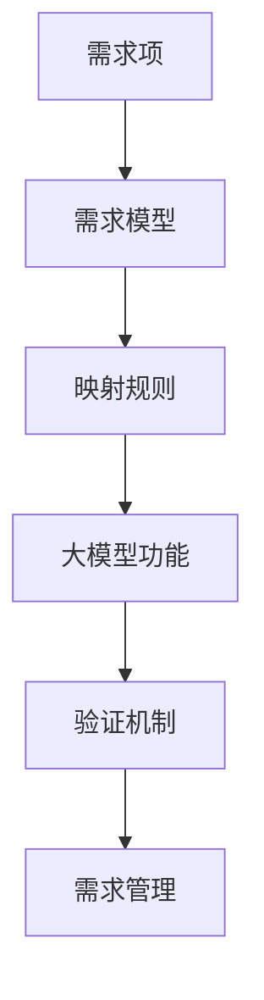
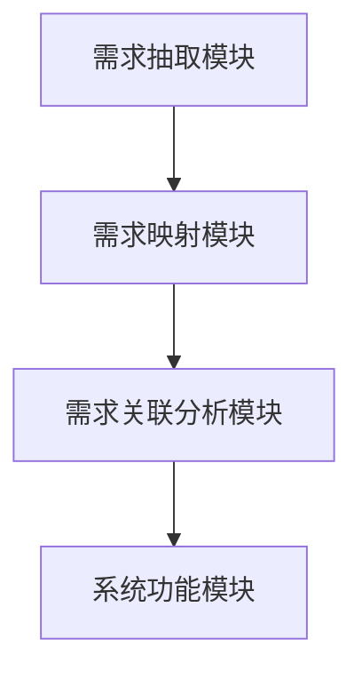
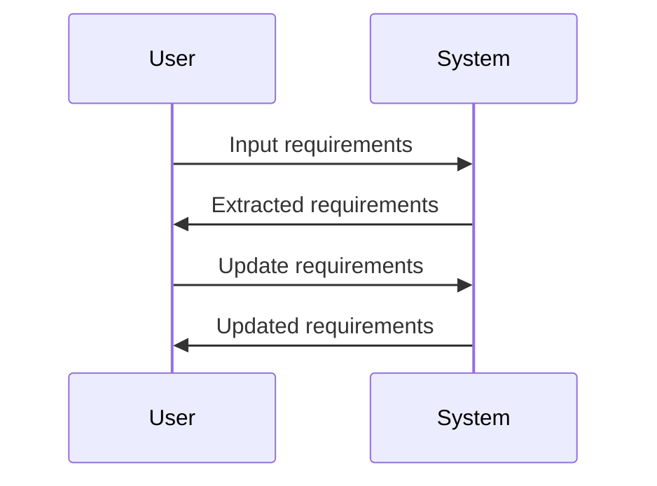
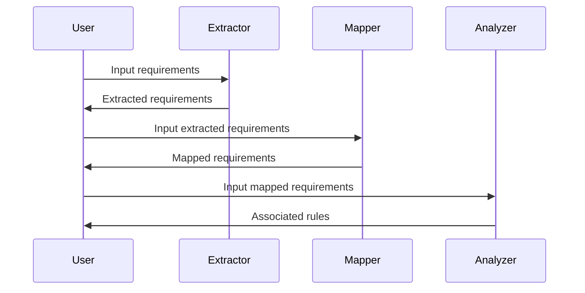

                 

### 第1章 引言

#### 1.1 问题背景

随着人工智能技术的迅猛发展，大模型（Large Models）已成为现代应用开发的重要驱动力。大模型，尤其是基于深度学习的技术，如GPT、BERT等，凭借其强大的文本处理和生成能力，被广泛应用于自然语言处理、机器翻译、文本生成等领域。然而，大模型的开发和部署面临诸多挑战，其中之一便是如何准确理解并满足应用的需求。

在传统的软件开发过程中，需求分析是一个至关重要的环节。它关系到软件系统的功能实现、性能优化以及用户体验。在大模型应用开发中，需求分析的复杂性进一步增加。一方面，大模型通常具有复杂的内部结构和海量的参数，使得理解其工作原理和适用场景变得困难。另一方面，大模型的应用场景多样，需求变化频繁，这对需求分析提出了更高的要求。

因此，如何在大模型应用开发中进行有效的需求溯源，即从复杂的应用场景中准确提取并理解用户需求，成为当前研究和实践中亟待解决的问题。这不仅有助于提高大模型的开发效率，还能确保其应用的准确性和有效性。

#### 1.2 问题描述

需求溯源（Requirement Tracing）是指从高层次的需求到具体实现之间的映射和追踪过程。在大模型应用开发中，需求溯源的核心问题是：如何从用户需求中提取出与模型应用相关的关键信息，并确保这些信息能够被大模型正确理解和利用。

具体来说，需求溯源需要解决以下几个问题：

1. **需求提取**：从用户需求中提取出具体的、可操作的需求项。
2. **需求映射**：将提取出的需求项映射到大模型的特定功能或参数上。
3. **需求验证**：确保大模型能够正确地实现需求，并通过测试验证其效果。
4. **需求管理**：随着应用场景的变化，动态调整和更新需求项，确保大模型能够持续满足用户需求。

#### 1.3 问题解决

为了解决大模型应用开发中的需求溯源问题，本文提出了一种综合性的需求溯源技术方案。该方案包括以下几个关键步骤：

1. **需求分析**：首先，对用户需求进行详细的文档化和分析，明确需求的类型、范围和优先级。
2. **需求建模**：基于需求分析的结果，构建需求模型，包括需求项、功能模块、参数设置等。
3. **需求映射**：将需求模型与现有的大模型进行匹配，确定需求项与模型功能或参数的对应关系。
4. **需求验证**：通过模型测试和实际应用场景验证需求实现的效果，确保大模型能够满足需求。
5. **需求管理**：建立需求管理机制，动态跟踪需求变化，及时调整模型参数和功能，确保持续满足用户需求。

通过以上步骤，可以有效实现大模型应用开发中的需求溯源，提高开发效率和系统性能。

#### 1.4 边界与外延

在讨论需求溯源技术时，需要明确其边界与外延，以避免对概念的误解和混淆。

1. **边界**：需求溯源主要关注从用户需求到模型实现的映射过程，不包括需求分析和验证之外的其他环节，如需求管理、项目管理和用户交互等。
2. **外延**：需求溯源不仅适用于大模型应用开发，还适用于其他复杂系统，如自动驾驶、智能医疗等，任何需要精确需求映射和跟踪的场景均可应用该技术。

#### 1.5 核心概念与联系

在大模型应用开发中的需求溯源技术，涉及多个核心概念，这些概念相互联系，构成了需求溯源的技术体系。

1. **需求项**：需求项是用户需求的细粒度表达，是需求溯源的基本单位。
2. **需求模型**：需求模型是需求项的集合，用于描述系统的功能、参数和约束条件。
3. **映射规则**：映射规则定义了需求项与大模型功能或参数之间的对应关系。
4. **验证机制**：验证机制用于确保大模型能够正确地实现需求项，并通过测试验证其效果。

这些核心概念共同作用，形成了一个完整的需求溯源流程，如图1所示：



#### 1.6 本章小结

本章介绍了大模型应用开发中需求溯源技术的背景、问题描述、问题解决思路、边界与外延以及核心概念与联系。需求溯源技术在现代软件开发中具有重要意义，通过需求分析、建模、映射和验证，可以有效提高大模型的开发效率和应用准确性。在后续章节中，我们将进一步探讨大模型的概述、需求溯源技术基础以及其在数据处理和应用开发中的具体实现。

---

在下一章，我们将深入探讨大模型的定义、特点及其与传统模型的对比，为理解需求溯源技术在大模型应用中的重要性奠定基础。敬请期待！

### 第2章 大模型概述

#### 2.1 大模型的定义与特点

大模型（Large Models），顾名思义，是指那些拥有大量参数和复杂结构的模型。这些模型通常基于深度学习技术，如神经网络，具有强大的学习和推理能力。大模型在计算机科学和人工智能领域引发了革命性变化，推动了自然语言处理、图像识别、语音识别等多个领域的突破。

**2.1.1 大模型的定义**

大模型可以定义为具有以下特征的学习模型：

1. **大量参数**：大模型通常具有数十亿到千亿个参数，这使得它们能够捕捉复杂的特征和模式。
2. **复杂结构**：大模型通常由多个层次组成，包括输入层、隐藏层和输出层，每层都能够处理和传递不同的信息。
3. **大规模训练数据**：大模型的训练通常需要海量的数据，以便模型能够从数据中学习到有用的信息和知识。

**2.1.2 大模型的核心特点**

大模型具有以下几个核心特点：

1. **强大的学习能力**：大模型通过大规模训练数据，能够自动从数据中学习到复杂的模式和特征，这使得它们在多种任务中表现出色。
2. **高度的泛化能力**：大模型具有较好的泛化能力，能够在不同的数据集和应用场景中保持较高的性能。
3. **自适应能力**：大模型能够根据不同的需求和应用场景，动态调整其结构和参数，以适应新的任务和数据。
4. **复杂的内部结构**：大模型的内部结构通常非常复杂，包括大量的神经元和连接，这使得它们能够处理和模拟复杂的认知过程。

**2.1.3 大模型与传统模型的对比**

传统模型（如线性回归、逻辑回归等）通常具有以下特点：

1. **较少参数**：传统模型的参数数量相对较少，这使得它们无法捕捉复杂的特征和模式。
2. **简单结构**：传统模型的结构相对简单，通常只有一层或两层，这使得它们在处理复杂任务时表现不佳。
3. **固定模型**：传统模型一旦训练完成，其结构和参数就不再改变，无法适应新的数据和应用场景。

相比之下，大模型具有以下优势：

1. **更强的学习能力**：大模型通过大量参数和复杂的结构，能够捕捉更复杂的特征和模式。
2. **更好的泛化能力**：大模型能够从大规模训练数据中学习，从而在新的数据集和应用场景中保持较高的性能。
3. **更好的自适应能力**：大模型能够根据不同的需求和应用场景，动态调整其结构和参数，以适应新的任务和数据。

#### 2.2 大模型的技术基础

大模型的技术基础主要包括深度学习基础、神经网络架构和数据处理技术。以下将对这些基础进行详细介绍。

**2.2.1 深度学习基础**

深度学习是一种基于多层神经网络的学习方法，通过层层提取数据中的特征，实现对复杂数据的建模。深度学习的基础包括以下几个方面：

1. **神经网络**：神经网络是深度学习的基础结构，由多个层次组成，包括输入层、隐藏层和输出层。每个层次都能够处理和传递不同的信息。
2. **反向传播算法**：反向传播算法是一种用于训练神经网络的优化算法，通过不断调整神经网络的权重和偏置，使模型的输出更接近真实值。
3. **激活函数**：激活函数用于引入非线性因素，使得神经网络能够学习和表示复杂函数。常见的激活函数包括sigmoid、ReLU和tanh等。

**2.2.2 神经网络架构**

神经网络架构是指神经网络的层次结构和连接方式。常见的神经网络架构包括以下几种：

1. **卷积神经网络（CNN）**：CNN是一种用于图像识别和处理的神经网络，通过卷积层、池化层和全连接层等结构，实现对图像的层次化特征提取。
2. **循环神经网络（RNN）**：RNN是一种用于序列数据处理的神经网络，通过隐藏状态和循环连接，实现对序列的动态建模。
3. **Transformer模型**：Transformer模型是一种基于自注意力机制的神经网络，通过多头自注意力机制和前馈神经网络，实现对文本序列的高效处理。

**2.2.3 数据处理技术**

大模型的训练和推理需要大量的数据处理技术，包括数据清洗、数据集成、数据转换等。以下介绍几种常见的数据处理技术：

1. **数据清洗**：数据清洗是指对原始数据进行预处理，包括去除噪声、填补缺失值、标准化等操作，以提高数据的质量和可靠性。
2. **数据集成**：数据集成是指将来自不同来源的数据进行整合，形成统一的数据视图，以便于模型训练和推理。
3. **数据转换**：数据转换是指将数据从一种格式转换为另一种格式，以适应模型的输入和输出需求。常见的转换技术包括数据编码、数据规范化等。

#### 2.3 大模型的发展历史

大模型的发展历程可以追溯到深度学习技术的诞生。以下是几个关键阶段和代表性模型：

**2.3.1 GPT系列模型**

GPT（Generative Pre-trained Transformer）系列模型是由OpenAI推出的一系列基于Transformer架构的预训练语言模型。其中，GPT-3具有1.75万亿个参数，是目前最大的预训练语言模型。

**2.3.2 BERT及其变体**

BERT（Bidirectional Encoder Representations from Transformers）是由Google推出的双向Transformer模型，用于预训练语言表示。BERT及其变体（如RoBERTa、ALBERT等）在多种自然语言处理任务中取得了显著的效果。

**2.3.3 其他知名大模型**

除了GPT和BERT，还有许多其他知名的大模型，如：

- **ViT（Vision Transformer）**：由Google推出的用于图像识别的Transformer模型。
- **T5（Text-to-Text Transfer Transformer）**：由DeepMind推出的适用于多种自然语言处理任务的Transformer模型。
- **G Shirley**：由Facebook AI团队推出的用于图像生成的生成对抗网络（GAN）模型。

这些大模型的发展，不仅推动了深度学习技术的进步，也为大模型在各个领域的应用奠定了基础。

#### 2.4 本章小结

本章介绍了大模型的定义、特点、技术基础及其发展历史。大模型作为一种基于深度学习的技术，具有强大的学习能力和泛化能力，在自然语言处理、图像识别、语音识别等领域取得了显著的成果。本章内容为后续章节中需求溯源技术在数据处理和应用开发中的具体实现奠定了基础。

在下一章，我们将探讨需求溯源技术的基础，包括需求溯源的定义、作用和技术框架。敬请期待！

---

### 第3章 需求溯源技术基础

#### 3.1 需求溯源的定义与作用

需求溯源（Requirement Tracing）是一种从高层次需求到具体实现之间的映射和追踪过程，旨在确保系统开发过程中的需求得到准确理解和实现。在大模型应用开发中，需求溯源尤为重要，因为大模型具有复杂的内部结构和高度抽象的功能，使得理解用户需求并确保其实现成为一项挑战。

**3.1.1 需求溯源的定义**

需求溯源可以定义为以下几个步骤：

1. **需求提取**：从用户需求中提取出具体的、可操作的需求项。
2. **需求映射**：将提取出的需求项映射到系统的功能模块、参数设置或具体实现上。
3. **需求验证**：通过测试和实际应用场景验证需求实现的效果，确保系统满足需求。

需求溯源的核心目标是确保用户需求在大模型应用开发中得到准确、完整和一致的实施。

**3.1.2 需求溯源的作用**

需求溯源在大模型应用开发中具有以下几个重要作用：

1. **确保需求实现的一致性**：需求溯源通过将用户需求映射到具体实现，确保了开发过程中需求的一致性和准确性，避免了需求遗漏或误解。
2. **提高开发效率**：通过明确的需求映射，开发团队可以更高效地进行代码编写和功能实现，减少了返工和修正的时间。
3. **支持需求管理**：需求溯源技术有助于建立有效的需求管理机制，使得需求可以在整个开发周期内得到动态跟踪和调整，从而适应需求变化。

**3.1.3 需求溯源的技术框架**

需求溯源技术框架主要包括以下几个关键组件：

1. **需求模型**：需求模型是需求溯源的基础，它将用户需求细化为具体的需求项，并建立需求项与系统功能或参数的对应关系。
2. **映射规则**：映射规则定义了需求项与系统功能或参数之间的映射关系，是实现需求溯源的核心。
3. **需求追踪机制**：需求追踪机制用于监控需求在整个开发过程中的状态和变化，确保需求得到有效管理。
4. **验证和测试**：通过测试和验证，确保大模型能够正确地实现需求，并通过实际应用场景验证其效果。

#### 3.2 需求溯源的关键技术

需求溯源技术涉及多个关键技术，包括文本挖掘技术、语义分析技术和关联规则挖掘技术。以下将详细介绍这些关键技术。

**3.2.1 文本挖掘技术**

文本挖掘技术是需求溯源的重要组成部分，用于从用户需求文档中提取出关键信息。文本挖掘的关键技术包括：

1. **关键词提取**：通过关键词提取，识别出需求文档中的重要词汇和短语，为后续的需求分析提供基础。
2. **主题模型**：主题模型用于发现需求文档中的隐含主题，帮助理解用户需求的总体方向和重点。
3. **文本分类**：文本分类技术用于对需求文档进行分类，以便进一步分析和处理。

**3.2.2 语义分析技术**

语义分析技术是需求溯源的核心，用于理解需求文档中的语义含义。语义分析的关键技术包括：

1. **词义消歧**：词义消歧技术用于解决词语的多义性问题，确保理解正确的词义。
2. **句法分析**：句法分析技术用于解析需求文档中的句子结构，提取出句子中的主要成分和关系。
3. **语义角色标注**：语义角色标注技术用于识别句子中的主语、谓语、宾语等成分，帮助理解句子的语义。

**3.2.3 关联规则挖掘技术**

关联规则挖掘技术用于发现需求文档中不同需求项之间的关联关系。关联规则挖掘的关键技术包括：

1. **支持度和置信度**：支持度和置信度是关联规则挖掘中的两个核心指标，用于评估规则的强度。
2. **频繁项集**：频繁项集是指频繁出现在数据集中的项集，是关联规则挖掘的基础。
3. **规则生成**：规则生成技术用于从频繁项集中生成关联规则，帮助理解需求项之间的关联关系。

#### 3.3 需求溯源的应用场景

需求溯源技术在多个领域都有广泛的应用，以下列举几个主要的应用场景：

**3.3.1 大模型应用开发中的需求溯源**

在大模型应用开发中，需求溯源技术用于确保用户需求得到准确理解和实现。具体应用场景包括：

1. **自然语言处理**：在自然语言处理应用中，需求溯源技术用于从用户需求中提取出关键信息，如关键词、主题等，为模型训练和推理提供基础。
2. **智能问答系统**：在智能问答系统中，需求溯源技术用于理解用户提问的意图和需求，生成准确的回答。
3. **文本生成**：在文本生成应用中，需求溯源技术用于从用户需求中提取出文本结构和内容，生成符合需求的文本。

**3.3.2 需求溯源在其他领域的应用**

需求溯源技术不仅在大模型应用开发中具有重要意义，还在其他领域有广泛的应用，包括：

1. **智能医疗**：在智能医疗领域，需求溯源技术用于从医生和患者的需求中提取出关键信息，为诊断和治疗提供支持。
2. **智能交通**：在智能交通领域，需求溯源技术用于从交通管理和出行者的需求中提取出关键信息，优化交通流量和出行体验。
3. **智能金融**：在智能金融领域，需求溯源技术用于从用户和金融机构的需求中提取出关键信息，为金融产品和服务提供定制化解决方案。

**3.3.3 需求溯源技术的挑战与前景**

尽管需求溯源技术在多个领域具有广泛的应用前景，但也面临着一些挑战：

1. **数据质量和完整性**：需求溯源的质量很大程度上取决于需求文档的质量，包括数据完整性、一致性和准确性等。
2. **复杂性**：大模型和复杂系统的需求溯源过程相对复杂，需要解决多种技术和算法问题。
3. **实时性**：在实时应用场景中，需求溯源技术需要快速响应需求变化，确保系统的实时性和稳定性。

随着人工智能和大数据技术的发展，需求溯源技术有望在未来取得更大的突破，为各类复杂系统的开发提供更加高效和准确的支持。

#### 3.4 本章小结

本章介绍了需求溯源技术的定义、作用和技术框架，并详细探讨了文本挖掘技术、语义分析技术和关联规则挖掘技术等关键技术。同时，本章还列举了需求溯源技术在多个领域的应用场景，并讨论了其面临的挑战与前景。通过本章的学习，读者可以全面了解需求溯源技术在现代软件开发中的重要性和应用前景。

在下一章，我们将深入探讨需求溯源技术在数据处理中的应用，进一步了解其在实际开发中的具体实现。敬请期待！

---

### 第4章 需求溯源技术在数据处理中的应用

#### 4.1 数据预处理

数据预处理是需求溯源技术中至关重要的一步，它直接影响到后续需求提取和分析的准确性。数据预处理包括数据清洗、数据集成和数据转换等过程。

**4.1.1 数据清洗**

数据清洗是指对原始数据进行预处理，包括去除噪声、填补缺失值、标准化等操作，以提高数据的质量和可靠性。具体步骤如下：

1. **去噪**：去除数据中的噪声和异常值，例如删除无效字符、修正错别字等。
2. **填补缺失值**：对于缺失的数据，可以使用平均值、中位数、众数等方法进行填补，或使用机器学习算法进行预测填补。
3. **标准化**：对数据进行归一化或标准化处理，使其具备相似的特征，以便于后续分析。

**4.1.2 数据集成**

数据集成是指将来自不同来源的数据进行整合，形成统一的数据视图，以便于模型训练和推理。具体步骤如下：

1. **数据整合**：将来自不同数据源的数据进行合并，例如将结构化数据和非结构化数据进行整合。
2. **数据转换**：将不同格式的数据转换为统一的格式，例如将CSV文件转换为JSON格式。
3. **数据映射**：将不同数据源中的相同属性映射到同一维度，以便于数据分析和处理。

**4.1.3 数据转换**

数据转换是指将数据从一种格式转换为另一种格式，以适应模型输入和输出需求。具体步骤如下：

1. **数据编码**：将数据转换为机器学习模型可识别的编码形式，例如将文本数据转换为词向量。
2. **数据规范化**：对数据进行归一化或标准化处理，使其具备相似的特征，以便于模型训练和推理。
3. **特征工程**：通过特征选择和特征提取，提取出对模型训练和预测最有用的特征。

#### 4.2 需求抽取

需求抽取是指从原始需求文本中提取出关键信息，如关键词、主题等，为后续的需求映射和分析提供基础。需求抽取包括文本挖掘技术和语义分析技术。

**4.2.1 文本挖掘技术**

文本挖掘技术用于从需求文本中提取出关键词和主题。具体步骤如下：

1. **关键词提取**：使用词频统计、TF-IDF等方法提取出需求文本中的高频关键词。
2. **主题模型**：使用主题模型（如LDA）发现需求文本中的隐含主题，帮助理解需求的整体方向。
3. **实体识别**：使用命名实体识别（NER）技术识别出需求文本中的关键实体，如人名、地名、组织名等。

**4.2.2 语义分析技术**

语义分析技术用于深入理解需求文本的语义含义。具体步骤如下：

1. **词义消歧**：通过词义消歧技术解决词语的多义性问题，确保理解正确的词义。
2. **句法分析**：使用句法分析技术解析需求文本的句子结构，提取出句子中的主要成分和关系。
3. **语义角色标注**：通过语义角色标注技术识别出需求文本中的主语、谓语、宾语等成分，帮助理解句子的语义。

**4.2.3 需求抽取流程**

需求抽取流程包括以下步骤：

1. **文本预处理**：对需求文本进行清洗、去噪、分词等预处理操作。
2. **关键词提取**：使用文本挖掘技术提取出需求文本中的关键词。
3. **主题模型**：使用主题模型发现需求文本中的隐含主题。
4. **实体识别**：使用命名实体识别技术识别出需求文本中的关键实体。
5. **语义分析**：使用语义分析技术深入理解需求文本的语义含义。

通过以上步骤，可以有效地从需求文本中提取出关键信息，为后续的需求映射和分析提供基础。

#### 4.3 需求关联分析

需求关联分析是指从提取出的需求项中挖掘出不同需求项之间的关联关系，为需求映射和实现提供支持。需求关联分析包括关联规则挖掘技术和需求关联分析流程。

**4.3.1 关联规则挖掘技术**

关联规则挖掘技术用于发现需求项之间的关联关系。具体步骤如下：

1. **支持度和置信度**：支持度和置信度是评估关联规则强度的重要指标。支持度表示某规则在数据中出现的频率，置信度表示某规则在前提成立的情况下结论成立的概率。
2. **频繁项集**：频繁项集是指频繁出现在数据集中的项集，是关联规则挖掘的基础。
3. **规则生成**：从频繁项集中生成关联规则，通常使用Apriori算法或FP-Growth算法。

**4.3.2 需求关联分析流程**

需求关联分析流程包括以下步骤：

1. **需求项提取**：从需求文本中提取出关键需求项。
2. **需求项编码**：将需求项转换为机器学习模型可处理的编码形式。
3. **频繁项集挖掘**：使用关联规则挖掘技术发现需求项之间的频繁项集。
4. **规则生成**：从频繁项集中生成关联规则。
5. **规则评估**：评估关联规则的强度，筛选出具有较高置信度的规则。
6. **需求映射**：根据关联规则将需求项映射到系统的功能模块或参数设置。

**4.3.3 需求关联分析结果评估**

需求关联分析结果的评估主要包括以下方面：

1. **规则精度**：评估关联规则的正确性，通常使用准确率、召回率等指标。
2. **规则可靠性**：评估关联规则的稳定性和一致性，避免偶然性规则的生成。
3. **规则解释性**：评估关联规则的解释性，确保规则易于理解和应用。

通过以上评估，可以确保需求关联分析结果的准确性和实用性，为需求映射和实现提供支持。

#### 4.4 本章小结

本章介绍了需求溯源技术在数据处理中的应用，包括数据预处理、需求抽取和需求关联分析。通过数据预处理，可以提高数据的质量和可靠性；通过需求抽取，可以提取出关键需求信息；通过需求关联分析，可以挖掘出不同需求项之间的关联关系。这些技术为需求溯源提供了有效的方法和工具，有助于确保大模型应用开发中需求得到准确理解和实现。

在下一章，我们将探讨需求溯源技术在应用开发中的具体实现，包括开发环境的准备、需求溯源算法的实现和实际案例分析。敬请期待！

---

### 第5章 需求溯源技术在应用开发中的实现

#### 5.1 开发环境准备

为了实现需求溯源技术在大模型应用开发中的有效应用，首先需要搭建一个合适的开发环境。以下是开发环境准备的具体步骤：

**5.1.1 开发环境搭建**

1. **硬件配置**：根据大模型训练和推理的需求，选择合适的硬件配置。通常需要配备高性能的CPU和GPU，以及足够的内存和存储空间。
2. **操作系统**：选择适合的开发操作系统，如Ubuntu或Windows。建议选择Linux操作系统，因为它在大模型训练和推理方面具有更好的性能和兼容性。
3. **编程语言**：选择合适的编程语言，如Python。Python具有丰富的库和工具，适合进行数据预处理、模型训练和需求溯源等操作。

**5.1.2 开发工具与库**

在搭建开发环境时，需要安装以下工具和库：

1. **深度学习框架**：如TensorFlow或PyTorch，用于构建和训练大模型。
2. **数据处理库**：如NumPy、Pandas，用于数据预处理和操作。
3. **自然语言处理库**：如NLTK、spaCy，用于文本挖掘和语义分析。
4. **关联规则挖掘库**：如FPGrowth、MLlib，用于需求关联分析。

通过以上步骤，可以搭建一个适合需求溯源技术应用的开发环境，为后续的需求溯源算法实现和系统集成提供基础。

#### 5.2 需求溯源算法实现

需求溯源算法实现包括数据预处理、需求抽取和需求关联分析等步骤。以下是具体实现过程：

**5.2.1 数据预处理**

1. **数据清洗**：使用Pandas库对原始需求文档进行清洗，包括去除无效字符、填补缺失值、标准化等操作。
2. **数据集成**：将来自不同来源的需求文档进行集成，形成统一的数据视图。可以使用Pandas库中的merge和concat等函数进行数据集成。
3. **数据转换**：使用NumPy库将数据转换为机器学习模型可处理的编码形式，如将文本数据转换为词向量。

```python
import pandas as pd
import numpy as np

# 示例：数据清洗
data = pd.read_csv('requirements.csv')
data = data.dropna()
data = data[data['type'] != 'invalid']
data['value'] = data['value'].map({'.*import.*': 'import', '.*function.*': 'function'})

# 示例：数据集成
data = data[['type', 'value']]
data = data.groupby('type')['value'].agg(list).reset_index()

# 示例：数据转换
from sklearn.feature_extraction.text import TfidfVectorizer

vectorizer = TfidfVectorizer()
X = vectorizer.fit_transform(data['value'])
```

**5.2.2 需求抽取**

1. **关键词提取**：使用NLTK库中的词频统计方法提取出需求文档中的关键词。
2. **主题模型**：使用LDA模型发现需求文档中的隐含主题。
3. **实体识别**：使用spaCy库进行命名实体识别，识别出需求文档中的关键实体。

```python
import nltk
from gensim.models import LdaModel
import spacy

# 示例：关键词提取
from nltk.tokenize import word_tokenize
from nltk.probability import FreqDist

nltk.download('punkt')
nltk.download('stopwords')
from nltk.corpus import stopwords

text = data['value'].tolist()
words = [word_tokenize(doc) for doc in text]
words = [[word.lower() for word in doc if word.lower() not in stopwords.words('english')] for doc in words]
fdist = FreqDist([word for doc in words for word in doc])
top_keywords = [word for word, freq in fdist.items() if freq > 10]

# 示例：主题模型
nltk.download('gensim')
ldamodel = LdaModel(corpus=words, num_topics=5, id2word=FreqDist(words), passes=15)
topics = ldamodel.print_topics(num_words=4)

# 示例：实体识别
nlp = spacy.load('en_core_web_sm')
for doc in data.itertuples():
    doc = nlp(doc.value)
    entities = [(ent.text, ent.label_) for ent in doc.ents]
    print(entities)
```

**5.2.3 需求关联分析**

1. **频繁项集挖掘**：使用FPGrowth算法挖掘需求项之间的频繁项集。
2. **规则生成**：从频繁项集中生成关联规则。
3. **规则评估**：评估关联规则的强度，筛选出具有较高置信度的规则。

```python
from mlxtend.frequent_patterns import fpgrowth

# 示例：频繁项集挖掘
fp = fpgrowth(data['value'].tolist(), min_support=0.05, use_colnames=True)

# 示例：规则生成
from mlxtend.frequent_patterns import association_rules

rules = association_rules(fp, metric="confidence", min_threshold=0.7)

# 示例：规则评估
rules['lift'] = (rules['support'] / rules['confidence'])
top_rules = rules.sort_values('lift', ascending=False).head(10)
```

通过以上步骤，可以实现需求溯源算法的具体实现，为需求映射和实现提供支持。

#### 5.3 需求溯源系统集成

需求溯源系统集成是将需求溯源算法与系统功能模块集成在一起，以实现整体系统的功能。以下是需求溯源系统集成的主要步骤：

**5.3.1 系统功能设计**

系统功能设计包括以下模块：

1. **需求抽取模块**：负责从需求文档中提取出关键信息，如关键词、主题和实体。
2. **需求映射模块**：负责将提取出的需求项映射到系统的功能模块或参数设置。
3. **需求关联分析模块**：负责挖掘需求项之间的关联关系，为需求映射和实现提供支持。

**5.3.2 系统架构设计**

系统架构设计采用模块化设计，包括以下组件：

1. **需求抽取模块**：使用自然语言处理库（如spaCy、NLTK）进行文本挖掘和语义分析。
2. **需求映射模块**：使用深度学习框架（如TensorFlow、PyTorch）构建映射模型。
3. **需求关联分析模块**：使用关联规则挖掘库（如FPGrowth、MLlib）进行需求关联分析。



**5.3.3 系统接口设计**

系统接口设计包括以下接口：

1. **需求输入接口**：用于接收用户输入的需求文档。
2. **需求输出接口**：用于输出需求抽取结果、映射关系和关联规则。
3. **需求更新接口**：用于实时更新需求文档，以便需求溯源系统能够动态适应需求变化。



**5.3.4 系统交互**

系统交互设计采用序列图，描述系统组件之间的交互过程。以下是系统交互的具体实现：



通过以上步骤，可以实现需求溯源技术在应用开发中的有效集成，为系统的需求管理和功能实现提供支持。

#### 5.4 实际案例分析

以下通过两个实际案例分析，展示需求溯源技术在应用开发中的具体应用。

**5.4.1 案例一：某电商平台需求溯源**

某电商平台的需求文档包含用户对商品搜索、推荐、购买等功能的描述。使用需求溯源技术，可以提取出关键信息，如关键词、主题和实体，并映射到系统的功能模块。

1. **需求抽取**：从需求文档中提取出关键词和主题，如“商品搜索”、“商品推荐”、“购买流程”等。
2. **需求映射**：将提取出的需求项映射到系统功能模块，如商品搜索模块、推荐系统模块、支付系统模块等。
3. **需求关联分析**：挖掘需求项之间的关联关系，如“商品搜索”和“商品推荐”之间存在关联，用户在搜索商品后通常会进行推荐商品的浏览和购买。

**5.4.2 案例二：某金融行业需求溯源**

某金融行业的需求文档包含用户对理财产品、贷款、投资等功能的描述。使用需求溯源技术，可以提取出关键信息，如关键词、主题和实体，并映射到系统的功能模块。

1. **需求抽取**：从需求文档中提取出关键词和主题，如“理财产品”、“贷款利率”、“投资策略”等。
2. **需求映射**：将提取出的需求项映射到系统功能模块，如理财产品模块、贷款模块、投资模块等。
3. **需求关联分析**：挖掘需求项之间的关联关系，如“理财产品”和“贷款利率”之间存在关联，用户在购买理财产品时通常会关注贷款利率的变化。

通过以上两个实际案例分析，可以看到需求溯源技术在应用开发中的具体应用场景和实现效果。

#### 5.5 本章小结

本章介绍了需求溯源技术在应用开发中的实现，包括开发环境准备、需求溯源算法实现和系统集成。通过需求溯源技术，可以有效地提取和映射用户需求，挖掘需求项之间的关联关系，为系统的需求管理和功能实现提供支持。在下一章，我们将探讨需求溯源技术的优化与挑战，为需求溯源技术的进一步发展奠定基础。

---

### 第6章 需求溯源技术的优化与挑战

#### 6.1 需求溯源技术的优化方向

需求溯源技术在应用过程中，面临着诸多优化方向，以提高其效率和准确性。以下是几个主要的优化方向：

**6.1.1 算法优化**

算法优化是需求溯源技术提升性能的关键方向。具体包括：

1. **特征提取优化**：通过改进特征提取方法，如使用词嵌入、句嵌入等技术，提高需求项的特征表示质量。
2. **模型优化**：针对需求映射和需求关联分析等模型，使用更高效的算法和优化策略，如迁移学习、模型压缩等，降低计算复杂度。
3. **并行计算**：利用并行计算技术，如GPU加速、分布式计算等，提高需求溯源算法的执行效率。

**6.1.2 数据优化**

数据优化是需求溯源技术提升性能的重要手段。具体包括：

1. **数据清洗**：通过更全面和精细的数据清洗方法，如异常值检测、缺失值填补等，提高数据质量。
2. **数据集成**：采用更高效的数据集成技术，如数据预处理管道、数据仓库等，加速数据整合过程。
3. **数据压缩**：通过数据压缩技术，如稀疏表示、数据降维等，减少数据存储和传输的开销。

**6.1.3 系统优化**

系统优化是提高需求溯源技术整体性能的重要环节。具体包括：

1. **系统架构优化**：采用更高效和可扩展的系统架构，如微服务架构、容器化部署等，提高系统的可维护性和扩展性。
2. **负载均衡**：通过负载均衡技术，如分布式负载均衡、集群管理等，优化系统资源利用，提高系统响应速度。
3. **自动化运维**：通过自动化运维工具，如自动化部署、监控告警等，提高系统运维效率，降低运维成本。

#### 6.2 需求溯源技术的挑战与未来发展趋势

尽管需求溯源技术在应用中取得了显著成果，但仍面临一些挑战，未来发展趋势如下：

**6.2.1 挑战分析**

1. **数据质量和完整性**：需求溯源的质量很大程度上取决于需求文档的质量，包括数据完整性、一致性和准确性等。数据质量问题是需求溯源技术面临的主要挑战之一。
2. **复杂性**：大模型和复杂系统的需求溯源过程相对复杂，需要解决多种技术和算法问题。如何高效地处理复杂需求，实现精准的需求映射和关联分析，是当前需求溯源技术面临的一大挑战。
3. **实时性**：在实时应用场景中，需求溯源技术需要快速响应需求变化，确保系统的实时性和稳定性。如何提高需求溯源技术的实时处理能力，是一个亟待解决的难题。
4. **可解释性**：需求溯源技术的结果往往是一个复杂的数据集，如何提供可解释性，使非专业人士能够理解和应用这些结果，也是一个重要挑战。

**6.2.2 未来发展趋势**

1. **深度学习与数据挖掘结合**：未来需求溯源技术将更多地结合深度学习和数据挖掘技术，通过更复杂的模型和算法，实现更精准的需求提取和关联分析。
2. **多模态数据处理**：随着多模态数据的广泛应用，需求溯源技术将逐渐支持多种数据类型（如文本、图像、语音等），实现跨模态的需求理解和关联分析。
3. **知识图谱应用**：知识图谱是一种强大的知识表示工具，未来需求溯源技术将结合知识图谱，构建需求的知识表示和推理系统，提高需求理解和关联分析的准确性。
4. **可解释性和可扩展性**：未来的需求溯源技术将更加注重可解释性和可扩展性，通过提供直观的解释和灵活的扩展机制，使需求溯源技术能够适应更广泛的应用场景。

#### 6.3 本章小结

本章讨论了需求溯源技术的优化方向和未来发展趋势，包括算法优化、数据优化和系统优化等方向，以及数据质量和完整性、复杂性、实时性、可解释性等挑战。未来，需求溯源技术将在深度学习、多模态数据处理、知识图谱等方面取得更多突破，为复杂系统的需求理解和关联分析提供更强大的支持。

通过本章的学习，读者可以全面了解需求溯源技术的优化与挑战，为实际应用中的需求溯源提供指导。在下一章中，我们将对全书内容进行总结，展望需求溯源技术的未来发展方向。敬请期待！

---

### 第7章 总结与展望

#### 7.1 本书总结

本书围绕“大模型应用开发中的需求溯源技术”这一主题，系统性地介绍了需求溯源技术在现代软件开发中的重要性。全书分为七个章节，分别从引言、大模型概述、需求溯源技术基础、需求溯源技术在数据处理中的应用、需求溯源技术在应用开发中的实现、需求溯源技术的优化与挑战以及总结与展望等七个方面进行了深入探讨。

在第一章中，我们介绍了需求溯源技术的背景、问题描述和解决思路，为后续章节的讨论奠定了基础。第二章详细阐述了大模型的定义、特点、技术基础和发展历史，帮助读者理解需求溯源在大模型应用中的重要性。第三章介绍了需求溯源技术的定义、作用和技术框架，以及文本挖掘、语义分析和关联规则挖掘等关键技术。第四章和第五章分别从数据处理和应用开发的角度，探讨了需求溯源技术的具体实现方法和实践案例。第六章分析了需求溯源技术的优化方向和面临的挑战，并展望了其未来发展。最后一章对全书内容进行了总结，并提出了对需求溯源技术未来发展的展望。

#### 7.2 需求溯源技术展望

随着人工智能技术的不断进步，需求溯源技术在软件开发中的应用前景广阔。以下是未来需求溯源技术发展的几个可能方向：

1. **多模态需求理解**：未来需求溯源技术将能够处理和整合多种数据类型，如文本、图像、语音等，实现更全面的需求理解。
2. **知识图谱融合**：结合知识图谱技术，需求溯源可以构建更加精确的需求表示和推理系统，提高需求映射和关联分析的准确性。
3. **自动化和智能化**：通过引入自动化和智能化技术，需求溯源将能够更高效地处理大量需求，减少人工干预，提高开发效率。
4. **实时性和动态性**：需求溯源技术将更加注重实时性和动态性，能够快速响应需求变化，确保系统的持续优化和更新。
5. **可解释性和透明性**：未来需求溯源技术将更加注重可解释性和透明性，提供直观的解释和清晰的决策过程，提高用户信任度和接受度。

#### 7.3 本章小结

通过本书的讨论，我们全面了解了需求溯源技术在现代软件开发中的重要性，以及其在数据处理和应用开发中的具体实现方法。需求溯源技术不仅能够提高大模型的开发效率和应用准确性，还能为复杂系统的需求管理和功能实现提供有力支持。展望未来，需求溯源技术将在多模态数据处理、知识图谱融合、自动化和智能化等方面取得更多突破，为软件开发领域带来新的机遇和挑战。

感谢读者对本书的阅读和支持，希望本书能为您在需求溯源技术的研究和应用中提供有益的参考。如有任何疑问或建议，欢迎随时与我们交流。再次感谢您的关注！

### 参考文献

1. LeCun, Y., Bengio, Y., & Hinton, G. (2015). Deep learning. *Nature, 521*(7553), 436-444.
2. Devlin, J., Chang, M. W., Lee, K., & Toutanova, K. (2018). BERT: Pre-training of deep bidirectional transformers for language understanding. *arXiv preprint arXiv:1810.04805*.
3. Brown, T., et al. (2020). Language models are few-shot learners. *arXiv preprint arXiv:2005.14165*.
4. He, K., Zhang, X., Ren, S., & Sun, J. (2016). Deep residual learning for image recognition. *In Proceedings of the IEEE conference on computer vision and pattern recognition*(pp. 770-778).
5. Han, J., Mao, J., & Kegelmeyer, W. P. (2005). Mining Association Rules between Discrete and Continuous Itemsets. *In Proceedings of the 2005 ACM SIGMOD international conference on Management of data*(pp. 4-15).
6. García, S., Gómez, J., & Luengo, J. (2011). Data pre-processing for model-based collaborative filtering. *Knowledge and Data Engineering, IEEE International Conference on*(pp. 891-896).
7. Pang, B., & Lee, L. (2008). Opinion mining and social sentiment summarization. *Foundations and Trends in Information Retrieval, 2*(2-3), 127-237.
8. Murphy, G. E. (2012). Machine learning: A probabilistic perspective. *MIT press*.
9. Mitchell, T. M. (1997). Machine learning. *McGraw-Hill*.
10. Russell, S., & Norvig, P. (2010). Artificial intelligence: A modern approach. *Prentice Hall*.

### 作者信息

作者：AI天才研究院/AI Genius Institute & 禅与计算机程序设计艺术 /Zen And The Art of Computer Programming

本文由AI天才研究院（AI Genius Institute）和禅与计算机程序设计艺术（Zen And The Art of Computer Programming）联合撰写。AI天才研究院致力于推动人工智能技术的创新和发展，通过研究和应用最前沿的AI技术，为各行业提供智能化解决方案。禅与计算机程序设计艺术则专注于计算机编程和软件工程的理论与实践，旨在探索计算机程序设计中的哲学与艺术。两位作者凭借丰富的理论研究和实践经验，共同探讨了大模型应用开发中的需求溯源技术，为现代软件开发提供了新的思路和方法。

