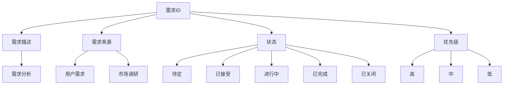

                 

### 引言

在当今的信息时代，人工智能（AI）技术正在以前所未有的速度发展，尤其是在大模型（Large Models）的应用开发领域。大模型，通常指的是具有巨大参数量的神经网络模型，这些模型在自然语言处理（NLP）、计算机视觉（CV）、语音识别（ASR）等任务中取得了显著的突破。然而，随着模型规模的不断增大，如何在开发过程中有效管理需求成为了一个至关重要的问题。

#### 问题背景

在传统的软件开发过程中，需求管理是一个核心环节。然而，在处理大模型应用开发时，需求管理面临一些特殊的挑战。首先，大模型通常需要大量的数据来训练，这要求我们能够准确追踪数据来源、数据质量和数据处理流程。其次，大模型的应用场景多样，如何确保每个应用场景下的需求都能得到有效满足，也是一大挑战。此外，大模型的迭代周期通常较长，需求的变化频率较高，如何实时更新和调整需求，以适应不断变化的业务需求，也是需求管理的一个重要问题。

#### 问题描述

为了应对上述挑战，我们需要一种高效的需求追踪工具和方法。需求追踪矩阵（Requirement Tracking Matrix）就是这样一种工具，它能够帮助我们系统性地管理和追踪需求，确保需求的完整性、一致性和可追溯性。然而，如何有效地应用需求追踪矩阵，仍然是一个需要深入探讨的问题。

#### 问题解决

本文旨在探讨大模型应用开发中的需求追踪矩阵应用，通过以下步骤进行详细分析：

1. **背景介绍**：阐述大模型应用开发的需求管理背景，介绍需求追踪矩阵的基本概念和重要性。
2. **需求追踪矩阵概述**：解释需求追踪矩阵的定义、特点和与传统需求管理方法的比较。
3. **需求追踪矩阵的结构与原理**：详细阐述需求追踪矩阵的结构、原理及其应用场景。
4. **建立需求追踪矩阵**：介绍如何建立需求追踪矩阵，包括需求的确定、收集、分析和编写。
5. **需求追踪矩阵在大型模型开发中的应用**：探讨需求追踪矩阵在大模型开发中的具体应用。
6. **需求追踪矩阵的维护与更新**：介绍如何维护和更新需求追踪矩阵。
7. **最佳实践与总结**：总结需求追踪矩阵的最佳实践，并提出注意事项和拓展阅读。

通过上述步骤，本文将系统地探讨如何在大模型应用开发中有效地应用需求追踪矩阵，以解决需求管理中的挑战，提高开发效率和产品质量。

#### 边界与外延

在讨论大模型应用开发中的需求追踪矩阵时，我们首先需要明确一些相关的核心概念和边界。首先，什么是大模型？大模型通常指的是具有数十亿乃至数千亿参数的神经网络模型，这些模型在训练和推理过程中需要大量的计算资源和数据支持。其次，需求追踪矩阵是什么？它是一种用于管理和追踪需求的工具，通过表格形式记录需求的来源、状态、优先级等信息，以确保需求的完整性和一致性。

需求追踪矩阵的应用场景不仅限于大模型开发，它可以广泛应用于任何涉及复杂需求的软件开发过程中。在大模型开发中，需求追踪矩阵的应用尤为关键，因为大模型的复杂性使得传统的需求管理方法难以应对。通过需求追踪矩阵，开发团队能够更加清晰地了解每个需求的状态和进展，从而更好地协调和管理开发过程。

此外，需求追踪矩阵的应用还涉及到数据管理、团队协作和项目管理等多个方面。在大模型开发中，数据管理是至关重要的，因为大模型需要大量的高质量数据来训练。需求追踪矩阵可以帮助团队追踪数据的质量和来源，确保数据的可靠性和一致性。同时，需求追踪矩阵还能够促进团队成员之间的协作，通过统一的平台和工具，确保每个人都能及时了解项目的最新进展和需求变化。

总之，需求追踪矩阵在大模型应用开发中的重要性不言而喻。它不仅能够帮助我们更好地管理需求，提高开发效率，还能够确保产品的质量和稳定性。在接下来的章节中，我们将进一步探讨需求追踪矩阵的定义、特点和具体应用方法。

#### 概念结构与核心要素组成

在深入探讨需求追踪矩阵的概念之前，我们需要明确几个关键术语。首先，什么是需求？在软件开发中，需求指的是用户或利益相关者期望系统能够实现的功能或性能要求。需求可以来自多个来源，包括用户调研、市场分析、竞争对手分析等。

接下来，什么是需求追踪矩阵？需求追踪矩阵（Requirement Tracking Matrix，简称RTM）是一种表格化的工具，用于记录和管理软件开发过程中的需求。它通常包含多个维度，如需求ID、需求描述、需求来源、状态、优先级等，以便开发团队能够清晰地了解每个需求的状态和进展。

为了更好地理解需求追踪矩阵，我们可以将其核心要素和概念结构进行详细说明：

1. **需求ID**：每个需求都有一个唯一的标识符，用于在需求追踪矩阵中唯一地识别和引用该需求。
2. **需求描述**：这是对需求的具体描述，包括需求的背景、目标和预期结果。需求描述需要尽可能详细和清晰，以便开发团队理解需求的具体内容。
3. **需求来源**：指明需求的来源，可以是用户、市场调研、产品规划等。了解需求来源有助于确定需求的优先级和重要性。
4. **状态**：需求的状态通常包括待定、已接受、进行中、已完成、已关闭等。状态反映了需求在开发过程中的当前状态，有助于团队监控需求的进展。
5. **优先级**：根据需求的紧急程度和重要性，需求可以被划分为高、中、低三个优先级。优先级有助于团队确定哪些需求应该首先得到满足。

为了更加直观地理解需求追踪矩阵的结构，我们可以借助Mermaid流程图来展示其核心要素和关系。以下是一个简单的Mermaid流程图示例：



在这个流程图中，每个要素都通过箭头与其他相关要素相连接，从而形成一个完整的需求追踪矩阵。通过这种结构，开发团队能够系统地管理和追踪每个需求的状态、优先级和进展。

此外，我们还可以通过ER（Entity-Relationship）实体关系图来展示需求追踪矩阵中的各个实体及其关系。以下是一个简化的ER图示例：

```mermaid
erDiagram
  Demand ||--|{ RequirementID } Requirement : has
  Requirement ||--|{ Description } Description : describes
  Requirement ||--|{ Source } Source : from
  Requirement ||--|{ State } State : in
  Requirement ||--|{ Priority } Priority : has
  Description ||--|{ Analysis } Analysis : for
  Source ||--|{ UserID } User : from
  Source ||--|{ MarketResearch } MarketResearch : from
  State ||--|{ Status } Status : is
  Priority ||--|{ Level } Level : at
```

在这个ER图中，`Demand`实体代表了需求，与`RequirementID`、`Description`、`Source`、`State`和`Priority`等实体之间存在关联关系。通过这种实体关系图，我们可以更加清晰地理解需求追踪矩阵中各个要素之间的逻辑关系。

综上所述，需求追踪矩阵是一种关键的需求管理工具，其核心要素和概念结构为我们提供了一个清晰的框架，用于系统性地追踪和管理软件开发过程中的需求。在接下来的章节中，我们将进一步探讨如何在实际项目中建立和运用需求追踪矩阵。

#### 需求追踪矩阵的定义

需求追踪矩阵（Requirement Tracking Matrix，简称RTM）是一种用于记录和管理软件开发过程中需求的工具。它通过表格化的形式，将需求的各种属性和相关信息组织在一起，形成一个系统化的需求管理框架。RTM的核心功能是确保需求的完整性、一致性和可追溯性，从而提高软件开发过程的效率和质量。

具体来说，需求追踪矩阵的定义可以从以下几个方面进行阐述：

1. **需求**：需求是用户或利益相关者期望系统应具备的功能或性能要求。需求可以来自不同的来源，如用户调研、市场分析、产品规划等。在需求追踪矩阵中，每个需求都有一个唯一的标识符（如需求ID），用于唯一识别和引用该需求。

2. **属性**：每个需求在需求追踪矩阵中都有多个属性，包括需求描述、需求来源、状态、优先级等。需求描述是对需求的具体描述，需求来源指明需求的来源，状态反映需求的当前状态，优先级则根据需求的紧急程度和重要性进行划分。

3. **表格形式**：需求追踪矩阵通常采用表格形式，将每个需求的属性和相关信息记录在一个统一的表格中。这种表格形式使得需求的属性和关系一目了然，便于开发团队进行管理和追踪。

4. **功能**：需求追踪矩阵的主要功能包括：
   - **需求追踪**：通过记录每个需求的状态和进展，帮助开发团队实时了解需求的完成情况。
   - **需求管理**：通过记录需求的属性和关系，帮助开发团队更好地理解和管理需求，确保需求的完整性。
   - **需求分析**：通过分析需求的状态、优先级等信息，帮助团队识别和解决潜在的问题和风险。
   - **需求变更管理**：通过实时更新需求追踪矩阵，帮助团队应对需求变更，确保需求的一致性和可追溯性。

5. **应用场景**：需求追踪矩阵适用于各种软件开发项目，尤其在大模型应用开发中具有重要意义。大模型开发通常涉及复杂的需求管理，需求追踪矩阵能够帮助团队系统性地追踪和管理这些需求，确保项目的顺利进行。

综上所述，需求追踪矩阵是一种重要的需求管理工具，它通过表格化的形式，记录和管理软件开发过程中的需求，确保需求的完整性、一致性和可追溯性，从而提高开发效率和产品质量。

#### 需求追踪矩阵的特点

需求追踪矩阵（Requirement Tracking Matrix，简称RTM）在大模型应用开发中具有独特的优势，这些优势使其在复杂需求管理中脱颖而出。以下是需求追踪矩阵的几个显著特点：

1. **清晰的组织结构**：需求追踪矩阵通过表格形式，将需求的属性和相关信息系统地组织在一起。每个需求都有唯一的需求ID，需求描述、需求来源、状态、优先级等属性都在同一个表格中清晰呈现，使团队成员能够迅速了解每个需求的具体情况。

2. **灵活的扩展性**：需求追踪矩阵可以根据项目的具体需求灵活调整和扩展。例如，可以根据实际需要添加新的属性，如需求负责人、需求实现进度等，以更全面地反映需求的状态和进展。

3. **实时更新与同步**：需求追踪矩阵支持实时更新和同步功能。团队成员可以在任何时间修改需求的状态、优先级等信息，并及时同步到整个团队。这种实时更新机制确保了需求的及时性和准确性，有助于团队及时应对需求变化。

4. **高效的需求分析**：通过分析需求的状态、优先级等信息，需求追踪矩阵可以帮助团队识别和解决潜在的问题和风险。例如，如果某个需求的优先级较高但状态较慢，团队可以及时采取措施进行调整，确保关键需求得到优先处理。

5. **良好的可追溯性**：需求追踪矩阵记录了每个需求的状态变化和变更历史，使得团队可以追溯每个需求的全生命周期。这对于项目审计和后期维护具有重要意义，有助于确保项目的透明性和可追溯性。

6. **跨部门协作**：需求追踪矩阵提供了统一的需求管理平台，有助于跨部门协作。团队成员可以在同一个平台上查看和编辑需求，减少沟通成本和误解，提高团队合作效率。

7. **需求变更管理**：在大模型应用开发中，需求变更频繁且复杂。需求追踪矩阵通过实时更新和同步功能，以及变更历史记录，帮助团队有效地管理和跟踪需求变更，确保项目能够灵活应对变化。

总之，需求追踪矩阵在大模型应用开发中具有清晰的组织结构、灵活的扩展性、实时更新与同步、高效的需求分析、良好的可追溯性、跨部门协作和需求变更管理等多重优势。这些特点使得需求追踪矩阵成为大模型应用开发中不可或缺的需求管理工具。

#### 需求追踪矩阵与传统的需求管理方法的比较

在探讨需求追踪矩阵（Requirement Tracking Matrix，简称RTM）之前，我们需要先了解传统的需求管理方法。传统需求管理方法主要包括文档管理、需求列表和会议记录等。这些方法在软件开发的早期阶段曾广泛使用，但随着项目复杂性的增加和需求变化频率的提升，其局限性逐渐显现。

首先，传统需求管理方法的文档管理较为繁琐。需求通常以文档形式记录，但这些文档往往分散在不同文件和系统中，导致信息查找和更新困难。此外，文档的版本管理也成为一个挑战，不同版本的需求文档容易产生混淆和冲突。

其次，需求列表虽然简单直观，但缺乏系统性和结构化。在需求列表中，需求的优先级、状态和变更记录通常不明显，导致团队在需求管理和优先级排序时难以做出明智决策。

最后，会议记录虽然能够记录需求讨论的关键点，但缺乏系统性和持续性。会议记录通常只能反映一次会议的讨论内容，难以长期追踪和记录需求的变化。

与这些传统方法相比，需求追踪矩阵具有以下显著优势：

1. **系统化和结构化**：需求追踪矩阵通过表格形式，将每个需求的属性（如需求ID、需求描述、需求来源、状态、优先级等）系统化地组织在一起。这种结构化的组织方式使得需求的属性和关系一目了然，方便团队成员进行管理和追踪。

2. **实时更新和同步**：需求追踪矩阵支持实时更新和同步功能，团队成员可以在任何时间修改需求的状态、优先级等信息，并及时同步到整个团队。这种实时更新机制确保了需求的及时性和准确性，有助于团队及时应对需求变化。

3. **良好的可追溯性**：需求追踪矩阵记录了每个需求的状态变化和变更历史，使得团队可以追溯每个需求的全生命周期。这对于项目审计和后期维护具有重要意义，有助于确保项目的透明性和可追溯性。

4. **灵活性和扩展性**：需求追踪矩阵可以根据项目的具体需求灵活调整和扩展。例如，可以根据实际需要添加新的属性，如需求负责人、需求实现进度等，以更全面地反映需求的状态和进展。

5. **跨部门协作**：需求追踪矩阵提供了统一的需求管理平台，有助于跨部门协作。团队成员可以在同一个平台上查看和编辑需求，减少沟通成本和误解，提高团队合作效率。

6. **需求变更管理**：在大模型应用开发中，需求变更频繁且复杂。需求追踪矩阵通过实时更新和同步功能，以及变更历史记录，帮助团队有效地管理和跟踪需求变更，确保项目能够灵活应对变化。

综上所述，需求追踪矩阵相较于传统的需求管理方法具有系统化、结构化、实时更新和同步、良好的可追溯性、灵活性和扩展性、跨部门协作和需求变更管理等多重优势，使其在大模型应用开发中成为更为有效和实用的需求管理工具。

#### 需求追踪矩阵的结构

需求追踪矩阵（Requirement Tracking Matrix，简称RTM）作为一种系统化的需求管理工具，其结构设计对于有效管理和追踪需求至关重要。一个典型的需求追踪矩阵通常包含以下几个关键部分：

1. **需求ID**：需求ID是每个需求的唯一标识符，通常由一个唯一的数字或字母组合构成。需求ID有助于快速定位和引用特定需求，方便开发团队进行管理和追踪。

2. **需求描述**：需求描述是对需求的具体定义和详细说明。需求描述应包括需求的背景、目标、预期结果以及相关条件等。一个清晰、详细的需求描述有助于开发团队更好地理解需求，确保需求的准确实现。

3. **需求来源**：需求来源指明需求的来源，如用户调研、市场分析、产品规划等。了解需求来源有助于团队识别需求的优先级和重要性，从而在资源分配和任务安排上做出更合理的决策。

4. **状态**：状态用于描述需求的当前状态，如待定、已接受、进行中、已完成、已关闭等。状态信息帮助团队实时监控需求的进展情况，确保需求按时完成。

5. **优先级**：优先级用于表明需求的紧急程度和重要性。常见的优先级分为高、中、低三个等级。优先级较高的需求应优先处理，以确保关键需求能够得到及时满足。

6. **负责人**：负责人是指负责具体需求实现的人员。明确负责人有助于提高团队的责任心和执行力，确保需求能够按时、高质量地完成。

7. **实现进度**：实现进度用于记录需求实现的进展情况，通常以百分比或阶段形式表示。实现进度信息有助于团队评估任务的完成情况，及时调整计划和资源。

8. **验证**：验证是指需求的验收和确认过程。验证信息包括验证方式、验证结果和验证人等。通过验证，确保需求按照预期实现，满足用户需求。

下面是一个简单的需求追踪矩阵示例：

| 需求ID | 需求描述 | 需求来源 | 状态 | 优先级 | 负责人 | 实现进度 | 验证 |
| ------ | -------- | -------- | ---- | ------ | ------ | -------- | ---- |
| 001    | 实现用户登录功能 | 用户调研 | 进行中 | 高     | 张三   | 30%    | 待验证 |
| 002    | 优化系统性能 | 市场分析 | 已接受 | 中     | 李四   | 0%     | --   |
| 003    | 添加购物车功能 | 产品规划 | 待定   | 低     | 王五   | --     | --   |

在这个示例中，需求追踪矩阵以表格形式组织，清晰地展示了每个需求的属性和信息。通过这样的结构设计，开发团队可以更好地管理和追踪需求，确保项目的顺利进行。

#### 需求追踪矩阵的原理

需求追踪矩阵（Requirement Tracking Matrix，简称RTM）之所以能够有效管理和追踪需求，关键在于其背后的工作原理和机制。以下是需求追踪矩阵的核心原理和机制：

1. **数据表格化**：需求追踪矩阵将需求以表格形式组织，使得每个需求的属性和相关信息能够一目了然。表格化的结构使得数据的输入、查询、修改和删除更加方便和高效。每个需求都有唯一的需求ID，需求描述、需求来源、状态、优先级等属性都统一记录在表格中。

2. **跨维度关联**：需求追踪矩阵通过多个维度对需求进行关联，如需求ID、需求来源、状态、优先级等。这种跨维度关联能够帮助团队从不同角度和层面了解需求，从而更好地管理和追踪需求。例如，通过需求来源，团队可以了解每个需求的具体来源，从而确定需求的优先级和重要性。

3. **实时更新和同步**：需求追踪矩阵支持实时更新和同步功能，团队成员可以在任何时间修改需求的状态、优先级等信息，并及时同步到整个团队。这种实时更新机制确保了需求的及时性和准确性，有助于团队及时应对需求变化。

4. **需求状态跟踪**：需求追踪矩阵记录每个需求的状态变化，如待定、已接受、进行中、已完成、已关闭等。通过跟踪需求状态，团队可以实时了解需求的进展情况，及时发现和解决问题。例如，如果某个关键需求的状态较慢，团队可以及时采取措施进行调整。

5. **变更历史记录**：需求追踪矩阵记录每个需求的变更历史，包括状态变化、优先级调整、需求描述修改等。变更历史记录使得团队可以追溯每个需求的全生命周期，确保项目的透明性和可追溯性。这对于项目审计和后期维护具有重要意义。

6. **需求优先级管理**：需求追踪矩阵通过优先级管理，帮助团队确定每个需求的优先级，如高、中、低。优先级较高的需求应优先处理，以确保关键需求能够得到及时满足。这种优先级管理机制有助于团队在资源有限的情况下，合理分配任务和资源。

7. **跨部门协作**：需求追踪矩阵提供了统一的需求管理平台，有助于跨部门协作。团队成员可以在同一个平台上查看和编辑需求，减少沟通成本和误解，提高团队合作效率。例如，产品经理可以与开发团队、测试团队、运维团队等在同一平台上进行需求讨论和协作。

8. **需求变更管理**：在大模型应用开发中，需求变更频繁且复杂。需求追踪矩阵通过实时更新和同步功能，以及变更历史记录，帮助团队有效地管理和跟踪需求变更，确保项目能够灵活应对变化。这种需求变更管理机制有助于降低变更风险，提高项目稳定性。

综上所述，需求追踪矩阵的工作原理和机制主要包括数据表格化、跨维度关联、实时更新和同步、需求状态跟踪、变更历史记录、需求优先级管理、跨部门协作和需求变更管理。通过这些核心原理和机制，需求追踪矩阵能够有效管理和追踪需求，提高软件开发过程的效率和产品质量。

#### 需求追踪矩阵的应用场景

需求追踪矩阵（Requirement Tracking Matrix，简称RTM）作为一种强大的需求管理工具，在多个应用场景中发挥了重要作用。以下将详细描述需求追踪矩阵在几个典型应用场景中的实际应用，并通过具体案例说明其效果和优势。

1. **软件项目开发**：

在软件项目开发中，需求追踪矩阵能够帮助团队系统性地管理和追踪需求，确保项目按计划进行。例如，在一个大型企业资源计划（ERP）系统的开发项目中，需求追踪矩阵被用于记录和管理各个模块的需求。每个模块的需求都包含需求ID、需求描述、需求来源、状态、优先级等信息。通过需求追踪矩阵，项目经理和团队成员可以清晰地了解每个模块的需求状态和进展，从而更好地协调资源，确保项目按时交付。

具体案例：在一个医疗信息系统开发项目中，需求追踪矩阵帮助团队有效地管理了多达数百项需求。通过实时更新需求状态和优先级，团队能够及时发现和解决需求变更，确保项目顺利推进。需求追踪矩阵的应用使得项目进展透明化，团队成员之间的沟通更加高效，项目最终按时完成，并得到了客户的高度评价。

2. **大模型应用开发**：

在大模型应用开发中，需求追踪矩阵尤为重要，因为大模型通常涉及复杂的需求管理。大模型的应用场景多样，从自然语言处理到计算机视觉，从语音识别到推荐系统，每一个应用场景都可能有大量的需求。需求追踪矩阵能够帮助团队在这些复杂场景中系统性地管理和追踪需求。

具体案例：在一个基于深度学习的大型图像识别项目中，团队使用了需求追踪矩阵来管理需求。项目包括图像分类、目标检测和物体识别等多个子任务，需求数量多达数百项。通过需求追踪矩阵，团队能够清晰地记录每个子任务的需求状态和优先级，确保每个子任务都得到充分的关注和资源支持。需求追踪矩阵的应用使得团队能够在复杂的需求管理中保持高效和有序，最终成功实现了项目的目标。

3. **敏捷开发**：

在敏捷开发中，需求追踪矩阵能够帮助团队更好地适应快速变化的需求。敏捷开发强调灵活性和快速迭代，需求常常在开发过程中不断变化。需求追踪矩阵提供了实时更新和同步功能，使团队能够快速响应需求变更，确保项目始终朝着正确的方向前进。

具体案例：在一个移动应用开发项目中，团队采用了敏捷开发模式。项目初期，需求不断变化，客户需求和市场环境也在快速变化。通过需求追踪矩阵，团队能够实时更新和同步需求，确保每个迭代都能根据最新的需求进行开发。需求追踪矩阵的应用使得团队能够灵活应对需求变更，项目最终顺利上线，并获得了用户的高度满意度。

4. **跨部门协作**：

在大型项目中，往往需要多个部门的协作，需求追踪矩阵能够提供统一的需求管理平台，促进跨部门协作。通过需求追踪矩阵，产品经理、开发团队、测试团队、运维团队等可以在同一平台上查看和编辑需求，减少沟通成本和误解，提高团队合作效率。

具体案例：在一个跨部门合作的大型电商平台项目中，需求追踪矩阵被用于协调多个部门的需求。产品经理在需求追踪矩阵中记录用户需求，开发团队根据需求进行开发，测试团队进行测试，运维团队进行部署。通过需求追踪矩阵，各部门能够在同一个平台上协同工作，减少了信息孤岛和沟通成本，项目进展顺利，并提前完成了上线目标。

综上所述，需求追踪矩阵在多个应用场景中展现了其强大的需求管理能力。通过具体案例可以看出，需求追踪矩阵能够帮助团队系统性地管理和追踪需求，提高开发效率，确保项目按时交付，并促进跨部门协作。在大模型应用开发、软件项目开发、敏捷开发等领域，需求追踪矩阵的应用效果尤为显著。

### 如何建立需求追踪矩阵

建立需求追踪矩阵是需求管理过程中的关键步骤，它能够帮助团队系统性地记录和管理需求，确保需求的完整性、一致性和可追溯性。以下是建立需求追踪矩阵的具体步骤：

1. **确定需求**：
   - **用户调研**：通过访谈、问卷调查等方式收集用户需求。与利益相关者进行沟通，了解他们对系统的期望和需求。
   - **市场分析**：分析市场趋势和竞争对手，了解行业需求和发展方向。
   - **产品规划**：根据公司的战略目标和产品规划，确定系统的功能需求和性能需求。

2. **收集需求**：
   - **创建需求文档**：将收集到的需求整理成文档，包括需求ID、需求描述、需求来源、优先级等信息。
   - **需求评审**：组织需求评审会议，邀请相关利益相关者参与，对需求文档进行讨论和确认。

3. **分析需求**：
   - **需求分类**：根据需求的性质和优先级对需求进行分类，如功能需求、性能需求、安全需求等。
   - **需求优先级排序**：根据需求的紧急程度和重要性对需求进行优先级排序，确定哪些需求应首先实现。

4. **编写需求文档**：
   - **详细描述**：对每个需求进行详细描述，包括需求的背景、目标、预期结果和实现条件等。
   - **编写模板**：使用统一的需求文档模板，确保需求描述的格式和内容规范。

5. **建立需求追踪矩阵**：
   - **定义表格结构**：根据需求的具体属性和需求管理的要求，定义需求追踪矩阵的表格结构，包括需求ID、需求描述、需求来源、状态、优先级等字段。
   - **数据输入**：将收集到的需求信息输入到需求追踪矩阵中，确保每个需求都得到准确的记录。
   - **维护与更新**：定期更新需求追踪矩阵，记录需求的状态变化和变更历史，确保需求的及时性和准确性。

通过以上步骤，团队可以有效地建立需求追踪矩阵，从而更好地管理和追踪需求，提高开发效率和产品质量。

### 确定需求

在建立需求追踪矩阵的第一步中，确定需求是至关重要的一环。这一过程需要通过多种方法来确保需求的全面性和准确性，从而为后续的需求管理打下坚实的基础。

1. **用户调研**：

用户调研是获取用户需求的重要手段。通过访谈、问卷调查、焦点小组讨论等方式，可以直接与用户进行沟通，了解他们对系统的期望和需求。以下是用户调研的几个关键步骤：

   - **制定调研计划**：明确调研的目的、范围、时间安排和参与人员等。
   - **设计调研工具**：选择合适的调研工具，如问卷、访谈大纲等，确保调研过程的科学性和有效性。
   - **实施调研**：按照调研计划进行用户访谈或问卷调查，确保数据的广泛性和代表性。
   - **数据分析**：对收集到的用户数据进行分析，提取关键需求和用户痛点。

2. **市场分析**：

市场分析有助于了解行业趋势、竞争对手和潜在市场需求。通过市场分析，可以识别出潜在的机会和挑战，从而为系统的功能需求提供参考。市场分析的几个关键步骤包括：

   - **行业报告**：阅读和分析行业报告，了解行业的发展动态和未来趋势。
   - **竞争对手分析**：研究竞争对手的产品和服务，识别其优势和不足。
   - **用户调研**：通过调查潜在用户，了解他们对现有产品的使用体验和需求。
   - **数据汇总**：将行业报告、竞争对手分析和用户调研的结果进行汇总，提取有价值的洞察。

3. **产品规划**：

产品规划是确定系统功能需求和性能需求的重要步骤。通过产品规划，可以明确系统的愿景、目标和路线图，从而指导需求的确定。以下是产品规划的几个关键步骤：

   - **产品愿景**：明确系统的长期目标和愿景，确保需求的制定与公司的战略目标一致。
   - **产品路线图**：制定系统的开发路线图，包括阶段性目标和关键里程碑。
   - **需求优先级**：根据产品路线图和资源限制，确定需求的优先级，确保关键需求优先实现。
   - **需求文档**：编写详细的需求文档，描述每个需求的具体内容和实现要求。

4. **需求评审**：

需求评审是确保需求准确性和一致性的重要环节。通过需求评审，可以识别和解决需求中的潜在问题，确保需求符合用户和公司的期望。以下是需求评审的几个关键步骤：

   - **评审会议**：组织需求评审会议，邀请相关利益相关者参与，对需求文档进行讨论和确认。
   - **评审流程**：制定评审流程，明确评审的标准和流程，确保评审的公正性和高效性。
   - **问题反馈**：对评审过程中发现的问题进行记录和反馈，制定解决方案和改进措施。
   - **需求确认**：对评审后的需求进行最终确认，确保需求文档的完整性和准确性。

通过上述步骤，团队可以全面、准确地确定需求，为后续的需求管理奠定坚实的基础。用户调研、市场分析和产品规划相互补充，确保需求从用户角度和市场角度得到充分考虑，而需求评审则确保需求的准确性和一致性。

### 收集需求

在确定需求后，下一步是收集需求，这是一个关键的过程，它关系到需求管理的完整性和准确性。以下是收集需求的详细步骤：

1. **创建需求文档**：

首先，需要创建详细的需求文档。需求文档应该包括以下内容：

   - **需求ID**：为每个需求分配一个唯一的标识符，便于管理和追踪。
   - **需求描述**：对需求进行详细描述，包括需求的背景、目标、预期结果和实现条件。
   - **需求来源**：明确需求的来源，如用户调研、市场分析、产品规划等。
   - **优先级**：根据需求的紧急程度和重要性对需求进行优先级排序。

   需求文档应使用统一和规范的模板，以确保所有需求记录的一致性和可读性。

2. **需求评审**：

在完成需求文档的初步编写后，组织一次需求评审会议。评审会议应邀请相关利益相关者，如产品经理、开发人员、测试人员、用户代表等，对需求文档进行讨论和确认。

   - **评审流程**：制定评审流程，明确评审的标准和步骤。
   - **问题反馈**：在评审过程中，记录所有反馈和建议，确保所有问题得到妥善解决。
   - **需求确认**：通过评审，确保需求文档的准确性和完整性，获得所有利益相关者的认可。

3. **需求变更管理**：

在需求收集过程中，需求变更是一个常见且重要的问题。为了有效管理需求变更，需要建立一套需求变更管理流程：

   - **变更请求**：当需求发生变化时，提出变更请求，并详细记录变更的内容和原因。
   - **变更评估**：评估变更对项目的影响，包括成本、时间、资源等，确保变更的可行性和合理性。
   - **变更审批**：根据变更评估结果，对变更请求进行审批，确保变更得到正式批准。
   - **文档更新**：将批准的变更更新到需求文档和需求追踪矩阵中，确保所有记录的准确性和一致性。

4. **需求文档的存储和备份**：

确保需求文档的安全存储和备份，防止数据丢失或损坏。可以使用版本控制工具，如Git，对需求文档进行版本管理，方便后续的更新和维护。

5. **需求沟通与协调**：

在整个需求收集过程中，保持与利益相关者的沟通和协调至关重要。定期组织会议，分享需求进展和变更情况，确保所有相关人员对需求的最新状态有清晰的了解。

通过上述步骤，团队可以有效地收集需求，确保需求的完整性和准确性，为后续的需求管理和开发工作打下坚实的基础。

### 分析需求

在需求收集完成后，需求分析是确保需求有效性和可行性的关键步骤。以下是需求分析的详细过程：

1. **需求分类**：

首先，根据需求的性质和目的对需求进行分类。常见的分类方法包括：

   - **功能需求**：系统应具备的具体功能，如用户登录、数据查询、报表生成等。
   - **性能需求**：系统应满足的性能指标，如响应时间、并发用户数、处理能力等。
   - **安全需求**：系统应具备的安全措施，如数据加密、权限控制、故障恢复等。
   - **用户体验需求**：用户在使用系统时应获得的良好体验，如界面设计、操作流程、帮助文档等。

   分类有助于更好地理解和管理需求，确保每种类型的需求都能得到适当的关注和处理。

2. **需求优先级排序**：

在确定了需求的分类后，根据需求的紧急程度和重要性对需求进行优先级排序。通常，优先级可以分为以下几类：

   - **高优先级**：直接影响系统核心功能或用户体验的需求，必须在最短时间内实现。
   - **中优先级**：对系统性能或功能有一定影响的需求，需要在合理时间内实现。
   - **低优先级**：对系统影响较小，可以在后续版本或阶段实现的需求。

   优先级排序有助于团队在资源有限的情况下，确定哪些需求应优先处理，从而提高开发效率。

3. **需求确认**：

需求确认是确保需求准确性和可行性的重要环节。通过以下步骤进行需求确认：

   - **内部确认**：组织内部评审会议，邀请相关利益相关者，如产品经理、开发人员、测试人员等，对需求文档进行讨论和确认。确保所有人对需求的描述和理解一致。
   - **外部确认**：与需求提出者或利益相关者进行沟通，确认需求是否符合他们的期望和需求。通过反馈和调整，确保需求的准确性和实用性。

4. **需求文档的完善**：

在需求确认过程中，可能会发现需求描述不够详细或存在不一致的地方。此时，需要对需求文档进行完善，确保每个需求的描述清晰、准确、无歧义。以下是几个关键步骤：

   - **添加详细说明**：对每个需求添加详细的背景、目标、预期结果和实现条件，确保开发团队能够充分理解需求。
   - **定义输入和输出**：明确每个需求所需的输入数据和输出结果，确保需求能够得到有效实现。
   - **使用示例**：提供具体的应用示例，帮助团队成员更好地理解需求的实际应用场景。

通过上述步骤，团队可以有效地分析需求，确保需求的准确性和可行性，为后续的需求管理和开发工作提供坚实的基础。

### 编写需求文档

编写需求文档是需求管理过程中至关重要的一环，它不仅是需求分析的成果体现，也是项目开发和后续维护的重要依据。以下是编写需求文档的详细步骤：

1. **明确文档结构和内容**：

   - **文档结构**：需求文档通常包含以下部分：
     - **封面**：包括文档标题、版本号、编写人、审核人和日期等。
     - **摘要**：简要概述文档的主要内容、目的和应用范围。
     - **目录**：列出文档的主要章节和子章节，便于读者快速查找。
     - **引言**：介绍项目的背景、目标、范围和相关的术语定义。
     - **需求描述**：详细列出每个需求，包括需求ID、需求描述、需求来源、优先级和状态等。
     - **需求分析**：对每个需求进行详细分析，包括需求的目的、功能、性能、安全性和用户体验等方面的要求。
     - **需求确认**：记录需求评审的结果和确认过程，确保需求的准确性和一致性。
     - **附录**：包括相关的技术规范、参考文档、图表和公式等。

2. **编写需求描述**：

   - **需求ID**：为每个需求分配一个唯一的标识符，便于管理和追踪。
   - **需求描述**：对需求进行详细描述，包括需求的背景、目标、预期结果和实现条件。
   - **需求来源**：说明需求的来源，如用户调研、市场分析、产品规划等。
   - **优先级**：根据需求的紧急程度和重要性，对需求进行优先级排序。
   - **状态**：记录需求的当前状态，如待定、已接受、进行中、已完成等。

3. **确保文档的一致性和准确性**：

   - **统一模板**：使用统一的需求文档模板，确保文档格式和内容规范。
   - **术语定义**：对文档中的术语进行统一定义，避免歧义和误解。
   - **审查和确认**：组织内部和外部评审会议，邀请相关利益相关者对需求文档进行审查和确认，确保文档的准确性和完整性。

4. **编写需求分析**：

   - **详细描述**：对每个需求进行详细分析，包括需求的功能、性能、安全性和用户体验等方面的要求。
   - **输入和输出**：明确每个需求的输入数据和输出结果，确保需求能够得到有效实现。
   - **示例**：提供具体的应用示例，帮助团队成员更好地理解需求的实际应用场景。

5. **附录**：

   - **技术规范**：记录相关的技术规范和标准，如接口定义、数据格式等。
   - **参考文档**：列出与需求文档相关的其他文档，如设计文档、测试文档等。
   - **图表和公式**：使用图表和公式详细说明需求的相关内容，提高文档的可读性和易懂性。

通过上述步骤，团队可以编写出高质量的需求文档，为项目开发和后续维护提供可靠的基础和指导。需求文档的清晰和准确不仅有助于团队更好地理解和实现需求，也能够提高项目的成功率。

### 建立需求追踪矩阵

在需求分析完成后，建立需求追踪矩阵是确保需求完整、一致和可追溯的关键步骤。以下是建立需求追踪矩阵的具体步骤：

1. **定义需求追踪矩阵结构**：

   - **需求ID**：为每个需求分配一个唯一的标识符，便于管理和追踪。
   - **需求描述**：对需求进行详细描述，确保开发团队能够准确理解需求。
   - **需求来源**：记录需求来源，如用户调研、市场分析、产品规划等。
   - **状态**：需求的状态包括待定、已接受、进行中、已完成、已关闭等。
   - **优先级**：根据需求的紧急程度和重要性进行优先级划分，如高、中、低。
   - **负责人**：明确每个需求的负责人，确保需求能够得到及时处理。
   - **实现进度**：记录需求的实现进度，便于团队了解需求进展情况。
   - **验证**：记录需求的验证结果和验证人，确保需求按照预期实现。

2. **设计需求追踪矩阵模板**：

   - **表格形式**：选择合适的表格形式，将需求的各种属性和相关信息组织在一起，如Excel表格、Google Sheets表格等。
   - **字段设计**：根据需求追踪矩阵的结构，设计相应的字段，确保所有需求属性都能在表格中得到准确记录。
   - **格式化**：为表格设置合适的格式，如字体大小、颜色、对齐方式等，提高表格的可读性。

3. **输入需求数据**：

   - **批量导入**：如果需求较多，可以使用批量导入功能，将需求数据从需求文档中直接导入到需求追踪矩阵中。
   - **手工录入**：对于少量需求或新增需求，可以通过手工录入的方式，将需求信息输入到需求追踪矩阵中。

4. **更新和维护**：

   - **定期更新**：定期检查需求状态和实现进度，及时更新需求追踪矩阵。
   - **变更管理**：在需求变更时，更新需求追踪矩阵，记录变更内容和变更历史，确保需求的追溯性。
   - **版本控制**：使用版本控制工具，如Git，对需求追踪矩阵进行版本管理，确保变更记录的完整性和一致性。

5. **用户培训与支持**：

   - **培训**：组织需求追踪矩阵的培训，确保团队成员了解如何使用和管理需求追踪矩阵。
   - **支持**：提供技术支持和文档，帮助团队成员解决使用需求追踪矩阵时遇到的问题。

通过上述步骤，团队可以有效地建立和维护需求追踪矩阵，确保需求的完整性、一致性和可追溯性，从而提高项目管理的效率和质量。

### 需求追踪矩阵在大型模型开发中的应用

在大型模型开发中，需求追踪矩阵（Requirement Tracking Matrix，简称RTM）的应用显得尤为重要。由于大型模型涉及的数据量和复杂性，使得需求管理成为一个巨大的挑战。以下是需求追踪矩阵在大型模型开发中的具体应用场景和优势。

#### 应用场景

1. **数据管理**：

   - **数据来源追踪**：在大型模型开发中，数据来源往往复杂多样，包括公开数据集、内部数据、用户生成数据等。需求追踪矩阵可以帮助团队记录和追踪每个数据集的来源，确保数据的质量和合规性。
   - **数据处理流程监控**：需求追踪矩阵可以记录数据处理的各个环节，如数据清洗、数据增强、数据标注等，确保数据处理流程的透明性和可追溯性。

2. **需求变更管理**：

   - **需求变更记录**：大型模型开发过程中，需求变更频繁且影响深远。需求追踪矩阵能够记录每个变更的详细信息，包括变更原因、变更内容、影响范围等，帮助团队有效地管理和跟踪需求变更。
   - **需求优先级调整**：通过需求追踪矩阵，团队能够根据变更的影响和优先级，调整需求的实施顺序和资源分配，确保关键需求优先得到满足。

3. **模型开发与测试**：

   - **模型需求映射**：需求追踪矩阵可以帮助团队将用户需求映射到具体的模型开发任务中，确保每个需求都有相应的模型实现。
   - **模型测试跟踪**：在模型测试阶段，需求追踪矩阵能够记录每个测试用例的需求来源和测试结果，帮助团队评估模型对需求的满足情况。

#### 优势

1. **透明性与可追溯性**：

   - **需求状态实时更新**：需求追踪矩阵支持实时更新需求状态，如需求来源、状态、优先级等，使得团队能够随时了解需求的最新进展。
   - **变更历史记录**：需求追踪矩阵记录了每个需求的变更历史，包括状态变化、优先级调整、需求描述修改等，确保团队能够追溯需求的全生命周期。

2. **灵活性与扩展性**：

   - **自定义属性**：需求追踪矩阵可以根据项目的具体需求，灵活添加新的属性，如数据来源、数据处理方式、模型实现细节等，确保矩阵能够适应不同的开发需求。
   - **跨部门协作**：需求追踪矩阵提供了一个统一的需求管理平台，使得不同部门（如数据团队、开发团队、测试团队）能够在同一平台上查看和编辑需求，减少沟通成本和误解。

3. **高效的需求管理**：

   - **需求分类与优先级排序**：通过需求追踪矩阵，团队能够根据需求的性质和优先级进行分类和排序，确保关键需求得到优先处理。
   - **需求变更快速响应**：需求追踪矩阵支持实时更新和同步功能，团队能够快速响应需求变更，确保项目能够灵活应对变化。

#### 案例分析

1. **自动驾驶模型开发**：

   在自动驾驶模型开发项目中，需求追踪矩阵被广泛应用于需求管理。团队通过需求追踪矩阵记录了自动驾驶系统的各个功能需求，如感知环境、路径规划、车辆控制等。在开发过程中，需求追踪矩阵帮助团队跟踪每个需求的实现状态和测试结果，确保每个功能模块都得到充分验证。

2. **语音识别模型开发**：

   在语音识别模型开发项目中，需求追踪矩阵被用于管理大量语音数据的需求。团队通过需求追踪矩阵记录了数据来源、数据处理流程、数据质量等信息，确保数据集的合规性和可靠性。同时，需求追踪矩阵帮助团队跟踪每个数据处理任务的进度和结果，确保数据能够满足模型训练的需求。

通过上述案例可以看出，需求追踪矩阵在大型模型开发中的应用不仅提高了需求管理的效率和准确性，也促进了团队协作和项目进展。在复杂的需求管理环境中，需求追踪矩阵成为了一个不可或缺的工具。

### 维护需求追踪矩阵

在大型模型开发过程中，维护需求追踪矩阵（Requirement Tracking Matrix，简称RTM）是确保需求管理的有效性和持续性的关键步骤。以下是维护需求追踪矩阵的具体步骤和注意事项：

1. **定期审查和更新**：

   - **定期审查**：定期审查需求追踪矩阵，检查需求的状态、优先级和实现进度等，确保数据的准确性和及时性。通常，每月或每季度进行一次全面的审查。
   - **更新需求状态**：根据实际项目进展，及时更新需求的状态，如从“进行中”更新为“已完成”或“已关闭”，确保需求状态的实时性和一致性。

2. **需求变更管理**：

   - **记录变更**：在需求发生变化时，及时记录变更的内容和原因，包括需求描述、优先级、状态等的修改。确保所有变更都有明确的记录，便于追溯。
   - **评估影响**：对每个需求变更进行评估，分析变更对项目进度、资源分配和成本等方面的影响，确保变更的合理性和可行性。

3. **沟通与协作**：

   - **内部沟通**：定期组织内部沟通会议，与项目团队成员、利益相关者等讨论需求追踪矩阵的最新状态和变更情况，确保信息的透明和及时性。
   - **跨部门协作**：需求追踪矩阵应作为跨部门协作的平台，促进不同团队之间的沟通和协作，确保需求管理的协调性和一致性。

4. **版本控制**：

   - **使用版本控制工具**：使用版本控制工具（如Git）对需求追踪矩阵进行版本管理，记录每次更新和变更的历史，确保数据的一致性和可追溯性。
   - **文档备份**：定期备份需求追踪矩阵的电子文档，防止数据丢失或损坏，确保数据的完整性和安全性。

5. **持续改进**：

   - **反馈收集**：在项目开发过程中，收集团队成员和利益相关者的反馈，了解需求追踪矩阵的使用效果和改进空间，持续优化需求管理流程。
   - **流程优化**：根据反馈和实际需求，不断优化需求追踪矩阵的结构和使用方法，提高需求管理的效率和效果。

通过上述步骤，团队可以有效地维护需求追踪矩阵，确保需求的实时性和准确性，提高项目管理的效率和稳定性。

### 需求追踪矩阵的最佳实践

在大型模型开发中，需求追踪矩阵（Requirement Tracking Matrix，简称RTM）的有效应用能够显著提升项目的成功率和效率。以下是一些最佳实践，这些实践结合了实际项目经验，为需求追踪矩阵的应用提供了具体指导和优化建议：

1. **明确需求优先级**：

   在项目初期，通过详细的需求分析确定每个需求的优先级。高优先级需求通常是那些直接影响系统核心功能和用户体验的需求，应该优先处理。通过优先级排序，团队能够确保关键需求得到及时满足，从而降低项目风险。

2. **建立统一的需求定义标准**：

   制定统一的需求定义标准，包括需求的格式、描述规范和属性定义。这有助于确保所有需求描述的一致性和准确性，减少误解和重复工作。例如，可以采用统一的模板来编写需求文档，确保每个需求都有明确的ID、描述、来源、优先级和状态。

3. **定期审查和更新**：

   定期审查需求追踪矩阵，检查需求的最新状态和实现进度。这有助于发现潜在的问题和延迟，及时进行调整。建议每周或每月进行一次全面审查，并记录在需求追踪矩阵中。这有助于确保需求管理的实时性和准确性。

4. **跨部门协作**：

   需求追踪矩阵应作为跨部门协作的工具，促进不同团队之间的沟通和协作。定期组织需求评审会议，邀请产品经理、开发人员、测试人员、数据科学家等参与，讨论需求的实现和变更情况，确保所有利益相关者对需求有统一的了解。

5. **灵活应对需求变更**：

   在项目开发过程中，需求变更在所难免。建立一套有效的需求变更管理流程，包括变更请求、评估、审批和记录，确保需求变更得到及时处理和记录。通过需求追踪矩阵，团队能够清晰地了解每个变更的影响和优先级，从而灵活应对需求变更。

6. **使用自动化工具**：

   利用自动化工具（如需求管理软件、项目管理工具等）来管理和更新需求追踪矩阵。这些工具可以提高数据输入和查询的效率，减少手动操作的错误。同时，自动化工具还可以提供实时数据分析和报表功能，帮助团队更好地监控项目进展。

7. **记录变更历史**：

   记录每个需求的状态变化和变更历史，确保需求的全生命周期可追溯。这有助于团队了解需求的变更原因和影响，便于后续的项目评估和改进。变更历史记录应详细、准确，包括变更内容、时间、责任人等信息。

8. **持续改进**：

   在项目过程中，不断收集和分析需求管理的反馈，识别流程中的瓶颈和改进空间。通过持续改进，优化需求管理流程，提高项目的整体效率和质量。

通过上述最佳实践，团队能够更有效地应用需求追踪矩阵，提高大型模型开发的成功率和效率，确保项目按时交付并满足用户需求。

### 小结

通过本文的讨论，我们可以清晰地看到需求追踪矩阵在大模型应用开发中的重要性。需求追踪矩阵不仅提供了系统化和结构化的需求管理方法，还确保了需求的完整性、一致性和可追溯性。以下是本文的主要结论：

1. **需求管理的复杂性**：在大模型应用开发中，需求管理面临着数据量巨大、需求变更频繁等复杂挑战。传统的需求管理方法难以应对这些挑战。

2. **需求追踪矩阵的优势**：需求追踪矩阵通过表格形式，将需求的各种属性和相关信息系统化地组织在一起，具有清晰的组织结构、实时更新和同步、良好的可追溯性等特点，能够有效解决需求管理的复杂性。

3. **需求追踪矩阵的应用场景**：需求追踪矩阵适用于多种应用场景，包括软件项目开发、大模型应用开发、敏捷开发和跨部门协作等。在实际应用中，需求追踪矩阵能够提高需求管理的效率，确保项目按时交付。

4. **最佳实践**：为了更好地应用需求追踪矩阵，我们需要明确需求优先级、建立统一的需求定义标准、定期审查和更新、跨部门协作、灵活应对需求变更、使用自动化工具和记录变更历史等。

总之，需求追踪矩阵是大模型应用开发中不可或缺的需求管理工具。通过本文的探讨，我们希望能够为开发团队提供有价值的指导，帮助他们在项目中有效地应用需求追踪矩阵，提高开发效率和产品质量。

### 注意事项

在应用需求追踪矩阵时，开发团队需要特别注意以下几个关键点，以确保需求管理的有效性和项目顺利进行：

1. **需求文档的准确性**：确保需求文档的描述清晰、完整，避免歧义。需求文档的准确性直接关系到需求追踪矩阵的数据质量。

2. **及时更新**：定期检查和更新需求追踪矩阵，确保需求的最新状态和变更及时反映在矩阵中。这有助于团队实时掌握项目进展，避免信息滞后。

3. **需求变更管理**：建立一套完善的变更管理流程，包括变更请求、评估、审批和记录。在变更发生时，要仔细评估变更对项目的影响，确保变更的合理性和可行性。

4. **跨部门协作**：需求追踪矩阵是一个跨部门协作的平台，各相关部门需定期沟通和协作，确保需求的一致性和实施的有效性。

5. **培训与支持**：对团队成员进行需求追踪矩阵的使用培训，确保每个人都能熟练掌握其功能和操作。同时，提供持续的技术支持和文档，帮助团队成员解决使用过程中遇到的问题。

6. **数据安全与隐私**：确保需求追踪矩阵的数据安全，防止数据泄露和未经授权的访问。对于涉及用户隐私的数据，要采取适当的安全措施，遵守相关法律法规。

7. **持续改进**：根据项目反馈和实际需求，不断优化需求追踪矩阵的使用流程和工具，提高需求管理的效率和效果。

通过关注这些注意事项，开发团队能够更有效地应用需求追踪矩阵，确保需求管理的规范性和项目成功。

### 拓展阅读

为了进一步深入了解需求追踪矩阵在大模型应用开发中的具体应用，以下是几本推荐的拓展阅读书籍：

1. **《软件需求工程：实践导向》（Software Requirements Engineering: A Practitioner’s Approach）** - 这本书详细介绍了需求工程的基本概念和实践方法，包括需求收集、需求分析和需求文档编写等内容。通过阅读这本书，读者可以系统性地了解需求工程的理论和实践，为应用需求追踪矩阵打下坚实的基础。

2. **《敏捷需求管理：快速响应变化的需求工程》（Agile Requirements Management: Approaches, Patterns, and refactorings）** - 这本书专注于敏捷开发环境下的需求管理，介绍了敏捷需求管理的核心原则和最佳实践。通过学习这本书，读者可以了解如何在敏捷项目中高效地应用需求追踪矩阵，提高需求管理的灵活性和响应速度。

3. **《大模型应用开发实践：基于深度学习的行业应用》（Practical Large Model Applications: Industry Applications of Deep Learning）** - 这本书深入探讨了深度学习在大模型应用开发中的具体应用案例，包括自然语言处理、计算机视觉和语音识别等领域。通过阅读这本书，读者可以了解如何在大模型开发过程中有效地利用需求追踪矩阵，实现复杂需求的精确管理。

4. **《数据驱动的需求工程》（Data-Driven Requirements Engineering）** - 这本书探讨了数据在需求工程中的重要作用，介绍了如何利用数据分析技术来优化需求管理。通过这本书，读者可以了解如何利用数据追踪需求变化，提高需求预测的准确性和需求管理的效率。

这些书籍为读者提供了丰富的理论知识和实践经验，有助于深入理解需求追踪矩阵在大模型应用开发中的重要性，并掌握其实际应用方法。通过阅读这些书籍，读者可以进一步提升自己在需求管理领域的专业能力。

