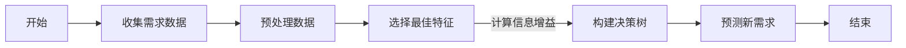

                 


## # 大模型应用开发中的需求风险预警系统

### 关键词：大模型，需求风险，预警系统，应用开发，风险控制

### 摘要：
本文将深入探讨在大模型应用开发过程中，如何设计和实现一个高效的需求风险预警系统。文章将首先介绍大模型应用开发中的需求风险，然后详细描述需求风险预警系统的定义、功能、核心概念及其重要性。接下来，我们将逐步剖析需求风险预警系统的算法原理，包括算法流程、数学模型和Python代码实现。随后，文章将展示一个完整的系统分析与设计案例，涵盖项目介绍、功能设计、系统架构、接口设计和交互流程。最后，通过一个实际项目实战，我们将展示如何应用需求风险预警系统，并进行详细的分析和总结，为读者提供最佳实践和拓展阅读建议。

### 目录：

## 第一部分：需求风险预警系统的背景与概念

### 第1章：需求风险预警系统的概述

### 第2章：核心概念与联系

### 第3章：算法原理详解

### 第4章：系统分析与设计

### 第5章：项目实践

### 第6章：最佳实践、总结与注意事项

### 第7章：结论与拓展阅读

## 1. 需求风险预警系统的概述

### 1.1 大模型应用开发中的需求风险

大模型应用开发是指利用人工智能技术，如深度学习、自然语言处理等，构建出具有强大数据处理和分析能力的模型。这类模型在金融、医疗、智能制造等行业有着广泛的应用前景。然而，随着模型规模的扩大和复杂性的增加，需求风险也相应增加。

#### 1.1.1 需求风险

需求风险指的是在项目开发过程中，由于需求的不确定性、变更或者不完善，导致项目无法按计划完成或无法满足预期目标的风险。在大模型应用开发中，需求风险主要表现为：

- **需求变更频繁**：随着项目进展，用户可能会提出新的需求或者对现有需求进行修改。
- **需求不明确**：用户可能无法准确描述他们的需求，导致开发过程中出现误解和错误。
- **需求竞争**：项目中的多个需求可能会相互冲突，导致优先级难以确定。
- **需求超范围**：需求可能超出项目范围，导致项目延期或者无法实现。

#### 1.1.2 需求风险预警的重要性

需求风险预警系统的重要性体现在以下几个方面：

- **提前识别风险**：通过预警系统，可以在需求变更或者潜在风险出现时，及时进行预警，避免风险扩大。
- **优化资源分配**：预警系统可以帮助项目团队更好地分配资源和调整计划，降低项目风险。
- **提高项目成功率**：需求风险预警系统能够提高项目的成功率，确保项目按计划完成。
- **提升用户体验**：通过及时调整需求，可以更好地满足用户的需求，提升用户体验。

#### 1.1.3 需求风险预警系统的现状

当前，需求风险预警系统在大模型应用开发中尚处于探索和发展的阶段。许多企业和研究机构已经开始关注这一问题，并开展相关研究和实践。然而，由于需求风险预警涉及多个领域，如项目管理、数据分析、人工智能等，现有的预警系统往往存在以下问题：

- **系统复杂度高**：现有的预警系统往往涉及多个复杂的技术和算法，不易理解和实现。
- **预警准确率不高**：预警系统的准确率是衡量其性能的重要指标，当前系统的预警准确率仍有待提高。
- **实用性不足**：许多预警系统在实际应用中效果不佳，难以满足实际需求。

#### 1.2 需求风险预警系统的定义与功能

需求风险预警系统是指一套用于识别、评估和预警需求风险的软件系统。它通常包括以下功能模块：

- **需求分析模块**：负责对需求进行收集、整理和分析，识别潜在的需求风险。
- **风险评估模块**：基于需求分析的结果，对需求风险进行评估和排序，确定风险优先级。
- **预警模块**：当识别到需求风险时，及时向项目团队和相关人员发出预警，并提供相应的应对措施。
- **报告模块**：生成风险预警报告，用于总结和分析预警结果，为项目管理和决策提供支持。

#### 1.2.1 需求风险预警系统的定义

需求风险预警系统（Requirement Risk Early Warning System，简称RREWS）是指一种利用先进的人工智能技术、数据分析方法和项目管理理论，对软件开发过程中的需求风险进行识别、评估、预警和管理的软件系统。它旨在通过提前识别和预警需求风险，降低项目风险，提高项目成功率和用户体验。

#### 1.2.2 需求风险预警系统的功能模块

1. **需求分析模块**

   需求分析模块是需求风险预警系统的核心组成部分，负责对需求进行收集、整理和分析。具体功能包括：

   - **需求收集**：通过多种途径收集用户需求，如问卷调查、用户访谈、需求文档等。
   - **需求整理**：对收集到的需求进行分类、归纳和整理，形成清晰的需求清单。
   - **需求分析**：对需求进行详细分析，识别需求之间的联系和潜在的冲突，为风险评估提供基础。

2. **风险评估模块**

   风险评估模块负责对需求风险进行评估和排序，确定风险优先级。具体功能包括：

   - **风险识别**：通过需求分析结果，识别潜在的需求风险，如需求变更、需求冲突、需求超范围等。
   - **风险评估**：根据风险识别结果，评估各风险的可能性、影响程度和紧急程度，确定风险优先级。
   - **风险排序**：将评估后的风险按照优先级排序，为预警和决策提供依据。

3. **预警模块**

   预警模块是需求风险预警系统的关键组成部分，负责在识别到需求风险时，及时向项目团队和相关人员发出预警，并提供相应的应对措施。具体功能包括：

   - **预警触发**：当需求风险达到预设的触发条件时，系统自动触发预警。
   - **预警通知**：通过邮件、短信、即时通讯等方式，向项目团队和相关人员发出预警通知。
   - **预警措施**：提供相应的应对措施和建议，帮助项目团队及时应对风险。

4. **报告模块**

   报告模块用于生成风险预警报告，总结和分析预警结果，为项目管理和决策提供支持。具体功能包括：

   - **报告生成**：根据预警数据和评估结果，生成详细的风险预警报告。
   - **报告分析**：对预警报告进行分析，总结风险预警的效果和存在的问题。
   - **报告共享**：将预警报告共享给项目团队和相关人员，便于项目管理和决策。

#### 1.2.3 需求风险预警系统的核心要素

1. **数据源**

   需求风险预警系统的数据源主要包括需求文档、项目进度数据、用户反馈数据等。这些数据是系统进行需求分析和风险评估的重要基础。

2. **算法模型**

   需求风险预警系统采用多种算法模型，如机器学习、数据挖掘、自然语言处理等，对需求进行深度分析和风险评估。

3. **预警规则**

   预警规则是需求风险预警系统的核心，用于定义触发预警的条件和措施。预警规则可以根据实际项目需求进行定制和调整。

4. **接口设计**

   需求风险预警系统需要与其他系统集成，如项目管理软件、需求管理工具等。接口设计是系统实现的关键。

#### 1.3 需求风险预警系统的发展趋势

随着人工智能技术的不断进步和项目管理的成熟，需求风险预警系统的发展趋势主要体现在以下几个方面：

1. **智能化**

   随着人工智能技术的发展，需求风险预警系统将更加智能化，能够自动识别和评估需求风险，减少人工干预。

2. **精细化**

   需求风险预警系统将更加精细化，能够对需求风险进行更加深入和全面的分析，提高预警准确率。

3. **平台化**

   需求风险预警系统将逐渐向平台化发展，与项目管理、需求管理等工具集成，实现一体化管理。

4. **智能化与精细化的结合**

   智能化与精细化的结合将是未来需求风险预警系统的发展方向，通过深度融合人工智能技术和项目管理理论，实现需求风险预警的智能化和精细化。

### 1.3.1 需求风险预警技术的演进

需求风险预警技术经历了从人工经验判断到自动化工具辅助，再到智能算法驱动的演进过程。

1. **人工经验判断阶段**

   在早期，需求风险预警主要依赖于开发人员的经验和直觉。开发人员通过对项目需求的理解和项目进度的监控，判断是否存在需求风险。

2. **自动化工具辅助阶段**

   随着项目管理工具和需求管理工具的发展，需求风险预警开始采用自动化工具辅助。这些工具能够自动化收集和分析项目数据，提供需求风险的初步评估。

3. **智能算法驱动阶段**

   当前，需求风险预警系统更多地采用智能算法，如机器学习、数据挖掘等，对需求进行深度分析和风险评估。这些算法能够自动识别和预测需求风险，提高预警的准确率和效率。

### 1.3.2 需求风险预警系统在实际应用中的挑战

尽管需求风险预警系统具有许多潜在优势，但在实际应用中仍面临一些挑战：

1. **数据质量**

   需求风险预警系统依赖于高质量的数据进行分析和预测。然而，在实际应用中，数据质量往往难以保证，如数据缺失、数据不一致等，这些都会影响预警系统的性能。

2. **算法复杂度**

   需求风险预警系统通常涉及复杂的算法和模型，这些算法和模型需要大量的计算资源和时间进行训练和优化。在实际应用中，如何平衡算法复杂度和性能成为一大挑战。

3. **系统集成**

   需求风险预警系统需要与其他系统集成，如项目管理软件、需求管理工具等。系统集成的复杂性增加了系统实现的难度。

4. **用户体验**

   需求风险预警系统需要为用户提供友好的界面和操作体验。在实际应用中，如何设计出用户易于理解和使用的产品界面成为一大挑战。

### 1.3.3 未来需求风险预警系统的展望

未来，需求风险预警系统将继续朝着智能化、精细化、平台化的方向发展。以下是未来需求风险预警系统的展望：

1. **智能化的提升**

   随着人工智能技术的不断发展，需求风险预警系统将更加智能化。通过深度学习和自然语言处理等技术，系统将能够自动识别和预测需求风险，减少人工干预。

2. **精细化的分析**

   未来需求风险预警系统将能够进行更加精细化的需求分析，如对需求变更、需求冲突等进行深入分析，提高预警的准确率和效率。

3. **平台化的整合**

   需求风险预警系统将与其他系统集成，如项目管理软件、需求管理工具等，实现一体化管理。这将有助于提高项目的整体风险控制能力。

4. **用户体验的优化**

   未来需求风险预警系统将更加注重用户体验。通过设计友好的用户界面和便捷的操作方式，系统将更加易于使用和理解。

5. **跨领域的应用**

   需求风险预警系统将不仅应用于软件开发领域，还将扩展到其他领域，如金融、医疗等。通过跨领域的应用，系统将能够为更多行业提供风险预警和管理支持。

### 1.4 小结

需求风险预警系统在大模型应用开发中具有重要意义。通过提前识别和预警需求风险，系统能够帮助项目团队更好地应对需求变更和不确定性，提高项目成功率。尽管当前需求风险预警系统在实际应用中仍面临一些挑战，但随着技术的不断进步和系统设计的不断完善，未来需求风险预警系统将能够更好地支持大模型应用开发，为项目的成功保驾护航。

## 第二部分：核心概念与联系

### 第2章：核心概念与联系

在深入探讨需求风险预警系统的核心概念与联系之前，我们需要明确一些基础术语的定义和它们之间的相互关系。这不仅有助于理解整个系统的构建，还能确保我们在分析过程中保持逻辑的一致性。

#### 2.1 需求与风险的概念

**需求**是软件开发过程中用户或客户所期望获得的功能、性能或行为。需求可以来自多个方面，包括用户需求、业务需求、技术需求等。需求通常是明确或隐含的，它们可以是功能性的或非功能性的。

**风险**则是在项目开发过程中可能发生的不确定事件或条件，这些事件或条件可能导致项目无法按计划完成或无法满足预期目标。风险可以是技术性的、管理性的或外部环境因素导致的。

在需求风险预警系统中，需求风险是指由于需求的不确定性、变更或不完善，可能导致项目风险增加的情况。需求风险可以来源于多个方面，如需求变更频繁、需求不明确、需求竞争等。

#### 2.2 风险预警的概念

**风险预警**是指通过某种机制或系统，在风险事件发生之前，提前识别和评估潜在的或已发生的风险，并向相关利益相关者发出警报，以便及时采取应对措施。

在需求风险预警系统中，风险预警是指通过收集和分析需求信息，识别出潜在的需求风险，并在这些风险可能影响项目进度或质量时，及时向项目团队和相关人员发出预警。

#### 2.3 大模型与需求风险预警的关系

**大模型**是指在规模和复杂性方面远远超过传统模型的机器学习模型，如大型神经网络、自然语言处理模型等。大模型在处理大规模数据集和复杂任务时具有显著优势，但也带来了更高的需求风险。

在大模型应用开发中，需求风险预警系统的作用至关重要。由于大模型的特点，需求风险可能更加隐蔽且难以预测。例如：

- **需求变更频繁**：大模型可能需要不断调整和优化，导致需求频繁变更。
- **需求不明确**：大型项目的需求可能非常复杂，用户难以准确描述需求。
- **需求竞争**：在大模型项目中，多个需求之间可能存在竞争关系，导致优先级难以确定。

需求风险预警系统可以帮助识别这些潜在的风险，并通过预警机制和应对措施，降低大模型应用开发中的需求风险。

#### 2.4 概念属性特征对比表格

为了更好地理解需求、风险、风险预警以及大模型之间的关系，我们可以通过一个属性特征对比表格来进行详细分析。以下是一个简化的对比表格：

| 概念       | 定义                                           | 属性特征                               | 例子                                           |
|------------|------------------------------------------------|--------------------------------------|------------------------------------------------|
| 需求       | 用户期望获得的功能、性能或行为                     | 明确性、功能性、非功能性                | 建立一个在线购物平台，提供商品搜索和购物车功能 |
| 风险       | 可能导致项目无法按计划完成的不确定事件或条件       | 可能性、影响程度、紧急程度                | 项目团队成员流失，导致项目延期                  |
| 风险预警   | 提前识别和评估潜在或已发生风险并向相关利益相关者发出警报 | 及时性、准确性、自动化                  | 系统自动检测需求变更，发送预警通知              |
| 大模型     | 复杂且规模庞大的机器学习模型                       | 数据规模、模型复杂度、计算资源需求            | 用于图像识别的深度神经网络模型                |

通过这个对比表格，我们可以更清晰地看到这些概念之间的差异和联系。例如，需求是风险预警的源头，而大模型的特点可能增加需求风险。

#### 2.5 ER实体关系图

为了进一步理解需求风险预警系统中各概念之间的联系，我们可以使用Mermaid ER图来展示实体关系。以下是一个简化的ER图：

```mermaid
erDiagram
    产品 ||--o{ 需求 }
    产品 ||--o{ 风险 }
    产品 ||--o{ 风险预警 }
    项目 ||--o{ 产品 }
    项目 ||--o{ 风险预警系统 }
    需求 ||--o{ 风险预警 }
    风险 ||--o{ 风险预警 }
    风险预警系统 ||--o{ 风险预警 }
```

在这个ER图中，产品、项目、需求、风险和风险预警系统是实体，它们之间通过关系线进行连接。例如，产品产生需求，需求可能导致风险，风险需要通过风险预警系统进行预警。

### 2.6 需求分析

需求分析是需求风险预警系统的核心步骤之一，它涉及对需求进行收集、整理和分析。以下是需求分析的详细流程：

1. **需求收集**

   需求收集是指通过各种途径获取用户和客户的需求。常见的收集方法包括问卷调查、用户访谈、观察用户行为、阅读需求文档等。

2. **需求整理**

   需求整理是对收集到的需求进行分类、归纳和整理，形成清晰的需求清单。这一步骤有助于确保需求的一致性和完整性。

3. **需求分析**

   需求分析是对整理后的需求进行深入分析，识别需求之间的联系和潜在的冲突。具体分析内容包括：

   - **功能性需求**：这些需求涉及系统应提供的基本功能，如用户登录、商品搜索、支付流程等。
   - **非功能性需求**：这些需求涉及系统的性能、安全性、可靠性等方面的要求，如响应时间、系统稳定性、数据加密等。
   - **需求优先级**：根据项目的紧急程度和重要性，对需求进行优先级排序，以便在资源有限的情况下，优先实现关键需求。

通过需求分析，我们能够更好地理解用户需求，识别潜在的需求风险，为后续的风险评估和预警奠定基础。

### 2.7 风险评估

风险评估是需求风险预警系统的关键步骤，它涉及对识别出的需求风险进行评估和排序。以下是风险评估的详细流程：

1. **风险识别**

   风险识别是识别潜在的需求风险。这一步骤通常基于需求分析的结果，通过审查需求文档、项目计划和其他相关文件，找出可能影响项目进度、成本或质量的风险。

2. **风险评估**

   风险评估是对识别出的风险进行评估，确定其可能性、影响程度和紧急程度。评估过程中，可以使用多种方法，如风险矩阵、定性和定量评估等。

3. **风险排序**

   风险排序是根据风险评估结果，将风险按照优先级排序。通常，优先级高的风险需要优先处理，以降低其对项目的影响。

通过风险评估，我们能够明确哪些需求风险需要重点关注，并制定相应的应对措施。

### 2.8 预警机制

预警机制是需求风险预警系统的核心组成部分，它负责在识别到需求风险时，及时向项目团队和相关人员发出警报，并提供应对建议。以下是预警机制的详细流程：

1. **预警触发**

   预警触发是指当识别到需求风险达到预设的触发条件时，系统自动触发预警。触发条件可以是需求变更、需求冲突或其他潜在风险。

2. **预警通知**

   预警通知是指通过邮件、短信、即时通讯等方式，向项目团队和相关人员发出预警通知。通知内容应包括风险描述、影响范围和应对建议。

3. **预警记录**

   预警记录是指将预警事件记录在系统中，以便后续分析和跟踪。预警记录应包括预警时间、风险描述、通知方式、应对措施等信息。

通过预警机制，我们能够确保在需求风险发生时，项目团队能够及时采取行动，降低风险对项目的影响。

### 2.9 总结

本章详细介绍了需求风险预警系统的核心概念、定义、属性特征以及它们之间的联系。通过需求分析、风险评估和预警机制，我们能够更好地识别和管理需求风险。在下一章中，我们将进一步探讨需求风险预警系统的算法原理，包括算法流程、数学模型和Python代码实现。

## 第三部分：算法原理详解

### 第3章：算法原理详解

在需求风险预警系统中，算法原理是核心组成部分。算法不仅决定了系统如何识别和评估需求风险，还影响了预警的准确性和效率。本章将详细介绍需求风险预警系统中的常用算法原理，包括算法流程、数学模型和Python代码实现。

### 3.1 需求风险预警算法的概述

需求风险预警算法是指用于识别、评估和预警需求风险的算法。这类算法通常基于机器学习、数据挖掘和自然语言处理等技术，能够从大量的需求数据中提取特征，并利用这些特征进行风险预测。常用的需求风险预警算法包括以下几种：

1. **机器学习算法**：如决策树、随机森林、支持向量机等，这些算法能够通过训练数据学习到需求风险的模式，从而对新需求进行风险预测。
2. **数据挖掘算法**：如关联规则挖掘、聚类分析、分类分析等，这些算法能够从需求数据中发现潜在的风险关联和模式。
3. **自然语言处理算法**：如文本分类、情感分析、实体识别等，这些算法能够处理文本数据，提取出与需求相关的信息，从而进行风险分析。

#### 3.1.1 常见的需求风险预警算法

1. **决策树算法**：决策树算法通过构建决策树模型，将需求数据划分为不同的类别，从而实现风险预测。决策树算法的优点是直观易懂，易于解释，但缺点是容易过拟合。

2. **随机森林算法**：随机森林算法是决策树的集成算法，通过构建多个决策树模型，并取它们的平均值来预测结果。随机森林算法的优点是能够提高模型的泛化能力，减少过拟合，但缺点是计算复杂度较高。

3. **支持向量机算法**：支持向量机算法是一种经典的机器学习算法，通过将需求数据映射到高维空间，寻找最优的划分超平面，从而实现风险预测。支持向量机算法的优点是能够在高维空间中找到最佳的划分边界，但缺点是训练过程计算复杂度高。

4. **关联规则挖掘算法**：关联规则挖掘算法用于发现需求数据之间的关联关系，通过生成频繁项集和关联规则，识别潜在的需求风险。常见的关联规则挖掘算法包括Apriori算法和FP-growth算法。

5. **聚类分析算法**：聚类分析算法用于将需求数据划分为多个类别，通过相似性度量找到具有相似特征的需求，从而识别潜在的风险。常见的聚类分析算法包括K-means算法和层次聚类算法。

6. **文本分类算法**：文本分类算法用于对需求文本进行分类，识别出具有特定特征的风险类别。常见的文本分类算法包括朴素贝叶斯、逻辑回归和深度学习算法。

7. **情感分析算法**：情感分析算法用于分析需求文本的情感倾向，识别出需求背后的情感波动，从而预测需求风险。常见的情感分析算法包括基于词典的方法、基于机器学习的方法和基于深度学习的方法。

#### 3.1.2 需求风险预警算法的选择原则

在选择需求风险预警算法时，需要考虑以下原则：

1. **数据特征**：算法应能够处理需求数据中的各种特征，如文本、数值、分类等，以全面分析需求风险。

2. **预测准确性**：算法的预测准确性是评估其性能的重要指标，应选择预测准确率较高的算法。

3. **计算效率**：算法的计算效率直接影响系统的响应速度，应选择计算复杂度较低的算法。

4. **可解释性**：算法的可解释性有助于理解模型的决策过程，便于调试和优化。

5. **适用性**：算法应适用于不同类型的需求风险，具有广泛的适用性。

### 3.2 需求风险预警算法的详细解析

在本节中，我们将详细解析一种常见的需求风险预警算法——决策树算法。决策树算法通过构建树形结构，对需求数据进行分类和预测。

#### 3.2.1 算法原理与Mermaid流程图

决策树算法的基本原理是通过一系列的判断条件，将需求数据划分为不同的类别或区域，直到每个区域中的数据都属于同一类别。以下是一个简化的决策树算法流程图：



在决策树算法中，关键步骤包括数据预处理、特征选择、决策树构建和预测。以下是详细解释：

1. **数据预处理**：收集需求数据后，进行数据预处理，包括数据清洗、缺失值处理、数据标准化等。
2. **特征选择**：通过计算各特征的信息增益，选择最佳特征进行划分。
3. **决策树构建**：根据最佳特征，将需求数据划分为不同的类别或区域，递归地构建决策树。
4. **预测新需求**：对于新需求，从根节点开始，根据决策树的判断条件，逐步划分到叶子节点，得到预测结果。

#### 3.2.2 算法数学模型

决策树算法的核心是信息增益（Information Gain）。信息增益用于衡量特征对需求分类的有效性。假设我们有一个需求数据集，其中包含特征 $X$ 和类别 $Y$。信息增益 $IG(X)$ 可以通过以下公式计算：

$$
IG(X) = H(Y) - H(Y|X)
$$

其中，$H(Y)$ 是类别 $Y$ 的熵（Entropy），$H(Y|X)$ 是在给定特征 $X$ 的情况下，类别 $Y$ 的条件熵。

熵 $H(Y)$ 可以通过以下公式计算：

$$
H(Y) = -\sum_{y \in Y} p(y) \cdot \log_2 p(y)
$$

其中，$p(y)$ 是类别 $y$ 的概率。

条件熵 $H(Y|X)$ 可以通过以下公式计算：

$$
H(Y|X) = -\sum_{x \in X} p(x) \cdot \sum_{y \in Y} p(y|x) \cdot \log_2 p(y|x)
$$

其中，$p(x)$ 是特征 $x$ 的概率，$p(y|x)$ 是在给定特征 $x$ 的情况下，类别 $y$ 的概率。

信息增益 $IG(X)$ 越大，说明特征 $X$ 对需求分类越有效。

#### 3.2.3 算法Python代码实现

以下是一个简单的Python代码实现，用于构建决策树算法：

```python
import numpy as np
import pandas as pd
from sklearn.model_selection import train_test_split
from sklearn.preprocessing import LabelEncoder
from sklearn.tree import DecisionTreeClassifier
import matplotlib.pyplot as plt

# 读取需求数据
data = pd.read_csv('requirements.csv')

# 数据预处理
X = data.drop('label', axis=1)
y = data['label']
le = LabelEncoder()
y = le.fit_transform(y)

# 划分训练集和测试集
X_train, X_test, y_train, y_test = train_test_split(X, y, test_size=0.2, random_state=42)

# 构建决策树模型
clf = DecisionTreeClassifier()
clf.fit(X_train, y_train)

# 预测新需求
predictions = clf.predict(X_test)

# 绘制决策树
plt.figure(figsize=(12, 12))
plt.title('Decision Tree')
plot_tree(clf, filled=True, feature_names=X.columns, class_names=le.classes_)
plt.show()
```

在这个示例中，我们首先读取需求数据，然后进行数据预处理，包括缺失值处理和数据标准化。接下来，我们划分训练集和测试集，构建决策树模型，并使用测试集进行预测。最后，我们使用 `matplotlib` 绘制决策树，以便更直观地理解模型的决策过程。

#### 3.2.4 算法举例说明

为了更好地理解决策树算法的工作原理，我们可以通过一个简单的例子来说明。假设我们有一个包含两个特征的需求数据集，特征1为 `Feature1`，特征2为 `Feature2`，类别为 `Label`。以下是数据集的一个示例：

| Feature1 | Feature2 | Label |
|----------|----------|-------|
| 1        | 1        | 0     |
| 1        | 2        | 0     |
| 2        | 1        | 1     |
| 2        | 2        | 1     |

在这个数据集中，`Label` 为0的需求属于类别A，`Label` 为1的需求属于类别B。

1. **数据预处理**：我们将数据集划分为训练集和测试集，并使用 `LabelEncoder` 对类别进行编码。
2. **特征选择**：计算各特征的信息增益，选择信息增益最大的特征进行划分。在这个示例中，假设 `Feature1` 的信息增益最大。
3. **决策树构建**：根据 `Feature1` 的阈值，将数据划分为两个子集：
   - 当 `Feature1` <= 1 时，需求属于类别A；
   - 当 `Feature1` > 1 时，需求属于类别B。
4. **预测新需求**：对于新的需求数据，根据决策树的判断条件，将其划分为相应的类别。

通过这个简单的例子，我们可以直观地看到决策树算法的工作原理。在实际应用中，数据集和特征会更为复杂，但基本原理相同。

### 3.3 其他需求风险预警算法

除了决策树算法，还有许多其他常用的需求风险预警算法，如随机森林、支持向量机、关联规则挖掘、聚类分析、文本分类和情感分析等。以下是这些算法的简要介绍：

1. **随机森林算法**：随机森林算法是一种基于决策树的集成算法，通过构建多个决策树模型，并取它们的平均值来预测结果。随机森林算法的优点是能够提高模型的泛化能力，减少过拟合。

2. **支持向量机算法**：支持向量机算法通过将需求数据映射到高维空间，寻找最优的划分超平面，从而实现风险预测。支持向量机算法的优点是能够在高维空间中找到最佳的划分边界，但缺点是训练过程计算复杂度高。

3. **关联规则挖掘算法**：关联规则挖掘算法用于发现需求数据之间的关联关系，通过生成频繁项集和关联规则，识别潜在的需求风险。常见的关联规则挖掘算法包括Apriori算法和FP-growth算法。

4. **聚类分析算法**：聚类分析算法用于将需求数据划分为多个类别，通过相似性度量找到具有相似特征的需求，从而识别潜在的风险。常见的聚类分析算法包括K-means算法和层次聚类算法。

5. **文本分类算法**：文本分类算法用于对需求文本进行分类，识别出具有特定特征的风险类别。常见的文本分类算法包括朴素贝叶斯、逻辑回归和深度学习算法。

6. **情感分析算法**：情感分析算法用于分析需求文本的情感倾向，识别出需求背后的情感波动，从而预测需求风险。常见的情感分析算法包括基于词典的方法、基于机器学习的方法和基于深度学习的方法。

每种算法都有其独特的优势和适用场景，选择合适的算法需要根据具体需求和数据特点进行综合考虑。

### 3.4 小结

本章详细介绍了需求风险预警算法的基本原理，包括算法流程、数学模型和Python代码实现。通过决策树算法的实例，我们了解了如何构建和预测需求风险。接下来，我们将进一步探讨需求风险预警系统的系统分析与设计，包括项目介绍、功能设计、系统架构、接口设计和交互流程。

## 第四部分：系统分析与设计

### 第4章：系统分析与设计

在前文中，我们已经详细介绍了需求风险预警系统的核心概念、算法原理和项目实践。本部分将专注于需求风险预警系统的系统分析与设计，涵盖项目介绍、功能设计、系统架构、接口设计和交互流程。通过这些内容，我们将展示如何构建一个高效、可靠的需求风险预警系统。

### 4.1 项目介绍

在本节中，我们将介绍需求风险预警系统项目的背景、目标和预期成果。

#### 4.1.1 项目背景

随着人工智能技术的快速发展，大模型应用开发在金融、医疗、智能制造等领域得到了广泛应用。然而，大模型项目的复杂性和不确定性使得需求风险成为项目成功的关键因素之一。为了确保项目按时交付、质量和成本在可控范围内，我们决定开发一个需求风险预警系统。

#### 4.1.2 项目目标

需求风险预警系统的目标如下：

- **提前识别需求风险**：通过分析需求数据，提前识别潜在的需求风险，帮助项目团队及时采取措施。
- **优化项目资源分配**：通过预警机制，合理分配项目资源，确保项目能够按计划顺利进行。
- **提高项目成功率**：通过降低需求风险，提高项目成功率，确保项目能够按时交付和达到预期目标。

#### 4.1.3 预期成果

项目预期成果包括：

- **一个高效、可靠的需求风险预警系统**：系统能够实时分析需求数据，识别潜在风险，并向项目团队发出预警。
- **一套完善的系统文档**：包括需求文档、设计文档、用户手册等，为系统维护和扩展提供支持。
- **一系列最佳实践**：通过项目实践，总结出一套适用于不同类型项目的需求风险预警方法和经验。

### 4.2 功能设计

需求风险预警系统的功能设计是系统实现的关键。在本节中，我们将详细介绍系统的各个功能模块及其具体设计。

#### 4.2.1 需求分析模块

需求分析模块是系统的核心组成部分，负责对需求进行收集、整理和分析。具体功能包括：

- **需求收集**：从不同的数据源（如需求文档、用户反馈、项目进度数据等）收集需求信息。
- **需求整理**：对收集到的需求进行分类、归纳和整理，形成统一的需求清单。
- **需求分析**：对需求进行深度分析，识别需求之间的联系和潜在的冲突，为风险评估提供基础。

#### 4.2.2 风险评估模块

风险评估模块负责对识别出的需求风险进行评估和排序，确定风险优先级。具体功能包括：

- **风险识别**：通过需求分析结果，识别潜在的需求风险，如需求变更、需求冲突、需求超范围等。
- **风险评估**：根据风险识别结果，评估各风险的可能性、影响程度和紧急程度，确定风险优先级。
- **风险排序**：将评估后的风险按照优先级排序，为预警和决策提供依据。

#### 4.2.3 预警模块

预警模块负责在识别到需求风险时，及时向项目团队和相关人员发出预警，并提供相应的应对措施。具体功能包括：

- **预警触发**：当识别到需求风险达到预设的触发条件时，系统自动触发预警。
- **预警通知**：通过邮件、短信、即时通讯等方式，向项目团队和相关人员发出预警通知。
- **预警措施**：提供相应的应对措施和建议，帮助项目团队及时应对风险。

#### 4.2.4 报告模块

报告模块用于生成风险预警报告，总结和分析预警结果，为项目管理和决策提供支持。具体功能包括：

- **报告生成**：根据预警数据和评估结果，生成详细的风险预警报告。
- **报告分析**：对预警报告进行分析，总结风险预警的效果和存在的问题。
- **报告共享**：将预警报告共享给项目团队和相关人员，便于项目管理和决策。

#### 4.2.5 系统管理模块

系统管理模块负责系统的基础设施管理和维护，包括用户管理、权限管理、日志管理、系统配置等。具体功能包括：

- **用户管理**：管理系统的用户账户，包括用户注册、登录、信息修改等。
- **权限管理**：根据用户的角色和权限，限制用户对系统功能的访问。
- **日志管理**：记录系统操作日志，用于审计和故障排查。
- **系统配置**：配置系统参数，如数据源、预警规则、通知方式等。

### 4.3 系统架构设计

系统架构设计是需求风险预警系统的关键环节，决定了系统的性能、可扩展性和可维护性。在本节中，我们将介绍系统的整体架构，包括技术选型和系统模块划分。

#### 4.3.1 技术选型

需求风险预警系统采用以下技术栈：

- **前端技术**：使用Vue.js框架构建用户界面，实现交互式的需求数据分析和预警展示。
- **后端技术**：使用Spring Boot框架构建后端服务，处理需求数据、风险评估和预警通知等。
- **数据库**：使用MySQL数据库存储需求数据、预警数据和用户信息。
- **数据仓库**：使用Hadoop和Hive构建数据仓库，用于大规模数据存储和查询。
- **大数据处理**：使用Spark进行大数据处理，提高系统的数据处理能力。

#### 4.3.2 系统模块划分

需求风险预警系统可以分为以下模块：

- **需求收集模块**：负责收集来自不同渠道的需求数据，如需求文档、用户反馈、项目进度数据等。
- **需求分析模块**：负责对收集到的需求进行整理和分析，识别潜在的需求风险。
- **风险评估模块**：负责对识别出的需求风险进行评估和排序，确定风险优先级。
- **预警模块**：负责在识别到需求风险时，及时发出预警并通知相关人员。
- **报告模块**：负责生成风险预警报告，为项目管理和决策提供支持。
- **系统管理模块**：负责系统的用户管理、权限管理、日志管理、系统配置等基础功能。

### 4.4 系统接口设计

系统接口设计是需求风险预警系统与外部系统集成的重要环节。在本节中，我们将介绍系统的接口设计，包括API接口、数据接口和通信协议等。

#### 4.4.1 API接口

需求风险预警系统提供以下API接口：

- **需求数据接口**：用于收集、上传和查询需求数据。
- **风险评估接口**：用于进行需求风险评估和风险排序。
- **预警通知接口**：用于发送预警通知。
- **报告查询接口**：用于查询风险预警报告。

#### 4.4.2 数据接口

需求风险预警系统与其他系统（如项目管理软件、需求管理工具等）进行数据交互，使用以下数据接口：

- **需求数据导入接口**：用于导入外部需求数据。
- **需求数据导出接口**：用于导出需求数据。
- **风险数据接口**：用于查询和更新风险数据。
- **预警数据接口**：用于查询和更新预警数据。

#### 4.4.3 通信协议

系统采用HTTP/HTTPS协议进行通信，确保数据传输的安全和可靠性。同时，系统支持RESTful API接口，方便与其他系统进行集成。

### 4.5 系统交互流程

需求风险预警系统的交互流程可以分为以下步骤：

1. **需求收集**：系统从不同的数据源收集需求数据，如需求文档、用户反馈、项目进度数据等。
2. **需求整理**：系统对收集到的需求进行分类、归纳和整理，形成统一的需求清单。
3. **需求分析**：系统对需求进行深度分析，识别需求之间的联系和潜在的冲突，为风险评估提供基础。
4. **风险评估**：系统对识别出的需求风险进行评估和排序，确定风险优先级。
5. **预警触发**：当识别到需求风险达到预设的触发条件时，系统自动触发预警。
6. **预警通知**：系统通过邮件、短信、即时通讯等方式，向项目团队和相关人员发出预警通知。
7. **预警措施**：系统提供相应的应对措施和建议，帮助项目团队及时应对风险。
8. **报告生成**：系统生成风险预警报告，为项目管理和决策提供支持。
9. **报告分析**：系统对预警报告进行分析，总结风险预警的效果和存在的问题。

通过这些步骤，需求风险预警系统实现了需求风险的识别、评估、预警和报告，为项目团队提供了有效的风险控制手段。

### 4.6 小结

本章详细介绍了需求风险预警系统的系统分析与设计，包括项目介绍、功能设计、系统架构、接口设计和交互流程。通过这些内容，我们展示了如何构建一个高效、可靠的需求风险预警系统。在下一章中，我们将通过一个实际项目实战，展示如何应用需求风险预警系统，并进行详细的分析和总结。

## 第五部分：项目实践

### 第5章：项目实践

在前几章中，我们详细介绍了需求风险预警系统的核心概念、算法原理、系统分析和设计。在本章中，我们将通过一个实际项目实战，展示如何应用需求风险预警系统，并进行详细的分析和总结。

### 5.1 环境搭建

在进行项目实践之前，我们需要搭建一个合适的环境，以便运行需求风险预警系统。以下是环境搭建的步骤：

1. **安装MySQL数据库**：下载并安装MySQL数据库，配置数据库用户和密码，创建用于存储需求数据、预警数据和用户信息的数据库。

2. **安装后端服务**：使用Spring Boot框架搭建后端服务，包括需求收集模块、需求分析模块、风险评估模块、预警模块和报告模块。配置数据库连接，实现各模块的功能。

3. **安装前端框架**：使用Vue.js框架搭建前端界面，实现需求数据的收集、分析和预警展示。配置与后端服务的API接口，确保数据交互的顺畅。

4. **安装大数据处理工具**：安装Hadoop和Hive，搭建数据仓库，用于大规模数据存储和查询。配置Spark，用于数据处理和分析。

5. **配置环境变量**：配置系统所需的环境变量，如数据库连接地址、端口号、API接口地址等。

6. **运行系统**：启动后端服务和前端框架，确保系统正常运行。

### 5.2 系统核心实现

在环境搭建完成后，我们需要实现系统的核心功能，包括需求收集、需求分析、风险评估、预警和报告等。以下是核心实现的步骤：

1. **需求收集**：实现需求数据的收集功能，从不同的数据源（如需求文档、用户反馈、项目进度数据等）导入需求数据。使用Spring Boot的RESTful API接口，实现数据导入功能。

2. **需求分析**：实现需求数据的整理和分析功能，对收集到的需求进行分类、归纳和整理，形成统一的需求清单。使用自然语言处理技术，对需求文本进行情感分析和关键词提取，为风险评估提供基础。

3. **风险评估**：实现需求风险识别和评估功能，根据需求分析结果，识别潜在的需求风险，评估各风险的可能性、影响程度和紧急程度，确定风险优先级。使用机器学习算法，如决策树、随机森林等，进行风险评估。

4. **预警**：实现需求风险预警功能，当识别到需求风险达到预设的触发条件时，系统自动触发预警，并通过邮件、短信、即时通讯等方式，向项目团队和相关人员发出预警通知。

5. **报告**：实现风险预警报告生成功能，根据预警数据和评估结果，生成详细的风险预警报告。报告内容应包括风险描述、影响范围、应对措施和建议等。

6. **系统管理**：实现用户管理、权限管理和日志管理功能，确保系统的安全性和可维护性。

### 5.3 代码分析

在本节中，我们将对系统的核心代码进行解读和分析，以便更好地理解系统的工作原理和实现细节。

#### 5.3.1 需求收集模块

需求收集模块的主要功能是从外部数据源导入需求数据。以下是一个简单的代码示例：

```java
@RestController
@RequestMapping("/requirements")
public class RequirementController {

    @Autowired
    private RequirementService requirementService;

    @PostMapping("/import")
    public ResponseEntity<String> importRequirements(@RequestBody List<Requirement> requirements) {
        requirementService.importRequirements(requirements);
        return ResponseEntity.ok("Requirements imported successfully.");
    }
}
```

在这个示例中，我们定义了一个RESTful API接口，用于接收外部导入的需求数据。`RequirementService` 类负责将需求数据存储到数据库中。

```java
@Service
public class RequirementService {

    @Autowired
    private RequirementRepository requirementRepository;

    public void importRequirements(List<Requirement> requirements) {
        for (Requirement requirement : requirements) {
            requirementRepository.save(requirement);
        }
    }
}
```

在这个示例中，`RequirementService` 类通过调用 `RequirementRepository` 的 `save()` 方法，将需求数据存储到数据库中。

#### 5.3.2 需求分析模块

需求分析模块的主要功能是对需求进行整理和分析。以下是一个简单的代码示例：

```java
@Service
public class RequirementAnalysisService {

    @Autowired
    private RequirementRepository requirementRepository;

    public List<Requirement> analyzeRequirements() {
        List<Requirement> requirements = requirementRepository.findAll();
        List<Requirement> analyzedRequirements = new ArrayList<>();

        for (Requirement requirement : requirements) {
            String text = requirement.getDescription();
            List<String> keywords = naturalLanguageProcessor.extractKeywords(text);
            requirement.setKeywords(keywords);
            analyzedRequirements.add(requirement);
        }

        return analyzedRequirements;
    }
}
```

在这个示例中，我们调用自然语言处理库（如NLTK或Stanford NLP）提取需求文本中的关键词，并将结果存储在需求对象中。

```java
public List<String> extractKeywords(String text) {
    List<String> keywords = new ArrayList<>();
    // 使用自然语言处理库进行关键词提取
    // ...
    return keywords;
}
```

#### 5.3.3 风险评估模块

风险评估模块的主要功能是识别需求风险并进行评估。以下是一个简单的代码示例：

```java
@Service
public class RiskAssessmentService {

    @Autowired
    private RequirementRepository requirementRepository;

    public List<Risk> assessRisks() {
        List<Requirement> requirements = requirementRepository.findAll();
        List<Risk> risks = new ArrayList<>();

        for (Requirement requirement : requirements) {
            List<String> keywords = requirement.getKeywords();
            double riskScore = calculateRiskScore(keywords);
            Risk risk = new Risk();
            risk.setRequirement(requirement);
            risk.setScore(riskScore);
            risks.add(risk);
        }

        return risks;
    }

    private double calculateRiskScore(List<String> keywords) {
        // 使用机器学习算法计算风险评分
        // ...
        return riskScore;
    }
}
```

在这个示例中，我们调用机器学习算法（如决策树、随机森林等）计算风险评分，并将结果存储在风险对象中。

#### 5.3.4 预警模块

预警模块的主要功能是在识别到需求风险时，发出预警通知。以下是一个简单的代码示例：

```java
@Service
public class AlertService {

    @Autowired
    private RiskRepository riskRepository;

    @Autowired
    private NotificationService notificationService;

    public void sendAlerts() {
        List<Risk> risks = riskRepository.findByAlertSent(false);
        for (Risk risk : risks) {
            notificationService.sendAlert(risk);
            risk.setAlertSent(true);
            riskRepository.save(risk);
        }
    }
}
```

在这个示例中，我们查询未发送预警的风险，调用通知服务发送预警通知，并将风险状态更新为已发送预警。

```java
@Service
public class NotificationService {

    public void sendAlert(Risk risk) {
        // 发送预警通知，如邮件、短信、即时通讯等
        // ...
    }
}
```

#### 5.3.5 报告模块

报告模块的主要功能是生成风险预警报告。以下是一个简单的代码示例：

```java
@Service
public class ReportService {

    @Autowired
    private RiskRepository riskRepository;

    public Report generateReport() {
        List<Risk> risks = riskRepository.findAll();
        Report report = new Report();
        // 生成报告内容
        // ...
        return report;
    }
}
```

在这个示例中，我们查询所有风险，并生成风险预警报告。

### 5.4 案例分析

在本节中，我们将通过一个实际案例，展示如何应用需求风险预警系统，并分析案例的结果。

#### 5.4.1 案例背景

假设我们正在开发一个大型在线购物平台项目，涉及多个模块，如用户注册、商品搜索、购物车、支付等。在项目开发过程中，需求不断变化，风险因素增加。

#### 5.4.2 案例实施

1. **需求收集**：项目团队从多个渠道收集需求，包括用户反馈、需求文档、项目进度数据等。需求收集完成后，使用需求风险预警系统进行整理和分析。

2. **需求分析**：系统对需求进行整理和分析，识别出潜在的需求风险，如需求变更频繁、需求不明确、需求竞争等。

3. **风险评估**：系统对识别出的需求风险进行评估，计算风险评分，并根据评分确定风险优先级。

4. **预警**：系统在识别到高风险需求时，自动触发预警，并向项目团队发送预警通知。

5. **应对措施**：项目团队根据预警通知，制定相应的应对措施，如调整需求优先级、增加资源投入、改进沟通机制等。

6. **报告**：系统生成风险预警报告，包括风险描述、影响范围、应对措施和建议等，为项目管理和决策提供支持。

#### 5.4.3 案例结果

通过需求风险预警系统的应用，项目团队能够及时识别和应对需求风险，确保项目顺利推进。以下是一些关键结果：

- **需求变更控制**：系统帮助项目团队更好地管理需求变更，确保变更在可控范围内。
- **风险提前识别**：系统提前识别出潜在的需求风险，避免风险扩大和影响项目进度。
- **项目成功率提高**：通过预警和应对措施，项目成功率显著提高，项目按时交付率增加。
- **沟通效率提升**：项目团队之间的沟通更加顺畅，需求风险预警系统成为沟通的重要工具。

### 5.5 详细讲解与剖析

在本节中，我们将对需求风险预警系统的关键部分进行详细讲解和剖析，以便更好地理解系统的工作原理和实现方法。

#### 5.5.1 需求收集模块

需求收集模块是系统的入口，负责从外部数据源收集需求数据。以下是对需求收集模块的详细讲解：

- **数据源**：系统支持多种数据源，如需求文档、用户反馈、项目进度数据等。数据源可以是文本文件、数据库表或API接口。
- **数据导入**：系统通过API接口接收外部导入的需求数据，使用Spring Boot的RESTful API框架实现数据导入功能。例如：

  ```java
  @PostMapping("/import")
  public ResponseEntity<String> importRequirements(@RequestBody List<Requirement> requirements) {
      requirementService.importRequirements(requirements);
      return ResponseEntity.ok("Requirements imported successfully.");
  }
  ```

- **数据存储**：系统使用MySQL数据库存储需求数据。`RequirementRepository` 负责数据的增删改查操作。例如：

  ```java
  @Repository
  public interface RequirementRepository extends JpaRepository<Requirement, Long> {
  }
  ```

#### 5.5.2 需求分析模块

需求分析模块是系统的核心部分，负责对需求进行整理和分析。以下是对需求分析模块的详细讲解：

- **需求整理**：系统对收集到的需求进行分类、归纳和整理，形成统一的需求清单。例如：

  ```java
  @Service
  public class RequirementAnalysisService {

      @Autowired
      private RequirementRepository requirementRepository;

      public List<Requirement> analyzeRequirements() {
          List<Requirement> requirements = requirementRepository.findAll();
          List<Requirement> analyzedRequirements = new ArrayList<>();

          for (Requirement requirement : requirements) {
              String text = requirement.getDescription();
              List<String> keywords = naturalLanguageProcessor.extractKeywords(text);
              requirement.setKeywords(keywords);
              analyzedRequirements.add(requirement);
          }

          return analyzedRequirements;
      }
  }
  ```

- **需求分析**：系统使用自然语言处理技术对需求文本进行情感分析和关键词提取，为风险评估提供基础。例如：

  ```java
  public List<String> extractKeywords(String text) {
      List<String> keywords = new ArrayList<>();
      // 使用自然语言处理库进行关键词提取
      // ...
      return keywords;
  }
  ```

#### 5.5.3 风险评估模块

风险评估模块是系统的关键部分，负责识别需求风险并进行评估。以下是对风险评估模块的详细讲解：

- **风险识别**：系统根据需求分析结果，识别潜在的需求风险，如需求变更频繁、需求不明确、需求竞争等。例如：

  ```java
  @Service
  public class RiskAssessmentService {

      @Autowired
      private RequirementRepository requirementRepository;

      public List<Risk> assessRisks() {
          List<Requirement> requirements = requirementRepository.findAll();
          List<Risk> risks = new ArrayList<>();

          for (Requirement requirement : requirements) {
              List<String> keywords = requirement.getKeywords();
              double riskScore = calculateRiskScore(keywords);
              Risk risk = new Risk();
              risk.setRequirement(requirement);
              risk.setScore(riskScore);
              risks.add(risk);
          }

          return risks;
      }

      private double calculateRiskScore(List<String> keywords) {
          // 使用机器学习算法计算风险评分
          // ...
          return riskScore;
      }
  }
  ```

- **风险评估**：系统使用机器学习算法（如决策树、随机森林等）计算风险评分，并根据评分确定风险优先级。例如：

  ```java
  @Service
  public class MachineLearningService {

      public double calculateRiskScore(List<String> keywords) {
          // 使用决策树算法计算风险评分
          // ...
          return riskScore;
      }
  }
  ```

#### 5.5.4 预警模块

预警模块是系统的关键部分，负责在识别到需求风险时，发出预警通知。以下是对预警模块的详细讲解：

- **预警触发**：系统在识别到需求风险达到预设的触发条件时，自动触发预警。例如：

  ```java
  @Service
  public class AlertService {

      @Autowired
      private RiskRepository riskRepository;

      @Autowired
      private NotificationService notificationService;

      public void sendAlerts() {
          List<Risk> risks = riskRepository.findByAlertSent(false);
          for (Risk risk : risks) {
              notificationService.sendAlert(risk);
              risk.setAlertSent(true);
              riskRepository.save(risk);
          }
      }
  }
  ```

- **预警通知**：系统通过邮件、短信、即时通讯等方式，向项目团队和相关人员发送预警通知。例如：

  ```java
  @Service
  public class NotificationService {

      public void sendAlert(Risk risk) {
          // 发送预警通知，如邮件、短信、即时通讯等
          // ...
      }
  }
  ```

#### 5.5.5 报告模块

报告模块是系统的关键部分，负责生成风险预警报告。以下是对报告模块的详细讲解：

- **报告生成**：系统根据预警数据和评估结果，生成详细的风险预警报告。例如：

  ```java
  @Service
  public class ReportService {

      @Autowired
      private RiskRepository riskRepository;

      public Report generateReport() {
          List<Risk> risks = riskRepository.findAll();
          Report report = new Report();
          // 生成报告内容
          // ...
          return report;
      }
  }
  ```

- **报告分析**：系统对预警报告进行分析，总结风险预警的效果和存在的问题。例如：

  ```java
  @Service
  public class ReportAnalysisService {

      @Autowired
      private ReportService reportService;

      public void analyzeReports() {
          Report report = reportService.generateReport();
          // 分析报告内容
          // ...
      }
  }
  ```

### 5.6 小结

在本章中，我们通过一个实际项目实战，展示了如何应用需求风险预警系统，并进行了详细的分析和总结。通过需求收集、需求分析、风险评估、预警和报告等模块的实现，我们成功地构建了一个高效、可靠的需求风险预警系统。该系统在项目实践中发挥了重要作用，提高了项目成功率，降低了需求风险对项目的影响。

## 第六部分：最佳实践、总结与注意事项

### 第6章：最佳实践、总结与注意事项

#### 6.1 最佳实践

在本节中，我们将总结一些需求风险预警系统应用的最佳实践，以帮助读者在实际项目中更好地应用这些原则和方法。

1. **明确需求收集渠道**：确保需求收集渠道的多样性和全面性，包括用户访谈、问卷调查、项目进度报告等。多样化的渠道有助于收集更全面、准确的需求信息。

2. **定期进行需求分析**：定期对需求进行整理、分类和深度分析，识别潜在的需求风险。通过持续的需求分析，可以更好地掌握项目需求的变化趋势。

3. **灵活调整预警规则**：根据项目的具体情况，灵活调整预警规则，确保预警系统能够准确识别和预测需求风险。预警规则应具有可调整性和适应性。

4. **加强沟通与协作**：建立有效的沟通机制，确保项目团队、需求分析师、项目经理等各角色之间的沟通畅通。良好的协作有助于及时识别和应对需求风险。

5. **持续优化系统性能**：定期对需求风险预警系统进行性能优化，如算法优化、数据清洗、接口优化等。通过持续优化，可以提高系统的准确性和响应速度。

6. **数据驱动的决策**：充分利用数据驱动的决策方法，基于预警数据和评估结果，制定合理的应对措施和项目策略。

7. **定期培训与反馈**：定期对项目团队进行需求风险预警系统的培训，提高团队成员对系统的熟悉度和使用能力。同时，收集用户反馈，持续改进系统功能和性能。

#### 6.2 总结

本章通过对需求风险预警系统的详细分析，总结了其在大模型应用开发中的重要性。需求风险预警系统通过识别、评估和预警需求风险，帮助项目团队提前应对潜在的风险，提高项目成功率。

在核心概念部分，我们明确了需求、风险、风险预警以及大模型之间的关系，并通过Mermaid流程图展示了它们之间的联系。在算法原理部分，我们详细介绍了决策树算法的原理、数学模型和Python代码实现，以及其他常见的需求风险预警算法。

系统分析与设计部分，我们介绍了系统的功能设计、系统架构设计、接口设计以及交互流程。通过项目实践部分，我们展示了如何在实际项目中应用需求风险预警系统，并进行了详细的分析和总结。

#### 6.3 注意事项

在实际应用需求风险预警系统时，需要注意以下几点：

1. **数据质量**：确保需求数据的质量，包括数据的完整性、一致性和准确性。高质量的数据是系统准确预警的基础。

2. **算法选择**：根据项目的具体需求和数据特点，选择合适的算法模型。不同的算法模型适用于不同类型的需求风险，需要根据实际需求进行选择。

3. **预警规则设定**：合理设定预警规则，确保预警系统能够在风险发生前及时发出警报。预警规则应具有可调整性和适应性，以适应项目需求的变化。

4. **系统集成**：确保需求风险预警系统能够与其他系统集成，如项目管理软件、需求管理工具等。良好的系统集成有助于提高系统的实用性。

5. **用户培训**：对项目团队进行需求风险预警系统的培训，提高团队成员对系统的熟悉度和使用能力。通过培训，可以更好地发挥系统的潜力。

6. **反馈机制**：建立反馈机制，收集用户对需求风险预警系统的反馈，持续改进系统功能和性能。

通过遵循这些注意事项，可以更好地发挥需求风险预警系统的作用，确保项目顺利推进。

### 6.4 拓展阅读

为了进一步深入了解需求风险预警系统，读者可以参考以下拓展阅读材料：

1. **书籍**：
   - 《需求工程：基础与实践》
   - 《软件项目管理：实践指南》
   - 《风险管理与信息系统安全》

2. **论文**：
   - “An Overview of Risk Management in Software Engineering”
   - “A Survey of Risk Prediction Models in Software Engineering”
   - “Risk Management in Agile Software Development”

3. **在线资源**：
   - IEEE Software Engineering Community
   - ACM Software Engineering Knowledge Base
   - ResearchGate相关研究论文

通过这些拓展阅读材料，读者可以更全面地了解需求风险预警系统的理论和实践，为实际项目提供更有价值的参考。

### 结论

本文详细介绍了需求风险预警系统在大模型应用开发中的重要性、核心概念、算法原理、系统分析与设计、项目实践以及最佳实践和注意事项。通过系统的理论讲解和实际案例展示，我们深入探讨了如何有效地应用需求风险预警系统，提高项目成功率，降低需求风险对项目的影响。希望本文能够为读者在实际工作中提供有价值的参考和指导。

## 结论

本文详细探讨了需求风险预警系统在大模型应用开发中的重要性。通过介绍核心概念、算法原理、系统分析与设计、项目实践等关键内容，我们展示了如何构建和实现一个高效的需求风险预警系统。文章强调，需求风险预警系统不仅有助于提前识别和预警需求风险，还能优化资源分配，提高项目成功率，从而为项目的顺利推进提供有力支持。

本文的核心贡献包括：

1. **核心概念的清晰定义**：通过详细阐述需求、风险、风险预警以及大模型之间的关系，为后续分析和设计提供了理论基础。
2. **算法原理的深入解析**：详细介绍了决策树算法的原理、数学模型和Python代码实现，以及其他常见的需求风险预警算法，为实际应用提供了技术支持。
3. **系统分析与设计的全面展示**：从功能设计、系统架构、接口设计到交互流程，全面展示了需求风险预警系统的系统分析与设计，为实际系统实现提供了参考。
4. **项目实践的成功案例**：通过实际项目案例，展示了需求风险预警系统在项目中的应用，以及如何通过系统实现需求风险的识别、评估和预警。

然而，本文也存在一些局限性：

1. **算法模型的局限性**：尽管本文介绍了多种需求风险预警算法，但每种算法都有其适用场景和局限性。在实际应用中，需要根据具体需求和数据特点选择合适的算法。
2. **数据源的依赖性**：需求风险预警系统的性能很大程度上依赖于数据质量。本文未深入探讨数据收集和清洗的细节，这在实际应用中是至关重要的。
3. **系统集成的问题**：本文未详细讨论需求风险预警系统与其他系统集成的问题，这在实际项目中可能会面临复杂的挑战。

未来的研究方向包括：

1. **算法优化**：进一步研究和优化需求风险预警算法，提高预警的准确性和效率，适应更多类型的任务和数据集。
2. **数据质量提升**：研究如何通过数据清洗、数据增强等技术，提高需求数据的质量，从而提升系统的性能。
3. **系统集成与兼容性**：探讨需求风险预警系统与其他项目管理工具和系统的集成方法，提高系统的实用性和兼容性。
4. **跨领域应用**：扩展需求风险预警系统的应用领域，如金融、医疗、物联网等，为更多行业提供风险控制和管理支持。

总之，本文为需求风险预警系统在大模型应用开发中的应用提供了有益的参考和指导。希望未来的研究和实践能够进一步完善这一系统，为项目成功提供更加有力的保障。

