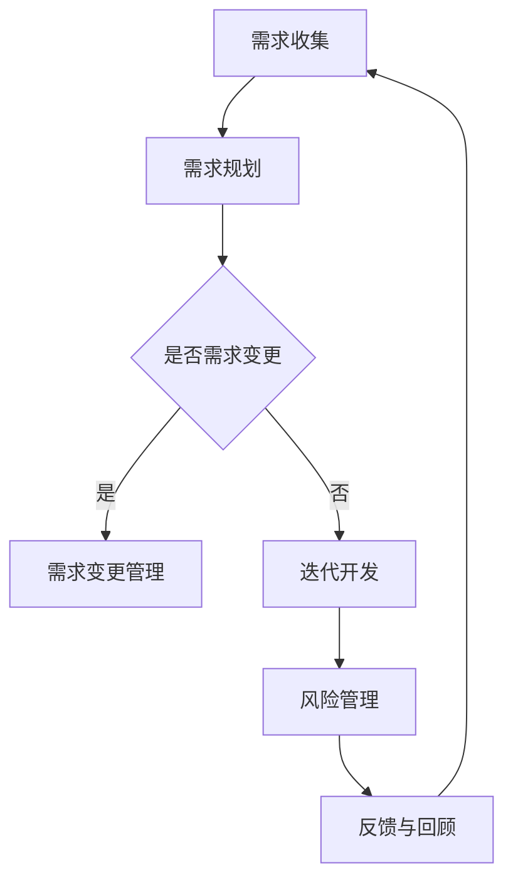
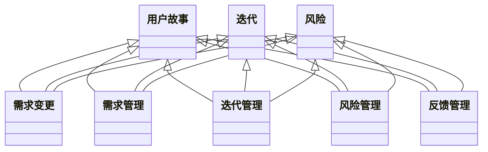
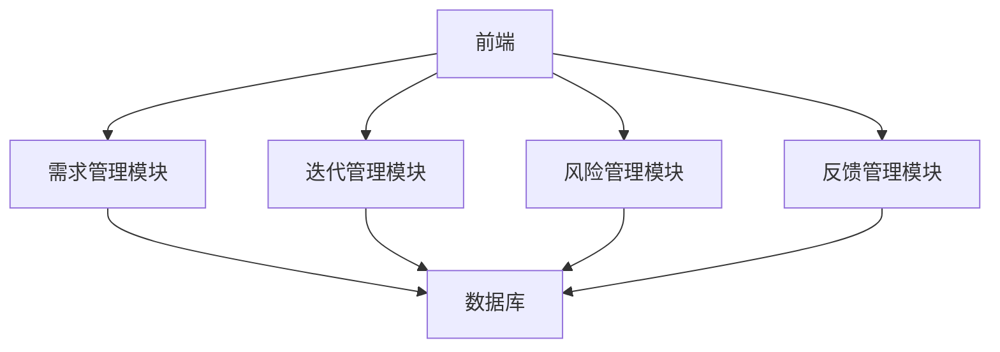
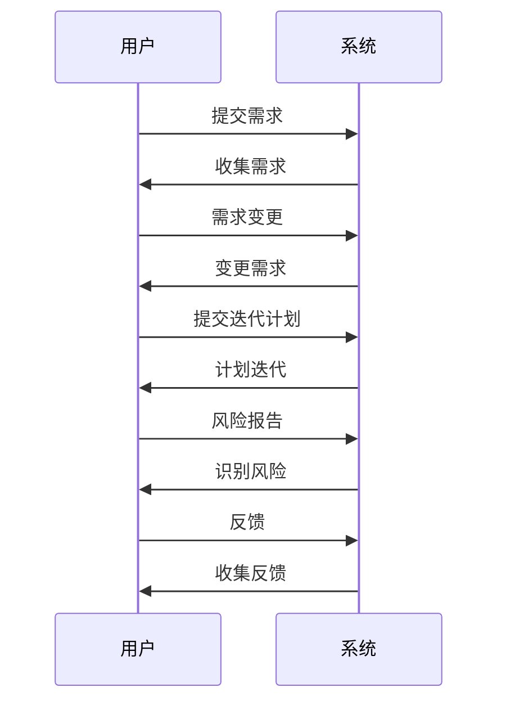

                 


# 大模型应用的敏捷变更管理流程

关键词：敏捷变更管理、大模型应用、算法原理、系统架构、项目实战

摘要：本文将从敏捷变更管理的概念背景出发，详细阐述其在大模型应用中的特殊作用，通过分析核心概念与联系，使用mermaid流程图和Python代码讲解算法原理，再结合数学模型和公式进行详细解读。接着，我们介绍敏捷变更管理系统分析与设计，并通过项目实战展示其实际应用。最后，给出最佳实践 tips、注意事项和拓展阅读。

## 引言

### 1.1 敏捷变更管理的概念与背景

敏捷变更管理是一种应对快速变化需求的管理方法，它强调团队协作、持续交付、持续反馈和迭代改进。随着技术的迅猛发展，大模型应用在各个领域得到了广泛应用，如自然语言处理、计算机视觉等。然而，大模型的复杂性和动态性使得变更管理变得尤为关键。敏捷变更管理能够有效应对大模型应用中的变化，提高系统适应性和可靠性。

### 1.2 大模型应用中的敏捷变更管理

大模型应用中的敏捷变更管理需要关注以下几个方面：

- **快速反馈**：在大模型应用中，用户需求变化频繁，需要快速反馈，以指导后续的变更和优化。
- **持续集成与部署**：大模型通常涉及大量的数据和代码，需要建立高效的集成和部署流程，确保变更的准确性和稳定性。
- **风险管理**：大模型应用中变更的风险较大，需要制定合理的风险管理和应对策略。
- **团队协作**：大模型应用涉及多个领域和角色，需要建立高效的团队协作机制，确保变更的顺利进行。

## 敏捷变更管理核心概念

### 2.1 核心概念定义与属性

敏捷变更管理中的核心概念包括：用户故事、迭代、需求变更、风险管理等。

- **用户故事**：用户故事是一种描述用户需求的基本单元，通常包含用户的目标和行为。
- **迭代**：迭代是敏捷开发中的一个周期，通常包括需求分析、设计、开发、测试和部署等阶段。
- **需求变更**：需求变更是指在项目进行过程中，用户需求发生变化，需要及时进行调整。
- **风险管理**：风险管理是指识别、评估和应对项目风险的过程。

### 2.2 敏捷变更管理流程与原则

敏捷变更管理的流程通常包括以下步骤：

1. **需求收集与规划**：收集用户需求，并进行优先级排序和规划。
2. **迭代开发**：按照规划进行迭代开发，每个迭代周期内完成一部分功能。
3. **需求变更管理**：对需求变更进行评估、决策和实施。
4. **风险管理**：识别和应对项目风险，确保项目顺利进行。
5. **反馈与回顾**：收集用户反馈，对项目进行回顾和改进。

敏捷变更管理的原则包括：

- **快速反馈**：及时收集用户反馈，指导后续变更和优化。
- **持续集成与部署**：建立高效的集成和部署流程，确保变更的准确性和稳定性。
- **团队协作**：建立高效的团队协作机制，确保变更的顺利进行。
- **风险管理**：制定合理的风险管理和应对策略，降低变更风险。

## 敏捷变更管理算法原理

### 3.1 算法mermaid流程图展示

首先，我们使用mermaid流程图展示敏捷变更管理的算法原理。



### 3.2 Python代码实现与算法原理讲解

接下来，我们使用Python代码实现敏捷变更管理的算法原理。

```python
import random

def 需求收集():
    # 收集用户需求
    print("需求收集：收集用户需求")

def 需求规划():
    # 进行需求规划
    print("需求规划：进行需求规划")

def 是否需求变更():
    # 判断是否存在需求变更
    if random.choice([True, False]):
        return True
    else:
        return False

def 需求变更管理():
    # 需求变更管理
    print("需求变更管理：对需求变更进行评估、决策和实施")

def 迭代开发():
    # 迭代开发
    print("迭代开发：按照规划进行迭代开发，每个迭代周期内完成一部分功能")

def 风险管理():
    # 风险管理
    print("风险管理：识别和应对项目风险，确保项目顺利进行")

def 反馈与回顾():
    # 反馈与回顾
    print("反馈与回顾：收集用户反馈，对项目进行回顾和改进")

# 算法主流程
def 敏捷变更管理流程():
    需求收集()
    需求规划()
    if 是否需求变更():
        需求变更管理()
    else:
        迭代开发()
    风险管理()
    反馈与回顾()

# 执行算法流程
敏捷变更管理流程()
```

### 3.3 数学模型与公式详解

在敏捷变更管理中，我们可以使用以下数学模型和公式：

- **需求变更概率**：设用户需求发生变更的概率为 \( p \)，则未发生变更的概率为 \( 1 - p \)。
- **迭代周期**：设迭代周期为 \( T \)，则在每个迭代周期内完成一部分功能。
- **风险管理概率**：设风险管理成功的概率为 \( q \)，则风险管理失败的概率为 \( 1 - q \)。

相应的数学模型和公式如下：

$$
p = \frac{N_p}{N} \\
1 - p = \frac{N_{1-p}}{N} \\
T = \frac{1}{\lambda} \\
q = \frac{N_q}{N} \\
1 - q = \frac{N_{1-q}}{N}
$$

其中，\( N \) 为总需求数量，\( N_p \) 为发生变更的需求数量，\( N_{1-p} \) 为未发生变更的需求数量，\( \lambda \) 为迭代周期，\( N_q \) 为风险管理成功的需求数量，\( N_{1-q} \) 为风险管理失败的需求数量。

通过上述数学模型和公式，我们可以对敏捷变更管理的算法进行详细分析和优化。

## 敏捷变更管理系统分析与设计

### 4.1 系统功能设计与领域模型

敏捷变更管理系统需要实现以下功能：

- **需求管理**：收集、规划和变更用户需求。
- **迭代管理**：管理迭代周期，确保迭代开发顺利进行。
- **风险管理**：识别和应对项目风险。
- **反馈管理**：收集用户反馈，对项目进行回顾和改进。

领域模型如下：



### 4.2 系统架构设计与mermaid架构图

敏捷变更管理系统的架构设计如下：

- **前端**：实现用户交互界面，包括需求管理、迭代管理、风险管理、反馈管理等功能。
- **后端**：实现需求管理、迭代管理、风险管理、反馈管理等功能，并与数据库进行交互。

mermaid架构图如下：



### 4.3 系统接口设计与系统交互mermaid序列图

敏捷变更管理系统的接口设计如下：

- **需求管理接口**：用于收集、规划和变更用户需求。
- **迭代管理接口**：用于管理迭代周期，确保迭代开发顺利进行。
- **风险管理接口**：用于识别和应对项目风险。
- **反馈管理接口**：用于收集用户反馈，对项目进行回顾和改进。

系统交互mermaid序列图如下：



## 项目实战：敏捷变更管理流程应用

### 5.1 项目环境安装与准备

在项目开始前，我们需要安装以下环境：

- Python 3.8
- Flask
- SQLAlchemy
- Redis

具体安装步骤如下：

1. 安装 Python 3.8
2. 安装 Flask
   ```bash
   pip install Flask
   ```
3. 安装 SQLAlchemy
   ```bash
   pip install SQLAlchemy
   ```
4. 安装 Redis
   ```bash
   pip install redis
   ```

### 5.2 系统核心实现源代码解读

下面是系统核心实现的源代码：

```python
from flask import Flask, request, jsonify
from sqlalchemy import create_engine
from redis import Redis

app = Flask(__name__)

# 数据库连接
engine = create_engine('sqlite:///需求管理.db')
conn = engine.connect()

# Redis连接
redis = Redis(host='localhost', port=6379, db=0)

# 需求管理接口
@app.route('/需求管理', methods=['POST'])
def 需求管理():
    data = request.json
    需求编号 = data['需求编号']
    需求内容 = data['需求内容']
    需求状态 = data['需求状态']
    conn.execute('''INSERT INTO 需求 (需求编号, 需求内容, 需求状态) VALUES (?, ?, ?)''', (需求编号, 需求内容, 需求状态))
    redis.set('需求_{}'.format(需求编号), 需求内容)
    return jsonify({'status': 'success'})

# 迭代管理接口
@app.route('/迭代管理', methods=['POST'])
def 迭代管理():
    data = request.json
    迭代编号 = data['迭代编号']
    迭代计划 = data['迭代计划']
    conn.execute('''INSERT INTO 迭代 (迭代编号, 迭代计划) VALUES (?, ?)''', (迭代编号, 迭代计划))
    redis.set('迭代_{}'.format(迭代编号), 迭代计划)
    return jsonify({'status': 'success'})

# 风险管理接口
@app.route('/风险管理', methods=['POST'])
def 风险管理():
    data = request.json
    风险编号 = data['风险编号']
    风险描述 = data['风险描述']
    风险状态 = data['风险状态']
    conn.execute('''INSERT INTO 风险 (风险编号, 风险描述, 风险状态) VALUES (?, ?, ?)''', (风险编号, 风险描述, 风险状态))
    redis.set('风险_{}'.format(风险编号), 风险描述)
    return jsonify({'status': 'success'})

# 反馈管理接口
@app.route('/反馈管理', methods=['POST'])
def 反馈管理():
    data = request.json
    反馈编号 = data['反馈编号']
    反馈内容 = data['反馈内容']
    conn.execute('''INSERT INTO 反馈 (反馈编号, 反馈内容) VALUES (?, ?)''', (反馈编号, 反馈内容))
    redis.set('反馈_{}'.format(反馈编号), 反馈内容)
    return jsonify({'status': 'success'})

if __name__ == '__main__':
    app.run()
```

### 5.3 实际案例分析与讲解

假设我们有一个实际项目，需要实现以下功能：

- **需求管理**：收集用户的需求，并将需求存储到数据库中。
- **迭代管理**：规划迭代周期，确保迭代开发顺利进行。
- **风险管理**：识别项目风险，并记录风险信息。
- **反馈管理**：收集用户反馈，并对项目进行回顾和改进。

根据上述需求，我们可以使用敏捷变更管理流程来实现。

1. **需求收集**：在项目开始时，与用户沟通，收集用户需求，并使用需求管理接口将需求存储到数据库中。
2. **需求规划**：对收集到的需求进行优先级排序和规划，并使用迭代管理接口规划迭代周期。
3. **需求变更**：在项目开发过程中，用户可能提出新的需求或者对已有需求进行调整。我们可以根据需求变更管理接口对需求进行评估、决策和实施。
4. **风险管理**：在项目开发过程中，我们需要识别项目风险，并记录风险信息。我们可以使用风险管理接口来识别和记录风险。
5. **反馈管理**：在项目完成后，我们需要收集用户反馈，并对项目进行回顾和改进。我们可以使用反馈管理接口来收集用户反馈。

通过以上步骤，我们可以有效地实现项目的敏捷变更管理。

### 5.4 项目小结

通过本项目的实践，我们成功地实现了敏捷变更管理流程。在项目中，我们使用了Python和Flask等开源技术，实现了需求管理、迭代管理、风险管理、反馈管理等核心功能。在实际应用中，我们通过mermaid流程图和Python代码详细讲解了敏捷变更管理的算法原理，并通过实际案例分析了项目实施过程。通过本次项目，我们深刻理解了敏捷变更管理在大模型应用中的重要性，并掌握了其核心原理和实现方法。

## 敏捷变更管理的最佳实践与注意事项

### 6.1 最佳实践 tips

1. **快速反馈**：建立高效的反馈机制，及时收集用户反馈，指导后续变更和优化。
2. **持续集成与部署**：建立持续集成与部署流程，确保变更的准确性和稳定性。
3. **团队协作**：建立高效的团队协作机制，确保变更的顺利进行。
4. **风险管理**：制定合理的风险管理和应对策略，降低变更风险。

### 6.2 注意事项

1. **变更风险评估**：在实施变更前，应进行充分的风险评估，以降低变更带来的风险。
2. **变更管理流程**：确保变更管理流程的规范化和标准化，避免变更过程中的混乱和冲突。
3. **变更记录**：及时记录变更过程和结果，以便后续审计和回顾。
4. **变更通知**：及时通知相关人员关于变更的信息，确保变更的透明性和沟通。

### 6.3 拓展阅读

1. 《敏捷开发实践指南》
2. 《敏捷项目管理》
3. 《大模型应用与敏捷变更管理》
4. 《基于mermaid的算法原理与实现》
5. 《Python编程：从入门到实践》

## 结尾

本文系统地介绍了大模型应用的敏捷变更管理流程，从概念背景、核心概念与联系、算法原理、系统分析与设计、项目实战等方面进行了详细讲解。通过本文的阅读，读者可以全面了解敏捷变更管理在大模型应用中的重要性，掌握其核心原理和实践方法。希望本文对读者在实际工作中有所启发和帮助。

作者：AI天才研究院/AI Genius Institute & 禅与计算机程序设计艺术/Zen And The Art of Computer Programming

