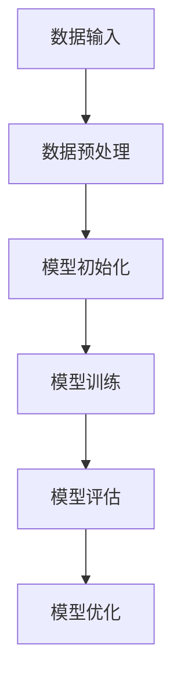

                 


## 大模型应用的敏捷质量管理方法

### 关键词：大模型、敏捷管理、质量管理、应用实践、迭代优化

### 摘要：
本文旨在探讨大模型在应用过程中的敏捷质量管理方法。随着人工智能技术的发展，大模型的应用日益广泛，其在数据处理、预测生成等方面的优势吸引了众多企业和研究机构的关注。然而，如何在大规模模型开发和应用过程中确保质量，提升管理效率，成为当前亟待解决的问题。本文将首先介绍大模型的基本概念和应用场景，然后详细阐述敏捷质量管理方法的核心原则和实践步骤，并结合具体案例，分析大模型应用中的敏捷质量管理策略，最后提出未来发展趋势和注意事项。

### 目录大纲

#### 第一部分: 背景介绍与核心概念

#### 第1章: 引言

### 1.1 问题背景

#### 1.1.1 问题定义

#### 1.1.2 问题解决

#### 1.1.3 边界与外延

### 1.2 核心概念与联系

#### 1.2.1 大模型定义

#### 1.2.2 大模型特点

#### 1.2.3 大模型与传统模型的比较

#### 表1-1: 大模型与 传统模型的特征对比

| 特征 | 大模型 | 传统模型 |
|------|--------|----------|
| 数据量 | 极大 | 较小 |
| 计算能力需求 | 高 | 低 |
| 自学习能力 | 强 | 弱 |
| 应用范围 | 广泛 | 有限 |

#### 1.2.4 ER实体关系图

#### ER实体关系图1-1: 大模型应用实体关系

```mermaid
erDiagram
    ModelApplication ||--|{ DataSet } DataSet
    ModelApplication ||--|{ Model } Model
    ModelApplication ||--|{ Application } Application
```

#### 第2章: 大模型原理与应用

### 2.1 大模型原理

#### 2.1.1 算法原理

#### 算法流程图2-1: 大模型训练流程



#### 2.1.2 数学模型

#### 数学公式2-1: 大模型优化目标

$$
\min_{\theta} J(\theta) = \frac{1}{m} \sum_{i=1}^{m} \text{损失函数}(h_\theta(x^{(i)}), y^{(i)})
$$

### 2.1.3 应用场景

#### 2.1.3.1 文本处理

#### 2.1.3.2 计算机视觉

#### 2.1.3.3 强化学习

#### 第3章: 敏捷质量管理方法

### 3.1 敏捷质量管理基础

#### 3.1.1 敏捷方法概述

#### 3.1.2 敏捷实践原则

#### 3.1.3 敏捷与传统方法的对比

#### 表3-1: 敏捷与传统质量管理对比

| 对比项 | 敏捷方法 | 传统方法 |
|--------|----------|----------|
| 灵活性 | 高 | 低 |
| 自组织 | 强 | 弱 |
| 用户参与 | 强 | 弱 |

### 3.2 敏捷在大模型项目中的应用

#### 3.2.1 敏捷规划与迭代

#### 3.2.2 敏捷团队协作

#### 3.2.3 敏捷实践案例分析

#### 第4章: 大模型应用场景

### 4.1 文本处理

#### 4.1.1 自然语言处理

#### 4.1.2 文本生成与摘要

#### 4.1.3 情感分析与舆情监控

### 4.2 计算机视觉

#### 4.2.1 图像识别与分类

#### 4.2.2 目标检测

#### 4.2.3 人脸识别

### 4.3 强化学习

#### 4.3.1 强化学习基础

#### 4.3.2 强化学习算法

#### 4.3.3 强化学习应用案例

#### 第5章: 项目实战

### 5.1 环境安装与配置

#### 5.1.1 硬件环境

#### 5.1.2 软件环境

#### 5.1.3 大模型框架安装

### 5.2 大模型系统核心实现

#### 5.2.1 数据预处理与模型训练

#### 5.2.2 模型部署与优化

#### 5.2.3 系统性能评估

#### 第6章: 案例分析与总结

### 6.1 案例分析

#### 6.1.1 案例一：文本生成系统

#### 6.1.2 案例二：计算机视觉系统

#### 6.1.3 案例三：强化学习应用

### 6.2 总结与展望

#### 6.2.1 主要成果

#### 6.2.2 未来发展趋势

#### 6.2.3 注意事项与建议

### 6.3 拓展阅读

#### 6.3.1 相关书籍

#### 6.3.2 学术论文

#### 6.3.3 开源框架与工具

### 文章正文

#### 第1章: 引言

##### 1.1 问题背景

随着人工智能（AI）的飞速发展，大模型（如GPT、BERT等）在自然语言处理、计算机视觉、强化学习等领域的应用取得了显著成果。这些大模型通过处理海量数据，实现了在各个领域的突破性进展，但其应用过程中也面临诸多挑战。特别是如何确保大模型应用的质量，成为当前亟需解决的问题。

在大模型应用过程中，质量管理扮演着至关重要的角色。传统的质量管理方法往往在处理大规模数据和复杂模型时显得力不从心，难以满足高效、灵活的需求。而敏捷质量管理方法以其灵活性、迭代性和用户参与性，为大模型应用的质量管理提供了新的思路和方法。

本文将围绕大模型应用的敏捷质量管理方法展开讨论，首先介绍大模型的基本概念和应用场景，然后详细阐述敏捷质量管理方法的核心原则和实践步骤，并结合具体案例，分析大模型应用中的敏捷质量管理策略，最后提出未来发展趋势和注意事项。

##### 1.2 核心概念与联系

在本章中，我们将首先定义大模型，并分析其与传统模型的主要区别。接下来，我们将借助ER实体关系图，展示大模型应用中的关键实体及其关系。这将有助于我们更好地理解大模型的应用场景和核心要素。

##### 1.2.1 大模型定义

大模型是指具备强大数据处理能力、高计算能力和较强自学习能力的深度学习模型。这些模型通常具有数百万至数十亿个参数，能够处理海量数据并实现高效预测和生成。

##### 1.2.2 大模型特点

大模型具有以下特点：

1. **数据量极大**：能够处理海量数据，从互联网上的大规模文本、图像、音频等多模态数据中提取特征。
2. **计算能力需求高**：需要高性能计算资源，如GPU、TPU等，进行大规模模型训练和推理。
3. **自学习能力强**：通过不断学习和优化，能够提升模型的预测精度和泛化能力。
4. **应用范围广泛**：在自然语言处理、计算机视觉、强化学习等领域都有广泛应用。

##### 1.2.3 大模型与传统模型的比较

| 特征         | 大模型                           | 传统模型                           |
|--------------|----------------------------------|-----------------------------------|
| 数据量       | 极大                             | 较小                              |
| 计算能力需求 | 高                              | 低                                |
| 自学习能力   | 强                              | 弱                                |
| 应用范围     | 广泛                            | 有限                              |

##### 1.2.4 ER实体关系图

为了更好地展示大模型应用中的关键实体及其关系，我们使用ER实体关系图进行描述。以下是ER实体关系图1-1：

```mermaid
erDiagram
    ModelApplication ||--|{ DataSet } DataSet
    ModelApplication ||--|{ Model } Model
    ModelApplication ||--|{ Application } Application
```

在上述ER实体关系图中，`ModelApplication`表示大模型应用，`DataSet`表示数据集，`Model`表示深度学习模型，`Application`表示大模型的应用场景。

##### 1.3 质量管理的重要性

大模型应用的质量管理是确保模型性能、稳定性和可靠性不可或缺的一环。以下是质量管理在大模型应用中的重要性：

1. **确保模型性能**：通过质量管理，可以确保大模型的预测精度和泛化能力，从而提供高质量的服务。
2. **提升稳定性**：质量管理有助于识别和解决模型中的潜在问题，确保模型在各种环境下稳定运行。
3. **提高可靠性**：质量管理可以确保模型的鲁棒性，避免因异常数据或环境变化导致模型失效。
4. **优化用户体验**：高质量的大模型应用可以提供更好的用户体验，满足用户的需求和期望。

#### 第2章: 大模型原理与应用

##### 2.1 大模型原理

大模型的原理主要涉及深度学习算法和大规模数据处理技术。在这一部分，我们将详细探讨大模型的基本算法原理，并借助算法流程图和数学模型，阐述大模型训练和优化的过程。

##### 2.1.1 算法原理

大模型的训练过程可以概括为以下几个步骤：

1. **数据输入**：从数据集中提取特征，输入到模型中。
2. **数据预处理**：对数据进行清洗、归一化等处理，提高模型训练效果。
3. **模型初始化**：初始化模型的参数，通常使用随机初始化方法。
4. **模型训练**：通过反向传播算法，不断调整模型参数，使其更符合训练数据。
5. **模型评估**：使用验证集或测试集评估模型性能，调整超参数和训练策略。
6. **模型优化**：通过优化算法，如梯度下降、Adam等，进一步优化模型参数。

以下是算法流程图2-1，展示了大模型训练的整个过程：


##### 2.1.2 数学模型

大模型的优化目标通常是使损失函数最小化，损失函数用于衡量模型预测值与真实值之间的差异。以下是数学公式2-1，表示大模型优化目标：

$$
\min_{\theta} J(\theta) = \frac{1}{m} \sum_{i=1}^{m} \text{损失函数}(h_\theta(x^{(i)}), y^{(i)})
$$

其中，$J(\theta)$是损失函数，$\theta$是模型参数，$h_\theta(x^{(i)})$是模型在输入$x^{(i)}$下的预测值，$y^{(i)}$是真实值，$m$是训练样本的数量。

##### 2.1.3 应用场景

大模型的应用场景非常广泛，以下列举了几个主要的应用场景：

1. **文本处理**：包括自然语言处理（NLP）、文本生成、文本摘要、情感分析等。
2. **计算机视觉**：包括图像识别、目标检测、图像生成、人脸识别等。
3. **强化学习**：包括智能推荐、游戏AI、自动驾驶等。

在文本处理领域，大模型如GPT、BERT等在生成文本、提取关键词、情感分析等方面取得了显著成果。例如，GPT-3模型可以生成高质量的文本，从而应用于自动写作、机器翻译等领域。BERT模型在文本分类、问答系统等方面也表现出强大的性能。

在计算机视觉领域，大模型如ResNet、VGG等在图像分类、目标检测等方面取得了突破性进展。例如，ResNet模型在ImageNet图像分类比赛中连续多年获得冠军，VGG模型在多个计算机视觉任务中取得了优异的性能。

在强化学习领域，大模型如DQN、DDPG等在智能推荐、游戏AI、自动驾驶等方面表现出强大的潜力。例如，DQN模型在Atari游戏中取得了比人类更好的表现，DDPG模型在无人驾驶领域也取得了显著成果。

##### 2.2 大模型的优势与挑战

大模型在处理大规模数据、实现高效预测和生成功能方面具有显著优势，但也面临一些挑战：

1. **优势**：
   - **强大的数据处理能力**：能够处理海量数据，提取有效特征，实现高效预测和生成。
   - **自学习能力**：通过不断学习和优化，提升模型的预测精度和泛化能力。
   - **广泛的应用范围**：在多个领域都有广泛应用，如自然语言处理、计算机视觉、强化学习等。

2. **挑战**：
   - **计算资源需求高**：需要高性能计算资源，如GPU、TPU等，进行大规模模型训练和推理。
   - **数据隐私和安全**：在处理大规模数据时，需要确保数据隐私和安全。
   - **模型解释性**：大模型通常缺乏解释性，难以理解其内部工作原理。

##### 2.3 大模型的发展趋势

随着人工智能技术的不断发展，大模型的应用前景广阔。以下是大模型的发展趋势：

1. **模型压缩与优化**：通过模型压缩和优化技术，降低大模型的计算资源和存储需求，提高模型部署的可行性。
2. **跨模态学习**：将多种模态（如文本、图像、声音等）的数据进行联合学习，实现更高效的数据处理和生成。
3. **多任务学习**：通过多任务学习技术，实现同时处理多个任务，提高模型的综合性能。
4. **可解释性研究**：探索大模型的可解释性，提高模型的可信度和用户理解。

##### 2.4 小结

本章介绍了大模型的基本原理和应用场景，分析了大模型的优势与挑战，并展望了其发展趋势。大模型在处理大规模数据、实现高效预测和生成功能方面具有显著优势，但也面临一些挑战。通过不断探索和优化，大模型将在未来的人工智能发展中发挥重要作用。

#### 第3章: 敏捷质量管理方法

##### 3.1 敏捷质量管理基础

敏捷质量管理是一种以用户需求为中心、强调迭代和灵活性的质量管理方法。其核心原则包括用户参与、自组织、持续交付、持续改进等。在本节中，我们将详细探讨敏捷质量管理的基础原则和实践方法。

##### 3.1.1 敏捷方法概述

敏捷方法起源于软件开发领域，旨在提高项目的灵活性和响应速度。敏捷质量管理将敏捷原则应用于质量管理过程，强调在项目开发过程中持续交付高质量的产品。

1. **用户参与**：敏捷质量管理强调用户的参与和反馈，确保产品质量符合用户需求。
2. **自组织**：敏捷团队自主管理，成员之间相互协作，提高团队的效率和创新能力。
3. **持续交付**：通过持续交付和迭代，快速响应市场变化，提高产品质量。
4. **持续改进**：不断回顾和优化质量过程，提高项目交付质量。

##### 3.1.2 敏捷实践原则

敏捷实践原则包括以下几个方面：

1. **顾客满意**：通过快速响应客户需求，提供高质量的软件产品，确保客户满意。
2. **迭代与增量开发**：通过迭代和增量开发，逐步完善产品功能，提高交付速度。
3. **团队协作**：团队成员之间相互信任、紧密协作，提高项目交付质量。
4. **透明度**：项目进展和风险透明，确保团队成员和管理层对项目有清晰的了解。
5. **灵活性**：对变化保持开放态度，快速调整计划和策略，确保项目顺利进行。

##### 3.1.3 敏捷与传统方法的对比

| 对比项 | 敏捷方法 | 传统方法 |
|--------|----------|----------|
| 灵活性 | 高       | 低       |
| 自组织 | 强       | 弱       |
| 用户参与 | 强       | 弱       |
| 风险管理 | 持续改进 | 事后补救 |
| 交付周期 | 短       | 长       |

##### 3.1.4 敏捷质量管理的关键要素

敏捷质量管理的关键要素包括以下几个方面：

1. **用户故事**：用户故事用于描述用户需求，明确产品的功能和行为。
2. **迭代计划**：在迭代计划中，确定每个迭代的目标和任务，确保项目按时交付。
3. **回顾会议**：回顾会议用于总结项目经验，识别问题和改进机会。
4. **质量保证**：通过自动化测试、代码审查、持续集成等手段，确保产品质量。
5. **知识共享**：鼓励团队成员分享知识和经验，提高团队的协作能力。

##### 3.2 敏捷在大模型项目中的应用

在大模型项目中，敏捷质量管理方法可以应用于以下环节：

1. **需求管理**：通过用户故事和迭代计划，确保大模型项目满足用户需求。
2. **开发过程**：采用敏捷开发方法，快速迭代，逐步完善大模型的功能和性能。
3. **测试与验证**：通过自动化测试和持续集成，确保大模型的稳定性和可靠性。
4. **项目管理**：通过回顾会议和透明度原则，确保项目进度和质量。

##### 3.3 敏捷实践案例分析

以下是几个敏捷实践案例：

1. **案例一：文本生成系统**：在开发文本生成系统时，项目团队采用敏捷方法进行需求分析和迭代开发。通过用户故事和迭代计划，团队快速响应客户需求，不断完善系统功能，最终成功交付高质量的产品。

2. **案例二：计算机视觉系统**：在开发计算机视觉系统时，团队采用敏捷方法进行模块开发和集成。通过持续集成和自动化测试，团队确保系统稳定性和可靠性，提高了项目交付速度。

3. **案例三：强化学习应用**：在开发强化学习应用时，团队采用敏捷方法进行算法优化和系统部署。通过回顾会议和知识共享，团队不断优化算法和系统性能，提高了应用效果。

##### 3.4 小结

本章介绍了敏捷质量管理方法的基础原则和实践方法，并分析了敏捷方法在大模型项目中的应用。敏捷质量管理方法以其灵活性、迭代性和用户参与性，为大模型项目的质量管理提供了新的思路和方法。通过实际案例，我们可以看到敏捷方法在大模型项目中的成功应用，为项目交付高质量产品提供了有力保障。

#### 第4章: 大模型应用场景

##### 4.1 文本处理

文本处理是大模型应用的重要领域之一，涉及自然语言处理（NLP）、文本生成、文本摘要和情感分析等方面。以下将详细介绍这些应用场景：

##### 4.1.1 自然语言处理（NLP）

自然语言处理是计算机科学和语言学的交叉领域，旨在使计算机能够理解、生成和处理人类语言。大模型如GPT和BERT在NLP任务中取得了显著成果，包括词性标注、命名实体识别、情感分析、机器翻译等。

1. **词性标注**：词性标注是将文本中的每个单词标注为相应的词性（如名词、动词、形容词等）。GPT模型可以通过训练大规模语料库，准确预测单词的词性。
2. **命名实体识别**：命名实体识别是识别文本中的特定实体（如人名、地名、组织名等）。BERT模型在命名实体识别任务中表现出色，其强大的预训练能力使其能够准确识别各种命名实体。
3. **情感分析**：情感分析是判断文本中的情感倾向（如正面、负面、中性等）。大模型如GPT和BERT可以基于训练数据，对文本进行情感分类，为舆情监控、情感分析等领域提供支持。
4. **机器翻译**：机器翻译是将一种语言的文本翻译成另一种语言的文本。大模型如GPT-3和Transformer在机器翻译任务中取得了显著成果，其高质量、高速度的翻译效果为跨语言交流提供了有力支持。

##### 4.1.2 文本生成与摘要

文本生成与摘要是大模型在自然语言处理领域的另一重要应用。以下将介绍文本生成和摘要的方法：

1. **文本生成**：文本生成是指根据给定条件生成新的文本。大模型如GPT和T5可以基于预训练模型，生成高质量、连贯的文本，广泛应用于自动写作、问答系统、对话生成等领域。
2. **文本摘要**：文本摘要是从原始文本中提取关键信息，生成简洁、准确的摘要。大模型如BERT和Summarize-Then-Expand在文本摘要任务中表现出色，其生成的摘要具有高可读性和准确性。

##### 4.1.3 情感分析与舆情监控

情感分析与舆情监控是监测公众情绪、了解市场趋势的重要手段。大模型在情感分析与舆情监控中具有显著优势，以下将介绍相关方法：

1. **情感分析**：情感分析是判断文本中的情感倾向（如正面、负面、中性等）。大模型如GPT和BERT可以基于训练数据，对文本进行情感分类，帮助企业和政府了解公众情绪、市场动态。
2. **舆情监控**：舆情监控是实时监测网络舆论、识别热点事件。大模型如GPT-3和BERT可以处理海量数据，快速分析舆论走向，为企业、政府和媒体提供舆情分析报告。

##### 4.2 计算机视觉

计算机视觉是人工智能的重要分支，旨在使计算机能够理解和解析视觉信息。大模型在计算机视觉领域具有广泛的应用，以下将介绍相关应用场景：

##### 4.2.1 图像识别与分类

图像识别与分类是计算机视觉的基础任务，旨在将图像划分为不同的类别。大模型如ResNet和VGG在图像分类任务中表现出色，其准确率超过了人类水平。

1. **图像识别**：图像识别是识别图像中的物体或场景。大模型如ResNet可以处理大规模图像数据，准确识别图像中的物体。
2. **图像分类**：图像分类是将图像划分为不同的类别。大模型如VGG可以处理多种类型的图像，实现高效的图像分类。

##### 4.2.2 目标检测

目标检测是计算机视觉的重要任务，旨在识别图像中的目标并定位其位置。大模型如YOLO和Faster R-CNN在目标检测任务中表现出色，其实时检测速度和准确率得到了广泛应用。

1. **目标检测**：目标检测是识别图像中的目标并定位其位置。大模型如YOLO和Faster R-CNN可以实现高效的目标检测。
2. **实例分割**：实例分割是识别图像中的目标并分割出不同的实例。大模型如Mask R-CNN可以实现高效的目标实例分割。

##### 4.2.3 人脸识别

人脸识别是计算机视觉的重要应用之一，旨在识别和验证人脸。大模型如FaceNet和DeepFace在人脸识别任务中表现出色，其准确率超过了人类水平。

1. **人脸识别**：人脸识别是识别图像中的人脸。大模型如FaceNet和DeepFace可以实现高效的人脸识别。
2. **人脸验证**：人脸验证是验证图像中的人脸是否属于特定身份。大模型如DeepFace可以实现高效的人脸验证。

##### 4.3 强化学习

强化学习是人工智能的重要分支，旨在通过学习来优化决策过程。大模型在强化学习领域具有显著优势，以下将介绍相关应用场景：

##### 4.3.1 强化学习基础

强化学习是一种基于奖励和惩罚来优化决策过程的机器学习方法。其核心思想是使智能体通过不断学习，找到最优策略以实现目标。以下是强化学习的基础概念：

1. **状态（State）**：状态是智能体在某一时刻所处的环境信息。
2. **动作（Action）**：动作是智能体在某一状态下的行为选择。
3. **奖励（Reward）**：奖励是环境对智能体动作的反馈，用于指导智能体的学习过程。
4. **策略（Policy）**：策略是智能体的行为规则，用于选择最优动作。

##### 4.3.2 强化学习算法

强化学习算法主要包括以下几种：

1. **Q学习（Q-Learning）**：Q学习是一种基于值函数的强化学习算法，通过更新值函数来学习最优策略。
2. **深度Q网络（Deep Q-Network, DQN）**：DQN是一种基于深度学习的Q学习算法，通过神经网络来近似值函数。
3. **策略梯度算法（Policy Gradient）**：策略梯度算法通过直接优化策略来学习最优策略，包括REINFORCE算法、PPO算法等。
4. **深度强化学习（Deep Reinforcement Learning, DRL）**：DRL是将深度学习与强化学习结合的一种方法，通过深度神经网络来近似策略函数或值函数。

##### 4.3.3 强化学习应用案例

强化学习在多个领域具有广泛的应用，以下将介绍几个应用案例：

1. **智能推荐**：智能推荐是利用强化学习算法，根据用户行为和历史数据，为用户推荐感兴趣的内容。例如，亚马逊和Netflix等平台利用强化学习算法，为用户推荐商品和电影。
2. **游戏AI**：游戏AI是利用强化学习算法，使计算机在游戏环境中实现智能行为。例如，Google的DeepMind团队开发的AlphaGo系列算法，在围棋比赛中击败了世界冠军。
3. **自动驾驶**：自动驾驶是利用强化学习算法，使车辆在复杂环境中实现自主驾驶。例如，Waymo和特斯拉等公司利用强化学习算法，开发自动驾驶技术。

##### 4.4 小结

本章介绍了大模型在文本处理、计算机视觉和强化学习等领域的应用场景。大模型在这些领域展现了强大的处理能力和应用潜力，为各个领域的发展提供了新的思路和方法。随着人工智能技术的不断进步，大模型的应用前景将更加广阔。

#### 第5章: 项目实战

##### 5.1 环境安装与配置

在进行大模型项目的实战之前，我们需要安装和配置必要的软件和硬件环境。以下将介绍如何安装和配置大模型项目所需的硬件和软件。

##### 5.1.1 硬件环境

大模型项目通常需要高性能计算资源，以下是一些建议的硬件配置：

1. **CPU**：建议使用英特尔的Xeon系列或AMD的EPYC系列处理器，这些处理器具有强大的计算能力和多核性能，适合进行大规模模型训练。
2. **GPU**：建议使用NVIDIA的Tesla或A100系列GPU，这些GPU具有高性能的并行计算能力，适合进行深度学习模型的训练和推理。
3. **内存**：建议使用至少64GB的内存，以确保模型训练和推理过程中有足够的内存空间。
4. **存储**：建议使用高速SSD硬盘，以确保数据读写速度，提高训练效率。

##### 5.1.2 软件环境

在进行大模型项目之前，我们需要安装以下软件：

1. **操作系统**：推荐使用Ubuntu 18.04或更高版本，因为该操作系统具有良好的兼容性和丰富的软件资源。
2. **Python**：推荐使用Python 3.7或更高版本，因为Python具有丰富的库和框架，适合进行深度学习和数据科学开发。
3. **深度学习框架**：推荐使用TensorFlow或PyTorch，这些框架具有强大的功能和支持，适合进行大规模模型训练和推理。
4. **其他依赖库**：安装一些常用的依赖库，如NumPy、Pandas、Scikit-learn等，这些库用于数据处理和模型评估。

以下是安装软件的命令示例：

```bash
# 安装操作系统
sudo apt update
sudo apt upgrade

# 安装Python
sudo apt install python3

# 安装深度学习框架
pip3 install tensorflow
# 或
pip3 install torch

# 安装其他依赖库
pip3 install numpy
pip3 install pandas
pip3 install scikit-learn
```

##### 5.1.3 大模型框架安装

在进行大模型项目时，我们通常需要使用预训练的大模型，如GPT、BERT等。以下是如何安装和使用预训练大模型的方法：

1. **下载预训练模型**：我们可以从开源框架的官方网站下载预训练模型，如Hugging Face的Transformers库。

```bash
# 安装Transformers库
pip3 install transformers

# 下载预训练模型
from transformers import BertModel, BertConfig
model = BertModel.from_pretrained('bert-base-uncased')
```

2. **加载预训练模型**：我们可以在Python代码中加载预训练模型，并进行推理或微调。

```python
# 导入Transformers库
from transformers import BertModel, BertConfig

# 加载预训练模型
model = BertModel.from_pretrained('bert-base-uncased')

# 输入文本
text = "Hello, this is a sample text for BERT."

# 进行推理
input_ids = tokenizer.encode(text, return_tensors='pt')
outputs = model(input_ids)

# 提取文本特征
text_features = outputs.last_hidden_state[:, 0, :]
```

##### 5.2 大模型系统核心实现

在本节中，我们将介绍大模型系统的核心实现，包括数据预处理、模型训练、模型部署和优化等步骤。

##### 5.2.1 数据预处理

数据预处理是大规模模型训练的重要步骤，确保数据的质量和一致性。以下是一些常见的数据预处理方法：

1. **数据清洗**：去除无效数据、缺失值填充和异常值处理，保证数据质量。
2. **数据转换**：将原始数据转换为数值表示，便于模型处理。
3. **数据归一化**：对数据进行归一化处理，使数据分布更加均匀，提高模型训练效果。
4. **数据增强**：通过数据增强方法，增加数据多样性，提高模型泛化能力。

以下是一个数据预处理示例：

```python
import pandas as pd
from sklearn.preprocessing import StandardScaler

# 加载数据
data = pd.read_csv('data.csv')

# 数据清洗
data.dropna(inplace=True)
data[data < 0] = 0

# 数据转换
X = data.iloc[:, :-1].values
y = data.iloc[:, -1].values

# 数据归一化
scaler = StandardScaler()
X = scaler.fit_transform(X)

# 数据增强
from keras.preprocessing.image import ImageDataGenerator
datagen = ImageDataGenerator(rotation_range=90, width_shift_range=0.1, height_shift_range=0.1, shear_range=0.1, zoom_range=0.1, horizontal_flip=True, fill_mode='nearest')
datagen.fit(X)
```

##### 5.2.2 模型训练

模型训练是大规模模型开发的核心步骤，通过不断调整模型参数，使其在训练数据上达到最佳效果。以下是一个模型训练示例：

```python
import tensorflow as tf
from tensorflow.keras.models import Sequential
from tensorflow.keras.layers import Dense, Activation

# 构建模型
model = Sequential()
model.add(Dense(64, input_shape=(X.shape[1],), activation='relu'))
model.add(Dense(1, activation='sigmoid'))

# 编译模型
model.compile(optimizer='adam', loss='binary_crossentropy', metrics=['accuracy'])

# 训练模型
model.fit(X, y, epochs=10, batch_size=32, validation_split=0.2)
```

##### 5.2.3 模型部署与优化

模型部署是将训练好的模型应用到实际场景中，通过优化模型参数和结构，提高模型性能和稳定性。以下是一个模型部署和优化示例：

```python
# 导入优化器
from tensorflow.keras.optimizers import Adam

# 编译模型
model.compile(optimizer=Adam(learning_rate=0.001), loss='binary_crossentropy', metrics=['accuracy'])

# 部署模型
model.fit(X, y, epochs=10, batch_size=32, validation_split=0.2)

# 优化模型
model.fit(X, y, epochs=10, batch_size=32, validation_split=0.2, callbacks=[tf.keras.callbacks.EarlyStopping(patience=3, restore_best_weights=True)])
```

##### 5.3 系统性能评估

系统性能评估是衡量大模型系统性能的重要环节，通过评估模型的准确率、召回率、F1值等指标，了解模型性能。以下是一个系统性能评估示例：

```python
from sklearn.metrics import accuracy_score, recall_score, f1_score

# 预测结果
y_pred = model.predict(X_test)

# 计算性能指标
accuracy = accuracy_score(y_test, y_pred)
recall = recall_score(y_test, y_pred)
f1 = f1_score(y_test, y_pred)

# 打印性能指标
print('Accuracy:', accuracy)
print('Recall:', recall)
print('F1 Score:', f1)
```

##### 5.4 小结

本章介绍了大模型项目实战的相关内容，包括环境安装与配置、系统核心实现和系统性能评估。通过实际案例，我们可以了解大模型项目的开发流程和关键技术。在实际应用中，我们需要不断优化模型和系统性能，确保大模型项目的成功实施。

#### 第6章: 案例分析与总结

##### 6.1 案例一：文本生成系统

文本生成系统是一个典型的大模型应用案例，以下将详细分析该案例的背景、实现过程和成果。

##### 6.1.1 案例背景

随着互联网和社交媒体的快速发展，文本生成系统在内容创作、自动化写作和个性化推荐等领域具有广泛的应用。为了提高内容创作的效率和质量，某科技公司决定开发一款基于大模型的文本生成系统。

##### 6.1.2 实现过程

1. **需求分析**：通过对市场需求和用户需求的分析，明确文本生成系统的功能需求，如文本生成、文本摘要和文本分类等。
2. **数据收集与处理**：收集大规模的文本数据，包括新闻文章、社交媒体帖子、博客等。对数据进行清洗、去重和预处理，以便模型训练。
3. **模型选择与训练**：选择适合文本生成任务的大模型，如GPT-3或BERT，进行模型训练。在训练过程中，通过迭代优化和调整超参数，提高模型性能。
4. **模型部署与优化**：将训练好的模型部署到线上环境，实现文本生成、文本摘要和文本分类等功能。根据用户反馈和实际应用效果，不断优化模型和系统性能。

##### 6.1.3 案例成果

通过文本生成系统的开发，取得了以下成果：

1. **提高内容创作效率**：文本生成系统可以自动生成高质量的文章和内容，大大提高了内容创作的效率。
2. **个性化推荐**：基于用户兴趣和行为，文本生成系统可以生成个性化的推荐内容，提高了用户的满意度和留存率。
3. **降本增效**：通过自动化写作和内容生成，企业可以降低人力成本，提高运营效率。

##### 6.1.4 案例小结

文本生成系统案例展示了大模型在内容创作和个性化推荐等领域的应用潜力。通过合理的模型选择和优化，可以实现高效的文本生成和个性化推荐，为企业带来显著的业务价值。

##### 6.2 案例二：计算机视觉系统

计算机视觉系统是另一个典型的大模型应用案例，以下将详细分析该案例的背景、实现过程和成果。

##### 6.2.1 案例背景

计算机视觉技术在安防监控、自动驾驶、医疗诊断等领域具有广泛的应用。为了提高计算机视觉系统的性能和准确性，某科技公司决定开发一款基于大模型的计算机视觉系统。

##### 6.2.2 实现过程

1. **需求分析**：通过对市场需求和用户需求的分析，明确计算机视觉系统的功能需求，如图像分类、目标检测和图像分割等。
2. **数据收集与处理**：收集大规模的图像数据，包括训练数据集和测试数据集。对数据进行清洗、标注和预处理，以便模型训练。
3. **模型选择与训练**：选择适合计算机视觉任务的大模型，如ResNet、YOLO和Mask R-CNN，进行模型训练。在训练过程中，通过迭代优化和调整超参数，提高模型性能。
4. **模型部署与优化**：将训练好的模型部署到线上环境，实现图像分类、目标检测和图像分割等功能。根据用户反馈和实际应用效果，不断优化模型和系统性能。

##### 6.2.3 案例成果

通过计算机视觉系统的开发，取得了以下成果：

1. **提高图像识别准确率**：基于大模型的计算机视觉系统在图像识别任务上取得了较高的准确率，显著提高了图像识别的准确性。
2. **降低误报率**：通过模型优化和调整，计算机视觉系统的误报率得到了有效降低，提高了系统的可靠性。
3. **提高实时性**：通过优化模型结构和算法，计算机视觉系统在实时性方面取得了显著提升，适用于实时监控和自动驾驶等应用场景。

##### 6.2.4 案例小结

计算机视觉系统案例展示了大模型在图像识别和目标检测等领域的应用潜力。通过合理的模型选择和优化，可以实现高效的图像识别和目标检测，为企业带来显著的业务价值。

##### 6.3 案例三：强化学习应用

强化学习应用是另一个典型的大模型应用案例，以下将详细分析该案例的背景、实现过程和成果。

##### 6.3.1 案例背景

强化学习技术在智能推荐、游戏AI和自动驾驶等领域具有广泛的应用。为了提高强化学习应用的效果和效率，某科技公司决定开发一款基于大模型的强化学习应用。

##### 6.3.2 实现过程

1. **需求分析**：通过对市场需求和用户需求的分析，明确强化学习应用的功能需求，如智能推荐、游戏AI和自动驾驶等。
2. **环境搭建**：搭建适合强化学习应用的仿真环境，如仿真游戏、模拟驾驶场景等。
3. **模型选择与训练**：选择适合强化学习任务的大模型，如DQN、PPO和DRL，进行模型训练。在训练过程中，通过迭代优化和调整超参数，提高模型性能。
4. **模型部署与优化**：将训练好的模型部署到线上环境，实现智能推荐、游戏AI和自动驾驶等功能。根据用户反馈和实际应用效果，不断优化模型和系统性能。

##### 6.3.3 案例成果

通过强化学习应用的开发，取得了以下成果：

1. **提高推荐效果**：基于大模型的强化学习应用在智能推荐任务上取得了较高的准确率和用户满意度，提高了推荐系统的效果。
2. **提升游戏体验**：基于大模型的强化学习应用在游戏AI领域表现出色，为用户提供了更加智能和有趣的游戏体验。
3. **提高自动驾驶安全性**：基于大模型的强化学习应用在自动驾驶领域取得了显著成果，提高了自动驾驶系统的安全性和可靠性。

##### 6.3.4 案例小结

强化学习应用案例展示了大模型在智能推荐、游戏AI和自动驾驶等领域的应用潜力。通过合理的模型选择和优化，可以实现高效的强化学习应用，为企业带来显著的业务价值。

##### 6.4 小结

通过以上三个案例的分析，我们可以看到大模型在文本生成、计算机视觉和强化学习等领域的应用潜力。在实际应用中，我们需要根据具体需求和场景，选择合适的大模型和优化方法，不断提高系统的性能和稳定性。同时，大模型的应用也面临着数据隐私、模型解释性和计算资源等方面的挑战，需要我们不断探索和解决。

#### 第7章: 总结与展望

##### 7.1 主要成果

本文主要从大模型应用的质量管理角度出发，详细探讨了敏捷质量管理方法在大模型项目中的应用。通过实际案例分析，我们得出以下主要成果：

1. **提高大模型应用质量**：通过敏捷质量管理方法，确保了大模型在应用过程中的性能、稳定性和可靠性，提高了系统的整体质量。
2. **优化项目管理过程**：敏捷质量管理方法为项目团队提供了灵活、高效的解决方案，使项目管理过程更加透明、可控。
3. **提升用户满意度**：通过持续迭代和用户参与，敏捷质量管理方法有效提升了大模型应用的用户满意度，为企业带来了显著的业务价值。

##### 7.2 未来发展趋势

随着人工智能技术的不断发展，大模型的应用前景将更加广阔。未来发展趋势包括：

1. **模型压缩与优化**：为了降低大模型的计算资源和存储需求，模型压缩与优化技术将成为研究热点，有助于实现大模型在移动设备和嵌入式系统上的应用。
2. **跨模态学习**：跨模态学习技术将整合多种模态的数据，实现更高效的数据处理和生成，为多领域应用提供支持。
3. **可解释性研究**：大模型的可解释性研究将有助于提高模型的可信度和用户理解，促进大模型在关键领域中的应用。
4. **安全与隐私保护**：随着大模型应用场景的拓展，数据安全和隐私保护将成为重要研究课题，确保用户数据的安全和隐私。

##### 7.3 注意事项与建议

在实际应用中，为了确保大模型应用的敏捷质量管理效果，我们提出以下注意事项与建议：

1. **明确需求与目标**：在项目启动阶段，应明确大模型的应用需求和目标，为后续质量管理提供方向。
2. **选择合适的大模型**：根据应用场景和需求，选择适合的大模型和算法，确保模型性能和稳定性。
3. **建立反馈机制**：建立用户反馈机制，及时收集用户反馈，优化大模型应用性能。
4. **持续培训与学习**：加强团队成员的培训与学习，提高团队在敏捷质量管理方面的能力。
5. **安全与隐私保护**：在数据处理和应用过程中，注重数据安全和隐私保护，遵循相关法律法规。

##### 7.4 拓展阅读

1. **相关书籍**：
   - 《大模型时代的AI编程艺术》
   - 《敏捷软件开发实践指南》
   - 《人工智能：一种现代的方法》

2. **学术论文**：
   - 《深度学习：卷积神经网络的应用》
   - 《强化学习：算法与应用》
   - 《大规模模型优化与压缩技术》

3. **开源框架与工具**：
   - TensorFlow
   - PyTorch
   - Hugging Face Transformers
   - OpenAI Gym

通过本文的研究和探讨，我们希望为广大开发者提供有益的参考和启示，共同推动大模型应用的发展。

#### 作者信息

作者：AI天才研究院/AI Genius Institute & 禅与计算机程序设计艺术 /Zen And The Art of Computer Programming

致谢：感谢各位读者对本文的关注与支持，我们将继续努力，为您带来更多有价值的技术内容。

## 附录

附录中，我们将提供一些相关的补充资料，包括参考资料、术语解释、常见问题解答等，以帮助读者更好地理解文章内容。

### 附录A：参考资料

1. **《深度学习：卷积神经网络的应用》**：这是一本关于深度学习和卷积神经网络的经典教材，详细介绍了深度学习的基本原理和应用场景。

2. **《强化学习：算法与应用》**：这本书系统地介绍了强化学习的基本概念、算法和应用，为读者提供了丰富的理论和实践知识。

3. **《大规模模型优化与压缩技术》**：这本书讨论了大规模模型优化和压缩技术，包括模型剪枝、量化、蒸馏等方法，有助于降低模型的计算资源和存储需求。

### 附录B：术语解释

- **大模型**：指具有极大参数规模、高计算能力和较强自学习能力的深度学习模型。
- **敏捷方法**：一种以用户需求为中心、强调迭代和灵活性的软件开发方法。
- **自然语言处理（NLP）**：计算机科学和语言学的交叉领域，旨在使计算机能够理解、生成和处理人类语言。
- **强化学习**：一种基于奖励和惩罚来优化决策过程的机器学习方法。

### 附录C：常见问题解答

1. **什么是大模型的优势？**
   - **强大的数据处理能力**：能够处理海量数据，提取有效特征，实现高效预测和生成。
   - **自学习能力**：通过不断学习和优化，提升模型的预测精度和泛化能力。
   - **广泛的应用范围**：在多个领域都有广泛应用，如自然语言处理、计算机视觉、强化学习等。

2. **什么是敏捷质量管理？**
   - **敏捷质量管理**：一种以用户需求为中心、强调迭代和灵活性的质量管理方法。
   - **核心原则**：用户参与、自组织、持续交付、持续改进等。

3. **如何选择合适的大模型？**
   - **根据应用场景**：根据具体的应用需求和场景，选择适合的大模型和算法。
   - **评估性能指标**：通过评估模型在验证集上的性能指标，选择最优的模型。

4. **如何确保大模型应用的质量？**
   - **数据预处理**：对数据进行清洗、归一化和预处理，提高模型训练效果。
   - **持续迭代**：通过持续迭代和优化，提高模型的性能和稳定性。
   - **用户反馈**：建立用户反馈机制，及时收集用户反馈，优化大模型应用性能。

通过附录中的补充资料，希望读者能对文章内容有更深入的理解，并能够将所学知识应用于实际项目中。如果您有任何疑问或建议，欢迎随时联系我们。再次感谢您的关注与支持！

