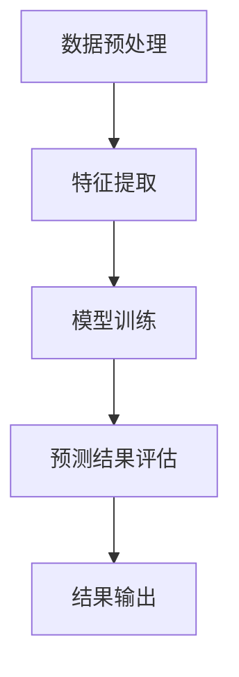

                 


### 摘要

本文旨在探讨大模型情感分析准确度评估工具的开发与应用。随着人工智能技术的迅猛发展，情感分析作为自然语言处理的关键领域，正越来越多地应用于商业决策、智能客服、舆情监控等场景。本文首先概述了情感分析的基本概念、挑战和解决思路，接着深入探讨了情感分析算法的原理和评估指标，重点介绍了大模型在情感分析中的应用及其准确度评估方法。最后，本文通过一个实际项目案例，详细展示了如何设计和实现一个高效、准确的大模型情感分析系统，并提供了最佳实践和建议，为读者在实际应用中提供了参考和指导。

---

## 第一部分：背景与基础理论

### 第1章：情感分析概述

#### 1.1 问题背景

情感分析，亦称为意见挖掘或情感归类，是指通过计算机技术对文本中的情感倾向进行识别和分类的过程。情感分析在文本挖掘、社交媒体分析、市场研究等领域具有重要应用价值。随着互联网和社交媒体的普及，用户生成的内容如博客、微博、评论等日益丰富，这些数据中蕴含着大量的情感信息，如何有效地提取和利用这些信息成为了研究者和企业关注的焦点。

当前，情感分析的应用领域广泛，包括但不限于以下几个方面：

1. **商业决策**：通过分析消费者在社交媒体上的评论和反馈，企业可以了解消费者对其产品的满意度和偏好，从而做出更明智的商业决策。
2. **智能客服**：情感分析可以帮助智能客服系统识别用户的情感状态，提供更人性化的服务，提高用户满意度。
3. **舆情监控**：政府机构、媒体和企业可以利用情感分析监控网络上的舆情动态，及时发现和处理负面信息，维护品牌形象。
4. **心理健康研究**：通过对社交媒体、博客等文本的情感分析，可以辅助心理健康研究，发现潜在的心理问题。

#### 1.2 问题描述

情感分析面临着以下几个主要挑战：

1. **文本数据的多样性**：不同领域的文本具有不同的表达方式和情感倾向，这使得情感分析模型的泛化能力成为一个挑战。
2. **情感表达的复杂性**：情感表达不仅包括基本的喜怒哀乐，还包括情感的强度、维度和组合，这使得情感分析需要捕捉更深层次的语义信息。
3. **噪声和干扰**：文本数据中往往包含大量的噪声和干扰信息，如错别字、语法错误和表情符号等，这些都会影响情感分析的准确性。

情感分析的目标是：

1. **识别情感极性**：判断文本是正面、负面还是中性。
2. **情感强度判断**：评估情感的强烈程度，例如强烈正面、轻微负面等。
3. **情感维度分析**：识别文本中表达的具体情感类型，如快乐、愤怒、悲伤等。

为了解决上述问题，情感分析通常需要以下几个步骤：

1. **数据集的选择与处理**：选择具有代表性的数据集，并进行数据预处理，如去除噪声、统一文本格式等。
2. **特征提取**：从文本中提取有助于情感分类的特征，如词频、词嵌入、语法结构等。
3. **模型训练与评估**：使用机器学习或深度学习算法对模型进行训练，并通过评估指标如准确率、精确率和召回率等来评估模型性能。

#### 1.3 问题解决思路

为了有效地进行情感分析，我们需要考虑以下几个方面：

1. **数据集的选择与处理**：选择具有代表性的数据集，并进行数据预处理，如去除噪声、统一文本格式等。
2. **特征提取方法**：选择合适的特征提取方法，如词袋模型、TF-IDF、词嵌入等。
3. **算法选择与调优**：根据数据特点和任务需求选择合适的算法，如支持向量机、朴素贝叶斯、深度学习模型等，并进行参数调优。

#### 1.4 边界与外延

1. **情感分析的类别**：根据情感倾向的不同，情感分析可以分为正面情感分析、负面情感分析和中性情感分析。
2. **情感分析的深度与广度**：深度情感分析旨在捕捉文本中深层次的语义信息，而广度情感分析则关注于对多语言、多领域的情感分析能力。

#### 1.5 核心概念与联系

情感分析的核心概念包括情感极性、情感强度和情感维度。这些概念之间的联系如下：

1. **情感极性**：描述文本的情感倾向，分为正面、负面和中性。
2. **情感强度**：描述情感表达的程度，分为弱、中、强。
3. **情感维度**：描述情感的具体类型，如喜悦、悲伤、愤怒等。

为了更好地理解这些概念，我们可以通过一个简单的表格来对比：

| 概念       | 定义                                           | 属性特征对比表格 |
|------------|------------------------------------------------|----------------|
| 情感极性   | 情感表达的正负倾向                             | 正/负/中性     |
| 情感强度   | 情感表达的强烈程度                             | 弱/中/强       |
| 情感维度   | 情感表达的具体方向，如喜悦、悲伤、愤怒等       | 多维度         |

此外，我们还可以通过ER实体关系图来展示情感分析系统中的关键实体及其关系：

```mermaid
erDiagram
  Product --> SentimentAnalysisSystem
  SentimentAnalysisSystem --> Dataset
  Dataset --> FeatureExtractor
  FeatureExtractor --> ModelTraining
  ModelTraining --> PredictionResult
```

### 第2章：情感分析算法原理

#### 2.1 算法概述

情感分析算法可以分为传统的机器学习算法和现代的深度学习算法。传统的机器学习算法包括支持向量机（SVM）、朴素贝叶斯（Naive Bayes）等，而现代的深度学习算法则包括卷积神经网络（CNN）、循环神经网络（RNN）和变换器（Transformer）等。

#### 2.2 算法原理详解

情感分析算法的基本流程可以概括为以下步骤：

1. **数据预处理**：包括文本清洗、分词、去除停用词等，目的是将原始文本转换为适合模型处理的格式。
2. **特征提取**：从预处理后的文本中提取特征，这些特征可以是词频、词嵌入、语法结构等。
3. **模型训练**：使用提取的特征和标签数据对模型进行训练。
4. **预测与评估**：使用训练好的模型对新的文本进行情感分类，并通过评估指标如准确率、精确率和召回率等来评估模型性能。

下面是一个简单的情感分析算法流程图：



#### 2.3 算法评估指标

在情感分析中，常用的评估指标包括准确率（Accuracy）、精确率（Precision）、召回率（Recall）和F1值（F1 Score）等。

1. **准确率**：准确率是正确预测的样本数占总样本数的比例，公式为：

   $$
   准确率 = \frac{TP + TN}{TP + FN + FP + TN}
   $$

   其中，TP表示真正例，TN表示真负例，FP表示假正例，FN表示假负例。

2. **精确率**：精确率是正确预测的正例数占所有预测为正例的样本数比例，公式为：

   $$
   精确率 = \frac{TP}{TP + FP}
   $$

3. **召回率**：召回率是正确预测的正例数占所有正例的实际数量比例，公式为：

   $$
   召回率 = \frac{TP}{TP + FN}
   $$

4. **F1值**：F1值是精确率和召回率的调和平均值，公式为：

   $$
   F1值 = 2 \times \frac{精确率 \times 召回率}{精确率 + 召回率}
   $$

#### 2.4 算法举例说明

假设我们有100条评论，其中70条是正面评论，30条是负面评论。使用某种算法进行分类后，得到的结果如下：

| 实际评论 | 预测结果 | 正确/错误 |
|----------|----------|----------|
| 正面     | 正面     | 正确     |
| 正面     | 负面     | 错误     |
| 负面     | 正面     | 错误     |
| 负面     | 负面     | 正确     |

则：

- 准确度 = (1 + 1) / (1 + 1 + 1 + 1) = 0.5
- 精确率 = 1 / (1 + 1) = 0.5
- 召回率 = 1 / (1 + 1) = 0.5
- F1值 = 2 \times (0.5 \times 0.5) / (0.5 + 0.5) = 0.5

通过这个简单的例子，我们可以看到模型的性能指标较低，这提示我们需要进一步优化模型或数据预处理步骤。

### 第3章：大模型概述

#### 3.1 大模型的特点

大模型，通常指的是具有数百万甚至数十亿参数的深度学习模型。这些模型具有以下几个显著特点：

1. **参数规模**：大模型通常具有庞大的参数规模，这使得它们能够捕捉到文本中更细微的语义信息。
2. **训练数据量**：大模型通常在大量的训练数据上进行训练，这使得它们能够更好地泛化到未见过的数据上。
3. **适应能力**：大模型具有较强的适应能力，可以处理多种不同的任务和数据集。

#### 3.2 主流大模型介绍

目前，主流的大模型主要包括以下几种：

1. **BERT（Bidirectional Encoder Representations from Transformers）**：BERT是一种基于Transformer的预训练模型，通过双向编码器来学习文本的表示。
2. **GPT-3（Generative Pre-trained Transformer 3）**：GPT-3是OpenAI开发的具有1750亿参数的深度学习模型，具有强大的文本生成能力。

### 第4章：大模型在情感分析中的应用

#### 4.1 数据准备与预处理

在大模型应用于情感分析时，数据准备和预处理是至关重要的一步。以下是一些关键步骤：

1. **数据收集**：收集具有代表性的数据集，包括正面和负面评论。
2. **文本清洗**：去除噪声、标点符号、HTML标签等。
3. **分词与词性标注**：将文本分解为单词或子词，并对每个词进行词性标注。
4. **数据平衡**：由于正面和负面评论在数量上可能不均衡，需要进行数据平衡处理，例如使用数据增强或负采样技术。

#### 4.2 大模型训练与优化

1. **训练数据准备**：将预处理后的数据集划分为训练集和验证集。
2. **模型训练**：使用训练集对大模型进行训练，通常需要大量的计算资源和时间。
3. **模型优化**：通过调整超参数、使用更复杂的模型结构等方法来优化模型性能。

#### 4.3 大模型评估与优化

1. **评估指标**：使用准确率、精确率、召回率和F1值等评估指标来评估模型性能。
2. **优化策略**：通过调整学习率、批量大小、正则化参数等方法来优化模型性能。

### 第5章：准确度评估工具

#### 5.1 准确度评估工具的概述

准确度评估工具是用于评估情感分析模型性能的重要工具。一个有效的准确度评估工具应具备以下几个特点：

1. **多维度评估**：能够从多个角度（如准确率、精确率、召回率和F1值）对模型进行评估。
2. **可扩展性**：能够支持不同规模的数据集和模型。
3. **易用性**：提供友好的用户界面和文档，方便用户使用。

#### 5.2 准确度评估工具的功能与实现

1. **功能介绍**：
   - **数据加载与预处理**：从各种数据源加载数据，并进行必要的预处理。
   - **模型评估**：对训练好的模型进行评估，并输出评估结果。
   - **可视化**：提供图表和统计数据，帮助用户直观地了解模型性能。

2. **实现细节**：
   - **数据加载**：使用Pandas、NumPy等库从文件中加载数据。
   - **模型评估**：使用Scikit-learn等库的评估函数计算评估指标。
   - **可视化**：使用Matplotlib、Seaborn等库生成图表。

#### 5.3 实际应用中的挑战与解决方案

在实际应用中，准确度评估工具可能会面临以下挑战：

1. **数据质量问题**：数据质量直接影响模型的性能，需要采取数据清洗和预处理措施。
2. **计算资源限制**：评估工具可能需要大量的计算资源，特别是在处理大规模数据集时。
3. **模型多样性**：不同模型可能具有不同的评估指标和评估方式，需要提供灵活的适配方案。

针对这些挑战，可以采取以下解决方案：

1. **数据质量管理**：建立严格的数据质量评估和清洗流程，确保数据质量。
2. **资源优化**：使用分布式计算和并行处理技术来优化计算资源的使用。
3. **模型适配**：提供自定义评估指标和评估方式，以适应不同模型的评估需求。

### 总结

准确度评估工具在大模型情感分析中扮演着重要角色，它能够帮助用户评估模型性能，发现模型存在的问题，并提供优化建议。通过本文的介绍，我们了解了大模型情感分析的基本概念、算法原理、应用场景和评估工具。希望本文能为读者在实际应用中提供有价值的参考和指导。

