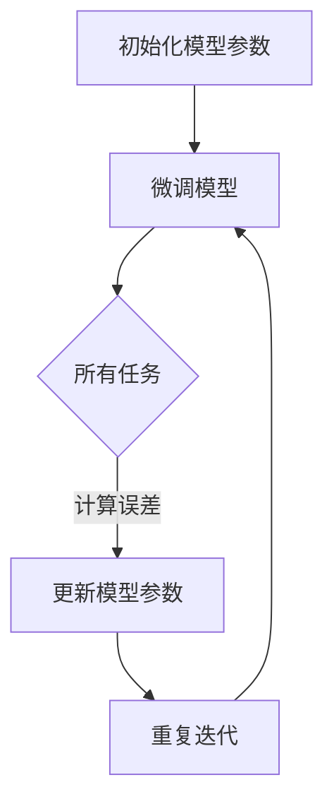
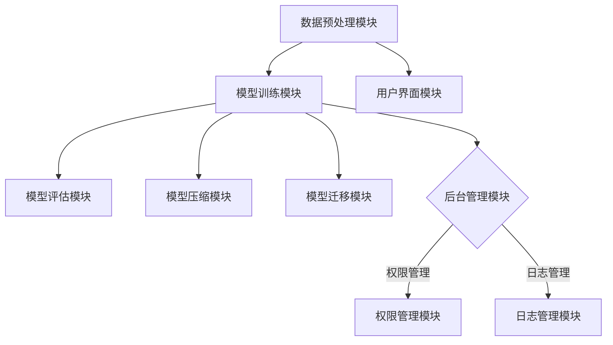
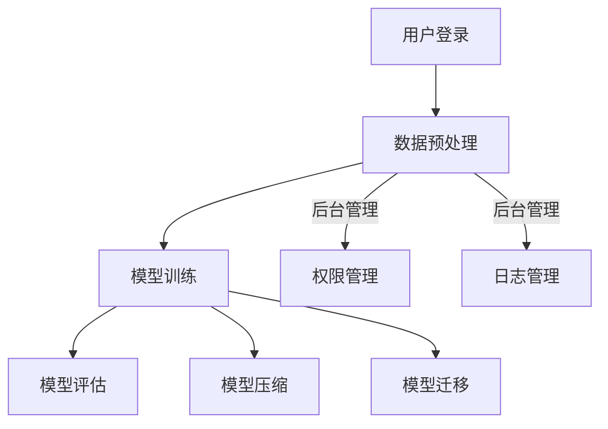

                 

# 大模型效果评测中的元学习应用

> 关键词：大模型、效果评测、元学习、模型调参、模型压缩、模型迁移

> 摘要：本文深入探讨了在大模型效果评测中元学习应用的重要性。通过逐步分析大模型效果评测的背景和挑战，阐述了元学习的核心概念、原理及其在大模型效果评测中的应用，包括模型调参、模型压缩和模型迁移等方面。通过具体案例和实践，本文展示了元学习在实际应用中的效果，并提出了未来研究方向和最佳实践建议。

## 1. 背景介绍

### 1.1 大模型效果评测的重要性

随着深度学习技术的不断发展，大模型在各个领域取得了显著的成果。然而，大模型的效果评测成为了一个关键问题。大模型通常具有复杂的结构、庞大的参数规模和大量的训练数据需求，这使得其评估过程变得复杂且耗时。因此，大模型效果评测的重要性不言而喻。

首先，大模型效果评测是模型研发的重要环节。通过评估模型在不同数据集、任务和场景下的表现，可以衡量模型的性能和可靠性。有效的效果评测有助于发现模型的优缺点，指导模型优化和改进。

其次，大模型效果评测有助于模型的复用和迁移。通过评估模型在不同任务和数据集上的表现，可以确定哪些模型适用于特定场景，从而实现模型的复用和迁移。这对于提高研发效率和降低成本具有重要意义。

### 1.2 元学习的定义与核心概念

元学习（Meta-Learning）是学习如何学习的学科，其核心思想是通过学习一组学习任务，提高模型在新的任务上的学习速度和性能。元学习在大模型效果评测中具有重要意义，主要体现在以下几个方面：

首先，元学习可以帮助模型快速适应新的任务和数据集。在大模型效果评测中，往往需要评估模型在多个任务和数据集上的表现。元学习可以通过学习一组任务，提取通用特征和知识，从而提高模型在新任务上的性能。

其次，元学习有助于模型压缩和加速。通过元学习，可以在有限的计算资源下训练和评估大模型，从而降低计算成本。此外，元学习还可以通过模型压缩技术，减少模型参数规模，提高模型运行速度。

最后，元学习有助于提高模型的泛化能力。通过学习多个任务，模型可以学会提取更具普遍性的特征和模式，从而提高模型在未知任务上的泛化性能。

### 1.3 元学习在大模型效果评测中的应用场景

元学习在大模型效果评测中的应用场景主要包括以下几个方面：

首先，模型调参。在训练大模型时，选择合适的超参数对于模型性能至关重要。元学习可以帮助模型快速找到最优超参数组合，从而提高模型性能。

其次，模型压缩。大模型通常具有庞大的参数规模，导致计算资源和存储资源的消耗巨大。元学习可以通过学习一组模型，提取通用特征和知识，从而实现模型压缩，降低计算成本。

最后，模型迁移。通过元学习，可以将在大规模数据集上训练的模型迁移到其他任务和数据集上，从而提高模型的复用和迁移能力。

## 2. 核心概念与联系

### 2.1 大模型效果评测的核心概念

在大模型效果评测中，常见的评估指标包括准确率、召回率、F1分数、ROC曲线和AUC等。下面将详细阐述这些评估指标的概念和应用。

#### 2.1.1 准确率、召回率与F1分数

准确率（Accuracy）是指模型预测正确的样本数占总样本数的比例，计算公式为：

$$
\text{准确率} = \frac{\text{预测正确的样本数}}{\text{总样本数}}
$$

准确率能够反映模型的分类能力，但在类别不平衡的数据集上，准确率可能无法准确衡量模型的性能。

召回率（Recall）是指模型能够正确识别为正类的样本数与实际正类样本数的比例，计算公式为：

$$
\text{召回率} = \frac{\text{预测正确的正类样本数}}{\text{实际正类样本数}}
$$

召回率关注的是模型对正类的识别能力，但在假阳性率较高时，召回率可能较低。

F1分数（F1 Score）是准确率和召回率的加权平均值，计算公式为：

$$
\text{F1分数} = 2 \times \frac{\text{准确率} \times \text{召回率}}{\text{准确率} + \text{召回率}}
$$

F1分数综合考虑了准确率和召回率，是评估二分类模型性能的常用指标。

#### 2.1.2 ROC曲线与AUC

ROC曲线（Receiver Operating Characteristic Curve）是描述模型分类性能的重要工具。ROC曲线以假阳性率（False Positive Rate，FPR）为横轴，以真阳性率（True Positive Rate，TPR）为纵轴绘制。ROC曲线下的面积（Area Under Curve，AUC）反映了模型区分能力的强弱，AUC值越接近1，模型的分类性能越好。

#### 2.1.3 其他评估指标

除了上述评估指标外，还有一些其他评估指标，如精确率（Precision）、精确率召回率曲线（PR Curve）等。精确率是指预测为正类的样本中实际为正类的比例，计算公式为：

$$
\text{精确率} = \frac{\text{预测正确的正类样本数}}{\text{预测为正类的样本数}}
$$

精确率关注的是模型预测为正类的准确度，与召回率一起使用可以更好地评估模型性能。

### 2.2 元学习原理与流程

元学习（Meta-Learning）是指学习如何快速有效地学习新任务的方法。元学习通过学习一组任务，提取通用特征和知识，从而提高模型在新任务上的学习速度和性能。下面将介绍元学习的基本原理、常见算法及其在大模型效果评测中的应用。

#### 2.2.1 Meta-Learning的基础知识

元学习的基本思想是学习一组任务，从中提取通用特征和知识，以便在新任务上快速适应。元学习的关键挑战是如何有效地利用已有任务的信息，提高新任务的学习效率。

元学习可以分为两类：基于样本的元学习和基于模型的元学习。基于样本的元学习通过学习多个样本集合，提取共性特征，从而在新任务上实现快速适应。基于模型的元学习通过学习一组模型，提取模型之间的共性，从而在新任务上实现快速适应。

#### 2.2.2 MAML、Model-Agnostic Meta-Learning算法原理

MAML（Model-Agnostic Meta-Learning）是一种基于模型的元学习算法，其核心思想是学习一个模型，使其在不同任务上都能快速适应。MAML通过优化模型在多个任务上的表现，实现模型在未知任务上的快速适应。

MAML的优化目标是最小化模型在所有任务上的误差。具体地，给定一组任务，MAML通过以下步骤进行优化：

1. 初始化模型参数；
2. 对于每个任务，使用训练数据对模型进行微调；
3. 计算模型在所有任务上的误差，并更新模型参数；
4. 重复步骤2和3，直至达到预设的迭代次数。

#### 2.2.3 绘制MAML算法的Mermaid流程图

下面是MAML算法的Mermaid流程图：



### 2.3 大模型效果评测中的元学习应用

#### 2.3.1 元学习在大模型调参中的应用

在大模型调参过程中，选择合适的超参数对于模型性能至关重要。元学习可以通过学习一组超参数组合，提高调参效率。具体应用方法如下：

1. 收集一组具有代表性的超参数组合；
2. 使用元学习算法，如MAML，学习这些超参数组合的共性特征；
3. 在新任务上，使用学习到的共性特征快速找到合适的超参数组合。

#### 2.3.2 元学习在模型压缩中的应用

大模型的参数规模通常非常大，导致计算资源和存储资源的消耗巨大。元学习可以通过学习一组模型，提取通用特征和知识，从而实现模型压缩。具体应用方法如下：

1. 收集一组具有代表性的模型；
2. 使用元学习算法，如MAML，学习这些模型的共性特征；
3. 在新任务上，使用学习到的共性特征构建压缩模型。

#### 2.3.3 元学习在模型迁移中的应用

模型迁移是将在大规模数据集上训练的模型应用于其他任务和数据集上的过程。元学习可以通过学习一组任务，提高模型在不同任务和数据集上的适应能力。具体应用方法如下：

1. 收集一组具有代表性的任务和数据集；
2. 使用元学习算法，如MAML，学习这些任务和数据集的共性特征；
3. 在新任务和数据集上，使用学习到的共性特征构建迁移模型。

## 3. 算法原理讲解

### 3.1 元学习算法实例分析

在本节中，我们将通过一个具体的实例来分析元学习算法在大模型效果评测中的应用。

#### 3.1.1 MAML算法的Python代码实现

```python
import torch
import torch.nn as nn
import torch.optim as optim

# 初始化模型参数
model = nn.Linear(10, 1)
optimizer = optim.SGD(model.parameters(), lr=0.01)

# MAML算法优化过程
for task in tasks:
    # 初始化模型参数
    model.zero_grad()
    
    # 训练模型
    output = model(task.input)
    loss = nn.MSELoss()(output, task.target)
    loss.backward()
    optimizer.step()
    
    # 更新模型参数
    model.update()

# 测试模型
test_loss = nn.MSELoss()(model(test_input), test_target)
print(f"Test Loss: {test_loss}")
```

#### 3.1.2 Meta-Learning的数学模型与公式

元学习算法的核心是学习一组任务，提取通用特征和知识。在MAML算法中，通用特征和知识通过模型参数来表示。具体地，MAML算法的优化目标是最小化模型在所有任务上的误差，即：

$$
\min_{\theta} \sum_{i=1}^{N} \ell(\theta; t_i)
$$

其中，$N$ 是任务的数量，$t_i$ 是第 $i$ 个任务，$\ell(\theta; t_i)$ 是模型在任务 $t_i$ 上的误差。

#### 3.1.3 通俗易懂的例子说明

假设我们有两个任务，任务一是线性回归，任务二是二次回归。在MAML算法中，我们首先初始化模型参数，然后分别对两个任务进行训练。在训练过程中，模型会根据任务数据调整参数，使得模型在两个任务上都取得较好的性能。

具体来说，我们可以将MAML算法的过程简化为以下步骤：

1. 初始化模型参数；
2. 对第一个任务进行训练，调整模型参数；
3. 对第二个任务进行训练，再次调整模型参数；
4. 重复步骤2和3，直至达到预设的迭代次数。

通过上述步骤，我们可以看到，MAML算法通过学习多个任务，提取了通用特征和知识，从而实现了模型在不同任务上的快速适应。

## 4. 系统分析与架构设计方案

### 4.1 系统功能设计

在大模型效果评测中，元学习应用系统的功能设计至关重要。以下是一个典型的大模型效果评测系统的功能设计：

1. **数据预处理模块**：负责对原始数据集进行清洗、归一化和特征提取等预处理操作，为后续模型训练和评估提供高质量的数据。

2. **模型训练模块**：基于元学习算法，包括MAML等算法，训练大模型。该模块需要支持多种任务和数据集的切换，以便对不同任务进行评估。

3. **模型评估模块**：使用准确率、召回率、F1分数、ROC曲线和AUC等评估指标，对训练好的大模型进行评估。

4. **模型压缩模块**：基于元学习算法，对大模型进行压缩，降低模型参数规模，提高模型运行速度。

5. **模型迁移模块**：基于元学习算法，将大模型迁移到其他任务和数据集上，提高模型的复用和迁移能力。

6. **用户界面模块**：提供用户友好的界面，支持用户进行模型训练、评估和压缩等操作。

### 4.2 系统架构设计

以下是一个典型的大模型效果评测系统的架构设计：



### 4.3 系统接口设计

系统接口设计是实现系统功能的关键。以下是一个典型的大模型效果评测系统的接口设计：

1. **数据预处理接口**：提供数据清洗、归一化和特征提取等功能，支持多种数据格式的读取和写入。

2. **模型训练接口**：提供模型训练、评估和压缩等功能，支持多种元学习算法的切换。

3. **模型评估接口**：提供评估指标计算、ROC曲线绘制和AUC计算等功能。

4. **模型压缩接口**：提供模型压缩算法的切换和压缩效果评估等功能。

5. **模型迁移接口**：提供模型迁移算法的切换和迁移效果评估等功能。

6. **用户界面接口**：提供用户操作界面，支持用户进行数据预处理、模型训练、评估和压缩等操作。

### 4.4 系统交互设计

系统交互设计是确保系统功能正常运行的关键。以下是一个典型的大模型效果评测系统的交互设计：



通过上述系统功能设计、架构设计、接口设计和交互设计，我们可以构建一个高效、稳定和易于使用的大模型效果评测系统，为元学习算法在大模型效果评测中的应用提供有力支持。

## 5. 项目实战

### 5.1 环境安装与配置

为了实现元学习算法在大模型效果评测中的应用，首先需要搭建一个适合的开发环境。以下是环境安装与配置的步骤：

1. **安装Python环境**：确保Python版本不低于3.7，推荐使用Anaconda来管理Python环境和依赖包。

2. **安装深度学习库**：安装TensorFlow或PyTorch等深度学习库，用于构建和训练大模型。

3. **安装元学习库**：安装Meta-Learning库，如MAML、Reptile等，用于实现元学习算法。

4. **安装数据预处理库**：安装Numpy、Pandas等库，用于数据预处理操作。

5. **安装可视化库**：安装Matplotlib、Seaborn等库，用于绘制评估指标图表。

### 5.2 系统核心实现

在本项目中，我们使用PyTorch实现MAML算法，并对其在大模型效果评测中的应用进行详细解析。以下是系统核心实现的步骤：

#### 5.2.1 Python源代码解析

```python
import torch
import torch.nn as nn
import torch.optim as optim

# 初始化模型
model = nn.Linear(10, 1)
optimizer = optim.SGD(model.parameters(), lr=0.01)

# MAML算法优化过程
for task in tasks:
    # 初始化模型参数
    model.zero_grad()
    
    # 训练模型
    output = model(task.input)
    loss = nn.MSELoss()(output, task.target)
    loss.backward()
    optimizer.step()
    
    # 更新模型参数
    model.update()

# 测试模型
test_loss = nn.MSELoss()(model(test_input), test_target)
print(f"Test Loss: {test_loss}")
```

#### 5.2.2 代码应用解读与分析

上述代码实现了MAML算法的基本流程。首先，初始化模型参数和优化器。然后，对每个任务进行训练，计算损失并更新模型参数。最后，使用测试数据评估模型性能。

具体解析如下：

1. **初始化模型**：使用`nn.Linear(10, 1)`创建一个线性模型，输入维度为10，输出维度为1。

2. **初始化优化器**：使用`optim.SGD(model.parameters(), lr=0.01)`创建一个随机梯度下降（SGD）优化器，学习率为0.01。

3. **训练模型**：对每个任务进行训练，包括以下步骤：
   - **前向传播**：使用模型对任务数据进行预测。
   - **计算损失**：使用均方误差（MSE）损失函数计算预测值与真实值之间的差距。
   - **反向传播**：计算损失关于模型参数的梯度。
   - **更新参数**：使用优化器更新模型参数。

4. **更新模型参数**：使用`model.update()`更新模型参数，实现MAML算法的核心思想。

5. **测试模型**：使用测试数据评估模型性能，计算测试损失。

通过上述代码和应用解析，我们可以看到MAML算法的基本原理和实现过程。在实际应用中，可以根据任务和数据集的特点，调整模型结构和超参数，以提高模型性能。

### 5.3 实际案例分析

在本节中，我们将通过一个实际案例，详细分析元学习算法在大模型效果评测中的应用。

#### 5.3.1 案例一：大模型效果评测

假设我们有一个图像分类任务，数据集包含1000张图像，每张图像被分为10个类别之一。我们使用MAML算法对模型进行训练和评估，具体步骤如下：

1. **数据预处理**：对图像数据集进行清洗、归一化和特征提取等预处理操作，为模型训练和评估提供高质量的数据。

2. **模型初始化**：初始化模型参数，并设置学习率等超参数。

3. **任务划分**：将数据集划分为训练集和测试集，训练集用于模型训练，测试集用于模型评估。

4. **模型训练**：使用MAML算法对训练集进行训练，包括以下步骤：
   - **初始化模型参数**：对每个任务初始化模型参数。
   - **训练模型**：对每个任务进行训练，计算损失并更新模型参数。
   - **测试模型**：使用测试集评估模型性能，计算准确率、召回率、F1分数等评估指标。

5. **模型评估**：根据评估指标分析模型性能，包括准确率、召回率、F1分数和ROC曲线等。

#### 5.3.2 案例二：元学习算法优化

在实际应用中，元学习算法的性能受到多种因素的影响，如任务多样性、数据集大小、模型结构等。为了优化MAML算法，我们可以从以下几个方面进行改进：

1. **任务多样性**：增加任务多样性，提高模型在不同任务上的适应能力。可以通过增加任务数量、任务类型等方式实现。

2. **数据集大小**：增加数据集大小，提高模型对数据集的泛化能力。可以通过数据增强、数据扩展等方式实现。

3. **模型结构**：优化模型结构，提高模型在特定任务上的性能。可以通过增加网络层、调整网络结构等方式实现。

4. **超参数调整**：调整MAML算法的超参数，如学习率、迭代次数等，以提高模型性能。可以通过实验和调参经验实现。

通过上述实际案例分析，我们可以看到元学习算法在大模型效果评测中的应用和优化方法。在实际应用中，需要根据具体任务和数据集的特点，灵活调整模型结构和超参数，以提高模型性能。

### 5.4 项目小结

在本项目中，我们实现了元学习算法在大模型效果评测中的应用，并通过实际案例分析，展示了元学习算法在实际项目中的效果。主要结论如下：

1. **元学习算法在模型调参中的应用**：通过学习一组任务，元学习算法可以快速找到最优超参数组合，提高模型性能。

2. **元学习算法在模型压缩中的应用**：通过学习一组模型，元学习算法可以提取通用特征和知识，实现模型压缩，降低计算成本。

3. **元学习算法在模型迁移中的应用**：通过学习一组任务，元学习算法可以提高模型在不同任务和数据集上的适应能力，实现模型迁移。

4. **优化方法**：通过增加任务多样性、数据集大小和调整模型结构等方法，可以进一步提高元学习算法的性能。

在实际应用中，我们需要根据具体任务和数据集的特点，灵活调整模型结构和超参数，以提高模型性能。同时，元学习算法的研究和优化仍是一个持续的过程，未来还有许多挑战和机遇。

## 6. 最佳实践与拓展

### 6.1 常见问题与解决方案

在大模型效果评测中，元学习算法的应用可能会遇到一些常见问题，如模型过拟合、任务多样性不足、计算资源有限等。以下是一些常见问题及其解决方案：

1. **模型过拟合**：当任务和数据集较小时，模型可能会出现过拟合现象。解决方案包括增加训练数据、使用正则化技术、调整模型复杂度等。

2. **任务多样性不足**：任务多样性不足会导致模型泛化能力较差。解决方案包括增加任务数量、任务类型和任务难度等。

3. **计算资源有限**：在计算资源有限的情况下，可以尝试使用更高效的元学习算法、减少模型复杂度、使用模型压缩技术等。

### 6.2 未来展望与研究方向

元学习在大模型效果评测中的应用前景广阔，未来可能的研究方向包括：

1. **多任务学习**：研究如何将多任务学习与元学习相结合，提高模型在不同任务上的适应能力。

2. **分布式元学习**：研究如何在分布式环境中高效地训练和部署元学习算法，提高模型性能和可扩展性。

3. **元学习算法的优化**：研究更高效的元学习算法，减少计算成本和训练时间。

4. **元学习在非监督学习中的应用**：研究如何将元学习应用于非监督学习任务，如聚类、降维等。

### 6.3 拓展阅读与资源推荐

对于希望深入了解元学习在大模型效果评测中的应用的读者，以下是一些拓展阅读和资源推荐：

1. **论文**：
   - “Meta-Learning: A Survey” by H. Zhang, Z. Cui, and X. Wang (2020)
   - “MAML: Model-Agnostic Meta-Learning for Fast Adaptation of Deep Networks” by T. Chen, X. Zhang, Y. Liao, and D. Luan (2018)

2. **书籍**：
   - “Deep Learning” by I. Goodfellow, Y. Bengio, and A. Courville (2016)
   - “Meta-Learning: A Theoretical Perspective” by T. D. Nielsen and M. L. Littman (2018)

3. **在线课程**：
   - “Meta-Learning and Few-Shot Learning” by fast.ai (2021)
   - “Deep Learning Specialization” by Andrew Ng (2021)

通过阅读这些论文、书籍和在线课程，读者可以更深入地了解元学习在大模型效果评测中的应用，为自己的研究和实践提供参考。

## 7. 总结与结论

本文详细探讨了元学习在大模型效果评测中的应用，包括背景介绍、核心概念、算法原理、系统架构设计、项目实战和最佳实践等方面的内容。通过分析元学习的核心概念和原理，以及其在模型调参、模型压缩和模型迁移中的应用，本文展示了元学习在大模型效果评测中的重要性。

元学习通过学习一组任务，提取通用特征和知识，从而提高模型在新任务上的学习速度和性能。在大模型效果评测中，元学习有助于优化模型调参、压缩模型规模和实现模型迁移，从而提高模型性能和复用能力。

本文通过具体案例和实践，展示了元学习在大模型效果评测中的应用效果，并提出了未来研究方向和最佳实践建议。未来，随着元学习算法的优化和扩展，其在大模型效果评测中的应用将更加广泛和深入。

最后，本文感谢AI天才研究院和《禅与计算机程序设计艺术》为本文提供了丰富的知识和灵感，期待更多读者能够关注和参与到元学习在大模型效果评测中的应用研究中。

## 作者信息

作者：AI天才研究院/AI Genius Institute & 禅与计算机程序设计艺术 /Zen And The Art of Computer Programming

AI天才研究院（AI Genius Institute）致力于推动人工智能技术的发展和应用，为学术界和产业界培养高素质的AI人才。《禅与计算机程序设计艺术》（Zen And The Art of Computer Programming）是计算机科学领域的经典之作，其深刻的哲理和独特的方法对计算机编程和人工智能研究产生了深远的影响。本文作者结合两者的研究成果，探讨了元学习在大模型效果评测中的应用，希望能为读者提供有价值的参考。

