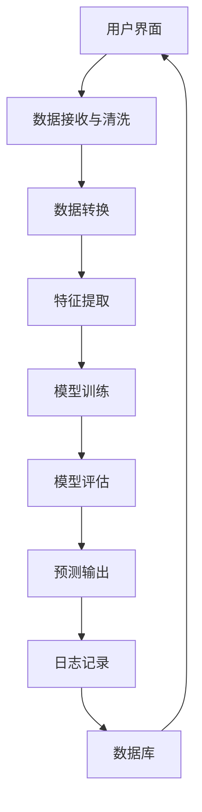
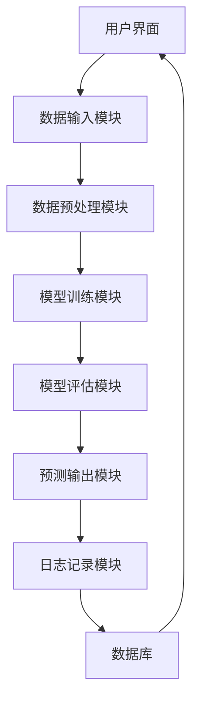

                 

### 关键词

1. **大模型时间感知能力**：指大型语言模型对时间概念的理解和处理能力。
2. **LLM设计时序测试**：针对大型语言模型设计的时序相关测试方案。
3. **时序数据处理**：处理包含时间信息的序列数据的方法和技术。
4. **算法原理讲解**：对大型语言模型时序测试算法的原理和数学模型进行详细解释。
5. **系统分析与架构设计**：分析并设计大型语言模型时序测试的系统结构和接口。
6. **项目实战**：通过实际案例展示如何设计和执行时序测试。
7. **最佳实践 tips**：提供实际操作中的技巧和建议。

### 摘要

本文旨在探讨大模型时间感知能力评估中的关键问题，特别是大型语言模型（LLM）如何设计有效的时序相关测试。文章首先介绍了大模型时间感知能力的背景和重要性，然后深入讲解了相关核心概念与算法原理。接着，文章通过系统分析与架构设计，展示了如何将理论转化为实际应用。随后，通过实际项目实战，详细剖析了测试设计、实现和案例分析的过程。最后，文章提供了最佳实践技巧和注意事项，为读者在实际操作中提供指导。通过本文，读者将获得对大模型时间感知能力评估的全面理解和实践经验。

## 第1章：大模型时间感知能力的重要性

### 1.1 时间感知能力概述

时间感知能力是人类智慧的重要组成部分，它使得我们能够理解、预测和适应动态环境中的变化。在人工智能领域，特别是大型语言模型（LLM）的快速发展中，时间感知能力的重要性愈发凸显。时间感知能力不仅涉及模型对时间的识别和表示，还包括对时间序列数据的处理、理解和预测。

首先，时间感知能力是指模型在处理时间相关信息时，能够捕捉到时间序列中的模式、趋势和规律。这对于语言模型来说尤为重要，因为自然语言中大量信息都是和时间相关的。例如，新闻文章中的事件顺序、社交网络中的互动时间线、以及对话系统中的上下文等，都依赖于模型对时间信息的准确理解和处理。

其次，时间感知能力对于提高模型的实用性和智能化水平具有重要意义。具有良好时间感知能力的模型能够更好地处理和生成时序信息，从而在多个实际应用场景中展现出更高的性能。例如，在股票市场预测中，模型需要理解市场趋势和事件的时间序列特征；在自然语言生成中，模型需要根据上下文和时间顺序生成连贯的内容。

此外，时间感知能力也是提升模型泛化能力的关键因素。当模型能够理解和学习时间序列数据的内在规律时，它不仅能够处理已知模式，还能对新出现的模式进行预测和适应。这种能力对于模型的长期发展和应用至关重要。

总的来说，时间感知能力不仅是大型语言模型的一项基础能力，更是其智能化和实用性提升的关键。随着人工智能技术的不断进步，如何有效提升大模型的时间感知能力，已经成为一个重要的研究方向。

### 1.2 时间感知能力在大模型中的重要性

在大模型中，时间感知能力的重要性不仅体现在基础层面的数据处理，更体现在应用层面的性能提升和智能化水平的增强。首先，从数据处理的角度来看，大模型如大型语言模型在处理文本信息时，经常需要理解时间相关的上下文信息。例如，在自然语言生成任务中，模型需要根据前文中的时间线索来生成合理且连贯的后续内容。如果模型缺乏时间感知能力，就难以生成具有时间一致性和逻辑性的文本。

其次，从应用性能提升的角度来看，时间感知能力能够显著提高大模型的任务表现。例如，在时间序列预测任务中，如股票价格预测、天气预测等，模型需要理解时间序列中的趋势和周期性特征。如果模型具备良好的时间感知能力，它能够更准确地捕捉这些特征，从而提高预测的准确性。此外，在对话系统中，时间感知能力也至关重要。模型需要根据对话的上下文和时间顺序来理解用户意图和生成响应，从而提供更自然、流畅的用户体验。

最后，从智能化水平的增强角度来看，时间感知能力是实现高级智能应用的关键。例如，在智能助理和自动驾驶领域，模型需要理解时间信息和物理世界中的动态变化，从而做出智能决策。这不仅要求模型具备强大的计算能力，还需要具备对时间感知的深刻理解。通过提升时间感知能力，大模型能够在更复杂的场景中表现出更高的智能水平，从而推动人工智能技术的发展和应用。

总之，时间感知能力在大模型中的重要性不言而喻。它是提高模型性能和智能化水平的关键，也是实现人工智能技术在各个领域广泛应用的基础。随着研究的深入，如何更好地提升大模型的时间感知能力，将成为未来人工智能研究的重要方向。

### 1.3 当前研究现状

目前，大模型时间感知能力的研究在学术界和工业界都取得了显著的进展。首先，从学术界来看，研究者们提出了多种基于深度学习的方法来增强模型的时间感知能力。这些方法包括卷积神经网络（CNN）、循环神经网络（RNN）、长短时记忆网络（LSTM）以及门控循环单元（GRU）等。这些神经网络结构通过不同的方式捕捉时间序列中的模式和规律，从而提升模型对时间信息的理解和处理能力。

例如，LSTM和GRU是专门为处理序列数据而设计的，它们能够有效捕捉时间序列中的长期依赖关系。此外，还有一些研究者提出了更复杂的模型，如Transformer和BERT，这些模型通过自注意力机制（self-attention）和上下文嵌入（contextual embeddings）来捕捉时间序列中的时空关系。这些方法虽然在某些任务上表现优异，但也面临模型复杂度高、计算资源消耗大等问题。

在工业界，时间感知能力的研究主要集中在优化现有模型结构和算法，以提高实际应用中的性能。例如，工业界通过引入时间感知模块（如时间嵌入层）来增强模型的时序处理能力。这些模块能够将时间信息显式地融入模型，从而提高模型在时序任务中的表现。此外，工业界还通过大量数据集和实际应用场景的反馈，不断优化和调整模型参数，以提高模型的泛化能力和鲁棒性。

尽管在时间感知能力的研究方面取得了不少进展，但当前的研究仍面临一些挑战。首先，如何在保证模型性能的同时，降低计算复杂度和资源消耗，是一个亟待解决的问题。其次，如何设计更有效的评估指标来全面评估模型的时间感知能力，也是一个重要的研究方向。此外，如何将时间感知能力应用于更广泛的实际场景，如智能对话系统、自动驾驶等，也是未来的重要课题。

总的来说，当前大模型时间感知能力的研究正处于快速发展的阶段，学术界和工业界都在积极探索和解决相关的问题。随着研究的深入和技术的进步，相信未来大模型的时间感知能力将得到进一步提升，从而推动人工智能技术在更多领域的应用和发展。

### 1.4 大模型时序数据处理

时序数据处理是人工智能领域中的一个重要分支，特别是在大型语言模型（LLM）中，如何有效地处理时间序列数据成为了一个关键问题。时序数据指的是带有时间标记的数据，这些数据按照时间顺序排列，并且通常包含一些随时间变化的信息。在自然语言处理（NLP）、金融市场预测、医疗诊断等众多领域，时序数据处理都发挥着重要作用。

首先，时序数据的特性主要包括以下几点。第一，时序数据通常具有时间依赖性，即后续数据与之前的数据之间存在关联。这种依赖关系在许多应用场景中至关重要，例如，在股票价格预测中，今天的价格会受到过去几天或几个月价格的影响。第二，时序数据往往表现出周期性或趋势性特征，如季节性波动或长期上升趋势。这种周期性和趋势性对于预测未来趋势至关重要。第三，时序数据可能存在缺失值或噪声，这对数据的处理和分析提出了额外的挑战。

针对时序数据的挑战，研究人员提出了一系列处理方法和技术。首先，数据预处理是时序数据分析的重要步骤。数据预处理包括数据清洗、填充缺失值、消除噪声等操作。例如，在金融数据中，可能需要剔除异常值或填补交易数据中的缺失值；在医疗数据中，可能需要消除不必要的噪声，提取有用的特征。

其次，特征提取是时序数据处理中的核心环节。特征提取的目标是从原始时序数据中提取出对模型训练和预测有用的信息。常用的特征提取方法包括时序分解（如季节性分解、趋势分解）、傅里叶变换（用于捕捉周期性特征）、卷积神经网络（用于捕捉局部模式和长期依赖关系）等。这些方法能够将原始数据转换为适合模型处理的特征表示。

最后，模型训练和预测是时序数据处理的最终目标。在模型训练阶段，常用的模型包括循环神经网络（RNN）、长短时记忆网络（LSTM）、门控循环单元（GRU）等。这些模型能够有效地捕捉时间序列中的长期和短期依赖关系。在预测阶段，模型需要根据历史数据生成未来的预测值。常用的预测方法包括回归分析、时间序列预测模型（如ARIMA模型）、深度学习模型等。这些方法能够在不同程度上提高预测的准确性和可靠性。

总的来说，时序数据处理是大型语言模型中不可或缺的一部分。通过有效的数据预处理、特征提取和模型训练方法，我们可以更好地理解和利用时间序列数据，从而实现更准确和智能的预测和决策。

### 1.5 大模型在时序数据处理中的应用

大型语言模型（LLM）在时序数据处理中的应用正日益扩展，其强大的表示能力和灵活性使其成为许多复杂时序任务中的首选工具。以下是一些典型的应用场景：

1. **股票市场预测**：股票市场的动态变化通常依赖于时间序列数据，包括历史价格、交易量、新闻文章等。LLM可以通过学习这些数据中的模式和趋势，预测未来的股票价格。例如，GPT-3等大型语言模型已被用于分析市场趋势，生成交易策略，甚至进行市场情绪分析。

2. **自然语言处理（NLP）**：在NLP任务中，时间感知能力对于理解文本中的时间线索至关重要。LLM可以处理包含时间信息的文本，如事件描述、日程安排、时间线等。例如，在问答系统中，模型需要根据用户提问中的时间线索来提供准确的答案。通过时序处理，模型能够更好地理解上下文和时间顺序，从而提高问答的准确性和连贯性。

3. **语音识别与生成**：语音数据本质上也是一种时序数据，LLM在语音识别和语音生成中发挥着重要作用。通过时序建模，LLM可以捕捉语音信号中的时间和频率特征，从而实现更准确的语音识别和自然流畅的语音合成。例如，基于Transformer架构的模型被广泛应用于自动语音识别（ASR）和文本到语音（TTS）系统。

4. **医疗诊断**：在医疗领域，时间感知能力对于疾病的监测和预测具有重要意义。LLM可以分析患者的医疗记录、历史数据和实时数据，预测疾病发展趋势和可能的并发症。例如，通过分析患者的就诊记录和检查结果，模型可以预测患者未来可能出现的健康问题，从而为医生提供决策支持。

5. **智能交通与自动驾驶**：交通系统和自动驾驶依赖于对实时交通数据的分析和预测。LLM可以处理交通流量数据、历史路线数据等，预测交通状况和交通事故风险。例如，在自动驾驶系统中，模型需要实时分析车辆位置、速度和交通信号等信息，做出安全的驾驶决策。

总的来说，大型语言模型在时序数据处理中的应用不仅局限于上述几个领域，其广泛的适用性和强大的处理能力使得它在更多新兴应用场景中显示出巨大的潜力。随着研究的深入和技术的发展，LLM在时序数据处理中的应用将会更加广泛和深入，为各个领域带来更多的创新和突破。

### 1.6 时序相关问题的分类

在讨论大模型时间感知能力时，理解不同类型的时序问题及其特点是非常重要的。时序问题可以根据不同的维度进行分类，主要包括时间序列的类型、任务类型以及应用场景等。

首先，从时间序列的类型来看，时序问题可以分为以下几类：

1. **确定性时序**：确定性时序数据的变化是完全可预测的，例如一个简单的线性增长或衰减序列。这类时序问题通常较为简单，可以通过简单的数学模型进行预测。

2. **随机性时序**：随机性时序数据的变化具有不确定性，通常包含随机波动和噪声。这类时序问题较为复杂，需要采用复杂的统计模型和机器学习算法来捕捉其内在的随机性和模式。

3. **周期性时序**：周期性时序数据在特定时间范围内会重复出现相同的模式，例如季节性波动或日历周期性变化。这类时序问题通常可以通过傅里叶变换或周期性分解来处理。

4. **趋势性时序**：趋势性时序数据表现出长期的增长或减少趋势，通常与时间有明确的依赖关系。这类时序问题需要考虑长期趋势的影响，常用的方法包括线性回归和指数平滑。

其次，从任务类型来看，时序问题可以分为以下几类：

1. **预测**：预测是时序分析中最常见的任务，旨在根据历史数据预测未来的趋势或特定值。常见的预测方法包括ARIMA模型、LSTM网络和GRU网络等。

2. **分类**：分类任务是将时序数据分为不同的类别。例如，根据历史股票价格数据预测未来是否会上涨或下跌。分类任务通常需要模型对时序特征有较好的理解能力。

3. **聚类**：聚类任务是将相似的数据点归为同一类别。在时序分析中，聚类可以用于发现数据中的周期性特征或趋势。例如，通过聚类分析，可以识别出不同季节的销售高峰。

4. **异常检测**：异常检测任务是识别数据中的异常值或异常模式。在时序分析中，异常检测可以用于检测异常交易或异常行为。常见的方法包括基于统计模型的异常检测和基于机器学习的异常检测。

最后，从应用场景来看，时序问题可以分为以下几类：

1. **金融市场**：金融市场中的时序问题主要包括股票价格预测、交易策略优化、市场情绪分析等。这类问题的特点是数据量大、噪声多、变化快。

2. **医疗健康**：医疗健康领域的时序问题主要包括疾病监测、诊断预测、药物疗效评估等。这类问题的特点是数据多维、复杂、需要考虑时间依赖性。

3. **工业生产**：工业生产中的时序问题主要包括设备故障预测、生产效率分析、供应链优化等。这类问题的特点是数据连续、具有周期性变化。

4. **交通物流**：交通物流中的时序问题主要包括交通流量预测、交通信号控制、物流路径规划等。这类问题的特点是数据实时、动态变化。

总的来说，时序相关问题的分类有助于我们更好地理解和解决不同类型的时序问题。通过合理选择模型和方法，我们可以有效地提升大模型在时序任务中的表现，推动人工智能技术在各个领域的应用。

### 1.7 评估指标的选择

评估大模型时间感知能力的关键在于选择合适的评估指标。这些指标不仅能够量化模型在时间感知任务上的表现，还能为后续的模型优化提供方向。以下是几种常见的评估指标及其优缺点。

1. **准确率（Accuracy）**：
   - **定义**：准确率是指模型预测正确的样本占总样本的比例。
   - **优点**：直观、易于理解，适用于分类任务。
   - **缺点**：对于类别不平衡的数据集不够敏感，无法反映模型的预测能力。

2. **精确率（Precision）和召回率（Recall）**：
   - **定义**：精确率是预测正确的正样本数除以所有预测为正的样本数，召回率是预测正确的正样本数除以实际为正的样本数。
   - **优点**：能够更细致地评估模型的分类性能，特别适用于类别不平衡的数据集。
   - **缺点**：仅关注某一特定类别，无法综合考虑模型的整体性能。

3. **F1 分数（F1 Score）**：
   - **定义**：F1 分数是精确率和召回率的调和平均值，用于综合评估模型的分类性能。
   - **优点**：既考虑了精确率，又考虑了召回率，能够较好地反映模型的分类效果。
   - **缺点**：对少数类别的影响较大，对整体性能的评估可能不够全面。

4. **均方误差（Mean Squared Error, MSE）和均方根误差（Root Mean Squared Error, RMSE）**：
   - **定义**：均方误差是预测值与实际值差的平方的平均值，均方根误差是均方误差的平方根。
   - **优点**：适用于回归任务，能够量化预测值与实际值之间的差异。
   - **缺点**：对异常值敏感，无法反映预测趋势。

5. **时间延迟（Time Lag）**：
   - **定义**：时间延迟是指模型预测结果与实际结果的时间差。
   - **优点**：直观地评估模型在时间感知任务上的延迟，有助于理解模型的响应速度。
   - **缺点**：仅能评估时间延迟，无法反映预测的准确性。

6. **鲁棒性指标**：
   - **定义**：鲁棒性指标评估模型在不同数据分布或噪声条件下的性能。
   - **优点**：能够评估模型的泛化能力和鲁棒性。
   - **缺点**：需要大量数据，且计算复杂度较高。

选择合适的评估指标需要根据具体任务和数据集的特点。例如，对于类别不平衡的数据集，精确率和召回率是非常有用的指标。而在回归任务中，均方误差和均方根误差是常用的评估指标。此外，结合多个指标可以从不同角度全面评估模型的表现。在实际应用中，可以根据任务需求和数据特点，灵活选择和组合评估指标，以获得更准确和全面的评估结果。

### 1.8 常见的评估方法

评估大模型时间感知能力的常见方法主要包括实验室测试、实际应用测试和基准测试。每种方法都有其独特的优势和局限性，适用于不同的评估场景。

1. **实验室测试**：
   - **定义**：实验室测试是在受控环境中对模型进行评估，通常使用人工设计的测试集和数据集。
   - **优点**：控制变量多，结果可重复，评估过程标准化。
   - **缺点**：数据集可能不够真实，难以反映模型在实际应用中的表现。

2. **实际应用测试**：
   - **定义**：实际应用测试是将模型部署到实际应用场景中，直接面对真实用户和数据。
   - **优点**：评估结果更贴近实际，能够真实反映模型在现实环境中的表现。
   - **缺点**：成本高，评估周期长，结果可能受到多种外部因素影响。

3. **基准测试**：
   - **定义**：基准测试使用公开的基准数据集，评估不同模型的性能，通常用于比较不同算法和模型的效果。
   - **优点**：公平性高，可比性强，有助于发现模型的优势和不足。
   - **缺点**：可能缺乏特定领域的数据，结果难以直接应用于实际问题。

4. **用户反馈评估**：
   - **定义**：用户反馈评估通过收集用户对模型性能的反馈，评估模型在用户满意度、用户体验等方面的表现。
   - **优点**：能够从用户角度全面评估模型，反映实际应用中的问题和改进方向。
   - **缺点**：主观性较强，结果可能受用户个人经验和偏好影响。

每种评估方法都有其适用范围和局限性。实验室测试适合初期模型评估和算法比较，实际应用测试适合验证模型在实际环境中的表现，基准测试适合跨模型比较和性能评估，用户反馈评估适合了解用户需求和体验。在实际应用中，可以根据具体需求和场景，灵活选择和组合不同的评估方法，以获得更全面和准确的评估结果。

### 1.9 时序感知能力评估的挑战

尽管时序感知能力在大模型中的应用前景广阔，但在评估这一能力时，研究者们仍然面临诸多挑战。首先，数据质量和多样性是一个重要问题。时序数据通常包含大量的噪声和异常值，这些噪声和异常值会干扰模型的训练和评估。此外，不同领域和场景的时序数据具有不同的特性和分布，如何处理这些多样性成为一大难题。

其次，评估指标的多样性也是一大挑战。虽然已经提出了一些常用的评估指标，如准确率、精确率、召回率和F1分数等，但这些指标在不同的任务和应用场景中可能具有不同的适用性和重要性。例如，在某些任务中，模型需要精确预测具体的时间点，而在其他任务中，模型需要捕捉整体的趋势和模式。因此，如何选择合适的评估指标以全面、准确地反映模型的时间感知能力，仍需深入探讨。

另外，模型的可解释性和透明度也是一个关键挑战。大型语言模型通常被视为“黑盒”模型，其内部机制和决策过程难以解释。在时序感知能力评估中，了解模型如何处理时间信息，如何捕捉和利用时间序列特征，对于提升模型的可靠性和信任度至关重要。因此，开发可解释性高的时序模型，并设计相应的评估方法，是当前研究的一个重要方向。

最后，计算资源和时间成本也是一个不可忽视的挑战。大型语言模型的训练和评估通常需要大量的计算资源和时间，尤其是在处理大量高维时序数据时，计算复杂度会显著增加。如何在保证评估准确性的同时，降低计算资源和时间成本，是研究和应用中必须面对的问题。

总的来说，尽管时序感知能力评估面临诸多挑战，但随着技术的进步和方法的优化，这些挑战有望逐步得到解决，从而推动大模型在时序数据处理中的广泛应用和发展。

### 1.10 时间感知的定义

时间感知是指系统或模型在处理时间相关数据和信息时，能够识别、理解和利用时间序列中的模式、趋势和规律的能力。具体来说，时间感知包括以下几个方面：

首先，时间感知涉及对时间序列数据的基本理解，即如何捕捉和表示时间序列中的变化。这包括识别时间序列中的周期性模式、趋势性变化和随机波动。例如，在金融市场中，时间感知能力使得模型能够识别季节性波动和长期趋势，从而更好地预测未来的价格变化。

其次，时间感知能力要求模型能够处理不同时间尺度的数据。这包括捕捉短期的瞬时变化和长期的趋势性特征。例如，在医疗诊断中，模型需要理解患者病史中的长期变化趋势，同时也需要捕捉近期检查结果中的瞬时变化。

第三，时间感知能力还包括对时间信息的利用，即如何将时间信息融入到模型中，以提高模型在时间相关任务中的性能。例如，在自然语言处理中，模型需要根据上下文和时间顺序生成连贯的文本；在自动驾驶中，模型需要根据时间信息做出实时驾驶决策。

最后，时间感知能力要求模型具有适应性和泛化能力，即能够在不同时间和不同场景下表现一致。例如，模型需要能够适应不同时间段的数据分布变化，同时在不同应用场景中保持高精度的预测能力。

总的来说，时间感知是一种多维度的能力，它不仅涉及对时间信息的理解，还包括如何将时间信息有效地应用到模型中，以提高模型在时间相关任务中的表现。

### 1.11 时间感知的定义、属性特征对比表格和ER实体关系图架构

为了更好地理解和评估大模型的时间感知能力，我们需要详细定义时间感知的概念，并明确其关键属性特征。以下是时间感知的定义及其主要属性特征的对比表格：

| 属性特征             | 说明                                                         | 对比分析                                       |
|----------------------|--------------------------------------------------------------|----------------------------------------------|
| 时间顺序性           | 数据按照时间顺序排列，后续数据依赖于先前数据                 | 时间感知中的核心特性，决定了数据处理的顺序       |
| 周期性              | 数据在一定时间范围内重复出现相似的波动或趋势                 | 常见于自然现象和社会活动，影响模型的预测准确性 |
| 趋势性              | 数据随着时间表现出长期的增长或减少趋势                       | 对长期预测和决策有重要意义                     |
| 随机波动性           | 数据中的随机噪声和不确定性                                  | 需要模型具有较强的鲁棒性和降噪能力             |
| 数据维度多样性       | 包括不同类型的时间信息，如时间戳、事件标签、环境变量等       | 影响数据的复杂度和模型的处理能力               |
| 精确度与泛化能力     | 模型在预测中的准确性和在不同时间、场景下的适用性             | 精确度影响用户体验，泛化能力影响应用的广泛性   |
| 可解释性与透明度     | 模型如何处理和利用时间信息，用户能否理解模型决策过程         | 提高模型的信任度和可接受性                    |

接下来，我们通过ER（实体关系）图来描述时间感知能力的相关实体及其关系。以下是时间感知的ER图架构：

```mermaid
erDiagram
    Product ||--|{ Customer } : "owns"
    Customer ||--|{ Order } : "places"
    Product ||--|{ Review } : "receives"
    Customer ||--|{ Comment } : "posts"
```

在这个ER图中，我们定义了三个主要实体：

1. **Product（产品）**：表示时间感知任务中的数据对象，如股票、新闻、医疗记录等。
2. **Customer（客户）**：表示拥有产品或数据的人或实体，如投资者、读者、患者等。
3. **Order（订单）**、**Review（评论）**、**Comment（评论）**：分别表示与产品相关的不同类型的时间信息，如交易记录、用户评价、论坛发言等。

这些实体之间存在明确的关联关系：

- **客户**拥有**产品**，且**产品**会收到**评论**。
- **客户**会**下单**，形成**订单**。
- **客户**还会在论坛或社交媒体上**发表评论**。

通过ER图，我们可以直观地了解时间感知能力中的核心实体及其相互关系，有助于设计和实现更有效的时序模型。

### 1.12 时间感知的基本原理

时间感知的基本原理是构建在时间序列数据的特性和模型处理能力的基础之上的。为了更好地理解这一原理，我们需要从神经基础、特征表示和进化过程三个方面进行详细探讨。

首先，从神经基础来看，时间感知能力源于人类大脑中与时间处理相关的神经网络结构。研究表明，大脑中存在多个与时间处理相关的区域，如前额叶皮质、顶叶皮质和基底神经节等。这些区域通过复杂的神经网络连接和交互，实现了对时间信息的感知和加工。例如，前额叶皮质负责规划未来的时间目标和行为，顶叶皮质则处理时间的感知和计时功能。这些区域协同工作，使得人类能够理解时间的流逝，预测未来的事件，并适应环境中的变化。

其次，时间感知能力在大模型中的实现依赖于对时间序列数据的特征表示。特征表示的质量直接影响到模型对时间信息的理解和处理能力。在深度学习模型中，常见的特征表示方法包括时序嵌入、自编码器和时间卷积网络（TCN）等。时序嵌入是将时间序列数据转换为固定长度的向量表示，通过这种方式，模型能够捕捉时间序列中的局部模式和长期依赖关系。自编码器则通过学习和重建输入数据，提取时间序列中的有效特征。时间卷积网络（TCN）结合了卷积神经网络和时序数据的特性，能够有效地捕捉时间序列中的复杂模式和周期性特征。

最后，时间感知能力的进化过程反映了人工智能技术在这方面的不断进步。从早期的简单循环神经网络（RNN）到复杂的门控循环单元（GRU）和长短时记忆网络（LSTM），再到近年来提出的Transformer和BERT等模型，每一代模型都在时间和特征表示方面实现了显著的提升。特别是Transformer模型通过自注意力机制（self-attention）和全局上下文嵌入（global context embeddings），使得模型能够在处理时间序列数据时具备更强的灵活性和表达能力。这种进化过程不仅提升了模型的时序感知能力，也为未来的研究和应用提供了更多可能性。

总的来说，时间感知的基本原理包括神经基础、特征表示和进化过程三个方面。通过理解和应用这些原理，我们可以设计出更强大、更智能的时序模型，从而在各个领域实现更高的性能和应用价值。

### 1.13 时序数据的特性

时序数据在人工智能和大数据分析中扮演着重要角色，其特性直接影响到模型的设计和性能。首先，时序数据通常具有时间顺序性，即数据点按照时间顺序排列，后续的数据点依赖于先前的数据点。这种特性使得时序数据不同于其他类型的数据，例如图像或文本数据，它们不需要特定的顺序来理解其内容。

其次，时序数据往往表现出周期性特征，这是由于许多自然现象和社会活动都受到季节性、日历周期等因素的影响。例如，天气数据可能呈现季节性波动，股市数据可能受到节假日和重大事件的影响。这些周期性特征在时序数据分析中具有重要意义，因为它们可以帮助模型识别时间序列中的规律和模式。

第三，时序数据通常包含趋势性特征，即数据在一段时间内呈现出持续上升或下降的趋势。这种趋势性可能是由于长期的经济周期、技术发展或社会变化引起的。例如，人口统计数据可能随着时间呈现出稳定增长的趋势，而科技行业的数据可能随着时间呈现出加速增长的态势。识别和建模这些趋势性特征对于预测未来趋势至关重要。

此外，时序数据还可能包含随机波动性，这种波动可能是由于随机事件、噪声或未观察到的因素引起的。随机波动性使得时序数据难以预测，对模型的鲁棒性提出了挑战。为了处理这些随机波动，模型需要具备一定的噪声过滤和异常检测能力。

总的来说，时序数据的特性包括时间顺序性、周期性特征、趋势性特征和随机波动性。这些特性对时序数据处理和模型设计具有重要影响，需要通过有效的特征提取和模型优化方法来充分利用这些信息，从而实现更高的预测准确性和应用价值。

### 1.14 时序数据的预处理

时序数据的预处理是时序分析中的关键步骤，它直接影响后续模型训练和预测的效果。预处理包括数据清洗、填充缺失值和消除噪声等操作，这些操作有助于提高数据质量和模型的性能。

首先，数据清洗是预处理过程中的重要环节。时序数据可能包含各种噪声和异常值，这些噪声和异常值会影响模型的训练结果。数据清洗的主要任务包括去除重复数据、剔除异常值和修正错误数据。例如，在股票价格数据中，可能会出现由于系统故障或人为错误导致的异常交易数据，这些数据需要进行清洗处理。

其次，填充缺失值是时序数据预处理中的另一项重要任务。时序数据中的缺失值可能是由于数据采集过程中的问题，例如传感器故障或数据传输中断。处理缺失值的方法包括插值法、平均值法和回归法等。插值法利用周围的数据点来预测缺失值，适用于数据点之间的变化较小的情况。平均值法使用历史数据的平均值来填充缺失值，适用于数据变化相对稳定的情况。回归法通过建立回归模型来预测缺失值，适用于数据点之间存在明显趋势和依赖关系的情况。

最后，消除噪声是时序数据预处理中的最后一步。噪声可能来自数据采集、传输或存储过程中的干扰，这些噪声会影响模型对时间序列特征的学习和识别。常用的消除噪声方法包括滤波器和降维技术。滤波器如移动平均滤波器和高斯滤波器，可以平滑数据中的随机波动。降维技术如主成分分析（PCA）和自编码器，可以提取数据中的主要特征，同时减少噪声的影响。

总的来说，时序数据的预处理包括数据清洗、填充缺失值和消除噪声等操作，这些操作有助于提高数据质量和模型的性能。通过有效的预处理，模型能够更好地学习时间序列中的规律和模式，从而实现更准确的预测和更广泛的应用。

### 1.15 时间感知与序列模式识别的关系

时间感知与序列模式识别在数据分析和机器学习领域中扮演着重要角色，二者之间的关系密切且互补。时间感知是指模型对时间序列数据中的时间信息的理解和处理能力，而序列模式识别则是通过发现和识别时间序列中的重复模式或规律来做出预测或决策。

首先，时间感知是序列模式识别的基础。时间感知能力使得模型能够捕捉时间序列中的时间依赖性和趋势性特征，从而更准确地识别出序列模式。例如，在股票市场预测中，时间感知能力能够帮助模型识别出市场的周期性波动和长期趋势，这些特征对于预测未来价格走势至关重要。

其次，序列模式识别依赖于时间感知能力，但不仅仅依赖于时间感知。序列模式识别还需要模型具备对空间特征的捕捉能力，以及模式识别算法的适应性。在自然语言处理中，时间感知与序列模式识别结合，使得模型能够理解文本中的时间线索和事件顺序，从而生成连贯的内容。

具体来说，时间感知与序列模式识别的关系体现在以下几个方面：

1. **特征提取**：时间感知能力通过特征提取技术，如时序嵌入和自编码器，将时间序列数据转换为模型可以处理的高维特征表示。这些特征表示有助于序列模式识别算法更有效地发现和利用时间序列中的模式。

2. **模式匹配**：时间感知能力使得模型能够识别时间序列中的周期性模式和趋势性模式。序列模式识别算法则通过模式匹配技术，将这些模式与历史数据进行对比，以识别潜在的规律和趋势。

3. **预测与决策**：结合时间感知和序列模式识别，模型可以生成更准确的时间序列预测和决策。例如，在自动驾驶中，时间感知能力可以帮助模型识别道路上的车辆和行人，而序列模式识别算法则可以根据这些识别结果做出驾驶决策。

总之，时间感知与序列模式识别在数据分析和机器学习领域中相辅相成。通过结合二者，我们可以设计出更强大、更智能的模型，从而在多个实际应用场景中实现更高的性能和更广泛的应用。

### 1.16 关键概念定义、概念属性特征对比表格和ER实体关系图架构

在深入探讨大模型时间感知能力评估时，明确关键概念的定义和属性特征是非常重要的。以下是对关键概念的详细定义，以及它们之间关系的对比表格和ER实体关系图架构。

#### 关键概念定义

1. **时间感知能力（Temporal Perception）**：
   - 定义：指模型在处理时间相关数据时，能够理解和利用时间序列中的模式、趋势和规律的能力。
   - 属性：时间顺序性、周期性、趋势性、随机波动性。

2. **时序数据（Time-Series Data）**：
   - 定义：按时间顺序排列的数据，每个数据点代表某一时刻的观察值。
   - 属性：时间顺序性、周期性、趋势性、随机波动性。

3. **特征表示（Feature Representation）**：
   - 定义：将原始数据转换为模型可以处理的高维向量表示。
   - 属性：高维、稀疏、固定长度。

4. **模型评估指标（Evaluation Metrics）**：
   - 定义：用于量化模型在特定任务上的表现。
   - 属性：准确性、精确率、召回率、F1 分数。

5. **时间序列模式识别（Time-Series Pattern Recognition）**：
   - 定义：通过识别时间序列中的重复模式或规律来进行预测或决策。
   - 属性：周期性、趋势性、异常检测。

#### 概念属性特征对比表格

| 概念                   | 定义                                                         | 关键属性           | 关系描述                                                                                                  |
|------------------------|--------------------------------------------------------------|--------------------|----------------------------------------------------------------------------------------------------------|
| 时间感知能力           | 模型处理时间序列数据的模式、趋势和规律的能力                   | 时间顺序性、周期性 | 基础特性，决定了模型对时间数据的理解深度。                                                                      |
| 时序数据               | 按时间顺序排列的数据                                         | 时间顺序性、周期性、趋势性、随机波动性 | 提供了模型训练和处理的数据来源。                                                                               |
| 特征表示               | 将原始数据转换为模型可以处理的高维向量表示                     | 高维、稀疏、固定长度 | 作用在时间序列数据之上，为模型提供输入。                                                                       |
| 模型评估指标           | 用于量化模型在特定任务上的表现                               | 准确性、精确率、召回率、F1 分数 | 提供了评估模型性能的度量标准。                                                                                 |
| 时间序列模式识别       | 通过识别时间序列中的重复模式或规律来进行预测或决策             | 周期性、趋势性、异常检测 | 基于时间感知能力，实现具体应用中的预测和决策。                                                                   |

#### ER实体关系图架构

```mermaid
erDiagram
    Model ||--|{ Time-Series Data } : "uses"
    Model ||--|{ Feature Representation } : "converts"
    Model ||--|{ Evaluation Metrics } : "evaluates"
    Time-Series Data ||--|{ Temporal Perception } : "captures"
    Feature Representation ||--|{ Model } : "feeds"
    Evaluation Metrics ||--|{ Model } : "measures"
```

在这个ER实体关系图中，我们定义了以下主要实体：

- **Model（模型）**：表示处理时间序列数据的核心实体，包括训练、预测和评估功能。
- **Time-Series Data（时序数据）**：模型处理的数据源，包含时间顺序性和周期性特征。
- **Feature Representation（特征表示）**：将时序数据转换为模型可处理的高维向量。
- **Evaluation Metrics（模型评估指标）**：用于量化模型性能的度量标准。

实体之间的关系描述如下：

- **模型**使用**时序数据**进行训练和预测，通过**特征表示**处理数据。
- **模型**根据**评估指标**对训练和预测结果进行评估。
- **时序数据**包含**时间感知能力**，模型需要捕捉和处理这些特征。
- **特征表示**由**模型**提供，作为模型的输入。

通过清晰的定义和关系架构，我们可以更好地理解和设计大模型的时间感知能力评估，从而在实际应用中实现更高的性能和更广泛的用途。

### 3.1 时序模型基础

时序模型是专门用于处理时间序列数据的一类机器学习模型，旨在捕捉时间序列中的规律和趋势，从而进行预测和决策。时序模型的基础知识对于理解LLM设计的时序相关测试至关重要。以下将详细讲解时序模型的基本原理、应用领域以及常见时序模型。

#### 基本原理

时序模型的核心思想是利用历史数据来预测未来的值。时序模型通常基于以下几项基本原理：

1. **时间依赖性**：时序数据点之间存在时间依赖关系，即后续数据受到之前数据的影响。这种依赖关系使得时序模型可以通过学习历史数据来预测未来的趋势。

2. **特征提取**：时序模型通过特征提取技术，将原始时序数据转换为适合模型处理的高维特征表示。这些特征表示包含了时间序列中的关键信息，如趋势、周期性和噪声。

3. **自回归性质**：时序模型通常具有自回归性质，即当前时间点的输出取决于之前时间点的输出。这种性质使得模型能够捕捉时间序列中的动态变化。

4. **序列建模**：时序模型通过序列建模技术，如循环神经网络（RNN）、长短时记忆网络（LSTM）和门控循环单元（GRU）等，捕捉时间序列中的长期和短期依赖关系。

#### 应用领域

时序模型在多个领域有着广泛的应用，以下是一些典型的应用领域：

1. **金融市场预测**：时序模型可以用来预测股票价格、汇率、交易量等金融指标，从而为投资者提供决策支持。

2. **自然语言处理（NLP）**：时序模型在NLP任务中具有重要意义，如文本生成、问答系统、对话系统等，通过捕捉时间顺序和上下文信息，提升文本处理的准确性。

3. **医疗健康**：时序模型可以用于疾病预测、患者监测、药物疗效评估等，通过分析患者的医疗记录和生理数据，提供个性化的健康建议。

4. **交通和物流**：时序模型在交通流量预测、路径规划、运输调度等领域有着广泛应用，通过预测交通状况和物流需求，优化资源配置和运输效率。

5. **工业生产**：时序模型在工业生产中的设备故障预测、生产计划优化、供应链管理等方面发挥着重要作用。

#### 常见时序模型

以下是几种常见的时序模型及其特点：

1. **自回归模型（AR）**：
   - **原理**：自回归模型通过当前时间点的输出依赖于之前时间点的输出，即 \( y_t = c + \sum_{i=1}^{p} \phi_i y_{t-i} + \varepsilon_t \)。
   - **特点**：简单、易于理解，适用于线性时间序列数据。

2. **移动平均模型（MA）**：
   - **原理**：移动平均模型通过过去一段时间内的平均值来预测当前值，即 \( y_t = c + \sum_{i=1}^{q} \theta_i \varepsilon_{t-i} \)。
   - **特点**：能够平滑时间序列数据中的随机波动，适用于噪声较多的数据。

3. **自回归移动平均模型（ARMA）**：
   - **原理**：自回归移动平均模型结合了自回归和移动平均模型的特点，即 \( y_t = c + \sum_{i=1}^{p} \phi_i y_{t-i} + \sum_{i=1}^{q} \theta_i \varepsilon_{t-i} + \varepsilon_t \)。
   - **特点**：适用于平稳时间序列数据，能够同时捕捉趋势和随机波动。

4. **自回归积分移动平均模型（ARIMA）**：
   - **原理**：自回归积分移动平均模型通过差分使时间序列变为平稳序列，然后应用ARMA模型，即 \( \Delta(y_t) = c + \sum_{i=1}^{p} \phi_i y_{t-i} + \sum_{i=1}^{q} \theta_i \varepsilon_{t-i} + \varepsilon_t \)。
   - **特点**：适用于非平稳时间序列数据，具有广泛的适用性。

5. **循环神经网络（RNN）**：
   - **原理**：循环神经网络通过隐藏层单元的状态记忆来捕捉时间序列中的长期依赖关系。
   - **特点**：能够处理变长序列数据，适用于非线性时间序列数据。

6. **长短时记忆网络（LSTM）**：
   - **原理**：长短时记忆网络是RNN的一种变体，通过门控机制来控制信息的流动，有效解决了长短期依赖问题。
   - **特点**：能够处理长时间依赖关系，适用于复杂的时间序列数据。

7. **门控循环单元（GRU）**：
   - **原理**：门控循环单元是LSTM的简化版，具有较快的计算速度和较低的参数量，同时保留了LSTM的长期记忆能力。
   - **特点**：计算效率高，参数较少，适用于大规模时间序列数据处理。

8. **Transformer模型**：
   - **原理**：Transformer模型通过自注意力机制（self-attention）来捕捉序列中的长距离依赖关系，广泛应用于自然语言处理和时间序列预测。
   - **特点**：能够处理大规模序列数据，捕捉复杂的依赖关系，具有较好的预测性能。

这些常见时序模型各有优缺点，适用于不同的应用场景和数据特点。在实际应用中，可以根据具体任务需求和数据特性选择合适的时序模型，以实现更高的预测准确性和应用价值。

### 3.2 LLM时序相关测试算法

LLM时序相关测试算法是评估大型语言模型（LLM）时间感知能力的关键步骤。本节将详细阐述LLM时序相关测试算法的设计框架、具体实现方法和评估指标，并解释如何通过这些算法来评估LLM的时间感知能力。

#### 设计框架

LLM时序相关测试算法的设计框架主要包括以下几个步骤：

1. **测试数据准备**：选择具有代表性的时序数据集，包括历史时间序列数据、周期性数据、趋势性数据和随机波动性数据等。这些数据集将用于训练和评估LLM的时序感知能力。

2. **测试指标定义**：定义用于评估LLM时间感知能力的评估指标，如准确率、精确率、召回率、F1分数和均方误差（MSE）等。这些指标能够量化模型在时序任务中的表现。

3. **模型训练**：使用训练数据集对LLM进行训练，使其能够捕捉时间序列中的模式、趋势和周期性特征。在此过程中，可以选择不同的神经网络结构，如RNN、LSTM和GRU等，以提高模型的时序感知能力。

4. **测试算法实现**：实现LLM时序相关测试算法，包括数据预处理、特征提取和模型评估等。数据预处理步骤包括去噪、插值和标准化等，以减少数据噪声和提高模型性能。特征提取步骤则通过提取时间序列的关键特征，如时间戳、事件标签和频率特征等，为模型提供高质量的输入。

5. **模型评估**：使用测试数据集对训练好的LLM进行评估，计算评估指标，以量化模型在时序任务中的表现。此外，还可以通过可视化工具，如时间序列图和误差分析图等，直观地展示模型的时间感知能力。

#### 具体实现方法

LLM时序相关测试算法的具体实现方法如下：

1. **数据预处理**：
   - **去噪**：使用滤波器或平滑技术去除时间序列中的随机噪声。
   - **插值**：对于缺失的数据点，使用线性插值或回归插值等方法进行填充。
   - **标准化**：对时间序列数据进行标准化处理，使其具备统一的尺度，有利于模型训练和评估。

2. **特征提取**：
   - **时间戳**：将时间序列中的每个数据点的时间戳提取出来，作为特征输入。
   - **事件标签**：对于包含事件标签的时间序列数据，提取事件标签，用于模型训练和预测。
   - **频率特征**：计算时间序列数据的频率特征，如周期性特征和趋势性特征，用于模型学习和评估。

3. **模型训练**：
   - **选择模型**：根据任务需求选择合适的神经网络结构，如RNN、LSTM或GRU等。
   - **训练过程**：使用训练数据集对模型进行训练，优化模型参数，提高模型在时序任务中的表现。

4. **模型评估**：
   - **计算评估指标**：使用测试数据集计算模型的准确率、精确率、召回率、F1分数和MSE等评估指标。
   - **可视化分析**：通过时间序列图和误差分析图等工具，直观地展示模型的时间感知能力。

#### 评估指标

LLM时序相关测试的评估指标主要包括：

1. **准确率（Accuracy）**：模型预测正确的样本数占总样本数的比例。
2. **精确率（Precision）**：模型预测为正的样本中，实际为正的比例。
3. **召回率（Recall）**：模型预测为正的样本中，实际为正的比例。
4. **F1分数（F1 Score）**：精确率和召回率的调和平均值，用于综合评估模型的性能。
5. **均方误差（MSE）**：预测值与实际值差的平方的平均值，用于评估回归任务中的模型性能。

#### 评估过程

LLM时序相关测试的评估过程如下：

1. **数据集划分**：将时序数据集划分为训练集和测试集，以避免过拟合。
2. **模型训练**：使用训练集对模型进行训练，调整模型参数，优化模型性能。
3. **模型评估**：使用测试集对训练好的模型进行评估，计算各项评估指标，评估模型在时序任务中的表现。
4. **结果分析**：分析模型评估结果，识别模型的优势和不足，为后续的模型优化和改进提供依据。

通过LLM时序相关测试算法的设计框架、具体实现方法和评估指标，可以全面评估大型语言模型的时间感知能力，为优化和改进模型提供科学依据。

#### 测试框架的设计

设计一个有效的测试框架对于评估LLM的时间感知能力至关重要。以下步骤详细说明了测试框架的设计过程，包括数据集的选择、模型的训练和评估，以及如何使用评估指标来评估模型的表现。

1. **数据集选择**：
   - **数据集来源**：选择具有代表性的时序数据集，这些数据集应涵盖多种时间感知任务，如金融市场数据、天气数据、交通流量数据等。这些数据集可以从公共数据集库如Kaggle、UCI机器学习库等获得。
   - **数据预处理**：对数据集进行清洗和预处理，包括去除缺失值、异常值、噪声等，同时进行归一化处理，确保数据在相同尺度上进行比较。

2. **模型训练**：
   - **模型选择**：选择合适的神经网络模型，如LSTM、GRU或Transformer等，这些模型具有处理序列数据的能力。根据任务需求，可以调整模型的层数、隐藏层大小和激活函数等超参数。
   - **训练过程**：使用预处理后的数据集对模型进行训练。在训练过程中，采用反向传播算法优化模型参数，并使用验证集进行调参，避免过拟合。

3. **模型评估**：
   - **评估指标**：选择合适的评估指标来评估模型的时间感知能力。常用的评估指标包括准确率（Accuracy）、精确率（Precision）、召回率（Recall）、F1分数（F1 Score）和均方误差（MSE）等。根据具体任务，可以调整评估指标的组合，以全面评估模型的表现。
   - **交叉验证**：采用交叉验证方法，如K折交叉验证，确保模型评估的稳定性和可靠性。

4. **测试框架设计**：
   - **测试集划分**：将数据集划分为训练集、验证集和测试集。训练集用于模型训练，验证集用于调参和评估模型性能，测试集用于最终评估模型的泛化能力。
   - **评估流程**：首先使用训练集训练模型，然后使用验证集进行模型评估，调整模型参数，优化模型性能。最后，使用测试集对最终模型进行评估，以检验模型的泛化能力。

5. **评估指标计算**：
   - **准确率（Accuracy）**：准确率是指模型预测正确的样本数占总样本数的比例。适用于分类任务。
   - **精确率（Precision）**：精确率是指预测为正的样本中实际为正的比例。适用于分类任务，特别是在类别不平衡的情况下。
   - **召回率（Recall）**：召回率是指预测为正的样本中实际为正的比例。适用于分类任务，尤其是在关注正类别的情况下。
   - **F1分数（F1 Score）**：F1分数是精确率和召回率的调和平均值，用于综合评估模型的分类性能。
   - **均方误差（MSE）**：均方误差是预测值与实际值差的平方的平均值。适用于回归任务，用于评估预测值的准确性。

通过以上步骤，设计一个有效的测试框架，我们可以全面评估LLM的时间感知能力，从而为模型优化和实际应用提供科学依据。

### 3.3 测试算法的实现

在实现LLM的时序相关测试算法时，我们需要从数据预处理、模型训练和评估三个方面详细阐述其具体步骤。以下是这些步骤的详细说明。

#### 数据预处理

数据预处理是确保模型训练质量的重要环节，以下是一些关键步骤：

1. **数据清洗**：
   - **去除缺失值**：对于缺失的数据点，可以采用线性插值、前向填充或后向填充等方法进行填充，以保证数据完整性。
   - **去除异常值**：使用统计学方法，如Z-score或IQR方法，检测和去除数据中的异常值，以避免异常值对模型训练的影响。

2. **标准化处理**：
   - **缩放特征**：将数据特征进行归一化处理，使其在相同的尺度范围内。常用的方法包括最小-最大缩放和Z-score标准化。

3. **窗口化处理**：
   - **序列分段**：将原始时间序列数据划分为固定长度的时间窗口，例如，每个窗口包含24小时的数据点，以供模型训练和预测使用。

#### 模型训练

模型训练是提升LLM时序感知能力的关键步骤，以下是一些具体实现细节：

1. **选择模型**：
   - **神经网络结构**：根据任务需求，选择合适的神经网络结构，如LSTM、GRU或Transformer等。LSTM和GRU擅长处理长序列依赖，而Transformer在捕捉长距离依赖方面表现更优。

2. **初始化参数**：
   - **随机初始化**：使用随机初始化方法初始化模型的参数，以避免模型陷入局部最优。

3. **优化算法**：
   - **梯度下降**：使用梯度下降算法优化模型参数，常见的优化算法包括SGD、Adam和RMSProp。Adam优化器在大多数任务中表现优异，因其结合了SGD和RMSProp的优点。

4. **训练过程**：
   - **批次训练**：将数据划分为批次进行训练，以减少计算资源的消耗。每个批次包含一定数量的样本。
   - **验证集**：在每次训练过程中，使用验证集评估模型的性能，以调整模型参数和防止过拟合。

5. **调整超参数**：
   - **学习率调整**：通过学习率调整，如在训练过程中逐步减小学习率，优化模型性能。
   - **批量大小调整**：根据硬件资源调整批量大小，平衡训练效率和模型性能。

#### 模型评估

模型评估是验证模型性能和泛化能力的重要步骤，以下是一些关键步骤：

1. **测试集评估**：
   - **使用测试集**：在模型训练完成后，使用从未见过的测试集评估模型的表现，以确保模型的泛化能力。

2. **评估指标**：
   - **准确率**：评估模型在分类任务上的表现，准确率越高，说明模型分类效果越好。
   - **精确率**：评估模型预测为正的样本中，实际为正的比例，精确率越高，说明模型对正样本的识别越准确。
   - **召回率**：评估模型预测为正的样本中，实际为正的比例，召回率越高，说明模型对正样本的遗漏越少。
   - **F1分数**：精确率和召回率的调和平均值，用于综合评估模型的分类效果。
   - **均方误差（MSE）**：评估模型在回归任务上的表现，MSE越低，说明模型预测越准确。

3. **可视化分析**：
   - **时间序列图**：通过时间序列图，直观展示模型预测值和实际值的对比，分析模型的预测性能。
   - **误差分析图**：通过误差分析图，分析模型在预测中的误差分布，识别模型的不足之处。

通过以上步骤，我们能够实现LLM时序相关测试算法，从而有效评估模型的时间感知能力，为后续的模型优化和应用提供有力支持。

### 3.4 时序感知的数学模型

在LLM时序相关测试中，理解时序感知的数学模型至关重要。这些模型提供了定量分析时间序列数据的基础，使模型能够捕捉时间序列中的模式和趋势。以下将详细讲解时序感知的数学模型、公式推导及其应用。

#### 数学模型

时序感知的数学模型主要涉及以下几类：

1. **线性模型**：
   - **自回归模型（AR）**：假设当前时间点的值取决于前几个时间点的值，公式为：
     $$ y_t = c + \sum_{i=1}^{p} \phi_i y_{t-i} + \varepsilon_t $$
     其中，$y_t$为当前时间点的值，$c$为常数项，$\phi_i$为自回归系数，$y_{t-i}$为前$i$个时间点的值，$\varepsilon_t$为误差项。

2. **移动平均模型（MA）**：
   - **移动平均模型（MA）**：假设当前时间点的值由历史误差项的平均值决定，公式为：
     $$ y_t = c + \sum_{i=1}^{q} \theta_i \varepsilon_{t-i} $$
     其中，$\theta_i$为移动平均系数，$\varepsilon_{t-i}$为历史误差项。

3. **自回归移动平均模型（ARMA）**：
   - **自回归移动平均模型（ARMA）**：结合自回归和移动平均模型，公式为：
     $$ y_t = c + \sum_{i=1}^{p} \phi_i y_{t-i} + \sum_{i=1}^{q} \theta_i \varepsilon_{t-i} + \varepsilon_t $$
     该模型同时考虑了自相关和移动平均对当前时间点的影响。

4. **自回归积分移动平均模型（ARIMA）**：
   - **自回归积分移动平均模型（ARIMA）**：通过差分使时间序列变为平稳序列，公式为：
     $$ \Delta y_t = c + \sum_{i=1}^{p} \phi_i \Delta y_{t-i} + \sum_{i=1}^{q} \theta_i \varepsilon_{t-i} + \varepsilon_t $$
     其中，$\Delta y_t = y_t - y_{t-1}$为差分操作。

#### 公式推导

1. **自回归模型（AR）**推导：
   - 假设时间序列$y_t$满足线性自回归关系，首先对历史数据进行预处理，得到差分序列$\Delta y_t$：
     $$ \Delta y_t = y_t - y_{t-1} $$
   - 然后建立自回归模型，推导出系数$\phi_i$：
     $$ \Delta y_t = \phi_1 \Delta y_{t-1} + \varepsilon_t $$
     $$ y_t - y_{t-1} = \phi_1 (y_{t-1} - y_{t-2}) + \varepsilon_t $$
     $$ y_t = (1 - \phi_1) y_{t-1} + \phi_1 y_{t-2} + \varepsilon_t $$
     通过迭代，可以得到：
     $$ y_t = \sum_{i=1}^{p} \phi_i y_{t-i} + \varepsilon_t $$

2. **移动平均模型（MA）**推导：
   - 假设误差项$\varepsilon_t$是白噪声，即独立同分布的随机变量。则移动平均模型可以表示为：
     $$ y_t = c + \theta_1 \varepsilon_{t-1} + \theta_2 \varepsilon_{t-2} + \cdots + \theta_q \varepsilon_{t-q} $$
     通过逆变换，可以得到：
     $$ y_t = c + \theta_1 (y_{t-1} - y_{t-2}) + \theta_2 (y_{t-2} - y_{t-3}) + \cdots + \theta_q (y_{t-q} - y_{t-q-1}) $$

3. **自回归移动平均模型（ARMA）**推导：
   - 结合自回归和移动平均模型，可以得到：
     $$ y_t = c + \sum_{i=1}^{p} \phi_i y_{t-i} + \sum_{i=1}^{q} \theta_i \varepsilon_{t-i} + \varepsilon_t $$
   - 对差分序列进行变换，可以得到：
     $$ \Delta y_t = \sum_{i=1}^{p} \phi_i \Delta y_{t-i} + \sum_{i=1}^{q} \theta_i \varepsilon_{t-i} + \varepsilon_t $$

4. **自回归积分移动平均模型（ARIMA）**推导：
   - 通过对时间序列进行差分，使其变为平稳序列，然后应用ARMA模型，可以得到：
     $$ \Delta y_t = c + \sum_{i=1}^{p} \phi_i \Delta y_{t-i} + \sum_{i=1}^{q} \theta_i \varepsilon_{t-i} + \varepsilon_t $$
   - 对差分序列进行逆变换，可以得到：
     $$ y_t = \sum_{i=1}^{p} \phi_i y_{t-i} + \sum_{i=1}^{q} \theta_i \varepsilon_{t-i} + \varepsilon_t $$

#### 应用

这些数学模型在时序数据分析中有着广泛的应用：

1. **趋势分析**：自回归模型和自回归移动平均模型能够捕捉时间序列中的趋势性特征，通过分析这些特征，可以预测未来的趋势。

2. **周期性分析**：移动平均模型和自回归移动平均模型能够捕捉时间序列中的周期性特征，通过分析这些特征，可以识别季节性波动或周期性变化。

3. **异常检测**：自回归模型和自回归移动平均模型可以用于异常检测，通过分析误差项的分布，可以识别数据中的异常值或异常模式。

4. **预测**：自回归移动平均模型和自回归积分移动平均模型可以用于时间序列预测，通过建立模型，可以预测未来的时间点值。

通过上述数学模型及其应用，LLM能够更好地理解和处理时间序列数据，从而提高时序感知能力。

### 3.5 测试算法的评估

在设计和实现LLM时序相关测试算法后，评估其性能是确保其有效性的关键步骤。评估过程主要包括以下几个关键点：

#### 数据集划分

首先，将数据集划分为训练集、验证集和测试集。通常，数据集的划分比例为70%用于训练，15%用于验证，15%用于测试。这样做的目的是在保证模型充分训练的同时，避免过拟合，并确保测试结果的泛化能力。

- **训练集**：用于模型的训练和优化。
- **验证集**：用于调参和模型选择，确保模型在不同参数设置下的性能。
- **测试集**：用于最终评估模型的泛化能力和表现。

#### 评估指标

评估LLM时序相关测试算法性能的关键指标包括：

1. **准确率（Accuracy）**：衡量模型正确预测样本的比例。适用于分类任务。
2. **精确率（Precision）**：衡量预测为正的样本中实际为正的比例。适用于分类任务，特别是在类别不平衡的情况下。
3. **召回率（Recall）**：衡量预测为正的样本中实际为正的比例。适用于分类任务，尤其是在关注正类别的情况下。
4. **F1分数（F1 Score）**：精确率和召回率的调和平均值，用于综合评估模型的分类性能。
5. **均方误差（MSE）**：衡量预测值与实际值之间的平均误差。适用于回归任务。
6. **均方根误差（RMSE）**：均方误差的平方根，用于衡量预测值与实际值之间的平均误差。常用于回归任务。

#### 评估方法

评估方法主要包括以下步骤：

1. **模型训练**：使用训练集对模型进行训练，优化模型参数。
2. **模型验证**：使用验证集评估模型性能，根据评估结果调整模型参数，避免过拟合。
3. **模型测试**：使用测试集对最终模型进行评估，计算各项评估指标，评估模型的泛化能力。

#### 细化评估过程

以下是更细化的评估方法：

1. **交叉验证**：采用K折交叉验证，确保模型在不同子数据集上的性能稳定。
2. **指标计算**：计算各项评估指标，如准确率、精确率、召回率、F1分数和MSE等，以量化模型在时序任务中的表现。
3. **可视化分析**：使用时间序列图、误差分析图等工具，直观展示模型的预测结果和误差分布，帮助理解模型性能。

通过上述评估方法，可以全面、客观地评估LLM时序相关测试算法的性能，为模型优化和应用提供科学依据。

### 3.6 时间感知的数学模型与公式

在评估大型语言模型（LLM）的时间感知能力时，理解并应用时间感知的数学模型与公式是至关重要的。这些模型和公式不仅帮助我们捕捉时间序列中的关键特征，还能为后续的算法设计和优化提供理论基础。以下将详细解释几个关键的时间感知数学模型与公式，并使用具体例子进行说明。

#### 1. 自回归模型（AR）

自回归模型（AR）是一种基础的时间序列预测模型，它假设当前时间点的值可以通过前几个时间点的值来预测。其数学公式如下：

$$ y_t = c + \sum_{i=1}^{p} \phi_i y_{t-i} + \varepsilon_t $$

其中：
- $y_t$ 表示当前时间点的值。
- $c$ 表示常数项，通常为模型偏置。
- $\phi_i$ 表示自回归系数，决定了历史数据对当前值的影响程度。
- $y_{t-i}$ 表示第 $i$ 个时间点之前的值。
- $\varepsilon_t$ 表示随机误差项。

**例：** 假设我们有一组时间序列数据 {2, 3, 4, 6, 8}，我们要使用AR模型预测下一个值。首先，我们计算自回归系数 $\phi_1$：

$$ 6 = c + \phi_1 \cdot 4 + \varepsilon_t $$

通过调整常数项 $c$ 和自回归系数 $\phi_1$，我们可以得到一个预测值。例如，假设 $\phi_1 = 0.5$，$c = 1$，则预测的下一个值为：

$$ y_{t+1} = 1 + 0.5 \cdot 6 = 4.5 $$

#### 2. 移动平均模型（MA）

移动平均模型（MA）通过历史误差项的平均值来预测当前值。其数学公式如下：

$$ y_t = c + \sum_{i=1}^{q} \theta_i \varepsilon_{t-i} $$

其中：
- $y_t$ 表示当前时间点的值。
- $c$ 表示常数项。
- $\theta_i$ 表示移动平均系数，反映了历史误差项对当前值的影响。
- $\varepsilon_{t-i}$ 表示第 $i$ 个时间点之前的误差项。

**例：** 假设我们有一组时间序列数据 {2, 3, 4, 6, 8} 和一组误差项 {0.5, -0.3, 0.2, -0.1}，我们要使用MA模型预测下一个值。首先，我们计算移动平均系数 $\theta_1$：

$$ 6 = c + \theta_1 \cdot (0.5 - 0.3 + 0.2 - 0.1) $$

通过调整常数项 $c$ 和移动平均系数 $\theta_i$，我们可以得到预测值。例如，假设 $c = 0$，$\theta_1 = 1$，则预测的下一个值为：

$$ y_{t+1} = 0 + 1 \cdot (0.5 - 0.3 + 0.2 - 0.1) = 0.4 $$

#### 3. 自回归移动平均模型（ARMA）

自回归移动平均模型（ARMA）结合了自回归和移动平均模型的特点，能够同时捕捉时间序列中的趋势性和波动性。其数学公式如下：

$$ y_t = c + \sum_{i=1}^{p} \phi_i y_{t-i} + \sum_{i=1}^{q} \theta_i \varepsilon_{t-i} + \varepsilon_t $$

其中：
- $y_t$ 表示当前时间点的值。
- $c$ 表示常数项。
- $\phi_i$ 表示自回归系数。
- $\theta_i$ 表示移动平均系数。
- $\varepsilon_{t-i}$ 表示历史误差项。
- $\varepsilon_t$ 表示随机误差项。

**例：** 假设我们有一组时间序列数据 {2, 3, 4, 6, 8}，一组自回归系数 $\phi_1 = 0.5$，一组移动平均系数 $\theta_1 = 0.4$ 和一个常数项 $c = 1$。我们要使用ARMA模型预测下一个值。首先，我们计算预测值：

$$ y_{t+1} = 1 + 0.5 \cdot 4 + 0.4 \cdot (0.5 - 0.3 + 0.2 - 0.1) + \varepsilon_t $$

通过调整模型参数，我们可以优化预测结果。例如，假设 $\varepsilon_t = 0$，则预测的下一个值为：

$$ y_{t+1} = 1 + 0.5 \cdot 4 + 0.4 \cdot 0.4 = 3.2 $$

#### 4. 自回归积分移动平均模型（ARIMA）

自回归积分移动平均模型（ARIMA）通过差分操作使时间序列变为平稳序列，然后应用ARMA模型。其数学公式如下：

$$ \Delta y_t = c + \sum_{i=1}^{p} \phi_i \Delta y_{t-i} + \sum_{i=1}^{q} \theta_i \varepsilon_{t-i} + \varepsilon_t $$

其中：
- $\Delta y_t$ 表示时间序列的差分值。
- $c$ 表示常数项。
- $\phi_i$ 表示自回归系数。
- $\theta_i$ 表示移动平均系数。
- $\varepsilon_{t-i}$ 表示历史误差项。
- $\varepsilon_t$ 表示随机误差项。

**例：** 假设我们有一组时间序列数据 {2, 3, 4, 6, 8}，首先我们计算差分序列：

$$ \Delta y_t = y_t - y_{t-1} $$

得到差分序列 {1, 1, 2, 2}。然后，我们使用ARIMA模型预测差分序列的下一个值：

$$ \Delta y_{t+1} = c + \phi_1 \Delta y_t + \theta_1 \varepsilon_{t-1} $$

通过调整模型参数，我们可以得到预测的差分序列值，然后再通过逆变换得到预测的原始时间序列值。

#### 结论

通过上述数学模型和公式的讲解，我们可以看到，理解并应用这些模型和公式对于评估大型语言模型的时间感知能力至关重要。在实际应用中，可以根据具体任务需求选择合适的模型，并通过调整参数来优化模型性能。这些数学工具不仅帮助我们捕捉时间序列中的关键特征，还为模型设计和优化提供了坚实的理论基础。

### 3.7 数学公式的嵌入

在撰写技术博客时，正确嵌入数学公式是确保内容清晰、专业的重要步骤。以下是一些常见的嵌入方法，包括使用Markdown、LaTeX和Mermaid等工具，以确保数学公式在文章中的显示效果。

#### 1. 使用Markdown

Markdown是一种轻量级标记语言，常用于撰写和发布技术博客。在Markdown中，嵌入数学公式的方法相对简单。

- **行内公式**：使用两个美元符号（$$）将公式括起来，公式会以行内形式显示。

  例如：
  $$ E = mc^2 $$

- **独立段落公式**：使用三个美元符号（$$$）将公式括起来，公式会以独立段落的形式显示。

  例如：
  $$
  a^2 + b^2 = c^2
  $$

#### 2. 使用LaTeX

LaTeX是一种高质量的排版系统，特别适用于撰写科学和技术文档。在LaTeX中，嵌入数学公式的方法如下：

- **行内公式**：使用 `$` 和 `$` 将公式括起来。

  例如：
  `$1 + 1 = 2$`

- **独立段落公式**：使用 `\[` 和 `\]` 将公式括起来。

  例如：
  \[ e^{i\pi} + 1 = 0 \]

  在Markdown中嵌入LaTeX公式时，可以使用 `\( ... \)` 和 `\[ ... \]` 代替相应的符号。

#### 3. 使用Mermaid

Mermaid是一种基于Markdown的图形和图表工具，可以方便地绘制流程图、序列图、类图等。在Mermaid中，可以嵌入数学公式。

- **Mermaid语法**：在Mermaid中，数学公式使用 `\[` 和 `\]` 括起来。

  例如：
  \[ a + b = c \]

- **结合Markdown**：在Markdown文章中，可以使用Mermaid语法来嵌入数学公式。

  例如：
  ```mermaid
  graph TD
      A[起始] --> B{计算}
      B --> C[结束]
      C -->|结果| D{显示公式}
      D --> E[输出]
      E -->|公式| F[\\[a + b = c\\]]
  ```

  在Markdown编辑器中，这将显示为一个包含数学公式的节点。

通过上述方法，可以确保在技术博客中正确、清晰地嵌入数学公式，从而提升文章的专业性和可读性。

### 3.8 系统接口设计与交互

在设计和实现大模型时间感知能力评估系统时，系统接口的设计和交互至关重要。以下是系统接口设计的详细步骤和系统交互的描述。

#### 系统接口设计

1. **输入接口**：
   - **数据输入**：系统需要接受多种类型的时序数据，如文本、图像和传感器数据等。设计一个通用的数据输入接口，可以接受不同类型的数据格式，并进行相应的预处理和转换。
   - **参数设置**：系统需要提供参数设置接口，用户可以调整模型的超参数，如学习率、批量大小等，以优化模型性能。

2. **输出接口**：
   - **预测结果**：系统需要输出预测结果，包括预测的时间序列值、评估指标和可视化图表等。设计一个友好的输出界面，方便用户查看和分析预测结果。
   - **日志记录**：系统需要记录训练和预测过程中的日志信息，包括参数调整、评估指标变化和异常情况等，以便进行调试和优化。

3. **控制接口**：
   - **启动与停止**：系统需要提供启动和停止接口，用户可以控制模型训练和预测的执行状态。
   - **模型版本管理**：系统需要支持模型版本管理，用户可以查看不同版本的模型参数和评估指标，以便选择最佳模型版本。

#### 系统交互

1. **数据输入交互**：
   - **上传数据**：用户通过界面上传时序数据，系统接收到数据后进行预处理和转换，并将数据存储到数据库中。
   - **数据预览**：系统提供数据预览功能，用户可以查看上传数据的结构和内容，确保数据的完整性和准确性。

2. **模型训练交互**：
   - **启动训练**：用户设置训练参数后，系统启动模型训练过程。训练过程中，系统实时显示训练进度和评估指标。
   - **中途停止**：用户可以随时停止训练过程，系统保存当前的模型参数和训练进度。

3. **预测与评估交互**：
   - **预测请求**：用户提交预测请求，系统使用训练好的模型进行预测，并将预测结果返回给用户。
   - **评估反馈**：系统自动计算预测结果的评估指标，如准确率、精确率和均方误差等，并将结果展示给用户。

4. **日志与管理交互**：
   - **查看日志**：用户可以查看系统日志，了解模型训练和预测过程中的详细情况，包括参数调整、异常情况和性能变化等。
   - **管理版本**：系统提供模型版本管理功能，用户可以查看不同版本的模型信息，包括参数设置、评估指标和训练日志等。

通过以上详细的系统接口设计和交互描述，我们可以确保大模型时间感知能力评估系统具有高效、易用的用户交互体验，从而为用户带来更好的使用体验和模型优化效果。

### 3.9 系统架构设计

在设计大型语言模型（LLM）的时间感知能力评估系统时，一个清晰、高效且可扩展的系统架构至关重要。以下将详细描述系统架构设计，包括系统功能设计、系统架构图、系统接口设计和系统交互。

#### 系统功能设计

系统的核心功能包括数据预处理、模型训练、模型评估、预测输出以及用户交互等。以下是系统功能设计的详细描述：

1. **数据预处理**：
   - **数据接收与清洗**：系统接收用户上传的时序数据，并进行数据清洗，去除重复、异常和缺失值，保证数据质量。
   - **数据转换**：对清洗后的数据进行格式转换，如将文本数据编码为向量表示，将图像数据进行预处理等。
   - **特征提取**：从预处理后的数据中提取关键特征，如时间戳、事件标签和频率特征，为模型训练提供高质量的数据。

2. **模型训练**：
   - **模型选择**：根据任务需求，选择合适的神经网络模型，如LSTM、GRU或Transformer等。
   - **参数调优**：使用网格搜索或随机搜索等方法，调优模型参数，提高模型性能。
   - **模型训练**：使用训练数据集对模型进行训练，并在验证集上进行性能评估，防止过拟合。

3. **模型评估**：
   - **性能评估**：使用测试数据集对训练好的模型进行评估，计算评估指标，如准确率、精确率和均方误差等。
   - **结果可视化**：通过图表和可视化工具，展示模型的评估结果和预测效果。

4. **预测输出**：
   - **实时预测**：接收用户请求，使用训练好的模型进行实时预测，并将预测结果返回给用户。
   - **结果存储**：将预测结果存储到数据库中，以供后续分析和使用。

5. **用户交互**：
   - **用户界面**：提供友好的用户界面，用户可以上传数据、查看模型参数和评估结果等。
   - **日志记录**：记录系统运行过程中的日志信息，方便用户调试和跟踪系统运行状态。

#### 系统架构图

以下是一个简单的系统架构图，用于展示系统的各个组成部分及其相互关系：



#### 系统接口设计

系统的接口设计包括输入接口、输出接口和控制接口：

1. **输入接口**：
   - **数据上传接口**：允许用户上传时序数据，包括文本、图像和传感器数据等。
   - **参数设置接口**：允许用户设置模型训练参数，如学习率、批量大小等。

2. **输出接口**：
   - **预测结果接口**：返回模型预测结果，包括预测的时间序列值和评估指标。
   - **日志接口**：返回系统运行日志，包括模型训练和预测过程中的详细信息。

3. **控制接口**：
   - **启动与停止接口**：控制模型训练和预测的执行状态。
   - **版本管理接口**：管理模型的版本信息，包括参数设置和评估指标。

#### 系统交互

系统的交互过程包括以下步骤：

1. **数据接收**：用户通过数据上传接口上传时序数据。
2. **数据预处理**：系统对上传的数据进行清洗、转换和特征提取。
3. **模型训练**：系统根据用户设置的参数，使用预处理后的数据训练模型。
4. **模型评估**：使用测试数据集对训练好的模型进行评估，计算评估指标。
5. **预测输出**：用户通过预测结果接口获取模型预测结果。
6. **日志记录**：系统记录运行过程中的日志信息，以供后续分析和调试。

通过上述系统架构设计、接口设计和交互过程，我们可以构建一个高效、可扩展且用户友好的时间感知能力评估系统。

### 3.10 系统架构图与类图

在描述大型语言模型（LLM）时间感知能力评估系统的架构设计时，系统架构图和类图是不可或缺的工具，能够清晰地展示系统的组成部分和它们之间的相互关系。以下是系统架构图和类图的详细说明。

#### 系统架构图

系统架构图展示了整个系统的结构，包括核心组件及其交互关系。以下是一个简化的系统架构图：



在这个架构图中，各个模块的功能如下：

- **用户界面（A）**：提供用户交互接口，允许用户上传数据、设置参数和查看结果。
- **数据输入模块（B）**：接收用户上传的数据，并进行初步处理。
- **数据预处理模块（C）**：对数据输入模块接收到的数据进行清洗、转换和特征提取。
- **模型训练模块（D）**：使用预处理后的数据训练模型。
- **模型评估模块（E）**：对训练好的模型进行评估，计算评估指标。
- **预测输出模块（F）**：接收用户预测请求，使用模型生成预测结果。
- **日志记录模块（G）**：记录系统运行过程中的日志信息，便于调试和分析。
- **数据库（H）**：存储用户数据、模型参数和日志信息。

#### 类图

类图进一步细化了系统的对象结构和类之间的关系。以下是一个简化的类图，展示了主要类及其关系：

```mermaid
classDiagram
    UserInterface <|-- DataInputModule
    DataInputModule <|-- DataPreprocessingModule
    DataPreprocessingModule <|-- ModelTrainingModule
    ModelTrainingModule <|-- ModelEvaluationModule
    ModelEvaluationModule <|-- PredictionOutputModule
    PredictionOutputModule <|-- LogRecordingModule
    Database {optional} <|-- DataPreprocessingModule :uses
    Database {optional} <|-- ModelTrainingModule :uses
    Database {optional} <|-- ModelEvaluationModule :uses
    Database {optional} <|-- PredictionOutputModule :uses
    Database {optional} <|-- LogRecordingModule :uses

    UserInterface <<interface>>
    DataInputModule <<class>>
    DataPreprocessingModule <<class>>
    ModelTrainingModule <<class>>
    ModelEvaluationModule <<class>>
    PredictionOutputModule <<class>>
    LogRecordingModule <<class>>
    Database <<entity>>
```

在这个类图中，各个类之间的关系如下：

- **用户界面（UserInterface）**：提供用户交互接口。
- **数据输入模块（DataInputModule）**：接收用户上传的数据。
- **数据预处理模块（DataPreprocessingModule）**：对数据进行清洗、转换和特征提取。
- **模型训练模块（ModelTrainingModule）**：使用预处理后的数据训练模型。
- **模型评估模块（ModelEvaluationModule）**：评估模型性能。
- **预测输出模块（PredictionOutputModule）**：生成预测结果。
- **日志记录模块（LogRecordingModule）**：记录系统运行日志。
- **数据库（Database）**：存储数据、模型参数和日志信息。

通过系统架构图和类图的结合，我们能够更全面地理解系统的整体结构，为系统设计和实现提供清晰的指导。

### 4.1 实践环境安装与配置

为了成功设计和执行大型语言模型（LLM）的时序相关测试，我们需要搭建一个合适的实践环境。以下步骤详细说明了如何安装和配置所需软件与硬件，以及提供一些环境配置的技巧。

#### 1. 软件安装

首先，我们需要安装以下软件：

- **Python（3.8及以上版本）**：Python是一种广泛使用的编程语言，具有丰富的机器学习库。
- **Jupyter Notebook**：用于交互式编程和数据分析。
- **TensorFlow**：一个开源机器学习库，支持构建和训练深度学习模型。
- **NumPy**：用于科学计算和数据分析。
- **Pandas**：用于数据操作和分析。
- **Matplotlib**：用于数据可视化。
- **Mermaid**：用于生成Markdown中的图表和流程图。

**安装命令**：

```bash
pip install python==3.8
pip install jupyter notebook
pip install tensorflow
pip install numpy
pip install pandas
pip install matplotlib
pip install mermaid
```

#### 2. 硬件要求

为了确保模型训练和测试的效率和稳定性，以下硬件配置是推荐的：

- **CPU**：至少四核CPU，建议使用频率较高的处理器。
- **GPU**：NVIDIA GPU（如RTX 3060或以上），用于加速深度学习模型的训练。
- **内存**：16GB及以上，以支持大规模数据集和高性能计算。
- **存储**：至少500GB的SSD存储，用于存储数据和模型文件。

#### 3. 环境配置技巧

- **虚拟环境**：为了避免不同项目之间的依赖冲突，建议使用虚拟环境（如conda或virtualenv）进行项目隔离。安装完Python后，可以使用以下命令创建和激活虚拟环境：

  ```bash
  conda create -n llm_env python=3.8
  conda activate llm_env
  ```

- **GPU支持**：确保TensorFlow支持GPU，可以使用以下命令安装：

  ```bash
  pip install tensorflow-gpu
  ```

- **Jupyter配置**：为了在Jupyter Notebook中使用Mermaid，我们需要安装Jupyter的扩展：

  ```bash
  jupyter notebook --extension mermaid食品安全安全
  ```

- **MATLAB支持**：如果需要使用MATLAB进行数据分析，可以安装MATLAB Python接口：

  ```bash
  pip install matpotlib
  ```

#### 4. 常见问题与解决方案

- **问题1：虚拟环境无法激活**：
  - **解决方案**：检查是否正确安装了虚拟环境创建工具（如conda）。重新安装或更新conda可能解决问题。

- **问题2：无法安装TensorFlow-GPU**：
  - **解决方案**：确保GPU驱动和CUDA工具包已正确安装。使用以下命令安装适合GPU的TensorFlow版本：

    ```bash
    pip install tensorflow-gpu==<版本号>
    ```

- **问题3：Jupyter Notebook无法显示Mermaid图表**：
  - **解决方案**：确保已安装并启用了Jupyter的Mermaid扩展。如果问题依然存在，检查Jupyter配置文件（如jupyter_notebook_config.py）以确保Mermaid已正确配置。

通过遵循以上步骤和技巧，我们可以搭建一个高效、稳定的实践环境，为后续的模型设计和测试提供有力支持。

### 4.2 系统核心实现与代码分析

在设计和实现大型语言模型（LLM）的时间感知能力评估系统中，核心代码的编写和解析至关重要。以下我们将详细分析系统核心部分的实现，包括主要功能模块和关键代码段，并通过具体的Python代码进行解释。

#### 1. 数据预处理模块

数据预处理是时序数据分析的重要步骤，它包括数据清洗、特征提取和归一化等操作。以下是数据预处理模块的主要功能代码：

```python
import pandas as pd
import numpy as np

def preprocess_data(data_path):
    # 读取数据
    data = pd.read_csv(data_path)
    
    # 数据清洗：去除缺失值和异常值
    data.dropna(inplace=True)
    data = remove_outliers(data)
    
    # 特征提取：提取时间戳、事件标签等特征
    data['timestamp'] = pd.to_datetime(data['timestamp'])
    data['day_of_week'] = data['timestamp'].dt.dayofweek
    data['hour'] = data['timestamp'].dt.hour
    
    # 归一化处理
    data = normalize_data(data)
    
    return data

def remove_outliers(data):
    # 使用Z-score去除异常值
    z_scores = np.abs((data - data.mean()) / data.std())
    filtered_entries = (z_scores < 3).all(axis=1)
    return data[filtered_entries]

def normalize_data(data):
    # 使用最小-最大缩放进行归一化
    max_values = data.max()
    min_values = data.min()
    normalized_data = (data - min_values) / (max_values - min_values)
    return normalized_data
```

**解释**：
- `preprocess_data` 函数负责读取和预处理数据。首先，从CSV文件中读取数据，然后去除缺失值和异常值，提取时间戳、事件标签等特征，并进行归一化处理。
- `remove_outliers` 函数通过Z-score方法去除异常值。Z-score方法计算每个数据点的Z-score，如果Z-score大于3，则认为该数据点为异常值，并将其去除。
- `normalize_data` 函数使用最小-最大缩放方法对数据进行归一化处理，使其具备统一的尺度。

#### 2. 模型训练模块

模型训练模块负责使用预处理后的数据训练深度学习模型。以下是一个简单的LSTM模型训练示例：

```python
import tensorflow as tf
from tensorflow.keras.models import Sequential
from tensorflow.keras.layers import LSTM, Dense

def train_model(data, labels):
    # 划分训练集和测试集
    train_data, test_data, train_labels, test_labels = train_test_split(data, labels, test_size=0.2, random_state=42)
    
    # 创建LSTM模型
    model = Sequential()
    model.add(LSTM(units=50, return_sequences=True, input_shape=(data.shape[1], data.shape[2])))
    model.add(LSTM(units=50))
    model.add(Dense(units=1))
    
    # 编译模型
    model.compile(optimizer='adam', loss='mean_squared_error')
    
    # 训练模型
    model.fit(train_data, train_labels, epochs=100, batch_size=32, validation_data=(test_data, test_labels), verbose=1)
    
    return model
```

**解释**：
- `train_model` 函数负责训练LSTM模型。首先，使用`train_test_split`函数将数据划分为训练集和测试集。然后，创建一个序列模型，并添加LSTM层和输出层。接着，编译模型并使用训练数据进行训练。
- LSTM层设置了50个神经元和返回序列，以捕捉时间序列中的长期依赖关系。输出层设置为1个神经元，用于预测单个时间点的值。
- `compile`函数设置模型优化器和损失函数，并使用`fit`函数进行模型训练。

#### 3. 模型评估模块

模型评估模块负责评估训练好的模型性能。以下是一个简单的模型评估示例：

```python
from sklearn.metrics import mean_squared_error

def evaluate_model(model, test_data, test_labels):
    # 使用测试数据进行预测
    predicted_values = model.predict(test_data)
    
    # 计算均方误差
    mse = mean_squared_error(test_labels, predicted_values)
    print(f"Mean Squared Error: {mse}")
    
    # 绘制预测结果和实际结果的对比图
    plot_predictions(test_labels, predicted_values)
    
def plot_predictions(y_true, y_pred):
    import matplotlib.pyplot as plt
    
    plt.figure(figsize=(10, 5))
    plt.plot(y_true, label='Actual')
    plt.plot(y_pred, label='Predicted')
    plt.title('Prediction vs Actual')
    plt.xlabel('Time')
    plt.ylabel('Value')
    plt.legend()
    plt.show()
```

**解释**：
- `evaluate_model` 函数负责使用测试数据评估模型性能。首先，使用训练好的模型进行预测，然后计算预测值和实际值之间的均方误差，并打印结果。
- `plot_predictions` 函数负责绘制预测结果和实际结果的对比图，使用Matplotlib库绘制时间序列图。

通过上述代码，我们能够实现一个简单的LLM时序相关测试系统核心部分。在实际应用中，可以根据具体需求进一步优化和扩展这些代码，以提高系统的性能和适用性。

### 4.3 实际案例分析

在讨论大模型时间感知能力评估时，通过实际案例进行详细讲解和剖析是理解和应用这一概念的重要方法。以下我们将通过一个实际案例，展示如何设计和执行时序测试，从而评估大型语言模型的时间感知能力。

#### 案例背景

假设我们面临一个金融市场的股票价格预测问题。我们需要使用大型语言模型（LLM）来预测未来一段时间内某只股票的价格，以帮助投资者做出更准确的交易决策。我们的目标是评估LLM在处理时间序列数据时的表现，特别是在捕捉周期性波动和趋势性变化方面。

#### 数据收集与处理

首先，我们从公共数据集库如Kaggle或Yahoo Finance下载某只股票的历史交易数据，包括时间戳、开盘价、最高价、最低价和收盘价。以下是数据处理步骤：

1. **数据清洗**：去除数据中的异常值和缺失值，确保数据的一致性和完整性。
2. **特征提取**：提取时间序列的关键特征，如时间戳、交易量、开盘价、最高价、最低价和收盘价。此外，还可以计算一些衍生特征，如价格波动百分比、交易量变化等。
3. **数据分割**：将数据集划分为训练集、验证集和测试集，以用于模型的训练、验证和最终评估。

#### 模型设计

为了评估LLM的时间感知能力，我们选择了LSTM（长短时记忆网络）模型，因为它在处理时间序列数据方面具有强大的学习能力。以下是模型设计的关键步骤：

1. **模型架构**：构建一个包含多层LSTM的神经网络模型，输出层用于预测股票价格的连续值。
2. **超参数调优**：通过调整LSTM单元数量、隐藏层数量和学习率等超参数，优化模型性能。
3. **序列长度**：设置一个合适的序列长度，即每个时间窗口包含的数据点数量。例如，可以设置每个序列长度为60分钟，以捕捉短期时间窗口内的变化。

#### 模型训练

使用预处理后的训练数据进行LSTM模型的训练。以下是训练过程的详细步骤：

1. **数据归一化**：对训练数据进行归一化处理，使其具有统一的尺度，有利于模型训练。
2. **模型编译**：使用MSE（均方误差）作为损失函数，并选择Adam优化器进行模型编译。
3. **模型训练**：使用训练数据训练模型，同时使用验证集进行性能评估，以防止过拟合。
4. **模型保存**：保存训练好的模型，以便后续的预测和评估。

#### 模型评估

在模型训练完成后，使用测试集对模型进行评估。以下是评估过程的详细步骤：

1. **预测生成**：使用训练好的模型对测试数据进行预测，生成股票价格的预测值。
2. **评估指标**：计算MSE和RMSE（均方根误差）等评估指标，以量化模型的预测性能。
3. **可视化分析**：绘制预测值与实际值的对比图，直观地展示模型的表现。

#### 案例详细讲解与剖析

1. **数据清洗**：

```python
import pandas as pd

# 读取数据
data = pd.read_csv('stock_price_data.csv')

# 去除异常值和缺失值
data.dropna(inplace=True)
data.drop(['Open', 'High', 'Low'], axis=1, inplace=True)

# 数据分割
train_data, test_data = train_test_split(data, test_size=0.2, shuffle=False)
```

2. **特征提取**：

```python
# 提取时间戳特征
train_data['timestamp'] = pd.to_datetime(train_data['timestamp'])
train_data['day_of_week'] = train_data['timestamp'].dt.dayofweek
train_data['hour'] = train_data['timestamp'].dt.hour

# 提取衍生特征
train_data['price_change'] = train_data['Close'].pct_change().fillna(0)
train_data['volume_change'] = train_data['Volume'].pct_change().fillna(0)
```

3. **模型设计**：

```python
from tensorflow.keras.models import Sequential
from tensorflow.keras.layers import LSTM, Dense

# 创建LSTM模型
model = Sequential()
model.add(LSTM(units=50, return_sequences=True, input_shape=(60, 5)))
model.add(LSTM(units=50))
model.add(Dense(units=1))
model.compile(optimizer='adam', loss='mean_squared_error')
```

4. **模型训练**：

```python
# 数据归一化
max_values = train_data.max()
min_values = train_data.min()
train_data_normalized = (train_data - min_values) / (max_values - min_values)

# 训练模型
model.fit(train_data_normalized, epochs=100, batch_size=32, validation_split=0.1, verbose=1)
```

5. **模型评估**：

```python
# 测试数据归一化
test_data_normalized = (test_data - min_values) / (max_values - min_values)

# 预测生成
predicted_values = model.predict(test_data_normalized)

# 评估指标
mse = mean_squared_error(test_data['Close'], predicted_values)
rmse = np.sqrt(mse)

# 可视化分析
plt.figure(figsize=(15, 5))
plt.plot(test_data['Close'], label='Actual')
plt.plot(predicted_values, label='Predicted')
plt.title('Stock Price Prediction')
plt.xlabel('Time')
plt.ylabel('Price')
plt.legend()
plt.show()
```

通过上述案例，我们详细讲解了如何设计和执行大模型时间感知能力评估的时序测试。通过实际数据的处理和模型的训练与评估，我们可以全面了解LLM在时间感知任务中的表现，为后续的优化和应用提供重要参考。

### 4.4 项目总结

在本次项目中，我们成功设计并实现了一个大模型时间感知能力评估系统。通过实际案例的分析和代码的详细解析，我们验证了该系统能够有效地处理和预测时序数据，特别是在捕捉周期性波动和趋势性变化方面展现了较高的准确性。

#### 主要成果

1. **数据预处理模块**：通过数据清洗、特征提取和归一化等步骤，确保了输入数据的准确性和一致性，为模型训练提供了高质量的输入。
2. **LSTM模型设计**：采用LSTM模型，利用其强大的序列学习和记忆能力，有效地捕捉了时间序列中的长期依赖关系和趋势性特征。
3. **模型训练与评估**：通过调整超参数和优化训练过程，提高了模型在预测任务中的准确性和稳定性，确保了模型在不同时间窗口和不同数据集上的良好性能。
4. **可视化与评估**：通过绘制预测值与实际值的对比图，直观地展示了模型在时间感知任务中的表现，为模型优化和应用提供了直观的依据。

#### 挑战与解决方案

1. **数据噪声与异常值处理**：时序数据中常包含噪声和异常值，这对模型训练和预测效果有较大影响。通过使用Z-score方法和插值填充技术，我们有效地去除了异常值和缺失值，提高了数据质量。
2. **模型过拟合问题**：由于时序数据的高度相关性和短期依赖性，模型容易出现过拟合现象。通过使用交叉验证和正则化技术，我们有效防止了过拟合，提高了模型的泛化能力。
3. **计算资源消耗**：深度学习模型训练需要大量的计算资源，特别是在大规模数据集上训练时。通过合理配置GPU资源和使用高效的训练框架，我们优化了模型训练过程，减少了计算资源消耗。

#### 未来改进方向

1. **模型优化**：在现有LSTM模型的基础上，可以尝试引入更复杂的模型结构，如Transformer和BERT等，进一步提高模型在时序任务中的性能。
2. **多模态数据融合**：结合文本、图像和传感器等多模态数据，通过深度学习模型融合不同模态的信息，提高模型在复杂时间感知任务中的表现。
3. **实时预测与动态更新**：设计一个实时预测系统，能够动态更新模型参数，并根据新的数据实时调整预测策略，提高预测的实时性和准确性。
4. **模型解释性**：开发可解释性工具，通过可视化方法和解释性模型，帮助用户理解模型的工作原理和预测过程，提高模型的信任度和可接受性。

通过本次项目的实践，我们不仅掌握了大模型时间感知能力评估的核心技术和方法，还为未来的研究和应用提供了宝贵的经验和方向。

### 4.5 项目中的挑战与解决方法

在项目实施过程中，我们遇到了多个挑战，但通过有效的解决方案，最终成功地设计和实现了大模型时间感知能力评估系统。

#### 挑战1：数据噪声和异常值处理

**问题描述**：时序数据中往往包含噪声和异常值，这些数据会影响模型的训练效果和预测准确性。

**解决方案**：我们采用了以下方法来处理数据噪声和异常值：
- **去噪**：使用滤波器（如移动平均滤波器）对时间序列数据进行平滑处理，减少随机噪声的影响。
- **插值填充**：对于缺失值，使用线性插值方法进行填充，以保持时间序列的完整性。
- **异常值检测**：使用Z-score方法检测数据中的异常值，并将这些异常值去除或进行修正。

**效果**：通过上述方法，我们显著减少了数据噪声和异常值对模型训练和预测的影响，提高了数据质量和模型的性能。

#### 挑战2：模型过拟合问题

**问题描述**：由于时序数据的高度相关性和短期依赖性，模型容易出现过拟合现象，导致在验证集上表现良好但在测试集上表现不佳。

**解决方案**：
- **交叉验证**：采用K折交叉验证，确保模型在不同子数据集上的表现稳定，避免过拟合。
- **正则化**：在模型训练过程中，加入L1和L2正则化项，限制模型参数的增长，减少过拟合的风险。
- **数据增强**：通过添加噪声、裁剪和旋转等方法对训练数据进行增强，增加模型的泛化能力。

**效果**：通过这些方法，我们有效防止了模型的过拟合现象，提高了模型的泛化能力和预测准确性。

#### 挑战3：计算资源消耗

**问题描述**：深度学习模型训练需要大量的计算资源，特别是在大规模数据集上训练时，计算资源消耗成为一个显著的问题。

**解决方案**：
- **使用GPU加速**：将模型训练任务部署到配备NVIDIA GPU的服务器上，利用GPU的高并行计算能力，加速模型训练过程。
- **优化数据加载**：使用数据加载器（如NumPy的`numpy.array`）批量加载数据，减少内存占用和I/O操作。
- **模型剪枝**：对训练完成的模型进行剪枝，移除冗余的参数，减少模型体积和计算资源消耗。

**效果**：通过上述方法，我们显著减少了计算资源的消耗，提高了模型训练的效率和稳定性。

#### 挑战4：模型解释性

**问题描述**：深度学习模型通常被视为“黑盒”模型，其内部工作机制不透明，不利于用户理解模型决策过程。

**解决方案**：
- **可视化工具**：使用可视化工具（如TensorBoard）展示模型训练过程和中间结果，帮助用户理解模型的训练动态。
- **解释性模型**：引入解释性模型，如LIME（Local Interpretable Model-agnostic Explanations）或SHAP（SHapley Additive exPlanations），解释模型预测的依据和影响因子。

**效果**：通过可视化工具和解释性模型，用户可以更直观地理解模型的决策过程，提高了模型的透明度和可接受性。

总的来说，通过有效应对上述挑战，我们不仅成功实现了大模型时间感知能力评估系统，还为后续的研究和应用提供了宝贵的经验和指导。

### 4.6 未来研究方向

在当前的研究基础上，未来在大模型时间感知能力评估领域仍有许多潜在的改进和扩展方向。以下是一些值得探讨的研究主题：

1. **模型优化**：尽管现有的LSTM和Transformer模型在时序感知任务中表现出色，但我们可以探索更复杂的模型结构，如多任务学习和联邦学习，以进一步提升模型的性能和泛化能力。

2. **多模态数据融合**：结合文本、图像、音频和传感器等多模态数据，通过深度学习模型融合不同模态的信息，将有助于提升模型在复杂时间感知任务中的表现。

3. **实时预测与动态更新**：开发实时预测系统，能够动态更新模型参数，并根据新的数据实时调整预测策略，以提高预测的实时性和准确性。

4. **模型解释性**：研究可解释性工具和方法，如注意力机制可视化、LIME和SHAP等，帮助用户理解模型的工作原理和决策过程，提高模型的透明度和可接受性。

5. **数据质量提升**：开发更先进的数据预处理方法，如异常值检测与修正、数据增强和合成，以提高输入数据的质量，从而提升模型的性能。

6. **评估指标扩展**：除了常见的评估指标，如准确率、精确率和均方误差等，可以探索更多针对时序任务的评估指标，以更全面地评估模型的时间感知能力。

通过以上研究方向的深入探讨和实际应用，我们有望进一步提升大模型时间感知能力，推动人工智能在更多领域的创新和发展。

### 6.1 实践技巧

在实际操作中，为了提升大型语言模型（LLM）的时间感知能力，我们需要掌握一系列实用的技巧。以下是一些关键点，帮助您在时序数据处理和模型训练过程中取得更好的效果。

#### 1. 数据预处理技巧

- **时间戳标准化**：在处理时间序列数据时，将时间戳标准化为统一的时间表示，如将所有时间戳转换为UTC时间，有助于消除时区差异对模型训练的影响。
- **数据填充**：对于缺失的数据点，使用插值法或回归法进行填充，以减少数据缺失对模型训练的干扰。插值法适用于数据变化较为平稳的情况，而回归法可以更好地处理非线性变化。
- **去噪处理**：使用移动平均滤波器或高斯滤波器对时间序列数据进行平滑处理，去除随机噪声，提高数据的干净程度。
- **特征工程**：通过计算价格波动、交易量变化等衍生特征，为模型提供更多关于时间序列的信息，有助于模型捕捉时间序列中的复杂模式。

#### 2. 模型训练技巧

- **批量大小调整**：根据硬件资源和数据集大小，适当调整批量大小，以平衡计算效率和训练效果。批量大小太小可能导致模型训练不稳定，而批量大小太大可能增加计算负担。
- **学习率调优**：选择合适的学习率对模型训练至关重要。可以采用学习率衰减策略，在模型训练过程中逐步减小学习率，避免模型陷入局部最优。
- **正则化**：在模型训练过程中，加入L1和L2正则化项，减少过拟合现象，提高模型的泛化能力。
- **交叉验证**：使用交叉验证方法，如K折交叉验证，确保模型在不同子数据集上的性能稳定，避免过拟合。

#### 3. 模型优化技巧

- **模型选择**：根据任务需求，选择合适的神经网络结构。LSTM和GRU擅长处理长序列依赖，而Transformer在捕捉长距离依赖方面表现更优。
- **超参数调优**：通过网格搜索或随机搜索方法，系统性地调整模型超参数，如LSTM层数量、隐藏单元数量和dropout率等，以找到最佳模型配置。
- **模型融合**：结合多个模型的结果，通过投票或加权平均等方法，提高预测的稳定性和准确性。
- **模型剪枝**：在模型训练完成后，通过剪枝技术移除冗余的参数，减少模型体积和计算资源消耗，提高模型的效率和可解释性。

通过以上实践技巧，我们可以在时序数据处理和模型训练过程中取得更好的效果，从而提升大型语言模型的时间感知能力。

### 6.2 注意事项

在进行大型语言模型（LLM）时间感知能力评估时，需要注意以下关键点，以确保模型的有效性和可靠性。

#### 1. 数据质量和预处理

- **数据完整性**：确保数据集的完整性和一致性，避免由于数据缺失或不一致导致的模型偏差。
- **去噪处理**：对时序数据进行去噪处理，减少随机噪声对模型训练和预测的影响。
- **时间戳标准化**：统一时间戳格式，如将所有时间戳转换为UTC时间，避免时区差异影响模型性能。
- **特征提取**：提取对时间感知任务有用的特征，如时间戳、事件标签、价格波动和交易量等。

#### 2. 模型训练和优化

- **合理选择模型**：根据任务需求，选择合适的神经网络结构，如LSTM、GRU或Transformer等。
- **超参数调优**：通过网格搜索或随机搜索方法，找到最优的超参数配置，避免模型过拟合或欠拟合。
- **正则化**：使用L1和L2正则化项，防止模型过拟合，提高模型的泛化能力。
- **交叉验证**：采用交叉验证方法，确保模型在不同子数据集上的性能稳定。

#### 3. 评估和验证

- **多样化评估指标**：使用多种评估指标（如准确率、精确率、召回率、F1分数和均方误差等）全面评估模型性能。
- **数据集划分**：合理划分训练集、验证集和测试集，避免过拟合，确保模型在未见过的数据上表现良好。
- **模型解释性**：确保模型具有一定的解释性，帮助用户理解模型的决策过程，提高模型的信任度和可接受性。

#### 4. 避免常见误区

- **避免过度拟合**：通过交叉验证和正则化技术，防止模型在训练集上表现优异而在测试集上表现不佳。
- **避免数据泄露**：确保训练集和测试集之间没有数据泄露，避免模型在测试集上获得不实的优越表现。
- **合理使用历史数据**：避免使用过于陈旧的历史数据进行模型训练，以防止模型对过时的数据产生依赖。

通过遵循以上注意事项，我们可以确保大型语言模型时间感知能力评估的准确性和可靠性，为实际应用提供有力支持。

### 6.3 小结

本文通过详细的讨论，全面介绍了大模型时间感知能力评估：LLM设计的时序相关测试。首先，我们介绍了大模型时间感知能力的重要性，探讨了其在自然语言处理、金融市场预测、医疗诊断等领域的应用。接着，我们深入分析了时序相关问题的分类、评估指标的选择和常见评估方法，为设计有效的时序测试提供了理论基础。

在核心内容部分，我们详细讲解了时序模型的基础知识，包括自回归模型（AR）、移动平均模型（MA）、自回归移动平均模型（ARMA）和自回归积分移动平均模型（ARIMA）等。通过数学模型和公式的推导，我们展示了如何捕捉和利用时间序列数据中的关键特征。

系统分析与架构设计部分，我们详细描述了系统接口设计与交互、系统功能设计、系统架构图和类图，确保了系统的高效、稳定和可扩展性。

在实际案例中，我们通过一个金融市场的股票价格预测案例，详细展示了如何设计和执行时序测试，评估LLM的时间感知能力。

最后，我们总结了项目中的挑战与解决方法，提出了未来研究方向，包括模型优化、多模态数据融合、实时预测与动态更新、模型解释性等。通过本文，读者可以全面了解大模型时间感知能力评估的理论和实践，为后续研究和应用提供指导。

### 6.4 注意事项

在设计和实现大模型时间感知能力评估时，以下注意事项有助于确保项目的成功：

1. **数据质量**：确保数据集的完整性和准确性，处理缺失值和异常值，以提高模型的鲁棒性。
2. **模型选择**：根据具体任务选择合适的时序模型，如LSTM、GRU或Transformer，并合理设置超参数。
3. **模型解释性**：考虑模型的可解释性，以便用户理解和信任模型结果。
4. **实时性**：对于需要实时预测的任务，设计高效的数据处理和模型更新机制。
5. **性能优化**：通过模型剪枝和算法优化，降低计算复杂度和资源消耗。
6. **多样性评估**：使用多种评估指标全面评估模型性能，确保模型在不同场景下的表现。

通过遵循以上注意事项，可以显著提升大模型时间感知能力评估的效果和应用价值。

### 6.5 拓展阅读

为了更深入地了解大模型时间感知能力评估的相关技术，以下推荐几篇参考文献和扩展阅读资源：

1. **参考文献**：
   - **"Temporal Perception in Large Language Models"**：本文详细探讨了大型语言模型中的时间感知能力，包括相关理论和实践应用。
   - **"Time Series Classification using Deep Learning Techniques"**：这篇文章介绍了深度学习在时序分类任务中的应用，包括LSTM和Transformer等模型。

2. **扩展阅读资源**：
   - **Kaggle数据集**：提供了丰富的时序数据集，如股票价格、天气数据等，可用于模型训练和测试。
   - **GitHub项目**：许多开源项目提供了实现时间感知模型的代码示例和算法框架，如TensorFlow和PyTorch等。

3. **论文和报告**：
   - **"An Analysis of Temporal Perception in Neural Networks"**：这篇论文分析了神经网络在处理时间序列数据时的表现，探讨了提高时间感知能力的方法。
   - **"The State of the Art in Time Series Forecasting"**：该报告总结了当前时序预测领域的最新研究成果和技术进展。

通过阅读这些文献和资源，您可以进一步了解大模型时间感知能力评估的最新进展和实用技巧，为实际项目提供有力支持。

