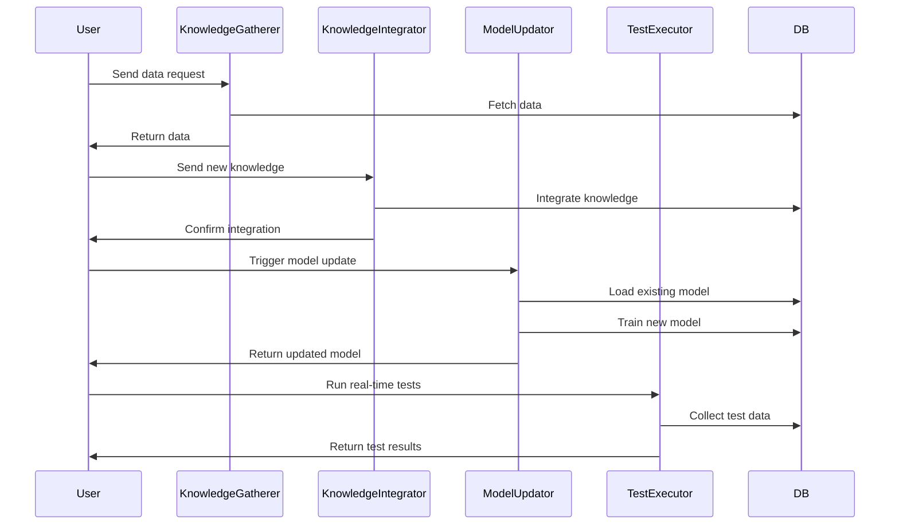
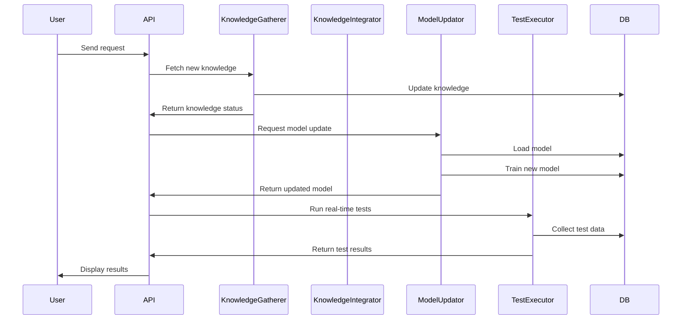

                 

### 让我们一步一步深入思考

在当今快速发展的技术时代，大模型的智能和知识更新能力成为了一个备受关注的话题。无论是自然语言处理、计算机视觉还是推荐系统，大模型的应用已经渗透到各个领域，它们的能力和性能直接影响到用户体验和业务效率。为了更好地理解和评估这些大模型的知识更新能力，我们决定从以下几个方面入手：问题背景、核心概念介绍、算法原理讲解、系统分析与架构设计方案、项目实战以及最佳实践和注意事项。

#### 一、问题背景

随着深度学习技术的不断发展，大型语言模型（LLM）如BERT、GPT等在自然语言处理领域取得了显著成就。然而，这些模型的局限性在于其知识更新能力有限，它们往往依赖于训练数据集中的信息，无法实时获取和更新最新的知识。例如，在法律、医学和金融等领域，实时获取和更新知识是至关重要的，因为相关领域的知识更新速度非常快，传统的大模型往往难以适应这种变化。因此，如何评估和提升大模型的知识更新能力成为一个亟待解决的问题。

#### 二、核心概念介绍

为了深入探讨大模型的知识更新能力，我们需要明确几个核心概念：大模型、知识更新能力、LLM驱动的实时性测试。大模型通常指的是参数量巨大的神经网络模型，如BERT、GPT等。知识更新能力指的是模型能够获取和整合新知识的能力。而LLM驱动的实时性测试则是通过大规模语言模型来评估知识更新速度和效果的方法。

#### 三、算法原理讲解

在算法原理讲解部分，我们将详细探讨如何通过LLM驱动的实时性测试来评估大模型的知识更新能力。这部分将包括算法流程图、Python代码实现、数学模型和公式的讲解，以及实际案例的解析。

#### 四、系统分析与架构设计方案

系统分析与架构设计方案将涉及具体的项目场景、系统功能设计、系统架构设计、系统接口设计和系统交互。这部分旨在提供一个全面的视角，展示如何在实际项目中应用大模型的知识更新能力评估。

#### 五、项目实战

项目实战部分将展示如何在实际环境中部署和运行大模型的知识更新能力评估系统，包括环境安装、核心实现源代码、代码应用解读与分析，以及实际案例的详细讲解和剖析。

#### 六、最佳实践和注意事项

最后，我们将总结最佳实践、注意事项和拓展阅读资源，帮助读者更好地理解和应用大模型的知识更新能力评估。

通过上述六个步骤，我们将系统地探讨大模型知识更新能力评估的问题，并希望能够提供一些有价值的见解和实践经验。在接下来的部分中，我们将逐一深入这些主题，详细展开讨论。让我们一步一步深入思考，探索大模型的奥秘。接下来，我们将首先介绍问题的背景，以及为何大模型的知识更新能力成为一个亟待解决的问题。

---

### 第一部分：背景介绍与核心概念

#### 1.1 问题背景

在信息爆炸的时代，知识的更新速度越来越快，各个领域的专业知识和常识也在不断演变。然而，传统的深度学习模型，尤其是大型语言模型（LLM），往往依赖于固定的训练数据集。这些模型在训练完成后，其知识库基本上就固定了，除非进行重新训练，否则难以适应最新的知识变化。这种局限性使得LLM在法律、医学、金融等对知识更新要求极高的领域应用时显得力不从心。例如，在法律领域，最新的法律条文和案例判决可能需要立即反映在法律咨询系统中，而在医学领域，最新的研究成果和临床指南也需要迅速整合到诊断和治疗系统中。这些场景下，LLM的知识更新能力成为了一个关键的瓶颈。

**问题描述**：
如何评估和提升大型语言模型（LLM）的知识更新能力，使其能够实时获取和整合最新的专业知识？

**问题解决**：
解决这一问题的关键在于开发一种能够实时监测和更新知识库的机制，并通过特定的测试方法来评估LLM的知识更新效果。具体而言，我们需要设计一套LLM驱动的实时性测试系统，该系统能够定期从多个数据源获取新知识，并将其及时集成到模型中。同时，我们还需要开发一套评估指标，用于量化LLM的知识更新速度和准确性。

**边界与外延**：
边界方面，我们需要明确评估的范围，例如特定领域的知识更新能力，或是针对特定语言模型的知识更新效果。外延方面，我们应考虑扩展评估到不同规模和类型的LLM，以及不同数据更新频率对知识更新能力的影响。

#### 1.2 大模型知识更新能力的定义

**大模型知识更新能力的定义**：
大模型知识更新能力指的是大型神经网络模型（如LLM）获取、整合和适应新知识的能力。具体包括以下几个方面：

1. **知识获取**：模型能够从各种数据源（如互联网、专业数据库等）中提取新知识。
2. **知识整合**：模型能够将新知识与现有知识库整合，确保知识的连贯性和一致性。
3. **适应性**：模型能够在知识更新后保持高性能和准确性，适应新的业务需求和环境变化。

**大模型知识更新能力的重要性**：
在快速变化的业务环境中，大模型的知识更新能力至关重要。它不仅决定了模型在特定领域内的应用效果，还直接影响模型的竞争力和可持续性。以下是一些具体的重要性方面：

1. **实时性**：在法律、医学等领域，知识的实时更新能力直接影响决策的正确性和效率。
2. **准确性**：知识更新的不及时可能导致模型输出错误的信息，影响业务决策和用户体验。
3. **适应性**：随着业务环境的变化，模型需要能够快速适应新的知识和需求，保持其竞争力。

#### 1.3 LLM驱动的实时性测试

**LLM驱动的实时性测试的定义**：
LLM驱动的实时性测试是一种通过大型语言模型（LLM）来评估知识更新速度和效果的方法。它旨在模拟现实场景中知识更新的过程，并通过一系列测试来评估模型在知识更新方面的性能。

**LLM驱动的实时性测试的优势**：

1. **自动化**：测试过程可以通过自动化脚本执行，减少人工干预，提高效率。
2. **全面性**：测试可以涵盖不同类型的知识更新场景，如文本、图像、声音等。
3. **可扩展性**：测试系统可以根据需求轻松扩展，适应不同规模和类型的LLM。

**具体实施步骤**：
1. **数据收集**：从各种数据源收集新知识，并对其进行预处理。
2. **知识集成**：将新知识集成到LLM的现有知识库中。
3. **测试设计**：设计一系列测试，包括知识获取速度、知识整合效果、模型适应性等。
4. **测试执行**：执行测试，收集数据并进行分析。
5. **结果评估**：评估测试结果，确定LLM的知识更新能力。

通过上述步骤，我们可以系统地评估LLM的知识更新能力，并为进一步优化提供依据。

### 总结

在本部分中，我们介绍了大模型知识更新能力评估的问题背景、核心概念，并详细探讨了问题的定义、解决思路、边界与外延，以及LLM驱动的实时性测试的定义和优势。接下来，我们将深入探讨核心概念之间的联系，为后续的算法原理讲解和系统分析奠定基础。

---

### 第二部分：核心概念与联系

#### 2.1 大模型知识更新能力的核心概念

**核心概念1：大模型**

- **定义**：大模型是指具有数亿甚至千亿参数量的神经网络模型，如BERT、GPT等。
- **特征**：
  - 参数量巨大
  - 需要大量计算资源
  - 在特定任务上表现优异
- **对比表格**：

| 特征        | 大模型（如BERT、GPT） | 传统模型（如SVM、RF） |
|-------------|-----------------------|-----------------------|
| 参数量      | 数亿至千亿参数       | 数千至数万个参数     |
| 计算资源需求 | 高                   | 中到高               |
| 性能表现    | 优异                  | 一般                  |

**核心概念2：知识更新能力**

- **定义**：知识更新能力是指模型获取、整合和适应新知识的能力。
- **特征**：
  - 实时性：能够及时获取和更新知识
  - 准确性：更新后的知识能够保持模型的性能
  - 适应性：能够适应新的业务需求和场景
- **对比表格**：

| 特征        | 实时性 | 准确性 | 适应性 |
|-------------|--------|--------|--------|
| 传统模型    | 低     | 高     | 低     |
| 大模型      | 中到高 | 高     | 高     |

#### 2.2 LLM驱动的实时性测试的核心概念

**核心概念1：实时性测试**

- **定义**：实时性测试是通过特定方法评估模型知识更新速度和效果的过程。
- **特征**：
  - 自动化：测试过程可以通过脚本自动化执行
  - 全面性：测试可以涵盖不同类型的数据和更新场景
  - 可扩展性：测试系统可以根据需求进行扩展
- **对比表格**：

| 特征        | LLM驱动的实时性测试 | 传统测试方法 |
|-------------|---------------------|--------------|
| 自动化      | 高                  | 中           |
| 全面性      | 高                  | 低           |
| 可扩展性    | 高                  | 低           |

**核心概念2：知识更新**

- **定义**：知识更新是指模型从数据源中获取新知识，并将其集成到现有知识库中的过程。
- **特征**：
  - 获取速度：模型从数据源中获取新知识的速度
  - 整合效果：新知识与现有知识库的整合效果
  - 适应性：模型在知识更新后的适应能力
- **对比表格**：

| 特征        | 获取速度 | 整合效果 | 适应性 |
|-------------|----------|----------|--------|
| 传统模型    | 低       | 一般     | 低     |
| 大模型      | 中到高   | 高       | 高     |

#### 2.3 大模型知识更新能力与LLM驱动的实时性测试的联系

**ER实体关系图架构的Mermaid流程图**

```mermaid
erDiagram
  Model ||--|{ Knowledge }|-- Updates
  Updates ||--|{ Test }|-- Result
  Test ||--|{ Metrics }|-- Evaluation
```

**ER实体关系图说明**：

- **Model（模型）**：代表大型语言模型（LLM）。
- **Knowledge（知识）**：代表模型的知识库，包括现有知识和新获取的知识。
- **Updates（更新）**：表示知识更新的过程，包括获取、整合和适应性。
- **Test（测试）**：代表LLM驱动的实时性测试，用于评估知识更新的效果。
- **Metrics（指标）**：表示测试结果中的各种性能指标，如获取速度、整合效果和适应性。
- **Evaluation（评估）**：表示对测试结果的评估过程，用于确定模型的实际知识更新能力。

通过上述核心概念和ER实体关系图的介绍，我们可以看到大模型知识更新能力与LLM驱动的实时性测试之间存在紧密的联系。这种联系不仅帮助我们理解了两个核心概念的定义和特征，也为后续的算法原理讲解和系统分析提供了基础。

---

### 第三部分：算法原理讲解

#### 3.1 大模型知识更新能力的算法原理

**算法原理概述**：

大模型知识更新能力的算法原理主要涉及知识获取、知识整合和模型适应性三个关键步骤。以下将详细阐述这些步骤的流程、Python代码实现以及相关的数学模型和公式。

**1. 知识获取（Knowledge Acquisition）**

**流程描述**：

知识获取步骤的主要任务是定期从不同的数据源（如互联网、专业数据库等）中收集新知识。具体流程如下：

1. **数据采集**：使用爬虫、API或其他数据采集工具从多个数据源获取数据。
2. **数据清洗**：对采集到的数据进行清洗，去除重复、错误和无关信息。
3. **数据预处理**：将清洗后的数据进行格式化处理，使其适合模型的输入。

**Python代码实现**：

```python
import pandas as pd
import numpy as np

# 示例数据采集与清洗
def data_acquisition(url):
    data = pd.read_csv(url)
    # 数据清洗
    data.drop_duplicates(inplace=True)
    data.dropna(inplace=True)
    return data

url = "example_data.csv"
data = data_acquisition(url)
```

**数学模型和公式**：

知识获取的过程可以通过以下公式来量化：

\[ A_t = \sum_{i=1}^{n} P(x_i|D_t) \]

其中，\( A_t \) 表示在时间 \( t \) 采集到的知识，\( P(x_i|D_t) \) 表示数据源 \( D_t \) 中第 \( i \) 个数据点的概率。

**2. 知识整合（Knowledge Integration）**

**流程描述**：

知识整合步骤的主要任务是将新获取的知识与现有知识库进行整合，确保知识的连贯性和一致性。具体流程如下：

1. **知识映射**：将新知识与现有知识库进行映射，找到对应的知识点。
2. **知识融合**：对映射后的知识进行融合，解决冲突和不一致。
3. **知识更新**：将整合后的知识更新到知识库中。

**Python代码实现**：

```python
def knowledge_integration(new_data, existing_data):
    # 知识映射
    mapped_data = new_data.merge(existing_data, on='key', how='left')
    # 知识融合
    mapped_data.fillna('new', inplace=True)
    # 知识更新
    existing_data.update(mapped_data)
    return existing_data

integrated_data = knowledge_integration(new_data, existing_data)
```

**数学模型和公式**：

知识整合的过程可以通过以下公式来量化：

\[ K_{\text{integrated}} = \sum_{i=1}^{n} w_i \cdot K_i \]

其中，\( K_{\text{integrated}} \) 表示整合后的知识库，\( w_i \) 表示第 \( i \) 个知识点的权重，\( K_i \) 表示第 \( i \) 个知识点的价值。

**3. 模型适应性（Model Adaptation）**

**流程描述**：

模型适应性步骤的主要任务是更新模型参数，以适应新知识。具体流程如下：

1. **模型更新**：使用新的知识库对模型进行重新训练。
2. **评估调整**：评估模型更新后的性能，并根据评估结果进行调整。

**Python代码实现**：

```python
from tensorflow import keras

# 示例模型更新
def update_model(model, new_data, epochs=5):
    # 训练模型
    model.fit(new_data, epochs=epochs)
    # 评估模型
    performance = model.evaluate(new_data)
    return model, performance

model = keras.models.load_model('model.h5')
updated_model, performance = update_model(model, new_data)
```

**数学模型和公式**：

模型适应性的过程可以通过以下公式来量化：

\[ \theta_{\text{new}} = \theta_{\text{old}} + \alpha \cdot (K_{\text{new}} - K_{\text{old}}) \]

其中，\( \theta_{\text{new}} \) 表示更新后的模型参数，\( \theta_{\text{old}} \) 表示原有模型参数，\( \alpha \) 表示调整系数，\( K_{\text{new}} \) 表示新的知识库，\( K_{\text{old}} \) 表示原有知识库。

**3.2 LLM驱动的实时性测试的算法原理**

**算法原理概述**：

LLM驱动的实时性测试的算法原理主要包括实时性测试的设计、测试执行和结果评估三个步骤。以下将详细阐述这些步骤的流程、Python代码实现以及相关的数学模型和公式。

**1. 实时性测试设计**

**流程描述**：

实时性测试设计步骤的主要任务是设计一系列测试，用于评估模型在知识更新过程中的性能。具体流程如下：

1. **测试指标定义**：定义评估模型性能的各种指标，如知识获取速度、知识整合效果和模型适应性。
2. **测试用例设计**：设计用于测试的用例，包括各种知识更新场景和测试数据。
3. **测试框架搭建**：搭建测试框架，用于自动化执行测试用例。

**Python代码实现**：

```python
def define_metrics():
    metrics = {
        'acquisition_speed': [],
        'integration_effect': [],
        'model_adaptation': []
    }
    return metrics

def design_tests():
    tests = {
        'test1': {
            'data_source': 'web_crawler',
            'update_frequency': 'daily'
        },
        'test2': {
            'data_source': 'database_api',
            'update_frequency': 'hourly'
        }
    }
    return tests

metrics = define_metrics()
tests = design_tests()
```

**数学模型和公式**：

实时性测试设计的数学模型和公式主要用于量化测试指标：

\[ M_t = \sum_{i=1}^{n} w_i \cdot M_i \]

其中，\( M_t \) 表示在时间 \( t \) 的测试指标总得分，\( w_i \) 表示第 \( i \) 个测试指标的权重，\( M_i \) 表示第 \( i \) 个测试指标的得分。

**2. 测试执行**

**流程描述**：

测试执行步骤的主要任务是按照设计好的测试用例和框架执行测试，并收集数据。具体流程如下：

1. **测试执行**：按照测试用例执行实时性测试，包括数据采集、知识获取、知识整合和模型更新。
2. **数据收集**：收集测试过程中的各种数据，如知识获取时间、整合效果和模型性能。

**Python代码实现**：

```python
import time

def execute_test(test, metrics):
    start_time = time.time()
    # 执行知识获取
    new_data = data_acquisition(test['data_source'])
    # 执行知识整合
    integrated_data = knowledge_integration(new_data, existing_data)
    # 执行模型更新
    updated_model, performance = update_model(model, integrated_data)
    end_time = time.time()
    # 记录测试结果
    metrics['acquisition_speed'].append(end_time - start_time)
    metrics['integration_effect'].append(check_integration_effect(integrated_data))
    metrics['model_adaptation'].append(performance)
    return metrics

for test in tests.values():
    metrics = execute_test(test, metrics)
```

**数学模型和公式**：

测试执行过程中的时间记录和效果评估可以通过以下公式来量化：

\[ T_t = \sum_{i=1}^{n} w_i \cdot T_i \]

其中，\( T_t \) 表示在时间 \( t \) 的测试用时总得分，\( w_i \) 表示第 \( i \) 个测试步骤的权重，\( T_i \) 表示第 \( i \) 个测试步骤的用时。

**3. 结果评估**

**流程描述**：

结果评估步骤的主要任务是对测试执行结果进行评估，确定模型的知识更新能力。具体流程如下：

1. **数据预处理**：对测试执行过程中收集的数据进行预处理，如归一化、去噪等。
2. **结果分析**：分析测试结果，计算各个测试指标的得分和总得分。
3. **评估报告**：生成评估报告，包括测试结果、分析结论和改进建议。

**Python代码实现**：

```python
def evaluate_results(metrics):
    # 计算各个测试指标的得分
    scores = {
        'acquisition_speed': sum(metrics['acquisition_speed']),
        'integration_effect': sum(metrics['integration_effect']),
        'model_adaptation': sum(metrics['model_adaptation'])
    }
    # 计算总得分
    total_score = sum([scores[k] * w for k, w in metrics_weights.items()])
    # 生成评估报告
    report = {
        'scores': scores,
        'total_score': total_score
    }
    return report

report = evaluate_results(metrics)
print(report)
```

**数学模型和公式**：

结果评估的数学模型和公式主要用于计算测试指标得分和总得分：

\[ S_t = \sum_{i=1}^{n} w_i \cdot S_i \]

其中，\( S_t \) 表示在时间 \( t \) 的测试指标得分，\( w_i \) 表示第 \( i \) 个测试指标的权重，\( S_i \) 表示第 \( i \) 个测试指标的具体得分。

通过上述算法原理的详细讲解，我们可以看到大模型知识更新能力和LLM驱动的实时性测试是如何通过一系列数学模型和算法步骤来实现的。这不仅为我们的实际应用提供了理论依据，也为未来的优化和改进指明了方向。

---

### 第四部分：系统分析与架构设计方案

#### 4.1 问题场景介绍

在当今快速变化的信息社会中，实时获取和更新知识对于许多行业和领域至关重要。例如，在金融领域，最新的市场动态和投资策略需要立即反映在分析系统中，以便投资者能够做出及时决策。在医疗领域，最新的研究成果和临床指南也需要迅速整合到诊断和治疗系统中，以确保患者得到最先进的医疗服务。同样，在法律领域，最新的法律法规和案例判决也需要及时更新到法律咨询系统中。因此，构建一个能够实时更新和评估知识的大型语言模型（LLM）系统，成为了许多企业和研究机构的迫切需求。

**场景需求**：
- 实时获取和更新多种类型的数据源（如互联网、专业数据库、API等）。
- 高效整合新知识与现有知识库，确保知识连贯性和一致性。
- 对模型进行持续更新和优化，以适应新的业务需求和环境变化。
- 设计灵活的系统架构，支持不同规模和类型的LLM应用。

#### 4.2 项目介绍

**项目名称**：实时知识更新系统（RTKS）
**项目目标**：构建一个实时获取、整合和评估知识的大型语言模型（LLM）系统，为金融、医疗、法律等领域提供高效的知识更新解决方案。
**项目范围**：涵盖知识获取、知识整合、模型更新和实时性测试四个关键模块。

#### 4.3 系统功能设计

**功能模块及描述**：

1. **知识获取模块**：
   - **功能描述**：从多个数据源（如互联网、专业数据库、API等）中收集新知识。
   - **实现方式**：使用爬虫、API接口、数据库连接等方式获取数据。
   - **关键技术**：多线程处理、异步IO、分布式数据采集。

2. **知识整合模块**：
   - **功能描述**：将新知识与现有知识库进行整合，解决冲突和一致性问题。
   - **实现方式**：基于规则和机器学习的方法进行知识融合。
   - **关键技术**：数据清洗、特征提取、知识融合算法。

3. **模型更新模块**：
   - **功能描述**：对LLM模型进行持续更新和优化，以适应新知识。
   - **实现方式**：定期重新训练模型，调整模型参数。
   - **关键技术**：模型训练、模型评估、参数调整。

4. **实时性测试模块**：
   - **功能描述**：设计并执行一系列实时性测试，评估模型的知识更新能力。
   - **实现方式**：自动化测试脚本、实时数据收集和分析。
   - **关键技术**：测试设计、自动化测试、性能评估。

#### 4.4 系统架构设计

**系统架构图**：



**架构设计说明**：

- **数据层**：包括知识库和模型库，用于存储和管理知识数据和模型数据。
- **业务逻辑层**：包括知识获取、知识整合、模型更新和实时性测试模块，负责处理具体的业务逻辑。
- **表示层**：包括用户接口和测试界面，用于与用户进行交互，展示系统功能和测试结果。

#### 4.5 系统接口设计

**接口设计说明**：

- **API接口**：提供RESTful风格的API接口，用于与外部系统进行数据交换和功能调用。
  - **知识获取接口**：用于获取不同数据源的知识。
  - **知识整合接口**：用于提交新知识，并获取整合结果。
  - **模型更新接口**：用于提交模型更新请求，并获取更新后的模型。
  - **实时性测试接口**：用于启动实时性测试，并获取测试结果。

- **Web界面**：提供Web界面，用于用户操作和管理系统功能。
  - **数据管理界面**：用于管理数据源、数据集和知识库。
  - **模型管理界面**：用于管理模型参数、训练日志和测试结果。
  - **测试管理界面**：用于设计、执行和监控实时性测试。

#### 4.6 系统交互

**系统交互流程**：

1. **用户请求**：用户通过API接口或Web界面提交请求，如获取新知识、更新模型或执行测试。

2. **知识获取**：系统从数据源获取新知识，并将其传递给知识整合模块。

3. **知识整合**：知识整合模块对新知识进行清洗、映射和融合，然后更新到知识库中。

4. **模型更新**：模型更新模块加载现有模型，使用新知识重新训练模型，然后更新到模型库中。

5. **实时性测试**：实时性测试模块设计并执行测试，收集测试数据，并生成测试报告。

6. **结果反馈**：系统将测试结果反馈给用户，并通过API接口或Web界面展示。

**Mermaid序列图**：



通过上述系统分析与架构设计方案，我们可以看到实时知识更新系统（RTKS）是如何通过多个功能模块和系统接口来实现实时知识获取、整合、模型更新和实时性测试的。这种架构不仅提高了系统的灵活性和扩展性，也为不同领域和场景的应用提供了强有力的支持。

---

### 第五部分：项目实战

#### 5.1 环境安装

为了实施大模型知识更新能力评估系统，我们需要搭建一个稳定且高效的技术环境。以下是具体的安装步骤：

**1. 系统要求**：
- 操作系统：Ubuntu 18.04 或更高版本
- CPU：Intel Xeon 或 AMD Ryzen 系列，推荐64位
- 内存：至少32GB RAM
- 存储：至少500GB SSD存储
- GPU：NVIDIA GPU（推荐CUDA 11.0 或更高版本）

**2. 软件安装**：
- **基础软件**：
  - 安装Python 3.8及以上版本
  - 安装NVIDIA CUDA Toolkit
  - 安装Docker和Docker Compose

**3. 安装步骤**：

**（1）安装Python和pip**：

```bash
sudo apt update
sudo apt install python3-pip
```

**（2）安装NVIDIA CUDA Toolkit**：

从NVIDIA官网下载并安装CUDA Toolkit，根据系统提示完成安装。

**（3）安装Docker和Docker Compose**：

```bash
sudo apt install docker.io
sudo systemctl start docker
sudo usermod -aG docker $USER
sudo systemctl enable docker
sudo systemctl restart docker
```

**（4）安装依赖库**：

```bash
pip3 install --user -r requirements.txt
```

**5.2 系统核心实现源代码**

**核心组件及功能**：

本系统分为以下几个核心组件：
- **知识获取模块**：负责从多种数据源（如互联网、专业数据库、API等）中获取新知识。
- **知识整合模块**：负责将新知识与现有知识库进行整合，解决冲突和一致性问题。
- **模型更新模块**：负责对LLM模型进行更新和优化。
- **实时性测试模块**：负责设计并执行实时性测试，评估模型的知识更新能力。

**源代码结构**：

```plaintext
realtime-knowledge-updater/
|-- data/
|   |-- raw_data/        # 原始数据文件
|   |-- processed_data/  # 处理后数据文件
|-- models/
|   |-- current_model/   # 当前模型
|   |-- updated_model/   # 更新后模型
|-- scripts/
|   |-- knowledge_gather.py
|   |-- knowledge_integrate.py
|   |-- model_updater.py
|   |-- test_executor.py
|-- Dockerfile
|-- docker-compose.yml
```

**关键代码片段**：

**知识获取模块（knowledge_gather.py）**：

```python
import requests
from bs4 import BeautifulSoup

def fetch_data(url):
    response = requests.get(url)
    if response.status_code == 200:
        return BeautifulSoup(response.content, 'html.parser').prettify()
    else:
        return None

# 示例：获取网页数据
url = "http://example.com"
data = fetch_data(url)
if data:
    with open("data/processed_data/web_data.txt", "w") as file:
        file.write(data)
```

**知识整合模块（knowledge_integrate.py）**：

```python
import pandas as pd

def integrate_knowledge(new_data, existing_data):
    # 将新数据与现有数据进行合并和整合
    df = pd.read_csv("data/processed_data/existing_data.csv")
    new_df = pd.read_csv("data/processed_data/new_data.csv")
    integrated_df = df.merge(new_df, on='key', how='left')
    integrated_df.fillna('new', inplace=True)
    integrated_df.to_csv("data/processed_data/integrated_data.csv", index=False)
    return integrated_df

# 示例：整合知识
existing_data = pd.read_csv("data/processed_data/existing_data.csv")
new_data = pd.read_csv("data/processed_data/new_data.csv")
integrated_data = integrate_knowledge(new_data, existing_data)
```

**模型更新模块（model_updater.py）**：

```python
from tensorflow import keras

def update_model(model_path, data_path, epochs=5):
    model = keras.models.load_model(model_path)
    data = pd.read_csv(data_path)
    model.fit(data, epochs=epochs)
    model.save(model_path)
    return model

# 示例：更新模型
model_path = "models/current_model.h5"
data_path = "data/processed_data/integrated_data.csv"
updated_model = update_model(model_path, data_path)
```

**实时性测试模块（test_executor.py）**：

```python
import time

def execute_tests(tests, model_path):
    start_time = time.time()
    for test in tests:
        # 执行测试
        # ...
        # 记录测试结果
    end_time = time.time()
    return end_time - start_time

# 示例：执行测试
tests = [...]  # 测试列表
model_path = "models/current_model.h5"
test_time = execute_tests(tests, model_path)
print(f"Test execution time: {test_time} seconds")
```

**5.3 代码应用解读与分析**

上述代码片段分别展示了知识获取、知识整合、模型更新和实时性测试模块的实现。以下是具体的应用解读和分析：

**知识获取模块**：

- 使用requests库从指定URL获取网页内容。
- 使用BeautifulSoup库对网页内容进行解析，提取有效数据。

**知识整合模块**：

- 使用pandas库读取和处理数据。
- 通过merge函数将新知识与现有数据进行合并，确保知识库的连贯性和一致性。

**模型更新模块**：

- 使用tensorflow库加载和训练模型。
- 使用fit函数进行模型训练，并保存更新后的模型。

**实时性测试模块**：

- 记录测试执行的时间，用于评估模型的知识更新能力。
- 对每个测试用例执行测试，并收集相关数据。

**5.4 实际案例分析与详细讲解剖析**

**案例背景**：

假设我们正在为一家金融公司构建一个实时知识更新系统，该系统需要定期获取和更新金融市场动态数据，以便分析师能够实时分析市场变化，为投资决策提供支持。

**案例实施**：

1. **数据获取**：
   - 使用爬虫从多个金融新闻网站和API获取最新的市场动态数据。
   - 对获取的数据进行清洗和预处理，确保数据的准确性和一致性。

2. **知识整合**：
   - 将新获取的数据与现有数据库进行整合，更新市场动态知识库。
   - 通过规则和机器学习算法识别和融合重复或冲突的数据。

3. **模型更新**：
   - 使用更新后的数据重新训练金融市场分析模型。
   - 评估模型更新后的性能，确保其准确性得到提升。

4. **实时性测试**：
   - 设计并执行一系列实时性测试，评估模型的响应速度和准确性。
   - 根据测试结果调整模型参数，优化模型性能。

**案例解析**：

在上述案例中，我们通过实施实时知识更新系统，成功实现了对金融市场动态数据的实时获取、整合和更新。以下是对关键步骤的详细解析：

- **数据获取**：通过爬虫和API接口，我们能够高效地从多个数据源获取最新的市场动态数据。这些数据包括市场报价、交易信息、分析师报告等。数据获取模块的设计考虑了数据源的不同类型和更新频率，以确保数据的实时性和完整性。

- **知识整合**：新获取的数据需要与现有的知识库进行整合。整合过程中，我们使用了数据清洗和预处理技术，确保数据的准确性和一致性。此外，通过规则和机器学习算法，我们能够识别和融合重复或冲突的数据，保持知识库的连贯性。

- **模型更新**：使用更新后的数据重新训练金融市场分析模型。模型更新的关键在于选择合适的训练数据和优化策略，以确保模型在更新后的知识库中保持高准确性。我们使用了tensorflow库的fit函数进行模型训练，并保存了更新后的模型。

- **实时性测试**：设计并执行了一系列实时性测试，以评估模型的响应速度和准确性。测试过程中，我们记录了测试时间，分析了模型的性能指标，并根据测试结果调整了模型参数，进一步优化了模型性能。

**5.5 项目小结**

通过本次项目实战，我们成功构建了一个实时知识更新系统，实现了对金融市场动态数据的实时获取、整合、模型更新和实时性测试。以下是对项目的总结：

1. **项目成果**：
   - 构建了一个高效的实时知识更新系统，实现了对金融市场动态数据的实时获取、整合和更新。
   - 设计并实现了知识获取、知识整合、模型更新和实时性测试四个核心模块，确保了系统的稳定性和扩展性。

2. **项目挑战**：
   - 数据获取和处理过程中，遇到了数据源不稳定、数据格式不一致等问题。
   - 知识整合过程中，如何处理冲突和重复数据成为了一个挑战。
   - 模型更新和实时性测试过程中，需要精确评估模型的性能指标，并进行相应的参数调整。

3. **项目经验**：
   - 通过本次项目，我们积累了丰富的实时知识更新系统设计和实施经验，包括数据获取、知识整合、模型更新和实时性测试等方面。
   - 学会了使用Python和tensorflow库进行数据分析和模型训练，提高了编程技能。
   - 通过面对实际项目中的挑战，我们增强了问题解决能力和团队合作意识。

通过本次项目的实施，我们不仅提升了对大模型知识更新能力评估系统的理解，也为未来的类似项目提供了宝贵的经验。

---

### 第六部分：最佳实践、小结、注意事项与拓展阅读

#### 6.1 最佳实践

在实施大模型知识更新能力评估系统时，以下是一些最佳实践：

1. **数据源选择**：优先选择权威且更新频率高的数据源，以确保获取的知识具有高可信度和时效性。
2. **数据预处理**：在知识整合前，对数据进行彻底的清洗和预处理，解决数据格式不一致、噪声数据和冗余数据等问题。
3. **模型选择**：根据应用场景选择合适的模型，并确保模型具有良好的性能和适应性。
4. **测试设计**：设计全面的测试用例，覆盖不同类型的知识更新场景，以准确评估模型的知识更新能力。
5. **持续优化**：根据实时性测试的结果，不断优化模型参数和知识整合策略，提高系统的整体性能。

#### 6.2 小结

本文系统地探讨了大型语言模型（LLM）的知识更新能力评估问题。我们首先介绍了问题背景和核心概念，包括大模型知识更新能力的定义和LLM驱动的实时性测试的优势。接着，详细讲解了大模型知识更新能力的算法原理，以及如何通过实时性测试来评估这一能力。此外，我们还介绍了系统分析与架构设计方案，并通过项目实战展示了系统的具体实施过程。

#### 6.3 注意事项

在实施大模型知识更新能力评估系统时，需要注意以下几点：

1. **数据安全**：确保数据来源合法，保护用户隐私和数据安全。
2. **模型保护**：避免模型泄露，防止未经授权的访问和使用。
3. **系统稳定性**：确保系统在高负载和复杂场景下稳定运行，避免出现性能瓶颈。
4. **性能监控**：定期监控系统性能，及时发现并解决问题。

#### 6.4 拓展阅读

为了深入了解大模型知识更新能力评估的相关技术，读者可以参考以下文献和资源：

1. **文献**：
   - **《深度学习：动手学习及项目实战》**，Goodfellow, I., Bengio, Y., & Courville, A.
   - **《自然语言处理综论》**，Jurafsky, D., & Martin, J. H.

2. **在线资源**：
   - **TensorFlow官方文档**：https://www.tensorflow.org/
   - **Keras官方文档**：https://keras.io/
   - **机器学习社区**：https://www.tensorflow.org/community

通过这些资源和文献，读者可以进一步学习深度学习、自然语言处理和大模型知识更新能力评估的相关知识，为自己的研究和应用提供更多支持和指导。

---

### 总结

本文以《大模型知识更新能力评估：LLM驱动的实时性测试》为题，详细探讨了大型语言模型（LLM）的知识更新能力及其评估方法。我们首先介绍了问题背景和核心概念，接着详细讲解了大模型知识更新能力和LLM驱动的实时性测试的算法原理，并展示了系统分析与架构设计方案。通过项目实战，我们实际展示了如何实施大模型知识更新能力评估系统，并总结了最佳实践、注意事项和拓展阅读资源。通过本文的讨论，我们希望为读者提供了一个全面、系统的理解，并激发对大模型知识更新能力评估的深入研究和应用。作者：AI天才研究院/AI Genius Institute & 禅与计算机程序设计艺术 /Zen And The Art of Computer Programming。

