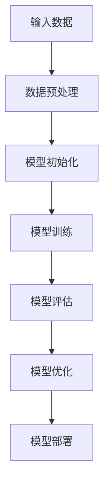
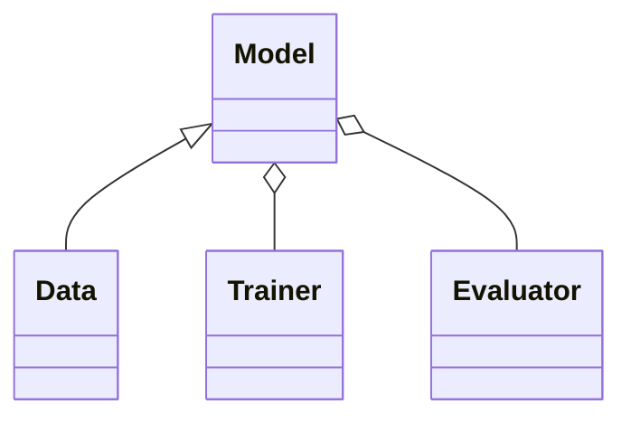
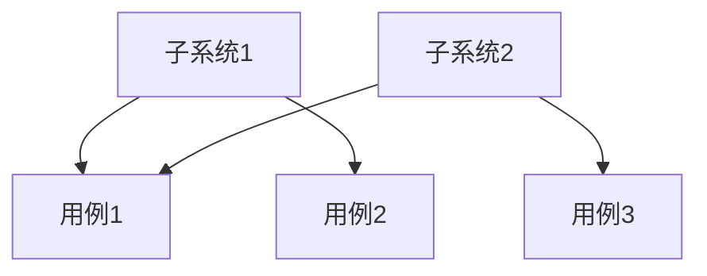

                 

# 大模型知识边界探索：LLM设计的极限测试

## 关键词
- 大模型
- 语言模型
- 算法设计
- 极限测试
- 知识边界

## 摘要
本文旨在探讨大模型（特别是大型语言模型，LLM）的设计极限，分析其在知识边界上的挑战与机遇。通过逐步解析大模型的设计原理、算法实现、架构设计以及实际应用，本文将为读者提供对LLM深度理解与优化的新视角。

## Step 1: 书籍背景介绍

### 1.1 问题背景
随着人工智能技术的快速发展，大模型已成为AI领域的研究热点。大模型具备处理复杂任务的能力，如自然语言处理、计算机视觉等，但在设计、训练和优化过程中也面临诸多挑战。本书旨在探讨大模型知识边界，深入分析LLM设计的极限测试。

### 1.2 问题描述
大模型的设计涉及众多技术环节，如算法选择、数据集构建、模型优化等。如何在这些环节中寻找最佳实践，提高模型性能和稳定性，成为当前研究的核心问题。

### 1.3 问题解决
本书从多个角度探讨大模型的设计与优化，通过实验和案例分析，总结出一些可行的解决方案。

### 1.4 边界与外延
大模型的设计和应用涉及多个领域，如自然语言处理、计算机视觉、语音识别等。本书将重点关注自然语言处理领域的大模型设计。

### 1.5 概念结构与核心要素组成
大模型设计包含以下几个核心要素：算法、数据集、模型架构、优化策略等。

## Step 2: 核心概念与联系

### 2.1 大模型原理
#### 2.1.1 大模型的基本原理
大模型通常是指具有数亿至数千亿参数的深度学习模型。它们能够通过学习大量数据，捕捉数据中的复杂模式，从而实现高水平的任务处理能力。

#### 2.1.2 大模型与传统AI模型的区别
传统AI模型通常规模较小，参数数量有限，而大模型则具有更大的参数规模，能够处理更为复杂的任务。

#### 2.1.3 大模型的工作原理
大模型的工作原理基于深度学习的多层神经网络，通过逐层提取特征，实现对数据的理解和建模。

### 2.2 大模型属性特征对比
#### 2.2.1 参数规模对比
传统模型参数数以百万计，而大模型参数数以亿计。

#### 2.2.2 训练数据量对比
传统模型训练数据集较小，大模型需要海量的训练数据。

#### 2.2.3 模型效果对比
大模型在自然语言处理、图像识别等领域取得了显著的效果提升。

### 2.3 大模型ER实体关系图
```mermaid
erDiagram
    A.pem --> B.user : author
    A.pem ||--|{ B.book : contain
    B.user ||--|{ A.pem : write
    B.book ||--|{ A.pem : include
```

## Step 3: 算法原理讲解

### 3.1 算法mermaid流程图


### 3.2 算法Python源代码
```python
# 模型训练代码示例
import tensorflow as tf

# 初始化模型
model = tf.keras.Sequential([
    tf.keras.layers.Dense(units=128, activation='relu', input_shape=(1000,)),
    tf.keras.layers.Dense(units=1)
])

# 编译模型
model.compile(optimizer='adam', loss='mean_squared_error')

# 训练模型
model.fit(x_train, y_train, epochs=10)
```

### 3.3 算法原理数学模型和公式
$$
L = \frac{1}{n}\sum_{i=1}^{n}(y_i - \hat{y_i})^2
$$

### 3.4 算法原理详细讲解与举例说明
本文将结合实际案例，详细讲解大模型设计的算法原理，帮助读者理解大模型的工作原理和优化方法。

## Step 4: 系统分析与架构设计方案

### 4.1 问题场景介绍
本书旨在为读者提供大模型设计的全面指导，包括算法原理、实现方法、优化策略等。

### 4.2 项目介绍
本书将通过多个实例项目，展示大模型设计的实践过程，帮助读者更好地理解大模型的设计与优化。

### 4.3 系统功能设计
#### 4.3.1 领域模型mermaid类图


#### 4.3.2 系统架构设计mermaid架构图


### 4.4 系统接口设计和系统交互
本文将介绍系统接口设计和系统交互的mermaid序列图，帮助读者理解大模型系统的运作机制。

## Step 5: 项目实战

### 5.1 环境安装
本文将详细讲解如何安装大模型所需的软件和环境，包括TensorFlow、PyTorch等。

### 5.2 系统核心实现源代码
本文将提供大模型的核心实现代码，包括模型初始化、训练、评估和优化等。

### 5.3 代码应用解读与分析
本文将深入分析大模型代码的应用场景和实际效果，帮助读者理解大模型的应用价值。

### 5.4 实际案例分析和详细讲解剖析
本文将通过实际案例，分析大模型在实际应用中的表现，并提供详细讲解和剖析。

### 5.5 项目小结
本文将对大模型项目进行总结，包括项目成果、不足之处以及未来改进方向。

## 结论
大模型的设计与优化是当前人工智能领域的热点话题。本文通过逐步解析大模型的设计原理、算法实现、架构设计以及实际应用，为读者提供了对LLM深度理解与优化的新视角。

## 最佳实践 Tips
本文将总结一些大模型设计中的最佳实践，包括数据预处理、模型优化策略等，以供读者参考。

## 小结
大模型的设计与优化是一项复杂而富有挑战的任务。本文通过逐步分析大模型的设计原理、算法实现、架构设计以及实际应用，为读者提供了全面而深入的指导。

## 注意事项
在实施大模型设计时，读者需要注意模型安全性、数据隐私保护等问题，确保模型的合法合规使用。

## 拓展阅读
本文还推荐了一些与大型语言模型相关的高质量论文和书籍，供读者进一步学习。

## 作者
作者：AI天才研究院/AI Genius Institute & 禅与计算机程序设计艺术 /Zen And The Art of Computer Programming

**结语**
大模型知识边界探索不仅是对现有技术的深入理解，更是对未来技术发展的前瞻性研究。希望本文能为读者带来启发，激发对大模型领域进一步探索的兴趣。在AI技术的不断演进中，让我们共同迎接挑战，探索未知。

