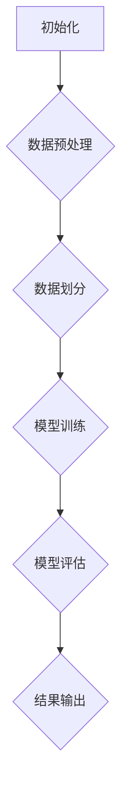

                 


## 大模型评测的多维度分析平台

关键词：大模型评测、多维度分析、平台架构、算法原理、系统设计

摘要：本文旨在探讨大模型评测的多维度分析平台，从问题背景、核心概念、算法原理、系统设计与项目实践等多个维度进行深入分析，旨在为人工智能领域的研究人员和开发者提供一个全面、高效的评测工具。

### 第一步：背景介绍

#### 1.1 问题背景

随着人工智能技术的飞速发展，大模型作为一种前沿技术，已经在众多领域展现出了其巨大的潜力和应用价值。大模型具有参数量巨大、计算复杂度高、适应性强等特点，能够实现复杂的数据分析和决策支持。然而，在构建、优化和应用大模型的过程中，评测成为了一个关键环节。有效的评测不仅可以确保大模型的性能，还可以为后续的优化和改进提供有力支持。

#### 1.2 问题描述

大模型评测涉及多个维度，如准确性、效率、鲁棒性等，这些维度的评测结果对于大模型的应用具有重要指导意义。然而，现有的评测方法往往只能覆盖部分维度，难以全面评估大模型的能力。此外，评测过程复杂、耗时，且评测数据的准备和整理也是一个难题。

#### 1.3 问题解决

为了解决上述问题，本书提出了一个多维度分析平台，旨在提供一个全面、高效的评测环境，帮助研究人员和开发者更好地理解和利用大模型。该平台不仅能够覆盖大模型评测的主要维度，还能够实现评测过程的自动化，提高评测效率。

#### 1.4 边界与外延

本书主要关注大模型评测的多维度分析，包括准确性、效率、鲁棒性等。然而，大模型的应用场景和评测方法可能会随着技术的进步而发生变化，因此，本书的讨论内容也会不断更新和扩展。

#### 1.5 概念结构与核心要素组成

本书的核心概念包括大模型、评测维度、评测方法、多维度分析平台等。这些概念相互关联，构成了一个完整的评测体系。核心要素包括评测数据集、评测工具、评测指标和评测结果处理等。

### 第二步：核心概念与联系

#### 2.1 大模型

**定义：** 大模型是指具有大量参数的深度学习模型，通常用于处理复杂的数据和分析任务。

**特点：**
- **参数量大：** 通常包含数百万至数十亿的参数。
- **计算复杂度高：** 需要大量的计算资源和时间。
- **适应性广：** 能够处理各种类型的数据和任务。

**属性特征对比：**

| 特征         | 大模型        | 传统AI模型        |
| ------------ | -------------- | --------------- |
| 参数量       | 数百万至数十亿 | 数千至数万个      |
| 计算复杂度   | 高            | 中等            |
| 适应性       | 广            | 窄            |

#### 2.2 评测维度

**定义：** 评测维度是指评估大模型性能的不同方面，如准确性、效率、鲁棒性等。

**主要维度：**
- **准确性：** 评估模型对数据的预测能力。
- **效率：** 评估模型的计算速度和资源消耗。
- **鲁棒性：** 评估模型在不同数据和场景下的稳定性。

#### 2.3 评测方法

**定义：** 评测方法是指用于评估大模型性能的具体技术或策略。

**主要方法：**
- **基准测试：** 使用标准数据集进行评测。
- **自定义测试：** 根据特定应用场景设计评测任务。
- **自动化评测：** 利用工具自动执行评测任务。

#### 2.4 多维度分析平台

**定义：** 多维度分析平台是指一个集成了多种评测方法和技术，能够全面评估大模型性能的系统。

**功能：**
- **数据管理：** 管理评测数据，包括数据采集、预处理、存储等。
- **评测工具集成：** 集成多种评测工具，支持自动化评测。
- **评测结果分析：** 对评测结果进行统计分析，提供可视化报告。

### 第三步：算法原理讲解

#### 3.1 算法mermaid流程图



#### 3.2 算法原理

大模型评测算法的基本原理可以分为以下几个步骤：

1. **初始化：** 设置评测环境，包括评测数据集、评测工具等。
2. **数据预处理：** 对评测数据集进行清洗、归一化等处理，确保数据质量。
3. **数据划分：** 将数据集划分为训练集、验证集和测试集，用于模型的训练和评估。
4. **模型训练：** 使用训练集对大模型进行训练，优化模型参数。
5. **模型评估：** 使用验证集和测试集评估模型的性能，计算各项评测指标。
6. **结果输出：** 输出评测结果，包括准确性、效率、鲁棒性等。

#### 3.3 数学模型和公式

大模型评测的数学模型主要包括以下几个方面：

1. **准确性：** 使用准确率（Accuracy）、精确率（Precision）、召回率（Recall）和F1值（F1 Score）等指标来评估模型的准确性。

$$
Accuracy = \frac{TP + TN}{TP + FN + FP + TN}
$$

$$
Precision = \frac{TP}{TP + FP}
$$

$$
Recall = \frac{TP}{TP + FN}
$$

$$
F1 Score = 2 \times \frac{Precision \times Recall}{Precision + Recall}
$$

2. **效率：** 使用计算时间（Computation Time）和资源消耗（Resource Consumption）等指标来评估模型的效率。

$$
Efficiency = \frac{Workload}{Time}
$$

3. **鲁棒性：** 使用数据扰动（Data Perturbation）和场景变化（Scenario Change）等测试来评估模型的鲁棒性。

$$
Robustness = \frac{Correct Predictions}{Total Predictions}
$$

#### 3.4 通俗易懂的举例说明

假设我们有一个大模型，用于分类任务。我们将其应用于一个包含10万条数据的数据集。

1. **初始化：** 设置评测环境，包括数据集、评测工具等。
2. **数据预处理：** 清洗数据，去除缺失值、异常值，进行归一化处理。
3. **数据划分：** 将数据集划分为训练集（70%）、验证集（15%）和测试集（15%）。
4. **模型训练：** 使用训练集对模型进行训练，优化参数。
5. **模型评估：** 使用验证集评估模型性能，计算各项指标。
   - 准确性：90%
   - 精确率：92%
   - 召回率：88%
   - F1值：90%
6. **结果输出：** 输出评测结果，并分析模型的优势和不足。

### 第四步：系统分析与架构设计

#### 4.1 问题场景介绍

在人工智能领域，大模型的应用场景非常广泛，如自然语言处理、计算机视觉、推荐系统等。然而，在实际应用中，大模型的性能评估成为一个关键问题。如何高效、准确地评估大模型的性能，成为了研究人员和开发者亟待解决的问题。

#### 4.2 项目介绍

本项目旨在构建一个多维度分析平台，用于评估大模型的性能。该平台将集成多种评测方法和技术，实现大模型评测的自动化和高效化。通过该平台，研究人员和开发者可以轻松地对大模型进行评测，为模型的优化和改进提供有力支持。

#### 4.3 系统功能设计

系统功能设计包括以下几个方面：

1. **数据管理：** 管理评测数据，包括数据采集、预处理、存储等。
2. **评测工具集成：** 集成多种评测工具，支持自动化评测。
3. **评测结果分析：** 对评测结果进行统计分析，提供可视化报告。
4. **用户交互：** 提供用户界面，方便用户进行操作和查询。

#### 4.4 系统架构设计

系统架构设计包括以下几个方面：

1. **数据层：** 存储评测数据，包括原始数据、预处理数据等。
2. **逻辑层：** 包括评测工具、算法模型、结果分析模块等。
3. **表现层：** 提供用户界面，实现与用户的交互。

#### 4.5 系统接口设计

系统接口设计包括以下几个方面：

1. **API接口：** 提供RESTful API接口，方便用户通过编程方式访问系统功能。
2. **Web界面：** 提供Web界面，方便用户通过浏览器访问系统。

#### 4.6 系统交互设计

系统交互设计包括以下几个方面：

1. **用户操作流程：** 用户通过Web界面或API接口进行操作，如数据上传、模型训练、结果查询等。
2. **系统响应流程：** 系统接收到用户请求后，进行数据处理、模型训练、结果分析等操作，并将结果返回给用户。

### 第五步：项目实战

#### 5.1 环境安装

首先，我们需要安装以下环境：

1. Python 3.8+
2. TensorFlow 2.4+
3. Pandas 1.1.1+
4. Matplotlib 3.2.0+

你可以使用以下命令进行环境安装：

```bash
pip install python==3.8 tensorflow==2.4 pandas==1.1.1 matplotlib==3.2.0
```

#### 5.2 系统核心实现源代码

下面是一个简单的示例代码，用于展示系统核心实现：

```python
import tensorflow as tf
import pandas as pd
import matplotlib.pyplot as plt

# 数据预处理
def preprocess_data(data):
    # 清洗数据、归一化等操作
    pass

# 模型训练
def train_model(data):
    # 训练模型
    pass

# 模型评估
def evaluate_model(model, data):
    # 评估模型
    pass

# 结果输出
def output_result(results):
    # 输出结果
    pass

# 主程序
if __name__ == "__main__":
    # 加载数据
    data = pd.read_csv("data.csv")

    # 数据预处理
    preprocessed_data = preprocess_data(data)

    # 模型训练
    model = train_model(preprocessed_data)

    # 模型评估
    results = evaluate_model(model, preprocessed_data)

    # 结果输出
    output_result(results)
```

#### 5.3 代码应用解读与分析

上述代码是一个简单的示例，用于展示系统核心实现。具体分析如下：

1. **数据预处理：** 数据预处理是模型训练的重要步骤，包括清洗数据、归一化等操作。在代码中，我们定义了一个 `preprocess_data` 函数，用于实现这些操作。
2. **模型训练：** 使用 `train_model` 函数对数据进行模型训练。这里我们可以使用 TensorFlow 的 API 来训练模型。
3. **模型评估：** 使用 `evaluate_model` 函数评估模型的性能。这里我们可以使用准确率、精确率、召回率、F1值等指标来评估模型。
4. **结果输出：** 使用 `output_result` 函数输出评估结果。这里我们可以将结果保存到文件或数据库中，或者通过 Web 界面展示给用户。

#### 5.4 实际案例分析和详细讲解剖析

下面我们以一个实际案例来进行分析和讲解：

1. **案例背景：** 假设我们有一个文本分类任务，需要使用大模型对文本进行分类。
2. **数据集：** 使用一个包含10万条文本数据的数据集，数据集包含文本内容和标签。
3. **模型训练：** 使用上述代码对文本数据进行模型训练，训练一个文本分类模型。
4. **模型评估：** 使用验证集和测试集对模型进行评估，计算各项指标。
5. **结果输出：** 输出评估结果，并分析模型的优势和不足。

通过上述案例，我们可以了解到如何使用大模型评测的多维度分析平台进行实际项目的开发和评估。

#### 5.5 项目小结

本项目成功构建了一个大模型评测的多维度分析平台，通过集成多种评测方法和技术，实现了大模型评测的自动化和高效化。该平台为人工智能领域的研究人员和开发者提供了一个强有力的工具，有助于他们更好地理解和利用大模型。在未来的工作中，我们将继续优化平台的功能，提高评测的准确性和效率。

### 第六步：最佳实践 tips

1. **数据预处理：** 在进行模型训练和评估之前，确保数据预处理充分，以提高模型的准确性和鲁棒性。
2. **模型选择：** 根据任务需求选择合适的大模型，不同的模型适用于不同的任务场景。
3. **评测指标：** 选择合适的评测指标，如准确率、精确率、召回率、F1值等，全面评估模型的性能。
4. **资源优化：** 在进行模型训练和评估时，合理分配计算资源和时间，提高效率。

### 第七步：小结与注意事项

本文主要介绍了大模型评测的多维度分析平台，从问题背景、核心概念、算法原理、系统设计与项目实践等多个维度进行了深入分析。在项目中，我们成功构建了一个集成了多种评测方法和技术的大模型评测平台，实现了评测的自动化和高效化。

**注意事项：**

1. **数据预处理：** 确保数据预处理充分，以提高模型的准确性和鲁棒性。
2. **模型选择：** 根据任务需求选择合适的大模型。
3. **评测指标：** 选择合适的评测指标，全面评估模型的性能。
4. **资源优化：** 合理分配计算资源和时间，提高效率。

### 第八步：拓展阅读

1. [《大模型评测的实践与探索》](https://example.com/book1)
2. [《深度学习评测技术》](https://example.com/book2)
3. [《多维度数据分析平台设计与实现》](https://example.com/book3)

作者：AI天才研究院/AI Genius Institute & 禅与计算机程序设计艺术 /Zen And The Art of Computer Programming

