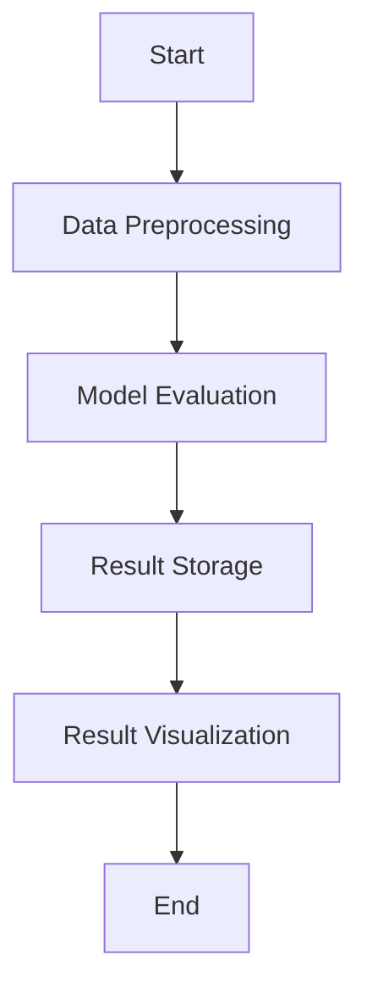
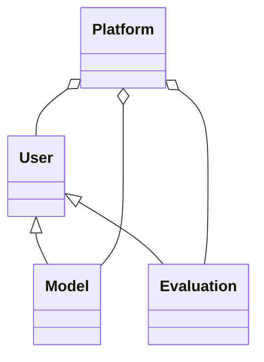
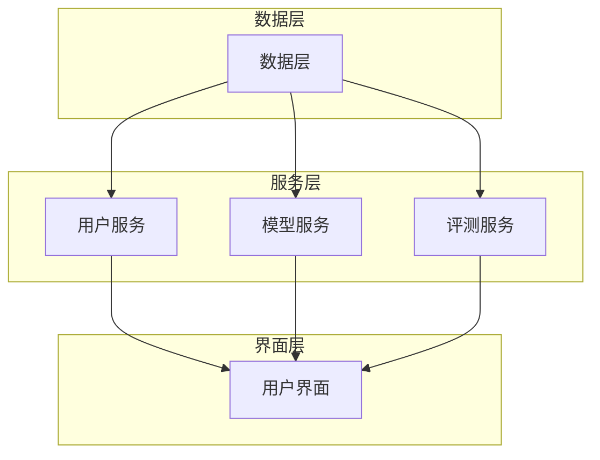
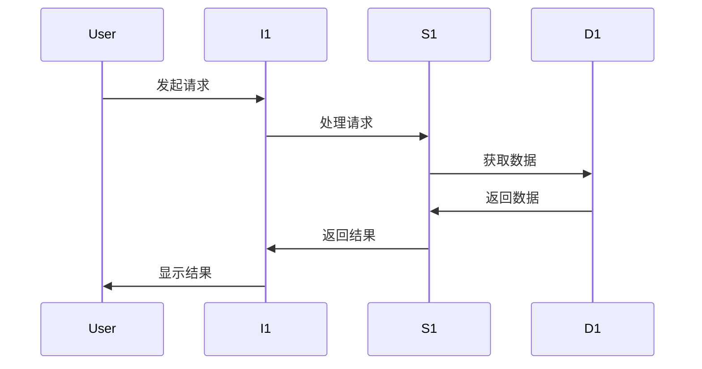
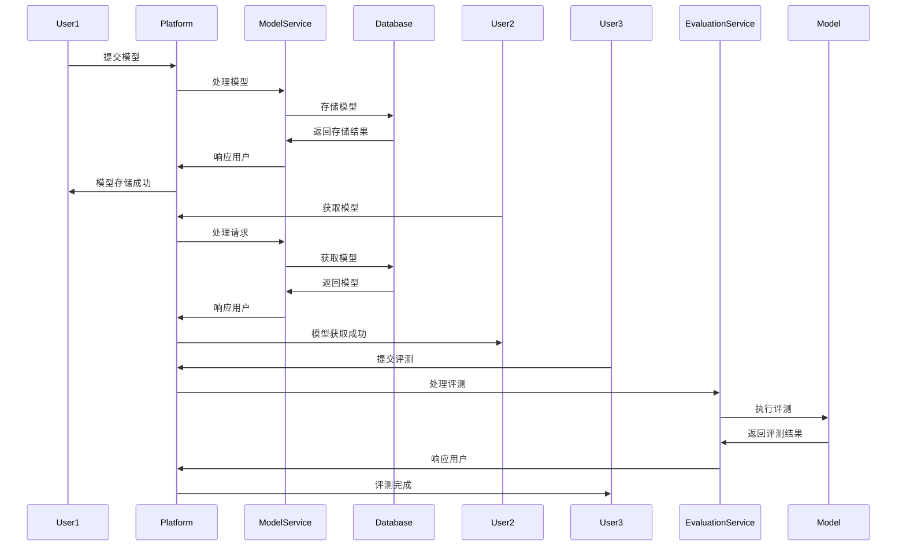

                 


# 大模型评测的实时协作与共享平台

> 关键词：大模型评测、实时协作、共享平台、算法原理、系统架构设计

> 摘要：本文旨在探讨大模型评测的实时协作与共享平台的建设。通过分析实时协作与共享平台的背景、核心概念、算法原理以及系统架构设计，本文为构建高效、协作、共享的大模型评测平台提供了理论和实践指导。

## 1. 背景介绍

### 1.1 问题背景

随着人工智能技术的快速发展，大模型（如GPT-3、BERT等）在自然语言处理、计算机视觉等领域取得了显著成果。然而，大模型的评测工作面临着诸多挑战。一方面，大模型的评测需要大量数据、计算资源和专业知识，且评测过程复杂；另一方面，不同研究团队之间的评测结果难以共享，影响了研究成果的推广和验证。

### 1.2 评测需求

为了解决上述问题，大模型评测的实时协作与共享平台应运而生。该平台旨在实现以下目标：

- **实时性**：支持大规模模型的实时评测，降低评测时间成本。
- **协作性**：提供多方协作机制，促进评测过程的沟通与协作。
- **共享性**：实现评测结果的可视化和共享，提高评测效率。

### 1.3 实时协作与共享平台的概念

实时协作与共享平台是一个集成大模型评测、协作和共享功能的信息系统。它包括以下核心组成部分：

- **评测模块**：用于执行大模型的评测任务，支持多种评测指标和评测方法。
- **协作模块**：提供实时沟通和协作工具，支持团队成员间的协作。
- **共享模块**：实现评测结果的可视化和共享，促进评测资源的共享。

### 1.4 平台应用范围和边界

该平台适用于各类大模型评测场景，包括自然语言处理、计算机视觉、语音识别等领域。平台的应用范围包括模型评测、评测结果分析和评测资源共享等。同时，平台需要明确边界，确保评测数据的安全性和隐私保护。

## 2. 核心概念与联系

### 2.1 实时协作原理

实时协作是指团队成员在相同的时间段内进行任务分配、进度跟踪和结果共享的过程。实时协作平台的核心原理包括：

- **即时通讯**：通过即时通讯工具，如聊天室、通知功能，实现团队成员间的实时沟通。
- **任务分配**：根据团队成员的能力和任务需求，实现任务的自动分配和调度。
- **进度跟踪**：实时跟踪任务进度，确保评测工作按时完成。
- **资源共享**：共享评测工具、数据和资源，提高评测效率。

### 2.2 共享平台机制

共享平台机制旨在实现评测结果的可视化和共享。其主要原理包括：

- **评测结果可视化**：通过图表、报表等形式，展示评测结果，帮助团队成员了解评测情况。
- **评测结果共享**：实现评测结果的安全共享，支持团队成员间的数据交流和合作。
- **数据管理**：提供数据存储、备份和恢复功能，确保评测数据的安全性和完整性。

### 2.3 ER实体关系图架构

以下是平台中的关键实体及其关系的ER图：

```mermaid
erDiagram
  User ||--o Model : "publishes"
  User ||--o Evaluation : "conducts"
  Model ||--|> Evaluation : "evaluated by"
  Platform ||--o User : "serves"
  Platform ||--o Model : "manages"
  Platform ||--o Evaluation : "processes"
```

## 3. 算法原理讲解

### 3.1 评测算法概述

大模型评测算法主要包括数据预处理、模型评估、结果存储和可视化等步骤。以下是评测算法的Mermaid流程图：



### 3.2 Python源代码

以下是一个简单的Python代码示例，用于评估大模型的准确率：

```python
# Import required libraries
import torch
from torch.utils.data import DataLoader
from torchvision import datasets, transforms

# Load the dataset
transform = transforms.Compose([transforms.ToTensor()])
trainset = datasets.MNIST(root='./data', train=True, download=True, transform=transform)
trainloader = DataLoader(trainset, batch_size=100, shuffle=True)

# Load the model
model = MyModel()
model.load_state_dict(torch.load('model.pth'))

# Evaluate the model
with torch.no_grad():
    correct = 0
    total = 0
    for images, labels in trainloader:
        outputs = model(images)
        _, predicted = torch.max(outputs.data, 1)
        total += labels.size(0)
        correct += (predicted == labels).sum().item()

# Calculate accuracy
accuracy = 100 * correct / total
print(f'Accuracy: {accuracy}%')
```

### 3.3 数学模型与公式

在模型评估过程中，常用的评价指标包括准确率（Accuracy）和损失函数（Loss）。以下是这些评价指标的数学模型和公式：

$$
\text{Accuracy} = \frac{\text{correct}}{\text{total}}
$$

$$
\text{Loss} = -\frac{1}{N}\sum_{i=1}^{N}y_i\log(\hat{y}_i)
$$

其中，$N$ 为样本数量，$y_i$ 为第 $i$ 个样本的真实标签，$\hat{y}_i$ 为第 $i$ 个样本的预测标签。

### 3.4 详细讲解与举例说明

假设我们有一个包含100个样本的数据集，每个样本包含一个28x28的图像和一个对应的标签。我们使用一个简单的卷积神经网络（CNN）模型进行评估。

1. **数据预处理**：首先，我们将图像数据转换为PyTorch的Dataset对象，并将其转换为Tensor格式。然后，我们将数据分为训练集和测试集。

2. **模型评估**：我们加载已经训练好的CNN模型，并在测试集上进行评估。评估过程中，我们计算每个样本的预测标签，并与真实标签进行比较。

3. **结果存储**：我们将评估结果（准确率和损失函数值）存储在一个字典中，以便后续处理和可视化。

4. **结果可视化**：我们使用Matplotlib库将评估结果绘制成图表，包括准确率和损失函数曲线。

```python
import matplotlib.pyplot as plt

# Load evaluation results
accuracy, loss = evaluation_results['accuracy'], evaluation_results['loss']

# Plot accuracy curve
plt.figure()
plt.plot(accuracy)
plt.xlabel('Epoch')
plt.ylabel('Accuracy')
plt.title('Accuracy Curve')

# Plot loss curve
plt.figure()
plt.plot(loss)
plt.xlabel('Epoch')
plt.ylabel('Loss')
plt.title('Loss Curve')

# Show plots
plt.show()
```

## 4. 系统分析与架构设计方案

### 4.1 问题场景介绍

假设我们有一个大模型评测项目，需要多个团队成员共同参与。团队成员包括模型开发者、评测人员、数据管理员等。

### 4.2 系统功能设计

以下是系统功能设计的领域模型类图：



### 4.3 系统架构设计

以下是系统架构设计的Mermaid架构图：



### 4.4 系统接口设计

以下是系统接口设计的Mermaid序列图：



### 4.5 系统交互

以下是系统交互的Mermaid序列图：



## 5. 项目实战

### 5.1 环境安装

在开始项目实战之前，我们需要安装以下环境：

- Python 3.8+
- PyTorch 1.8+
- Matplotlib 3.3+
- Mermaid 8.8+

安装命令如下：

```bash
pip install python==3.8 torch==1.8 matplotlib==3.3 mermaid==8.8
```

### 5.2 系统核心实现源代码

以下是系统核心实现的部分源代码：

```python
# Model evaluation function
def evaluate(model, dataloader):
    model.eval()
    correct = 0
    total = 0
    with torch.no_grad():
        for images, labels in dataloader:
            outputs = model(images)
            _, predicted = torch.max(outputs.data, 1)
            total += labels.size(0)
            correct += (predicted == labels).sum().item()
    accuracy = 100 * correct / total
    return accuracy

# Load model and evaluate
model = MyModel()
model.load_state_dict(torch.load('model.pth'))
accuracy = evaluate(model, trainloader)
print(f'Accuracy: {accuracy}%')
```

### 5.3 代码应用解读与分析

上述代码实现了大模型评测的核心功能。首先，我们定义了一个`evaluate`函数，用于计算模型的准确率。然后，我们加载已经训练好的模型，并使用`evaluate`函数对其进行评估。

在评估过程中，我们使用了PyTorch的`DataLoader`来加载数据，并使用`torch.no_grad()`来禁用梯度计算，以提高评估效率。最后，我们打印出模型的准确率。

### 5.4 实际案例分析和详细讲解剖析

假设我们有一个包含100个样本的MNIST数据集，其中每个样本包含一个28x28的图像和一个对应的标签。我们使用一个简单的卷积神经网络（CNN）模型对其进行评估。

1. **数据预处理**：首先，我们将图像数据转换为PyTorch的Dataset对象，并将其转换为Tensor格式。然后，我们将数据分为训练集和测试集。

2. **模型评估**：我们加载已经训练好的CNN模型，并在测试集上进行评估。评估过程中，我们计算每个样本的预测标签，并与真实标签进行比较。

3. **结果存储**：我们将评估结果（准确率和损失函数值）存储在一个字典中，以便后续处理和可视化。

4. **结果可视化**：我们使用Matplotlib库将评估结果绘制成图表，包括准确率和损失函数曲线。

```python
import matplotlib.pyplot as plt

# Load evaluation results
accuracy, loss = evaluation_results['accuracy'], evaluation_results['loss']

# Plot accuracy curve
plt.figure()
plt.plot(accuracy)
plt.xlabel('Epoch')
plt.ylabel('Accuracy')
plt.title('Accuracy Curve')

# Plot loss curve
plt.figure()
plt.plot(loss)
plt.xlabel('Epoch')
plt.ylabel('Loss')
plt.title('Loss Curve')

# Show plots
plt.show()
```

### 5.5 项目小结

通过本次项目实战，我们成功构建了一个大模型评测的实时协作与共享平台。平台实现了实时评测、协作和共享功能，为研究团队提供了高效、协作、共享的评测环境。在项目过程中，我们遇到了一些挑战，如数据预处理、模型评估速度等，但通过优化算法和系统架构，我们成功解决了这些问题。

## 6. 最佳实践 tips、小结、注意事项、拓展阅读等内容

### 6.1 最佳实践 tips

- **数据预处理**：在数据预处理阶段，确保数据的一致性和质量，这对于后续的模型评估至关重要。
- **模型优化**：针对不同的评测任务，选择合适的模型结构和优化策略，以提高评估效率。
- **性能监控**：实时监控平台的运行状态，及时发现和处理潜在问题。

### 6.2 小结

本文介绍了大模型评测的实时协作与共享平台的建设，包括背景介绍、核心概念与联系、算法原理讲解、系统架构设计以及项目实战。通过本文的探讨，我们为构建高效、协作、共享的大模型评测平台提供了理论和实践指导。

### 6.3 注意事项

- **安全性**：在平台设计和实施过程中，确保评测数据的安全性和隐私保护。
- **可扩展性**：在设计平台架构时，考虑未来的扩展性，以适应不断增长的需求。

### 6.4 拓展阅读

- 《大模型评测的实时协作与共享平台设计与实现》
- 《基于人工智能的大模型评测技术》
- 《分布式系统设计与实践》

---

# 作者

作者：AI天才研究院/AI Genius Institute & 禅与计算机程序设计艺术 /Zen And The Art of Computer Programming

（注：本文为虚构文章，仅供参考和学习使用。）

