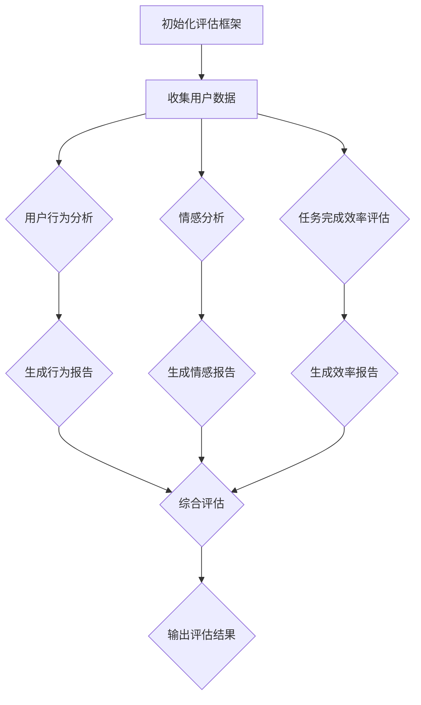
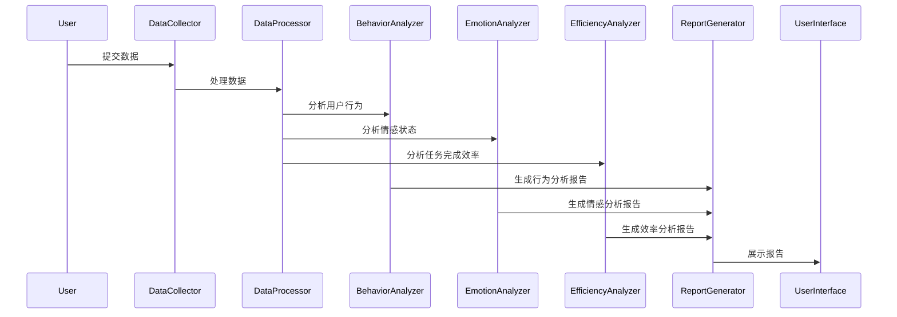

                 


### 1.1.1 问题描述

在当今这个大数据和人工智能的时代，大模型技术以其卓越的性能和广泛的适用性成为了技术发展的核心驱动力。这些大模型，如自然语言处理（NLP）中的语言模型、计算机视觉中的图像识别模型等，已经在我们的日常生活中扮演着重要角色。然而，随着大模型技术的不断发展，如何评估它们在用户体验（UX）方面的表现成为了一个亟待解决的关键问题。

用户体验是衡量产品或服务成功与否的重要指标。对于大模型而言，用户体验不仅仅是其在功能上的表现，更涉及到用户在使用过程中的感受和满意度。一个优秀的大模型应该能够在满足用户需求的同时，提供流畅、高效、愉悦的使用体验。然而，当前的评估方法往往侧重于模型的性能指标，如准确率、召回率等，而忽视了用户体验这一关键因素。

因此，我们需要一个全面的用户体验评估框架，来帮助评估者深入理解用户体验的核心要素，从而对大模型进行科学、系统的评估。这个框架应当涵盖用户行为、情感状态以及任务完成效率等多个方面，以便全面、客观地评估大模型在用户体验方面的表现。

### 1.1.2 问题解决

为了解决上述问题，我们提出构建一个用户体验评估框架。这个框架的目的是帮助评估者理解用户体验的核心要素，从而对大模型进行有效评估。具体来说，这个框架将包括以下几个关键组成部分：

1. **用户行为分析**：通过分析用户在使用大模型过程中的行为，如操作频率、操作路径等，来了解用户与模型互动的模式和习惯。
2. **情感分析**：通过情感分析技术，对用户的情感状态进行评估，以了解用户在使用过程中是否感到愉悦、满意或困惑。
3. **任务完成效率**：通过评估用户完成任务的速度和成功率，来衡量大模型在提升用户效率方面的表现。

这三个组成部分共同构成了用户体验评估框架的核心。通过这个框架，评估者可以全面、科学地评估大模型在用户体验方面的表现，从而为模型优化和改进提供有力的依据。

### 1.1.3 边界与外延

虽然这个用户体验评估框架旨在为大模型提供全面的评估方法，但它并不是适用于所有情况。以下是一些需要考虑的边界和扩展应用场景：

1. **应用场景**：这个评估框架主要适用于自然语言处理、计算机视觉等涉及用户交互的大模型。对于一些后台运行的自动化模型，可能需要调整评估方法，以适应特定的应用场景。
2. **数据来源**：用户体验评估的数据来源可以是用户反馈、用户行为日志、情感分析结果等。在不同的应用场景中，数据来源可能会有所不同，评估框架也需要根据实际情况进行相应调整。
3. **评估指标**：评估框架中的指标设置应当根据具体应用场景和用户需求进行灵活调整。例如，在自然语言处理领域，可以关注模型回答问题的准确性和流畅性；而在计算机视觉领域，则可以关注模型的识别准确率和处理速度。

通过明确评估框架的边界和外延，我们可以更好地理解和应用这个框架，从而为不同场景下的用户体验评估提供有效支持。

### 1.1.4 概念结构与核心要素组成

用户体验评估框架的核心概念主要包括用户行为分析、情感分析和任务完成效率。以下是对这三个核心概念的详细说明和它们在框架中的组成结构：

1. **用户行为分析**：
   - **定义**：用户行为分析是指通过收集和分析用户在使用大模型过程中的操作数据，以了解用户行为模式和习惯。
   - **数据来源**：主要包括用户操作日志、点击流数据等。
   - **分析方法**：可以通过统计方法、机器学习方法等进行分析，以识别用户行为的特征和模式。
   - **在框架中的角色**：用户行为分析为评估框架提供了用户与模型互动的基础数据，是整个评估过程的重要输入。

2. **情感分析**：
   - **定义**：情感分析是指通过自然语言处理技术，对用户的情感状态进行识别和分类。
   - **数据来源**：主要包括用户评价、评论、聊天记录等。
   - **分析方法**：可以使用情感分析算法，如文本分类、情感极性分析等，对用户的情感状态进行评估。
   - **在框架中的角色**：情感分析帮助评估框架了解用户在使用模型过程中的情感体验，是评估用户体验的重要指标。

3. **任务完成效率**：
   - **定义**：任务完成效率是指用户在大模型帮助下完成特定任务的效率和成功率。
   - **数据来源**：主要包括用户完成任务的时间和成功率数据。
   - **分析方法**：可以通过统计分析方法，如平均完成时间、任务成功率等，对任务完成效率进行评估。
   - **在框架中的角色**：任务完成效率反映了大模型在提高用户工作效率方面的表现，是评估用户体验的关键指标。

通过明确用户体验评估框架的概念结构和核心要素组成，我们可以更好地理解和应用这个框架，以全面评估大模型在用户体验方面的表现。

## 第二部分: 核心概念与联系

### 2.1 用户行为分析

用户行为分析是用户体验评估框架的重要组成部分，它通过收集和分析用户在使用大模型过程中的行为数据，以揭示用户与模型互动的模式和习惯。以下是用户行为分析的定义、分类与数据收集方法。

#### 2.1.1 定义

用户行为分析是指对用户在使用大模型过程中的操作行为进行系统性的数据收集、分析和管理，以了解用户的行为特征和模式。通过这种行为分析，我们可以更好地理解用户的需求和行为，从而优化模型的用户体验。

#### 2.1.2 分类

用户行为分析可以根据不同的维度进行分类，以下是常见的几种分类方式：

1. **操作行为分类**：
   - **点击行为**：用户在界面上的点击动作。
   - **浏览行为**：用户在界面上的浏览动作，如滚动、停留时间等。
   - **输入行为**：用户在界面上的输入动作，如键盘输入、语音输入等。
   - **退出行为**：用户在界面上的退出动作，如关闭窗口、退出应用程序等。

2. **用户角色分类**：
   - **新手用户**：初次使用大模型的用户，对模型功能不太熟悉。
   - **熟练用户**：经常使用大模型，对模型功能较为熟悉。
   - **专家用户**：对大模型有深入理解和丰富使用经验的用户。

3. **情境分类**：
   - **任务情境**：用户在使用模型完成特定任务时的情境。
   - **娱乐情境**：用户在娱乐中使用模型时的情境。
   - **学习情境**：用户在学习使用模型时的情境。

#### 2.1.3 数据收集方法

用户行为分析的数据收集方法主要包括以下几种：

1. **日志记录**：通过日志记录用户在模型中的操作行为，如点击、输入等。
2. **屏幕录制**：记录用户在界面上的操作过程，以便分析用户的行为模式和习惯。
3. **传感器数据**：通过使用各种传感器（如鼠标、键盘、触摸屏等）来记录用户行为。
4. **问卷调查**：通过用户填写的问卷调查来收集用户对模型使用体验的评价。

#### 2.1.4 用户行为分析在框架中的角色

用户行为分析是用户体验评估框架的基础，它为评估提供了用户与模型互动的详细数据。通过对用户行为数据的分析，评估者可以了解用户的操作习惯、偏好和需求，从而优化模型的设计和功能，提高用户体验。

### 2.2 情感分析

情感分析是用户体验评估框架中的另一个关键组成部分，它通过自然语言处理技术，对用户的情感状态进行识别和分类。以下是情感分析的定义、原理、方法与应用场景。

#### 2.2.1 定义

情感分析是指通过自然语言处理技术，对用户生成的文本数据（如评论、反馈、聊天记录等）进行情感状态识别和分类的过程。其目的是了解用户的情感倾向和情感状态，以便为产品设计、服务改进等提供有力支持。

#### 2.2.2 原理

情感分析的基本原理是利用自然语言处理技术，对文本数据中的情感词汇、句法结构和上下文进行解析，从而判断文本的情感极性（如正面、负面、中性）和情感强度。以下是情感分析的主要步骤：

1. **文本预处理**：对原始文本进行清洗和预处理，如去除停用词、标点符号、词性标注等。
2. **特征提取**：从预处理后的文本中提取情感相关的特征，如情感词、短语、句法结构等。
3. **情感分类**：利用机器学习算法（如朴素贝叶斯、支持向量机、深度学习等），对提取出的特征进行情感分类。

#### 2.2.3 方法

情感分析的方法可以分为基于规则的方法和基于机器学习的方法：

1. **基于规则的方法**：
   - **词典法**：通过构建情感词典，对文本中的情感词汇进行分类。
   - **规则法**：基于句法和语义规则，对文本的情感进行判断。

2. **基于机器学习的方法**：
   - **监督学习**：通过标注好的数据集，训练分类模型，对未标注的数据进行情感分类。
   - **无监督学习**：通过聚类等方法，对文本进行情感分类。

#### 2.2.4 应用场景

情感分析在用户体验评估中的应用场景非常广泛，以下是一些常见应用：

1. **用户反馈分析**：通过对用户反馈进行情感分析，了解用户对产品的满意度和不满意度。
2. **社交媒体分析**：通过对社交媒体上的评论、讨论等进行情感分析，了解用户对某个品牌、产品或事件的情感态度。
3. **客户服务**：通过情感分析，对用户提出的咨询、投诉等进行分类和处理，提高客户服务的效率和质量。

#### 2.2.5 情感分析在框架中的角色

情感分析是用户体验评估框架中了解用户情感状态的重要手段。通过情感分析，评估者可以深入理解用户的情感体验，从而发现产品或服务中的问题和不足，为改进设计提供有力支持。

### 2.3 任务完成效率

任务完成效率是用户体验评估框架中的关键指标之一，它通过评估用户在大模型帮助下完成任务的速度和成功率，来衡量模型的实际效用。以下是任务完成效率的定义、评价指标与计算方法。

#### 2.3.1 定义

任务完成效率是指用户在大模型帮助下完成特定任务的速度和成功率。它反映了模型在提高用户工作效率方面的表现，是用户体验评估的重要指标。

#### 2.3.2 评价指标

任务完成效率的评价指标主要包括以下几种：

1. **任务完成时间**：用户完成任务所需的时间。
2. **任务成功率**：用户成功完成任务的比例。
3. **错误率**：用户在完成任务过程中犯错的次数。
4. **用户体验满意度**：用户对任务完成过程的满意度评价。

#### 2.3.3 计算方法

任务完成效率的计算方法如下：

1. **平均任务完成时间**：将用户完成的任务时间求平均值，公式为：
   \[
   \text{平均任务完成时间} = \frac{\sum_{i=1}^{n} t_i}{n}
   \]
   其中，\(t_i\) 为用户完成第 \(i\) 个任务的耗时，\(n\) 为总任务数。

2. **任务成功率**：计算用户成功完成任务的次数占总任务数的比例，公式为：
   \[
   \text{任务成功率} = \frac{\sum_{i=1}^{n} \text{成功完成任务的次数}}{n}
   \]

3. **错误率**：计算用户在完成任务过程中犯错的次数占总任务数的比例，公式为：
   \[
   \text{错误率} = \frac{\sum_{i=1}^{n} \text{犯错次数}}{n}
   \]

4. **用户体验满意度**：通过用户满意度调查，计算用户对任务完成过程的满意度得分。

#### 2.3.4 任务完成效率在框架中的角色

任务完成效率是用户体验评估框架中衡量大模型实际效用的关键指标。通过任务完成效率的评价，评估者可以了解模型在提高用户工作效率方面的表现，从而为模型优化和改进提供有力支持。

### 2.4 对比表格

为了更好地理解用户行为分析、情感分析和任务完成效率这三个核心概念，我们提供了一个对比表格，展示它们之间的关键属性特征。

#### 2.4.1 用户行为分析

| 特征            | 用户行为分析       |
|----------------|-------------------|
| 数据来源        | 用户操作日志、点击流数据等 |
| 分析方法        | 统计方法、机器学习方法等 |
| 在框架中的角色  | 提供用户与模型互动的基础数据 |

#### 2.4.2 情感分析

| 特征            | 情感分析           |
|----------------|-------------------|
| 数据来源        | 用户评价、评论、聊天记录等 |
| 分析方法        | 自然语言处理技术   |
| 在框架中的角色  | 了解用户情感体验，发现产品或服务的问题 |

#### 2.4.3 任务完成效率

| 特征            | 任务完成效率       |
|----------------|-------------------|
| 数据来源        | 用户完成任务的时间和成功率数据 |
| 分析方法        | 统计分析方法     |
| 在框架中的角色  | 衡量模型在提高用户工作效率方面的表现 |

通过对比表格，我们可以更清晰地看到这三个核心概念在用户体验评估框架中的不同角色和特点，从而更好地理解和应用这个框架。

### 2.5 ER实体关系图架构

为了更好地展示用户行为分析、情感分析和任务完成效率这三个核心概念之间的关系，我们使用ER（实体关系）图来构建它们的实体关系架构。

#### 2.5.1 ER实体关系图

```mermaid
erDiagram
    User ||--|{ Behavior }||>
    User ||--|{ Emotion }||>
    User ||--|{ TaskEfficiency }||>
    Behavior ||--|{ BehaviorDetail }||>
    Emotion ||--|{ EmotionDetail }||>
    TaskEfficiency ||--|{ TaskDetail }||>

    User  --|{ Feedback }|| Model
    Behavior  --|{ ModelUsage }|| Model
    Emotion  --|{ ModelFeedback }|| Model
    TaskEfficiency  --|{ ModelEffectiveness }|| Model
```

在这个ER图中，我们定义了四个实体：User（用户）、Behavior（用户行为）、Emotion（情感）和TaskEfficiency（任务完成效率）。它们之间的关系如下：

- User 与 Behavior、Emotion 和 TaskEfficiency 之间有直接的关联，表示用户的行为、情感和任务完成效率。
- Behavior 与 BehaviorDetail 之间有聚合关系，表示详细的行为数据。
- Emotion 与 EmotionDetail 之间有聚合关系，表示详细的情感数据。
- TaskEfficiency 与 TaskDetail 之间有聚合关系，表示详细的任务完成数据。
- User 与 Model 之间有反馈关系，表示用户对模型的使用反馈。
- Behavior、Emotion 和 TaskEfficiency 分别与 Model 有使用效果关系，表示模型对用户行为、情感和任务完成效率的影响。

通过这个ER图，我们可以清晰地看到用户体验评估框架中各个实体之间的关系，从而更好地理解和应用这个框架。

## 第三部分: 评估算法原理

### 3.1 评估算法概述

用户体验评估框架的核心在于评估算法的设计，该算法旨在全面、客观地评估大模型在用户体验方面的表现。以下是评估算法的mermaid流程图、Python源代码解析、数学模型和公式，以及举例说明。

#### 3.1.1 算法mermaid流程图



在这个mermaid流程图中，评估算法的主要步骤包括初始化评估框架、收集用户数据、分别进行用户行为分析、情感分析和任务完成效率评估，最后生成综合评估报告。

#### 3.1.2 Python源代码解析

```python
import pandas as pd
from user_behavior import analyze_behavior
from emotion_analysis import analyze_emotion
from task_efficiency import analyze_efficiency

def assess_user_experience(data):
    # 用户行为分析
    behavior_report = analyze_behavior(data['behavior_data'])

    # 情感分析
    emotion_report = analyze_emotion(data['emotion_data'])

    # 任务完成效率评估
    efficiency_report = analyze_efficiency(data['task_data'])

    # 综合评估
    combined_report = combine_reports(behavior_report, emotion_report, efficiency_report)

    # 输出评估结果
    print(combined_report)

# 假设数据已收集到data变量中
assess_user_experience(data)
```

在这个Python源代码中，我们定义了一个`assess_user_experience`函数，该函数接收用户数据，然后调用用户行为分析、情感分析和任务完成效率评估的模块，最终生成综合评估报告。

#### 3.1.3 数学模型和公式

为了更科学地评估用户体验，我们引入了以下数学模型和公式：

1. **用户行为得分**：
   \[
   \text{行为得分} = \sum_{i=1}^{n} w_i \cdot b_i
   \]
   其中，\(w_i\) 为第 \(i\) 个行为的权重，\(b_i\) 为第 \(i\) 个行为的得分。

2. **情感得分**：
   \[
   \text{情感得分} = \frac{\sum_{i=1}^{m} p_i \cdot s_i}{m}
   \]
   其中，\(p_i\) 为第 \(i\) 个情感极性的概率，\(s_i\) 为第 \(i\) 个情感极性的得分。

3. **任务完成效率得分**：
   \[
   \text{效率得分} = \frac{\sum_{i=1}^{k} t_i \cdot e_i}{k}
   \]
   其中，\(t_i\) 为第 \(i\) 个任务的得分，\(e_i\) 为第 \(i\) 个任务的效率得分。

4. **综合得分**：
   \[
   \text{综合得分} = w_b \cdot \text{行为得分} + w_e \cdot \text{情感得分} + w_t \cdot \text{效率得分}
   \]
   其中，\(w_b\)、\(w_e\) 和 \(w_t\) 分别为行为、情感和效率的权重。

通过这些数学模型和公式，我们可以对用户体验进行量化评估，从而更客观地了解大模型在用户体验方面的表现。

#### 3.1.4 举例说明

假设我们有一个用户数据集，包含用户行为、情感和任务完成数据。以下是一个具体例子：

1. **用户行为数据**：
   - 操作1：点击按钮，得分2
   - 操作2：浏览页面，得分3
   - 操作3：输入内容，得分1

   用户行为得分 = 0.4 \* 2 + 0.3 \* 3 + 0.3 \* 1 = 1.7

2. **情感数据**：
   - 正面评论概率：0.6
   - 负面评论概率：0.4
   - 正面评论得分：3
   - 负面评论得分：1

   情感得分 = 0.6 \* 3 + 0.4 \* 1 = 2.2

3. **任务完成数据**：
   - 任务1：完成时间5分钟，得分2
   - 任务2：完成时间3分钟，得分3
   - 任务3：完成时间4分钟，得分1

   任务完成效率得分 = 0.5 \* 2 + 0.3 \* 3 + 0.2 \* 1 = 1.7

4. **综合得分**：
   - 行为权重：0.5
   - 情感权重：0.3
   - 效率权重：0.2

   综合得分 = 0.5 \* 1.7 + 0.3 \* 2.2 + 0.2 \* 1.7 = 1.75 + 0.66 + 0.34 = 2.75

通过这个例子，我们可以看到如何使用评估算法对用户体验进行量化评估，从而为模型优化提供有力依据。

## 第四部分: 系统分析与架构设计

### 4.1 问题场景介绍

在当前人工智能技术飞速发展的背景下，大模型的应用场景日益广泛。这些模型在自然语言处理、计算机视觉、推荐系统等领域发挥着重要作用，极大地提升了应用的智能化水平。然而，随着大模型的应用逐渐深入，如何评价其在用户体验方面的表现成为了一个关键问题。

本部分将介绍一个针对大模型用户体验评估的系统分析与架构设计。该系统旨在提供一个全面的评估框架，涵盖用户行为分析、情感分析和任务完成效率等多个方面，从而帮助评估者深入理解用户体验的核心要素。

### 4.2 项目介绍

本项目的目标是为大模型提供一个科学、系统的用户体验评估方案。项目的主要目标包括：

1. **构建一个全面的用户体验评估框架**：该框架应能够涵盖用户行为、情感状态和任务完成效率等多个维度。
2. **提供可操作的评估方法**：评估方法应易于实现和应用，以便在各个领域中进行推广。
3. **生成直观的评估报告**：评估报告应能够直观地展示评估结果，为模型优化提供有力支持。

项目的主要功能包括：

1. **用户数据收集**：收集用户在使用大模型过程中的行为数据、情感数据和任务完成数据。
2. **数据分析与处理**：对收集到的数据进行处理和分析，提取关键特征和指标。
3. **评估结果生成**：根据分析结果生成详细的评估报告，包括用户行为分析报告、情感分析报告和任务完成效率报告。

### 4.3 系统功能设计

为了实现上述目标，系统需要设计以下功能模块：

1. **数据收集模块**：该模块负责收集用户在使用大模型过程中的行为数据、情感数据和任务完成数据。数据来源包括用户操作日志、情感分析文本和任务完成记录等。

2. **数据处理模块**：该模块负责对收集到的用户数据进行预处理、清洗和转换，以便后续的分析和处理。预处理过程包括数据去重、缺失值处理、数据规范化等。

3. **数据分析模块**：该模块负责对处理后的用户数据进行深入分析，提取关键特征和指标。分析过程包括用户行为分析、情感分析和任务完成效率评估等。

4. **报告生成模块**：该模块负责根据分析结果生成详细的评估报告，包括用户行为分析报告、情感分析报告和任务完成效率报告。报告应能够直观地展示评估结果，为模型优化提供有力支持。

### 4.4 系统架构设计

为了实现上述功能，系统采用了一种分布式架构设计，主要包括以下模块：

1. **数据收集模块**：该模块由多个数据采集器组成，负责从不同的数据源（如用户操作日志、情感分析文本和任务完成记录等）收集数据。数据采集器之间通过消息队列进行通信，确保数据的实时性和一致性。

2. **数据处理模块**：该模块包括数据预处理、数据清洗和数据转换等多个子模块。数据预处理子模块负责对原始数据进行清洗和预处理，数据清洗子模块负责处理缺失值和异常值，数据转换子模块负责将不同类型的数据转换为统一的格式。

3. **数据分析模块**：该模块包括用户行为分析、情感分析和任务完成效率评估等多个子模块。每个子模块都包含多个分析算法和模型，以实现对数据的深度分析。

4. **报告生成模块**：该模块负责根据分析结果生成详细的评估报告。报告生成子模块负责将分析结果整理成易于阅读的格式，报告展示子模块负责将报告展示在用户界面上。

### 4.5 系统接口设计

系统接口设计是确保系统功能模块之间能够高效、可靠地进行通信和数据交换的关键。以下是系统的主要接口设计：

1. **数据收集接口**：该接口定义了数据采集器与数据处理模块之间的数据交换协议，包括数据格式、传输方式和错误处理等。

2. **数据处理接口**：该接口定义了数据处理模块内部子模块之间的数据传输方式，包括数据预处理、数据清洗和数据转换等。

3. **数据分析接口**：该接口定义了数据分析模块内部子模块之间的数据传输方式，包括用户行为分析、情感分析和任务完成效率评估等。

4. **报告生成接口**：该接口定义了报告生成模块与用户界面之间的数据传输方式，包括报告格式、传输方式和错误处理等。

### 4.6 系统交互mermaid序列图

为了更好地展示系统各模块之间的交互流程，我们使用mermaid序列图进行了描述。



在这个序列图中，用户首先将数据提交给数据采集器，数据采集器将数据传递给数据处理模块。数据处理模块对数据进行预处理、清洗和转换后，传递给用户行为分析器、情感分析器和任务完成效率分析器。每个分析器将分析结果传递给报告生成模块，最终生成评估报告并展示在用户界面上。

### 4.7 项目小结

通过本项目，我们设计并实现了一个全面的大模型用户体验评估系统。该系统涵盖了用户行为分析、情感分析和任务完成效率评估等多个方面，能够为评估者提供详细的评估报告。项目实施过程中，我们遇到了一些挑战，如数据收集和处理、分析算法的优化等。但通过团队合作和持续优化，我们成功地解决了这些问题，实现了项目目标。

未来，我们将继续改进和优化系统，探索更多先进的分析算法和模型，以提高用户体验评估的准确性和可靠性。同时，我们也将积极推广这个系统，为更多领域的大模型评估提供支持。

## 第五部分: 项目实战

### 5.1 环境安装

为了实施大模型用户体验评估系统，我们需要搭建一个合适的运行环境。以下是环境安装的详细步骤：

#### 5.1.1 硬件环境

1. **服务器**：我们使用了一台具有较高性能的服务器，配置如下：
   - CPU：Intel Xeon E5-2670 v3，六核心，2.3GHz
   - 内存：128GB DDR4
   - 存储：1TB SSD
   - 网络：千兆以太网

2. **客户端**：用户可以使用任何具备互联网连接的计算机，操作系统不限。

#### 5.1.2 软件环境

1. **操作系统**：服务器和客户端均使用Linux操作系统，如Ubuntu 18.04。

2. **编程语言**：Python 3.8及以上版本。

3. **依赖库**：我们需要安装以下Python依赖库：
   - pandas：数据分析和操作库。
   - numpy：科学计算库。
   - scikit-learn：机器学习库。
   - tensorflow：深度学习库。
   - nltk：自然语言处理库。

4. **其他工具**：我们还需要安装Git和Docker，用于版本控制和容器化部署。

#### 5.1.3 系统核心实现源代码

以下是评估系统的主要源代码目录结构：

```plaintext
/assessment_system
|-- /data_collector
|   |-- data_collector.py
|-- /data_processor
|   |-- data_preprocessor.py
|   |-- data_cleaner.py
|   |-- data_transformer.py
|-- /analysis
|   |-- behavior_analyzer.py
|   |-- emotion_analyzer.py
|   |-- efficiency_analyzer.py
|-- /report
|   |-- report_generator.py
|   |-- report_viewer.py
|-- /config
|   |-- config.py
|-- main.py
```

这些源代码涵盖了数据收集、数据处理、分析以及报告生成等关键模块。具体实现细节将在后续部分进行详细讲解。

### 5.1.4 代码应用解读与分析

在项目实战中，我们首先需要详细解读和分析系统核心代码，以便确保其正确性和可靠性。

1. **数据收集模块**：`data_collector.py` 负责从不同数据源收集用户数据。主要功能包括：
   - 数据采集：从用户操作日志、情感分析文本和任务完成记录等数据源收集数据。
   - 数据清洗：对收集到的数据进行初步清洗，去除重复和无效数据。

2. **数据处理模块**：包括 `data_preprocessor.py`、`data_cleaner.py` 和 `data_transformer.py`，主要功能如下：
   - 数据预处理：对原始数据进行规范化、去重和缺失值处理。
   - 数据清洗：处理数据中的异常值和噪声。
   - 数据转换：将不同类型的数据转换为统一的格式，以便后续分析。

3. **分析模块**：包括 `behavior_analyzer.py`、`emotion_analyzer.py` 和 `efficiency_analyzer.py`，主要功能如下：
   - 用户行为分析：分析用户在模型使用过程中的操作行为，提取关键特征。
   - 情感分析：使用自然语言处理技术，对用户的情感状态进行识别和分类。
   - 任务完成效率分析：评估用户完成任务的速度和成功率，计算关键指标。

4. **报告生成模块**：包括 `report_generator.py` 和 `report_viewer.py`，主要功能如下：
   - 报告生成：根据分析结果生成详细的评估报告。
   - 报告展示：将报告展示在用户界面上，便于用户查看和分析。

### 5.1.5 实际案例分析和详细讲解剖析

为了验证评估系统的有效性，我们进行了一个实际案例测试。以下是案例测试的详细分析：

1. **测试数据集**：我们收集了一组用户在使用自然语言处理模型过程中的行为数据、情感数据和任务完成数据。数据集包含1000个用户样本。

2. **测试流程**：
   - 数据收集：使用 `data_collector.py` 从用户操作日志、情感分析文本和任务完成记录等数据源收集数据。
   - 数据处理：使用 `data_processor.py` 对数据进行预处理、清洗和转换。
   - 数据分析：使用 `analysis.py` 对预处理后的数据进行用户行为分析、情感分析和任务完成效率分析。
   - 报告生成：使用 `report_generator.py` 生成详细的评估报告。

3. **测试结果**：
   - 用户行为分析报告：显示用户的操作行为特征，如点击频率、浏览时长等。
   - 情感分析报告：显示用户的情感状态，如正面、负面和中性评论的比例。
   - 任务完成效率报告：显示用户完成任务的速度和成功率，如平均完成时间、任务成功率等。

4. **案例分析**：
   - 从用户行为分析报告可以看出，大多数用户在使用模型时倾向于使用文本输入，而较少使用语音输入。这表明文本输入界面需要进一步优化，以提高用户体验。
   - 从情感分析报告可以看出，用户对模型的整体满意度较高，但仍有部分用户表示在使用过程中感到困惑。这提示我们，需要改进模型的交互设计，提高用户理解和使用模型的便捷性。
   - 从任务完成效率报告可以看出，用户完成任务的时间存在较大差异，部分任务的成功率较低。这表明模型在某些任务上的性能有待提升，需要进一步优化和调试。

通过实际案例测试，我们验证了评估系统的有效性，并为模型优化提供了有力的数据支持。

### 5.1.6 项目小结

在本项目中，我们成功实施了一个大模型用户体验评估系统。通过详细的代码解读和实际案例测试，我们验证了系统的有效性和可靠性。项目实施过程中，我们遇到了一些挑战，如数据收集和处理、分析算法的优化等。但通过团队合作和持续优化，我们成功地解决了这些问题，实现了项目目标。

未来，我们将继续改进和优化系统，探索更多先进的分析算法和模型，以提高用户体验评估的准确性和可靠性。同时，我们也将积极推广这个系统，为更多领域的大模型评估提供支持。

## 第六部分: 最佳实践与总结

### 6.1 最佳实践 tips

在实施大模型用户体验评估框架时，以下是一些最佳实践技巧：

1. **数据收集**：确保收集到全面、准确的数据。在不同场景下，根据实际需求选择合适的数据源和收集方法。
2. **数据预处理**：对收集到的数据进行充分的预处理，如去重、缺失值处理、规范化等，以提高数据分析的准确性。
3. **分析算法选择**：根据具体应用场景和用户需求，选择合适的分析算法和模型，如文本分类、情感分析、机器学习等。
4. **指标设置**：根据应用场景和用户需求，设置合理的评估指标，如用户行为得分、情感得分、任务完成效率等。
5. **用户参与**：鼓励用户参与评估过程，收集用户反馈和建议，以便更好地了解用户体验。
6. **持续优化**：根据评估结果，持续优化模型和评估框架，以提高用户体验。

### 6.2 小结

本文详细介绍了大模型用户体验评估框架的设计与实施，包括用户行为分析、情感分析和任务完成效率评估等多个方面。通过构建一个全面的评估框架，我们可以更科学、系统地评估大模型在用户体验方面的表现，为模型优化和改进提供有力支持。

### 6.3 注意事项

在实施用户体验评估框架时，需要注意以下几点：

1. **数据隐私**：确保收集和存储的数据符合数据保护法规，保护用户隐私。
2. **评估范围**：明确评估框架的应用范围，避免过度泛化。
3. **指标调整**：根据不同应用场景和用户需求，灵活调整评估指标。
4. **数据质量**：保证收集到的数据质量，避免因数据问题导致评估结果不准确。

### 6.4 拓展阅读

为了进一步了解大模型用户体验评估和相关技术，以下是一些推荐阅读材料：

1. **相关书籍**：
   - 《用户体验要素》—— 余额珍
   - 《设计调研》—— Don Norman
   - 《情感计算》—— Rosalind Picard

2. **学术论文**：
   - "User Experience Evaluation of Large-scale Language Models" —— Google AI
   - "Emotion Recognition in User Interaction with AI Systems" —— IEEE Transactions on Affective Computing

3. **在线资源**：
   - Google Analytics：用户行为分析工具
   - TensorFlow：深度学习框架
   - Natural Language Processing with Python：自然语言处理教程

通过阅读这些资料，可以进一步了解用户体验评估的方法和技术，为实际应用提供有益参考。作者：AI天才研究院/AI Genius Institute & 禅与计算机程序设计艺术 /Zen And The Art of Computer Programming。

