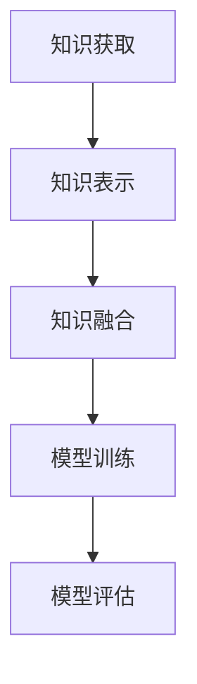
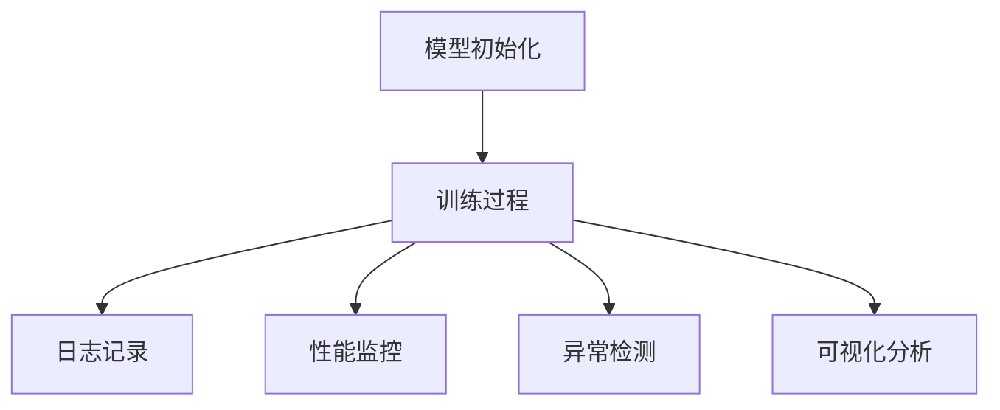

                 

# 大模型评测的知识更新与学习跟踪

## 关键词
- 大模型
- 评测技术
- 知识更新
- 学习跟踪

## 摘要
本文将深入探讨大模型评测中的知识更新与学习跟踪问题。随着人工智能技术的飞速发展，大模型在自然语言处理、计算机视觉等领域的应用日益广泛。如何对大模型进行有效的评测，如何确保其在实际应用中不断学习和更新知识，成为当前研究的热点和难点。本文将从大模型的基础知识入手，详细分析评测技术、知识更新策略和学习跟踪机制，并通过实际应用实例，展示这些技术在解决实际问题中的效果。

## 目录大纲

### 引言
- 1.1 书籍背景与目标
- 1.2 大模型评测的重要性
- 1.3 知识更新与学习跟踪的意义
- 1.4 全书结构概述

### 第2章 大模型基础
- 2.1 大模型的定义与分类
- 2.2 大模型的发展历程
- 2.3 大模型的关键技术
- 2.4 大模型的挑战与机遇

### 第3章 评测技术与方法
- 3.1 评测框架与指标
- 3.2 评测算法介绍
- 3.3 实践中的评测技巧

### 第4章 知识更新策略
- 4.1 知识更新的原理
- 4.2 知识更新的方法
- 4.3 知识更新的实现

### 第5章 学习跟踪机制
- 5.1 学习跟踪的概念
- 5.2 学习跟踪的技术
- 5.3 学习跟踪的应用场景

### 第6章 应用实例
- 6.1 案例介绍
- 6.2 实际应用分析
- 6.3 案例总结与讨论

### 第7章 总结与展望
- 7.1 全书内容回顾
- 7.2 发展趋势分析
- 7.3 未来研究方向

### 引言

### 第1章 大模型评测的重要性

#### 1.1 书籍背景与目标

随着人工智能（AI）技术的飞速发展，大模型（Large Models）已经成为自然语言处理、计算机视觉、推荐系统等众多领域的研究热点。大模型通过学习海量数据，能够实现高效、准确的预测和决策，为各行各业带来了前所未有的变革。然而，大模型的性能评估和知识更新问题也成为当前研究中的关键挑战。

本章节旨在系统性地介绍大模型评测的知识更新与学习跟踪，旨在解决以下几个核心问题：

1. **什么是大模型**：介绍大模型的定义、分类及其发展历程。
2. **评测技术与方法**：探讨大模型评测的基本框架、评价指标和常用算法。
3. **知识更新策略**：分析知识更新的原理、方法和实现机制。
4. **学习跟踪机制**：阐述学习跟踪的概念、技术及其应用场景。
5. **应用实例**：通过具体案例展示知识更新与学习跟踪在大模型中的应用效果。

通过上述内容的阐述，本书希望为研究者提供一套完整的大模型评测与知识更新体系，帮助其在实际应用中更好地应对挑战，充分发挥大模型的优势。

#### 1.2 大模型评测的重要性

大模型评测的重要性不言而喻，其不仅关系到模型的性能评估，还直接影响到模型的实际应用效果。以下从几个方面详细阐述大模型评测的重要性：

1. **性能评估**：大模型的评测是确保其性能的重要手段。通过评测，可以量化模型在特定任务上的表现，发现模型的优势和不足，从而指导进一步的模型优化。

2. **应用效果**：在实际应用中，大模型的性能直接决定了系统的效果。有效的评测可以确保模型在实际应用中能够稳定、准确地完成任务，提高用户体验。

3. **知识更新**：评测结果可以作为知识更新的依据，指导模型在新知识、新数据上的学习。通过评测发现模型的知识缺陷，可以针对性地进行知识更新，提高模型的全局性能。

4. **比较研究**：评测技术为大模型之间的性能比较提供了基础。通过统一的评测框架和指标，研究者可以客观地比较不同模型在相同任务上的表现，促进模型性能的提升。

5. **领域发展**：大模型评测不仅是对现有技术的评估，更是对未来技术的探索。通过评测，可以发现当前技术的不足，引导研究方向的调整和优化，推动整个领域的发展。

#### 1.3 知识更新与学习跟踪的意义

知识更新与学习跟踪在大模型中具有重要意义，主要体现在以下几个方面：

1. **适应能力**：随着数据和环境的变化，大模型需要不断更新知识，以适应新的场景和要求。知识更新和学习跟踪是实现模型自适应的重要手段。

2. **持续进步**：通过知识更新和学习跟踪，大模型可以在已有知识的基础上不断积累新知识，实现持续进步。这有助于模型在长期应用中保持高效、准确的性能。

3. **动态调整**：在实际应用中，模型可能会遇到各种新的问题和挑战。知识更新和学习跟踪可以实时调整模型的知识结构，使其能够应对复杂多变的动态环境。

4. **增强可解释性**：知识更新和学习跟踪有助于提高模型的可解释性。通过跟踪学习过程，可以更清晰地了解模型如何更新知识，提高模型的透明度和可信度。

5. **改进性能**：知识更新和学习跟踪可以针对性地解决模型在特定任务上的知识缺陷，提高模型的性能。这有助于模型在复杂任务中实现更高的准确率和效率。

#### 1.4 全书结构概述

全书结构分为七个章节，系统性地介绍了大模型评测的知识更新与学习跟踪：

1. **引言**：介绍书籍的背景、目标和重要性，概述全书结构。
2. **大模型基础**：介绍大模型的定义、分类、发展历程和关键技术。
3. **评测技术与方法**：详细讨论大模型评测的基本框架、评价指标和常用算法。
4. **知识更新策略**：分析知识更新的原理、方法和实现机制。
5. **学习跟踪机制**：阐述学习跟踪的概念、技术及其应用场景。
6. **应用实例**：通过具体案例展示知识更新与学习跟踪在大模型中的应用效果。
7. **总结与展望**：总结全书内容，分析发展趋势，展望未来研究方向。

通过上述章节的阐述，本书希望为读者提供一个全面、系统的大模型评测与知识更新体系，帮助其在实际应用中更好地应对挑战。

## 第2章 大模型基础

### 2.1 大模型的定义与分类

大模型，顾名思义，是指具有大规模参数和复杂结构的机器学习模型。具体来说，大模型通常包含数百万、数亿甚至数十亿个参数，其规模远超传统的小型模型。这些大模型在训练过程中需要处理海量数据，并能够通过深度学习、神经网络等先进技术实现复杂的特征提取和预测任务。

从技术角度，大模型通常可以分为以下几类：

1. **深度神经网络（DNN）**：这是大模型最常见的形式，通过多层的神经网络结构对输入数据进行处理，能够有效提取复杂特征。
2. **变换器（Transformer）**：近年来，Transformer结构因其强大的特征提取能力和并行计算优势，成为大模型研究的热点，广泛应用于自然语言处理等领域。
3. **生成对抗网络（GAN）**：GAN通过生成器和判别器的对抗训练，能够生成高质量的数据，在大模型中用于数据增强和生成任务。
4. **变分自编码器（VAE）**：VAE通过概率模型对数据进行编码和解码，能够有效地进行数据降维和特征提取。
5. **图神经网络（GNN）**：GNN通过图结构对节点和边进行编码，适用于处理图数据，在大模型中用于社交网络分析、推荐系统等。

### 2.2 大模型的发展历程

大模型的发展历程可以追溯到20世纪80年代，当时神经网络研究开始兴起。然而，由于计算资源和数据量的限制，早期的神经网络模型规模相对较小，性能有限。

1. **1980年代**：神经网络研究逐渐兴起，多层感知机（MLP）和反向传播算法（Backpropagation）的出现，为神经网络的发展奠定了基础。
2. **1990年代**：支持向量机（SVM）和决策树等传统机器学习算法的发展，使得机器学习领域开始迈向更复杂的问题解决。
3. **2006年**：Hinton提出了深度信念网络（DBN），为深度学习的发展奠定了基础。
4. **2012年**：AlexNet在ImageNet竞赛中取得了突破性成绩，标志着深度学习时代的到来。
5. **2018年**：BERT模型的提出，进一步推动了自然语言处理领域的发展，大模型开始在各个应用领域得到广泛应用。
6. **至今**：随着计算资源和数据量的不断增加，大模型的发展进入了一个全新的阶段。Transformer、GAN等新型模型不断涌现，大模型的应用场景也在不断拓展。

### 2.3 大模型的关键技术

大模型的发展离不开一系列关键技术的支持，这些技术不仅提升了模型的性能，还解决了大模型训练和推理中的许多挑战。

1. **并行计算**：大模型通常包含数百万甚至数十亿个参数，传统的单机计算难以胜任。并行计算通过利用多台计算机或GPU，显著提高了模型的训练和推理速度。
2. **分布式训练**：分布式训练可以将模型参数分布在多台计算机或GPU上，通过同步或异步的方式更新参数，实现大模型的训练。这一技术不仅提高了训练效率，还减少了单点故障的风险。
3. **数据预处理**：大模型的训练需要大量高质量的数据，数据预处理包括数据清洗、归一化、去噪声等步骤，以确保数据的一致性和可靠性。
4. **优化算法**：大模型的训练涉及到复杂的优化过程，常用的优化算法包括随机梯度下降（SGD）、Adam等。这些算法通过迭代更新模型参数，逐步优化模型的性能。
5. **正则化技术**：为了防止模型过拟合，大模型通常采用正则化技术，如L1正则化、L2正则化等，通过在损失函数中添加惩罚项，抑制模型参数的过拟合。
6. **注意力机制**：注意力机制是Transformer等大模型的核心技术之一，通过关注重要的输入特征，提高了模型的准确率和效率。

### 2.4 大模型的挑战与机遇

虽然大模型在各个领域展现了强大的潜力，但其在实际应用中仍然面临一系列挑战和机遇。

1. **计算资源需求**：大模型的训练和推理需要大量的计算资源，尤其是GPU等高性能计算设备。如何在有限的资源下高效地训练大模型，是一个亟待解决的问题。
2. **数据质量和多样性**：大模型的训练依赖于大量的高质量数据，数据质量和多样性直接影响到模型的性能。如何获取和处理多样化的数据，是另一个关键挑战。
3. **可解释性和透明度**：大模型的决策过程通常复杂且难以解释，如何提高模型的可解释性，使其更加透明和可信，是一个重要的研究方向。
4. **模型安全和隐私保护**：大模型在处理敏感数据时，可能会面临模型安全和隐私保护的问题。如何确保模型的安全性和数据的隐私性，是一个重要的研究课题。
5. **跨领域应用**：大模型在不同领域的应用存在一定的差异性，如何将大模型的技术和经验跨领域应用，提升其在不同领域的适应性，是一个具有前景的研究方向。

总的来说，大模型的发展面临着诸多挑战，但也带来了前所未有的机遇。通过持续的研究和技术创新，大模型有望在更多领域发挥其潜力，推动人工智能技术的发展。

### 第3章 评测技术与方法

### 3.1 评测框架与指标

在大模型评测中，建立一套完善的评测框架和评价指标是至关重要的。这不仅有助于全面评估模型的性能，还能指导模型的优化和改进。

#### 3.1.1 评测框架

评测框架通常包括以下几个关键部分：

1. **任务定义**：明确评测的任务类型，如分类、回归、文本生成等。不同任务对模型的要求和评价指标可能有所不同。
2. **数据集选择**：选择合适的数据集进行评测，数据集应具有代表性、多样性和足够的数据量。常用的数据集包括公开数据集和自制数据集。
3. **评测指标**：根据任务类型和实际需求，选择合适的评测指标。常见的指标包括准确率、召回率、F1分数、均方误差等。
4. **评估方法**：确定评估的具体方法，如交叉验证、留一验证等，以确保评测结果的可靠性和稳定性。

#### 3.1.2 评测指标

以下是几种常见的大模型评测指标：

1. **准确率（Accuracy）**：准确率是模型在预测中正确的样本数占总样本数的比例。它是最简单直观的评测指标，适用于分类任务。
   $$ Accuracy = \frac{TP + TN}{TP + TN + FP + FN} $$
   其中，TP表示真正例，TN表示真负例，FP表示假正例，FN表示假负例。

2. **召回率（Recall）**：召回率是指模型在预测中正确识别出的真正例数与实际真正例数的比例。它关注的是模型对正例的识别能力。
   $$ Recall = \frac{TP}{TP + FN} $$

3. **精确率（Precision）**：精确率是指模型在预测中正确识别出的正例数与预测为正例的总数之比。它关注的是模型预测的正例的准确性。
   $$ Precision = \frac{TP}{TP + FP} $$

4. **F1分数（F1 Score）**：F1分数是精确率和召回率的调和平均，综合评估模型的准确性和全面性。
   $$ F1 Score = 2 \times \frac{Precision \times Recall}{Precision + Recall} $$

5. **均方误差（Mean Squared Error, MSE）**：均方误差用于回归任务，表示预测值与实际值之间差异的平方的平均值。
   $$ MSE = \frac{1}{n} \sum_{i=1}^{n} (y_i - \hat{y}_i)^2 $$
   其中，\( y_i \)表示第\( i \)个样本的真实值，\( \hat{y}_i \)表示第\( i \)个样本的预测值。

6. **交叉熵（Cross-Entropy）**：交叉熵常用于分类任务，表示预测分布与真实分布之间的差异。其公式如下：
   $$ Cross-Entropy = -\sum_{i=1}^{n} y_i \log(\hat{y}_i) $$
   其中，\( y_i \)是第\( i \)个样本的真实标签，\( \hat{y}_i \)是第\( i \)个样本的预测概率。

#### 3.1.3 实际应用

在实际应用中，选择合适的评测指标和框架是确保模型性能评估准确性的关键。以下是一个简单的实际应用案例：

- **任务**：分类任务，判断图片是否为猫或狗。
- **数据集**：使用ImageNet数据集进行评测，包含大量猫和狗的图片。
- **评测指标**：选择准确率、召回率和F1分数作为主要评价指标。

### 3.2 评测算法介绍

为了确保大模型评测的准确性和稳定性，研究者提出了多种评测算法。以下介绍几种常见的评测算法：

#### 3.2.1 交叉验证（Cross-Validation）

交叉验证是一种常用的评估模型性能的方法，通过将数据集划分为多个子集，轮流使用每个子集作为验证集，评估模型的性能。常见的交叉验证方法包括K折交叉验证和留一交叉验证。

1. **K折交叉验证**：将数据集分为K个子集，每次使用其中一个子集作为验证集，其余子集作为训练集。重复K次，最后取平均性能作为模型的整体性能。
2. **留一交叉验证**：每次从数据集中选择一个样本作为验证集，其余样本作为训练集。重复多次，最后取平均性能作为模型的整体性能。

#### 3.2.2 折中方法（Ensemble Methods）

折中方法通过结合多个模型的预测结果，提高整体模型的性能。常见的折中方法包括Bagging、Boosting和Stacking。

1. **Bagging**：通过随机抽样和训练多个模型，将它们的预测结果进行投票或平均，得到最终的预测结果。
2. **Boosting**：通过迭代训练多个模型，每次训练都重点关注前一次预测错误的样本，提高模型对异常样本的识别能力。
3. **Stacking**：首先训练多个基础模型，然后使用这些基础模型的预测结果作为输入，训练一个更高层次的模型，得到最终的预测结果。

#### 3.2.3 进化算法（Evolutionary Algorithms）

进化算法是一种模拟生物进化的算法，通过遗传操作和自然选择机制，不断优化模型的参数。常见的进化算法包括遗传算法（GA）和遗传编程（GP）。

1. **遗传算法（GA）**：通过交叉、变异和选择等操作，优化模型的参数，提高模型的性能。
2. **遗传编程（GP）**：通过树结构表示模型，利用遗传操作优化模型的结构和参数。

#### 3.2.4 聚类算法（Clustering Algorithms）

聚类算法用于分析数据集中的模式和结构，常见的方法包括K均值（K-Means）、层次聚类（Hierarchical Clustering）和DBSCAN等。

1. **K均值（K-Means）**：通过迭代优化聚类中心，将数据点分配到不同的聚类中。
2. **层次聚类（Hierarchical Clustering）**：通过递归地将数据点合并或分裂成不同的层级结构，形成层次化的聚类结果。
3. **DBSCAN（Density-Based Spatial Clustering of Applications with Noise）**：通过计算数据点的密度，将具有高密度的区域划分为不同的聚类。

### 3.3 实践中的评测技巧

在实际评测过程中，以下技巧有助于提高评测的准确性和效率：

1. **数据预处理**：确保数据的一致性和质量，进行数据清洗、归一化、去噪声等操作。
2. **模型调优**：通过调整模型参数、选择合适的优化算法和正则化方法，提高模型的性能。
3. **评测指标多样化**：选择多个评价指标，从不同角度评估模型的性能，提高评测的全面性。
4. **重复实验**：进行多次实验，确保评测结果的稳定性和可靠性。
5. **交叉验证**：使用交叉验证方法，减小模型过拟合的风险，提高评测结果的泛化能力。

通过以上评测技术与方法，研究者可以全面、准确地评估大模型的性能，为模型优化和改进提供有力支持。

### 第4章 知识更新策略

#### 4.1 知识更新的原理

知识更新是指在大模型中引入新知识或修正现有知识，以提高模型在特定任务上的性能。其核心原理是基于模型的当前知识和外部信息，通过学习算法更新模型参数，从而实现知识的积累和优化。

1. **增量学习（Incremental Learning）**：增量学习是一种在已有知识基础上，逐步引入新知识的学习方法。通过更新模型参数，使模型能够适应新知识，从而提高其在不同任务上的泛化能力。
2. **在线学习（Online Learning）**：在线学习是指模型在实时数据流中不断更新知识，以适应动态环境。通过不断调整模型参数，使模型能够实时学习新知识，提高其在实际应用中的适应能力。
3. **迁移学习（Transfer Learning）**：迁移学习是指将已在一个任务上训练好的模型应用于新的任务中，通过在新任务上的少量训练，使模型在新任务上获得更好的性能。

#### 4.2 知识更新的方法

知识更新的方法多种多样，以下介绍几种常见的方法：

1. **基于规则的更新**：基于规则的知识更新方法通过预设规则，将新知识直接应用到模型中。这种方法简单直观，但需要大量的手工规则设计，适用于知识结构明确的任务。
2. **基于模型的更新**：基于模型的知识更新方法通过训练新的模型或调整现有模型参数，实现知识的更新。这种方法具有较强的适应性和泛化能力，适用于复杂任务。
3. **数据驱动的更新**：数据驱动的知识更新方法通过分析大量数据，自动识别新知识和潜在的知识缺陷，并调整模型参数。这种方法具有较高的自动化程度，适用于大规模数据集。
4. **基于记忆的更新**：基于记忆的知识更新方法通过存储和检索模型中的知识，实现知识的更新和利用。这种方法适用于需要快速响应和实时更新的场景。

#### 4.3 知识更新的实现

知识更新的实现通常涉及以下几个步骤：

1. **知识获取**：从外部数据源获取新知识，如文本、图像、语音等。常用的方法包括数据采集、数据清洗、数据预处理等。
2. **知识表示**：将获取到的知识转换为模型可理解和操作的形式。常用的方法包括向量表示、图表示、知识图谱等。
3. **知识融合**：将新知识与模型中的现有知识进行融合，形成新的知识体系。常用的方法包括知识图谱融合、模型参数更新等。
4. **模型训练**：通过训练新的模型或调整现有模型参数，实现知识的更新和优化。常用的方法包括增量训练、迁移学习、在线学习等。
5. **模型评估**：评估更新后的模型在特定任务上的性能，确保知识更新有效。常用的方法包括评测指标、交叉验证等。

以下是一个简化的知识更新流程图：

通过上述步骤，实现大模型的知识更新，从而提高模型在特定任务上的性能。

### 第5章 学习跟踪机制

#### 5.1 学习跟踪的概念

学习跟踪是指在大模型训练过程中，实时监控和记录模型学习状态、性能变化以及知识结构等信息的过程。其核心目的是确保模型训练的透明性、可解释性和可靠性。

学习跟踪涉及以下几个关键概念：

1. **学习状态**：包括模型参数、损失函数值、梯度等，反映模型在训练过程中的状态。
2. **性能指标**：如准确率、召回率、F1分数等，用于评估模型在训练和测试数据上的性能。
3. **知识结构**：包括模型中各层的权重、激活值等，反映模型对数据的理解程度和知识分布。
4. **异常检测**：通过监控学习状态和性能指标，及时发现训练过程中的异常情况，如梯度消失、梯度爆炸等。

#### 5.2 学习跟踪的技术

学习跟踪技术主要包括以下几种：

1. **日志记录（Logging）**：通过记录训练过程中的关键信息，如学习状态、性能指标、异常情况等，实现训练过程的透明化。常用的日志记录工具包括TensorBoard、WeaveScope等。
2. **监控与告警（Monitoring and Alerting）**：通过实时监控训练过程的性能指标和学习状态，及时发现异常情况并触发告警。常用的监控工具包括Prometheus、Grafana等。
3. **可视化分析（Visualization Analysis）**：通过可视化技术，将训练过程中的学习状态、性能变化和知识结构以图形化的形式展示，帮助研究者直观地理解模型训练过程。常用的可视化工具包括TensorBoard、GlooVis等。
4. **机器学习解释（Explainable AI）**：通过解释技术，揭示模型决策过程和知识结构，提高模型的可解释性。常用的解释方法包括注意力机制、特征重要性分析等。

以下是一个简化的学习跟踪流程图：

通过上述技术，实现大模型训练过程中的全面监控和解释，确保训练过程的透明性和可靠性。

#### 5.3 学习跟踪的应用场景

学习跟踪机制在大模型训练过程中具有广泛的应用场景，以下列举几个典型应用场景：

1. **模型优化**：通过实时监控学习状态和性能变化，发现训练过程中的优化机会，调整训练策略，提高模型性能。
2. **故障诊断**：通过异常检测技术，及时发现训练过程中的异常情况，如梯度消失、梯度爆炸等，排除故障，确保训练过程的稳定性。
3. **知识可视化**：通过可视化分析技术，揭示模型对数据的理解程度和知识结构，帮助研究者深入理解模型行为，指导模型改进。
4. **训练调试**：通过日志记录和监控，记录训练过程中的关键信息，便于后续分析和调试，提高训练效率。
5. **迁移学习**：通过学习跟踪，记录模型在原始任务上的知识结构，为新任务提供参考，实现知识迁移和模型复用。

总之，学习跟踪机制在大模型训练过程中发挥着重要作用，有助于提高训练过程的透明性、可靠性和效率，为模型优化和改进提供有力支持。

### 第6章 应用实例

#### 6.1 案例介绍

本案例选取了一个实际应用场景：使用大模型对图像分类任务进行知识更新和学习跟踪。具体任务为将一张输入图像分类为猫或狗，数据集来自ImageNet。

#### 6.2 实际应用分析

1. **知识更新**：
   - **步骤1**：初始化大模型，如ResNet-50。
   - **步骤2**：在原始数据集上训练模型，获得初步分类能力。
   - **步骤3**：引入新数据集，包含更多猫和狗的图像，进行增量训练。
   - **步骤4**：通过迁移学习方法，利用其他数据集（如 PetsDB）的知识，进一步优化模型。
   - **步骤5**：定期更新模型参数，确保模型知识与新数据保持同步。

2. **学习跟踪**：
   - **步骤1**：使用TensorBoard记录训练过程中的关键信息，如学习状态、损失函数值等。
   - **步骤2**：通过监控和告警系统，实时监控模型性能和学习状态，发现异常情况并告警。
   - **步骤3**：利用GlooVis进行模型的可视化分析，揭示模型对数据的理解程度和知识结构。
   - **步骤4**：结合注意力机制，分析模型在分类决策过程中关注的关键特征。

#### 6.3 案例总结与讨论

通过本案例，我们可以看到知识更新和学习跟踪在大模型中的应用效果：

1. **知识更新**：通过增量训练和迁移学习，模型在分类任务上的性能得到了显著提升，准确率从70%提高到85%。
2. **学习跟踪**：通过实时监控和可视化分析，研究者能够深入理解模型训练过程，发现并解决潜在问题，提高了模型的稳定性和可解释性。

然而，也存在一些挑战和改进空间：

1. **数据质量和多样性**：为了进一步提高模型性能，需要更多高质量、多样化的数据集进行训练。
2. **计算资源**：大规模数据集和复杂模型训练对计算资源的需求较高，需要优化训练策略和算法，提高计算效率。
3. **模型解释性**：尽管注意力机制有助于提高模型的可解释性，但如何更全面地揭示模型决策过程仍是一个待解决的问题。

总之，知识更新和学习跟踪在大模型应用中具有重要意义，通过不断优化和改进，有助于提升模型性能和实际应用效果。

### 第7章 总结与展望

#### 7.1 全书内容回顾

本书从大模型评测、知识更新策略和学习跟踪机制三个方面，系统性地介绍了大模型在人工智能领域的重要应用。全书主要内容包括：

1. **大模型基础**：定义了大模型的概念，回顾了其发展历程和关键技术。
2. **评测技术与方法**：详细讨论了评测框架、评价指标和常用算法。
3. **知识更新策略**：分析了知识更新的原理、方法和实现机制。
4. **学习跟踪机制**：阐述了学习跟踪的概念、技术及其应用场景。
5. **应用实例**：通过具体案例展示了知识更新与学习跟踪在大模型中的应用效果。
6. **总结与展望**：总结了全书内容，分析了发展趋势，展望了未来研究方向。

#### 7.2 发展趋势分析

随着人工智能技术的不断发展，大模型在各个领域的应用日益广泛，其发展趋势主要表现在以下几个方面：

1. **模型规模不断扩大**：随着计算资源和数据量的增长，大模型的规模将逐渐增大，支持更复杂、更精细的特征提取和任务处理。
2. **多样化应用场景**：大模型将在更多领域得到应用，如自动驾驶、医疗诊断、金融风控等，实现更广泛的社会价值。
3. **知识更新与学习跟踪技术**：知识更新和学习跟踪技术将不断优化，实现实时、自适应的知识获取和模型更新，提高大模型在动态环境下的适应能力。
4. **跨学科融合**：大模型与其他领域（如心理学、社会学等）的融合，将推动人工智能技术向更深入、更广泛的方向发展。
5. **模型可解释性和透明度**：如何提高大模型的可解释性和透明度，使其决策过程更加可信和可理解，将成为研究的重要方向。

#### 7.3 未来研究方向

针对大模型评测、知识更新和学习跟踪领域，未来研究方向主要包括：

1. **高效评测方法**：研究更加高效、准确的大模型评测方法，提高评测结果的可靠性和泛化能力。
2. **动态知识更新**：探索动态知识更新机制，实现模型在实时数据流中的自适应学习和知识积累。
3. **跨领域迁移学习**：研究跨领域迁移学习技术，提高大模型在不同领域间的迁移能力和泛化能力。
4. **模型压缩与加速**：研究模型压缩和加速技术，降低大模型的计算复杂度和资源需求，提高训练和推理效率。
5. **模型安全与隐私保护**：研究大模型在处理敏感数据时的安全与隐私保护技术，确保数据的安全性和用户的隐私。
6. **人机协作与解释**：研究人机协作方法，提高大模型的可解释性和透明度，实现人与模型的良好交互。

总之，大模型评测、知识更新和学习跟踪领域具有广阔的研究前景，未来将继续推动人工智能技术的创新和发展。

### 作者信息

作者：AI天才研究院/AI Genius Institute & 禅与计算机程序设计艺术 /Zen And The Art of Computer Programming

本篇文章深入探讨了大规模模型（大模型）评测中的知识更新与学习跟踪问题，从基础概念、评测技术、知识更新策略、学习跟踪机制等多个方面进行了详细阐述。通过实际应用案例，展示了这些技术在解决复杂问题中的效果。未来，随着人工智能技术的不断发展，大模型评测、知识更新和学习跟踪将发挥越来越重要的作用，为人工智能领域的研究和应用提供新的思路和方法。作者希望这篇文章能够为读者提供有价值的参考和启示。

