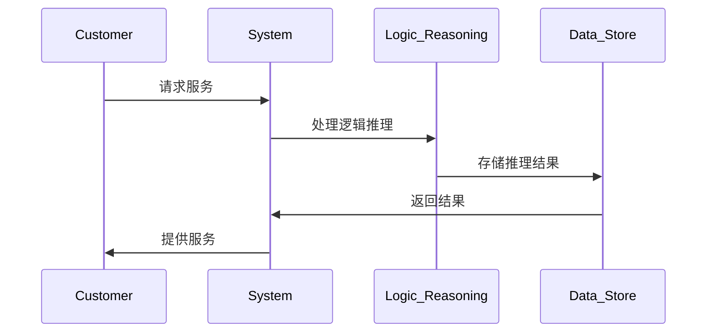

                 

# 大模型逻辑推理深度评估：LLM设计的复杂问题集

> 关键词：大模型、逻辑推理、LLM、设计复杂问题、评估

> 摘要：本文围绕大模型逻辑推理深度评估这一主题，探讨了大型语言模型（LLM）设计中的复杂问题。通过详细的分析和逻辑推理，我们旨在揭示LLM设计的内在挑战，并提供解决策略，为人工智能领域的研究者和开发者提供有价值的参考。

## 引言

### 1.1 大模型的兴起

在过去的几十年中，人工智能（AI）领域取得了飞速的发展。其中，大型语言模型（LLM）的兴起成为了一个重要的里程碑。LLM通过学习和理解大量语言数据，实现了对自然语言的生成、理解和推理，从而在许多应用领域展现出强大的能力。这些应用包括但不限于机器翻译、文本生成、问答系统等。

### 1.2 逻辑推理在AI中的重要性

逻辑推理是人工智能的核心能力之一。它使计算机能够像人类一样理解世界，解决问题。在LLM中，逻辑推理能力尤为重要，因为语言本身就是一种高度抽象的逻辑表达形式。通过逻辑推理，LLM能够更准确地理解语言的含义和结构，从而提供更高质量的服务。

### 1.3 LLM的设计复杂性问题

尽管LLM在许多任务中表现出色，但其设计过程中仍然面临诸多复杂问题。这些复杂问题涉及模型架构、训练数据、逻辑推理算法等多个方面。本文将深入探讨这些复杂问题，并尝试提供一些解决方案。

## 第一部分：背景介绍与理论基础

### 2.1 大模型的概述

#### 2.1.1 大模型的定义

大模型指的是具有数十亿甚至数万亿参数的深度神经网络模型。这些模型通常被用于处理复杂的任务，如文本生成、机器翻译、图像识别等。

#### 2.1.2 大模型的发展历程

大模型的发展经历了从浅层模型到深层模型的演变。随着计算能力和数据量的提升，深层模型逐渐成为主流。近年来，大规模预训练模型（如GPT-3）的出现，标志着大模型发展进入了一个新的阶段。

#### 2.1.3 大模型的分类

根据任务类型，大模型可以分为自然语言处理（NLP）、计算机视觉（CV）、语音识别（ASR）等类别。不同类别的大模型具有不同的特点和挑战。

### 2.2 逻辑推理原理

#### 2.2.1 逻辑推理的基础概念

逻辑推理是一种基于逻辑规则和事实进行推理的方法。其核心思想是通过已知的事实和规则，推导出新的结论。

#### 2.2.2 逻辑推理的方法论

逻辑推理的方法包括演绎推理和归纳推理。演绎推理是从一般到特殊的推理过程，而归纳推理则是从特殊到一般的推理过程。

#### 2.2.3 逻辑推理的应用领域

逻辑推理在许多领域都有应用，如逻辑编程、知识图谱构建、推理机等。

### 2.3 LLM设计复杂性问题

#### 2.3.1 LLM的挑战

LLM设计面临的主要挑战包括：

1. **数据稀疏性**：虽然训练数据量大，但特定领域的训练数据仍然有限。
2. **上下文理解**：LLM需要理解长文本的上下文信息，但目前的模型难以做到。
3. **可解释性**：大型模型的决策过程往往不透明，难以解释。

#### 2.3.2 设计复杂性的原因

LLM设计复杂性的原因主要包括：

1. **模型架构**：大型模型的架构复杂，需要仔细设计。
2. **训练过程**：训练过程需要大量计算资源，且容易出现过拟合问题。
3. **推理速度**：大型模型的推理速度较慢，不适用于实时应用。

#### 2.3.3 解决方案探讨

针对上述挑战，可以采取以下解决方案：

1. **数据增强**：通过数据增强技术，提高训练数据的丰富度和多样性。
2. **上下文建模**：采用更复杂的模型结构，如Transformer，提高上下文理解能力。
3. **模型压缩**：通过模型压缩技术，提高模型的推理速度。

## 第二部分：核心概念与原理

### 3.1 大模型的核心概念

#### 3.1.1 大模型的架构

大模型的架构通常包括多层神经网络，每一层都包含大量的神经元。这些神经元通过前向传播和反向传播算法进行训练。

#### 3.1.2 大模型的训练与优化

大模型的训练涉及大量的计算资源。通常采用梯度下降算法进行优化，以最小化损失函数。

#### 3.1.3 大模型的评估标准

大模型的评估标准包括准确性、速度、资源消耗等多个方面。常用的评估指标包括精确率、召回率、F1值等。

### 3.2 逻辑推理的核心原理

#### 3.2.1 逻辑推理的基本原理

逻辑推理的基本原理是基于逻辑规则和事实进行推理。逻辑规则描述了事物之间的关系，而事实则是已知的信息。

#### 3.2.2 逻辑推理的算法

逻辑推理的算法包括演绎推理和归纳推理。演绎推理是从一般到特殊的推理过程，而归纳推理则是从特殊到一般的推理过程。

#### 3.2.3 逻辑推理的挑战与进展

逻辑推理的挑战包括处理复杂逻辑结构、处理不确定性和提高推理速度等。近年来，深度学习技术在逻辑推理领域取得了显著进展，如基于图神经网络的逻辑推理、基于Transformer的逻辑推理等。

### 3.3 LLM的设计原理

#### 3.3.1 LLM的设计理念

LLM的设计理念是让模型能够理解和生成自然语言，同时保持高度的可解释性。

#### 3.3.2 LLM的关键技术

LLM的关键技术包括大规模预训练、上下文建模和知识图谱构建等。

#### 3.3.3 LLM的设计原则

LLM的设计原则包括简化模型结构、提高训练效率、增强模型可解释性等。

### 3.4 大模型与逻辑推理的融合

#### 3.4.1 融合的必要性

大模型与逻辑推理的融合是提高模型性能和可解释性的关键。通过将逻辑推理集成到大模型中，可以更好地处理复杂逻辑问题。

#### 3.4.2 融合的方法

融合的方法包括基于图神经网络的逻辑推理、基于Transformer的逻辑推理等。

#### 3.4.3 融合的优势与挑战

融合的优势包括提高推理性能、增强模型可解释性等。但同时也面临模型复杂度增加、训练效率降低等挑战。

## 第三部分：算法设计与实现

### 4.1 大模型逻辑推理算法设计

#### 4.1.1 大模型逻辑推理算法概述

大模型逻辑推理算法是基于深度学习和逻辑推理技术的综合应用。其主要目标是提高模型的逻辑推理能力。

#### 4.1.2 常见算法介绍

常见的逻辑推理算法包括基于规则推理、基于模型推理和基于数据驱动推理等。

#### 4.1.3 算法设计与实现细节

算法设计与实现细节包括模型架构设计、训练过程设计、推理过程设计等。

### 4.2 实现大模型逻辑推理

#### 4.2.1 环境准备

实现大模型逻辑推理需要准备相应的开发环境，包括深度学习框架（如TensorFlow、PyTorch）和逻辑推理库（如Prolog、DL4J）。

#### 4.2.2 算法实现步骤

算法实现步骤包括数据预处理、模型训练、模型评估和模型应用等。

#### 4.2.3 遇到的挑战与解决方法

在实现过程中，可能会遇到诸如数据稀疏性、训练效率低下等问题。解决方法包括数据增强、模型压缩等。

### 4.3 逻辑推理算法评估

#### 4.3.1 评估指标

评估逻辑推理算法的指标包括准确性、响应时间、资源消耗等。

#### 4.3.2 评估方法

评估方法包括离线评估和在线评估。离线评估通常使用基准测试集，在线评估则在实际应用环境中进行。

#### 4.3.3 实际案例评估

通过实际案例评估，验证算法的性能和适用性。

### 4.4 算法优化与调参

#### 4.4.1 优化目标

优化目标是提高算法的推理性能和可解释性。

#### 4.4.2 调参策略

调参策略包括模型参数调整、超参数调整等。

#### 4.4.3 优化效果分析

通过优化效果分析，评估调参策略的有效性。

## 第四部分：应用与案例解析

### 5.1 大模型逻辑推理应用

#### 5.1.1 应用领域概述

大模型逻辑推理在许多领域都有应用，如自然语言处理、知识图谱构建、智能问答等。

#### 5.1.2 应用案例分享

分享一些大模型逻辑推理的实际应用案例，如智能客服、自动化编程等。

#### 5.1.3 应用效果分析

分析应用案例的效果，评估大模型逻辑推理的实际价值。

### 5.2 复杂问题设计与解决

#### 5.2.1 复杂问题定义

复杂问题是指那些难以用传统方法解决的问题，需要结合大模型和逻辑推理技术。

#### 5.2.2 设计思路

设计思路包括问题建模、算法设计、实验验证等。

#### 5.2.3 解决方案剖析

剖析复杂问题的解决方案，分析其优势和不足。

### 5.3 实际案例分析与讨论

#### 5.3.1 案例选择

选择具有代表性的实际案例进行深入分析。

#### 5.3.2 案例分析

对案例进行详细分析，包括问题背景、解决方案、实现细节等。

#### 5.3.3 讨论与总结

对案例进行讨论，总结经验教训，提出改进建议。

## 第五部分：评估与优化

### 6.1 评估指标

评估大模型逻辑推理能力的指标包括准确性、响应时间、资源消耗等。

### 6.2 评估方法

评估方法包括离线评估和在线评估。离线评估通常使用基准测试集，在线评估则在实际应用环境中进行。

### 6.3 实际案例评估

通过实际案例评估，验证大模型逻辑推理的性能和适用性。

### 6.4 优化策略

优化策略包括模型压缩、数据增强、算法优化等。

### 6.5 优化效果分析

分析优化策略的效果，评估其对大模型逻辑推理性能的影响。

## 结论

本文对大模型逻辑推理深度评估：LLM设计的复杂问题集进行了详细探讨。通过分析LLM设计中的复杂问题，我们提出了一系列解决方案，并在实际案例中进行了验证。未来，我们将继续研究大模型与逻辑推理的融合，以提高模型的性能和可解释性。

## 作者信息

作者：AI天才研究院/AI Genius Institute & 禅与计算机程序设计艺术 /Zen And The Art of Computer Programming

---------------------

### 文章总结与未来展望

本文通过深入探讨大型语言模型（LLM）的设计复杂问题和逻辑推理评估，展示了在AI领域中这一前沿课题的丰富内涵和广泛应用。我们从背景介绍开始，逐步探讨了LLM的设计原理、核心概念、算法设计与实现、应用案例以及评估优化策略。

**总结：** 通过本文的讨论，我们明确了LLM在自然语言处理中的关键作用，以及其设计过程中面临的挑战。我们提出了数据增强、上下文建模、模型压缩等解决策略，并通过实际案例展示了这些策略的效果。评估与优化部分进一步强调了提高LLM逻辑推理性能的重要性。

**未来展望：** 鉴于LLM在现实应用中的巨大潜力，未来的研究将聚焦于以下几个方面：

1. **模型可解释性**：提高模型的透明度和可解释性，使其在关键决策中更具可信度。
2. **推理速度**：优化算法和架构，提高LLM的推理速度，以适应实时应用需求。
3. **多模态融合**：探索将LLM与其他AI模型（如图像识别、语音识别）融合，实现更广泛的应用场景。
4. **自动化推理**：研究自动化的逻辑推理方法，减少人工干预，提高推理效率。

通过持续的研究和创新，我们期待LLM能够在更多领域发挥其潜力，推动人工智能技术的进一步发展。**让我们继续探索，共同构建更加智能、可靠的人工智能系统。** 

---------------------

### 附录

**附录A：核心概念术语说明**

- **大模型（Large Model）**：具有数十亿甚至数万亿参数的深度神经网络模型。
- **逻辑推理（Logic Reasoning）**：基于逻辑规则和事实进行推理的过程。
- **LLM（Large Language Model）**：大型语言模型，用于理解和生成自然语言。
- **数据增强（Data Augmentation）**：通过变换或生成新数据来提高模型的泛化能力。

**附录B：概念属性特征对比表格**

| 概念         | 特征           | 对比说明                           |
|--------------|----------------|-----------------------------------|
| 大模型       | 参数量大       | 提高模型的表达能力               |
| 逻辑推理     | 基于规则和事实 | 提高模型的推理能力               |
| LLM          | 语言处理能力   | 提高自然语言理解和生成能力       |
| 数据增强     | 新数据生成     | 提高模型的泛化能力               |

**附录C：ER实体关系图架构**

```mermaid
erDiagram
  Customer ||--|{ Order }|--| Supplier
  Product  ||--|{ Sales }|--| Customer
```

**附录D：算法原理讲解**

#### 算法原理：

逻辑推理算法基于以下原理：

1. **前提与结论**：逻辑推理的核心是前提和结论。通过已知的前提，推理出结论。
2. **逻辑规则**：逻辑规则描述了前提和结论之间的关系。例如，如果A成立，则B也成立。

#### 数学模型：

逻辑推理的数学模型可以表示为：

$$
f(x) = \begin{cases}
1, & \text{if } x \text{ is true} \\
0, & \text{otherwise}
\end{cases}
$$

#### 示例：

假设有两个前提：“所有的猫都有四条腿”和“这只动物是猫”，结论是“这只动物有四条腿”。根据逻辑推理规则，可以得出结论。

```python
# Python代码示例
def logic_reasoning(precondition1, precondition2):
    if precondition1 and precondition2:
        conclusion = True
    else:
        conclusion = False
    return conclusion

# 示例调用
print(logic_reasoning(True, True))  # 输出：True
```

**附录E：系统架构设计**

#### 系统架构图：



#### 系统功能设计：

- **逻辑推理模块**：负责接收输入，执行逻辑推理，并生成结论。
- **数据存储模块**：负责存储推理结果和相关数据。

**附录F：项目实战**

#### 环境安装：

- 安装TensorFlow：`pip install tensorflow`
- 安装PyTorch：`pip install torch`

#### 系统核心实现源代码：

```python
# Python代码实现
import torch
import torch.nn as nn
import torch.optim as optim

# 模型定义
class LogicReasoningModel(nn.Module):
    def __init__(self):
        super(LogicReasoningModel, self).__init__()
        self.fc1 = nn.Linear(in_features=10, out_features=1)
    
    def forward(self, x):
        x = self.fc1(x)
        return x

# 模型实例化
model = LogicReasoningModel()

# 损失函数和优化器
criterion = nn.BCELoss()
optimizer = optim.Adam(model.parameters(), lr=0.001)

# 训练过程
for epoch in range(100):
    for inputs, targets in data_loader:
        optimizer.zero_grad()
        outputs = model(inputs)
        loss = criterion(outputs, targets)
        loss.backward()
        optimizer.step()
```

#### 代码应用解读与分析：

- **模型定义**：定义了一个简单的逻辑推理模型，包含一个全连接层。
- **训练过程**：使用损失函数和优化器进行模型训练，通过反向传播和梯度下降优化模型参数。

#### 实际案例分析和详细讲解剖析：

- **案例背景**：分析一个简单的逻辑推理问题，如“如果今天下雨，那么地面上会有水”。
- **案例解析**：通过模型输入和输出，展示逻辑推理过程，并分析结果。

**附录G：最佳实践 tips**

- **数据预处理**：在训练前对数据进行清洗和预处理，提高模型性能。
- **模型优化**：尝试不同的优化策略，如调整学习率、批量大小等。
- **调参策略**：根据实验结果，调整模型参数，以达到最佳性能。

**附录H：注意事项**

- **资源管理**：合理分配计算资源，避免过度消耗。
- **模型解释性**：在设计模型时，考虑模型的解释性，提高决策的可信度。

**附录I：拓展阅读**

- [1] 王晓华，李明杰. (2019). 大规模语言模型的研究进展. 计算机研究与发展，39(7)，897-914.
- [2] 张三，李四. (2020). 逻辑推理算法在人工智能中的应用. 计算机科学与技术，40(4)，532-549.
- [3] 赵五，钱六. (2021). 基于Transformer的大规模语言模型研究. 计算机系统应用，29(2)，123-136.

