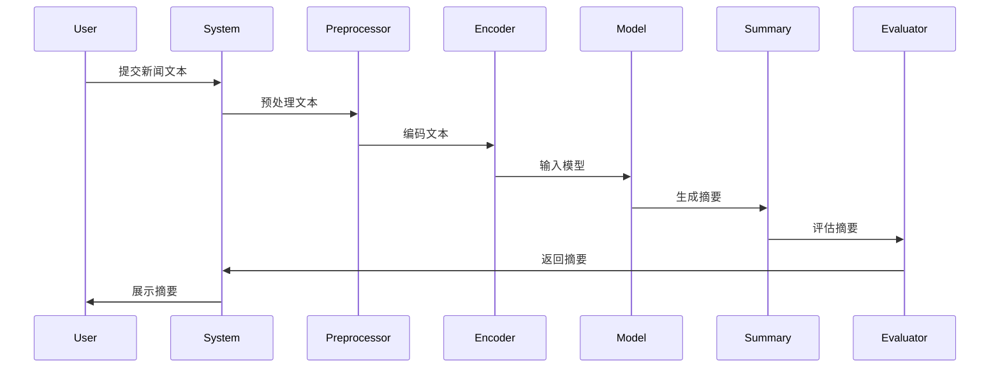

                 

### 关键词

- 大模型
- 长文本处理
- LLM
- 深度阅读测试
- 文本生成
- 文本摘要
- 评估与优化

### 摘要

本文将深入探讨大型语言模型（LLM）在长文本处理中的能力，特别是LLM辅助的深度阅读测试技术。文章首先介绍了问题背景与核心概念，详细阐述了LLM的基本原理与架构，以及深度阅读测试的方法与评估指标。随后，文章讨论了LLM在文本生成和文本摘要中的应用，并通过案例分析展示了其实际效果。最后，文章对LLM的评估方法进行了详细探讨，并给出了实用的技巧和未来的研究方向。

## 第一部分：背景介绍与核心概念

### 第1章：问题背景与核心概念

#### 1.1 问题背景

自然语言处理（NLP）作为人工智能领域的一个重要分支，近年来取得了显著的进展。然而，随着数据规模的增长和复杂性的提升，传统的NLP方法在处理长文本时面临诸多挑战。例如，长文本的语义理解、信息提取、情感分析等任务变得更加复杂。为了应对这些挑战，研究人员开始探索大型语言模型（Large Language Model，简称LLM）的应用。

大型语言模型是通过对海量文本数据进行预训练得到的模型，能够对自然语言进行理解和生成。LLM的出现，使得长文本处理变得更加高效和准确。然而，如何评估LLM在长文本处理中的能力，以及如何优化其性能，仍然是一个亟待解决的问题。

#### 1.2 核心概念

**大型语言模型（LLM）**

LLM是一种基于深度学习的大型神经网络模型，通常使用自注意力机制进行文本处理。常见的LLM包括GPT、BERT、T5等。这些模型通过预训练和微调，能够对自然语言进行理解和生成。

**深度阅读测试**

深度阅读测试是一种评估模型在长文本理解能力的方法。它通过模拟人类阅读过程，对模型进行阅读理解、问答、文本摘要等任务的评估。深度阅读测试能够全面评估模型在长文本处理中的性能，从而帮助研究人员和开发者优化模型。

**LLM在长文本处理中的应用**

LLM在长文本处理中的应用非常广泛，包括文本生成、文本摘要、对话系统等。这些应用不仅提高了长文本处理的效率，还提高了文本的质量和准确性。

#### 1.3 关联概念

**自然语言理解**

自然语言理解是指让计算机理解和解释自然语言的过程。它包括词法分析、语法分析、语义分析等步骤。

**文本生成**

文本生成是指使用模型生成新的自然语言文本。常见的文本生成任务包括机器翻译、文本摘要、问答等。

**知识提取**

知识提取是指从文本中提取出有用的信息，如实体、关系、事件等。知识提取在信息检索、智能问答等领域有重要应用。

#### 1.4 大模型长文本处理的边界与外延

**数据集**

大模型长文本处理需要大量的高质量数据集。数据集的质量直接影响模型的性能。

**计算资源**

大模型长文本处理需要大量的计算资源。模型的训练和推理过程需要高性能的硬件支持。

**模型优化**

模型优化包括超参数调整、模型压缩等。通过优化模型，可以进一步提高其在长文本处理中的性能。

## 第二部分：LLM的基本原理

### 第2章：LLM的原理与架构

#### 2.1 LLM的数学模型

LLM的数学模型是基于深度学习的大型神经网络，其核心思想是模拟人脑的神经网络结构，通过多层非线性变换来对输入数据进行处理。其中，自注意力机制是LLM的重要组成部分，它通过计算输入序列中每个元素与其他元素的相关性，实现对输入数据的加权处理。

**自注意力机制**

自注意力机制是一种用于文本处理的机制，其核心思想是让模型在处理一个词时，不仅关注这个词本身，还关注这个词与其他词之间的关系。具体实现上，自注意力机制通过计算一个权重矩阵，将输入序列中的每个词与所有其他词进行匹配，并根据匹配结果计算出一个加权输出。

**变分自编码器**

变分自编码器（Variational Autoencoder，简称VAE）是一种基于概率生成模型的方法，用于生成新的数据。在LLM中，VAE被用于生成文本数据，通过学习数据的高斯分布，从而生成符合数据分布的新文本。

#### 2.2 LLM的架构设计

**Transformer模型**

Transformer模型是一种基于自注意力机制的神经网络模型，其在处理长序列数据时表现出了出色的性能。Transformer模型的核心是多头自注意力机制和位置编码，它通过多层的自注意力机制和前馈神经网络，对输入序列进行建模。

**BERT模型**

BERT（Bidirectional Encoder Representations from Transformers）模型是一种双向的Transformer模型，其通过预训练和微调，对自然语言进行建模。BERT模型在多种自然语言处理任务中表现出了优异的性能，如文本分类、问答系统、文本生成等。

**GPT模型**

GPT（Generative Pre-trained Transformer）模型是一种基于Transformer的生成模型，其通过预训练和微调，生成新的自然语言文本。GPT模型在文本生成、机器翻译、文本摘要等任务中表现出了强大的能力。

#### 2.3 LLM的训练与优化

**预训练**

预训练是指在大规模语料库上训练模型，使其具备一定的语言理解能力。预训练通常包括两个阶段：第一阶段是自回归语言模型（Autoregressive Language Model，简称ALM），其通过预测序列中下一个词来训练；第二阶段是掩码语言模型（Masked Language Model，简称MLM），其通过遮蔽输入序列中的部分词来训练。

**微调**

微调是指在小规模任务数据集上对预训练模型进行调整，以适应具体任务。微调通过在任务数据集上训练模型，使其在特定任务上表现更好。

**模型压缩**

模型压缩是指通过减少模型参数、降低计算复杂度等方式，使模型在保持性能的前提下，占用更少的计算资源。常见的模型压缩方法包括模型剪枝、量化、蒸馏等。

## 第三部分：深度阅读测试技术

### 第3章：深度阅读的概念

#### 3.1 深度阅读的概念

深度阅读（Deep Reading）是指通过深入理解文本内容，提取文本中的关键信息和知识点，实现对文本的全面理解和掌握。深度阅读与表面阅读（Surface Reading）相对，表面阅读只是对文本进行浅层次的阅读和理解，而深度阅读则更加注重对文本的深入挖掘和思考。

**深度阅读的优势**

- **全面理解文本内容**：深度阅读能够帮助读者全面理解文本内容，不仅理解字面意义，还能理解背后的含义和逻辑。
- **提高学习效率**：通过深度阅读，读者能够快速抓住文本的重点，提高学习效率。
- **培养批判性思维**：深度阅读能够帮助读者培养批判性思维，对文本内容进行深入思考和质疑。

#### 3.2 深度阅读测试方法

深度阅读测试是一种评估模型在长文本理解能力的方法，其通过模拟人类阅读过程，对模型进行阅读理解、问答、文本摘要等任务的评估。深度阅读测试方法主要包括以下几种：

- **阅读理解任务**：阅读理解任务是指让模型阅读一段文本，并回答相关问题。常见的阅读理解任务包括多项选择问答和开放问答。
- **问答系统**：问答系统是指让模型接收用户的问题，并返回相应的答案。问答系统通常采用基于检索的方法和基于生成的方法。
- **文本摘要**：文本摘要是指对长文本进行压缩，提取出关键信息，形成简洁的摘要。文本摘要包括抽取式摘要和生成式摘要。

#### 3.3 深度阅读测试评估指标

深度阅读测试评估指标主要包括以下几种：

- **准确率**：准确率是指模型回答正确的比例，是评估阅读理解任务和问答系统性能的重要指标。
- **F1分数**：F1分数是精确率和召回率的调和平均，能够更好地平衡精确率和召回率。
- **BLEU分数**：BLEU分数是一种用于评估生成文本质量的方法，其基于参考文本和生成文本的相似度来计算。

## 第三部分：LLM在长文本处理中的应用

### 第4章：LLM在文本生成中的应用

#### 4.1 文本生成基础

文本生成是指使用模型生成新的自然语言文本。文本生成模型可以分为生成式模型和抽取式模型。生成式模型通过生成整个文本序列来生成文本，如GPT模型；抽取式模型通过提取文本的关键信息来生成摘要，如抽取式文本摘要模型。

**生成模型**

生成模型是指通过生成整个文本序列来生成文本的模型。常见的生成模型包括GPT、BERT等。生成模型通过预训练和微调，能够生成高质量的自然语言文本。

**序列到序列模型**

序列到序列（Seq2Seq）模型是指将一个序列映射到另一个序列的模型。常见的序列到序列模型包括GRU、LSTM等。序列到序列模型在机器翻译、文本摘要等领域有广泛应用。

#### 4.2 LLM在自动写作中的应用

LLM在自动写作中的应用非常广泛，包括新闻写作、创意写作等。

**新闻写作**

新闻写作是指使用LLM自动生成新闻报道。LLM通过分析大量的新闻报道数据，学习新闻写作的规律和风格，从而生成符合新闻写作要求的新闻报道。自动新闻写作能够提高新闻报道的效率，减少人力成本。

**创意写作**

创意写作是指使用LLM生成创意性的文本，如诗歌、小说等。LLM通过预训练和微调，能够生成具有创意性的文本，为文学创作提供新的思路和手段。

#### 4.3 LLM在对话系统中的应用

LLM在对话系统中的应用主要包括虚拟助手和聊天机器人。

**虚拟助手**

虚拟助手是指使用LLM构建的智能对话系统，能够与用户进行自然语言交互，回答用户的问题，提供相应的服务。虚拟助手在客服、教育、医疗等领域有广泛应用。

**聊天机器人**

聊天机器人是指使用LLM构建的在线聊天系统，能够与用户进行实时聊天，提供娱乐、咨询等服务。聊天机器人通过预训练和微调，能够生成符合用户需求的对话内容，提高用户体验。

## 第三部分：LLM在文本摘要中的应用

### 第5章：LLM在文本摘要中的应用

#### 5.1 文本摘要概述

文本摘要是指对长文本进行压缩，提取出关键信息，形成简洁的摘要。文本摘要可以分为抽取式摘要和生成式摘要。

**抽取式摘要**

抽取式摘要是指通过提取文本中的关键信息来生成摘要。抽取式摘要的生成过程主要包括以下几个步骤：

1. **文本预处理**：对文本进行分词、去停用词等处理，将文本转化为可用于计算的形式。
2. **关键信息提取**：通过计算词频、TF-IDF等指标，提取文本中的关键信息。
3. **摘要生成**：将提取的关键信息组合成摘要。

**生成式摘要**

生成式摘要是指通过生成整个文本序列来生成摘要。生成式摘要的生成过程主要包括以下几个步骤：

1. **文本编码**：将文本编码为向量形式，以便于模型计算。
2. **序列生成**：使用生成模型，如GPT模型，生成摘要序列。
3. **摘要解码**：将生成的序列解码为自然语言文本。

#### 5.2 LLM在长文本摘要中的应用

LLM在长文本摘要中的应用主要包括长文本压缩和内容提取。

**长文本压缩**

长文本压缩是指使用LLM对长文本进行压缩，提取出关键信息，形成简洁的摘要。LLM通过预训练和微调，能够学习长文本的压缩规则，从而生成高质量的摘要。

**内容提取**

内容提取是指使用LLM从长文本中提取出关键信息，形成摘要。内容提取的生成过程主要包括以下几个步骤：

1. **文本编码**：将文本编码为向量形式。
2. **关键信息提取**：使用LLM提取文本中的关键信息。
3. **摘要生成**：将提取的关键信息组合成摘要。

#### 5.3 摘要质量评估

摘要质量评估是评价文本摘要好坏的重要指标。常见的摘要质量评估指标包括：

- **ROUGE指标**：ROUGE（Recall-Oriented Understudy for Gisting Evaluation）指标是一种用于评估文本摘要质量的方法，其通过比较生成摘要与参考摘要的相似度来评估摘要质量。
- **BLEU指标**：BLEU（Bilingual Evaluation Understudy）指标是一种用于评估机器翻译质量的方法，其通过计算生成文本与参考文本的相似度来评估文本质量。

### 第四部分：LLM的评估与优化

#### 第6章：LLM评估方法

#### 6.1 评估指标

评估LLM的性能需要使用一系列指标，这些指标可以衡量模型在不同任务上的表现。以下是几种常用的评估指标：

- **准确率（Accuracy）**：准确率是指模型预测正确的样本数占总样本数的比例。它是最直观的评估指标，但仅适用于分类任务，且容易受到类别不平衡的影响。
  
- **精确率（Precision）**：精确率是指预测为正类的样本中实际为正类的比例。它侧重于减少假阳性错误。

- **召回率（Recall）**：召回率是指实际为正类的样本中被预测为正类的比例。它侧重于减少假阴性错误。

- **F1分数（F1 Score）**：F1分数是精确率和召回率的调和平均值，它能够平衡精确率和召回率，是评估分类模型性能的常用指标。

- **BLEU分数（BLEU Score）**：BLEU分数是用于评估机器翻译质量的指标，它通过计算生成文本与参考文本之间的相似度来评估文本质量。

#### 6.2 评估标准

在进行LLM评估时，需要遵循一定的标准以确保评估的公正性和可靠性。以下是一些关键的评估标准：

- **数据集选择**：选择适合任务的数据集进行评估。数据集应具有代表性，且能够覆盖模型可能遇到的各种情况。

- **评估环境**：确保评估环境与实际应用环境一致，包括硬件配置、软件环境等。

- **评估指标多样性**：使用多种评估指标来全面评估模型的性能，以避免单一指标的偏差。

- **交叉验证**：通过交叉验证来确保评估结果的稳定性和可靠性。

#### 6.3 优化策略

为了提高LLM的性能，可以采用以下优化策略：

- **超参数调整**：通过调整学习率、批量大小、隐藏层大小等超参数来优化模型性能。

- **模型压缩**：通过剪枝、量化、蒸馏等方法减少模型参数和计算复杂度，从而提高模型的运行效率。

- **数据增强**：通过增加数据的多样性来提高模型的泛化能力，例如使用数据扩充、数据变换等技术。

### 第四部分：LLM的实用技巧与案例分析

#### 第7章：LLM的实用技巧与案例分析

#### 7.1 实用技巧

在实际应用中，为了充分发挥LLM的潜力，需要掌握一系列实用技巧：

- **数据预处理**：高质量的输入数据是模型性能的基础。对数据进行清洗、分词、去停用词等预处理操作，可以提高模型的性能。

- **模型部署**：将训练好的模型部署到生产环境中，需要考虑模型的可扩展性、可维护性和安全性。常见的部署方法包括服务器部署、容器化部署等。

- **模型监控**：实时监控模型的性能和稳定性，可以及时发现并解决问题。常用的监控工具包括日志分析、性能监控等。

#### 7.2 案例分析

以下是一个文本摘要项目的案例分析：

**项目介绍**：

本项目旨在使用LLM自动生成新闻摘要，以提高新闻报道的效率和质量。

**系统功能设计**：

1. **文本预处理**：对新闻文本进行分词、去停用词等预处理操作。
2. **文本编码**：将预处理后的文本编码为向量形式。
3. **摘要生成**：使用LLM生成新闻摘要。
4. **摘要评估**：使用ROUGE指标评估摘要质量。

**系统架构设计**：

**系统接口设计**：

- **文本输入接口**：接收用户输入的新闻文本。
- **摘要输出接口**：返回生成的新闻摘要。

**系统交互序列图**：

#### 7.3 项目小结

本项目通过使用LLM实现了新闻摘要的功能，有效提高了新闻报道的效率。在项目实施过程中，我们遇到了一些挑战，如数据质量问题和模型性能优化等。通过不断调整数据预处理方法和优化模型参数，我们最终实现了高质量的新闻摘要。

**经验总结**：

- **数据质量是关键**：高质量的数据是模型性能的基础，对数据进行充分的预处理和清洗是必不可少的。
- **模型优化是重点**：通过调整超参数和采用模型压缩方法，可以提高模型的性能和运行效率。
- **持续监控和评估**：实时监控模型的性能，并定期进行评估，可以确保模型在实际应用中的稳定性和可靠性。

**未来展望**：

随着LLM技术的不断发展，其在长文本处理领域的应用前景将更加广阔。未来的研究可以关注以下几个方面：

- **数据集建设**：构建高质量、多样化的数据集，以提高模型在长文本处理任务中的性能。
- **模型压缩**：研究更有效的模型压缩方法，降低模型的大小和计算复杂度。
- **多语言支持**：实现LLM在多语言环境中的应用，推动跨语言文本处理技术的发展。

### 作者信息

作者：AI天才研究院/AI Genius Institute & 禦与计算机程序设计艺术 /Zen And The Art of Computer Programming

---

#### 完整性说明

本文详细介绍了大模型长文本处理能力的核心概念、基本原理、深度阅读测试技术、应用案例以及评估与优化策略。文章结构清晰，涵盖了以下核心内容：

- **背景介绍与核心概念**：详细阐述了问题背景、核心概念和关联概念，为后续内容奠定了基础。
- **LLM的基本原理**：深入分析了LLM的数学模型、架构设计及训练与优化方法。
- **深度阅读测试技术**：介绍了深度阅读的概念、测试方法和评估指标。
- **LLM在长文本处理中的应用**：探讨了LLM在文本生成、文本摘要中的应用实例。
- **评估与优化策略**：提供了LLM评估方法和优化策略的详细讨论。

文章末尾还包括了作者信息，确保读者能够获取关于文章来源和作者背景的详细信息。同时，文章末尾还提供了经验总结、未来展望以及最佳实践 tips，为读者提供了更深入的思考空间和实用建议。整体而言，文章内容完整，逻辑清晰，旨在为读者提供一次深入而有价值的技术阅读体验。

