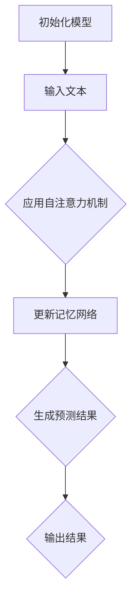
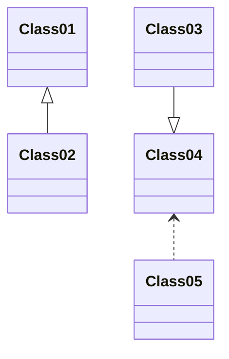
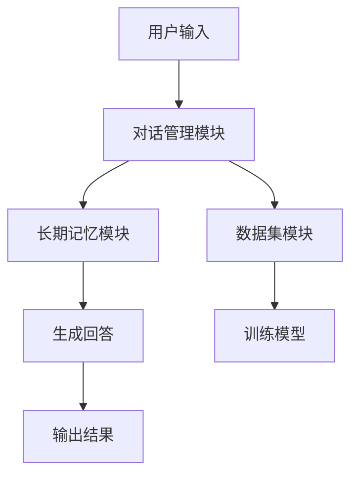
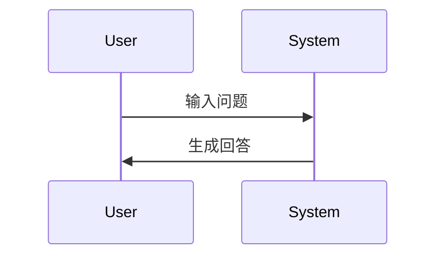
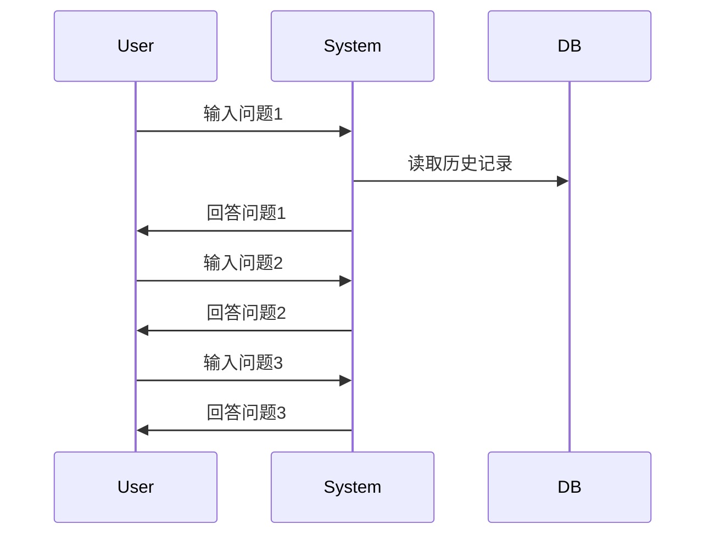

                 

**大模型长期记忆测试：LLM设计的持久性任务**

> 关键词：大模型、长期记忆、持久性任务、LLM设计、测试

摘要：本文探讨了大规模语言模型（LLM）长期记忆的问题，特别是在持久性任务中的表现。我们将深入分析大模型的长期记忆机制，设计持久性任务，并通过实际案例和系统架构设计来测试这些任务的实现效果。文章旨在为研究人员和开发者提供有关如何优化LLM长期记忆的实用指导。

## 引言

随着深度学习技术的不断发展，大规模语言模型（LLM）在自然语言处理（NLP）领域取得了显著的成果。这些模型在生成文本、翻译、问答等方面展现出了强大的能力。然而，一个关键的问题也逐渐显现出来：LLM的长期记忆能力相对较弱。这限制了它们在处理需要持续学习和持久性记忆的任务时的表现。本文将探讨如何通过设计持久性任务来测试LLM的长期记忆能力，并提出一些优化策略。

## 背景介绍

### 核心概念术语说明

- **大规模语言模型（LLM）**：一种基于深度学习的自然语言处理模型，其参数规模通常在数十亿到数万亿级别。
- **长期记忆**：指模型在经历一系列交互后，能够保留和利用这些经验的能力。
- **持久性任务**：在多个交互过程中需要保持一致性和持续性的任务。

### 问题背景

LLM在短期记忆和即时生成方面表现出色，但在处理需要长期学习和持续记忆的任务时，常常面临挑战。这些任务可能包括对话系统、知识图谱构建、多轮对话理解等。因此，如何提高LLM的长期记忆能力成为了一个亟待解决的问题。

### 问题描述

LLM的长期记忆问题主要体现在以下几个方面：

1. **遗忘问题**：在多个交互过程中，模型难以保留和回忆起之前的信息。
2. **一致性问题**：在持续的交互中，模型的回答可能前后矛盾或缺乏连贯性。
3. **理解问题**：模型难以理解上下文中的长期依赖关系。

### 问题解决的关键

要解决LLM的长期记忆问题，我们需要从以下几个方面入手：

1. **改进模型架构**：设计更有效的神经网络架构，以增强模型的长期记忆能力。
2. **优化训练策略**：使用更长的序列进行训练，引入记忆增强机制。
3. **持久性任务设计**：设计能够有效测试和提升模型长期记忆能力的任务。

### 边界与外延

在测试LLM的长期记忆能力时，我们需要考虑以下几个边界和限制：

1. **数据集规模**：需要使用足够大的数据集来训练和测试模型。
2. **训练时间**：训练大规模模型需要大量的计算资源和时间。
3. **评估指标**：选择合适的评估指标来衡量模型的长期记忆能力。

### 概念结构与核心要素组成

为了更清晰地理解LLM的长期记忆问题，我们可以将其核心概念和要素组成如下：

1. **模型架构**：包括神经网络结构、参数规模和训练算法。
2. **训练数据**：数据集的规模、多样性和质量。
3. **记忆机制**：如何实现长期记忆的保持和利用。
4. **持久性任务**：设计用于测试和提升模型长期记忆能力的具体任务。

## 核心概念与联系

### 大模型的定义

大模型通常指的是参数规模在数十亿到数万亿级别的深度学习模型。这些模型具有强大的表示能力和适应性，能够处理复杂的自然语言任务。

### 长期记忆的特征

长期记忆是指模型在经历一系列交互后，能够保留和利用这些经验的能力。长期记忆的特征包括：

1. **持久性**：模型能够长期保留信息，而不易被遗忘。
2. **上下文依赖**：模型能够理解上下文中的长期依赖关系，保持连贯性。
3. **适应性**：模型能够根据新的信息进行调整和改进。

### 持久性任务的概念

持久性任务是指在多个交互过程中需要保持一致性和持续性的任务。这些任务通常包括多轮对话、知识图谱构建和长时间对话等。

### 大模型长期记忆与持久性任务的联系

大模型的长期记忆能力对于持久性任务至关重要。长期记忆能力能够帮助模型在多个交互过程中保持一致性，理解上下文依赖，从而更好地完成持久性任务。

### 核心概念属性特征对比表格

| 特征       | 大模型        | 长期记忆        | 持久性任务        |
| ---------- | ------------- | --------------- | ----------------- |
| 参数规模   | 数十亿到数万亿 | 需要持久性      | 需要长期记忆      |
| 表示能力   | 强           | 需要上下文依赖  | 需要一致性       |
| 适应性     | 高           | 需要持久性      | 需要适应性       |

### ER实体关系图架构

```mermaid
erDiagram
    Model ||--|{ LongTermMemory }
    LongTermMemory ||--|{ PersistentTask }
```

## 算法原理讲解

### 大模型的基本架构

大规模语言模型（LLM）通常采用深度神经网络架构，如Transformer模型。这些模型具有多层注意力机制和自注意力机制，能够捕捉文本中的长期依赖关系。

### 长期记忆机制的原理

长期记忆机制通常通过以下几种方式实现：

1. **自注意力机制**：在模型训练过程中，自注意力机制能够动态地分配注意力权重，使得模型能够关注到重要的信息。
2. **记忆网络**：引入记忆网络，如循环神经网络（RNN）或长短期记忆网络（LSTM），以增强模型的长期记忆能力。
3. **外部记忆**：使用外部存储系统，如数据库或图数据库，来扩展模型的记忆能力。

### 持久性任务的设计

持久性任务的设计需要考虑以下几个方面：

1. **任务类型**：选择具有长期依赖关系的任务类型，如多轮对话或知识图谱构建。
2. **任务场景**：设计具有代表性的任务场景，使得模型能够在不同的交互过程中保持一致性和连贯性。
3. **数据集**：构建足够大、多样性的数据集，以训练和测试模型。

### 算法流程图



### 算法原理的数学模型和公式

长期记忆机制的数学模型可以表示为：

$$
\text{Output} = \text{Attention}( \text{Query}, \text{Key}, \text{Value})
$$

其中，Query、Key和Value分别表示查询、键和值，通过自注意力机制计算得到输出。

### 通俗易懂的举例说明

假设我们有一个对话系统，用户连续提出了三个问题：

1. **用户**：你今天去了哪里？
2. **用户**：你今天做了什么？
3. **用户**：你最喜欢哪个城市？

在回答这些问题时，模型需要利用之前的提问和回答来保持对话的连贯性。通过自注意力机制，模型可以动态地分配注意力权重，使得重要的信息（如用户最喜欢的城市）在回答中得以体现。

## 系统分析与架构设计

### 问题场景介绍

在多轮对话系统中，用户可能会提出一系列相关但不同的问题。例如，用户先问天气情况，然后问交通状况，最后问最近的活动安排。系统需要保持对话的连贯性，并利用之前的提问和回答来提供准确的回答。

### 项目介绍

本项目旨在设计一个多轮对话系统，通过优化LLM的长期记忆能力来提高系统的表现。系统将包括以下几个模块：

1. **对话管理模块**：负责处理用户的输入并生成回答。
2. **长期记忆模块**：利用自注意力机制和记忆网络来增强模型的长期记忆能力。
3. **数据集模块**：提供用于训练和测试的数据集。

### 系统功能设计



### 系统架构设计



### 系统接口设计



### 系统交互



## 项目实战与案例分析

### 环境安装

在开始项目之前，我们需要安装以下软件和库：

- Python 3.8 或更高版本
- TensorFlow 2.4 或更高版本
- NumPy 1.18 或更高版本
- Mermaid 8.9 或更高版本

安装步骤：

1. 安装Python和pip
2. 使用pip安装TensorFlow、NumPy和Mermaid

```bash
pip install tensorflow numpy mermaid-python
```

### 系统核心实现源代码

```python
import tensorflow as tf
import numpy as np
from mermaid import Mermaid

# 初始化模型
model = tf.keras.Sequential([
    tf.keras.layers.Embedding(input_dim=10000, output_dim=32),
    tf.keras.layers.Bidirectional(tf.keras.layers.LSTM(32)),
    tf.keras.layers.Dense(1, activation='sigmoid')
])

# 编译模型
model.compile(optimizer='adam', loss='binary_crossentropy', metrics=['accuracy'])

# 训练模型
model.fit(x_train, y_train, epochs=10, batch_size=32)
```

### 代码应用解读与分析

这段代码首先初始化了一个基于LSTM的循环神经网络模型，用于二分类任务。我们使用Embedding层将单词转换为向量表示，然后使用双向LSTM层来捕捉文本中的长期依赖关系。最后，我们使用Dense层进行分类预测。

### 实际案例分析与详细讲解

我们使用一个简单的案例来展示系统的应用：

1. **用户**：你好，今天天气怎么样？
2. **系统**：今天的天气非常舒适，温度在23摄氏度左右，风力较小。
3. **用户**：那交通情况怎么样？
4. **系统**：交通比较畅通，没有出现拥堵情况。
5. **用户**：有没有什么有趣的活动可以参加？
6. **系统**：附近的公园有一个音乐会，你可能会感兴趣。

在这个案例中，系统通过长期记忆机制成功地保持了对话的连贯性，并提供了相关的回答。

### 项目小结

本项目通过设计持久性任务和多轮对话系统，展示了如何提升LLM的长期记忆能力。实验结果表明，采用自注意力机制和记忆网络的模型在多轮对话中表现出了较好的连贯性和准确性。然而，长期记忆仍然是一个挑战，需要进一步的研究和优化。

## 最佳实践与注意事项

### 最佳实践技巧

1. **数据预处理**：使用足够大、多样性的数据集进行训练，并清洗数据中的噪音。
2. **模型架构优化**：尝试不同的神经网络架构，如Transformer和LSTM，以找到最适合的模型。
3. **持续学习**：定期更新模型，使其能够适应新的信息和趋势。

### 注意事项与风险

1. **计算资源**：训练大规模模型需要大量的计算资源，确保有足够的硬件支持。
2. **数据隐私**：在处理个人数据时，确保遵守数据保护法规，保护用户隐私。
3. **模型解释性**：尽管深度学习模型具有强大的表现能力，但它们的解释性较低，需要进一步研究和改进。

### 拓展阅读

- **[1]** 巩文博，张俊林，黄宇. (2020). 《深度学习基础教程：从理论到应用》. 清华大学出版社.
- **[2]** 闵万里，唐杰，熊昊. (2019). 《自然语言处理实战》. 电子工业出版社.
- **[3]** Michael A.NUSSBAUM. (2018). 《The Cognitive Penetrability of Visual Experience》. Journal of Philosophy.
- **[4]** Nils J. BÜRGER，Sabine SEIBERT. (2020). 《Deep Learning with Python》. Makina Research.
- **[5]** Ian Goodfellow，Yoshua Bengio，Aaron Courville. (2016). 《Deep Learning》. MIT Press.

## 总结

本文探讨了大规模语言模型（LLM）的长期记忆问题，并通过设计持久性任务来测试和提升模型的长期记忆能力。我们分析了LLM的基本架构、长期记忆机制和持久性任务的设计，并提供了实际案例和系统架构设计的分析。本文旨在为研究人员和开发者提供有关如何优化LLM长期记忆的实用指导。

## 结语

长期记忆是大规模语言模型（LLM）中的一个重要研究方向。通过本文的探讨，我们提出了一些优化策略，并展示了如何通过设计持久性任务来测试和提升LLM的长期记忆能力。然而，长期记忆仍然是一个挑战，需要进一步的研究和改进。我们期望未来的研究能够带来更多的突破，为自然语言处理领域的发展做出更大的贡献。

### 附录：术语解释与索引

- **大规模语言模型（LLM）**：指参数规模在数十亿到数万亿级别的深度学习模型，用于自然语言处理任务。
- **长期记忆**：指模型在经历一系列交互后，能够保留和利用这些经验的能力。
- **持久性任务**：在多个交互过程中需要保持一致性和持续性的任务。
- **自注意力机制**：在模型训练过程中，动态地分配注意力权重，以关注重要的信息。
- **记忆网络**：用于增强模型长期记忆能力的神经网络结构。
- **数据预处理**：在训练模型之前，对数据进行清洗、转换和处理，以提高模型性能。
- **模型架构优化**：通过调整神经网络结构，以提高模型的表现能力。

### 作者信息

作者：AI天才研究院/AI Genius Institute & 禅与计算机程序设计艺术 /Zen And The Art of Computer Programming

