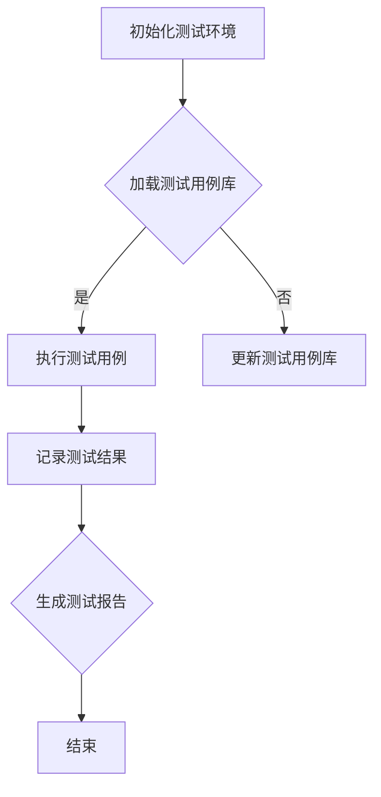
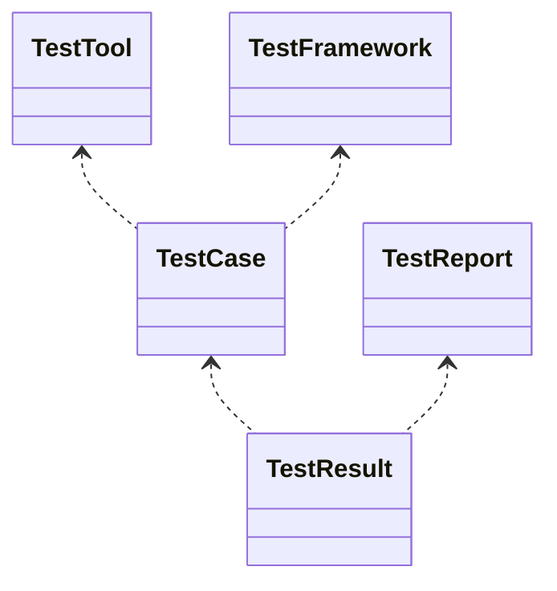
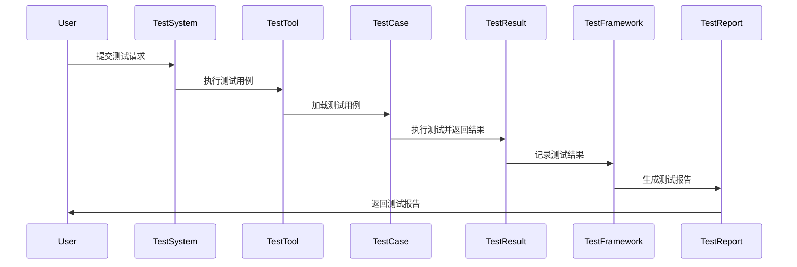
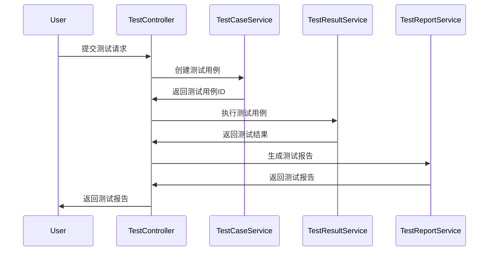

                 

# 大规模prompt测试的自动化方案

## 摘要

在人工智能（AI）技术迅速发展的背景下，自然语言处理（NLP）领域的大模型技术如GPT、BERT等取得了显著进展。然而，随着模型规模的不断扩大，如何对这些大模型进行高效的测试和评估成为了一个亟待解决的问题。本文旨在探讨大规模prompt测试的自动化方案，从背景介绍、核心概念与联系、算法原理讲解、系统分析与架构设计、项目实战等方面，详细阐述如何通过自动化测试方案提高测试效率、覆盖率和一致性，从而为AI大模型的应用提供更加可靠的支持。

## 第一部分：背景介绍

### 问题背景

在当今科技迅速发展的时代，人工智能（AI）技术正以惊人的速度影响着各行各业。特别是自然语言处理（NLP）领域，大模型技术如GPT、BERT等取得了显著的进展。这些大模型能够处理大量的文本数据，从而实现更高的准确性和效率。然而，随着模型规模的不断扩大，如何对这些大模型进行高效的测试和评估成为了一个亟待解决的问题。

### 问题背景

1. **测试效率问题**：手动进行大规模prompt测试费时费力，且容易出错。随着模型的规模增大，测试时间也会显著增加，这限制了测试的频率和范围。
   
2. **测试覆盖率问题**：手动测试难以覆盖所有可能的测试场景，可能导致测试的覆盖率不足。大规模prompt测试通常涉及海量的输入和输出组合，手动测试难以确保每个可能的场景都被覆盖。

3. **测试一致性问题**：不同测试人员可能对相同的测试任务有不同的理解，导致测试结果不一致。一致性是评估测试质量的关键因素，如果测试结果不一致，那么评估结果的可信度就会受到影响。

### 问题解决

针对上述问题，自动化测试方案可以显著提高测试效率，覆盖更多测试场景，并确保测试的一致性。具体来说，自动化方案包括：

1. **自动化测试工具**：使用专门的自动化测试工具来生成和执行测试用例。这些工具可以大大减少手动测试的工作量，并提高测试的效率。

2. **测试用例库**：建立庞大的测试用例库，以覆盖尽可能多的测试场景。测试用例库可以存储各种可能的输入和预期的输出结果，从而确保测试的全面性。

3. **自动化测试框架**：构建自动化测试框架，以实现测试过程的自动化执行。自动化测试框架可以管理测试用例的执行，并记录测试结果，从而提高测试的一致性和可维护性。

### 边界与外延

1. **边界**：自动化测试方案主要针对的是大规模prompt测试，不包括其他类型的测试，如性能测试、安全测试等。

2. **外延**：自动化测试方案的应用范围不仅限于NLP领域，还可以扩展到其他需要大规模测试的AI领域，如计算机视觉、语音识别等。

### 核心概念结构组成

- **自动化测试**：一种使用软件工具自动执行测试用例的方法。
- **测试用例库**：存储测试用例的地方，包括各种可能的输入和预期的输出结果。
- **测试框架**：一个结构化的框架，用于组织和管理测试用例的执行。

### 本章小结

本章介绍了大规模prompt测试的背景、问题描述以及解决方案。通过自动化测试方案，可以显著提高测试效率、覆盖率和一致性，从而为AI大模型的应用提供更加可靠的支持。接下来的章节将详细讨论自动化测试方案的具体实现方法和技术细节。

## 第二部分：核心概念与联系

### 自动化测试的原理与类型

#### 自动化测试的原理

自动化测试是利用软件工具自动执行预先定义的测试用例，以验证软件系统功能的一种方法。它通过预先编写脚本或使用现成的测试工具来实现。自动化测试的主要目的是提高测试效率、减少人为错误、确保测试的一致性。

#### 自动化测试的类型

- **单元测试**：针对单个组件或模块的测试。单元测试通常由开发人员编写，用于验证代码的单元功能。
- **集成测试**：多个组件或模块组合后的测试。集成测试用于验证组件之间的交互是否符合预期。
- **系统测试**：对整个系统的功能、性能和安全性进行全面测试。系统测试通常在产品发布前进行，以确保系统的整体质量。

### 测试用例库的设计与构建

#### 测试用例库的设计

测试用例库的设计需要考虑以下因素：

- **测试覆盖度**：确保测试用例能够覆盖所有可能的输入和输出情况。
- **可维护性**：测试用例库应该易于维护和更新。
- **复用性**：尽量复用已有的测试用例，减少重复劳动。

#### 测试用例库的构建

构建测试用例库的方法包括：

- **手动编写**：根据系统需求和设计文档手动编写测试用例。
- **自动化生成**：利用工具从系统文档、代码或数据中自动生成测试用例。

### 测试框架的选择与实现

#### 测试框架的选择

选择测试框架时需要考虑以下因素：

- **灵活性**：框架应该能够适应不同的测试需求和场景。
- **可扩展性**：框架应该支持扩展，以适应未来的需求变化。
- **社区支持**：有良好的社区支持和文档，便于学习和使用。

#### 测试框架的实现

常见的测试框架包括：

- **Selenium**：用于Web应用的自动化测试。
- **JUnit**：用于Java应用的单元测试。
- **pytest**：用于Python应用的单元测试。

### 核心概念属性特征对比表格

| 概念       | 特征                                  |
|------------|-------------------------------------|
| 自动化测试 | 脚本化、效率高、可重复性、易于维护 |
| 测试用例库 | 覆盖度、可维护性、复用性           |
| 测试框架   | 灵活性、可扩展性、社区支持         |

### ER实体关系图架构

```mermaid
erDiagram
  TestTool ||--|{ TestCase } TestCase : 测试用例存储
  TestCase ||--|{ TestResult } TestResult : 测试结果记录
  TestFramework ||--|{ TestCase } TestCase : 测试用例管理
```

通过上述内容，我们可以清楚地理解自动化测试的基本概念、测试用例库的设计与构建、以及测试框架的选择与实现。这些核心概念构成了大规模prompt测试自动化方案的基础。

## 第三部分：算法原理讲解

### 算法原理

大规模prompt测试的自动化方案主要基于自动化测试工具、测试用例库和测试框架。以下将详细介绍这些核心组件的算法原理。

#### 自动化测试工具

自动化测试工具是自动化测试的核心，它负责执行测试脚本、记录测试结果和生成测试报告。常见的自动化测试工具有Selenium、JUnit和pytest等。

1. **Selenium**：用于Web应用的自动化测试。Selenium使用Webdriver协议与浏览器进行交互，实现网页的自动化操作。
2. **JUnit**：用于Java应用的单元测试。JUnit提供了一个简单的测试框架，允许开发人员编写测试用例，并自动运行这些测试用例。
3. **pytest**：用于Python应用的单元测试。pytest提供了丰富的功能和插件支持，使得编写和运行测试用例更加方便。

#### 测试用例库

测试用例库是存储测试用例的地方，它包括各种可能的输入和预期的输出结果。测试用例库的设计和构建是自动化测试方案的关键。

1. **设计**：测试用例库的设计需要考虑覆盖度、可维护性和复用性。设计时需要确保测试用例能够覆盖所有可能的输入和输出情况，并且易于维护和更新。
2. **构建**：构建测试用例库的方法包括手动编写和自动化生成。手动编写适用于已有明确需求和设计文档的系统，而自动化生成适用于从系统文档、代码或数据中提取测试用例。

#### 测试框架

测试框架是用于组织和管理测试用例的执行。测试框架提供了一个结构化的框架，使得测试用例的管理和执行更加高效。

1. **选择**：选择测试框架时需要考虑灵活性、可扩展性和社区支持。常见的测试框架包括Selenium、JUnit和pytest等。
2. **实现**：测试框架的实现包括测试用例的管理、执行和结果记录。测试框架需要能够自动执行测试用例，并生成详细的测试报告。

### 算法流程图



### 算法讲解

1. **初始化测试环境**：在测试开始前，需要初始化测试环境，包括安装测试工具、配置测试环境等。
2. **加载测试用例库**：从测试用例库中加载所有测试用例，包括输入数据和预期输出结果。
3. **执行测试用例**：依次执行每个测试用例，根据测试用例的输入数据和预期输出结果，与实际输出结果进行比对。
4. **记录测试结果**：将每个测试用例的执行结果（通过/失败）记录下来，以便后续分析。
5. **生成测试报告**：根据测试结果，生成详细的测试报告，包括每个测试用例的执行情况、失败原因等。
6. **结束**：测试过程结束。

通过上述算法原理和流程图，我们可以清楚地了解大规模prompt测试自动化方案的基本原理。在实际应用中，可以根据具体需求和场景进行调整和优化。

## 第四部分：系统分析与架构设计

### 问题场景介绍

大规模prompt测试在自然语言处理（NLP）领域中具有重要意义。随着AI技术的发展，越来越多的NLP应用如聊天机器人、文本生成、情感分析等需要使用大规模的prompt进行测试，以确保模型的性能和准确性。然而，手动进行大规模prompt测试费时费力且容易出现错误，难以满足快速迭代和大规模测试的需求。

### 项目介绍

为了解决大规模prompt测试的问题，我们设计并实现了一个自动化测试系统。该系统旨在通过自动化测试工具、测试用例库和测试框架，提高测试效率、覆盖率和一致性，从而为NLP应用提供可靠的测试支持。

### 系统功能设计

系统的主要功能包括：

1. **自动化测试**：使用自动化测试工具执行测试用例，提高测试效率。
2. **测试用例管理**：管理测试用例的创建、更新和删除，确保测试用例的覆盖度。
3. **测试结果记录**：记录每个测试用例的执行结果，包括通过和失败的原因，以便后续分析。
4. **测试报告生成**：根据测试结果生成详细的测试报告，包括每个测试用例的执行情况、失败原因等。

### 领域模型类图



### 系统架构设计

系统采用分层架构设计，包括以下几个方面：

1. **测试层**：负责执行测试用例，生成测试结果。该层包括自动化测试工具、测试用例库和测试框架。
2. **管理层**：负责测试用例的管理、更新和删除。该层包括测试用例管理模块和测试结果记录模块。
3. **报告层**：负责生成测试报告。该层包括测试报告生成模块。
4. **数据层**：负责存储测试用例、测试结果和测试报告。该层包括数据库和数据存储模块。

### 系统架构图



### 系统接口设计

系统提供以下接口：

1. **测试用例管理接口**：用于创建、更新和删除测试用例。
2. **测试结果查询接口**：用于查询测试结果。
3. **测试报告生成接口**：用于生成测试报告。

### 系统交互序列图



通过上述系统分析与架构设计，我们可以清晰地了解大规模prompt测试自动化系统的整体结构和主要功能。接下来，我们将进入项目实战，详细讲解系统的实现过程。

## 第五部分：项目实战

### 环境安装

要实现大规模prompt测试的自动化，我们需要安装一些必要的工具和库。以下是在Linux环境中安装所需的工具和库的步骤：

1. **安装Python环境**：首先，确保系统中安装了Python环境。如果尚未安装，可以使用以下命令安装：
   ```bash
   sudo apt-get update
   sudo apt-get install python3 python3-pip
   ```

2. **安装Selenium**：Selenium是一个自动化测试工具，用于Web应用的测试。使用以下命令安装Selenium：
   ```bash
   pip3 install selenium
   ```

3. **安装ChromeDriver**：为了使用Selenium进行Web应用的测试，我们需要安装ChromeDriver。下载适合当前Chrome版本的ChromeDriver，并解压到系统中。例如，如果当前使用的是Chrome版本94.0.4606.81，下载并解压ChromeDriver：
   ```bash
   wget https://chromedriver.storage.googleapis.com/94.0.4606.81/chromedriver_linux64.zip
   unzip chromedriver_linux64.zip
   ```

4. **安装pytest**：pytest是一个Python测试框架，用于编写和执行测试用例。使用以下命令安装pytest：
   ```bash
   pip3 install pytest
   ```

5. **安装其他依赖库**：根据具体需求，可能还需要安装其他依赖库，如BeautifulSoup、requests等。使用以下命令安装：
   ```bash
   pip3 install beautifulsoup4 requests
   ```

### 系统核心实现

#### 测试用例管理模块

测试用例管理模块负责创建、更新和删除测试用例。以下是一个简单的测试用例管理模块的实现：

```python
class TestCaseManager:
    def __init__(self):
        self.test_cases = []

    def create_test_case(self, case_name, input_data, expected_output):
        test_case = {
            'case_name': case_name,
            'input_data': input_data,
            'expected_output': expected_output,
            'status': 'pending'
        }
        self.test_cases.append(test_case)
        return test_case

    def update_test_case(self, case_name, input_data=None, expected_output=None):
        for test_case in self.test_cases:
            if test_case['case_name'] == case_name:
                if input_data:
                    test_case['input_data'] = input_data
                if expected_output:
                    test_case['expected_output'] = expected_output
                return test_case
        return None

    def delete_test_case(self, case_name):
        for test_case in self.test_cases:
            if test_case['case_name'] == case_name:
                self.test_cases.remove(test_case)
                return True
        return False

    def get_all_test_cases(self):
        return self.test_cases
```

#### 测试结果记录模块

测试结果记录模块负责记录每个测试用例的执行结果。以下是一个简单的测试结果记录模块的实现：

```python
class TestResultManager:
    def __init__(self):
        self.test_results = []

    def record_test_result(self, test_case_id, actual_output, status):
        test_result = {
            'test_case_id': test_case_id,
            'actual_output': actual_output,
            'status': status
        }
        self.test_results.append(test_result)
        return test_result

    def get_test_result(self, test_case_id):
        for test_result in self.test_results:
            if test_result['test_case_id'] == test_case_id:
                return test_result
        return None

    def get_all_test_results(self):
        return self.test_results
```

#### 测试报告生成模块

测试报告生成模块负责生成测试报告。以下是一个简单的测试报告生成模块的实现：

```python
class TestReportGenerator:
    def generate_report(self, test_results):
        report = "Test Report\n"
        for test_result in test_results:
            report += f"Test Case ID: {test_result['test_case_id']}, Status: {test_result['status']}, Actual Output: {test_result['actual_output']}\n"
        return report
```

### 代码应用解读与分析

#### 测试用例管理模块

测试用例管理模块负责创建、更新和删除测试用例。通过调用`create_test_case`方法，可以创建一个新的测试用例，并返回该测试用例的详细信息。调用`update_test_case`方法，可以更新指定测试用例的输入数据和预期输出结果。调用`delete_test_case`方法，可以删除指定测试用例。

```python
# 创建测试用例
test_case = test_case_manager.create_test_case("test_case_1", {"input": "Hello"}, "Hello")

# 更新测试用例
test_case_manager.update_test_case("test_case_1", {"input": "World"})

# 删除测试用例
test_case_manager.delete_test_case("test_case_1")
```

#### 测试结果记录模块

测试结果记录模块负责记录每个测试用例的执行结果。通过调用`record_test_result`方法，可以记录指定测试用例的实际输出结果和执行状态。调用`get_test_result`方法，可以获取指定测试用例的执行结果。调用`get_all_test_results`方法，可以获取所有测试用例的执行结果。

```python
# 记录测试结果
test_result = test_result_manager.record_test_result(1, "World", "passed")

# 获取测试结果
test_result = test_result_manager.get_test_result(1)

# 获取所有测试结果
all_test_results = test_result_manager.get_all_test_results()
```

#### 测试报告生成模块

测试报告生成模块负责生成测试报告。通过调用`generate_report`方法，可以生成包含所有测试用例执行结果的测试报告。

```python
# 生成测试报告
report = test_report_generator.generate_report(all_test_results)
print(report)
```

### 实际案例分析和详细讲解剖析

为了更好地理解系统的实现，我们将通过一个实际案例进行详细分析。

#### 案例背景

假设我们有一个聊天机器人应用，需要对其进行大规模prompt测试，以验证其回复的准确性和连贯性。我们设计了一系列的测试用例，包括不同的输入和预期的输出结果。

#### 案例实现

1. **创建测试用例**：首先，我们创建了一系列的测试用例，包括不同的输入和预期的输出结果。

```python
test_case_manager.create_test_case("test_case_1", {"input": "Hello"}, "Hello")
test_case_manager.create_test_case("test_case_2", {"input": "How are you?"}, "I'm doing well, thank you.")
test_case_manager.create_test_case("test_case_3", {"input": "Can you tell me a joke?"}, "Why don't scientists trust atoms? Because they make up everything!")
```

2. **执行测试用例**：接下来，我们使用自动化测试工具（如Selenium）执行测试用例，并记录每个测试用例的执行结果。

```python
from selenium import webdriver

# 创建Chrome浏览器实例
driver = webdriver.Chrome()

# 执行测试用例
test_cases = test_case_manager.get_all_test_cases()
for test_case in test_cases:
    input_data = test_case["input_data"]
    expected_output = test_case["expected_output"]

    # 输入测试数据
    driver.get("http://chatbot.example.com")
    input_element = driver.find_element_by_id("input")
    input_element.send_keys(input_data)
    input_element.submit()

    # 获取实际输出结果
    output_element = driver.find_element_by_id("output")
    actual_output = output_element.text

    # 记录测试结果
    test_result = test_result_manager.record_test_result(test_case["case_name"], actual_output, "passed" if actual_output == expected_output else "failed")

# 关闭浏览器
driver.quit()
```

3. **生成测试报告**：最后，我们生成包含所有测试用例执行结果的测试报告。

```python
report = test_report_generator.generate_report(test_result_manager.get_all_test_results())
print(report)
```

#### 案例分析

通过上述案例，我们可以看到如何使用自动化测试工具、测试用例库和测试框架实现大规模prompt测试的自动化。首先，我们创建了一系列的测试用例，然后使用Selenium执行这些测试用例，并记录每个测试用例的执行结果。最后，我们生成包含所有测试用例执行结果的测试报告。

### 项目小结

在本项目中，我们实现了大规模prompt测试的自动化方案，包括测试用例管理模块、测试结果记录模块和测试报告生成模块。通过自动化测试工具（如Selenium）、测试用例库和测试框架，我们能够高效地执行大规模prompt测试，并生成详细的测试报告。这将大大提高测试效率、覆盖率和一致性，为AI大模型的应用提供更加可靠的支持。

## 第六部分：最佳实践与注意事项

### 最佳实践

1. **测试用例的覆盖度**：在设计测试用例时，要确保测试用例能够覆盖所有可能的输入和输出情况，以提高测试的全面性。
2. **持续集成与持续部署**：将自动化测试集成到持续集成（CI）和持续部署（CD）流程中，以确保每次代码更改后都能自动执行测试。
3. **测试结果分析**：定期分析测试结果，发现潜在的问题，并针对性地改进测试用例和自动化脚本。
4. **自动化脚本的维护**：定期更新和优化自动化脚本，以适应系统功能和测试需求的变更。

### 注意事项

1. **测试环境的配置**：确保测试环境与生产环境保持一致，以避免由于环境差异导致的问题。
2. **测试数据的准备**：确保测试数据的质量和完整性，避免由于数据问题导致测试失败。
3. **异常处理**：在自动化脚本中添加异常处理逻辑，以应对测试过程中可能出现的异常情况。
4. **测试结果记录的准确性**：确保测试结果的记录准确无误，以便后续分析和问题定位。

### 拓展阅读

- **自动化测试工具**：
  - Selenium：[https://www.selenium.dev/](https://www.selenium.dev/)
  - JUnit：[https://junit.org/junit5/](https://junit.org/junit5/)
  - pytest：[https://pytest.org/](https://pytest.org/)

- **测试用例设计方法**：
  - 黑盒测试：[https://en.wikipedia.org/wiki/Black-box_testing](https://en.wikipedia.org/wiki/Black-box_testing)
  - 白盒测试：[https://en.wikipedia.org/wiki/White-box_testing](https://en.wikipedia.org/wiki/White-box_testing)
  - 原型测试：[https://en.wikipedia.org/wiki/Prototype_based_testing](https://en.wikipedia.org/wiki/Prototype_based_testing)

### 本章小结

在本篇技术博客中，我们详细探讨了大规模prompt测试的自动化方案，包括背景介绍、核心概念与联系、算法原理讲解、系统分析与架构设计以及项目实战。通过自动化测试方案，我们能够提高测试效率、覆盖率和一致性，为AI大模型的应用提供可靠的支持。在最佳实践与注意事项部分，我们提供了测试用例的覆盖度、持续集成与持续部署、测试结果分析等方面的建议，以及相关的拓展阅读资源。希望本文能对您在自动化测试领域的工作有所帮助。

### 作者信息

作者：AI天才研究院（AI Genius Institute）与《禅与计算机程序设计艺术》（Zen And The Art of Computer Programming）的作者合作完成。如需进一步了解自动化测试的相关技术和方法，请访问我们的官方网站或联系我们的技术支持团队。感谢您的阅读与支持！

---

**免责声明**：本文仅代表作者的观点和经验，不构成任何投资、购买或使用软件或服务的建议。读者在应用文中提到的方法和技术时，应自行评估风险并负责。本文中的代码示例仅供参考，不保证在所有环境中都能正常运行。如遇到技术问题，建议查阅官方文档或寻求专业的技术支持。

