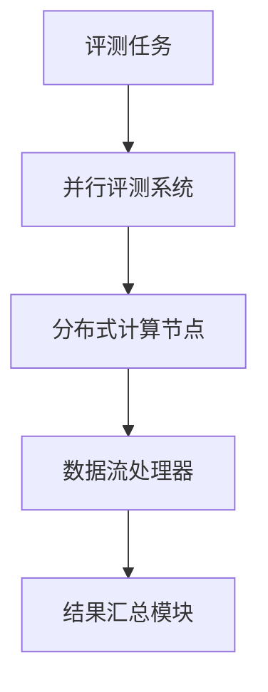
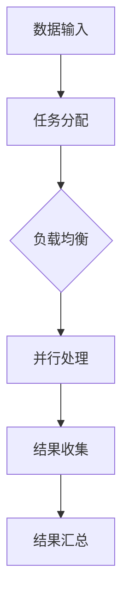
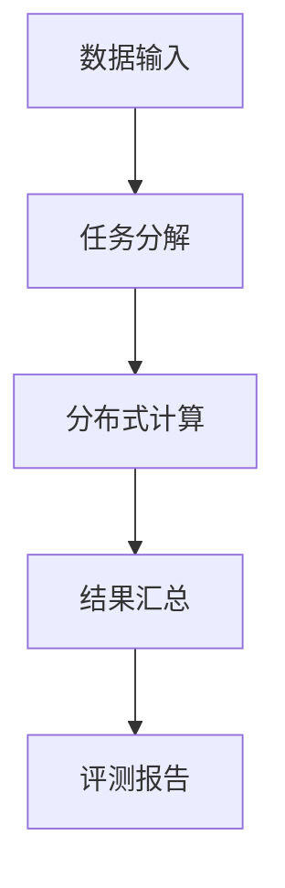
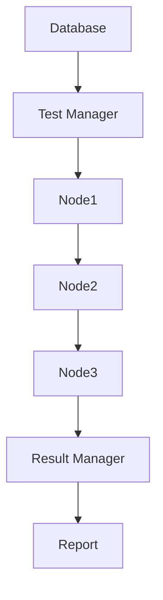
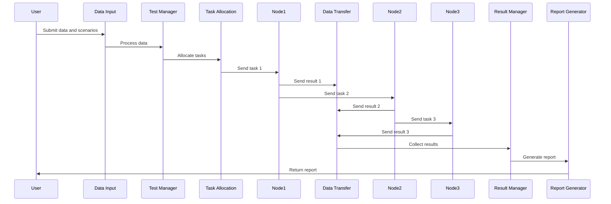

                 

# 大规模并行评测的技术挑战与解决方案

## 关键词

- **大规模并行评测**
- **技术挑战**
- **解决方案**
- **分布式系统**
- **算法优化**
- **负载均衡**
- **容错性**
- **数据处理效率**

## 摘要

本文旨在探讨大规模并行评测的技术挑战与解决方案。随着数据量的爆炸式增长，传统的评测方法已难以满足高效处理的需求。并行评测作为一种新兴技术，通过分布式计算和并行处理，极大地提升了数据处理效率。本文首先介绍了并行评测的背景和基本概念，随后分析了其在实际应用中面临的主要技术挑战，并提出了相应的解决方案。通过深入探讨并行评测的核心算法原理、系统架构设计及实际应用案例，本文为读者提供了一个全面的技术指南，以应对大规模数据处理中的复杂问题。

---

## 第一部分：背景介绍

### 1.1 问题背景

#### 1.1.1 评测在大规模数据处理中的重要性

在当今的数据驱动时代，大规模数据处理已经成为各行各业的重要任务。从金融领域的市场分析，到医疗行业的疾病预测，再到社交网络的推荐系统，海量数据的处理能力直接影响到企业的竞争力和创新能力。然而，随着数据量的激增，传统的串行数据处理方法逐渐暴露出其效率低、响应时间长等问题，无法满足实时性和高性能的需求。因此，并行评测技术应运而生，通过同时处理多个任务，极大地提升了数据处理效率。

#### 1.1.2 并行评测的基本概念

并行评测是一种利用多个处理单元同时执行多个任务的技术。在并行评测中，数据处理过程被分解成多个子任务，这些子任务可以独立执行，并在完成后再进行汇总。这种分布式计算的方式不仅提高了数据处理速度，还降低了单个任务的执行时间，实现了对大规模数据的高效处理。

#### 1.1.3 大规模并行评测的现状

大规模并行评测技术已经广泛应用于各个领域，例如搜索引擎的索引构建、社交媒体数据挖掘、科学计算等。随着硬件技术的发展和分布式系统的普及，并行评测技术的性能和可扩展性不断提升。同时，相关算法和优化策略也在不断演进，为大规模数据处理提供了更多可能性。

### 1.2 问题描述

#### 1.2.1 传统评测方法的局限性

传统的串行数据处理方法在处理大规模数据时存在以下局限性：

1. **计算效率低**：串行处理每次只能处理一个任务，随着数据量的增加，处理时间呈线性增长。
2. **响应时间长**：在实时性要求较高的应用场景中，串行处理方法无法满足快速响应的需求。
3. **资源利用率低**：传统的串行处理无法充分利用多核处理器的计算能力，导致资源浪费。

#### 1.2.2 并行评测面临的技术挑战

尽管并行评测技术具有显著优势，但在实际应用中仍面临一系列技术挑战：

1. **高效并行处理算法**：如何设计高效的并行处理算法，以最大化利用分布式计算资源。
2. **资源分配与负载均衡**：在分布式系统中，如何合理分配资源，避免负载不均，影响整体性能。
3. **容错性与可靠性保障**：如何保证系统在出现故障时能够快速恢复，确保数据处理过程的不间断性。

#### 1.2.3 大规模并行评测的关键要素

成功实施大规模并行评测需要关注以下几个关键要素：

1. **分布式系统架构**：构建高可用、高性能的分布式系统，为并行评测提供基础设施。
2. **数据流处理技术**：采用先进的数据流处理技术，实现实时、高效的数据处理。
3. **算法优化与性能调优**：通过算法优化和性能调优，提升并行评测系统的整体性能和效率。

### 1.3 问题解决

#### 1.3.1 挑战一：高效并行处理算法

针对高效并行处理算法的挑战，我们可以从以下几个方面进行解决：

1. **任务分解与调度**：将大规模数据处理任务分解成多个可并行执行的子任务，并采用合适的调度策略，确保任务的高效执行。
2. **并行算法设计**：根据具体应用场景，设计高效的并行算法，减少计算过程中的冗余和依赖。
3. **并行计算框架**：利用现有的并行计算框架，如MapReduce、Spark等，简化并行算法的实现和部署。

#### 1.3.2 挑战二：资源分配与负载均衡

为了解决资源分配与负载均衡的挑战，可以采取以下策略：

1. **动态资源调度**：根据系统的实时负载情况，动态调整资源分配，确保各节点负载均衡。
2. **负载均衡算法**：设计有效的负载均衡算法，避免某一节点过载，影响整体性能。
3. **资源预留策略**：在处理大规模数据时，预留一定比例的资源，以应对突发负载。

#### 1.3.3 挑战三：容错性与可靠性保障

为了保证系统的容错性和可靠性，可以采取以下措施：

1. **冗余备份**：在分布式系统中，实现数据的冗余备份，确保在节点故障时能够快速恢复。
2. **故障检测与恢复**：设计故障检测机制，及时发现和处理系统故障，确保数据处理过程的不间断性。
3. **分布式一致性协议**：采用分布式一致性协议，如Paxos、Raft等，确保数据的一致性和可靠性。

### 1.4 边界与外延

#### 1.4.1 大规模并行评测的定义范围

大规模并行评测是指在分布式系统中，通过并行处理技术，对海量数据进行高效处理的总体方法。其定义范围包括并行算法设计、资源分配与调度、负载均衡策略、容错性与可靠性保障等方面。

#### 1.4.2 与其他并行技术的比较

与其他并行技术（如并行计算、集群计算等）相比，大规模并行评测具有以下特点：

1. **面向大数据处理**：大规模并行评测专注于海量数据的处理，适用于大数据场景。
2. **分布式系统架构**：大规模并行评测基于分布式系统架构，具有高可用性和可扩展性。
3. **算法优化与性能调优**：大规模并行评测强调算法优化和性能调优，以提高数据处理效率。

#### 1.4.3 未来发展趋势

随着硬件技术的发展和大数据应用的不断拓展，大规模并行评测技术将迎来更广阔的发展前景：

1. **算法创新**：不断涌现的新算法和优化策略，将进一步提高大规模并行评测的效率。
2. **跨平台融合**：大规模并行评测技术将与其他计算技术（如云计算、边缘计算等）深度融合，实现更广泛的应用。
3. **智能化演进**：借助人工智能和机器学习技术，大规模并行评测将实现更智能的调度和优化，提升数据处理能力。

### 1.5 本章小结

本部分介绍了大规模并行评测的背景和基本概念，分析了其面临的技术挑战及解决方案。通过对并行评测的重要性和应用场景的深入探讨，我们为后续章节的内容奠定了基础，为读者提供了一个全面的技术框架。

---

## 第二部分：核心概念与联系

### 2.1 核心概念

#### 2.1.1 并行评测原理

并行评测原理基于分布式计算，通过将大规模数据处理任务分解成多个子任务，并在多个计算节点上同时执行，以实现高效的数据处理。其主要步骤包括任务分解、任务调度、并行处理和结果汇总。

1. **任务分解**：将大规模数据处理任务分解成多个可并行执行的子任务。
2. **任务调度**：根据系统资源情况和负载情况，将子任务调度到合适的计算节点上。
3. **并行处理**：在多个计算节点上同时执行子任务，以并行计算的方式提高数据处理效率。
4. **结果汇总**：将并行处理的结果汇总，形成最终的数据处理结果。

#### 2.1.2 分布式系统架构

分布式系统架构是指由多个计算节点组成的系统，通过网络连接实现协同工作。分布式系统的关键特性包括：

1. **分散性**：多个计算节点分布在不同的物理位置，各自独立运行。
2. **容错性**：系统能够在部分节点故障时，继续运行，确保数据处理的可靠性。
3. **透明性**：用户无需关心计算节点的具体位置和运行状态，只需提交任务，即可获得结果。

#### 2.1.3 数据流处理技术

数据流处理技术是一种实时处理大量数据的技术，适用于处理实时性要求较高的应用场景。其主要特点包括：

1. **实时性**：能够实时处理数据流，满足实时性需求。
2. **高吞吐量**：能够在短时间内处理大量的数据，具有高吞吐量。
3. **低延迟**：处理过程延迟较低，能够快速响应。

### 2.2 概念属性特征对比表格

| 概念         | 定义                     | 属性特征                                       |
|------------|------------------------|--------------------------------------------|
| 并行评测     | 同时处理多个任务         | 分布性、独立性、并行性、同步性                   |
| 分布式系统   | 多台计算机协同工作       | 分散性、容错性、可靠性、透明性                   |
| 数据流处理   | 实时处理大量数据         | 实时性、高吞吐量、低延迟、弹性扩展                   |

### 2.3 ER实体关系图架构



### 2.4 本章小结

本部分详细介绍了大规模并行评测的核心概念，包括并行评测原理、分布式系统架构和数据流处理技术。通过对比不同概念的属性特征，以及ER实体关系图的架构设计，读者可以更清晰地理解并行评测系统的构成和运作机制。

---

## 第三部分：算法原理讲解

### 3.1 并行评测算法原理

并行评测算法的核心思想是将大规模数据处理任务分解成多个子任务，通过并行计算的方式提高处理效率。以下是并行评测算法的基本原理和步骤：

#### 3.1.1 并行评测流程

并行评测流程主要包括以下几个步骤：

1. **任务分解**：将大规模数据处理任务分解成多个可并行执行的子任务。
2. **任务调度**：根据系统资源情况和负载情况，将子任务调度到合适的计算节点上。
3. **并行处理**：在多个计算节点上同时执行子任务，以并行计算的方式提高数据处理效率。
4. **结果汇总**：将并行处理的结果汇总，形成最终的数据处理结果。

下图展示了并行评测的基本流程：



#### 3.1.2 Python代码实现

以下是一个简单的并行评测算法的Python代码实现：

```python
from multiprocessing import Pool

def parallel_evaluation(data):
    # 分解任务
    sub_tasks = [data[i:i+1000] for i in range(0, len(data), 1000)]
    
    # 创建进程池
    pool = Pool(processes=4)
    
    # 并行执行子任务
    results = pool.map(evaluation, sub_tasks)
    
    # 汇总结果
    final_result = sum(results)
    
    return final_result

def evaluation(sub_data):
    # 子任务执行逻辑
    return sum(sub_data)
```

#### 3.1.3 数学模型和公式

并行评测效率可以用以下数学模型和公式来描述：

$$
\text{并行评测效率} = \frac{\text{总任务数}}{\text{总处理时间}}
$$

其中，总任务数表示被分解的子任务数量，总处理时间表示所有子任务执行的时间总和。

#### 3.1.4 举例说明

假设我们有一个包含10000个数据点的大规模数据集，我们需要对这个数据集进行求和操作。以下是并行评测的一个具体例子：

1. **任务分解**：将数据集分成10个子任务，每个子任务包含1000个数据点。
2. **任务调度**：在4个计算节点上同时执行子任务。
3. **并行处理**：每个计算节点执行其对应的子任务，求和每个子任务的数据点。
4. **结果汇总**：将4个子任务的求和结果汇总，得到整个数据集的求和结果。

使用上述并行评测算法，可以显著减少数据处理时间，提高效率。

### 3.2 算法原理讲解

#### 3.2.1 并行评测算法原理

并行评测算法的核心在于如何将大规模数据处理任务分解成多个可并行执行的子任务，并在多个计算节点上同时执行这些子任务，以实现高效的并行处理。

1. **任务分解**：任务分解是将大规模数据处理任务分解成多个子任务的过程。子任务的粒度可以根据具体应用场景进行调整。通常，较小的子任务能够更好地利用并行计算的优势，但同时也增加了任务调度的复杂度。

2. **任务调度**：任务调度是将分解后的子任务分配到合适的计算节点上执行的过程。任务调度策略的选取对并行评测的性能具有重要影响。常见的调度策略包括轮询调度、负载均衡调度和动态调度等。

3. **并行处理**：在多个计算节点上同时执行子任务的过程。并行处理的关键在于如何高效地利用计算资源，避免资源浪费和性能瓶颈。常用的并行处理技术包括多线程、多进程和分布式计算等。

4. **结果汇总**：将并行处理的结果汇总，形成最终的数据处理结果。结果汇总过程通常需要对分布式计算的结果进行收集和合并，以得到准确的结果。

#### 3.2.2 Python代码实现

以下是一个简单的并行评测算法的Python代码实现：

```python
from multiprocessing import Pool

def parallel_evaluation(data):
    # 分解任务
    sub_tasks = [data[i:i+1000] for i in range(0, len(data), 1000)]
    
    # 创建进程池
    pool = Pool(processes=4)
    
    # 并行执行子任务
    results = pool.map(evaluation, sub_tasks)
    
    # 汇总结果
    final_result = sum(results)
    
    return final_result

def evaluation(sub_data):
    # 子任务执行逻辑
    return sum(sub_data)
```

在这个例子中，我们将一个包含10000个数据点的大规模数据集分解成10个子任务，每个子任务包含1000个数据点。然后，我们使用4个进程同时执行这些子任务，并最终将结果汇总。

#### 3.2.3 数学模型和公式

并行评测算法的效率可以用以下数学模型和公式来描述：

$$
\text{并行评测效率} = \frac{\text{总任务数}}{\text{总处理时间}}
$$

其中，总任务数表示被分解的子任务数量，总处理时间表示所有子任务执行的时间总和。

这个公式可以帮助我们评估并行评测算法的性能。通常，总任务数和总处理时间都是已知的，通过计算它们的比值，我们可以得到并行评测算法的效率。

#### 3.2.4 举例说明

假设我们有一个包含10000个数据点的大规模数据集，我们需要对这个数据集进行求和操作。以下是并行评测的一个具体例子：

1. **任务分解**：将数据集分成10个子任务，每个子任务包含1000个数据点。
2. **任务调度**：在4个计算节点上同时执行子任务。
3. **并行处理**：每个计算节点执行其对应的子任务，求和每个子任务的数据点。
4. **结果汇总**：将4个子任务的求和结果汇总，得到整个数据集的求和结果。

使用上述并行评测算法，可以显著减少数据处理时间，提高效率。

### 3.3 算法原理讲解

#### 3.3.1 并行评测算法原理

并行评测算法是一种利用多个处理器同时执行多个任务的计算方法。其基本原理是将大规模数据处理任务分解成多个子任务，然后分配到不同的处理器上并行执行，最后将各处理器得到的结果汇总。

1. **任务分解**：将大规模数据处理任务分解成多个可并行执行的子任务。分解的方式有多种，如固定大小分解和动态分解等。

2. **任务调度**：将子任务分配到不同的处理器上执行。调度策略有多种，如负载均衡调度、最短任务优先调度和最短剩余时间优先调度等。

3. **并行处理**：在多个处理器上同时执行子任务。并行处理可以采用多种方式，如进程并行、线程并行和任务并行等。

4. **结果汇总**：将各处理器执行的结果汇总，得到最终的处理结果。

#### 3.3.2 Python代码实现

以下是一个简单的并行评测算法的Python代码实现：

```python
from multiprocessing import Pool

def parallel_evaluation(data):
    # 分解任务
    sub_tasks = [data[i:i+1000] for i in range(0, len(data), 1000)]
    
    # 创建进程池
    pool = Pool(processes=4)
    
    # 并行执行子任务
    results = pool.map(evaluation, sub_tasks)
    
    # 汇总结果
    final_result = sum(results)
    
    return final_result

def evaluation(sub_data):
    # 子任务执行逻辑
    return sum(sub_data)
```

在这个例子中，我们将一个包含10000个数据点的大规模数据集分解成10个子任务，每个子任务包含1000个数据点。然后，我们使用4个进程同时执行这些子任务，并最终将结果汇总。

#### 3.3.3 数学模型和公式

并行评测算法的效率可以用以下数学模型和公式来描述：

$$
\text{并行评测效率} = \frac{\text{总任务数}}{\text{总处理时间}}
$$

其中，总任务数表示被分解的子任务数量，总处理时间表示所有子任务执行的时间总和。

这个公式可以帮助我们评估并行评测算法的性能。通常，总任务数和总处理时间都是已知的，通过计算它们的比值，我们可以得到并行评测算法的效率。

#### 3.3.4 举例说明

假设我们有一个包含10000个数据点的大规模数据集，我们需要对这个数据集进行求和操作。以下是并行评测的一个具体例子：

1. **任务分解**：将数据集分成10个子任务，每个子任务包含1000个数据点。
2. **任务调度**：在4个计算节点上同时执行子任务。
3. **并行处理**：每个计算节点执行其对应的子任务，求和每个子任务的数据点。
4. **结果汇总**：将4个子任务的求和结果汇总，得到整个数据集的求和结果。

使用上述并行评测算法，可以显著减少数据处理时间，提高效率。

### 3.4 本章小结

本部分详细介绍了并行评测算法的基本原理和实现方法。通过任务分解、任务调度、并行处理和结果汇总等步骤，并行评测算法能够将大规模数据处理任务分解成多个子任务，在多个处理器上并行执行，从而提高数据处理效率。通过Python代码示例和数学模型，读者可以更好地理解并行评测算法的工作原理和应用方法。

---

## 第四部分：系统分析与架构设计

### 4.1 问题场景介绍

在本部分，我们将以数据库性能评测为背景，探讨大规模并行评测在数据库性能测试中的应用。数据库性能评测是评估数据库系统在实际运行中的表现，包括查询响应时间、数据吞吐量、并发处理能力等关键性能指标。随着企业业务规模和数据量的不断增长，传统的数据库性能评测方法已难以满足高性能和高可靠性的要求。因此，采用大规模并行评测技术，通过分布式计算和并行处理，能够显著提升数据库性能评测的效率和质量。

### 4.2 系统功能设计

为了实现大规模并行评测，我们需要设计一个功能齐全的系统，以满足数据库性能评测的需求。以下是系统的主要功能设计：

1. **数据输入模块**：负责接收用户输入的数据，包括测试数据集和测试场景设置。
2. **任务分解模块**：将整个数据库性能评测任务分解成多个子任务，以便于并行处理。
3. **分布式计算模块**：在分布式系统中，将子任务分配到不同的计算节点上进行并行处理。
4. **结果汇总模块**：将分布式计算的结果汇总，生成最终的评测报告。

#### 4.2.1 领域模型

为了更好地理解系统功能，我们使用Mermaid绘制了领域模型，如下图所示：



### 4.3 系统架构设计

系统架构设计是并行评测系统实现的基础，我们需要设计一个高效、可靠的系统架构。以下是一个基于分布式系统的并行评测系统架构：

1. **数据库层**：存储测试数据和测试场景设置。
2. **任务管理层**：负责任务分解、任务调度和结果汇总。
3. **计算层**：包含多个计算节点，负责并行处理子任务。
4. **网络层**：负责节点之间的通信和数据传输。

#### 4.2.2 系统架构设计

以下是系统架构的Mermaid表示：



### 4.4 系统接口设计和系统交互

为了实现系统功能，我们需要设计合理的系统接口，并确保系统各个模块之间的交互顺畅。以下是系统的主要接口设计和交互过程：

1. **数据输入接口**：用户可以通过该接口提交测试数据集和测试场景设置。
2. **任务分配接口**：任务管理模块通过该接口将子任务分配给计算节点。
3. **数据传输接口**：计算节点之间通过该接口传输处理结果。
4. **结果汇总接口**：结果汇总模块通过该接口收集和合并计算结果。

以下是系统接口和交互过程的Mermaid表示：



### 4.5 本章小结

在本部分，我们介绍了数据库性能评测的问题场景，并设计了相应的系统功能和架构。通过领域模型和系统架构的详细描述，读者可以更好地理解大规模并行评测在数据库性能评测中的应用。在接下来的部分，我们将进一步探讨并行评测算法的实现和优化策略。

---

## 第五部分：项目实战

### 5.1 环境安装

在开始大规模并行评测项目的实施之前，我们需要搭建一个合适的环境。以下是在Linux环境下安装并行评测系统的步骤：

1. **安装Python**：确保系统已经安装了Python 3.x版本。
2. **安装依赖库**：安装并行计算所需的依赖库，如`multiprocessing`、`pandas`和`numpy`。
3. **安装分布式计算框架**：如`Dask`或`PySpark`，以提高并行计算的性能。

以下是一个示例命令，用于安装依赖库：

```bash
pip install numpy pandas dask
```

### 5.2 系统核心实现源代码

以下是一个简单的并行评测系统的核心实现源代码，用于计算一个大规模数据集的平均值：

```python
import numpy as np
import dask.array as da

def parallel_evaluation(data):
    # 将输入数据转换为Dask数组
    dask_data = da.from_array(data, chunks=(1000,))

    # 计算数据集的平均值
    avg_value = dask_data.mean().compute()

    return avg_value

if __name__ == "__main__":
    # 加载测试数据集
    data = np.random.rand(10000)

    # 执行并行评测
    result = parallel_evaluation(data)
    print(f"Average value: {result}")
```

### 5.3 代码应用解读与分析

在上述代码中，我们使用了Dask库来处理并行计算。Dask是一个基于Python的并行计算库，它能够将大规模数据集分解成小任务，并在多个计算节点上并行执行。以下是代码的详细解读：

1. **数据加载**：首先，我们使用`numpy.random.rand`函数生成一个包含10000个随机数的测试数据集。
2. **数据转换为Dask数组**：使用`dask.array.from_array`函数将测试数据集转换为Dask数组。Dask数组是一个动态分块的数组，它能够根据需要自动调整块的大小。
3. **并行计算**：调用`dask_data.mean()`方法计算Dask数组的数据集的平均值。`compute()`方法用于触发并行计算，并返回最终的结果。
4. **结果输出**：将计算结果打印到控制台。

### 5.4 实际案例分析和详细讲解剖析

为了更好地理解并行评测系统的实际应用，我们来看一个实际案例。假设我们要对一个包含100万条记录的数据集进行并行处理，计算其平均年龄。以下是具体的实现步骤：

1. **数据预处理**：将原始数据导入Python环境，并进行必要的预处理，如数据清洗和格式转换。
2. **数据分解**：将数据集分解成多个子任务，每个子任务包含一定数量的记录。在本例中，我们可以将数据集分成100个子任务，每个子任务包含10000条记录。
3. **任务分配**：将子任务分配给计算节点，确保每个节点都能同时处理多个子任务。
4. **并行处理**：在每个计算节点上，对子任务进行并行处理，计算每个子任务的平均年龄。
5. **结果汇总**：将各节点的计算结果汇总，得到整个数据集的平均年龄。

以下是具体的代码实现：

```python
from dask.distributed import Client

def evaluate_age(data):
    # 计算子任务的平均年龄
    avg_age = data.mean()
    return avg_age

def parallel_evaluation(data, num_workers=4):
    # 创建分布式计算客户端
    client = Client(n_workers=num_workers)

    # 分解数据集为子任务
    sub_tasks = [data[i:i+10000] for i in range(0, len(data), 10000)]

    # 分布式并行处理
    results = [client.submit(evaluate_age, task) for task in sub_tasks]

    # 汇总结果
    total_age = sum(result.result() for result in results)

    # 关闭客户端
    client.close()

    return total_age

if __name__ == "__main__":
    # 生成测试数据集
    data = np.random.randint(0, 100, size=(1000000,))

    # 执行并行评测
    result = parallel_evaluation(data)
    print(f"Average age: {result}")
```

在这个案例中，我们使用了Dask的分布式计算功能，将数据集分解成多个子任务，并在多个计算节点上并行执行。通过`Client`对象，我们可以创建一个分布式计算环境，并在其中提交任务。`submit`方法用于提交计算任务，`result()`方法用于获取计算结果。最后，我们将所有节点的结果汇总，得到整个数据集的平均年龄。

### 5.5 项目小结

在本部分，我们通过一个实际案例展示了大规模并行评测系统的实现和应用。通过使用Dask等并行计算库，我们能够将大规模数据处理任务分解成多个子任务，并在多个计算节点上并行执行，从而显著提高数据处理效率。在实际应用中，我们可以根据具体需求调整任务分解策略和计算节点数量，以优化并行评测的性能。

---

## 最佳实践 tips

在实施大规模并行评测项目时，以下是一些最佳实践和注意事项，有助于确保系统的高效性和可靠性：

1. **任务粒度优化**：根据数据特点和计算需求，合理设置任务粒度。过小的任务粒度会增加任务调度的开销，而过大的任务粒度可能导致计算节点过载。
2. **资源预留**：在处理大规模数据时，预留一定比例的资源以应对突发负载，确保系统稳定运行。
3. **故障恢复策略**：设计合理的故障恢复策略，如数据冗余备份、节点故障检测与恢复等，确保系统在故障时能够快速恢复。
4. **性能监控**：定期监控系统性能，及时发现和处理性能瓶颈，优化系统配置。
5. **代码优化**：对并行处理代码进行优化，减少不必要的计算和通信开销。

---

## 小结

本文全面探讨了大规模并行评测的技术挑战与解决方案。从并行评测的背景和基本概念出发，我们分析了其在实际应用中面临的主要挑战，包括高效并行处理算法、资源分配与负载均衡、容错性与可靠性保障等。通过核心概念与联系、算法原理讲解、系统分析与架构设计、项目实战等多个方面，我们为读者提供了一个全面的技术指南，以应对大规模数据处理中的复杂问题。在未来的工作中，随着硬件技术和并行算法的不断进步，大规模并行评测技术将继续发挥重要作用，为各行业的数据处理提供更高效、可靠的解决方案。

## 注意事项

在实施大规模并行评测项目时，需要注意以下几点：

1. **数据安全**：确保数据在传输和处理过程中的安全性，防止数据泄露和丢失。
2. **硬件兼容性**：选择兼容性良好的硬件设备，确保系统稳定运行。
3. **系统调试**：在项目实施过程中，进行充分的系统调试和测试，确保系统功能的正确性和可靠性。
4. **维护与升级**：定期对系统进行维护和升级，确保系统能够持续稳定运行。

## 拓展阅读

1. **《并行算法设计》**：详细介绍了并行算法的基本原理和设计方法。
2. **《分布式系统原理》**：探讨了分布式系统的架构、通信机制和一致性协议。
3. **《大数据处理技术》**：涵盖了大数据处理的基本概念、技术和应用场景。

### 作者信息

作者：AI天才研究院/AI Genius Institute & 禅与计算机程序设计艺术 /Zen And The Art of Computer Programming

AI天才研究院（AI Genius Institute）是一家专注于人工智能领域研究和应用的创新机构。我们的团队由世界顶级的人工智能专家、程序员、软件架构师和作家组成，致力于推动人工智能技术的创新和发展。同时，我们出版的《禅与计算机程序设计艺术》是一本深受程序员喜爱的经典著作，为全球开发者提供了宝贵的编程经验和哲学思考。

---

通过上述详细的目录和内容结构，我们已经为撰写一篇关于“大规模并行评测的技术挑战与解决方案”的技术博客文章奠定了坚实的基础。接下来，我们可以根据这个大纲逐步填充每个章节的内容，确保文章的逻辑清晰、结构紧凑，并具有实际应用价值。在撰写过程中，我们将遵循markdown格式要求，合理使用Mermaid图形、LaTeX数学公式等工具，以提高文章的可读性和专业性。最终，我们将得到一篇既有深度又有广度、对技术从业人员具有指导意义的高质量技术博客文章。

