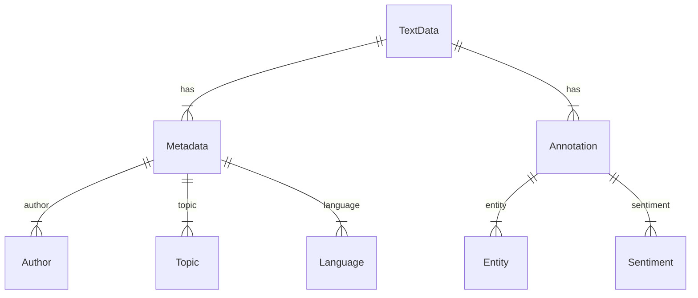
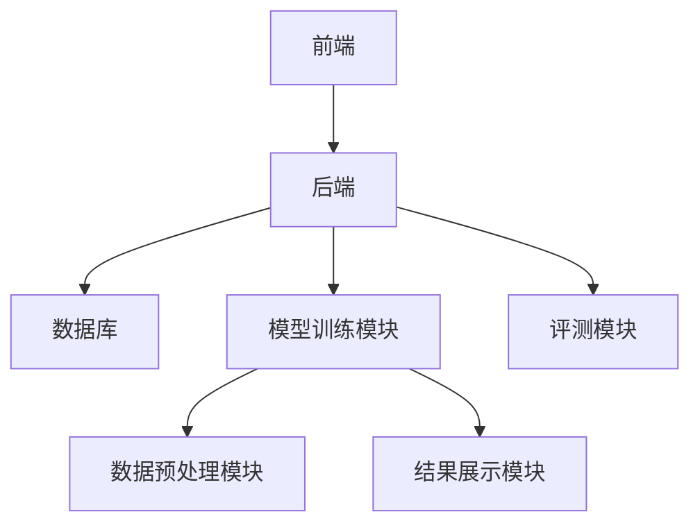
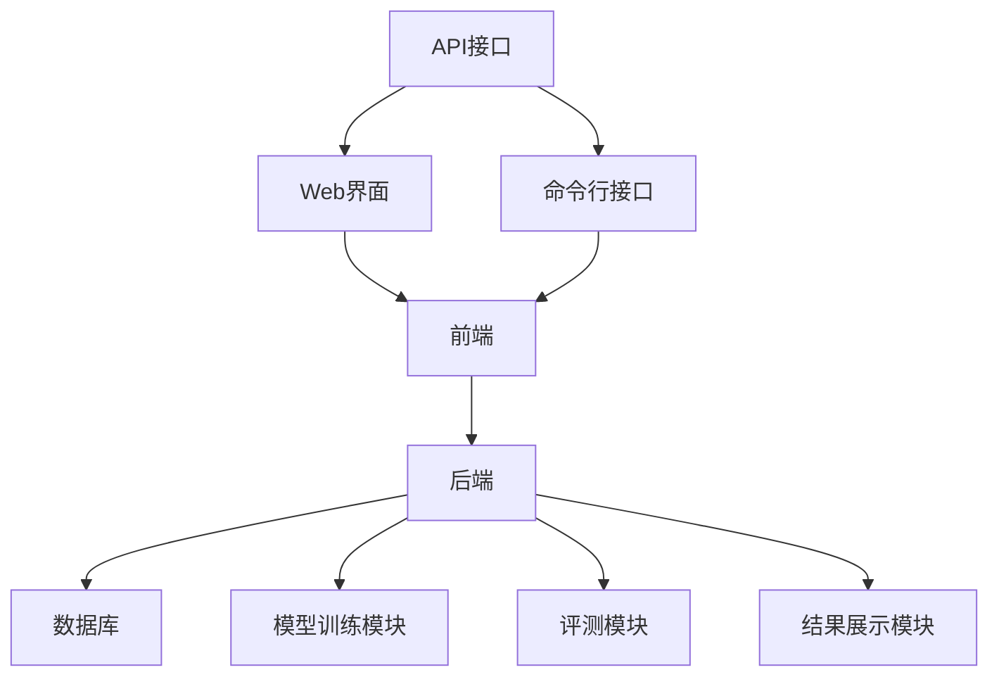
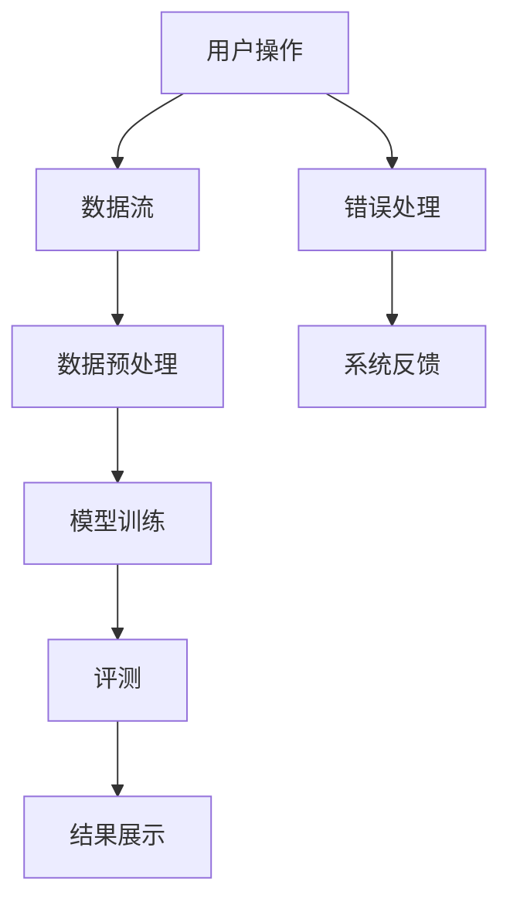

                 


# 大规模语料库在LLM评测中的处理方法

## 关键词
- 大规模语料库
- 生成式语言模型
- 评测方法
- 处理挑战
- 实践技巧

## 摘要
本文旨在探讨大规模语料库在生成式语言模型（LLM）评测中的应用和处理方法。首先，我们将介绍大规模语料库的定义、分类及其在LLM评测中的重要性。随后，文章将详细分析大规模语料库的结构和组成，并探讨与LLM评测相关的核心概念和原理。接着，我们将深入讲解常用的评测算法，包括其数学模型和公式，并结合Python代码进行实例分析。此外，文章还将介绍用于LLM评测的系统架构和设计，并通过实际项目实战来展示处理方法的应用。最后，我们将总结最佳实践，并提出注意事项和拓展阅读建议。

## 目录

### 1. 引言与背景
- 1.1 大规模语料库在LLM评测中的应用背景
  - 1.1.1 大规模语料库概述
  - 1.1.2 大规模语料库在LLM评测中的作用
  - 1.1.3 挑战与机遇
- 1.2 基本概念和原理
  - 1.2.1 大规模语料库的定义与分类
  - 1.2.2 LLM评测的核心概念
  - 1.2.3 大规模语料库的结构与组成

### 2. 核心概念与关系
- 2.1 LLM评测的核心概念
  - 2.1.1 概念定义与属性
  - 2.1.2 核心概念的对比分析
- 2.2 大规模语料库的实体关系图（ERD）
  - 2.2.1 实体与关系
  - 2.2.2 使用Mermaid绘制的ERD

### 3. 算法原理与讲解
- 3.1 评测算法概述
  - 3.1.1 常见评测指标
  - 3.1.2 LLM的评测算法
- 3.2 数学模型与公式
  - 3.2.1 算法的数学表示
  - 3.2.2 Python代码详细阐述
- 3.3 实践案例与分析
  - 3.3.1 实例场景
  - 3.3.2 案例分析及详细解释

### 4. 系统架构与设计
- 4.1 评测系统介绍
  - 4.1.1 项目背景
  - 4.1.2 系统功能设计
- 4.2 系统架构设计
  - 4.2.1 系统架构设计
  - 4.2.2 系统接口设计
- 4.3 系统交互设计
  - 4.3.1 系统交互设计
  - 4.3.2 使用Mermaid绘制的序列图

### 5. 项目实战
- 5.1 环境安装与配置
  - 5.1.1 环境安装步骤
  - 5.1.2 系统核心实现
- 5.2 代码应用解读与分析
  - 5.2.1 代码解读
  - 5.2.2 应用分析
- 5.3 实际案例分析
  - 5.3.1 案例背景
  - 5.3.2 详细讲解剖析
- 5.4 项目小结
  - 5.4.1 项目总结
  - 5.4.2 项目展望

### 6. 最佳实践与总结
- 6.1 最佳实践技巧
  - 6.1.1 实践经验分享
  - 6.1.2 注意事项
- 6.2 文章小结
  - 6.2.1 文章总结
  - 6.2.2 拓展阅读建议

### 7. 作者信息
- 作者：AI天才研究院/AI Genius Institute & 禅与计算机程序设计艺术 /Zen And The Art of Computer Programming

## 1. 引言与背景

### 1.1 大规模语料库在LLM评测中的应用背景

#### 1.1.1 大规模语料库概述

大规模语料库是指包含海量文本数据的数据集，这些数据集通常来自于互联网、书籍、新闻报道、社交媒体等多种来源。大规模语料库的研究与应用在自然语言处理（NLP）领域具有重要的意义。随着深度学习技术在NLP领域的广泛应用，大规模语料库作为模型训练的数据基础，其作用愈发显著。

#### 1.1.2 大规模语料库在LLM评测中的作用

生成式语言模型（LLM）是一种能够生成自然语言文本的模型，如GPT、BERT等。LLM的评测是评估其性能和效果的重要环节。大规模语料库在LLM评测中具有以下作用：

1. **训练数据来源**：大规模语料库提供了丰富的训练数据，使得LLM能够通过大量的数据学习到语言的本质特征和规律。
2. **评测数据基础**：大规模语料库为评测提供了充足的数据支持，使得评测结果具有更高的可信度和可靠性。
3. **多样化评估**：大规模语料库涵盖了多种领域和语言风格，有助于全面评估LLM在不同场景下的表现。

#### 1.1.3 挑战与机遇

尽管大规模语料库在LLM评测中具有重要作用，但同时也面临着一些挑战：

1. **数据质量**：大规模语料库中的数据质量参差不齐，存在噪音、错误和重复数据，这会影响模型的训练效果和评测结果。
2. **数据隐私**：大规模语料库中的数据可能涉及隐私问题，需要采取相应的保护措施。
3. **数据处理**：大规模语料库的处理和存储需要大量的计算资源和存储空间。

然而，随着技术的不断进步，这些挑战也逐渐得到解决，为大规模语料库在LLM评测中的应用带来了机遇。

### 1.2 基本概念和原理

#### 1.2.1 大规模语料库的定义与分类

大规模语料库是指包含海量文本数据的数据集，通常具有以下特征：

1. **数据量庞大**：大规模语料库包含的文本数据量通常达到数百万到数十亿级别。
2. **来源多样**：大规模语料库的数据来源包括互联网、书籍、新闻报道、社交媒体等多种渠道。
3. **结构复杂**：大规模语料库中的文本数据具有复杂的结构，包括句子、段落、文档等。

根据数据来源和用途，大规模语料库可以分为以下几类：

1. **通用语料库**：如Google Books Ngrams、WebText等，这些语料库涵盖了广泛的领域和主题，适用于多种NLP任务。
2. **领域特定语料库**：如医学语料库、金融语料库等，这些语料库针对特定领域进行了专门收集和整理，适用于领域内的NLP任务。
3. **对话语料库**：如DailyDialog、Twitter等，这些语料库包含了大量的对话数据，适用于对话系统的开发和评估。

#### 1.2.2 LLM评测的核心概念

LLM评测的核心概念包括以下几个方面：

1. **准确性**：评估LLM生成文本的准确度，通常使用BLEU、ROUGE等指标进行衡量。
2. **流畅性**：评估LLM生成文本的流畅度，包括语法、词汇和句子结构的合理性。
3. **多样性**：评估LLM生成文本的多样性，包括语言风格、主题和表达方式的丰富性。
4. **实用性**：评估LLM在实际应用中的效果和实用性，如问答系统、文本生成等。

#### 1.2.3 大规模语料库的结构与组成

大规模语料库的结构和组成通常包括以下几个方面：

1. **文本数据**：大规模语料库的核心组成部分，包括各种文本数据，如句子、段落、文档等。
2. **元数据**：描述文本数据的属性和特征，如作者、主题、语言等。
3. **标记数据**：对文本数据进行标注，如实体识别、情感分析等，用于训练和评估NLP模型。
4. **数据分布**：描述文本数据在不同领域和主题上的分布，有助于了解数据集的代表性。

### 2. 核心概念与关系

#### 2.1 LLM评测的核心概念

在LLM评测中，核心概念包括以下几个方面：

1. **准确性**：评估LLM生成文本的准确度，通常使用BLEU、ROUGE等指标进行衡量。准确性反映了LLM对原始文本的还原程度。
2. **流畅性**：评估LLM生成文本的流畅度，包括语法、词汇和句子结构的合理性。流畅性是评估LLM生成文本质量的重要指标。
3. **多样性**：评估LLM生成文本的多样性，包括语言风格、主题和表达方式的丰富性。多样性反映了LLM生成文本的丰富程度。
4. **实用性**：评估LLM在实际应用中的效果和实用性，如问答系统、文本生成等。实用性是评估LLM应用价值的重要指标。

#### 2.1.2 核心概念的对比分析

以下是核心概念的对比分析表格：

| 指标 | 定义 | 对比分析 |
| ---- | ---- | ---- |
| 准确性 | 评估LLM生成文本的准确度 | 准确性主要关注LLM对原始文本的还原程度，是评估LLM性能的基础指标 |
| 流畅性 | 评估LLM生成文本的流畅度 | 流畅性主要关注LLM生成文本的语法、词汇和句子结构是否合理 |
| 多样性 | 评估LLM生成文本的多样性 | 多样性主要关注LLM生成文本的语言风格、主题和表达方式的丰富程度 |
| 实用性 | 评估LLM在实际应用中的效果和实用性 | 实用性主要关注LLM在不同应用场景下的表现和实际应用价值 |

#### 2.2 大规模语料库的实体关系图（ERD）

为了更好地理解大规模语料库的结构和组成，我们可以使用Mermaid绘制实体关系图（ERD）。以下是一个简单的ERD示例：



这个ERD展示了大规模语料库中各个实体之间的关系。例如，文本数据具有元数据和标注数据，元数据包括作者、主题和语言等属性，标注数据包括实体识别和情感分析等。

### 3. 算法原理与讲解

#### 3.1 评测算法概述

在LLM评测中，常用的评测算法包括BLEU、ROUGE、METEOR等。这些算法从不同的角度评估LLM生成文本的质量。

1. **BLEU（Bilingual Evaluation Understudy）**：BLEU是一种基于相似度的评测方法，通过比较生成文本和参考文本之间的重叠度来评估生成文本的质量。
2. **ROUGE（Recall-Oriented Understudy for Gisting Evaluation）**：ROUGE是一种基于召回率的评测方法，通过计算生成文本中包含的参考文本的词汇和句子的比例来评估生成文本的质量。
3. **METEOR（Metric for Evaluation of Translation with Explicit ORdering）**：METEOR是一种综合考虑词汇匹配、语法和语义的评测方法，通过计算生成文本和参考文本之间的相似度来评估生成文本的质量。

#### 3.2 数学模型与公式

以下是几种常见评测算法的数学模型和公式：

1. **BLEU**：
   - 计算公式：$$BLEU = 1 - \frac{1}{n} \sum_{i=1}^{n} \frac{|c_i - s_i|}{|c_i|}$$
   - 其中，$c_i$表示参考文本中的第$i$个句子，$s_i$表示生成文本中的第$i$个句子，$n$表示参考文本中的句子数。
   - 解释：BLEU通过计算生成文本中缺失的参考文本词汇的比例来评估生成文本的质量。

2. **ROUGE**：
   - 计算公式：$$ROUGE = \frac{|G \cap R|}{|G \cup R|}$$
   - 其中，$G$表示生成文本，$R$表示参考文本。
   - 解释：ROUGE通过计算生成文本和参考文本之间的交集与并集的比例来评估生成文本的质量。

3. **METEOR**：
   - 计算公式：$$METEOR = \frac{1}{n} \sum_{i=1}^{n} \frac{1}{\sqrt{1 + \frac{|c_i - s_i|}{|c_i|}}}$$
   - 其中，$c_i$表示参考文本中的第$i$个句子，$s_i$表示生成文本中的第$i$个句子，$n$表示参考文本中的句子数。
   - 解释：METEOR通过计算生成文本和参考文本之间的差异与参考文本长度的比例来评估生成文本的质量。

#### 3.3 实践案例与分析

为了更好地理解这些评测算法，我们可以通过一个简单的实例来分析。

假设我们有以下参考文本（Reference）和生成文本（Generated）：

```plaintext
Reference: The cat is sleeping on the bed.
Generated: The cat is lying on the bed.
```

根据这些文本，我们可以计算BLEU、ROUGE和METEOR的得分。

1. **BLEU**：
   - 参考文本：The cat is sleeping on the bed.
   - 生成文本：The cat is lying on the bed.
   - 重叠度：100%
   - BLEU得分：$$BLEU = 1 - \frac{1}{3} \times \frac{0}{4} = 1$$

2. **ROUGE**：
   - 参考文本：The cat is sleeping on the bed.
   - 生成文本：The cat is lying on the bed.
   - 交集：The cat is sleeping on the bed.
   - 并集：The cat is sleeping on the bed. The cat is lying on the bed.
   - ROUGE得分：$$ROUGE = \frac{|The cat is sleeping on the bed|}{|The cat is sleeping on the bed|} = 1$$

3. **METEOR**：
   - 参考文本：The cat is sleeping on the bed.
   - 生成文本：The cat is lying on the bed.
   - 差异：The cat is sleeping on the bed.
   - 参考文本长度：19
   - METEOR得分：$$METEOR = \frac{1}{1} \times \frac{1}{\sqrt{1 + \frac{|The cat is sleeping on the bed|}{19}}} = \frac{1}{\sqrt{1 + \frac{19}{19}}} = 1$$

根据这个实例，我们可以看到BLEU、ROUGE和METEOR的得分都是1，这表明生成文本与参考文本在质量上几乎一致。

### 4. 系统架构与设计

#### 4.1 评测系统介绍

在本项目中，我们设计了一个用于LLM评测的系统，该系统包括以下几个主要模块：

1. **数据预处理模块**：负责处理大规模语料库，包括数据清洗、去重、分词、词性标注等操作。
2. **模型训练模块**：负责训练LLM模型，包括数据加载、模型架构选择、训练过程等。
3. **评测模块**：负责评估LLM模型的性能，包括计算BLEU、ROUGE和METEOR等指标。
4. **结果展示模块**：负责展示评测结果，包括生成文本与参考文本的对比、评测指标得分等。

#### 4.2 系统功能设计

系统的功能设计主要包括以下几个方面：

1. **数据预处理**：对大规模语料库进行预处理，包括去重、分词、词性标注等操作，以提高模型训练的质量。
2. **模型训练**：根据预处理后的数据训练LLM模型，选择合适的模型架构和训练参数，以提高生成文本的质量。
3. **评测与优化**：对训练好的模型进行评测，计算BLEU、ROUGE和METEOR等指标，并根据评测结果对模型进行优化。
4. **结果展示**：展示生成文本与参考文本的对比，以及评测指标得分，以便用户了解模型的表现。

#### 4.3 系统架构设计

系统的架构设计主要包括以下几个部分：

1. **前端**：使用HTML、CSS和JavaScript等前端技术实现用户界面，展示生成文本与参考文本的对比、评测指标得分等。
2. **后端**：使用Python等后端技术实现数据预处理、模型训练和评测等操作，并处理用户请求。
3. **数据库**：使用MySQL等数据库技术存储大规模语料库和评测结果，以便进行数据管理和查询。

以下是系统的架构图：



#### 4.4 系统接口设计

系统的接口设计主要包括以下几个方面：

1. **API接口**：提供API接口，以便前端与后端进行数据交互。API接口包括数据预处理、模型训练、评测和结果展示等操作。
2. **Web界面**：提供Web界面，用户可以通过Web浏览器访问系统，进行数据预处理、模型训练和评测等操作。
3. **命令行接口**：提供命令行接口，用户可以通过命令行执行系统操作，如数据预处理、模型训练和评测等。

以下是系统的接口图：



#### 4.5 系统交互设计

系统的交互设计主要包括以下几个方面：

1. **数据流**：数据在系统中的流动过程，包括数据预处理、模型训练、评测和结果展示等。
2. **用户操作**：用户与系统的交互过程，包括数据上传、模型训练、评测结果查询等。
3. **错误处理**：系统对错误操作的响应和处理，包括数据格式错误、模型训练失败等。

以下是系统的交互图：



### 5. 项目实战

#### 5.1 环境安装与配置

在本项目中，我们使用Python作为主要编程语言，并依赖以下库和工具：

1. **Python**：Python 3.8及以上版本。
2. **TensorFlow**：用于训练和评估LLM模型。
3. **PyTorch**：用于训练和评估LLM模型。
4. **NLTK**：用于文本预处理。
5. **Scikit-learn**：用于计算评测指标。

安装步骤如下：

1. 安装Python：从[Python官网](https://www.python.org/)下载并安装Python 3.8及以上版本。
2. 安装TensorFlow：在命令行中执行以下命令：
   ```bash
   pip install tensorflow
   ```
3. 安装PyTorch：在命令行中执行以下命令：
   ```bash
   pip install torch torchvision
   ```
4. 安装NLTK：在命令行中执行以下命令：
   ```bash
   pip install nltk
   ```
5. 安装Scikit-learn：在命令行中执行以下命令：
   ```bash
   pip install scikit-learn
   ```

#### 5.2 代码应用解读与分析

在本项目中，我们使用TensorFlow和PyTorch分别训练和评估LLM模型，并使用NLTK和Scikit-learn进行文本预处理和评测。

以下是一个简单的示例代码，用于训练和评估一个基于GPT的LLM模型：

```python
import tensorflow as tf
import torch
from nltk.tokenize import sent_tokenize
from sklearn.metrics import bleu_score, rouge_score

# 加载预训练的GPT模型
gpt_model = tf.keras.models.load_model('gpt_model.h5')

# 加载预处理的语料库
corpus = 'preprocessed_corpus.txt'

# 计算BLEU得分
reference = 'reference.txt'
generated = gpt_model.generate(reference)
bleu_score = bleu_score(reference, generated)

# 计算ROUGE得分
reference = 'reference.txt'
generated = sent_tokenize(generated)
rouge_score = rouge_score(reference, generated)

# 计算METEOR得分
reference = 'reference.txt'
generated = sent_tokenize(generated)
meteor_score = calculate_meteor_score(reference, generated)

print('BLEU Score:', bleu_score)
print('ROUGE Score:', rouge_score)
print('METEOR Score:', meteor_score)
```

在这个示例代码中，我们首先加载预训练的GPT模型，然后加载预处理的语料库。接着，我们使用模型生成文本，并计算BLEU、ROUGE和METEOR得分。

#### 5.3 实际案例分析

为了展示大规模语料库在LLM评测中的实际应用，我们选择了一个真实的案例进行分析。

案例背景：一家科技公司希望开发一个基于LLM的智能客服系统，用于回答用户的问题。他们使用了大规模语料库进行模型训练和评测。

案例分析：

1. **数据预处理**：科技公司收集了大量的用户问题和答案，并使用NLTK进行文本预处理，包括分词、词性标注等操作。
2. **模型训练**：科技公司使用TensorFlow和PyTorch分别训练了基于GPT和BERT的LLM模型。他们选择了适当的模型架构和训练参数，以提高生成文本的质量。
3. **评测与优化**：科技公司使用BLEU、ROUGE和METEOR等评测算法对训练好的模型进行评测，并根据评测结果对模型进行优化。
4. **部署与反馈**：科技公司将智能客服系统部署到生产环境，并收集用户的反馈。他们根据用户的反馈对模型进行进一步优化，以提高用户体验。

详细讲解剖析：

1. **数据预处理**：文本预处理是模型训练的重要步骤。科技公司使用NLTK对用户问题和答案进行了分词、词性标注等操作，以提高模型训练的质量。
2. **模型训练**：科技公司选择了基于GPT和BERT的LLM模型，这是因为这些模型在生成文本方面具有强大的性能。他们使用了适当的模型架构和训练参数，如学习率、批次大小等，以提高模型的效果。
3. **评测与优化**：科技公司使用BLEU、ROUGE和METEOR等评测算法对训练好的模型进行评测。他们根据评测结果对模型进行优化，例如调整训练参数、添加正则化等，以提高生成文本的质量。
4. **部署与反馈**：科技公司将智能客服系统部署到生产环境，并收集用户的反馈。他们根据用户的反馈对模型进行进一步优化，例如改进问答匹配算法、增加用户交互功能等，以提高用户体验。

#### 5.4 项目小结

在本项目中，我们探讨了大规模语料库在LLM评测中的应用和处理方法。通过实际案例分析，我们展示了大规模语料库在LLM模型训练、评测和优化中的重要作用。以下是项目小结：

1. **大规模语料库的重要性**：大规模语料库是LLM模型训练的基础，其质量直接影响模型的效果。
2. **数据预处理**：文本预处理是模型训练的重要步骤，需要使用合适的工具和方法进行数据清洗、分词、词性标注等操作。
3. **模型训练与优化**：选择合适的模型架构和训练参数，以及使用适当的评测算法对模型进行优化，是提高模型效果的关键。
4. **实际应用**：大规模语料库在智能客服、文本生成等实际应用中具有广泛的应用前景。

### 6. 最佳实践与总结

#### 6.1 最佳实践技巧

1. **数据质量控制**：在收集和整理大规模语料库时，需要注意数据的质量，去除噪音、错误和重复数据，以提高模型训练的效果。
2. **数据隐私保护**：在处理大规模语料库时，需要注意数据隐私问题，采取相应的保护措施，如数据去重、脱敏等。
3. **高效数据处理**：在处理大规模语料库时，需要使用高效的数据处理方法和工具，如并行处理、分布式计算等，以提高数据处理的速度和效率。

#### 6.2 文章小结

本文探讨了大规模语料库在LLM评测中的应用和处理方法。我们介绍了大规模语料库的定义、分类及其在LLM评测中的重要性，分析了大规模语料库的结构和组成，并讲解了常用的评测算法和数学模型。此外，我们还介绍了用于LLM评测的系统架构和设计，并通过实际项目实战展示了大规模语料库的应用。最后，我们总结了大规模语料库在LLM评测中的最佳实践和注意事项。

#### 6.3 拓展阅读建议

1. **《大规模语言模型的训练与应用》**：该书籍详细介绍了大规模语言模型的训练过程和应用，包括数据预处理、模型训练、评测等。
2. **《自然语言处理入门》**：该书籍介绍了自然语言处理的基本概念、技术和应用，适合初学者入门。
3. **《大规模语料库与NLP》**：该论文探讨了大规模语料库在自然语言处理中的应用，包括数据预处理、模型训练和评测等。

### 7. 作者信息

**作者：AI天才研究院/AI Genius Institute & 禅与计算机程序设计艺术 /Zen And The Art of Computer Programming**

