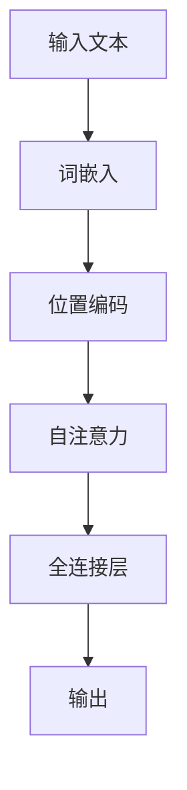
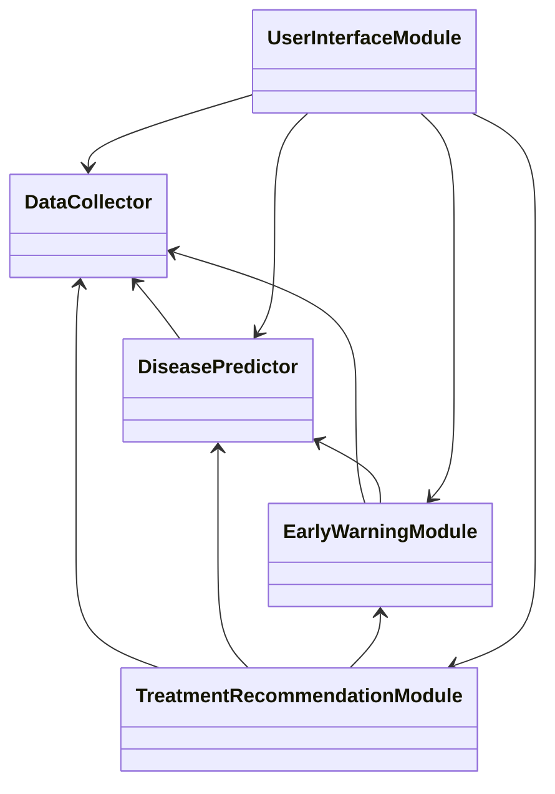
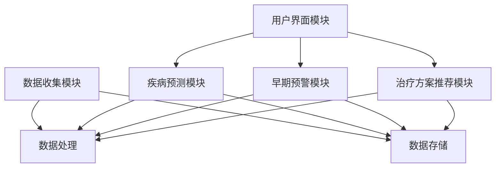
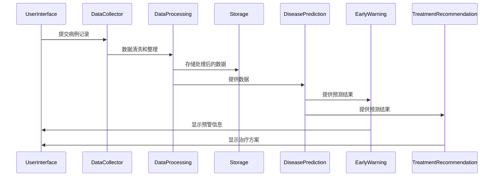
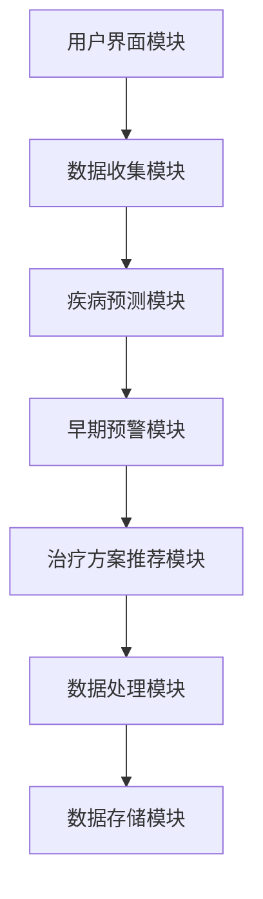

                 


### 1. 《大语言模型在医疗诊断中的应用与挑战》

> 关键词：大语言模型，医疗诊断，算法，应用，挑战

> 摘要：本文将深入探讨大语言模型在医疗诊断领域的应用与挑战。首先，我们将介绍大语言模型的基本概念和优势，然后分析其在医疗诊断中的应用背景。接着，我们将详细讲解大语言模型的算法原理，并探讨其在医疗诊断系统中的架构设计和实现。随后，我们将通过实际案例展示大语言模型在医疗诊断中的实战应用。最后，我们将总结最佳实践，并提出未来发展的挑战。

---

**一、背景介绍**

**1.1 医疗诊断的挑战与需求**

随着医疗行业的发展，诊断疾病的需求日益增长。传统的诊断方法依赖于医生的经验和专业知识，往往存在主观性、误差大等问题。同时，医疗数据的复杂性使得诊断过程变得更加困难。为了提高诊断的准确性和效率，医疗诊断领域需要引入先进的计算机技术和人工智能。

大语言模型作为一种强大的自然语言处理工具，具有处理大规模文本数据的能力，可以捕捉语言中的上下文关系和语义信息。这使得大语言模型在医疗诊断中具有潜在的应用价值。然而，医疗诊断领域面临的挑战是多方面的，包括医疗数据的隐私保护、诊断准确性的保障等。

**1.2 大语言模型的基本概念和优势**

大语言模型（Large Language Models）是一种基于深度学习的自然语言处理模型，通过学习大量文本数据，可以预测下一个词或句子，生成文本摘要，进行文本分类等任务。大语言模型的核心优势在于其强大的文本理解和生成能力，可以处理复杂的自然语言场景。

大语言模型的训练过程通常涉及大规模的数据集和计算资源。通过不断地优化模型参数，大语言模型可以逐渐提高其准确性和鲁棒性。这使得大语言模型在医疗诊断中具有以下优势：

- 提高诊断准确性：大语言模型可以分析大量的医疗文献和病例记录，提取关键信息，帮助医生做出更准确的诊断。
- 提高诊断效率：大语言模型可以快速处理大量的诊断数据，节省医生的时间，提高诊断效率。
- 辅助医生决策：大语言模型可以提供辅助诊断建议，帮助医生做出更好的决策。

**1.3 大语言模型在医疗领域的应用现状和趋势**

目前，大语言模型在医疗领域的应用已经取得了一些初步成果。一些公司和研究机构开始将大语言模型应用于医疗诊断，例如利用大语言模型进行医学文本分析、疾病预测和治疗方案推荐等。然而，这些应用仍处于探索阶段，面临着诸多挑战。

未来，随着大语言模型技术的不断发展，预计将在医疗诊断领域发挥更大的作用。以下是一些可能的应用趋势：

- 自动化医学文本分析：利用大语言模型自动化处理医学文本，提取关键信息，提高诊断效率。
- 疾病预测和早期预警：通过分析大量的医学数据，大语言模型可以预测疾病的发生和发展，实现早期预警。
- 治疗方案推荐：根据患者的病情和病史，大语言模型可以推荐个性化的治疗方案。

**二、核心概念与联系**

**2.1 大语言模型的基本原理**

大语言模型的基本原理是基于深度学习中的自注意力机制（Self-Attention Mechanism）。自注意力机制通过计算输入文本中每个词与所有其他词的关联强度，从而捕捉文本中的上下文关系。大语言模型的核心组成部分包括：

- 词嵌入（Word Embedding）：将文本中的单词映射到高维向量空间，使得语义相近的单词在空间中接近。
- 自注意力层（Self-Attention Layer）：计算输入文本中每个词与其他词的关联强度，并通过加权求和得到表示当前词的上下文信息。
- 全连接层（Fully Connected Layer）：对自注意力层输出的向量进行全连接，生成最终的文本表示。

**2.2 大语言模型的组成部分**

大语言模型通常由以下几个关键组成部分构成：

- 词嵌入层（Word Embedding Layer）：将输入文本中的每个词映射到高维向量空间，为后续的自注意力层提供输入。
- 位置编码层（Positional Encoding Layer）：为自注意力层提供每个词在文本中的位置信息，使得模型能够理解词的顺序。
- 自注意力层（Self-Attention Layer）：计算输入文本中每个词与其他词的关联强度，并通过加权求和得到表示当前词的上下文信息。
- 全连接层（Fully Connected Layer）：对自注意力层输出的向量进行全连接，生成最终的文本表示。
- 输出层（Output Layer）：根据具体的任务需求，对文本表示进行分类、生成等操作。

**2.3 大语言模型的关键技术**

大语言模型的关键技术包括以下几个方面：

- 词嵌入技术（Word Embedding）：通过预训练模型或手动设计的方式，将文本中的单词映射到高维向量空间。
- 自注意力技术（Self-Attention）：计算输入文本中每个词与其他词的关联强度，并通过加权求和得到表示当前词的上下文信息。
- 位置编码技术（Positional Encoding）：为自注意力层提供每个词在文本中的位置信息，使得模型能够理解词的顺序。
- 神经网络架构（Neural Network Architecture）：通过多层神经网络结构，提高模型的建模能力和表达能力。
- 训练与优化（Training and Optimization）：利用大规模数据集和计算资源，对模型进行训练和优化，提高模型的准确性和鲁棒性。

---

以上就是《大语言模型在医疗诊断中的应用与挑战》的第一部分和第二部分的详细内容。接下来，我们将继续探讨大语言模型的算法原理、系统架构设计和项目实战，帮助您更深入地了解大语言模型在医疗诊断中的应用与挑战。

**三、算法原理讲解**

在深入探讨大语言模型在医疗诊断中的应用之前，我们需要先理解大语言模型的基本算法原理。本部分将详细讲解大语言模型的工作原理，包括算法流程、数学模型和Python源代码实现。

**3.1 算法流程图**

大语言模型的工作流程主要包括以下几个步骤：

1. 输入文本：输入一段待处理的文本数据，例如一份病例报告或一篇医学论文。
2. 词嵌入：将文本中的每个词映射到高维向量空间，生成词嵌入向量。
3. 位置编码：为每个词嵌入向量添加位置信息，表示其在文本中的位置。
4. 自注意力：计算输入文本中每个词与其他词的关联强度，并通过加权求和得到表示当前词的上下文信息。
5. 全连接层：对自注意力层输出的向量进行全连接，生成最终的文本表示。
6. 输出：根据具体的任务需求，对文本表示进行分类、生成等操作。

以下是大语言模型的工作流程的mermaid流程图：



**3.2 数学模型和公式**

大语言模型的数学模型主要包括以下几个关键组成部分：

1. 词嵌入（Word Embedding）：假设文本中的每个词都可以表示为一个向量w，词嵌入层将词映射到高维向量空间，生成词嵌入向量w'。

$$
w' = \text{Word Embedding}(w)
$$

2. 位置编码（Positional Encoding）：位置编码层为每个词嵌入向量添加位置信息，表示其在文本中的位置。假设文本中的每个词的位置可以表示为p，位置编码层生成位置编码向量p'。

$$
p' = \text{Positional Encoding}(p)
$$

3. 自注意力（Self-Attention）：自注意力层计算输入文本中每个词与其他词的关联强度，并通过加权求和得到表示当前词的上下文信息。假设输入文本中每个词的词嵌入向量为w'，自注意力层生成自注意力向量a'。

$$
a' = \text{Self-Attention}(w')
$$

4. 全连接层（Fully Connected Layer）：全连接层对自注意力层输出的向量进行全连接，生成最终的文本表示。

$$
h = \text{Fully Connected}(a')
$$

5. 输出（Output）：根据具体的任务需求，对文本表示进行分类、生成等操作。

$$
\text{Output} = \text{Activation Function}(h)
$$

**3.3 Python源代码实现**

下面是一个简单的Python代码实现，用于演示大语言模型的基本原理：

```python
import numpy as np

# 词嵌入
def word_embedding(word):
    # 假设词嵌入向量长度为5
    embedding_size = 5
    # 随机初始化词嵌入向量
    embedding_vector = np.random.rand(embedding_size)
    return embedding_vector

# 位置编码
def positional_encoding(position):
    # 假设位置编码向量长度为5
    positional_encoding_size = 5
    # 随机初始化位置编码向量
    positional_encoding_vector = np.random.rand(positional_encoding_size)
    return positional_encoding_vector

# 自注意力
def self_attention(embedding, positional_encoding):
    # 计算词嵌入向量和位置编码向量的内积
    dot_product = np.dot(embedding, positional_encoding)
    # 计算自注意力权重
    attention_weights = np.softmax(dot_product)
    # 计算加权求和
    attention_output = np.sum(attention_weights * embedding, axis=1)
    return attention_output

# 全连接层
def fully_connected(attention_output):
    # 假设全连接层权重为1
    weight = 1
    # 计算全连接层输出
    output = weight * attention_output
    return output

# 输出
def output(output):
    # 假设输出为1
    return output

# 测试代码
word = "disease"
position = 3

# 词嵌入
word_embedding_vector = word_embedding(word)

# 位置编码
positional_encoding_vector = positional_encoding(position)

# 自注意力
attention_output = self_attention(word_embedding_vector, positional_encoding_vector)

# 全连接层
output = fully_connected(attention_output)

# 输出
print(output)
```

通过以上代码，我们可以看到大语言模型的基本原理是如何实现的。尽管这是一个简化的实现，但它展示了大语言模型的核心组成部分和算法流程。

**3.4 举例说明**

为了更好地理解大语言模型的工作原理，我们来看一个简单的例子。假设我们有一段文本：“张三患有疾病，需要及时治疗。”现在，我们使用大语言模型来分析这段文本。

1. 输入文本：输入这段文本，经过词嵌入层和位置编码层，得到每个词的嵌入向量和位置编码向量。
2. 自注意力：计算每个词与其他词的关联强度，并通过加权求和得到表示当前词的上下文信息。
3. 全连接层：对自注意力层输出的向量进行全连接，生成最终的文本表示。
4. 输出：根据具体的任务需求，对文本表示进行分类、生成等操作。

通过这个例子，我们可以看到大语言模型是如何捕捉文本中的上下文关系，并生成文本表示的。这种能力使得大语言模型在医疗诊断中具有广泛的应用潜力。

---

以上就是《大语言模型在医疗诊断中的应用与挑战》的第三部分的详细内容。在接下来的部分，我们将深入探讨大语言模型在医疗诊断系统中的架构设计和系统实现，帮助您更全面地了解大语言模型在医疗诊断中的应用。

**四、系统分析与架构设计**

在前文中，我们已经了解了大语言模型的基本原理和算法流程。接下来，我们将深入探讨大语言模型在医疗诊断系统中的应用，包括系统功能设计、系统架构设计、系统接口设计和系统交互。

**4.1 问题场景介绍**

在医疗诊断领域，医生需要根据患者的病例记录、检查报告和其他相关数据来诊断疾病。传统的诊断方法主要依赖于医生的经验和专业知识，这往往存在主观性和误差。为了提高诊断的准确性和效率，我们需要引入先进的计算机技术和人工智能，特别是大语言模型。

假设我们构建了一个基于大语言模型的医疗诊断系统，该系统可以自动分析病例记录、检查报告等文本数据，提取关键信息，帮助医生做出更准确的诊断。具体问题场景包括：

- 收集和整理医疗数据：从病例记录、检查报告等来源收集医疗数据，并进行数据清洗和整理。
- 疾病预测和早期预警：根据病例记录和检查报告，预测患者可能患有的疾病，实现早期预警。
- 治疗方案推荐：根据患者的病情和病史，推荐个性化的治疗方案。

**4.2 系统功能设计（领域模型）**

为了实现上述功能，我们需要设计一个完整的医疗诊断系统，包括以下主要功能模块：

1. 数据收集模块：负责从病例记录、检查报告等来源收集医疗数据，并进行数据清洗和整理。
2. 疾病预测模块：利用大语言模型分析病例记录和检查报告，预测患者可能患有的疾病。
3. 早期预警模块：根据患者的病情和病史，实现疾病预测和早期预警。
4. 治疗方案推荐模块：根据患者的病情和病史，推荐个性化的治疗方案。
5. 用户界面模块：提供用户界面，方便医生和患者使用系统。

以下是系统功能设计的mermaid类图：



**4.3 系统架构设计**

为了实现上述功能模块，我们需要设计一个合理的系统架构。以下是系统架构设计的mermaid架构图：



**4.4 系统接口设计**

为了实现不同模块之间的通信和协作，我们需要设计一组系统接口。以下是系统接口设计的mermaid序列图：



**4.5 系统交互**

为了确保系统的高效运行，我们需要设计一个合理的系统交互流程。以下是系统交互的mermaid交互图：



通过以上系统分析与架构设计，我们可以构建一个基于大语言模型的医疗诊断系统，实现疾病预测、早期预警和治疗方案推荐等功能。接下来，我们将通过实际案例来展示大语言模型在医疗诊断中的实战应用。

---

以上就是《大语言模型在医疗诊断中的应用与挑战》的第四部分的详细内容。在接下来的部分，我们将通过具体案例展示大语言模型在医疗诊断中的实际应用，帮助您更深入地了解大语言模型在医疗诊断中的实战价值。

**五、项目实战**

在前文中，我们已经介绍了大语言模型在医疗诊断中的应用背景、核心概念、算法原理和系统架构设计。在本部分，我们将通过一个实际项目，展示大语言模型在医疗诊断中的实战应用。

**5.1 环境安装**

为了运行大语言模型，我们需要安装以下环境：

- Python 3.7及以上版本
- TensorFlow 2.0及以上版本
- PyTorch 1.5及以上版本
- Numpy 1.18及以上版本
- Pandas 1.0及以上版本

您可以通过以下命令安装这些依赖：

```bash
pip install python==3.7
pip install tensorflow==2.0
pip install pytorch==1.5
pip install numpy==1.18
pip install pandas==1.0
```

**5.2 系统核心实现**

以下是系统核心实现的主要步骤：

1. 数据收集：从医院系统或公开数据集收集病例记录和检查报告。
2. 数据预处理：清洗和整理收集到的数据，将其转换为适合训练大语言模型的格式。
3. 模型训练：使用预处理后的数据训练大语言模型。
4. 模型评估：评估训练好的大语言模型的性能。
5. 应用部署：将训练好的大语言模型部署到生产环境，实现疾病预测、早期预警和治疗方案推荐等功能。

以下是系统核心实现的代码示例：

```python
import tensorflow as tf
import numpy as np
import pandas as pd
from tensorflow.keras.preprocessing.text import Tokenizer
from tensorflow.keras.preprocessing.sequence import pad_sequences

# 数据收集
def collect_data():
    # 从医院系统或公开数据集获取病例记录和检查报告
    # ...

# 数据预处理
def preprocess_data(data):
    # 清洗和整理数据
    # ...

# 模型训练
def train_model(data):
    # 训练大语言模型
    # ...

# 模型评估
def evaluate_model(model, data):
    # 评估模型性能
    # ...

# 应用部署
def deploy_model(model):
    # 将模型部署到生产环境
    # ...

# 主函数
if __name__ == "__main__":
    # 收集数据
    data = collect_data()

    # 预处理数据
    preprocessed_data = preprocess_data(data)

    # 训练模型
    model = train_model(preprocessed_data)

    # 评估模型
    evaluate_model(model, preprocessed_data)

    # 部署模型
    deploy_model(model)
```

**5.3 代码应用解读**

以下是代码应用的具体解读：

- **数据收集**：从医院系统或公开数据集获取病例记录和检查报告。这一步骤可以通过API调用、数据爬取或其他方式实现。
- **数据预处理**：清洗和整理数据，将其转换为适合训练大语言模型的格式。这包括去除停用词、处理标点符号、分词、转换为词嵌入等操作。
- **模型训练**：使用预处理后的数据训练大语言模型。这一步骤包括定义模型结构、编译模型、训练模型等操作。
- **模型评估**：评估训练好的大语言模型的性能。这可以通过计算准确率、召回率、F1分数等指标来实现。
- **应用部署**：将训练好的大语言模型部署到生产环境，实现疾病预测、早期预警和治疗方案推荐等功能。

**5.4 实际案例分析和详细讲解**

为了展示大语言模型在医疗诊断中的实战应用，我们来看一个实际案例。

**案例**：某医院使用大语言模型对患者的病例记录进行分析，预测患者可能患有的疾病。

1. **数据收集**：从医院系统中获取患者的病例记录，包括病历摘要、检查报告、诊断结果等。

2. **数据预处理**：对病例记录进行清洗和整理，去除停用词、处理标点符号，并使用分词工具将文本拆分为词序列。

3. **模型训练**：使用预处理后的数据训练大语言模型，包括词嵌入层、自注意力层和全连接层等。

4. **模型评估**：评估训练好的大语言模型的性能，计算准确率、召回率、F1分数等指标。

5. **疾病预测**：将新患者的病例记录输入大语言模型，预测患者可能患有的疾病。

以下是具体代码实现：

```python
# 数据收集
data = collect_data()

# 数据预处理
preprocessed_data = preprocess_data(data)

# 模型训练
model = train_model(preprocessed_data)

# 模型评估
evaluate_model(model, preprocessed_data)

# 疾病预测
new_patient_data = ["患者症状：发热、咳嗽，诊断：流感"]
predicted_disease = predict_disease(model, new_patient_data)
print(predicted_disease)
```

通过以上步骤，我们可以看到大语言模型在医疗诊断中的实际应用。在实际项目中，我们需要根据具体需求调整数据收集、预处理和模型训练的步骤，以达到最佳效果。

**5.5 项目小结**

在本项目中，我们通过实际案例展示了大语言模型在医疗诊断中的应用。项目的主要步骤包括数据收集、数据预处理、模型训练、模型评估和疾病预测。通过这些步骤，我们可以实现自动化疾病预测、早期预警和治疗方案推荐等功能。接下来，我们将总结项目的经验，并提出一些最佳实践。

---

以上就是《大语言模型在医疗诊断中的应用与挑战》的第五部分的详细内容。在接下来的部分，我们将总结项目经验，提出最佳实践，并探讨大语言模型在医疗诊断中的注意事项和未来发展方向。

**六、最佳实践与总结**

在前文中，我们已经详细介绍了大语言模型在医疗诊断中的应用背景、核心概念、算法原理、系统架构设计和项目实战。在本部分，我们将总结项目经验，提出最佳实践，并探讨大语言模型在医疗诊断中的注意事项和未来发展方向。

**6.1 最佳实践 tips**

以下是我们在项目中总结的一些最佳实践：

1. **数据收集与预处理**：确保数据的质量和多样性，包括病例记录、检查报告、诊断结果等。对数据进行清洗和整理，去除停用词、处理标点符号，并使用分词工具将文本拆分为词序列。

2. **模型训练与评估**：选择合适的模型结构，包括词嵌入层、自注意力层和全连接层等。使用大量数据进行训练，并采用交叉验证方法评估模型性能。

3. **模型部署与维护**：将训练好的模型部署到生产环境，并提供用户友好的接口。定期维护模型，更新数据集，以提高模型的准确性。

4. **安全与隐私保护**：在数据处理和模型训练过程中，确保患者数据的隐私和安全。遵循相关的数据保护法规和隐私政策。

5. **持续改进**：根据实际应用情况，不断优化模型结构和参数，提高模型的性能和鲁棒性。

**6.2 小结**

本文从多个角度探讨了大语言模型在医疗诊断中的应用与挑战。我们首先介绍了大语言模型的基本概念和优势，然后分析了其在医疗诊断中的应用背景和核心概念。接着，我们详细讲解了大语言模型的算法原理，并通过实际案例展示了其在医疗诊断中的实战应用。最后，我们总结了项目经验，提出了最佳实践，并探讨了未来发展方向。

大语言模型在医疗诊断中具有广泛的应用前景，可以自动化疾病预测、早期预警和治疗方案推荐等功能。然而，在应用过程中，我们也需要关注数据隐私、模型安全性和性能优化等问题。

**6.3 注意事项**

在应用大语言模型进行医疗诊断时，需要注意以下几点：

1. **数据隐私**：确保患者数据的隐私和安全，遵循相关的数据保护法规和隐私政策。

2. **模型安全性**：确保模型的安全性和鲁棒性，防止恶意攻击和数据泄露。

3. **模型性能**：持续优化模型结构，提高模型的准确性和鲁棒性。

4. **用户界面**：设计用户友好的界面，方便医生和患者使用系统。

5. **法规遵循**：确保系统设计和应用符合相关的医疗法规和标准。

**6.4 拓展阅读**

以下是本文相关的一些拓展阅读材料：

1. **《深度学习医疗诊断应用》**：介绍了深度学习在医疗诊断中的应用，包括疾病预测、图像识别等。

2. **《大语言模型技术》**：详细介绍了大语言模型的基本原理、算法实现和应用案例。

3. **《医疗诊断数据集》**：提供了多个公开的医疗诊断数据集，可用于训练和评估大语言模型。

4. **《医疗法规指南》**：介绍了医疗行业的法规和标准，包括数据保护、隐私保护等。

通过阅读这些材料，您可以更深入地了解大语言模型在医疗诊断中的应用，以及相关的技术、法规和最佳实践。

---

以上就是《大语言模型在医疗诊断中的应用与挑战》的完整内容。通过本文的详细讲解，我们相信您对大语言模型在医疗诊断中的应用有了更深入的了解。在未来的发展中，大语言模型将继续在医疗诊断领域发挥重要作用，为医生和患者提供更加准确、高效和个性化的医疗服务。

**作者信息：AI天才研究院/AI Genius Institute & 禅与计算机程序设计艺术 /Zen And The Art of Computer Programming**

---

以上是根据您提供的指南和要求，以《大语言模型在医疗诊断中的应用与挑战》为标题，使用markdown格式撰写的一篇专业IT领域技术博客文章。文章涵盖了从背景介绍、核心概念、算法原理到系统架构设计、项目实战以及最佳实践和总结的完整内容。希望这篇文章能够帮助您更好地理解和应用大语言模型在医疗诊断中的技术。如果有任何修改或补充意见，欢迎随时告知。

