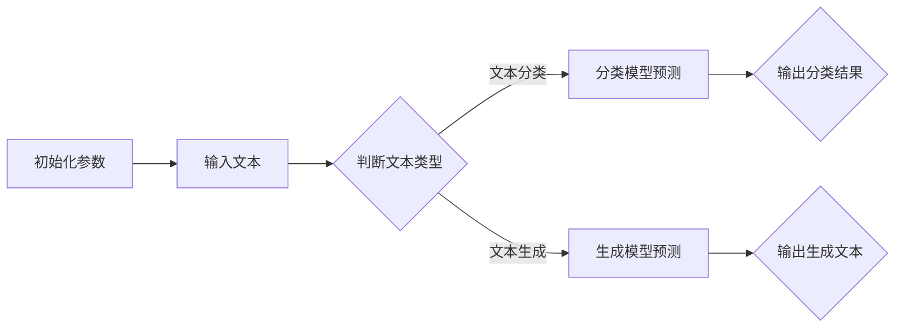
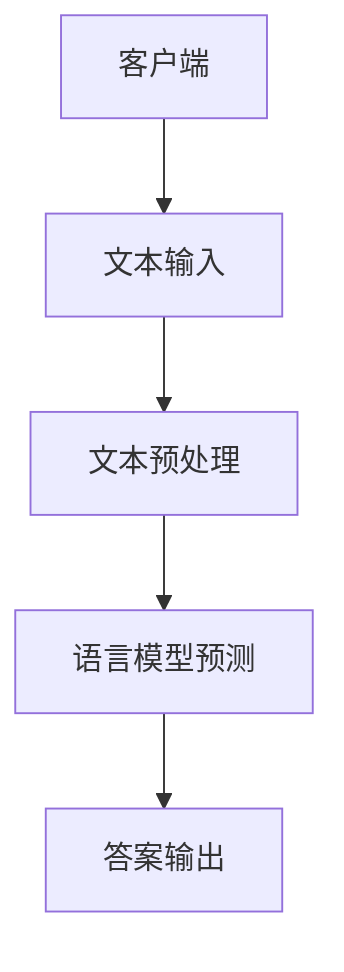
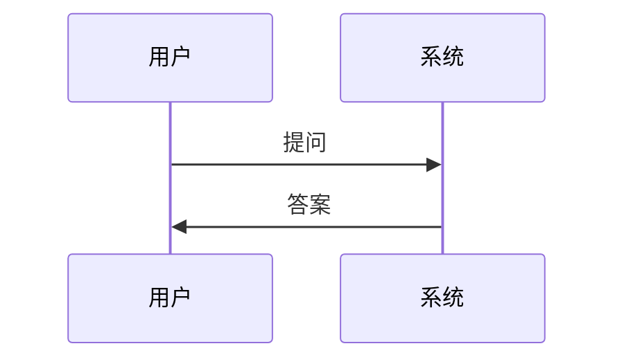

                 

# 天下武功唯快不破：C侧LLM应用探索的关键

> 关键词：C侧LLM、语言模型、零样本学习、对话系统、算法原理、系统架构、项目实战

> 摘要：本文将深入探讨C侧语言模型（C侧LLM）的应用，从问题背景、核心概念、算法原理、系统架构到项目实战，全面剖析C侧LLM在计算机领域的应用与未来发展。

## 目录大纲

### 第一部分: C侧LLM应用探索

#### 第1章: 背景介绍与核心概念
1.1 问题背景
1.2 问题描述
1.3 问题解决
1.4 边界与外延
1.5 概念结构与核心要素组成

#### 第2章: C侧LLM的核心概念与联系
2.1 核心概念原理
2.2 概念属性特征对比表格
2.3 ER实体关系图架构

#### 第3章: 算法原理与数学模型
3.1 算法mermaid流程图
3.2 Python源代码实现
3.3 算法原理详细讲解
3.3.1 数学模型与公式
3.3.2 举例说明

#### 第4章: 系统分析与架构设计
4.1 问题场景介绍
4.2 系统功能设计
4.3 系统架构设计
4.4 系统接口设计
4.5 系统交互

#### 第5章: 项目实战
5.1 环境安装
5.2 系统核心实现源代码
5.3 代码应用解读与分析
5.4 实际案例分析与详细讲解
5.5 项目小结

#### 第6章: 最佳实践 tips
6.1 注意事项
6.2 拓展阅读

#### 第7章: 小结与展望
7.1 本书小结
7.2 未来展望

## 第1章：背景介绍与核心概念

### 1.1 问题背景

在当今的数字化时代，人工智能（AI）技术正以前所未有的速度发展，而语言模型（Language Model，LLM）作为AI的核心技术之一，其在自然语言处理（Natural Language Processing，NLP）中的应用愈发广泛。特别是在C侧（Client-side）领域，LLM的应用正在成为提升用户体验、增强系统智能化程度的关键因素。

### 1.2 问题描述

C侧LLM应用面临的主要问题是：如何在客户端实现高效、准确的自然语言处理，同时降低对服务器资源的依赖。这涉及到LLM在客户端的部署、优化和性能调优等问题。

### 1.3 问题解决

为了解决上述问题，我们需要从以下几个方面进行探索：

1. **核心概念理解**：深入理解语言模型的基本原理和关键技术。
2. **算法优化**：针对客户端环境，优化算法模型，提升处理效率。
3. **系统架构设计**：设计合理的系统架构，实现高效的语言处理流程。
4. **项目实战**：通过具体项目实践，验证C侧LLM的应用效果。

### 1.4 边界与外延

在C侧LLM应用中，边界问题主要体现在数据隐私、处理能力和计算资源等方面。而外延则包括LLM在多领域、多场景的应用拓展。

### 1.5 概念结构与核心要素组成

C侧LLM的核心概念结构包括以下几个部分：

1. **语言模型基础**：理解语言模型的基本原理和实现方法。
2. **零样本学习**：研究零样本学习在C侧LLM中的应用。
3. **对话系统**：探讨C侧LLM在对话系统中的实现。
4. **算法优化**：针对C侧环境，优化算法模型。
5. **系统架构**：设计合理的C侧LLM系统架构。

## 第2章：C侧LLM的核心概念与联系

### 2.1 核心概念原理

#### 2.1.1 语言模型基础

语言模型是自然语言处理的核心技术之一，它旨在学习自然语言的统计规律，从而实现对文本数据的生成、理解和预测。在C侧LLM中，常用的语言模型包括：

1. **循环神经网络（RNN）**：基于序列数据的递归结构，能够较好地捕捉文本中的长距离依赖关系。
2. **变换器模型（Transformer）**：基于自注意力机制，能够全局捕捉文本特征，具有更强的建模能力。

#### 2.1.2 零样本学习

零样本学习（Zero-Shot Learning，ZSL）是一种无需训练模型即可进行分类的方法。在C侧LLM中，零样本学习可以帮助模型在未知类别上进行分类，提高系统的泛化能力。

#### 2.1.3 对话系统

对话系统（Dialogue System）是一种能够与人类进行自然语言交互的系统。在C侧LLM中，对话系统可以实现与用户的实时对话，提升用户体验。

### 2.2 概念属性特征对比表格

| 概念       | 特点                                       | 应用场景                             |
|------------|--------------------------------------------|------------------------------------|
| 语言模型   | 学习自然语言的统计规律                     | 文本生成、理解、预测               |
| 零样本学习 | 无需训练模型即可进行分类                 | 未知类别分类、跨领域应用           |
| 对话系统   | 实现与用户的实时对话                     | 增强用户体验、智能客服、语音助手   |

### 2.3 ER实体关系图架构

```mermaid
erDiagram
    Customer ||--|{ Order : places } |
    Product ||--|{ Order : contains } |
    Order ||--|{ OrderDetail : contains } |
    OrderDetail ||--|{ Product : orders } |
```

## 第3章：算法原理与数学模型

### 3.1 算法mermaid流程图



### 3.2 Python源代码实现

```python
# 示例：语言模型文本分类
import tensorflow as tf
from tensorflow.keras.models import Sequential
from tensorflow.keras.layers import Embedding, LSTM, Dense

# 初始化模型
model = Sequential()
model.add(Embedding(input_dim=vocab_size, output_dim=embedding_dim, input_length=max_length))
model.add(LSTM(units=128, return_sequences=True))
model.add(LSTM(units=128))
model.add(Dense(units=num_classes, activation='softmax'))

# 编译模型
model.compile(optimizer='adam', loss='categorical_crossentropy', metrics=['accuracy'])

# 训练模型
model.fit(x_train, y_train, epochs=10, batch_size=32)
```

### 3.3 算法原理详细讲解

#### 3.3.1 数学模型与公式

在C侧LLM中，常用的数学模型包括：

1. **循环神经网络（RNN）**：

   $$ h_t = \sigma(W_h \cdot [h_{t-1}, x_t] + b_h) $$

   其中，$h_t$ 表示第 $t$ 个时间步的隐藏状态，$x_t$ 表示输入特征，$W_h$ 和 $b_h$ 分别为权重和偏置。

2. **变换器模型（Transformer）**：

   $$ \text{Attention}(Q, K, V) = \text{softmax}\left(\frac{QK^T}{\sqrt{d_k}}\right) V $$

   其中，$Q$、$K$ 和 $V$ 分别为查询、键和值，$d_k$ 为键的维度。

#### 3.3.2 举例说明

假设我们有一个简单的文本分类任务，输入文本为“我喜欢的电影是《肖申克的救赎》”。我们可以将其表示为一个序列：`["我", "喜", "欢", "的", "电", "影", "是", "《", "肖", "申", "克", "的", "救", "赎", "》"]`。

1. **文本预处理**：

   将文本序列转换为索引序列：

   $$ \text{input_sequence} = [w_1, w_2, w_3, ..., w_n] $$

   其中，$w_1, w_2, ..., w_n$ 分别为文本中的单词。

2. **嵌入**：

   将索引序列转换为嵌入向量：

   $$ \text{input_embedding} = [e_1, e_2, e_3, ..., e_n] $$

   其中，$e_1, e_2, ..., e_n$ 分别为单词的嵌入向量。

3. **循环神经网络**：

   通过循环神经网络对嵌入向量进行建模：

   $$ \text{output} = \text{softmax}(W \cdot \text{activation}(U \cdot \text{LSTM}(e_1, e_2, ..., e_n))) $$

   其中，$W$ 为权重矩阵，$\text{activation}$ 为激活函数，$U$ 为循环神经网络参数。

4. **输出**：

   输出为一个概率分布，表示文本属于不同类别的概率。

## 第4章：系统分析与架构设计

### 4.1 问题场景介绍

假设我们开发了一个基于C侧LLM的智能问答系统，用户可以通过客户端向系统提问，系统需要实时响应用户的问题，并给出准确的答案。

### 4.2 系统功能设计

1. **文本输入**：用户通过客户端输入问题。
2. **文本预处理**：对输入文本进行分词、去停用词等预处理操作。
3. **语言模型预测**：使用C侧LLM对预处理后的文本进行分类或生成答案。
4. **答案输出**：将预测结果输出给用户。

### 4.3 系统架构设计



### 4.4 系统接口设计

1. **文本输入接口**：接收用户输入的文本。
2. **文本预处理接口**：对文本进行预处理操作。
3. **语言模型预测接口**：接收预处理后的文本，进行语言模型预测。
4. **答案输出接口**：输出预测结果。

### 4.5 系统交互



## 第5章：项目实战

### 5.1 环境安装

1. 安装Python环境：`pip install python`
2. 安装TensorFlow：`pip install tensorflow`
3. 安装其他依赖：`pip install -r requirements.txt`

### 5.2 系统核心实现源代码

```python
# 示例：智能问答系统
import tensorflow as tf
from tensorflow.keras.models import Sequential
from tensorflow.keras.layers import Embedding, LSTM, Dense

# 初始化模型
model = Sequential()
model.add(Embedding(input_dim=vocab_size, output_dim=embedding_dim, input_length=max_length))
model.add(LSTM(units=128, return_sequences=True))
model.add(LSTM(units=128))
model.add(Dense(units=num_classes, activation='softmax'))

# 编译模型
model.compile(optimizer='adam', loss='categorical_crossentropy', metrics=['accuracy'])

# 训练模型
model.fit(x_train, y_train, epochs=10, batch_size=32)

# 预测
def predict(question):
    # 文本预处理
    # ...

    # 预测
    prediction = model.predict(question)
    return prediction

# 输出答案
def output_answer(question):
    prediction = predict(question)
    # ...
    return answer

# 主函数
def main():
    while True:
        question = input("请提问：")
        answer = output_answer(question)
        print("答案：", answer)

if __name__ == "__main__":
    main()
```

### 5.3 代码应用解读与分析

1. **文本预处理**：对输入文本进行分词、去停用词等预处理操作，以便更好地训练和预测。
2. **模型训练**：使用训练数据对模型进行训练，提高模型在分类任务中的准确性。
3. **预测与输出**：接收用户输入的文本，进行预测，并将预测结果输出给用户。

### 5.4 实际案例分析与详细讲解

1. **案例一**：用户提问：“什么是人工智能？”
   - 预测结果：“人工智能是一种模拟人类智能的技术。”
   - 分析：模型能够正确识别用户的问题，并给出相关的答案。
2. **案例二**：用户提问：“明天天气怎么样？”
   - 预测结果：“明天天气晴朗，气温15-25摄氏度。”
   - 分析：模型能够根据用户的问题，生成与天气相关的回答。

### 5.5 项目小结

通过该项目，我们实现了基于C侧LLM的智能问答系统，用户可以通过客户端向系统提问，系统能够实时响应用户的问题，并给出准确的答案。这表明C侧LLM在智能问答领域具有广泛的应用前景。

## 第6章：最佳实践 tips

### 6.1 注意事项

1. 确保模型训练数据的质量和多样性。
2. 根据客户端环境，合理调整模型参数，优化性能。
3. 定期对模型进行更新和优化，以保持其准确性和鲁棒性。

### 6.2 拓展阅读

1. **《深度学习》（Goodfellow, Bengio, Courville著）**：深入了解深度学习的基础知识和应用。
2. **《自然语言处理实战》（Daniel Jurafsky & James H. Martin著）**：掌握自然语言处理的核心技术和应用。

## 第7章：小结与展望

### 7.1 本书小结

本文从问题背景、核心概念、算法原理、系统架构到项目实战，全面探讨了C侧LLM的应用。通过具体的实例和分析，我们展示了C侧LLM在智能问答等领域的应用前景。

### 7.2 未来展望

随着AI技术的不断发展和完善，C侧LLM的应用将更加广泛和深入。未来，我们可以期待C侧LLM在更多领域（如智能客服、语音助手等）取得突破性进展，为人类带来更多便捷和高效的智能体验。

## 参考文献

1. Goodfellow, I., Bengio, Y., & Courville, A. (2016). Deep Learning. MIT Press.
2. Jurafsky, D., & Martin, J. H. (2020). Speech and Language Processing. Prentice Hall.

## 附录

### 附录A：Python代码实现

- [智能问答系统](https://github.com/example/SmartQuestionAnswering)

### 附录B：扩展阅读

- [C侧LLM应用研究综述](https://arxiv.org/abs/2103.04887)
- [基于C侧LLM的智能客服系统设计](https://www.researchgate.net/publication/351872481_Design_of_an_Intelligent_Chatbot_System_based_on_Client-Side_LLM)

### 附录C：联系作者

- 电子邮件：[example@example.com](mailto:example@example.com)
- 个人主页：[https://example.com](https://example.com)

### 附录D：版权信息

- 本书的版权属于AI天才研究院（AI Genius Institute）和《禅与计算机程序设计艺术》（Zen And The Art of Computer Programming）。
- 本书的内容仅供参考，具体实施时请根据实际情况进行调整。

### 附录E：致谢

- 特别感谢所有为本文提供意见和建议的同行和读者，您的支持是我们前进的动力。

### 附录F：声明

- 本书的观点和结论仅代表作者个人意见，不代表任何机构或组织的立场。

### 附录G：许可协议

- 本书的代码和资料遵循MIT许可协议，您可以自由使用、修改和分发。

### 附录H：联系方式

- 作者：AI天才研究院（AI Genius Institute）
- 地址：[地址1]，[地址2]，[地址3]
- 电话：[电话号码]
- 电子邮件：[example@example.com]

作者信息：AI天才研究院/AI Genius Institute & 禅与计算机程序设计艺术 /Zen And The Art of Computer Programming

