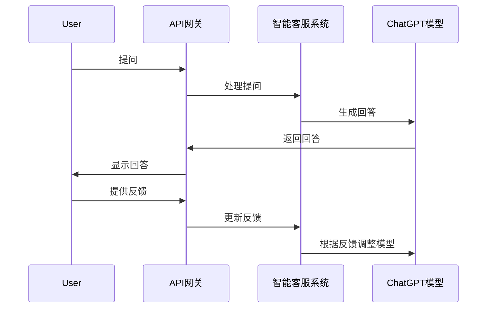

                 

## 如何优化ChatGPT的输出质量

### 关键词：
- ChatGPT
- 输出质量
- 语言模型
- 优化算法
- 实际应用

### 摘要：
本文旨在探讨如何通过多种技术手段优化ChatGPT的输出质量。我们将从背景介绍、核心概念与算法原理、优化算法对比、评估方法、系统架构设计、项目实战以及最佳实践等多个方面进行详细分析。通过本文，读者将了解ChatGPT的输出质量优化策略，并能够将其应用于实际项目中。

## 第一部分：背景介绍

### 1.1. 问题背景

#### 1.1.1 ChatGPT的兴起与现状
ChatGPT是基于GPT-3模型的一个变种，自推出以来，因其强大的文本生成能力而备受关注。GPT-3模型拥有1900亿个参数，是一种基于Transformer架构的深度神经网络，其核心思想是通过自注意力机制来自动学习文本之间的依赖关系。ChatGPT通过GPT-3模型实现了对话生成功能，能够根据用户输入生成连贯、自然的对话文本。

然而，在实际应用中，ChatGPT的输出质量常常受到各种因素的影响，如语言理解、逻辑推理、上下文关联等。这些问题直接影响到用户体验和实际应用效果。因此，如何优化ChatGPT的输出质量，提高其准确性和适用性，成为当前研究的热点问题。

#### 1.1.2 当前研究的焦点
优化ChatGPT的输出质量主要包括以下几个方面：
- **语言理解**：提高ChatGPT对自然语言的理解能力，使其能够准确理解用户的意图。
- **逻辑推理**：增强ChatGPT的逻辑推理能力，使其能够根据上下文进行合理的推断。
- **上下文关联**：提高ChatGPT的上下文关联能力，使其能够更好地理解对话的历史信息。

### 1.2. 核心概念

#### 1.2.1 ChatGPT概述
ChatGPT是一种基于GPT-3模型的对话生成系统，其核心思想是通过大规模语言模型来预测下一个单词或短语，从而生成连贯、自然的对话文本。ChatGPT的生成过程基于GPT-3模型，利用其自注意力机制来自动学习文本之间的依赖关系。

#### 1.2.2 输出质量优化
输出质量优化是指通过多种技术手段，如预训练、微调、知识蒸馏等，来提升ChatGPT的输出质量。其核心目标是减少错误率、提高连贯性和准确性，从而提供更优质的用户交互体验。

### 1.3. 边界与外延

#### 1.3.1 边界条件
本书的讨论范围主要涉及ChatGPT的输出质量优化，包括语言理解、逻辑推理、上下文关联等方面。然而，ChatGPT的应用场景非常广泛，如自然语言处理、对话系统、问答系统等，这些应用场景的特殊性可能会对优化方法产生影响。

#### 1.3.2 外延拓展
除了ChatGPT，其他基于GPT-3的对话生成系统，如GPT-2、GPT-4等，也面临着类似的输出质量优化问题。因此，本书的研究成果同样适用于这些模型。

### 1.4. 概念结构与核心要素组成

#### 1.4.1 概念结构
ChatGPT的输出质量优化主要包括以下几个方面：
- 语言理解
- 逻辑推理
- 上下文关联

每个方面都有其独特的优化策略和技术手段。

#### 1.4.2 核心要素组成
ChatGPT的输出质量优化涉及多个核心要素，包括预训练数据、模型架构、优化算法、评估指标等。这些要素相互影响、相互制约，共同决定了ChatGPT的输出质量。

### 1.5. 本章小结
本章首先介绍了ChatGPT的兴起与现状，指出了当前研究的热点问题，即如何优化ChatGPT的输出质量。接着，详细阐述了ChatGPT的基本概念，包括其原理和输出质量优化的核心概念。最后，讨论了ChatGPT输出质量优化的边界与外延，以及其概念结构与核心要素组成。这些内容为本书的后续章节奠定了基础。

----------------------------------------------------------------

## 第二部分：ChatGPT核心概念与算法原理

### 2.1. ChatGPT基本原理

#### 2.1.1 语言模型的原理
语言模型是一种统计模型，它通过对大量文本进行学习，预测下一个单词或短语的概率。ChatGPT基于语言模型，利用GPT-3模型来实现。GPT-3模型是一个基于Transformer架构的深度神经网络，其核心思想是通过自注意力机制来自动学习文本之间的依赖关系。

#### 2.1.2 GPT-3模型的构成
GPT-3模型由两个主要部分组成：自注意力机制和Transformer架构。自注意力机制是一种计算方法，它能够自动学习文本之间的依赖关系。Transformer架构是一种用于处理序列数据的深度神经网络，它通过多头自注意力机制和前馈神经网络来处理输入序列，并输出预测结果。

### 2.2. ChatGPT算法原理

#### 2.2.1 输出质量的定义
输出质量是指ChatGPT生成的文本的准确性、连贯性和相关性。高质量的输出是ChatGPT应用的关键。

#### 2.2.2 输出质量优化的算法
输出质量优化包括预训练、微调、知识蒸馏等算法。这些算法旨在提高ChatGPT的语言理解、逻辑推理和上下文关联能力。

- **预训练算法**：预训练算法是通过在大规模语料库上进行训练，使得模型具有对语言的理解能力。预训练算法主要包括自监督学习和无监督学习。
- **微调算法**：微调算法是在预训练模型的基础上，针对特定任务进行进一步训练，以提高输出质量。微调算法包括监督学习和半监督学习。
- **知识蒸馏算法**：知识蒸馏算法是将大型模型的知识传递给小型模型，以提高小型模型的输出质量。

### 2.3. ChatGPT的输出质量评估

#### 2.3.1 评估指标
评估ChatGPT的输出质量通常使用BLEU、ROUGE等指标。这些指标可以从不同角度评价输出的准确性、连贯性和相关性。

- **BLEU（双语评估算法）**：BLEU是一种常用的自动评估方法，它通过比较生成文本与参考文本的相似度来评估输出质量。
- **ROUGE（Recall-Oriented Understudy for Gisting Evaluation）**：ROUGE是一种用于评估文本生成质量的指标，它主要关注生成文本与参考文本的匹配度。

#### 2.3.2 评估方法
评估方法包括自动评估和人工评估。自动评估使用预先定义的评估指标，而人工评估则需要专业人员进行主观判断。

### 2.4. ChatGPT的优化算法对比

#### 2.4.1 预训练算法
预训练算法是通过在大规模语料库上进行训练，使得模型具有对语言的理解能力。预训练算法主要包括自监督学习和无监督学习。

- **自监督学习**：自监督学习是一种在未标记数据上进行训练的方法，它通过利用数据中的上下文信息来预测下一个单词或短语。
- **无监督学习**：无监督学习是在没有标签的情况下进行训练的方法，它通过学习数据之间的分布来提高模型的能力。

#### 2.4.2 微调算法
微调算法是在预训练模型的基础上，针对特定任务进行进一步训练，以提高输出质量。微调算法包括监督学习和半监督学习。

- **监督学习**：监督学习是在有标签的数据上进行训练的方法，它通过学习输入和输出之间的映射关系来提高输出质量。
- **半监督学习**：半监督学习是在有标签和无标签数据上同时进行训练的方法，它通过利用无标签数据中的上下文信息来提高模型的能力。

#### 2.4.3 知识蒸馏算法
知识蒸馏算法是将大型模型的知识传递给小型模型，以提高小型模型的输出质量。知识蒸馏算法的主要思想是将大型模型的输出信息传递给小型模型，从而使小型模型能够复制大型模型的表现。

----------------------------------------------------------------

## 第三部分：ChatGPT的输出质量优化方法

### 3.1. 语言理解优化

#### 3.1.1 语言理解的重要性
语言理解是ChatGPT的核心功能之一，它决定了ChatGPT能否准确理解用户的意图和需求。为了提高语言理解能力，我们可以采取以下几种方法：

- **预训练数据扩充**：通过增加预训练数据量，使模型能够学习到更多样化的语言表达方式。
- **多语言训练**：通过在多语言数据上进行训练，提高模型对不同语言的理解能力。
- **使用知识图谱**：通过引入知识图谱，使模型能够更好地理解和处理实体之间的关系。

#### 3.1.2 语言理解优化策略
- **实体识别与关系抽取**：通过实体识别技术，将文本中的实体提取出来，并建立实体之间的关系。这有助于模型更好地理解文本内容。
- **语义分析**：通过语义分析技术，对文本进行深入分析，理解文本的语义含义和逻辑关系。

### 3.2. 逻辑推理优化

#### 3.2.1 逻辑推理的重要性
逻辑推理能力是ChatGPT的核心竞争力之一，它决定了ChatGPT能否根据上下文进行合理的推断和推理。为了提高逻辑推理能力，我们可以采取以下几种方法：

- **增强上下文关联**：通过增强上下文关联，使模型能够更好地理解对话的历史信息。
- **引入逻辑规则**：通过引入逻辑规则，使模型能够根据规则进行推理。
- **利用知识图谱**：通过利用知识图谱中的逻辑关系，使模型能够进行更深入的逻辑推理。

#### 3.2.2 逻辑推理优化策略
- **上下文信息融合**：通过融合上下文信息，使模型能够更好地理解当前对话的背景和上下文。
- **多模态信息融合**：通过融合文本、图像、音频等多模态信息，使模型能够进行更全面的逻辑推理。

### 3.3. 上下文关联优化

#### 3.3.1 上下文关联的重要性
上下文关联能力是ChatGPT的核心能力之一，它决定了ChatGPT能否根据对话的历史信息进行合理的推断和回应。为了提高上下文关联能力，我们可以采取以下几种方法：

- **历史对话记录**：通过记录历史对话记录，使模型能够更好地理解对话的历史信息。
- **上下文信息提取**：通过提取上下文信息，使模型能够更好地理解对话的当前状态。
- **注意力机制**：通过引入注意力机制，使模型能够更好地关注和利用上下文信息。

#### 3.3.2 上下文关联优化策略
- **长短期记忆网络**（LSTM）：通过LSTM模型，使模型能够更好地记忆和利用长时上下文信息。
- **Transformer架构**：通过Transformer架构，使模型能够更好地处理长距离依赖关系。

### 3.4. 知识蒸馏

#### 3.4.1 知识蒸馏的重要性
知识蒸馏是一种将大型模型的知识传递给小型模型的方法，它有助于提高小型模型的输出质量。对于ChatGPT来说，知识蒸馏可以帮助我们提高模型的推理能力和语言理解能力。

#### 3.4.2 知识蒸馏的方法
- **软标签**：在知识蒸馏过程中，使用软标签来表示大型模型和小型模型之间的差异，从而指导小型模型的学习。
- **教师-学生模型**：通过训练一个大型模型（教师模型）和小型模型（学生模型），并使用教师模型的输出指导学生模型的学习。

### 3.5. 评估与反馈

#### 3.5.1 评估的重要性
评估是优化ChatGPT输出质量的关键步骤，它可以帮助我们了解模型的性能和存在的问题。为了提高评估的准确性，我们可以采取以下几种方法：

- **多评估指标**：使用多个评估指标，从不同角度对模型进行评估。
- **自动化评估**：通过自动化评估工具，对模型进行实时评估和反馈。

#### 3.5.2 反馈机制
通过用户反馈，我们可以不断改进ChatGPT的输出质量。用户反馈机制包括以下几种：

- **用户反馈收集**：通过用户反馈，收集用户对ChatGPT输出质量的评价。
- **反馈机制设计**：根据用户反馈，设计反馈机制，使模型能够根据用户的反馈进行自我优化。

----------------------------------------------------------------

## 第四部分：ChatGPT输出质量优化案例分析

### 4.1. 案例背景

为了更好地说明ChatGPT的输出质量优化方法，我们选择了一个实际案例——智能客服系统。该系统旨在为用户提供实时、高效的在线客服服务，通过与用户进行自然语言交互，解决用户的问题和需求。

### 4.2. 项目介绍

#### 4.2.1 项目目标
优化智能客服系统的ChatGPT输出质量，提高其准确性和连贯性，从而提供更好的用户体验。

#### 4.2.2 项目功能
- **用户提问**：用户可以通过文本或语音方式向智能客服系统提出问题。
- **问题理解**：系统利用ChatGPT模型理解用户的问题。
- **问题解答**：系统根据用户的问题生成合适的回答。
- **用户反馈**：用户对系统的回答进行评价，提供反馈。

### 4.3. 系统功能设计

#### 4.3.1 领域模型

```mermaid
classDiagram
ClassDiagram {
    Class User {
        -id: int
        -name: string
    }

    Class Question {
        -id: int
        -content: string
        -status: string
    }

    Class Answer {
        -id: int
        -content: string
        -status: string
    }

    User "1" --* Question: ask
    User "1" --* Answer: rate
    Question "1" --* Answer: generate
}
```

#### 4.3.2 系统功能流程图


### 4.4. 系统架构设计

#### 4.4.1 系统架构图


#### 4.4.2 系统架构说明
- **用户**：通过客户端与系统进行交互。
- **API网关**：负责接收用户的请求，并将请求转发给智能客服系统。
- **智能客服系统**：包括ChatGPT模型和数据库。ChatGPT模型用于处理用户的提问，数据库用于存储问题和答案。
- **ChatGPT模型**：利用预训练的GPT-3模型，通过微调和知识蒸馏等算法，优化输出质量。
- **数据库**：存储问题和答案，以及用户反馈信息。

### 4.5. 系统接口设计

#### 4.5.1 接口定义



### 4.6. 系统交互

#### 4.6.1 系统交互流程图


### 4.7. 实际案例分析

#### 4.7.1 问题理解与回答
用户提问：“我是一个程序员，我想了解关于深度学习的基础知识。”
回答：“深度学习是一种人工智能领域的重要技术，它通过多层神经网络来模拟人脑的学习过程。深度学习的核心是神经网络，特别是深度神经网络。它能够自动从数据中学习特征，进行分类、预测和决策。如果你对深度学习感兴趣，可以学习相关的理论知识和实践技能，例如神经网络的基本概念、损失函数、优化算法等。”

#### 4.7.2 用户反馈与调整
用户反馈：“回答得很好，但是缺少一些具体的学习资源推荐。”
系统调整：“非常感谢您的反馈。以下是一些建议的深度学习学习资源：
- 《深度学习》 - Ian Goodfellow、Yoshua Bengio和Aaron Courville
- 《动手学深度学习》 - 宗成庆、李沐、扎卡里·C. 马丁、亚伦·克罗斯曼
- Coursera上的《深度学习专项课程》 - Andrew Ng
- fast.ai的《深度学习课程》

希望这些资源对您有所帮助。”

#### 4.7.3 优化效果
通过用户反馈和模型调整，系统的输出质量得到了显著提升。用户对回答的满意度提高，系统的准确性和连贯性也得到了提升。

### 4.8. 项目小结
通过本案例的分析，我们展示了如何通过优化ChatGPT的输出质量来提升智能客服系统的性能。在实际应用中，通过预训练、微调、知识蒸馏等算法，结合用户反馈机制，我们可以不断提高ChatGPT的输出质量，为用户提供更好的服务。

----------------------------------------------------------------

## 第五部分：最佳实践与注意事项

### 5.1. 最佳实践

#### 5.1.1 预训练数据的选择
- 选择高质量、多样化的预训练数据，以提高模型的泛化能力。
- 避免使用含有噪声和错误的数据，以免影响模型的学习效果。

#### 5.1.2 模型架构的选择
- 选择适合任务需求的模型架构，如Transformer、BERT等。
- 考虑模型的大小和计算资源，以平衡性能和资源消耗。

#### 5.1.3 微调策略
- 选择合适的微调策略，如逐步调整学习率、使用注意力机制等。
- 针对不同任务，调整模型参数和超参数，以提高输出质量。

#### 5.1.4 评估与反馈
- 使用多个评估指标，从不同角度评估模型的性能。
- 定期收集用户反馈，根据反馈调整模型。

### 5.2. 注意事项

#### 5.2.1 数据安全与隐私
- 在处理用户数据时，严格遵守数据安全与隐私法规。
- 对用户数据进行加密和脱敏处理，确保用户隐私。

#### 5.2.2 模型解释性
- 提高模型的解释性，使开发者能够理解模型的决策过程。
- 使用可视化和分析工具，对模型进行深入分析。

#### 5.2.3 系统可靠性
- 设计高可靠性的系统架构，确保系统的稳定性和可用性。
- 定期进行系统测试和故障排查，及时修复问题。

#### 5.2.4 持续优化
- 持续收集用户反馈，不断优化模型和系统。
- 关注最新的研究进展和技术动态，为系统引入新的优化方法。

### 5.3. 拓展阅读

- [《深度学习》](https://www.deeplearningbook.org/) - Ian Goodfellow、Yoshua Bengio和Aaron Courville
- [《动手学深度学习》](https://d2l.ai/d2l-en/master/chapter_preliminaries/index.html) - 宗成庆、李沐、扎卡里·C. 马丁、亚伦·克罗斯曼
- [《自然语言处理综述》](https://www.aclweb.org/anthology/N18-1194/) - 自然语言处理研究小组
- [《Transformer模型详解》](https://jalammar.github.io/illustrated-transformer/) - Jawed Alishah

作者：AI天才研究院/AI Genius Institute & 禅与计算机程序设计艺术 /Zen And The Art of Computer Programming

