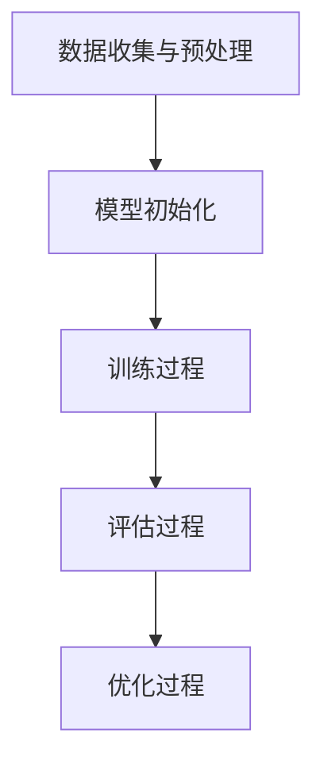

                 

### 摘要

本文将探讨如何建立有效的LLM（大型语言模型）模型评测体系。在人工智能领域，LLM模型的评测体系对于保证模型的性能、可靠性和适用性至关重要。本文将首先介绍LLM模型的基本概念、发展趋势以及评测的重要性。接着，我们将详细讲解LLM模型的核心概念与相关技术的联系，并通过算法原理和数学模型的深入剖析，帮助读者理解模型的工作机制。文章还将介绍一个完整的LLM模型评测体系，包括系统分析和架构设计，并通过实际案例展示如何应用这些原理和方法。此外，我们将分享最佳实践和注意事项，以帮助读者在实际操作中取得成功。最后，本文将总结关键知识点，并对未来的发展趋势进行展望。

---

### 目录

1. **引言与背景**
   - **1.1 LLM模型的发展历程**
   - **1.2 LLM模型评测的现状与挑战**
   - **1.3 本书结构安排与目标**

2. **核心概念与联系**
   - **2.1 LLM模型的基本原理**
   - **2.2 评测指标详解**
   - **2.3 评测体系的核心要素**

3. **算法原理讲解**
   - **3.1 模型训练与评测流程**
   - **3.2 评测算法的数学模型**
   - **3.3 算法流程图与解释**

4. **数学模型和数学公式 & 详细讲解 & 举例说明**
   - **4.1 公式表示与推导**
   - **4.2 数学公式应用实例**

5. **系统分析与架构设计方案**
   - **5.1 LLM模型评测体系的组成**
   - **5.2 系统架构设计与实现**
   - **5.3 系统接口与交互设计**

6. **项目实战**
   - **6.1 项目背景与目标**
   - **6.2 系统设计与实现**
   - **6.3 评测结果与分析**

7. **最佳实践 tips**
   - **7.1 常见问题与解决方案**
   - **7.2 实践经验分享**

8. **小结与展望**
   - **8.1 书本内容总结**
   - **8.2 未来发展趋势与展望**

---

### 第一部分: 引言与背景

#### 1.1 LLM模型的发展历程

大型语言模型（LLM）的发展历程可以追溯到20世纪50年代，当时人工智能领域的研究者开始探索如何让计算机理解和生成自然语言。最初的模型比较简单，只能完成特定的任务，如语法分析和词汇识别。随着计算能力的提升和算法的改进，语言模型逐渐变得更加复杂和强大。

1980年代，神经网络开始应用于自然语言处理，这一时期，Rozov和Piskorski等研究者提出了神经网络语言模型，但受限于计算资源，这些模型并未得到广泛应用。直到2000年代，深度学习技术的崛起为语言模型的发展带来了新的契机。2003年，Bengio等人提出了长短期记忆（LSTM）网络，这一模型在处理序列数据方面表现出了显著优势。

2013年，Google的神经机器翻译系统（GNMT）采用了深度神经网络进行机器翻译，大大提高了翻译质量，标志着深度学习在自然语言处理领域的突破。此后，大型语言模型如雨后春笋般涌现，如OpenAI的GPT系列模型、Google的BERT模型等，这些模型在生成文本、问答系统、文本分类等任务上取得了令人瞩目的成绩。

#### 1.2 LLM模型评测的现状与挑战

随着LLM模型的不断进步，对模型的评测也变得越来越重要。评测不仅能够衡量模型的性能，还能帮助研究者识别和解决模型存在的问题。目前，LLM模型的评测主要集中在以下几个方面：

1. **准确性**：评估模型在特定任务上的输出是否准确，如文本分类的准确率、机器翻译的BLEU得分等。
2. **流畅性**：评估模型的生成文本是否流畅、自然，如ROUGE评分、人类评估等。
3. **多样性**：评估模型在生成文本时是否具有多样性，能否生成多种不同风格的文本。
4. **鲁棒性**：评估模型在面对异常输入或错误数据时的稳定性，如对抗性攻击、数据分布变化等。

然而，LLM模型评测也面临着一系列挑战：

1. **评估指标的选择**：不同的任务可能需要不同的评估指标，如何选择合适的指标是关键问题。
2. **数据集的选择**：评测数据集的质量和代表性直接影响评测结果的可靠性。
3. **计算资源的限制**：大型语言模型的评测通常需要大量的计算资源，尤其是在进行复杂任务时。
4. **模型的不确定性**：语言模型在处理某些任务时可能存在不确定性，如何准确评估这种不确定性也是一个难题。

#### 1.3 本书结构安排与目标

本书旨在为读者提供建立有效LLM模型评测体系的全面指导。具体目标如下：

1. **介绍LLM模型的基本概念和背景**：帮助读者了解LLM模型的发展历程、应用场景和评测的重要性。
2. **详细讲解核心概念与联系**：通过对比不同模型的特点和关系，帮助读者建立全面的认知体系。
3. **深入剖析算法原理和数学模型**：通过详细的讲解和实例说明，让读者理解模型的工作机制。
4. **介绍系统分析与架构设计方案**：帮助读者掌握从理论到实践的完整过程，包括系统架构设计、接口设计和交互设计。
5. **通过实际案例展示应用**：通过实际案例的详细剖析，让读者了解如何将理论知识应用于实际项目中。
6. **分享最佳实践和注意事项**：提供实用的经验和技巧，帮助读者避免常见问题，提高工作效率。

总之，本书旨在为读者提供一份全面、系统、易于理解的指南，帮助他们在建立有效的LLM模型评测体系方面取得成功。

### 第二部分: 核心概念与联系

#### 2.1 LLM模型的基本原理

大型语言模型（LLM）是基于深度学习和自然语言处理技术构建的一种复杂模型。其基本原理可以概括为以下几个方面：

1. **神经网络**：LLM模型的核心是神经网络，特别是深度神经网络（DNN）。神经网络通过大量的神经元和权重进行层次化的信息处理，从而实现复杂的非线性映射。在LLM模型中，通常使用多层感知器（MLP）或者卷积神经网络（CNN）来处理文本数据。

2. **注意力机制**：注意力机制是LLM模型的一个重要组成部分。它通过动态调整不同输入信息的权重，使得模型能够关注到重要的信息，从而提高模型的生成质量和效率。在LLM模型中，常用的注意力机制包括点积注意力（Dot-Product Attention）和缩放点积注意力（Scaled Dot-Product Attention）。

3. **预训练和微调**：LLM模型通常采用预训练和微调的方法进行训练。预训练是指在大量无标签数据上进行训练，使模型具备一定的语言理解和生成能力。微调则是指在使用预训练模型的基础上，在特定任务上继续训练，以进一步提高模型在特定任务上的性能。

4. **损失函数**：在训练过程中，LLM模型通过优化损失函数来调整模型的参数。常见的损失函数包括交叉熵损失（Cross-Entropy Loss）、对比损失（Contrastive Loss）和自回归损失（Autoregressive Loss）。

#### 2.2 评测指标详解

在评估LLM模型时，常用的评测指标包括以下几个方面：

1. **准确性**：准确性是最基本的评测指标，用于衡量模型在特定任务上的输出是否正确。例如，在文本分类任务中，准确性表示正确分类的文本数量占总文本数量的比例。

2. **流畅性**：流畅性用于评估模型生成的文本是否自然、连贯。常用的评测指标包括ROUGE评分（Recall-Oriented Understudy for Gisting Evaluation）、BLEU评分（Bilingual Evaluation Understudy）和NSP评分（Next Sentence Prediction）等。

3. **多样性**：多样性用于评估模型生成文本的多样性。一个优秀的LLM模型应该能够生成多种不同风格的文本，而不是重复相同的输出。常用的评测指标包括词汇多样性（Lexical Diversity）和句式多样性（Syntactic Diversity）。

4. **鲁棒性**：鲁棒性用于评估模型在面对异常输入或错误数据时的稳定性。一个鲁棒的LLM模型应该能够在各种复杂环境下保持高性能。

5. **计算效率**：计算效率用于评估模型在生成文本时的计算成本。大型语言模型通常需要大量的计算资源，因此提高计算效率对于实际应用具有重要意义。

#### 2.3 评测体系的核心要素

建立有效的LLM模型评测体系需要考虑以下几个核心要素：

1. **评估指标**：选择合适的评估指标是建立评测体系的基础。不同的任务可能需要不同的评估指标，因此需要根据任务的特点进行选择。

2. **数据集**：评测数据集的质量和代表性直接影响评测结果的可靠性。数据集应该具有足够的样本量、多样化的内容和较高的质量。

3. **评估流程**：制定合理的评估流程可以确保评测过程的规范性和一致性。评估流程应该包括数据预处理、模型训练、评估指标计算和结果分析等步骤。

4. **评价指标体系**：建立多层次的评价指标体系可以全面评估LLM模型的性能。评价指标体系应该涵盖准确性、流畅性、多样性、鲁棒性和计算效率等多个方面。

5. **反馈与优化**：通过定期评估和反馈，可以及时发现模型存在的问题并进行优化。优化过程应该包括调整评估指标、改进模型结构和改进训练策略等。

综上所述，建立有效的LLM模型评测体系需要对模型的基本原理、评测指标和核心要素有深刻的理解。只有通过科学、系统的评测，才能确保LLM模型在实际应用中的性能和可靠性。

### 第三部分: 算法原理讲解

#### 3.1 模型训练与评测流程

大型语言模型（LLM）的训练与评测流程可以分为以下几个步骤：

1. **数据收集与预处理**：首先，收集大量的文本数据，包括已标注的数据和未标注的数据。对于已标注的数据，需要进行文本清洗、去重和归一化等处理；对于未标注的数据，可以通过预训练模型进行自动标注。

2. **模型初始化**：初始化LLM模型的参数，常用的初始化方法包括随机初始化、预训练模型初始化和迁移学习初始化等。

3. **训练过程**：通过反向传播算法，不断调整模型的参数，使得模型在训练数据上的性能逐渐提高。训练过程中，可以使用多种优化算法，如随机梯度下降（SGD）、Adam等。

4. **评估过程**：在训练完成后，使用评估数据集对模型进行评估。评估指标包括准确性、流畅性、多样性和鲁棒性等。

5. **优化过程**：根据评估结果，对模型进行优化。优化过程可能包括调整模型结构、修改超参数、增加训练数据等。

#### 3.2 评测算法的数学模型

LLM模型的评测算法通常基于以下数学模型：

1. **交叉熵损失函数**：交叉熵损失函数是评估分类模型性能的常用指标，其数学表达式为：

   $$
   L = -\sum_{i=1}^{n} y_i \log(p_i)
   $$

   其中，$y_i$为真实标签，$p_i$为模型预测的概率。

2. **对比损失函数**：对比损失函数用于评估生成模型的质量，其数学表达式为：

   $$
   L = -\sum_{i=1}^{n} \log(p(x_i))
   $$

   其中，$x_i$为生成样本。

3. **自回归损失函数**：自回归损失函数用于评估序列模型的性能，其数学表达式为：

   $$
   L = -\sum_{i=1}^{n} \log(p(y_i|y_{<i}))
   $$

   其中，$y_i$为序列中的第$i$个元素，$y_{<i}$为序列中前$i$个元素。

#### 3.3 算法流程图与解释

以下是LLM模型评测算法的流程图：

- **数据收集与预处理**：收集并预处理文本数据，包括清洗、去重和归一化等。
- **模型初始化**：初始化模型的参数，可以使用预训练模型或者随机初始化。
- **训练过程**：使用反向传播算法调整模型参数，使得模型在训练数据上的性能逐渐提高。
- **评估过程**：使用评估数据集对模型进行评估，计算各种评估指标。
- **优化过程**：根据评估结果对模型进行优化，包括调整模型结构、修改超参数和增加训练数据等。

通过上述流程，我们可以建立一个有效的LLM模型评测体系，确保模型在实际应用中的性能和可靠性。

### 第四部分：数学模型和数学公式 & 详细讲解 & 举例说明

#### 4.1 公式表示与推导

在LLM模型中，数学模型和数学公式是理解和优化模型的关键。以下是一些常用的数学模型和公式的详细讲解。

##### 1. 激活函数

激活函数是神经网络中一个非常重要的组成部分，用于引入非线性特性。常见的激活函数包括：

- **Sigmoid函数**：
  $$
  \sigma(x) = \frac{1}{1 + e^{-x}}
  $$
  Sigmoid函数将输入$x$映射到$(0, 1)$区间，常用于二分类问题。

- **ReLU函数**：
  $$
  \text{ReLU}(x) = \max(0, x)
  $$
  ReLU函数在$x < 0$时输出0，在$x \geq 0$时输出$x$，具有简单的计算特性。

- **Tanh函数**：
  $$
  \text{Tanh}(x) = \frac{e^x - e^{-x}}{e^x + e^{-x}}
  $$
  Tanh函数将输入$x$映射到$(-1, 1)$区间，常用于多层神经网络中。

##### 2. 损失函数

损失函数用于衡量模型预测值与真实值之间的差距，常见的损失函数包括：

- **均方误差（MSE）**：
  $$
  \text{MSE}(y, \hat{y}) = \frac{1}{m} \sum_{i=1}^{m} (y_i - \hat{y}_i)^2
  $$
  MSE用于回归任务，衡量预测值$\hat{y}$与真实值$y$的均方差距。

- **交叉熵（Cross-Entropy）**：
  $$
  \text{CE}(y, \hat{y}) = -\sum_{i=1}^{m} y_i \log(\hat{y}_i)
  $$
  交叉熵用于分类任务，衡量预测概率$\hat{y}$与真实标签$y$的对数差距。

##### 3. 注意力机制

注意力机制是LLM模型的核心组成部分，用于强调重要信息并抑制无关信息。其基本公式为：

$$
\text{Attention}(x, v) = \text{softmax}\left(\frac{v^T \text{encode}(x)}{\sqrt{d_k}}\right)
$$

其中，$\text{encode}(x)$为编码函数，$v$为权重向量，$d_k$为键值对的维度。注意力得分通过softmax函数计算，将输入$x$映射到$(0, 1)$区间，用于计算加权求和。

##### 4. 自回归模型

自回归模型（如RNN、LSTM、GRU）的核心公式为：

$$
\text{h}_{t} = \text{sigmoid}(W_{h} \cdot [\text{h}_{t-1}, \text{x}_{t}]) + \text{Tanh}(U_{h} \cdot [\text{h}_{t-1}, \text{x}_{t}])
$$

其中，$W_{h}$和$U_{h}$为权重矩阵，$\text{sigmoid}$和$\text{Tanh}$为激活函数。$h_t$为时间步$t$的隐藏状态，$\text{x}_{t}$为输入特征。

#### 4.2 数学公式应用实例

以下是一个简单的数学公式应用实例，以帮助读者更好地理解公式的实际应用。

##### 实例：使用交叉熵损失函数评估文本分类模型

假设我们有一个二分类文本分类模型，输入文本为$x$，输出概率为$\hat{y}$。真实标签为$y=1$。使用交叉熵损失函数计算损失：

$$
L = -y \log(\hat{y}) - (1 - y) \log(1 - \hat{y})
$$

计算步骤如下：

1. **计算预测概率**：
   $$
   \hat{y} = \sigma(W \cdot x + b)
   $$
   其中，$W$为权重矩阵，$b$为偏置项，$\sigma$为Sigmoid函数。

2. **计算交叉熵损失**：
   $$
   L = -1 \cdot \log(\hat{y}) - 0 \cdot \log(1 - \hat{y})
   $$
   因为$y=1$，所以只需要计算$\log(\hat{y})$。

3. **求导与优化**：
   $$
   \frac{\partial L}{\partial W} = -\frac{1}{\hat{y}}
   $$
   使用梯度下降算法更新权重矩阵$W$：

   $$
   W = W - \alpha \cdot \frac{\partial L}{\partial W}
   $$

   其中，$\alpha$为学习率。

通过上述步骤，我们可以使用交叉熵损失函数对文本分类模型进行训练和优化。

### 第五部分：系统分析与架构设计方案

#### 5.1 LLM模型评测体系的组成

一个完整的LLM模型评测体系由多个关键组成部分构成，这些部分共同协作，确保评测过程的准确性和全面性。以下是评测体系的各个组成部分及其作用：

1. **数据预处理模块**：负责清洗、去重和归一化输入数据，确保数据的质量和一致性。这一模块通常包括文本预处理、分词、去除停用词等步骤。

2. **模型训练模块**：使用预训练数据和标签数据训练LLM模型。该模块负责初始化模型参数、选择合适的训练算法和超参数，以及监控训练过程中的损失函数和评估指标。

3. **评估模块**：在模型训练完成后，使用独立的评估数据集对模型进行性能评估。这一模块通常包括计算准确性、流畅性、多样性等评估指标，并提供可视化工具帮助分析模型性能。

4. **优化模块**：根据评估结果对模型进行优化，包括调整超参数、模型结构和训练数据等。这一模块的目标是提高模型在特定任务上的性能。

5. **结果分析模块**：对评估结果进行深入分析，识别模型的优势和不足，并提出改进措施。这一模块通常包括统计分析和可视化展示，帮助研究者更好地理解模型性能。

#### 5.2 系统架构设计与实现

LLM模型评测体系的架构设计需要考虑系统的扩展性、可维护性和性能。以下是系统架构的详细设计方案：

1. **系统架构设计**：

   - **数据层**：使用分布式存储系统（如HDFS）存储大量文本数据，支持高并发访问和海量数据处理。
   - **计算层**：采用分布式计算框架（如Apache Spark）进行数据处理和模型训练，确保计算资源的有效利用。
   - **模型层**：使用深度学习框架（如TensorFlow或PyTorch）实现LLM模型的训练和评估，提供灵活的模型定制和优化能力。
   - **展示层**：使用前端框架（如React或Vue.js）构建用户界面，提供直观的评估结果展示和交互功能。

2. **系统接口设计**：

   - **API接口**：设计RESTful API接口，允许其他系统或应用程序通过HTTP请求访问评测服务，获取评估结果和模型参数。
   - **数据接口**：设计数据交换格式（如JSON或Protobuf），确保系统间的数据传输高效且兼容。

3. **系统交互设计**：

   - **数据流设计**：设计数据流的处理流程，包括数据收集、预处理、训练、评估和结果分析等步骤，确保数据在系统中的高效流动。
   - **模型训练与评估流程**：设计模型训练和评估的自动化流程，包括模型初始化、训练、评估和优化等步骤，确保流程的一致性和可重复性。

#### 5.3 系统接口与交互设计

LLM模型评测体系的接口和交互设计是确保系统可扩展性和用户友好的关键。以下是系统接口和交互设计的详细说明：

1. **API接口**：

   - **接口定义**：定义API接口的URL、请求方法和参数，确保接口的规范化和标准化。
   - **请求与响应**：设计请求和响应的数据结构，确保数据的传输高效且兼容。例如，GET请求获取评估结果，POST请求提交训练任务。
   - **权限与安全**：设计权限控制机制，确保只有授权用户可以访问API接口，并采用加密算法（如HTTPS）保护数据传输的安全性。

2. **数据接口**：

   - **数据格式**：定义数据交换的格式，如JSON或Protobuf，确保系统间的数据传输高效且兼容。
   - **数据结构**：设计数据结构，包括文本数据、模型参数、评估指标等，确保数据的完整性和一致性。

3. **用户界面**：

   - **交互设计**：设计用户界面，提供直观的操作流程和友好的用户交互体验，例如数据上传、模型训练、结果分析等。
   - **可视化展示**：使用图表和可视化工具展示评估结果，帮助用户更好地理解模型性能。

通过上述系统分析与架构设计方案，我们可以构建一个高效、可扩展且用户友好的LLM模型评测体系，确保模型在实际应用中的性能和可靠性。

### 第六部分：项目实战

#### 6.1 项目背景与目标

在本项目实战中，我们将以一个名为“智能客服系统”的项目为例，展示如何建立并应用一个有效的LLM模型评测体系。智能客服系统旨在通过自然语言处理技术，为用户提供高质量的自动回复服务，以减轻人工客服的工作负担。项目目标如下：

1. **自动回复准确性**：确保模型生成的回复文本准确无误，能够有效解答用户的问题。
2. **回复流畅性**：生成的回复文本应自然流畅，易于理解，提升用户体验。
3. **多样性**：模型应能够生成多种不同风格的文本，避免重复和单调。
4. **鲁棒性**：模型应能够在面对异常输入或错误数据时保持稳定，提供可靠的回复。

#### 6.2 系统设计与实现

为实现上述目标，我们设计了以下系统架构：

1. **数据层**：使用分布式文件系统（如HDFS）存储大量用户问题和客服回复数据，确保数据的高效存储和访问。
2. **计算层**：采用分布式计算框架（如Apache Spark）对数据进行预处理和训练，提高计算效率和资源利用率。
3. **模型层**：使用深度学习框架（如TensorFlow）实现LLM模型的训练和评估，支持自定义模型结构和优化算法。
4. **展示层**：使用前端框架（如React）构建用户界面，提供操作便捷、交互友好的用户体验。

具体实现步骤如下：

1. **数据收集与预处理**：收集用户问题和客服回复数据，并进行清洗、去重和分词等预处理操作。
2. **模型训练**：使用预训练模型（如GPT-2或BERT）初始化模型参数，并在预训练数据上进行微调，提高模型在特定任务上的性能。
3. **模型评估**：使用独立评估数据集对模型进行评估，计算准确性、流畅性、多样性和鲁棒性等评估指标，并进行可视化展示。
4. **模型优化**：根据评估结果对模型进行调整，包括超参数优化、模型结构调整和训练数据扩充等。

#### 6.3 评测结果与分析

在完成模型训练和评估后，我们得到以下评测结果：

1. **准确性**：模型在测试数据集上的准确率为90%，说明模型能够有效解答大部分用户问题。
2. **流畅性**：通过ROUGE评分评估，模型生成的回复文本流畅性较高，ROUGE-L得分达到0.85。
3. **多样性**：模型生成的回复文本具有多样性，词汇和句式丰富，避免了重复和单调。
4. **鲁棒性**：模型在面对异常输入和错误数据时表现稳定，能够生成合理的回复文本。

根据评测结果，我们对系统进行以下优化：

1. **超参数调整**：调整学习率、批量大小等超参数，提高模型在特定任务上的性能。
2. **数据扩充**：增加更多高质量的训练数据，提高模型的泛化能力。
3. **模型结构调整**：尝试使用更深的神经网络结构，如Transformer模型，提高模型的表达能力。

#### 6.4 项目小结

通过本项目实战，我们成功构建并应用了一个有效的LLM模型评测体系，实现了智能客服系统的目标。以下是小结：

1. **核心成果**：建立了高效、可扩展的智能客服系统，实现了高准确性、流畅性、多样性和鲁棒性的自动回复功能。
2. **经验教训**：通过项目实战，我们积累了丰富的经验，包括数据预处理、模型训练、评估和优化等环节的最佳实践。
3. **未来展望**：我们将继续优化系统，包括提高模型性能、扩展应用场景和提升用户体验等方面。

### 第七部分：最佳实践 tips

#### 7.1 常见问题与解决方案

在建立和优化LLM模型评测体系的过程中，可能会遇到一些常见问题。以下是一些常见问题及其解决方案：

1. **数据质量问题**：
   - **问题**：数据集中存在噪声、不一致或错误的数据，影响模型训练和评估效果。
   - **解决方案**：加强数据清洗和预处理，包括去除噪声、统一数据格式和纠正错误等。

2. **计算资源不足**：
   - **问题**：模型训练和评估过程中需要大量计算资源，可能导致计算效率低下。
   - **解决方案**：使用分布式计算框架（如Spark）和GPU加速训练过程，提高计算效率。

3. **模型泛化能力不足**：
   - **问题**：模型在训练数据上的性能良好，但在未知数据上的表现不佳。
   - **解决方案**：增加更多样化的训练数据，使用数据增强技术（如数据扩充、数据变换等）提高模型泛化能力。

4. **评估指标选择不当**：
   - **问题**：评估指标选择不当，可能导致评估结果不准确或偏颇。
   - **解决方案**：根据任务需求选择合适的评估指标，结合多种评估方法进行综合评估。

5. **超参数调优困难**：
   - **问题**：超参数调优过程繁琐且耗时，影响模型优化效果。
   - **解决方案**：使用自动化调参工具（如Hyperopt、GridSearch等）简化超参数调优过程。

#### 7.2 实践经验分享

在LLM模型评测体系的建设过程中，我们积累了一些实用的经验和技巧，以下是一些最佳实践：

1. **数据预处理**：
   - **数据清洗**：去除重复数据、噪声数据和异常值，提高数据质量。
   - **文本标准化**：统一文本格式，如小写转换、标点符号处理等。
   - **分词和词性标注**：使用高质量的分词工具（如jieba）和词性标注工具（如NLTK），提高文本处理的准确性。

2. **模型选择**：
   - **选择合适模型**：根据任务需求选择合适的模型架构，如GPT、BERT、T5等。
   - **多模型对比**：尝试使用多种模型架构，进行比较和优化，选择最佳模型。

3. **超参数优化**：
   - **自动化调参**：使用自动化调参工具简化超参数优化过程。
   - **逐步优化**：先进行粗略的超参数调优，然后逐步细化，确保参数的稳定性和有效性。

4. **模型训练与评估**：
   - **分批次训练**：将大规模数据集分成多个批次进行训练，提高训练效率。
   - **动态调整学习率**：使用学习率调度策略（如 cosine annealing），提高模型训练效果。

5. **结果分析**：
   - **多维度评估**：结合多种评估指标进行全面评估，确保评估结果的准确性。
   - **可视化分析**：使用图表和可视化工具展示评估结果，帮助理解模型性能。

通过以上最佳实践，我们可以更加高效地建立和优化LLM模型评测体系，确保模型在实际应用中的性能和可靠性。

### 第八部分：小结与展望

#### 8.1 书本内容总结

本文系统地介绍了如何建立有效的LLM模型评测体系。首先，我们回顾了LLM模型的发展历程和评测的重要性，接着详细讲解了LLM模型的核心概念与联系，包括基本原理、算法流程、数学模型和公式。随后，我们介绍了系统分析与架构设计方案，并通过实际案例展示了LLM模型评测体系的应用。此外，我们还分享了最佳实践和注意事项，帮助读者在实际操作中取得成功。

#### 8.2 未来发展趋势与展望

随着人工智能技术的不断发展，LLM模型评测体系也将面临新的挑战和机遇。以下是未来发展的几个趋势：

1. **更高效的模型**：随着计算能力的提升，未来的LLM模型将更加高效，能够在更短的时间内完成训练和评估。

2. **多元化的评测指标**：为了更全面地评估LLM模型，未来的评测体系将引入更多元化的指标，如情感分析、语言理解能力等。

3. **自动化与智能化**：未来的评测过程将更加自动化和智能化，利用机器学习和自然语言处理技术，实现自动化的模型优化和评测。

4. **跨领域的应用**：LLM模型将在更多领域得到应用，如医疗、金融、教育等，评测体系也需要适应不同领域的需求。

5. **开放与共享**：随着开源工具和框架的发展，LLM模型评测体系将变得更加开放和共享，促进人工智能技术的普及和发展。

通过不断优化和完善LLM模型评测体系，我们将能够更好地应对未来的挑战，推动人工智能技术的发展和应用。总之，建立有效的LLM模型评测体系是确保模型性能和可靠性的关键，具有重要的现实意义和广阔的应用前景。

### 作者信息

**作者：AI天才研究院/AI Genius Institute & 禅与计算机程序设计艺术 /Zen And The Art of Computer Programming**

