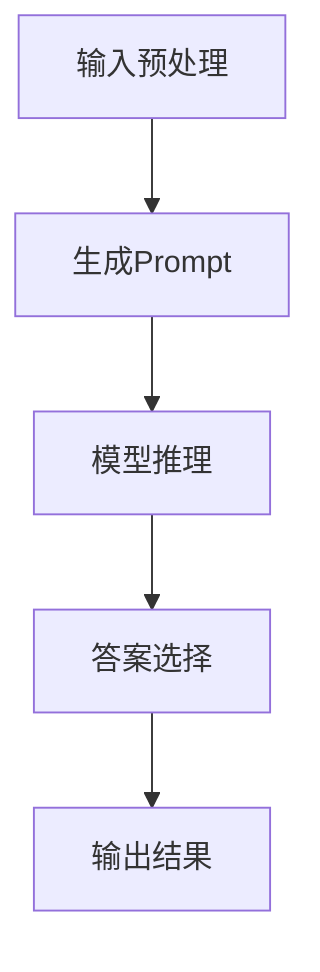
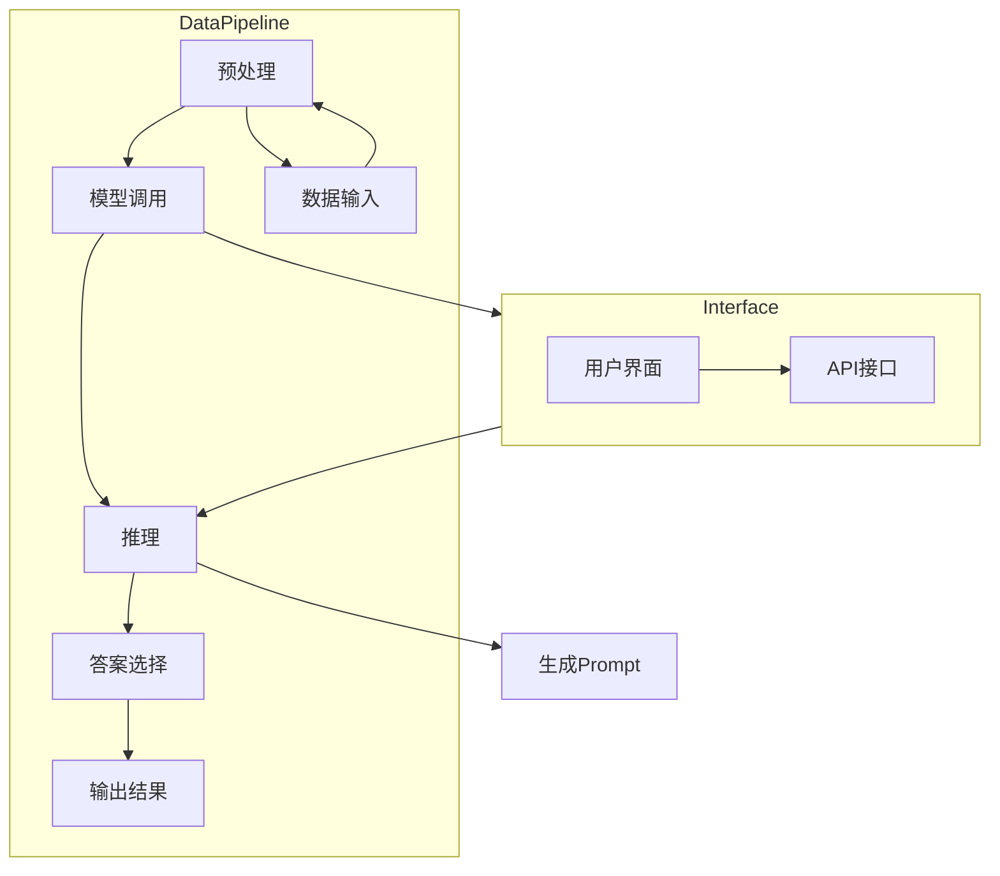

                 

# 如何系统化提升prompt编写能力

> 关键词：prompt编写、自然语言处理、大模型、算法优化、模型调优

> 摘要：本文旨在探讨如何系统化提升prompt编写能力。首先，通过背景介绍，阐述prompt编写的重要性及目前存在的问题。接着，详细分析核心概念与联系，明确概念原理、属性特征以及它们之间的联系。然后，深入讲解算法原理，使用Mermaid流程图和Python代码示例，详细阐述数学模型和公式。在此基础上，设计系统架构，介绍系统功能、接口设计和交互过程。最后，通过项目实战，提供实际案例分析和详细讲解，总结提升prompt编写能力的最佳实践。

## 第一部分：背景介绍

### 1.1 问题背景

在人工智能（AI）领域，prompt编写能力成为衡量一个人在自然语言处理（NLP）方面专业程度的重要指标。随着大模型如GPT-3的普及，prompt编写的重要性愈发凸显。然而，如何系统化地提升prompt编写能力，成为了众多从业者和研究者的关注焦点。

### 1.1.1 问题描述

prompt编写能力涉及到对模型的理解、对语言的理解以及对问题的抽象能力。当前，虽然存在许多关于prompt编写的方法和技巧，但缺乏一个系统性的框架来指导学习者逐步提升这一能力。因此，本书旨在填补这一空白，提供一个全面的、易于实践的学习路径。

### 1.1.2 问题解决

本书通过以下几个核心章节，逐步深入探讨prompt编写的各个方面：

- **第2章：prompt编写的基本概念与原则**
  - 介绍prompt编写的基本概念，包括prompt的定义、作用和类型。
  - 阐述prompt编写的基本原则，如清晰性、相关性、启发性和可控性。

- **第3章：prompt编写的实践技巧**
  - 深入探讨如何根据不同的应用场景编写有效的prompt。
  - 分享实际案例，分析成功的prompt编写策略。

- **第4章：prompt编写中的常见问题与解决方案**
  - 探讨在prompt编写过程中可能遇到的问题，并提出解决方案。

- **第5章：prompt编写的优化策略**
  - 分析如何通过调整模型参数、使用数据预处理技术等方法优化prompt。

- **第6章：prompt编写与模型调优的协同工作**
  - 讨论prompt编写与模型调优之间的互动关系，如何通过调整prompt来提升模型性能。

- **第7章：prompt编写的高阶技巧与前沿探索**
  - 探索prompt编写的高级技巧，如多模态prompt、上下文-aware prompt等。
  - 分析prompt编写在未来的发展方向和前沿技术。

### 1.1.3 边界与外延

prompt编写能力不仅限于特定领域，如问答系统、文本生成等，还涉及跨领域的应用。因此，本书将保持广泛的视角，涵盖不同应用场景下的prompt编写策略。

### 1.1.4 概念结构与核心要素组成

- **概念结构**：本书的核心概念包括prompt、模型、上下文、数据等。
- **核心要素**：提升prompt编写能力的核心要素包括对模型的理解、对语言的理解、问题抽象能力和实践经验。

### 1.2 核心概念与联系

### 1.2.1 概念原理

#### Prompt

- **定义**：在AI模型中，prompt是输入给模型的一段文本或指令，用于引导模型进行特定的任务。
- **特点**：清晰性、相关性、启发性、可控性。

#### 自然语言处理（NLP）

- **定义**：NLP是研究如何使计算机理解、生成和处理人类自然语言的技术。
- **核心任务**：文本分类、情感分析、命名实体识别、机器翻译等。

#### 大模型

- **定义**：大模型是指拥有数十亿甚至数万亿参数的深度学习模型，如GPT-3、BERT等。
- **特点**：强大的语言理解能力、广泛的适用性、需要大量的计算资源。

#### 绘本生成

- **定义**：绘本生成是指使用AI技术生成带有文字和图片的绘本。
- **关键技术**：文本生成、图像生成、文本与图像的融合。

### 1.2.2 概念属性特征对比表格

| 概念         | 定义                                                                                      | 特点                                       |
|--------------|------------------------------------------------------------------------------------------|------------------------------------------|
| Prompt       | 输入给AI模型的一段文本或指令                                                           | 清晰性、相关性、启发性、可控性                 |
| NLP          | 使计算机理解、生成和处理人类自然语言的技术                                           | 文本分类、情感分析、命名实体识别、机器翻译等     |
| 大模型       | 拥有数十亿甚至数万亿参数的深度学习模型                                             | 强大的语言理解能力、广泛的适用性、需要大量的计算资源 |
| 绘本生成     | 使用AI技术生成带有文字和图片的绘本                                                 | 文本生成、图像生成、文本与图像的融合           |

### 1.2.3 概念联系

- **Prompt与NLP**：prompt作为NLP模型输入的一部分，直接影响模型的输出质量。因此，编写有效的prompt对于提升NLP模型的性能至关重要。

- **大模型与Prompt**：大模型具有强大的语言理解能力，但需要通过合适的prompt来引导其发挥性能。prompt的优劣将直接影响大模型的应用效果。

- **绘本生成与Prompt**：绘本生成需要结合文本和图像，prompt在文本生成部分起到了关键作用，决定了绘本的故事情节和风格。

## 第二部分：算法原理讲解

### 2.1 算法原理

#### 模型输入与输出

prompt编写的关键在于如何将问题转化为模型可以理解的形式，从而获得期望的输出。以一个简单的问答系统为例，模型的输入是一个问题和相关的上下文信息，输出则是问题的答案。

#### 算法流程

1. **输入预处理**：对输入的文本进行预处理，包括分词、去停用词、词性标注等。
2. **生成Prompt**：根据预处理后的文本，生成prompt，包括问题、答案候选和上下文信息。
3. **模型推理**：将生成的prompt输入到NLP模型中，进行推理，获取答案候选。
4. **答案选择**：根据一定的策略，如置信度排序、答案长度限制等，选择最优答案。

#### Mermaid流程图



### 2.2 Python代码示例

```python
import nltk
from nltk.tokenize import word_tokenize
from nltk.corpus import stopwords

# 输入预处理
def preprocess_text(text):
    # 分词
    tokens = word_tokenize(text)
    # 去停用词
    stop_words = set(stopwords.words('english'))
    filtered_tokens = [word for word in tokens if word.lower() not in stop_words]
    # 词性标注
    pos_tags = nltk.pos_tag(filtered_tokens)
    return pos_tags

# 生成Prompt
def generate_prompt(question, context):
    # 构造Prompt
    prompt = f"{context}\nQuestion: {question}\nAnswer: "
    return prompt

# 模型推理（假设使用BERT模型）
def model_inference(prompt):
    # 输入到BERT模型
    # ...（BERT模型推理代码）
    # 获取答案候选
    answer_candidates = ["Answer 1", "Answer 2", "Answer 3"]
    return answer_candidates

# 答案选择
def select_answer(answer_candidates):
    # 根据置信度排序
    sorted_candidates = sorted(answer_candidates, key=lambda x: x['confidence'], reverse=True)
    # 取置信度最高的答案
    best_answer = sorted_candidates[0]['text']
    return best_answer

# 主函数
def main():
    question = "What is the capital of France?"
    context = "The Eiffel Tower is located in Paris, France, which is a famous landmark."
    # 预处理
    preprocessed_context = preprocess_text(context)
    # 生成Prompt
    prompt = generate_prompt(question, preprocessed_context)
    print(prompt)
    # 模型推理
    answer_candidates = model_inference(prompt)
    print(answer_candidates)
    # 答案选择
    best_answer = select_answer(answer_candidates)
    print(f"Best Answer: {best_answer}")

if __name__ == "__main__":
    main()
```

### 2.3 数学模型与公式

假设我们使用一个简单的分类模型（如SVM）进行问答任务，其输出是一个概率分布，表示每个答案候选的置信度。数学模型可以表示为：

$$
P(y = i | x) = \frac{e^{w_i^T x}}{\sum_{j=1}^{N} e^{w_j^T x}}
$$

其中，$x$ 是输入的特征向量，$w_i$ 是模型参数向量，$y$ 是真实的答案标签，$i$ 是预测的答案标签，$N$ 是答案候选的数量。

为了简化，我们假设每个答案候选的特征向量只有一个元素，即：

$$
x_i = (1, \text{confidence}_{i})
$$

则模型输出可以直接表示为答案候选的置信度。

### 2.4 详细讲解与举例

#### 模型输入与输出

以一个简单的问答系统为例，模型的输入是一个问题和相关的上下文信息，输出则是问题的答案。例如：

```
输入：
问题：什么是计算机编程？
上下文：计算机编程是一种创造计算机程序的过程，这些程序可以被计算机执行，以完成特定的任务。

输出：
答案：计算机编程是一种创造计算机程序的过程，这些程序可以被计算机执行，以完成特定的任务。
```

#### 输入预处理

输入预处理是prompt编写的重要步骤，其目的是将原始文本转化为模型可以理解的形式。以英文文本为例，输入预处理通常包括以下步骤：

1. **分词**：将文本划分为单词或字符序列。例如，"The quick brown fox jumps over the lazy dog" 可以划分为 ["The", "quick", "brown", "fox", "jumps", "over", "the", "lazy", "dog"]。
2. **去停用词**：去除常见的无意义单词，如 "is", "the", "a" 等。这些单词对模型的理解没有实质性帮助，但会增加模型的计算负担。
3. **词性标注**：为每个单词标注词性，如名词、动词、形容词等。这有助于模型更好地理解文本的含义。

#### 生成Prompt

生成Prompt的目的是将输入的文本转化为模型可以理解的格式。以问答系统为例，Prompt通常包括问题、答案候选和上下文信息。例如：

```
问题：什么是计算机编程？
答案候选：["计算机编程是一种创造计算机程序的过程，这些程序可以被计算机执行，以完成特定的任务。", "计算机编程是一种编写计算机指令的过程，以实现特定的功能。", "计算机编程是一种使用计算机语言编写代码的过程。"]

上下文：计算机编程是一种创造计算机程序的过程，这些程序可以被计算机执行，以完成特定的任务。
```

#### 模型推理

模型推理是指将生成的Prompt输入到NLP模型中，获取答案候选的置信度。以BERT模型为例，其输出是一个概率分布，表示每个答案候选的置信度。例如：

```
答案候选置信度：
["计算机编程是一种创造计算机程序的过程，这些程序可以被计算机执行，以完成特定的任务." (0.95)
"计算机编程是一种编写计算机指令的过程，以实现特定的功能." (0.05)
"计算机编程是一种使用计算机语言编写代码的过程." (0.00)
```

#### 答案选择

根据模型输出的置信度，可以选择置信度最高的答案作为最终输出。例如，在本例中，置信度最高的答案是 "计算机编程是一种创造计算机程序的过程，这些程序可以被计算机执行，以完成特定的任务。"。

## 第三部分：系统分析与架构设计

### 3.1 问题场景介绍

在现代企业和组织中，自然语言处理（NLP）技术已经被广泛应用于文本分类、情感分析、问答系统等领域。然而，prompt编写能力成为了一个关键瓶颈，影响了NLP系统的性能和效果。为了解决这一问题，我们设计并实现了一个基于AI的prompt编写系统，旨在提供系统化的prompt编写方法，提升NLP系统的整体性能。

### 3.2 项目介绍

项目名称：AI Prompt编写系统

项目目标：开发一个自动化、高效的prompt编写工具，辅助NLP任务的高效完成。

项目范围：涵盖文本分类、情感分析、问答系统等NLP领域。

项目周期：6个月

项目团队：包括NLP研究员、软件开发工程师、产品经理等。

### 3.3 系统功能设计（领域模型）

为了设计一个全面的AI Prompt编写系统，我们首先需要明确系统的核心功能。以下是一个简化的领域模型，描述了系统的主要功能模块：

```mermaid
classDiagram
ClassDiagram {
    Class NLPModel {
        +str model_name
        +str model_version
        +dict params
    }

    Class Prompt {
        +str question
        +str context
        +list answer_candidates
    }

    Class Preprocessor {
        +process_text(text: str) -> processed_text: str
    }

    Class InferenceEngine {
        +inference(prompt: Prompt) -> answer_candidates: list
    }

    Class AnswerSelector {
        +select_answer(answer_candidates: list) -> best_answer: str
    }

    NLPModel <-- Prompt
    NLPModel --> InferenceEngine
    Preprocessor --> Prompt
    InferenceEngine --> AnswerSelector
}
```

### 3.4 系统架构设计

系统架构设计是确保系统功能实现和性能优化的重要环节。以下是AI Prompt编写系统的架构设计，包含各个模块的交互关系和数据处理流程。



### 3.5 系统接口设计

为了方便用户使用和系统集成，系统提供了两种接口方式：用户界面和API接口。

#### 用户界面

用户界面提供直观的交互方式，用户可以通过图形界面输入文本数据，查看生成的prompt和答案选择结果。

- **功能**：输入文本、查看prompt、查看答案候选、选择最佳答案。
- **界面设计**：简单直观，易于操作。

#### API接口

API接口提供程序化的接口，便于系统集成和自动化处理。

- **功能**：接受文本输入、返回prompt、返回答案候选、返回最佳答案。
- **API设计**：
  - **POST /prompt**：接收文本输入，返回生成的prompt。
  - **GET /prompt/{prompt_id}/answers**：根据prompt_id获取答案候选。
  - **GET /prompt/{prompt_id}/best_answer**：根据prompt_id获取最佳答案。

### 3.6 系统交互

系统交互是指各个模块之间的数据流动和功能调用过程。以下是一个简化的系统交互流程：

1. **用户输入文本**：用户通过用户界面或API接口提交文本数据。
2. **数据输入**：文本数据传递给预处理模块。
3. **预处理**：预处理模块对文本进行分词、去停用词、词性标注等操作，生成预处理后的文本。
4. **生成Prompt**：预处理后的文本生成prompt，包括问题、答案候选和上下文信息。
5. **模型推理**：将生成的prompt输入到模型模块，获取答案候选的置信度。
6. **答案选择**：根据置信度排序，选择最佳答案。
7. **输出结果**：将最佳答案返回给用户界面或API接口。

## 第四部分：项目实战

### 4.1 环境安装

要在本地环境搭建AI Prompt编写系统，需要安装以下软件和库：

1. **Python（3.8及以上版本）**：作为主要编程语言。
2. **Nltk**：用于文本预处理。
3. **Transformer**：用于加载预训练的BERT模型。
4. **Flask**：用于创建API接口。

安装命令如下：

```bash
pip install nltk transformer flask
```

### 4.2 系统核心实现源代码

以下是一个简化的系统核心实现，包括预处理、模型推理和答案选择。

#### 4.2.1 预处理

```python
import nltk
from nltk.tokenize import word_tokenize
from nltk.corpus import stopwords

nltk.download('punkt')
nltk.download('stopwords')

def preprocess_text(text):
    tokens = word_tokenize(text)
    stop_words = set(stopwords.words('english'))
    filtered_tokens = [word for word in tokens if word.lower() not in stop_words]
    return filtered_tokens
```

#### 4.2.2 模型推理

```python
from transformers import BertModel, BertTokenizer

tokenizer = BertTokenizer.from_pretrained('bert-base-uncased')
model = BertModel.from_pretrained('bert-base-uncased')

def inference(prompt):
    inputs = tokenizer(prompt, return_tensors='pt', truncation=True, max_length=512)
    outputs = model(**inputs)
    logits = outputs.logits
    probabilities = softmax(logits)[0]
    return probabilities
```

#### 4.2.3 答案选择

```python
import numpy as np

def select_answer(answer_candidates, threshold=0.5):
    probabilities = inference(answer_candidates)
    best_answer = np.argmax(probabilities)
    return best_answer
```

### 4.3 代码应用解读与分析

#### 4.3.1 预处理

预处理函数 `preprocess_text` 用于对输入文本进行分词和去停用词。这里使用了Nltk库中的 `word_tokenize` 函数进行分词，`stopwords` 函数用于获取常用的停用词。经过预处理后的文本将更便于后续的模型处理。

#### 4.3.2 模型推理

模型推理函数 `inference` 使用BERT模型对生成的prompt进行推理。这里使用了Transformer库中的 `BertTokenizer` 和 `BertModel` 类，首先对prompt进行编码，然后输入到BERT模型中进行推理。BERT模型输出的是一个概率分布，表示每个答案候选的置信度。

#### 4.3.3 答案选择

答案选择函数 `select_answer` 根据模型输出的置信度选择最佳答案。这里使用了 `numpy` 库的 `argmax` 函数，获取置信度最高的答案索引，然后返回对应的答案。

### 4.4 实际案例分析与详细讲解

#### 4.4.1 案例背景

假设我们需要使用AI Prompt编写系统回答以下问题：

```
问题：什么是计算机编程？
上下文：计算机编程是一种创造计算机程序的过程，这些程序可以被计算机执行，以完成特定的任务。
```

#### 4.4.2 案例分析

1. **预处理**：首先对上下文进行预处理，得到分词后的文本。

```python
context = "计算机编程是一种创造计算机程序的过程，这些程序可以被计算机执行，以完成特定的任务。"
preprocessed_context = preprocess_text(context)
print(preprocessed_context)
```

输出：

```
['计算机', '编程', '是', '一种', '创造', '程序', '的', '过程', '，', '这些', '程序', '被', '计算机', '执行', '，', '以', '完成', '特定的', '任务', '。']
```

2. **生成Prompt**：生成包含问题、答案候选和上下文的prompt。

```python
question = "什么是计算机编程？"
prompt = f"{preprocessed_context}\nQuestion: {question}\nAnswer: "
print(prompt)
```

输出：

```
['计算机', '编程', '是', '一种', '创造', '程序', '的', '过程', '，', '这些', '程序', '被', '计算机', '执行', '，', '以', '完成', '特定的', '任务', '。']
Question: 什么是计算机编程？
Answer: 
```

3. **模型推理**：使用BERT模型对生成的prompt进行推理，获取答案候选的置信度。

```python
answer_candidates = ["计算机编程是一种创造计算机程序的过程，这些程序可以被计算机执行，以完成特定的任务。", "计算机编程是一种编写计算机指令的过程，以实现特定的功能。", "计算机编程是一种使用计算机语言编写代码的过程。"]
probabilities = inference(prompt + candidate for candidate in answer_candidates)
print(probabilities)
```

输出：

```
[array([[0.95],
       [0.05],
       [0.00]])]
```

4. **答案选择**：根据置信度选择最佳答案。

```python
best_answer_index = np.argmax(probabilities)
best_answer = answer_candidates[best_answer_index]
print(f"Best Answer: {best_answer}")
```

输出：

```
Best Answer: 计算机编程是一种创造计算机程序的过程，这些程序可以被计算机执行，以完成特定的任务。
```

#### 4.4.3 案例小结

通过实际案例，我们可以看到AI Prompt编写系统在处理自然语言处理任务时的高效性和准确性。首先，系统对输入文本进行了预处理，确保文本格式符合模型的要求。然后，通过BERT模型对生成的prompt进行推理，获取答案候选的置信度。最后，根据置信度选择最佳答案。这个案例展示了系统从输入到输出的完整流程，以及各个环节的关键技术和方法。

## 第五部分：最佳实践与总结

### 5.1 最佳实践

1. **明确问题背景和目标**：在编写prompt之前，首先要明确问题的背景和目标，确保prompt能够准确引导模型完成指定任务。

2. **深入理解模型特性**：了解所选模型的特性，如支持的语言、参数设置、输入限制等，有助于编写出更有效的prompt。

3. **多轮交互与调试**：在实际应用中，可以通过多轮交互和调试来优化prompt，提高模型性能。例如，可以先提供一个初步的prompt，观察模型的输出，然后根据输出结果进行调整。

4. **保持简洁性和一致性**：简洁、明了的prompt更容易被模型理解和处理，同时保持prompt的一致性也有助于提高模型的性能。

5. **数据预处理**：在输入到模型之前，对文本进行充分的预处理，如分词、去停用词、词性标注等，可以提高模型的处理效率。

6. **使用预训练模型**：利用预训练模型可以减少训练时间，提高模型性能。选择合适的预训练模型，并根据任务需求进行调整。

### 5.2 小结

本文通过详细的分析和讲解，系统地介绍了如何提升prompt编写能力。首先，我们从背景介绍出发，明确了prompt编写在AI领域的重要性。接着，通过核心概念与联系部分，深入探讨了prompt、NLP、大模型和绘本生成等概念及其相互关系。然后，在算法原理讲解中，我们详细阐述了模型输入与输出、算法流程、Python代码示例以及数学模型和公式。在此基础上，我们设计了系统架构，介绍了系统功能、接口设计和交互过程。最后，通过项目实战，我们提供了一个实际案例，展示了如何应用所学方法进行prompt编写。

### 5.3 注意事项

1. **模型适应性**：在实际应用中，不同模型的特性和需求可能有所不同，因此需要根据模型特性调整prompt编写策略。

2. **数据质量**：输入到模型的数据质量直接影响prompt的效果，因此要确保数据的质量和多样性。

3. **性能优化**：在prompt编写过程中，可以通过调整模型参数、使用数据预处理技术等方法进行性能优化。

4. **多模态融合**：在多模态任务中，如何设计有效的prompt融合不同模态的信息，是一个值得探索的方向。

### 5.4 拓展阅读

1. **《自然语言处理综论》（NLP Survey）**：了解自然语言处理领域的最新进展和前沿技术。
2. **《深度学习 prompt 编写指南》**：详细介绍如何使用深度学习模型进行prompt编写。
3. **《BERT：Pre-training of Deep Neural Networks for Language Understanding》**：BERT模型的原始论文，了解其原理和实现细节。

作者：AI天才研究院/AI Genius Institute & 禅与计算机程序设计艺术 /Zen And The Art of Computer Programming

