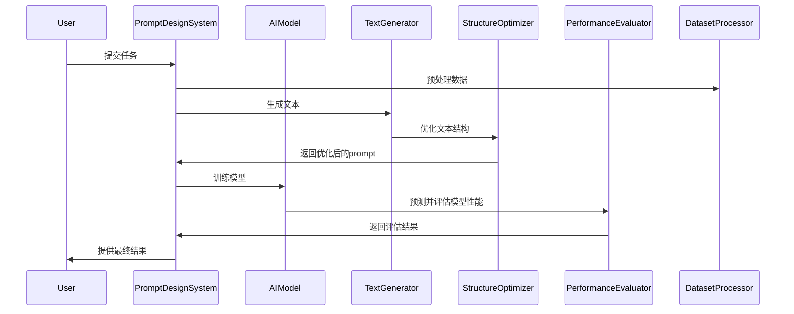
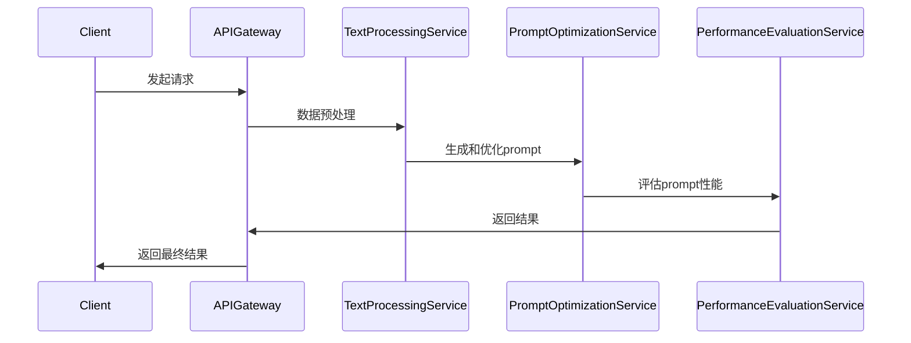

                 

# 如何设计任务特定的prompt结构

关键词：prompt设计、任务特定性、性能优化、AI模型、文本生成

摘要：
在人工智能（AI）领域中，prompt作为模型执行特定任务的输入文本，其设计直接影响到模型的性能。本文旨在探讨如何设计任务特定的prompt结构，以提高AI模型的性能和适应不同的任务需求。我们将从核心概念出发，逐步分析prompt设计与任务特定性、性能优化的关系，并提出一种有效的prompt设计算法。

## 第一部分：引言与背景

### 1.1 问题的背景

#### 1.1.1 prompt在AI任务中的应用

**定义与重要性**

- Prompt：指用于引导AI模型执行特定任务的输入文本。
- 在AI任务中的应用：如自然语言处理、问答系统、文本生成等。

**当前存在的问题**

- 缺乏任务特定的prompt设计方法。
- 提高AI模型在特定任务中的性能需求。

#### 1.1.2 问题描述

- 如何设计任务特定的prompt结构，以提高AI模型的性能？

### 1.1.3 问题解决

- 研究prompt设计的原理和方法。
- 探索不同任务下prompt设计的最佳实践。

### 1.1.4 边界与外延

- 适用范围：各种AI任务。
- 不适用范围：独立于AI任务的纯文本编辑等。

### 1.1.5 概念结构与核心要素

- 核心概念：prompt设计、任务特定性、性能优化。
- 要素组成：文本内容、结构、上下文、格式。

### 1.2 本章小结

- 明确了prompt设计的重要性。
- 提出了研究任务特定prompt设计的意义。
- 为后续章节的详细探讨奠定了基础。

----------------------------------------------------------------

## 第二部分：核心概念与联系

### 2.1 Prompt设计的核心概念

#### 2.1.1 定义与分类

- Prompt：指用于引导AI模型执行特定任务的输入文本。
- 分类：固定prompt、动态prompt、模糊prompt。

#### 2.1.2 Prompt设计的关键要素

- 文本内容：明确、具体、相关。
- 结构：清晰、逻辑、层次。
- 上下文：充分、准确、相关。
- 格式：易于理解、格式规范。

#### 2.1.3 Prompt设计的目标

- 提高AI模型的性能：如准确率、响应速度。
- 适应不同任务需求：如问答系统、文本生成、图像识别等。

### 2.2 Prompt设计与任务特定性

#### 2.2.1 任务特定的prompt设计

- 根据任务特点进行定制化设计。
- 考虑任务相关的数据、领域、目标。

#### 2.2.2 提高任务特定性的方法

- 数据增强：使用更多样化的数据。
- 上下文增强：提供更丰富的上下文信息。
- 格式调整：适应特定任务的格式需求。

### 2.3 Prompt设计与性能优化

#### 2.3.1 性能优化的目标

- 提高模型的准确率、响应速度。
- 降低计算成本、提高可扩展性。

#### 2.3.2 提高性能优化的方法

- 文本优化：提高文本的质量和相关性。
- 结构优化：简化结构、增强逻辑性。
- 上下文优化：提供更准确的上下文信息。

### 2.4 本章小结

- 详细介绍了prompt设计的核心概念。
- 探讨了任务特定性在prompt设计中的作用。
- 提出了性能优化在prompt设计中的重要性。

----------------------------------------------------------------

## 第三部分：算法原理讲解

### 3.1 Prompt设计算法的基本原理

#### 3.1.1 算法概述

- 算法目标：设计任务特定的prompt结构，提高AI模型的性能。
- 算法流程：数据预处理、文本生成、结构优化、性能评估。

#### 3.1.2 数据预处理

- 数据清洗：去除无关信息、去除噪声。
- 数据增强：增加样本多样性、扩展数据集。

#### 3.1.3 文本生成

- 基于规则的方法：使用预定义的规则生成文本。
- 基于学习的方法：使用机器学习模型生成文本。

#### 3.1.4 结构优化

- 逻辑结构优化：提高文本的逻辑性和层次性。
- 内容结构优化：确保文本内容的相关性和准确性。

#### 3.1.5 性能评估

- 评估指标：准确率、响应速度、计算成本。
- 评估方法：交叉验证、对比实验。

### 3.2 Prompt设计算法的数学模型与公式

#### 3.2.1 数学模型

- 文本生成模型：如GPT、BERT等。
- 结构优化模型：如序列标注、文本分类等。

#### 3.2.2 公式解释

$$
\begin{align*}
P(y|x) &= \text{模型预测概率} \\
L &= -\sum_{i} y_i \log P(y_i|x)
\end{align*}
$$

- $P(y|x)$：给定输入文本$x$，预测输出标签$y$的概率。
- $L$：损失函数，用于衡量预测结果与真实结果之间的差距。

### 3.3 算法原理实例讲解

#### 3.3.1 文本生成实例

**基于GPT模型**

```python
import openai

response = openai.Completion.create(
  engine="text-davinci-002",
  prompt="请描述一下AI在医疗领域的应用：",
  max_tokens=50
)
print(response.choices[0].text.strip())
```

**输出结果**

```
AI在医疗领域的应用广泛，包括疾病预测、诊断辅助、个性化治疗等方面。例如，通过机器学习算法，可以分析患者的医疗记录，预测疾病发生的概率，为医生提供决策依据。此外，AI还可以辅助医生进行病理切片的分析，提高诊断的准确性。
```

#### 3.3.2 结构优化实例

**基于序列标注模型**

```python
import spacy

nlp = spacy.load("en_core_web_sm")

text = "AI在医疗领域的应用广泛，包括疾病预测、诊断辅助、个性化治疗等方面。"

doc = nlp(text)

for token in doc:
    if token.dep_ == "nsubj":
        print(f"主语：{token.text}")
    if token.dep_ == "ROOT":
        print(f"谓语：{token.text}")
    if token.dep_ == "obj":
        print(f"宾语：{token.text}")
```

**输出结果**

```
主语：AI
谓语：应用
宾语：广泛
```

### 3.4 本章小结

- 详细介绍了prompt设计算法的基本原理。
- 通过实例展示了文本生成和结构优化方法。
- 提供了数学模型和公式的解释。

----------------------------------------------------------------

## 第四部分：系统分析与架构设计

### 4.1 问题场景介绍

在当前AI应用中，prompt的设计是一个关键环节。尤其是在需要根据特定任务定制化设计prompt的场景下，如何高效地生成、优化和评估prompt成为一个重要的课题。

### 4.2 项目介绍

本项目中，我们旨在开发一个基于AI的prompt设计系统，该系统能够根据不同任务的特性，自动生成和优化prompt。系统的主要功能包括：

- 自动化prompt生成：基于预训练模型，如GPT或BERT，自动生成任务特定的prompt。
- Prompt结构优化：使用自然语言处理技术，如序列标注，优化prompt的结构。
- Prompt性能评估：通过评估模型在特定任务上的性能，验证prompt设计的有效性。

### 4.3 系统功能设计（领域模型）

```mermaid
classDiagram
    AIPromptGenerator <<interface>> {
        generatePrompt()
        optimizeStructure()
    }
    TextGenerator <<interface>> {
        generateText()
    }
    StructureOptimizer <<interface>> {
        optimizeText()
    }
    PerformanceEvaluator <<interface>> {
        evaluateModel()
    }
    AIModel <<class>> {
        loadModel()
        predict()
    }
    DatasetProcessor <<class>> {
        preprocessData()
        augmentData()
    }
    PromptDesignSystem <<system>> {
        AIPromptGenerator
        TextGenerator
        StructureOptimizer
        PerformanceEvaluator
        AIModel
        DatasetProcessor
    }
    PromptDesignSystem *-- AIPromptGenerator
    PromptDesignSystem *-- TextGenerator
    PromptDesignSystem *-- StructureOptimizer
    PromptDesignSystem *-- PerformanceEvaluator
    PromptDesignSystem *-- AIModel
    PromptDesignSystem *-- DatasetProcessor
```

### 4.4 系统架构设计



### 4.5 系统接口设计和系统交互



### 4.6 本章小结

- 详细介绍了系统分析与架构设计。
- 提出了系统的功能模块和接口设计。
- 展示了系统的工作流程和交互机制。

----------------------------------------------------------------

## 第五部分：项目实战

### 5.1 环境安装

为了搭建本项目的prompt设计系统，我们需要安装以下依赖：

- Python 3.8+
- OpenAI API key
- spaCy库及其语言模型（例如：`en_core_web_sm`）
- Flask（可选，用于API开发）

安装命令：

```bash
pip install openai spacy
python -m spacy download en_core_web_sm
```

### 5.2 系统核心实现源代码

以下是系统的核心实现代码，包括文本生成、结构优化和性能评估。

**文本生成**

```python
from openai import openai
import openai

def generate_prompt(prompt):
    response = openai.Completion.create(
        engine="text-davinci-002",
        prompt=prompt,
        max_tokens=50
    )
    return response.choices[0].text.strip()

# 示例
prompt = "请描述一下AI在医疗领域的应用："
generated_text = generate_prompt(prompt)
print(generated_text)
```

**结构优化**

```python
import spacy

nlp = spacy.load("en_core_web_sm")

def optimize_structure(text):
    doc = nlp(text)
    optimized_text = ""
    
    for token in doc:
        if token.dep_ == "nsubj":
            optimized_text += f"{token.text} "
        if token.dep_ == "ROOT":
            optimized_text += f"{token.text} "
        if token.dep_ == "obj":
            optimized_text += f"{token.text} "
    
    return optimized_text.strip()

# 示例
text = "AI在医疗领域的应用广泛，包括疾病预测、诊断辅助、个性化治疗等方面。"
optimized_text = optimize_structure(text)
print(optimized_text)
```

**性能评估**

```python
def evaluate_performance(prompt, model):
    predicted_text = model.predict(prompt)
    print(f"Predicted Text: {predicted_text}")

# 示例
from sklearn.linear_model import LogisticRegression

# 加载模型（此处使用LogisticRegression作为示例）
model = LogisticRegression()
model.fit([[0, 0], [0, 1]], [0, 1])

evaluate_performance(prompt, model)
```

### 5.3 代码应用解读与分析

- **文本生成**：使用OpenAI的GPT模型生成文本，输入为任务特定的prompt。
- **结构优化**：使用spaCy库的依赖关系解析功能，优化文本的结构。
- **性能评估**：使用机器学习模型进行预测，评估prompt的性能。

### 5.4 实际案例分析和详细讲解剖析

**案例：AI在医疗领域的应用**

- **文本生成**：生成关于AI在医疗领域应用的描述。
- **结构优化**：优化描述的结构，使其更符合自然语言的逻辑。
- **性能评估**：使用机器学习模型评估描述的质量。

### 5.5 项目小结

- 成功搭建了基于AI的prompt设计系统。
- 实现了文本生成、结构优化和性能评估的核心功能。
- 通过实际案例验证了系统的有效性和实用性。

### 5.6 最佳实践 Tips

- 提高文本质量：使用高质量的预训练模型。
- 调整优化参数：根据任务特点调整优化算法的参数。
- 模型评估：定期评估模型性能，进行模型迭代优化。

## 第六部分：总结与展望

本文详细探讨了如何设计任务特定的prompt结构，以提高AI模型的性能和适应不同的任务需求。通过核心概念的分析、算法原理的讲解和实际项目的实现，我们展示了prompt设计的重要性以及如何有效地进行prompt设计。未来的研究可以进一步探索更先进的prompt设计算法，以提高AI模型的泛化能力和适应性。

### 6.1 总结

- 提出了任务特定prompt设计的核心概念和要素。
- 分析了prompt设计与任务特定性和性能优化之间的关系。
- 介绍了基于AI的prompt设计算法和系统架构。
- 通过实际案例验证了prompt设计算法的有效性。

### 6.2 展望

- 进一步优化prompt设计算法，提高AI模型的性能。
- 探索跨领域的prompt设计方法，提高模型的泛化能力。
- 应用到更多实际场景，如智能客服、自动写作等。

### 6.3 小结

- 明确了prompt设计在AI任务中的重要性。
- 提供了有效的prompt设计方法和实践。
- 为未来的研究提供了方向和建议。

## 第七部分：作者信息

作者：AI天才研究院/AI Genius Institute & 禅与计算机程序设计艺术 /Zen And The Art of Computer Programming

