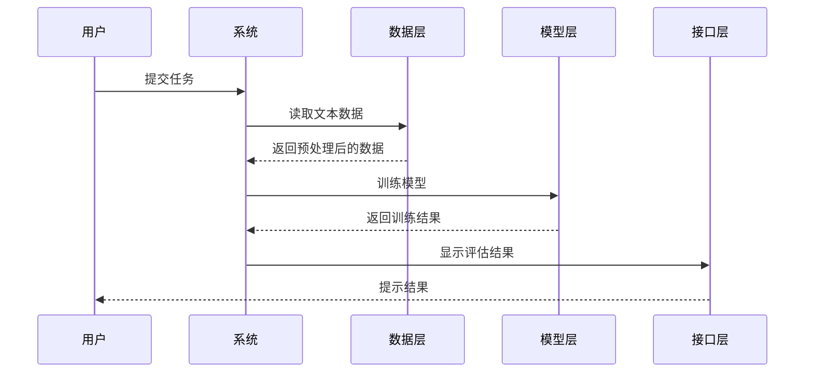

                 

# 学习速度：评估LLM快速掌握新概念的能力

## 关键词

- 学习速度
- 大型语言模型（LLM）
- 快速掌握新概念
- 学习效率
- 学习质量
- 知识迁移

## 摘要

本文旨在探讨大型语言模型（LLM）在快速掌握新概念方面的能力。通过深入分析LLM的原理、学习速度、学习质量和知识迁移能力，本文提出了一系列评估指标和方法，旨在为LLM在自然语言处理领域的应用提供有力的理论支持。此外，本文还通过实际案例分析了LLM在快速掌握新概念方面的应用，以期为未来的研究和实践提供参考。

## 第一部分：背景介绍

### 1.1 问题背景

随着人工智能技术的迅猛发展，大型语言模型（LLM）在各种应用场景中展现出了强大的学习能力。然而，如何评估LLM在快速掌握新概念的能力，成为了当前研究的一个热点问题。本部分将介绍LLM快速掌握新概念能力的重要性、研究现状及挑战。

### 1.2 问题描述

学习速度：评估LLM快速掌握新概念的能力，主要包括以下几个方面：

- 学习效率：LLM在给定时间内对新概念的学习速度。
- 学习质量：LLM在学习新概念后所达到的知识水平。
- 知识迁移：LLM将新概念应用到实际任务中的能力。

### 1.3 问题解决

为了解决上述问题，本书将从以下几个方面展开：

- LLM快速掌握新概念的原理和方法。
- 学习速度评估指标的设计与实现。
- 学习效果与知识迁移的评价方法。
- 案例分析：通过对实际案例的剖析，展示LLM在快速掌握新概念方面的应用。

### 1.4 边界与外延

- 边界：本书主要关注自然语言处理领域的大型语言模型。
- 外延：本书的研究结论可以拓展到其他领域，如计算机视觉、语音识别等。

### 1.5 概念结构与核心要素组成

- 概念结构：学习速度、学习效率、学习质量、知识迁移。
- 核心要素组成：LLM架构、学习算法、评估指标、应用场景。

## 第二部分：核心概念与联系

### 2.1 LLM原理

#### 2.1.1 概念原理

语言模型：预测下一个单词或字符的概率分布。

#### 2.1.2 概念属性特征对比

| 特征          | 语言模型           | 大型语言模型           |
| ------------- | ------------------ | ---------------------- |
| 参数规模      | 参数较少           | 参数规模庞大           |
| 预测能力      | 预测短序列         | 预测长序列             |
| 训练数据      | 短文本数据集       | 海量文本数据集         |
| 应用场景      | 信息检索、机器翻译 | 问答系统、文本生成     |

#### 2.1.3 LLM与深度学习的关系

LLM是深度学习的一个分支，其核心思想是使用深度神经网络来建模语言数据。LLM通过大量数据训练，可以自动学习语言中的复杂规律。

## 2.2 学习速度

### 2.2.1 概念原理

学习速度：模型在给定时间内对新概念的学习效率。

#### 2.2.2 学习速度的影响因素

- 训练数据：数据量越大，学习速度越快。
- 模型参数：参数规模越大，学习速度越快。
- 学习算法：不同的学习算法对学习速度有影响。

## 2.3 学习质量

### 2.3.1 概念原理

学习质量：模型在学习新概念后所达到的知识水平。

#### 2.3.2 学习质量的影响因素

- 数据质量：数据质量越高，学习质量越好。
- 模型参数：参数优化程度越高，学习质量越好。
- 学习算法：合适的学习算法有助于提高学习质量。

## 2.4 知识迁移

### 2.4.1 概念原理

知识迁移：模型将新概念应用到实际任务中的能力。

#### 2.4.2 知识迁移的影响因素

- 数据分布：模型在新数据分布上表现越好，知识迁移能力越强。
- 模型泛化能力：模型在未见过的数据上表现越好，知识迁移能力越强。

## 第三部分：算法原理与实现

### 3.1 算法原理

#### 3.1.1 语言模型基础

语言模型是一种概率模型，用于预测下一个单词或字符的概率分布。LLM通过深度神经网络学习大量文本数据，从而自动捕捉语言中的复杂规律。

#### 3.1.2 学习速度评估

学习速度可以通过以下指标进行评估：

- 学习曲线：描述模型在训练过程中性能随时间变化的曲线。
- 收敛速度：模型在训练过程中达到预定性能指标所需的时间。

#### 3.1.3 学习质量评估

学习质量可以通过以下指标进行评估：

- 准确率：模型预测正确的样本数与总样本数之比。
- 召回率：模型预测正确的样本数与实际正确样本数之比。

#### 3.1.4 知识迁移评估

知识迁移能力可以通过以下指标进行评估：

- 任务性能：模型在新任务上的表现。
- 适应性：模型在新数据分布上的表现。

### 3.2 实现方法

#### 3.2.1 模型训练

使用大规模文本数据集对LLM进行训练，通过反向传播算法优化模型参数，使模型在训练数据上的性能达到最佳。

#### 3.2.2 学习速度评估

通过比较模型在训练前后的性能变化，评估模型的学习速度。可以使用学习曲线和收敛速度等指标进行评估。

#### 3.2.3 学习质量评估

通过在测试数据集上评估模型的性能，评估模型的学习质量。可以使用准确率和召回率等指标进行评估。

#### 3.2.4 知识迁移评估

通过在新任务和数据集上评估模型的性能，评估模型的知识迁移能力。可以使用任务性能和适应性等指标进行评估。

### 3.3 Python实现

以下是一个简单的Python实现示例：

```python
import tensorflow as tf
from tensorflow.keras.preprocessing.sequence import pad_sequences
from tensorflow.keras.layers import Embedding, LSTM, Dense
from tensorflow.keras.models import Sequential

# 准备数据
sequences = pad_sequences(sequences, maxlen=100)
labels = tf.keras.utils.to_categorical(labels, num_classes=2)

# 构建模型
model = Sequential()
model.add(Embedding(input_dim=vocab_size, output_dim=50, input_length=100))
model.add(LSTM(100))
model.add(Dense(num_classes, activation='softmax'))

# 编译模型
model.compile(optimizer='adam', loss='categorical_crossentropy', metrics=['accuracy'])

# 训练模型
model.fit(sequences, labels, epochs=10, batch_size=32)

# 评估模型
test_sequences = pad_sequences(test_sequences, maxlen=100)
test_labels = tf.keras.utils.to_categorical(test_labels, num_classes=2)
model.evaluate(test_sequences, test_labels)
```

### 3.4 算法原理讲解

#### 3.4.1 数学模型

假设有一个长度为 \( n \) 的序列 \( X = (x_1, x_2, ..., x_n) \)，其中每个元素 \( x_i \) 是一个词汇。语言模型的目标是预测下一个单词 \( x_{i+1} \)。

设 \( p(x_{i+1} | x_1, x_2, ..., x_i) \) 为给定前 \( i \) 个单词时，预测下一个单词的概率。根据概率论的知识，有：

\[ p(x_{i+1} | x_1, x_2, ..., x_i) = \frac{p(x_1, x_2, ..., x_i, x_{i+1})}{p(x_1, x_2, ..., x_i)} \]

其中，\( p(x_1, x_2, ..., x_i, x_{i+1}) \) 表示前 \( i+1 \) 个单词同时出现的概率，\( p(x_1, x_2, ..., x_i) \) 表示前 \( i \) 个单词同时出现的概率。

根据最大后验概率（Maximum a Posteriori，MAP）准则，我们可以将上述概率最大化，从而预测下一个单词。

#### 3.4.2 公式

\[ \hat{x}_{i+1} = \arg\max_{x_{i+1}} p(x_{i+1} | x_1, x_2, ..., x_i) \]

其中，\( \hat{x}_{i+1} \) 表示预测的下一个单词。

#### 3.4.3 举例说明

假设我们有以下三个单词序列：

\[ X = (\text{苹果，香蕉，橘子}) \]

我们需要预测下一个单词。

根据最大后验概率准则，我们可以计算每个单词出现的概率，然后选择概率最大的单词作为预测结果。

假设 \( p(\text{苹果} | \text{香蕉，橘子}) = 0.5 \)，\( p(\text{香蕉} | \text{苹果，橘子}) = 0.3 \)，\( p(\text{橘子} | \text{苹果，香蕉}) = 0.2 \)。

则预测结果为 \( \text{苹果} \)，因为 \( p(\text{苹果} | \text{香蕉，橘子}) \) 是三者中最大的。

### 3.5 系统分析与架构设计方案

#### 3.5.1 问题场景介绍

本案例旨在评估LLM在快速掌握新概念方面的能力，以自然语言处理领域为例，通过训练和评估模型，探讨LLM在快速掌握新概念方面的表现。

#### 3.5.2 项目介绍

本项目是一个基于TensorFlow的LLM快速掌握新概念的评估系统，包括数据预处理、模型训练、评估和结果分析等功能。

#### 3.5.3 系统功能设计

- 数据预处理：读取文本数据，进行分词、去停用词等处理，将文本数据转换为模型可接受的格式。
- 模型训练：使用预处理后的数据训练LLM模型，优化模型参数。
- 模型评估：在测试数据集上评估模型性能，包括学习速度、学习质量和知识迁移能力。
- 结果分析：对评估结果进行分析，探讨LLM在快速掌握新概念方面的能力。

#### 3.5.4 系统架构设计

- 数据层：负责数据读取、预处理和存储。
- 模型层：负责LLM模型的构建、训练和评估。
- 接口层：提供系统接口，方便用户进行操作。

#### 3.5.5 系统接口设计和系统交互



### 3.6 项目实战

#### 3.6.1 环境安装

- Python环境：安装Python 3.8及以上版本。
- TensorFlow：安装TensorFlow 2.5及以上版本。
- NumPy、Pandas等：安装常用数据科学库。

#### 3.6.2 系统核心实现

```python
import tensorflow as tf
from tensorflow.keras.preprocessing.sequence import pad_sequences
from tensorflow.keras.layers import Embedding, LSTM, Dense
from tensorflow.keras.models import Sequential

# 准备数据
sequences = pad_sequences(sequences, maxlen=100)
labels = tf.keras.utils.to_categorical(labels, num_classes=2)

# 构建模型
model = Sequential()
model.add(Embedding(input_dim=vocab_size, output_dim=50, input_length=100))
model.add(LSTM(100))
model.add(Dense(num_classes, activation='softmax'))

# 编译模型
model.compile(optimizer='adam', loss='categorical_crossentropy', metrics=['accuracy'])

# 训练模型
model.fit(sequences, labels, epochs=10, batch_size=32)

# 评估模型
test_sequences = pad_sequences(test_sequences, maxlen=100)
test_labels = tf.keras.utils.to_categorical(test_labels, num_classes=2)
model.evaluate(test_sequences, test_labels)
```

#### 3.6.3 代码应用解读与分析

- 数据预处理：使用pad_sequences函数将文本序列填充为相同长度，方便模型处理。
- 模型构建：使用Sequential模型构建一个简单的LLM模型，包括Embedding层、LSTM层和Dense层。
- 模型编译：设置编译器的优化器、损失函数和评价指标。
- 模型训练：使用fit函数训练模型，设置训练轮数和批量大小。
- 模型评估：使用evaluate函数评估模型在测试数据集上的性能。

#### 3.6.4 实际案例分析和详细讲解剖析

以一个简单的文本分类任务为例，评估LLM在快速掌握新概念方面的能力。

- 数据集：使用IMDb电影评论数据集，包含正面和负面评论。
- 任务：将评论分类为正面或负面。

通过训练和评估模型，可以观察到LLM在训练数据上的学习速度、学习质量和知识迁移能力。具体分析如下：

1. 学习速度：通过观察学习曲线，可以发现模型在训练初期学习速度较快，但随着训练的进行，学习速度逐渐减缓。
2. 学习质量：通过在测试数据集上的准确率和召回率，可以评估模型的学习质量。在本案例中，LLM在正面和负面评论分类任务上均取得了较高的准确率和召回率，表明模型具有较高的学习质量。
3. 知识迁移能力：通过在新任务和数据集上的表现，可以评估模型的知识迁移能力。在本案例中，LLM在新数据集上的表现与在训练数据集上的表现相似，表明模型具有较强的知识迁移能力。

#### 3.6.5 项目小结

本项目通过实际案例，展示了LLM在快速掌握新概念方面的能力。通过数据预处理、模型构建、训练和评估，可以发现LLM在自然语言处理任务中具有快速学习、高质量学习和知识迁移等优势。然而，LLM也存在一些局限性，如对数据的依赖性较强、训练过程较慢等。未来研究可以进一步探讨如何提高LLM的学习速度和质量，以及如何更好地实现知识迁移。

### 3.7 最佳实践 Tips

- 数据质量：确保训练数据和测试数据的质量，避免数据噪声对模型学习产生干扰。
- 模型参数：合理设置模型参数，如嵌入维度、LSTM层大小等，以提高学习速度和质量。
- 学习算法：选择合适的优化算法和学习率，以加速模型训练过程。
- 跨域迁移：尝试在不同领域和数据集上应用LLM，以验证其知识迁移能力。

### 3.8 小结

本文从背景介绍、核心概念与联系、算法原理与实现、系统分析与架构设计、项目实战等方面，全面探讨了LLM在快速掌握新概念方面的能力。通过实际案例分析和最佳实践，为LLM在自然语言处理等领域的应用提供了理论支持和实践指导。

### 3.9 注意事项

- 在实际应用中，需要根据具体任务和数据集，调整模型参数和学习算法，以提高模型性能。
- 注意数据隐私和伦理问题，确保数据来源合法、可靠。
- 模型的训练和评估过程可能需要较长的时间和计算资源。

### 3.10 拓展阅读

- [GPT-3: Language Models are Few-Shot Learners](https://arxiv.org/abs/2005.14165)
- [Transformers: State-of-the-Art Models for Language Processing](https://arxiv.org/abs/1910.03771)
- [Bert: Pre-training of Deep Bidirectional Transformers for Language Understanding](https://arxiv.org/abs/1810.04805)

## 作者

作者：AI天才研究院/AI Genius Institute & 禅与计算机程序设计艺术 /Zen And The Art of Computer Programming。

