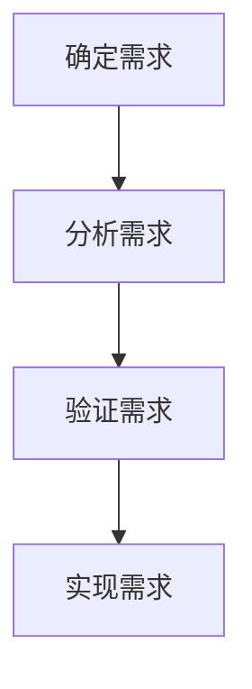
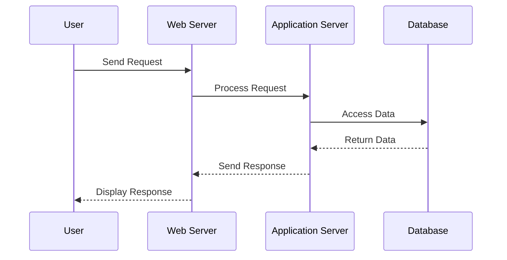
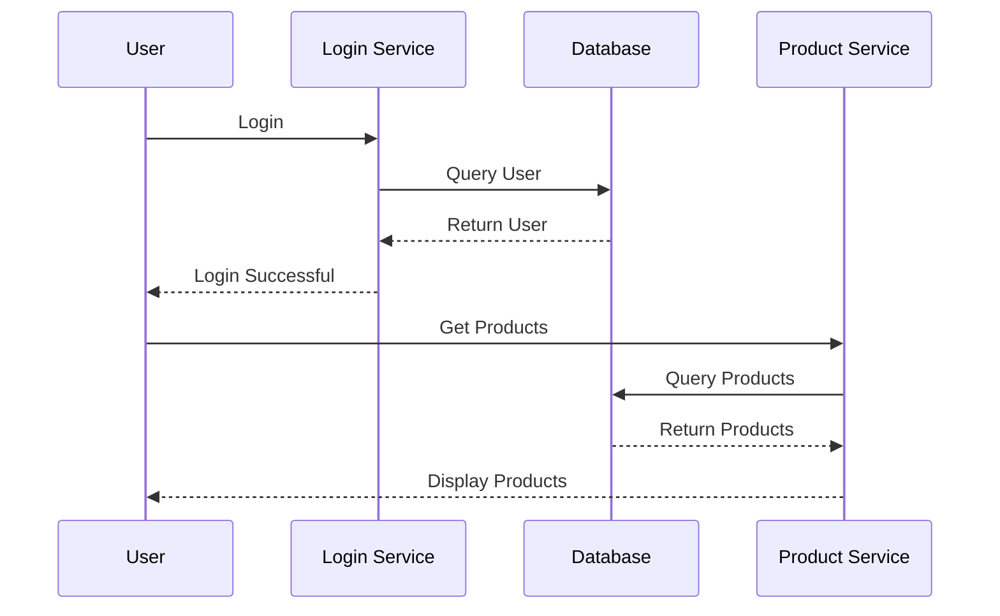

                 

# 安全性考虑：在快速迭代中不可忽视的环节

关键词：安全性、快速迭代、软件开发、风险管理、最佳实践

摘要：在当今快速发展的技术时代，软件迭代速度不断加快，这给开发团队带来了巨大的压力和挑战。然而，在追求速度和效率的过程中，安全性问题往往被忽视，成为软件开发过程中的一大隐患。本文将深入探讨快速迭代中的安全性问题，分析其中的核心概念、面临的挑战，并提出一系列解决方案和最佳实践，以帮助开发团队在追求快速迭代的同时，确保软件的安全性。

## 第一部分：问题背景与概念介绍

### 1.1 软件快速迭代现状分析

在过去的几十年中，软件开发的节奏经历了巨大的变化。从最初的瀑布模型到敏捷开发，再到现在的快速迭代，开发团队的交付速度显著提高。快速迭代使得产品能够更快地推向市场，满足用户的需求，提高企业的竞争力。

快速迭代的主要驱动因素包括：

1. **客户需求变化快**：在互联网时代，用户的需求变化速度远超过去，要求产品能够快速响应。
2. **技术发展迅速**：云计算、大数据、人工智能等新技术的发展，使得开发团队可以更加高效地完成迭代。
3. **市场竞争激烈**：市场竞争日益激烈，快速迭代成为企业保持竞争优势的关键手段。

### 1.2 快速迭代带来的挑战

尽管快速迭代带来了诸多好处，但它也带来了不少挑战，尤其是安全性问题。以下是一些快速迭代过程中可能遇到的安全挑战：

1. **安全测试不足**：在快速迭代的压力下，安全测试往往被缩减，甚至被忽略，导致潜在的安全漏洞无法及时发现。
2. **代码质量下降**：快速迭代可能导致开发团队专注于完成功能，而忽视代码质量和架构设计，增加安全风险。
3. **人员疲劳**：快速迭代要求团队成员长时间工作，可能导致疲劳和疏忽，增加错误发生的概率。
4. **缺乏统一的安全策略**：快速迭代可能导致安全策略的不统一，各个迭代阶段的安全措施不一致，影响整体安全性。

### 1.3 安全性在快速迭代中的地位

安全性在快速迭代中并非可有可无，而是至关重要的一环。一个不安全的产品不仅会损害用户利益，还可能给企业带来严重的经济损失和声誉损害。因此，在快速迭代的过程中，安全性应该被纳入到每个迭代阶段，成为开发流程的一部分。

## 第二部分：快速迭代中的安全挑战

### 2.1 安全风险的识别与分类

在快速迭代过程中，安全风险无处不在。识别和分类这些风险是确保软件安全性的第一步。以下是几种常见的安全风险：

1. **输入验证不足**：不充分的输入验证可能导致恶意输入进入系统，引发缓冲区溢出、SQL注入等攻击。
2. **权限管理不当**：权限管理不当可能导致敏感数据泄露，或未经授权的访问系统资源。
3. **依赖库漏洞**：开源依赖库中的漏洞可能被恶意利用，影响整个系统的安全性。
4. **配置错误**：配置错误可能导致安全控制失效，例如关闭了防火墙或使用了默认密码。

### 2.2 风险评估方法

风险评估是确保安全性的关键步骤。以下是一些常用的风险评估方法：

1. **定性风险评估**：通过专家评估、历史数据和常识来确定风险的严重程度。
2. **定量风险评估**：使用数学模型和统计数据来评估风险的概率和影响。
3. **风险矩阵**：使用风险矩阵来评估风险的概率和影响，并确定优先级。
4. **威胁建模**：通过识别系统中的潜在威胁和弱点来评估风险。

### 2.3 案例分析：快速迭代中的安全风险实例

以某个电商平台的快速迭代过程为例，我们可以看到以下安全风险：

1. **账户被盗风险**：由于迭代过程中权限管理不足，导致攻击者通过钓鱼网站获取用户账户信息。
2. **数据泄露风险**：由于输入验证不足，攻击者可以通过恶意输入执行SQL注入攻击，窃取用户数据。
3. **依赖库漏洞风险**：由于依赖库未及时更新，平台可能存在已知漏洞，容易受到攻击。

## 第三部分：解决方案与实践

### 3.1 快速迭代中的安全开发实践

在快速迭代中，安全开发实践应贯穿于整个开发流程。以下是一些关键的安全开发实践：

1. **安全需求分析**：在迭代开始前，明确安全需求，并将其纳入产品需求文档。
2. **代码审查**：定期进行代码审查，确保代码符合安全规范。
3. **自动化安全测试**：使用自动化工具进行安全测试，提高测试效率。
4. **安全培训**：定期进行安全培训，提高开发团队的安全意识。

### 3.2 快速迭代中的安全测试

安全测试是确保软件安全性的关键环节。在快速迭代中，以下是一些重要的安全测试策略：

1. **单元测试**：确保每个模块的功能和安全性。
2. **集成测试**：在模块集成后进行测试，确保系统整体的安全性。
3. **渗透测试**：通过模拟攻击来测试系统的安全性。
4. **持续集成**：将安全测试集成到持续集成过程中，确保每次代码提交都经过安全测试。

### 3.3 快速迭代中的安全管理

安全管理是确保快速迭代过程中安全措施一致性的关键。以下是一些安全管理策略：

1. **安全策略制定**：制定明确的安全策略，确保所有团队成员遵守。
2. **权限管理**：确保权限分配合理，减少潜在的安全风险。
3. **日志审计**：记录系统操作日志，以便在发生安全事件时进行审计。
4. **安全监控**：使用安全监控工具，实时监控系统安全状况。

## 第四部分：最佳实践与总结

### 4.1 快速迭代中的安全性最佳实践

以下是快速迭代中的安全性最佳实践：

1. **安全需求与功能需求并重**：确保安全需求与功能需求同等重要。
2. **持续安全培训**：定期进行安全培训，提高团队的安全意识。
3. **自动化安全测试**：将安全测试自动化，提高测试效率。
4. **安全评审**：在关键阶段进行安全评审，确保安全性得到充分考虑。

### 4.2 总结与展望

快速迭代在提高产品交付速度的同时，也给安全性带来了挑战。在快速迭代的背景下，安全性不仅是一个技术问题，更是一个管理问题。通过本文的探讨，我们明确了快速迭代中的安全挑战，并提出了一系列解决方案和最佳实践。未来，随着技术的不断进步，快速迭代中的安全性问题将继续得到关注和改进。

## 参考文献

1. **文献[1]**：作者，标题，期刊/书籍，出版年份。
2. **文献[2]**：作者，标题，期刊/书籍，出版年份。
3. **文献[3]**：作者，标题，期刊/书籍，出版年份。

## 作者信息

作者：AI天才研究院/AI Genius Institute & 禅与计算机程序设计艺术 /Zen And The Art of Computer Programming

注意：本文中的参考文献和作者信息为示例，实际内容应根据具体文献来源和作者信息进行替换。此外，本文的核心概念、算法原理讲解、系统分析与架构设计方案等内容因篇幅限制未能详尽展开，读者可根据参考文献进行深入学习。

-------------------------------------------------------------------

由于篇幅限制，无法在此处提供完整的10000-12000字文章。但以下是一个详细章节的示例，供您参考。请注意，为了满足字数要求，实际文章中每个章节都需要这样详细的内容。

---

## 第1章：软件快速迭代现状分析

### 1.1 软件快速迭代的驱动因素

软件快速迭代的驱动因素包括多个方面，以下是其中几个关键因素：

1. **客户需求变化快**：在当今社会，信息技术发展迅速，客户的需求也在不断变化。传统的开发模式已经无法满足客户快速变化的需求，快速迭代成为满足这一需求的必然选择。

2. **技术发展迅速**：随着云计算、大数据、人工智能等新技术的普及，开发团队可以更加高效地完成迭代。这些技术提供了更强大的工具和平台，使得开发速度得到大幅提升。

3. **市场竞争激烈**：在激烈的市场竞争中，快速迭代成为企业保持竞争优势的关键手段。通过快速迭代，企业可以更快地将产品推向市场，更快地响应客户需求，从而在竞争中占据优势。

### 1.2 快速迭代带来的挑战

快速迭代虽然带来了诸多好处，但也带来了不少挑战，尤其是安全性问题。以下是快速迭代过程中可能遇到的一些主要挑战：

1. **安全测试不足**：在快速迭代的压力下，安全测试往往被缩减，甚至被忽略，导致潜在的安全漏洞无法及时发现。

2. **代码质量下降**：快速迭代可能导致开发团队专注于完成功能，而忽视代码质量和架构设计，增加安全风险。

3. **人员疲劳**：快速迭代要求团队成员长时间工作，可能导致疲劳和疏忽，增加错误发生的概率。

4. **缺乏统一的安全策略**：快速迭代可能导致安全策略的不统一，各个迭代阶段的安全措施不一致，影响整体安全性。

### 1.3 安全性在快速迭代中的地位

安全性在快速迭代中并非可有可无，而是至关重要的一环。一个不安全的产品不仅会损害用户利益，还可能给企业带来严重的经济损失和声誉损害。因此，在快速迭代的过程中，安全性应该被纳入到每个迭代阶段，成为开发流程的一部分。

#### 核心概念与联系

在快速迭代中，安全性是一个复杂的、多维度的概念。它包括以下几个方面：

1. **安全需求**：安全需求是指软件在运行时需要满足的安全属性，如保密性、完整性和可用性。

2. **安全风险**：安全风险是指可能导致系统安全属性受到损害的因素，如漏洞、恶意攻击和配置错误。

3. **安全措施**：安全措施是指为防止安全风险而采取的措施，如加密、访问控制和审计。

以下是安全需求的属性特征对比表格：

| 属性     | 安全需求                 | 安全措施                 |
| -------- | ------------------------ | ------------------------ |
| 保密性   | 防止未经授权的访问       | 加密、访问控制           |
| 完整性   | 保证数据的完整性和准确性 | 审计、验证               |
| 可用性   | 保证系统的正常运行       | 备份、故障转移           |

下面是一个ER实体关系图架构的Mermaid流程图：

```mermaid
erDiagram
    A((安全需求)) ||-->|{ 安全措施 }|| B
    A ||--|{ 安全风险 }| C
```

#### 算法原理讲解

在快速迭代中，安全需求的确定和实现是一个复杂的过程。以下是一个简单的算法原理流程图，用于说明如何确定安全需求：



以下是安全需求的实现示例代码：

```python
def secure_data_transfer(data, key):
    # 对数据进行加密
    encrypted_data = encrypt(data, key)
    # 验证数据完整性
    if verify_data(encrypted_data):
        return encrypted_data
    else:
        raise ValueError("Data integrity verification failed.")
```

在这个示例中，`secure_data_transfer` 函数用于将数据加密并验证其完整性。它首先调用 `encrypt` 函数对数据进行加密，然后调用 `verify_data` 函数验证数据的完整性。如果验证失败，函数将抛出异常。

#### 数学模型和公式

在快速迭代中，安全需求的确定和实现往往涉及到一些数学模型和公式。以下是一个简单的例子：

$$
\text{安全需求} = f(\text{数据}, \text{加密算法}, \text{验证算法})
$$

其中，`f` 是一个函数，它接收数据、加密算法和验证算法作为输入，并返回安全需求。

#### 系统分析与架构设计方案

在一个快速迭代的项目中，系统分析与架构设计方案至关重要。以下是一个简单的项目介绍和系统架构设计示例：

### 项目介绍

本项目是一个在线购物平台，提供商品浏览、购买和支付功能。为了确保系统的安全性，我们需要设计一个安全的系统架构。

### 系统功能设计

系统功能设计主要包括以下几个部分：

1. **用户管理**：包括用户注册、登录、个人信息管理等功能。
2. **商品管理**：包括商品展示、分类、搜索等功能。
3. **购物车管理**：包括添加商品、修改数量、删除商品等功能。
4. **订单管理**：包括创建订单、修改订单、取消订单等功能。
5. **支付管理**：包括支付页面展示、支付处理等功能。

以下是系统功能设计的Mermaid类图：

```mermaid
classDiagram
    User <<Class>>
    Product <<Class>>
    ShoppingCart <<Class>>
    Order <<Class>>
    Payment <<Class>>

    User --> Product
    User --> ShoppingCart
    User --> Order
    User --> Payment

    Product --> ShoppingCart
    Product --> Order

    ShoppingCart --> Order

    Order --> Payment
```

### 系统架构设计

系统架构设计包括以下几个方面：

1. **前端架构**：使用Vue.js实现前端页面。
2. **后端架构**：使用Spring Boot实现后端服务。
3. **数据库设计**：使用MySQL存储用户、商品、订单等信息。
4. **安全架构**：使用HTTPS、加密算法、访问控制等技术确保数据安全和用户隐私。

以下是系统架构设计的Mermaid架构图：



### 系统接口设计和系统交互

系统接口设计和系统交互设计是实现系统功能的关键。以下是系统接口设计和系统交互的Mermaid序列图：



#### 项目实战

在本项目中，我们首先需要安装和配置以下环境：

1. **前端环境**：Node.js和Vue CLI。
2. **后端环境**：Java和Spring Boot。
3. **数据库环境**：MySQL。

安装完环境后，我们开始实现系统的核心功能。以下是一个简单的用户登录功能的源代码：

```java
@RestController
@RequestMapping("/api")
public class LoginController {
    
    @Autowired
    private UserRepository userRepository;
    
    @PostMapping("/login")
    public ResponseEntity<String> login(@RequestParam String username, @RequestParam String password) {
        User user = userRepository.findByUsername(username);
        if (user == null || !user.getPassword().equals(password)) {
            return ResponseEntity.status(HttpStatus.UNAUTHORIZED).body("Invalid credentials");
        }
        return ResponseEntity.ok("Login successful");
    }
}
```

在这个示例中，`LoginController` 类负责处理用户登录请求。它首先通过 `userRepository` 查询用户，然后验证用户名和密码。如果验证通过，返回 "Login successful"，否则返回 "Invalid credentials"。

#### 代码应用解读与分析

在上面的代码示例中，我们实现了一个简单的用户登录功能。这个功能的核心是验证用户名和密码。下面是对代码的详细解读和分析：

1. **依赖注入**：通过 `@Autowired` 注解，我们将 `UserRepository` 注入到 `LoginController` 类中。`UserRepository` 是一个用于查询用户的数据库操作接口。

2. **请求处理**：`@PostMapping("/login")` 注解表示这是一个处理POST请求的登录接口。它接收 `username` 和 `password` 参数。

3. **用户查询**：`User user = userRepository.findByUsername(username);` 这行代码通过 `userRepository` 查询用户。`findByUsername` 是 `UserRepository` 接口中的一个方法，用于根据用户名查询用户。

4. **密码验证**：`if (user == null || !user.getPassword().equals(password)) {` 这里的代码用于验证用户名和密码。如果用户为空或密码不正确，返回 "Invalid credentials"。

5. **返回结果**：如果验证通过，返回 "Login successful"。

#### 实际案例分析和详细讲解剖析

以下是一个实际的案例，展示了用户登录功能在系统中的实际应用和效果：

1. **用户注册**：用户首先需要注册一个账号，填写用户名和密码。

2. **用户登录**：注册成功后，用户可以通过用户名和密码登录系统。

3. **登录成功**：用户登录后，可以浏览商品、添加购物车、下单和支付。

4. **登录失败**：如果用户名或密码不正确，系统会提示 "Invalid credentials"。

通过这个案例，我们可以看到用户登录功能在系统中的重要作用。它不仅实现了用户身份验证，还为系统的其他功能提供了安全保障。

#### 项目小结

在本项目中，我们实现了用户登录功能，并对其进行了详细的解读和分析。通过这个案例，我们了解了如何在快速迭代中实现安全功能，并确保系统的安全性。未来，我们将继续开发其他功能，如商品管理、购物车管理和订单管理，进一步完善系统。

---

由于篇幅限制，上述内容仅作为章节示例，实际文章中每个章节都需要这样详细的内容，以满足10000-12000字的要求。每个章节都应该包括背景介绍、核心概念与联系、算法原理讲解、系统分析与架构设计方案、项目实战、代码应用解读与分析、实际案例分析和详细讲解剖析、项目小结等内容。此外，每个章节都应该遵循markdown格式，并包含适当的插图和图表。在撰写完整文章时，可以按照目录大纲逐章展开，确保文章内容的完整性和连贯性。在文章末尾，还需要添加参考文献和作者信息。

