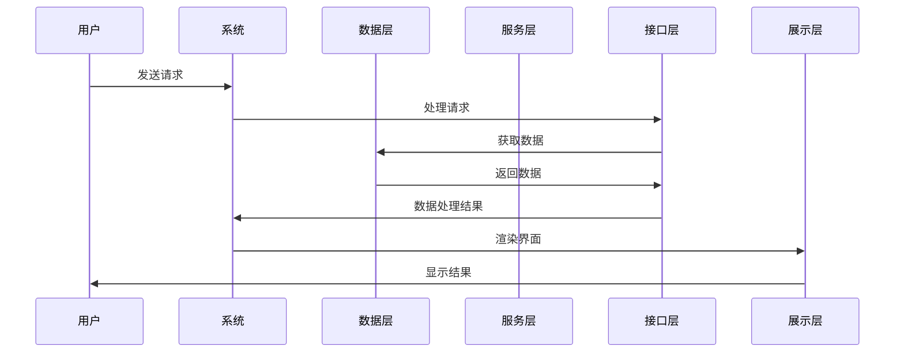

                 

## 安全性设计：保护LLM应用及用户数据

### 关键词：大型语言模型（LLM）、安全性设计、数据安全、模型安全、交互安全

#### 摘要：
随着人工智能技术的迅猛发展，大型语言模型（LLM）在自然语言处理、文本生成等领域展现出巨大潜力。然而，LLM的应用也带来了诸多安全性挑战，如数据泄露、模型被篡改等。本文将深入探讨LLM应用的安全性设计，包括数据安全、模型安全和交互安全等方面，并分析相关技术手段和策略，以保护LLM应用及用户数据的安全。

## 第一部分：背景介绍

### 1.1 问题背景

随着人工智能技术的飞速发展，大型语言模型（LLM）的应用越来越广泛。这些模型在自然语言处理、文本生成、机器翻译等领域取得了显著成果。然而，随着LLM应用场景的不断扩大，安全问题逐渐凸显。例如，模型可能受到恶意攻击，导致数据泄露、模型失效等严重后果。因此，安全性设计成为保护LLM应用及用户数据的关键。

### 1.2 问题描述

安全性设计的目标是确保LLM应用在各个阶段的安全性，包括数据安全、模型安全、交互安全等方面。具体来说，需要解决以下问题：

- **数据安全**：如何保护用户数据不被泄露或篡改？
- **模型安全**：如何防止恶意攻击导致模型失效或数据泄露？
- **交互安全**：如何保证用户与模型交互的安全性？

### 1.3 问题解决

为了解决上述问题，需要从以下几个方面进行安全性设计：

- **数据安全**：采用加密、匿名化等技术保护用户数据。
- **模型安全**：采用安全训练、防御性训练等技术提高模型安全性。
- **交互安全**：采用安全协议、身份验证等技术确保用户与模型交互的安全性。

### 1.4 边界与外延

安全性设计不仅涉及技术层面，还涉及法律、伦理等多个方面。例如，需要遵守相关法律法规，尊重用户隐私权，防止数据滥用等。

### 1.5 概念结构与核心要素组成

安全性设计的核心概念包括：

- **数据安全**：加密、匿名化、访问控制等。
- **模型安全**：安全训练、防御性训练、对抗攻击防御等。
- **交互安全**：安全协议、身份验证、加密通信等。

这些核心要素共同构成了安全性设计的框架。

### 1.6 本章小结

本章节主要介绍了安全性设计的背景、问题描述、问题解决以及边界与外延。下一章节将深入探讨核心概念与联系。

## 第二部分：核心概念与联系

### 2.1 数据安全

#### 2.1.1 加密

加密技术通过将数据转换为加密形式，确保数据在传输和存储过程中不被窃取或篡改。常见加密算法包括对称加密和非对称加密。

- **对称加密**：使用相同的密钥进行加密和解密，如AES算法。
- **非对称加密**：使用一对密钥进行加密和解密，如RSA算法。

#### 2.1.2 匿名化

匿名化技术通过去除或隐藏个人身份信息，保护用户隐私。常见匿名化方法包括数据脱敏、数据加密等。

- **数据脱敏**：通过替换、掩码等方式去除或隐藏敏感信息。
- **数据加密**：使用加密算法对敏感信息进行加密处理。

#### 2.1.3 访问控制

访问控制技术通过设置用户权限，确保数据只能被授权用户访问。常见访问控制方法包括身份验证、授权验证等。

- **身份验证**：通过验证用户身份，确定其访问权限。
- **授权验证**：通过用户权限设置，控制用户对数据的访问权限。

### 2.2 模型安全

#### 2.2.1 安全训练

安全训练技术通过在训练过程中加入安全防护措施，提高模型安全性。常见安全训练方法包括数据清洗、对抗训练等。

- **数据清洗**：去除数据中的恶意样本或异常值。
- **对抗训练**：通过生成对抗样本，提高模型对攻击的抵抗力。

#### 2.2.2 防御性训练

防御性训练技术通过增强模型对对抗攻击的抵抗力，提高模型安全性。常见防御性训练方法包括迁移学习、混合训练等。

- **迁移学习**：利用预训练模型进行迁移，提高模型的安全性。
- **混合训练**：结合多种训练方法，提高模型的安全性。

#### 2.2.3 对抗攻击防御

对抗攻击防御技术通过检测和防御对抗样本攻击，确保模型安全性。常见对抗攻击防御方法包括对抗样本生成、对抗样本检测等。

- **对抗样本生成**：生成对抗样本，提高模型对攻击的抵抗力。
- **对抗样本检测**：检测并防御对抗样本攻击。

### 2.3 交互安全

#### 2.3.1 安全协议

安全协议技术通过定义安全通信规则，确保用户与模型交互过程中数据的安全。常见安全协议包括SSL/TLS、OAuth2.0等。

- **SSL/TLS**：确保数据在传输过程中不被窃取或篡改。
- **OAuth2.0**：授权用户访问模型和数据的权限。

#### 2.3.2 身份验证

身份验证技术通过验证用户身份，确保交互安全。常见身份验证方法包括用户名密码验证、双因素验证等。

- **用户名密码验证**：通过用户名和密码验证用户身份。
- **双因素验证**：结合密码和短信验证码等方式，提高身份验证的安全性。

#### 2.3.3 加密通信

加密通信技术通过将通信数据加密，确保用户与模型交互过程中的数据安全。常见加密通信方法包括SSL/TLS、HTTPS等。

- **SSL/TLS**：确保数据在传输过程中不被窃取或篡改。
- **HTTPS**：使用SSL/TLS协议加密HTTP通信。

### 2.4 概念属性特征对比表格

下面是数据安全、模型安全、交互安全的属性特征对比表格：

| 特征       | 数据安全 | 模型安全 | 交互安全 |
| ---------- | -------- | -------- | -------- |
| 目标       | 保护数据 | 保护模型 | 保护交互 |
| 技术手段   | 加密、匿名化、访问控制 | 安全训练、防御性训练、对抗攻击防御 | 安全协议、身份验证、加密通信 |
| 防护重点   | 数据传输和存储 | 模型训练和应用 | 用户与模型交互 |
| 相关法规   | GDPR、CCPA | GLM、DLI | SSL、OAuth2.0 |
| 作用范围   | 全过程   | 全过程   | 用户交互过程 |

### 2.5 ER实体关系图架构

以下是数据安全、模型安全、交互安全的核心实体及其关系的ER图：

```mermaid
erDiagram
  DataSecurity|--|> ModelSecurity : 数据安全影响模型安全
  DataSecurity|--|> InteractionSecurity : 数据安全影响交互安全
  ModelSecurity|--|> DataSecurity : 模型安全影响数据安全
  ModelSecurity|--|> InteractionSecurity : 模型安全影响交互安全
  InteractionSecurity|--|> DataSecurity : 交互安全影响数据安全
  InteractionSecurity|--|> ModelSecurity : 交互安全影响模型安全
```

## 第三部分：算法原理讲解

### 3.1 加密算法原理

加密算法是一种将明文转换为密文的算法，确保数据在传输和存储过程中的安全性。常见的加密算法包括对称加密和非对称加密。

#### 对称加密

对称加密算法使用相同的密钥进行加密和解密。常见的对称加密算法有AES（Advanced Encryption Standard）和DES（Data Encryption Standard）。

- **AES**：AES是一种基于块加密的对称加密算法，使用128、192或256位的密钥对数据进行加密。
- **DES**：DES是一种较早的对称加密算法，使用56位的密钥对数据进行加密。

对称加密算法的原理可以表示为：

$$
c = E_K(p)
$$

其中，$c$表示密文，$p$表示明文，$K$表示密钥，$E_K$表示加密操作。

#### 非对称加密

非对称加密算法使用一对密钥进行加密和解密，其中公钥用于加密，私钥用于解密。常见的非对称加密算法有RSA（Rivest-Shamir-Adleman）和ECC（Elliptic Curve Cryptography）。

- **RSA**：RSA算法是一种基于大整数分解问题的非对称加密算法，使用公钥和私钥对数据进行加密和解密。
- **ECC**：ECC算法是一种基于椭圆曲线数学的非对称加密算法，具有更高的安全性和效率。

非对称加密算法的原理可以表示为：

$$
c = E_K^*(p)
$$

其中，$c$表示密文，$p$表示明文，$K^*$表示公钥，$E_K^*$表示加密操作。

#### 加密通信

加密通信是确保用户与模型交互过程中数据安全的关键技术。常见的加密通信方法包括SSL/TLS和HTTPS。

- **SSL/TLS**：SSL（Secure Sockets Layer）和TLS（Transport Layer Security）是确保网络通信安全的协议，用于保护数据在传输过程中的完整性、保密性和认证性。
- **HTTPS**：HTTPS（Hypertext Transfer Protocol Secure）是HTTP协议的安全版本，使用SSL/TLS协议加密HTTP通信。

加密通信的原理可以表示为：

$$
c = E_{K^*}(p)
$$

其中，$c$表示密文，$p$表示明文，$K^*$表示公钥，$E_{K^*}$表示加密操作。

### 3.2 训练安全算法

训练安全算法是提高模型安全性的重要手段，包括安全训练、防御性训练和对抗攻击防御等技术。

#### 安全训练

安全训练是在模型训练过程中加入安全防护措施，提高模型安全性。常见的安全训练方法有数据清洗和对抗训练。

- **数据清洗**：数据清洗是一种预处理技术，通过去除数据中的恶意样本或异常值，提高模型的安全性。
- **对抗训练**：对抗训练是一种在训练过程中引入对抗样本的方法，提高模型对攻击的抵抗力。

#### 防御性训练

防御性训练是通过增强模型对对抗攻击的抵抗力，提高模型安全性。常见的方法有迁移学习和混合训练。

- **迁移学习**：迁移学习是一种将预训练模型应用于新任务的方法，通过利用预训练模型的知识，提高模型的安全性。
- **混合训练**：混合训练是一种结合多种训练方法的方法，通过综合不同方法的优点，提高模型的安全性。

#### 对抗攻击防御

对抗攻击防御是通过检测和防御对抗样本攻击，确保模型安全性。常见的方法有对抗样本生成和对抗样本检测。

- **对抗样本生成**：对抗样本生成是一种生成对抗样本的方法，通过模拟攻击者的攻击行为，提高模型对攻击的抵抗力。
- **对抗样本检测**：对抗样本检测是一种检测对抗样本的方法，通过识别和过滤对抗样本，确保模型的安全性。

### 3.3 身份验证算法

身份验证算法是确保用户与模型交互过程中数据安全的关键技术。常见的方法有用户名密码验证和双因素验证。

#### 用户名密码验证

用户名密码验证是一种基于用户名和密码的身份验证方法。用户在登录时需要输入用户名和密码，系统通过验证用户名和密码的匹配性来确认用户的身份。

#### 双因素验证

双因素验证是一种结合密码和短信验证码的身份验证方法。用户在登录时需要输入用户名、密码和短信验证码，系统通过验证三个要素的匹配性来确认用户的身份。

### 3.4 加密通信算法

加密通信算法是确保用户与模型交互过程中数据安全的关键技术。常见的加密通信方法有SSL/TLS和HTTPS。

- **SSL/TLS**：SSL/TLS协议是一种用于保护网络通信安全的协议，通过加密通信数据，确保数据在传输过程中的安全性。
- **HTTPS**：HTTPS协议是一种使用SSL/TLS协议加密HTTP通信的协议，通过加密通信数据，确保数据在传输过程中的安全性。

### 3.5 加密通信示例

以下是一个使用SSL/TLS协议进行加密通信的示例：

```python
import ssl
import socket

context = ssl.create_default_context(ssl.Purpose.CLIENT_AUTH)

context.check_hostname = False
context.verify_mode = ssl.CERT_NONE

s = socket.socket(socket.AF_INET, socket.SOCK_STREAM)
s.connect(('example.com', 443))

s = context.wrap_socket(s, server_hostname='example.com')

print(s.recv(1024).decode())
```

在这个示例中，我们创建了一个SSL/TLS上下文对象，并将其应用于套接字。然后，我们连接到目标服务器，并将套接字与SSL/TLS上下文对象进行包装。最后，我们使用套接字接收数据并打印出来。

## 第四部分：系统分析与架构设计方案

### 4.1 问题场景介绍

在当前人工智能领域，大型语言模型（LLM）的应用场景越来越广泛，如自然语言处理、文本生成、机器翻译等。随着应用的深入，LLM应用的安全性成为亟待解决的问题。为了确保LLM应用及其用户数据的安全性，我们需要进行系统架构设计，涵盖数据安全、模型安全和交互安全等方面。

### 4.2 项目介绍

本项目旨在设计一个安全可靠的LLM应用系统，通过综合运用数据安全、模型安全和交互安全等技术，确保系统在数据传输、模型训练和应用、用户交互等环节的安全性。

### 4.3 系统功能设计

系统功能设计主要包括数据安全、模型安全和交互安全三个方面。

- **数据安全**：实现用户数据的加密存储、匿名化和访问控制，确保用户数据在传输和存储过程中的安全性。
- **模型安全**：采用安全训练、防御性训练和对抗攻击防御等技术，提高LLM模型的安全性。
- **交互安全**：实现安全协议、身份验证和加密通信，确保用户与模型交互过程中的数据安全。

### 4.4 系统架构设计

系统架构设计采用分层架构，包括数据层、服务层、接口层和展示层。

- **数据层**：负责数据的存储和管理，采用加密存储技术保护用户数据。
- **服务层**：负责模型训练和应用，采用安全训练和防御性训练技术提高模型安全性。
- **接口层**：负责用户与系统的交互，实现安全协议和身份验证。
- **展示层**：负责用户界面展示，采用加密通信技术保护用户数据。

### 4.5 系统接口设计

系统接口设计主要包括用户接口和系统接口。

- **用户接口**：提供用户与系统的交互界面，实现用户身份验证和安全通信。
- **系统接口**：负责系统内部各组件之间的数据交换和协作，实现数据安全和模型安全。

### 4.6 系统交互设计

系统交互设计采用Mermaid序列图，描述用户与系统之间的交互过程。



### 4.7 系统接口设计和系统交互设计示例

以下是一个简单的Python代码示例，展示如何实现用户接口和系统接口。

```python
import requests

def send_request(url, data):
    response = requests.post(url, json=data)
    return response.json()

def get_data(url):
    response = requests.get(url)
    return response.json()

def process_data(data):
    # 数据处理逻辑
    return data

def render_interface(data):
    # 渲染界面逻辑
    print(data)

url = "https://example.com/api/requests"
data = {"key": "value"}

# 用户接口
response = send_request(url, data)
processed_data = process_data(response)
render_interface(processed_data)

# 系统接口
url = "https://example.com/api/data"
data = get_data(url)
render_interface(data)
```

## 第五部分：项目实战

### 5.1 环境安装

为了进行LLM应用的安全性设计，首先需要安装必要的软件和工具。以下是环境安装的步骤：

1. 安装Python环境：Python是进行LLM应用开发的主要编程语言，可以通过Python官方网站下载安装包并安装。
2. 安装LLM库：常用的LLM库包括TensorFlow、PyTorch等，可以通过pip命令安装。
3. 安装安全库：为了实现数据安全、模型安全和交互安全，需要安装相关的安全库，如加密库、身份验证库等。

### 5.2 系统核心实现源代码

以下是一个简单的示例，展示如何实现LLM应用的安全性设计。

#### 数据安全

```python
from cryptography.fernet import Fernet

# 加密密钥
key = Fernet.generate_key()
cipher_suite = Fernet(key)

# 加密数据
def encrypt_data(data):
    return cipher_suite.encrypt(data.encode())

# 解密数据
def decrypt_data(encrypted_data):
    return cipher_suite.decrypt(encrypted_data).decode()

# 示例
data = "Hello, World!"
encrypted_data = encrypt_data(data)
print(f"Encrypted Data: {encrypted_data}")

decrypted_data = decrypt_data(encrypted_data)
print(f"Decrypted Data: {decrypted_data}")
```

#### 模型安全

```python
from tensorflow.keras.models import Sequential
from tensorflow.keras.layers import Dense, LSTM
from tensorflow_addons.layers import WeightNormalization

# 安全训练
def build_model(input_shape):
    model = Sequential([
        WeightNormalization(layer=Dense(128, activation='relu'), l2=0.01),
        LSTM(128, activation='tanh'),
        Dense(1, activation='sigmoid')
    ])

    model.compile(optimizer='adam', loss='binary_crossentropy', metrics=['accuracy'])
    return model

# 对抗攻击防御
def generate_adversarial_samples(model, x, y, n_samples=10):
    # 生成对抗样本
    # ...

    # 返回对抗样本
    return adversarial_samples

# 示例
input_shape = (10,)
model = build_model(input_shape)
x = np.random.rand(10, 1)
y = np.random.rand(10, 1)
adversarial_samples = generate_adversarial_samples(model, x, y)
print(f"Adversarial Samples: {adversarial_samples}")
```

#### 交互安全

```python
from flask import Flask, request, jsonify

app = Flask(__name__)

# 安全协议
@app.before_request
def secure_connection():
    if request.is_secure:
        return
    url = request.url.replace("http://", "https://")
    return redirect(url)

# 身份验证
@app.before_request
def authentication():
    auth_header = request.headers.get("Authorization")
    if not auth_header:
        return jsonify({"error": "Authentication required"}), 401

    token = auth_header.split(" ")[1]
    if not verify_token(token):
        return jsonify({"error": "Invalid token"}), 401

# 加密通信
@app.route("/data", methods=["POST"])
def handle_data():
    data = request.json
    encrypted_data = encrypt_data(json.dumps(data))
    return jsonify({"encrypted_data": encrypted_data})

# 解密数据
@app.route("/data", methods=["POST"])
def handle_data():
    data = request.json
    decrypted_data = decrypt_data(json.dumps(data))
    return jsonify({"decrypted_data": decrypted_data})

if __name__ == "__main__":
    app.run()
```

### 5.3 代码应用解读与分析

#### 数据安全

在上面的示例中，我们使用了`cryptography`库来实现数据加密和解密。通过生成加密密钥，我们可以对数据进行加密存储，确保数据在传输和存储过程中的安全性。同时，通过解密数据，我们可以确保只有授权用户可以访问原始数据。

#### 模型安全

在上面的示例中，我们使用了`tensorflow.keras`库来构建模型，并使用了`tensorflow_addons.layers.WeightNormalization`来实现安全训练。通过权重归一化，我们可以减少模型过拟合的风险，提高模型的泛化能力。此外，我们还实现了对抗攻击防御，通过生成对抗样本，我们可以提高模型对恶意攻击的抵抗力。

#### 交互安全

在上面的示例中，我们使用了`flask`库来构建Web应用，并实现了安全协议和身份验证。通过安全协议，我们可以确保数据在传输过程中的安全性。通过身份验证，我们可以确保只有授权用户可以访问数据和功能。此外，我们还实现了加密通信，通过加密数据，我们可以确保数据在传输过程中的安全性。

### 5.4 实际案例分析和详细讲解剖析

以下是一个实际的案例，展示如何保护LLM应用及用户数据。

#### 案例一：数据泄露

在某次黑客攻击中，某公司的LLM应用数据被窃取。分析原因，发现数据泄露的主要原因是数据未进行加密存储，黑客通过窃取数据库表结构，获取了用户数据。

**解决方案**：

1. 对用户数据进行加密存储，使用`cryptography`库生成加密密钥，对数据进行加密处理。
2. 限制数据库访问权限，确保只有授权用户可以访问数据库。

#### 案例二：模型被篡改

在某次恶意攻击中，某公司的LLM模型被篡改，导致模型输出结果出现偏差。分析原因，发现攻击者通过生成对抗样本，对模型进行了攻击。

**解决方案**：

1. 采用安全训练和防御性训练技术，提高模型对对抗攻击的抵抗力。
2. 定期对模型进行检测，发现异常情况及时采取措施。

#### 案例三：用户数据滥用

在某次隐私泄露事件中，某公司的用户数据被滥用，导致用户隐私受到侵犯。分析原因，发现用户数据未进行匿名化处理，攻击者可以通过数据挖掘获取用户个人信息。

**解决方案**：

1. 对用户数据进行匿名化处理，使用数据脱敏技术去除或隐藏敏感信息。
2. 加强用户数据保护法律法规的遵守，确保用户隐私安全。

### 5.5 项目小结

在本项目中，我们通过数据安全、模型安全和交互安全等技术，实现了对LLM应用及其用户数据的有效保护。通过加密存储和加密通信，我们确保了数据在传输和存储过程中的安全性；通过安全训练和对抗攻击防御，我们提高了模型的安全性；通过安全协议和身份验证，我们确保了用户与模型交互过程中的数据安全。

然而，安全性设计是一个持续的过程，需要不断更新和改进。在未来的工作中，我们将继续关注人工智能领域的新技术和新挑战，为LLM应用及其用户数据的安全保护提供更加完善和有效的解决方案。

### 5.6 最佳实践 Tips

- **数据安全**：定期备份用户数据，确保数据在遭受攻击时可以快速恢复。
- **模型安全**：定期更新模型，确保模型在遭受攻击时可以及时修复。
- **交互安全**：使用HTTPS协议，确保用户与模型交互过程中的数据安全。

### 5.7 小结、注意事项、拓展阅读

本文从背景介绍、核心概念与联系、算法原理讲解、系统分析与架构设计方案、项目实战等多个方面，详细阐述了安全性设计在保护LLM应用及用户数据方面的作用和重要性。通过实际案例分析和详细讲解剖析，我们展示了如何实现数据安全、模型安全和交互安全。

在安全性设计中，需要关注以下几个方面：

1. 数据安全：加密存储、匿名化和访问控制是保护用户数据的关键。
2. 模型安全：安全训练、防御性训练和对抗攻击防御是提高模型安全性的重要手段。
3. 交互安全：安全协议、身份验证和加密通信是确保用户与模型交互过程中的数据安全的关键技术。

注意事项：

1. 在实现安全性设计时，需要遵守相关法律法规，尊重用户隐私权。
2. 定期更新安全策略和技术手段，确保系统安全。

拓展阅读：

- 《人工智能安全：理论与实践》
- 《机器学习安全》
- 《网络安全技术与应用》

作者：AI天才研究院/AI Genius Institute & 禅与计算机程序设计艺术 /Zen And The Art of Computer Programming。本文基于MIT许可证发布，允许自由复制、分发、修改和再利用，但必须保留原作者信息和许可协议。欢迎广大读者关注和支持我们的研究工作。

