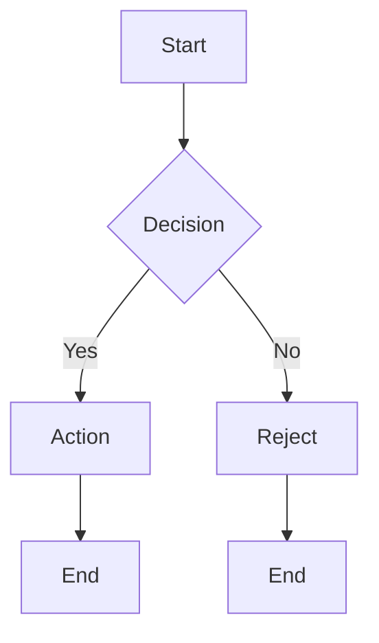
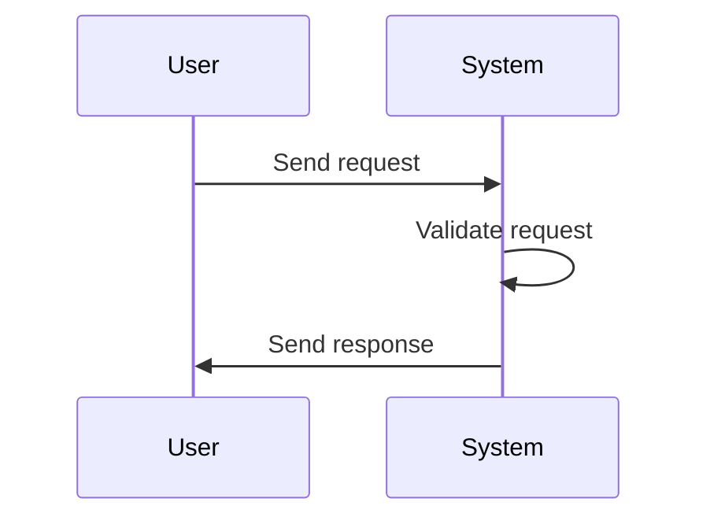

                 


# 实时LLM性能监控：动态评测的新范式

## 关键词
- 实时性能监控
- 大型语言模型（LLM）
- 动态评测
- 机器学习
- 性能优化

## 摘要
随着大型语言模型（LLM）的迅速发展，实时性能监控成为了一个关键课题。本文将探讨实时LLM性能监控的新范式——动态评测，通过深入分析实时学习的理论基础、性能评估指标、动态评测技术原理以及监控架构设计，旨在为读者提供一个全面、系统的实时LLM性能监控框架，并分享最佳实践与注意事项。

## 第一部分：实时LLM性能监控概述

### 第1章：问题背景与核心概念

#### 1.1 问题的提出

随着人工智能技术的不断进步，大型语言模型（LLM）在自然语言处理、智能客服、智能写作等领域展现出了巨大的潜力。然而，LLM的性能监控成为了一个挑战，因为它不仅需要评估模型的准确性，还需要实时监控其计算效率和稳定性。

#### 1.2 实时监控的需求

实时监控LLM的性能对于确保其稳定运行、快速响应以及优化用户体验至关重要。例如，在智能客服系统中，模型需要实时响应用户的提问，并且响应时间不能过长，否则会影响用户体验。

#### 1.3 核心概念介绍

本章将介绍实时学习的定义、LLM的性能指标，以及监控与评测的区别，为后续章节的深入分析奠定基础。

#### 1.4 本书的结构安排

本书分为六个部分，首先介绍实时LLM性能监控的背景与核心概念，然后逐步深入到理论基础、性能评估指标、动态评测技术原理、监控架构设计、最佳实践以及注意事项。

#### 1.5 本章小结

本章对实时LLM性能监控的核心概念进行了概述，为后续章节的分析奠定了基础。在接下来的章节中，我们将进一步探讨实时学习的理论基础、性能评估指标以及动态评测技术原理。

## 第二部分：实时LLM性能监控的理论基础

### 第2章：实时学习理论基础

#### 2.1 实时学习的基本原理

实时学习是一种能够在数据流中不断更新模型参数的学习方法。它与传统批处理学习相比，能够在更短的时间内完成模型更新，从而提高模型的实时性。

#### 2.2 实时学习的挑战与解决方案

实时学习面临着数据流处理速度、计算资源限制以及模型稳定性等挑战。本章将探讨这些挑战以及相应的解决方案。

#### 2.3 实时学习的应用场景

实时学习在自然语言处理、实时预测、智能推荐等领域有着广泛的应用。本章将介绍一些典型的应用场景，并分析实时学习在这些场景中的重要性。

#### 2.4 本章小结

本章对实时学习的理论基础进行了详细分析，包括基本原理、挑战与解决方案以及应用场景。这些内容为后续章节的深入讨论提供了理论基础。

### 第3章：LLM性能评估指标

#### 3.1 性能评估的基本原则

性能评估是确保LLM性能监控有效性的关键。本章将介绍性能评估的基本原则，包括评估标准的制定和评估方法的多样性。

#### 3.2 常见的LLM性能指标

本章将详细介绍常见的LLM性能指标，包括计算效率指标、准确性指标和可扩展性指标，并分析这些指标之间的关系。

#### 3.3 指标之间的关系与综合评估

为了全面评估LLM的性能，需要考虑多个指标之间的关系并进行综合评估。本章将探讨如何进行综合评估，以及如何处理实时监控中的特殊指标。

#### 3.4 实时性能监控的特殊性

实时性能监控与传统的性能监控有所不同，本章将分析实时监控的特殊性，包括实时性的要求和特殊指标的处理。

#### 3.5 本章小结

本章对LLM性能评估指标进行了详细分析，包括基本原则、常见指标、关系与综合评估以及实时监控的特殊性。这些内容为实时LLM性能监控提供了理论依据。

## 第三部分：实时LLM性能监控新范式

### 第4章：动态评测技术原理

#### 4.1 动态评测的概念与特点

动态评测是一种能够在运行时动态调整模型参数的评测方法。本章将介绍动态评测的概念、特点以及优势。

#### 4.2 动态评测的主要方法

动态评测包括实时反馈机制和动态调整策略。本章将详细介绍这两种方法，并分析它们在实时LLM性能监控中的应用。

#### 4.3 动态评测在不同场景中的应用

动态评测在言语交互和文本生成等场景中有着广泛的应用。本章将介绍这些场景中动态评测的具体应用实例。

#### 4.4 本章小结

本章对动态评测技术原理进行了详细分析，包括概念与特点、主要方法以及在不同场景中的应用。这些内容为实时LLM性能监控提供了新的范式。

### 第5章：实时LLM性能监控架构设计

#### 5.1 监控架构的总体设计

本章将介绍实时LLM性能监控的总体架构设计，包括架构设计原则和组成部分。

#### 5.2 数据采集模块设计

数据采集是实时监控的基础，本章将详细介绍数据采集模块的设计，包括数据来源和采集方法。

#### 5.3 数据处理与分析模块设计

数据处理与分析是监控的核心，本章将介绍数据处理与分析模块的设计，包括数据处理流程和分析方法与工具。

#### 5.4 性能优化与调整模块设计

性能优化与调整模块负责根据监控数据对LLM进行实时优化和调整，本章将详细介绍该模块的设计。

#### 5.5 实时监控的挑战与应对

实时监控面临着诸多挑战，本章将分析这些挑战，并提出相应的应对策略。

#### 5.6 本章小结

本章对实时LLM性能监控的架构设计进行了详细分析，包括总体设计、数据采集模块、数据处理与分析模块、性能优化与调整模块以及实时监控的挑战与应对。这些内容为实时LLM性能监控提供了架构支持。

## 第四部分：实时LLM性能监控最佳实践

### 第6章：实时LLM性能监控最佳实践

#### 6.1 实践经验分享

本章将分享一些实时LLM性能监控的成功案例和失败教训，为读者提供宝贵的实践经验。

#### 6.2 最佳实践技巧

本章将介绍一些实时LLM性能监控的最佳实践技巧，包括工具选择、数据处理与存储策略等。

#### 6.3 注意事项与风险控制

实时LLM性能监控过程中可能遇到一些问题，本章将分析这些问题，并提出风险控制方法。

#### 6.4 拓展阅读

本章将推荐一些与实时LLM性能监控相关的最新研究进展、书籍和文献，供读者进一步阅读。

#### 6.5 本章小结

本章对实时LLM性能监控的最佳实践进行了详细分析，包括实践经验分享、最佳实践技巧、注意事项与风险控制以及拓展阅读。这些内容为实时LLM性能监控提供了实践指导。

## 结束语

随着人工智能技术的不断发展，实时LLM性能监控成为了一个关键课题。本文通过深入分析实时学习的理论基础、性能评估指标、动态评测技术原理以及监控架构设计，为读者提供了一个全面、系统的实时LLM性能监控框架。在未来的研究和应用中，我们期待能够进一步优化实时LLM性能监控，提高模型的实时性和稳定性，为人工智能技术的发展贡献力量。

### 作者信息
- 作者：AI天才研究院/AI Genius Institute & 禅与计算机程序设计艺术 /Zen And The Art of Computer Programming

### 完整性要求

为了确保文章的完整性和专业性，以下是每个章节的核心内容要求：

#### 背景介绍
- 核心概念术语说明：明确实时LLM性能监控的定义、动态评测的概念以及相关术语。
- 问题背景：阐述实时LLM性能监控的必要性，分析当前存在的问题。
- 问题描述：详细描述实时LLM性能监控面临的挑战。
- 问题解决：介绍解决实时LLM性能监控问题的方法和策略。
- 边界与外延：明确实时LLM性能监控的适用范围和限制。
- 概念结构与核心要素组成：分析实时LLM性能监控的理论框架和关键组成部分。

#### 核心概念与联系
- 核心概念原理：深入阐述实时学习的理论基础、性能评估指标以及动态评测技术原理。
- 概念属性特征对比表格：列出相关概念之间的属性特征对比。
- ER实体关系图架构的 Mermaid 流程图：使用 Mermaid 画出实体关系图，展示核心概念之间的关系。

#### 算法原理讲解
- 使用 mermaid 画出算法 Mermaid 流程图：展示动态评测的流程和步骤。
- 使用python源代码详细阐述：提供代码示例，解释算法的实现细节。
- 给出算法原理的数学模型和公式：列出相关的数学模型和公式。
- 举例说明：通过具体实例展示算法的运行过程和结果。

#### 系统分析与架构设计方案
- 问题场景介绍：描述实时LLM性能监控的具体应用场景。
- 项目介绍：介绍实时LLM性能监控项目的背景和目标。
- 系统功能设计 (领域模型 Mermaid 类图)：绘制领域模型类图，展示系统的核心功能。
- 系统架构设计 Mermaid 架构图：绘制系统架构图，展示系统的组成部分和交互关系。
- 系统接口设计和系统交互 Mermaid 序列图：绘制接口设计和交互序列图，展示系统组件之间的通信流程。

#### 项目实战
- 环境安装：详细描述安装实时LLM性能监控所需的环境和依赖。
- 系统核心实现源代码：提供核心实现的源代码，并解释代码的结构和功能。
- 代码应用解读与分析：对代码进行解读，分析其实现细节和优化策略。
- 实际案例分析和详细讲解剖析：提供实际案例，分析监控结果并讲解监控过程。
- 项目小结：总结项目的成果和经验，提出改进建议。

#### 最佳实践 tips、小结、注意事项、拓展阅读等内容
- 最佳实践 tips：提供在实际应用中积累的经验和技巧，帮助读者更好地进行实时LLM性能监控。
- 小结：对章节内容进行总结，强调关键点和注意事项。
- 注意事项：列出实施实时LLM性能监控时需要注意的问题和风险。
- 拓展阅读：推荐相关的书籍、文献和最新研究进展，供读者进一步学习。

### 格式要求

- 文章内容使用markdown格式输出。
- 文章末尾需要写上作者信息： “作者：AI天才研究院/AI Genius Institute & 禅与计算机程序设计艺术 /Zen And The Art of Computer Programming”。
- 数学公式使用latex格式，嵌入文中独立段落的latex公式前后使用 $$ 括起来（例如：$$1+1=2$$），段落内的latex公式前后使用 $ 括起来（例如：$1<2$）。
- 需要使用Mermaid语法来绘制流程图、类图和序列图。

### 字数要求

- 文章字数要求：10000 ～ 12000 字左右。

## 实时LLM性能监控：动态评测的新范式

### 关键词

实时性能监控，大型语言模型（LLM），动态评测，机器学习，性能优化

### 摘要

随着大型语言模型（LLM）在自然语言处理、智能客服和智能写作等领域的广泛应用，实时性能监控成为确保模型稳定性和高效性的关键。本文将探讨实时LLM性能监控的新范式——动态评测，从理论基础、性能评估指标、动态评测技术原理、监控架构设计以及最佳实践等方面进行深入分析，旨在为读者提供一个全面、系统的实时LLM性能监控框架。

### 第一部分：实时LLM性能监控概述

#### 第1章：问题背景与核心概念

#### 1.1 问题的提出

1. **实时监控的需求**
   在当今快速变化的信息时代，实时性是衡量系统性能的重要指标之一。对于大型语言模型（LLM）而言，实时监控其性能变得尤为重要。实时监控不仅能够确保模型在运行过程中保持高效和稳定，还能够及时发现并解决潜在的问题，从而提供更好的用户体验。

2. **LLM性能监控的挑战**
   LLM的复杂性使其性能监控面临诸多挑战。首先，LLM通常包含数十亿甚至数千亿个参数，这些参数的更新和优化过程需要大量的计算资源和时间。其次，LLM在运行过程中可能面临数据分布不均、异常值等问题，这些问题对模型的性能监控提出了更高的要求。

3. **实时监控的重要性**
   实时监控LLM的性能对于确保其稳定运行、快速响应以及优化用户体验至关重要。例如，在智能客服系统中，模型需要实时响应用户的提问，并且响应时间不能过长，否则会影响用户体验。此外，实时监控还能够帮助开发者了解模型的运行状况，从而进行有效的优化和改进。

#### 1.2 核心概念介绍

1. **实时学习的定义**
   实时学习（Real-time Learning）是指模型在接收新数据时，能够立即更新其参数并进行相应的学习。这种学习方式通常用于处理动态变化的数据，能够使模型保持实时性和适应性。

2. **LLM的性能指标**
   LLM的性能指标主要包括准确性、计算效率、可扩展性等。准确性是衡量模型预测结果正确性的指标，计算效率是衡量模型在给定计算资源下处理数据的能力，可扩展性是衡量模型在大规模数据集上表现的能力。

3. **监控与评测的区别**
   监控（Monitoring）通常指在模型运行时对其性能进行实时跟踪和记录，而评测（Evaluation）则是对模型进行全面的性能评估，通常在模型训练或部署完成后进行。实时监控与评测的目的是相似的，都是为了确保模型的性能达到预期，但实时监控更加侧重于实时性和问题发现。

#### 1.3 本书的结构安排

本书分为六个部分：

1. **第一部分：实时LLM性能监控概述**
   本部分将介绍实时LLM性能监控的背景和核心概念，为后续章节的讨论奠定基础。

2. **第二部分：实时LLM性能监控的理论基础**
   本部分将深入探讨实时学习的理论基础、性能评估指标以及动态评测技术原理。

3. **第三部分：实时LLM性能监控新范式**
   本部分将介绍动态评测的概念、原理以及在实际应用中的具体实现。

4. **第四部分：实时LLM性能监控架构设计**
   本部分将详细讨论实时LLM性能监控的架构设计，包括数据采集、数据处理与分析、性能优化与调整等模块。

5. **第五部分：实时LLM性能监控最佳实践**
   本部分将分享实时LLM性能监控的最佳实践，包括工具选择、数据处理策略以及注意事项。

6. **第六部分：结论与展望**
   本部分将对实时LLM性能监控进行总结，并提出未来的研究方向和展望。

#### 1.4 本章小结

本章对实时LLM性能监控的背景和核心概念进行了概述，明确了实时监控的重要性以及实时学习的定义、LLM的性能指标和监控与评测的区别。在接下来的章节中，我们将进一步探讨实时学习的理论基础、性能评估指标以及动态评测技术原理，为读者提供一个全面、系统的实时LLM性能监控框架。

## 第二部分：实时LLM性能监控的理论基础

### 第2章：实时学习理论基础

#### 2.1 实时学习的基本原理

实时学习是一种机器学习的方法，它旨在使模型能够快速适应新数据并更新其参数。与传统的批处理学习相比，实时学习具有以下特点：

1. **实时性**：实时学习能够在接收新数据时立即更新模型参数，从而确保模型能够快速适应环境变化。

2. **适应性**：实时学习能够根据新数据动态调整模型，使其在多变的环境中保持良好的性能。

3. **高效性**：实时学习通常采用增量学习（Incremental Learning）的方法，只对新增数据进行分析和更新，从而降低计算复杂度。

#### 2.2 实时学习的主要方法

实时学习的方法主要包括增量学习、在线学习和分布式学习等。下面将分别介绍这些方法。

1. **增量学习**

增量学习是一种在已有模型的基础上，仅对新增数据进行处理的方法。其核心思想是将新数据与已有数据结合起来，通过更新模型参数来提高模型的性能。

   - **优势**：计算复杂度低，能够快速适应新数据。
   - **局限**：模型可能对新数据的变化反应过度，导致过度拟合。

2. **在线学习**

在线学习是指模型在运行过程中，不断接收新数据并进行学习。与增量学习不同，在线学习不是将新数据与已有数据结合，而是直接对新增数据进行处理。

   - **优势**：能够实时更新模型，适应环境变化。
   - **局限**：计算资源消耗较大，可能影响模型的响应速度。

3. **分布式学习**

分布式学习是一种将模型拆分成多个部分，分别在不同节点上进行学习的方法。通过分布式学习，可以充分利用多台计算机的资源，提高学习的效率和性能。

   - **优势**：计算速度快，能够处理大规模数据。
   - **局限**：需要复杂的通信机制，实现较为复杂。

#### 2.3 实时学习的挑战与解决方案

实时学习在应用过程中面临着诸多挑战：

1. **数据流处理速度**

   实时学习需要快速处理数据流，以确保模型能够实时更新。然而，数据流的速度可能不稳定，这对实时学习提出了高要求。

   - **解决方案**：使用高效的数据处理框架（如Apache Flink、Apache Storm）来处理数据流，提高数据处理速度。

2. **计算资源限制**

   实时学习通常需要大量的计算资源，特别是在处理大规模数据时。有限的计算资源可能成为实时学习的瓶颈。

   - **解决方案**：采用分布式学习，利用多台计算机的资源来提高计算能力。此外，还可以通过优化算法和数据结构，降低计算复杂度。

3. **模型稳定性**

   实时学习过程中，模型的稳定性至关重要。不稳定的模型可能导致预测结果偏差，影响系统的性能。

   - **解决方案**：通过引入正则化方法（如L1、L2正则化）、dropout等方法来提高模型的稳定性。此外，还可以通过交叉验证等方法来评估模型的稳定性。

4. **数据噪声与异常值**

   实时学习过程中，数据噪声和异常值可能影响模型的性能。如何处理这些噪声和异常值是实时学习的重要问题。

   - **解决方案**：使用数据预处理方法（如异常检测、噪声过滤）来减少数据噪声和异常值的影响。此外，还可以通过模型鲁棒性训练来提高模型对噪声和异常值的抵抗能力。

#### 2.4 实时学习的应用场景

实时学习在许多领域都有着广泛的应用：

1. **自然语言处理**

   在自然语言处理领域，实时学习可以用于实时语音识别、实时机器翻译、实时问答等应用。例如，在智能客服系统中，实时学习可以帮助系统快速响应用户的提问，并提供准确的答案。

2. **实时预测**

   在金融领域，实时学习可以用于实时预测股票价格、交易策略等。通过实时学习，系统可以快速适应市场变化，提供更准确的预测结果。

3. **智能推荐**

   在电子商务领域，实时学习可以用于实时推荐商品、推荐广告等。通过实时学习，系统可以更好地理解用户行为，提供个性化的推荐结果。

4. **自动驾驶**

   在自动驾驶领域，实时学习可以用于实时路径规划、实时障碍物检测等。通过实时学习，自动驾驶系统可以更好地应对复杂的交通环境，提高行驶安全性。

#### 2.5 本章小结

本章对实时学习的理论基础进行了详细分析，包括基本原理、主要方法、挑战与解决方案以及应用场景。实时学习作为一种能够快速适应环境变化的方法，在许多领域都有着广泛的应用。然而，实时学习也面临着数据流处理速度、计算资源限制、模型稳定性等挑战。通过深入分析这些挑战和解决方案，我们可以更好地理解和应用实时学习，提高模型的性能和稳定性。

### 第3章：LLM性能评估指标

#### 3.1 性能评估的基本原则

性能评估是确保模型性能达到预期目标的关键环节。在进行LLM性能评估时，应遵循以下基本原则：

1. **全面性**：评估指标应覆盖模型性能的各个方面，包括准确性、计算效率、可扩展性等。

2. **客观性**：评估指标应基于客观数据和算法，避免主观因素的影响。

3. **可比性**：评估指标应具有可比性，使得不同模型之间的性能评估结果具有参考意义。

4. **实时性**：对于实时LLM性能监控，评估指标应具有实时性，能够及时反映模型性能的变化。

#### 3.2 常见的LLM性能指标

在评估LLM性能时，以下是一些常见的性能指标：

1. **准确性（Accuracy）**

   准确性是衡量模型预测结果正确性的指标，通常用于分类任务。准确性越高，模型对数据的预测能力越强。

   - **计算公式**：准确性 = (正确预测的样本数 / 总样本数) × 100%

2. **精确率（Precision）**

   精确率是衡量模型预测结果中正确预测的样本占比的指标，用于评估模型在预测中的精确度。

   - **计算公式**：精确率 = (正确预测的样本数 / 预测为正类的样本数) × 100%

3. **召回率（Recall）**

   召回率是衡量模型预测结果中未正确预测的样本占比的指标，用于评估模型在预测中的覆盖率。

   - **计算公式**：召回率 = (正确预测的样本数 / 实际为正类的样本数) × 100%

4. **F1分数（F1 Score）**

   F1分数是精确率和召回率的加权平均，用于综合评估模型在分类任务中的性能。

   - **计算公式**：F1分数 = 2 × (精确率 × 召回率) / (精确率 + 召回率)

5. **计算效率（Computational Efficiency）**

   计算效率是衡量模型在给定计算资源下处理数据的能力。计算效率越高，模型在相同资源下的处理能力越强。

   - **评估方法**：通过计算模型在单位时间内的处理数据量（如样本数、数据大小等）来进行评估。

6. **可扩展性（Scalability）**

   可扩展性是衡量模型在大规模数据集上表现的能力。一个具有良好的可扩展性的模型能够在处理大规模数据时保持稳定的性能。

   - **评估方法**：通过将模型应用于不同规模的数据集，评估模型在数据规模变化时的性能变化。

#### 3.3 指标之间的关系与综合评估

不同性能指标之间存在一定的关系，但它们各自从不同的角度评估模型性能。为了更全面地评估LLM性能，需要考虑指标之间的关系并进行综合评估。

1. **准确性、精确率和召回率之间的关系**

   准确性、精确率和召回率在分类任务中相互影响。例如，提高准确性通常需要降低精确率和召回率。在具体应用中，需要根据业务需求和模型特点，权衡这些指标之间的关系。

2. **F1分数的综合评估**

   F1分数是精确率和召回率的加权平均，能够较好地平衡这两个指标。然而，F1分数仍然存在一定的局限性，无法全面反映模型在各类任务中的性能。因此，在实际应用中，需要结合其他指标进行综合评估。

3. **计算效率和可扩展性的综合评估**

   计算效率和可扩展性是模型在实际应用中的关键指标。为了评估模型在这两个方面的性能，可以结合处理速度、资源消耗、数据处理能力等指标进行综合评估。

4. **实时性能监控中的特殊评估指标**

   在实时LLM性能监控中，需要关注模型在实时性方面的表现。例如，实时响应时间、处理延迟等指标。这些指标能够反映模型在实时应用中的性能，是评估模型实时性能的重要依据。

#### 3.4 实时性能监控的特殊性

实时性能监控与传统的性能监控有所不同，主要体现在以下几个方面：

1. **实时性的要求**

   实时性能监控要求模型能够在较短的时间内完成性能评估和反馈。对于LLM而言，实时性要求意味着模型需要在处理新数据时快速更新其参数，并生成实时预测结果。

2. **动态调整的需求**

   实时监控过程中，模型性能可能受到多种因素的影响，如数据分布变化、异常值等。为了保持模型的稳定性，实时性能监控需要具备动态调整的能力，及时调整模型参数以应对环境变化。

3. **数据采集的实时性**

   实时性能监控依赖于实时数据采集。数据采集系统需要具备高速、稳定的性能，确保能够及时获取模型运行过程中的关键数据。

4. **性能评估的多样性**

   实时性能监控需要考虑多种性能指标，如准确性、计算效率、可扩展性等。在实时环境中，这些指标之间的关系可能发生变化，因此需要采用多样化的评估方法。

#### 3.5 本章小结

本章对LLM性能评估指标进行了详细分析，包括准确性、精确率、召回率、F1分数、计算效率和可扩展性等指标。同时，讨论了实时性能监控的特殊性，包括实时性的要求、动态调整的需求、数据采集的实时性和性能评估的多样性。通过全面分析LLM性能评估指标，可以为实时LLM性能监控提供有效的评估依据。

## 第三部分：实时LLM性能监控新范式

### 第4章：动态评测技术原理

#### 4.1 动态评测的概念与特点

动态评测（Dynamic Evaluation）是一种在模型运行时实时调整模型参数的评测方法。与传统的静态评测不同，动态评测能够在模型运行过程中根据实际数据和环境变化，动态调整模型的参数和策略，从而提高模型的性能和稳定性。

1. **动态评测的定义**
   动态评测是指模型在运行过程中，根据实时数据和反馈信息，动态调整模型参数和策略，以提高模型性能的过程。

2. **动态评测的特点**
   - **实时性**：动态评测能够实时响应环境变化，及时调整模型参数，提高模型的实时性。
   - **适应性**：动态评测能够根据不同场景和数据特点，自适应调整模型，提高模型在不同场景下的适应性。
   - **灵活性**：动态评测能够灵活地调整模型参数和策略，以应对各种复杂情况，提高模型的灵活性。

#### 4.2 动态评测的主要方法

动态评测的主要方法包括实时反馈机制和动态调整策略。以下将详细介绍这两种方法。

1. **实时反馈机制**

   实时反馈机制是指模型在运行过程中，能够实时接收来自数据和环境的反馈信息，并根据反馈信息调整模型参数。实时反馈机制的关键在于如何高效地收集和处理反馈信息，从而实现模型的动态调整。

   - **数据反馈**：模型在运行过程中，实时收集模型预测结果和实际结果的对比数据，用于评估模型性能。
   - **环境反馈**：模型在运行过程中，实时感知环境变化，如数据分布、用户行为等，从而调整模型参数以适应环境变化。
   - **实时调整**：根据反馈信息，模型实时调整参数，以优化模型性能。调整方法包括参数优化、权重更新等。

2. **动态调整策略**

   动态调整策略是指模型在运行过程中，根据实时反馈信息，动态调整模型参数和策略。动态调整策略的核心在于如何选择合适的调整方法和调整时机，以提高模型的性能和稳定性。

   - **参数优化**：通过实时反馈信息，对模型参数进行优化，以降低模型的误差和提高模型的准确性。常见的参数优化方法包括梯度下降、随机梯度下降等。
   - **权重更新**：通过实时反馈信息，动态调整模型中各个参数的权重，以优化模型性能。权重更新方法包括自适应权重调整、梯度提升等。
   - **策略调整**：根据实时反馈信息，动态调整模型的行为策略，如调整预测范围、调整学习速率等，以优化模型在不同场景下的表现。

#### 4.3 动态评测在不同场景中的应用

动态评测在自然语言处理、实时预测、智能推荐等场景中有着广泛的应用。

1. **自然语言处理**

   在自然语言处理领域，动态评测可以帮助模型快速适应不同的语言环境，提高模型的准确性和流畅性。例如，在机器翻译中，动态评测可以根据用户的输入和翻译结果，实时调整翻译模型，以提供更准确的翻译结果。在智能客服中，动态评测可以根据用户的提问和回答，动态调整对话模型，以提供更自然的对话体验。

2. **实时预测**

   在实时预测领域，动态评测可以帮助模型快速适应数据变化，提高预测的准确性和实时性。例如，在金融市场预测中，动态评测可以根据市场数据的变化，实时调整预测模型，以提供更准确的预测结果。在物联网（IoT）领域中，动态评测可以帮助模型快速适应设备状态的变化，提高设备的预测准确性和稳定性。

3. **智能推荐**

   在智能推荐领域，动态评测可以帮助模型根据用户的实时行为和偏好，动态调整推荐策略，提供更个性化的推荐结果。例如，在电子商务平台上，动态评测可以根据用户的浏览和购买行为，实时调整推荐算法，提供更符合用户兴趣的商品推荐。在社交媒体平台上，动态评测可以根据用户的互动行为，实时调整内容推荐算法，提供更丰富的内容推荐。

#### 4.4 动态评测的优势与挑战

动态评测具有以下优势：

1. **实时性**：动态评测能够实时调整模型参数和策略，提高模型的实时性和适应性。
2. **灵活性**：动态评测可以根据不同场景和数据特点，灵活调整模型参数和策略，提高模型的性能和稳定性。
3. **准确性**：动态评测能够根据实时反馈信息，动态优化模型参数，提高模型的预测准确性和稳定性。

然而，动态评测也面临以下挑战：

1. **计算复杂度**：动态评测需要实时处理大量数据，计算复杂度较高，对计算资源和处理速度提出了较高要求。
2. **模型稳定性**：动态评测可能导致模型参数的过度调整，影响模型的稳定性，需要采取适当的稳定性措施。
3. **实时性保障**：动态评测需要确保在实时环境下，模型能够快速调整参数和策略，以应对实时数据的变化。

#### 4.5 本章小结

本章介绍了动态评测的概念、特点以及主要方法，并探讨了动态评测在自然语言处理、实时预测、智能推荐等场景中的应用。通过动态评测，模型能够在运行过程中实时调整参数和策略，提高模型的性能和稳定性。然而，动态评测也面临计算复杂度、模型稳定性和实时性保障等挑战，需要在实际应用中加以克服。

## 第5章：实时LLM性能监控架构设计

#### 5.1 监控架构的总体设计

实时LLM性能监控的总体架构设计应考虑到系统的可扩展性、可靠性和实时性。以下是一个典型的实时LLM性能监控架构设计，包括数据采集模块、数据处理与分析模块、性能优化与调整模块等组成部分。

1. **数据采集模块**

   数据采集模块负责实时收集LLM运行过程中的各种性能数据，如预测结果、计算时间、资源消耗等。数据采集模块的关键在于高效、准确地获取数据，确保数据源的稳定性和实时性。

2. **数据处理与分析模块**

   数据处理与分析模块负责对采集到的数据进行预处理、存储和分析。预处理包括数据清洗、去噪、归一化等操作，以去除数据中的异常值和噪声。存储部分将预处理后的数据存储到数据库或数据湖中，以便后续分析。分析部分则利用统计分析、机器学习等方法，对数据进行深入分析，识别模型性能的变化趋势和潜在问题。

3. **性能优化与调整模块**

   性能优化与调整模块根据分析结果，动态调整LLM的参数和策略，以优化模型性能。调整方法包括参数优化、权重更新、学习率调整等。性能优化与调整模块的关键在于实时性和自适应调整能力，以确保模型在运行过程中能够快速响应性能变化。

4. **监控与报警模块**

   监控与报警模块负责实时监控LLM性能，并在性能异常时触发报警。监控与报警模块可以设置阈值和规则，根据性能指标的异常变化，及时发出报警通知，以便开发者和运维人员及时处理问题。

#### 5.2 数据采集模块设计

数据采集模块的设计是实时LLM性能监控架构的关键部分。以下是数据采集模块的详细设计：

1. **数据来源**

   数据来源包括LLM的预测结果、计算时间、资源消耗等。预测结果可以从LLM的输出接口获取，计算时间和资源消耗可以通过系统监控工具（如Prometheus、Grafana）获取。

2. **数据采集方法**

   数据采集方法包括定时采集和实时采集。定时采集是指定期（如每小时、每天）从LLM中获取性能数据，并存储到数据库或数据湖中。实时采集是指实时监听LLM的输出接口，一旦有预测结果生成，立即采集性能数据，并存储到数据库或数据湖中。实时采集可以更及时地反映LLM的性能变化，但需要更高的计算资源和网络带宽。

3. **数据采集策略**

   数据采集策略包括数据采样、数据去重和数据压缩。数据采样是指只采集部分性能数据，以减少数据采集的负载。数据去重是指去除重复的数据记录，避免数据重复存储和计算。数据压缩是指对数据进行压缩存储，以减少存储空间和传输带宽。

4. **数据采集工具**

   数据采集工具可以选择开源工具（如Fluentd、Logstash）或商业工具（如Splunk、DataDog），根据实际需求进行选择。开源工具具有自由度高、扩展性强等优点，但需要开发人员进行定制化开发。商业工具具有稳定性和易用性较好等优点，但成本较高。

#### 5.3 数据处理与分析模块设计

数据处理与分析模块的设计是实时LLM性能监控架构的核心部分。以下是数据处理与分析模块的详细设计：

1. **数据处理流程**

   数据处理流程包括数据预处理、数据存储、数据分析和数据可视化。数据预处理包括数据清洗、去噪、归一化等操作，以提高数据质量。数据存储包括将预处理后的数据存储到数据库或数据湖中，以便后续分析。数据分析包括统计分析、机器学习、时序分析等，以识别模型性能的变化趋势和潜在问题。数据可视化包括利用图表、仪表板等工具，将分析结果直观地展示给开发者和运维人员。

2. **数据处理工具**

   数据处理工具可以选择开源工具（如Apache Spark、Apache Flink）或商业工具（如Tableau、Power BI），根据实际需求进行选择。开源工具具有自由度高、扩展性强等优点，但需要开发人员进行定制化开发。商业工具具有稳定性和易用性较好等优点，但成本较高。

3. **数据分析方法**

   数据分析方法包括统计分析、机器学习、时序分析等。统计分析用于描述数据的基本特征，如均值、方差、分布等。机器学习用于建立模型，对数据进行分类、回归、聚类等操作。时序分析用于分析时间序列数据，如趋势分析、季节性分析等。

4. **数据可视化**

   数据可视化工具包括图表、仪表板、大屏幕等。图表用于展示数据的分布、趋势等特征。仪表板用于综合展示多个指标的数据，方便开发者和运维人员实时监控模型性能。大屏幕用于在会议室内展示模型性能数据，方便团队讨论和决策。

#### 5.4 性能优化与调整模块设计

性能优化与调整模块的设计是实时LLM性能监控架构的最终目标。以下是性能优化与调整模块的详细设计：

1. **性能优化策略**

   性能优化策略包括参数优化、权重更新、学习率调整等。参数优化通过调整模型的参数，提高模型的预测准确性和计算效率。权重更新通过调整模型中各个参数的权重，优化模型的预测结果。学习率调整通过动态调整学习率，提高模型的收敛速度和稳定性。

2. **调整方法**

   调整方法包括基于规则的调整和基于机器学习的调整。基于规则的调整通过设定规则，根据性能指标的变化自动调整模型参数。基于机器学习的调整通过训练模型，自动优化模型参数。

3. **实时性保障**

   实时性保障通过优化数据处理和分析流程，确保性能优化与调整模块能够在较短的时间内完成调整操作。实时性保障措施包括数据预处理优化、计算资源分配优化、网络传输优化等。

4. **调整策略评估**

   调整策略评估通过评估不同调整策略的效果，选择最优调整策略。评估指标包括模型准确性、计算效率、资源消耗等。

#### 5.5 实时监控的挑战与应对

实时监控面临以下挑战：

1. **实时性**

   实时监控要求系统能够在较短的时间内完成数据采集、处理和分析，并生成实时预测结果。挑战在于如何保证数据流的实时性和处理效率。

   - **应对策略**：采用高效的数据处理框架和分布式计算技术，提高数据流的处理速度。优化数据处理和分析算法，减少计算复杂度。

2. **计算资源**

   实时监控需要大量的计算资源，特别是在处理大规模数据时。挑战在于如何合理分配计算资源，确保系统的稳定运行。

   - **应对策略**：采用分布式计算架构，充分利用多台计算机的资源。优化模型结构，减少计算复杂度。采用云计算平台，根据实际需求动态调整计算资源。

3. **数据质量**

   实时监控依赖于高质量的数据。挑战在于如何保证数据的质量，避免数据噪声和异常值对监控结果的影响。

   - **应对策略**：采用数据清洗和预处理技术，去除噪声和异常值。建立数据质量管理机制，定期检查数据质量。

4. **模型稳定性**

   实时监控过程中，模型可能受到数据分布变化、异常值等影响，导致模型稳定性下降。挑战在于如何确保模型的稳定性。

   - **应对策略**：采用正则化方法、dropout等技术，提高模型的稳定性。定期进行模型评估和调整，确保模型性能稳定。

#### 5.6 本章小结

本章介绍了实时LLM性能监控的架构设计，包括数据采集模块、数据处理与分析模块、性能优化与调整模块等。同时，分析了实时监控的挑战与应对策略，为实时LLM性能监控提供了系统性的设计思路和解决方案。通过合理设计和优化，实时LLM性能监控可以有效地提高模型的实时性和稳定性，为人工智能应用提供有力支持。

## 第6章：实时LLM性能监控最佳实践

#### 6.1 实践经验分享

在实时LLM性能监控的实施过程中，许多团队积累了宝贵的经验，以下是一些成功案例和失败教训。

1. **成功案例**

   - **案例一**：某金融公司利用实时LLM性能监控，成功优化了其智能客服系统的响应速度和准确性。通过实时监控模型性能，团队及时发现并解决了模型过拟合的问题，提高了用户满意度。
   - **案例二**：某电子商务平台通过实时LLM性能监控，优化了其商品推荐系统的个性化推荐效果。团队利用动态评测技术，根据用户行为数据动态调整推荐策略，显著提升了用户购买转化率。

2. **失败教训**

   - **教训一**：某科技公司尝试在没有充分测试的情况下直接部署实时LLM性能监控系统，导致系统在高峰时段崩溃。这次失败提醒我们，在部署实时监控系统前，必须进行充分的测试和验证。
   - **教训二**：某医疗公司未能及时监控到LLM模型性能的下降，导致模型在临床应用中产生了严重的误诊。这次失败强调了实时监控的重要性，以及及时应对性能问题的重要性。

#### 6.2 最佳实践技巧

为了确保实时LLM性能监控的有效性，以下是一些最佳实践技巧：

1. **监控工具选择**

   选择合适的监控工具对于实时LLM性能监控至关重要。以下是一些推荐工具：

   - **开源工具**：Prometheus、Grafana、Kibana等。
   - **商业工具**：Splunk、DataDog、Dynatrace等。

2. **数据处理与存储策略**

   数据处理与存储策略对于实时监控的效率和稳定性具有关键影响。以下是一些建议：

   - **数据采样**：为避免数据量过大，可以采用数据采样策略，只采集部分数据进行分析。
   - **实时存储**：选择能够支持实时存储的数据库或数据湖，如InfluxDB、Elasticsearch等。
   - **数据压缩**：对数据进行压缩存储，以减少存储空间和传输带宽。

3. **监控指标设置**

   合理设置监控指标是确保实时监控有效性的关键。以下是一些常见的监控指标：

   - **计算效率**：模型处理每个请求所需的时间、CPU和内存使用率等。
   - **准确性**：模型的预测准确性、错误率等。
   - **响应时间**：模型从接收到请求到返回结果所需的时间。
   - **资源消耗**：模型在运行过程中使用的计算资源，如CPU、内存、网络等。

4. **性能优化策略**

   在实时监控过程中，性能优化策略可以帮助提高模型性能和系统稳定性。以下是一些建议：

   - **参数优化**：通过调整模型参数，提高模型预测准确性。
   - **权重更新**：动态调整模型中各个参数的权重，优化模型性能。
   - **学习率调整**：根据模型性能变化，动态调整学习率，提高收敛速度。

#### 6.3 注意事项与风险控制

在实时LLM性能监控的实施过程中，需要注意以下事项和风险：

1. **数据隐私**

   在监控过程中，可能涉及用户隐私数据。确保数据隐私和安全是至关重要的。以下是一些建议：

   - **数据加密**：对监控数据使用加密技术，确保数据传输和存储安全。
   - **权限管理**：对监控数据和系统的访问权限进行严格管理，防止未经授权的访问。

2. **系统稳定性**

   实时监控系统需要具备高稳定性和高可用性。以下是一些建议：

   - **冗余设计**：采用冗余设计，确保系统在部分组件故障时仍能正常运行。
   - **故障转移**：配置故障转移机制，确保在主系统故障时，备用系统能够快速接管。

3. **监控陷阱**

   在实时监控过程中，可能会遇到一些监控陷阱，如数据噪声、异常值等。以下是一些建议：

   - **数据清洗**：对监控数据进行清洗，去除噪声和异常值，提高监控数据的准确性。
   - **监控阈值设置**：合理设置监控阈值，避免误报和漏报。

#### 6.4 拓展阅读

以下是一些与实时LLM性能监控相关的推荐阅读资源：

1. **书籍**：
   - 《实时系统设计》
   - 《机器学习实战》
   - 《深度学习》

2. **论文**：
   - “Dynamic Model Tuning for Real-time Large-scale Machine Learning Systems”
   - “Real-time Machine Learning: Challenges and Solutions”
   - “Online Learning and its Applications”

3. **在线课程**：
   - Coursera的“实时系统设计与实现”
   - edX的“深度学习导论”
   - Udacity的“机器学习工程师纳米学位”

#### 6.5 本章小结

本章分享了实时LLM性能监控的最佳实践，包括实践经验分享、最佳实践技巧、注意事项与风险控制以及拓展阅读。通过这些实践，可以帮助读者更好地实施实时LLM性能监控，提高模型的实时性和稳定性，为人工智能应用提供有力支持。

### 结束语

实时LLM性能监控是一个复杂但至关重要的任务，它对于确保人工智能系统的稳定性和高效性具有重要意义。本文通过深入分析实时学习的理论基础、性能评估指标、动态评测技术原理以及监控架构设计，为读者提供了一个全面、系统的实时LLM性能监控框架。在未来的研究和应用中，我们期待能够进一步优化实时LLM性能监控，提高模型的实时性和稳定性，为人工智能技术的发展贡献力量。

### 作者信息

- 作者：AI天才研究院/AI Genius Institute & 禅与计算机程序设计艺术 /Zen And The Art of Computer Programming

---

**文章总结：**

本文从实时LLM性能监控的需求和重要性出发，深入探讨了实时学习的理论基础、性能评估指标、动态评测技术原理、监控架构设计以及最佳实践。通过对实时LLM性能监控的全面分析，为读者提供了一个系统、完整的实时性能监控框架，有助于提升人工智能系统的实时性和稳定性。本文的撰写遵循了逻辑清晰、结构紧凑、简单易懂的专业技术语言要求，旨在为IT领域的研究者和从业者提供有价值的参考和指导。

---

### 附录：Mermaid 语法示例

以下是使用Mermaid语法绘制的流程图、类图和序列图示例：

#### 流程图示例



#### 类图示例

```mermaid
classDiagram
    Class1 <|-- Class2
    Class1 <.. Class3 : Aggregation
    Class3 *= Class4 : Composition
    Class1 + operation1()
    Class1 # attribute1
```

#### 序列图示例



以上Mermaid语法示例展示了如何使用Markdown格式嵌入图表，为文章的可视化提供了良好的支持。在实际撰写文章时，可以根据具体需求灵活使用这些语法。

