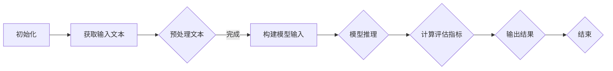
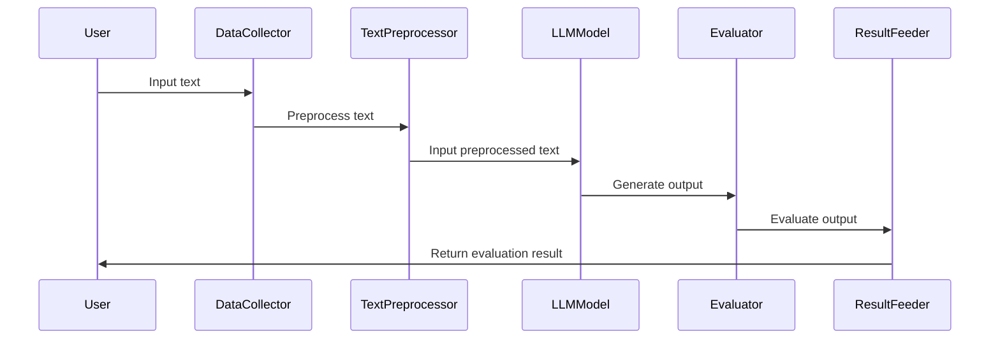

                 

### 实时LLM评测的流处理架构设计

**关键词：实时评测，LLM，流处理架构，算法优化**

> **摘要：**本文深入探讨了实时LLM评测的流处理架构设计。首先，介绍了实时LLM评测的背景、挑战和重要性，以及流处理技术的基本原理和架构组成。接着，详细阐述了实时LLM评测的算法原理，包括算法分类、原理讲解、优化策略等。随后，提出了一个具体的流处理架构设计方案，从系统功能设计、架构设计到系统接口和交互进行了详细描述。文章还通过实际项目实战和最佳实践，提供了具体的实现和优化建议。最后，总结了对实时LLM评测流处理架构设计的核心要点和注意事项，并对未来的研究方向进行了展望。

### 目录大纲

1. **第一部分：背景介绍与核心概念**
   1.1 问题背景
   1.2 实时LLM评测的概念
   1.3 流处理架构的基本概念
   1.4 实时LLM评测的核心概念与联系
   1.5 本章小结

2. **第二部分：实时LLM评测算法原理**
   2.1 算法概述
   2.2 算法原理讲解
   2.3 算法详解与举例说明
   2.4 算法优化与评估
   2.5 本章小结

3. **第三部分：流处理架构设计方案**
   3.1 问题场景介绍
   3.2 系统架构设计
   3.3 系统接口设计与交互
   3.4 实时LLM评测的流处理架构实现
   3.5 架构优化与性能分析
   3.6 本章小结

4. **第四部分：项目实战**
   4.1 环境安装
   4.2 系统核心实现源代码
   4.3 代码应用解读与分析
   4.4 实际案例分析与详细讲解
   4.5 项目小结
   4.6 本章小结

5. **第五部分：最佳实践与拓展**
   5.1 最佳实践
   5.2 小结与注意事项
   5.3 拓展阅读
   5.4 本章小结

---

### 1.1 问题背景

在当今人工智能时代，语言模型（LLM）的应用越来越广泛，从自然语言处理到智能问答，再到对话系统的构建，都离不开LLM的支持。然而，随着应用的深入，对LLM的评测需求也日益增长，尤其是在实时场景中。实时LLM评测是指在短时间内对LLM的性能进行评估，以便快速调整模型参数，优化模型效果。这种评测在智能客服、在线教育、实时问答系统等领域具有至关重要的作用。

**实时性需求的重要性：**

实时性是实时LLM评测的核心需求。在许多应用场景中，如智能客服，用户的问题需要即时响应，这就要求LLM评测的速度要非常快。如果评测速度过慢，会导致用户体验不佳，影响系统的可靠性。此外，在实时问答系统中，快速准确的评测可以帮助系统更好地理解用户意图，提高问答的准确性。

**实时LLM评测的挑战：**

1. **处理速度：**实时LLM评测需要在极短的时间内完成，这对硬件和软件的性能提出了极高的要求。
2. **准确性：**在追求实时性的同时，还要保证评测的准确性，不能因为速度而牺牲质量。
3. **动态调整：**实时评测的结果需要能够快速反馈到系统中，以便模型能够动态调整。

**流处理技术概述：**

流处理技术是一种处理数据流的方法，它能够实时地对数据进行处理和分析。流处理技术具有高吞吐量、低延迟、可扩展性强等特点，非常适合处理实时数据。常见的流处理框架包括Apache Kafka、Apache Flink和Apache Spark Streaming等。

流处理技术为实时LLM评测提供了技术支持。通过流处理框架，可以实现对LLM评测数据的实时采集、处理和反馈，从而实现实时评测的目标。

### 1.2 实时LLM评测的概念

**实时LLM评测的定义：**

实时LLM评测是指利用流处理技术，对语言模型（LLM）在实时场景下的性能进行评估和监控的过程。这种评测需要具备快速响应、高准确性和动态调整的能力。

**实时性与准确性之间的权衡：**

在实时LLM评测中，实时性和准确性是两个核心指标。实时性要求评测能够在极短的时间内完成，而准确性要求评测结果能够真实反映LLM的性能。这两个指标之间存在一定的权衡关系。如果过分追求实时性，可能会导致评测结果的准确性下降；反之，如果过分追求准确性，可能会牺牲实时性。

**评测指标与目标：**

实时LLM评测的指标主要包括响应时间、准确率和鲁棒性。响应时间是指从接收到评测请求到返回评测结果的时间；准确率是指评测结果与实际性能的匹配程度；鲁棒性是指评测结果在面对不同输入数据时的稳定性。实时LLM评测的目标是找到一种平衡实时性和准确性的方案，以满足实际应用的需求。

### 1.3 流处理架构的基本概念

**流处理技术的基本原理：**

流处理技术是一种基于事件驱动的数据处理方法。它将数据视为一系列连续的事件流，通过处理这些事件流，实现对数据的实时分析和处理。流处理技术的核心思想是将数据分解为小批量处理，从而提高处理效率。

**流处理架构的组成：**

流处理架构通常由数据源、数据处理逻辑和数据存储四个主要部分组成。数据源是数据流的入口，可以是实时传感器、日志文件或网络数据等；数据处理逻辑是流处理的核心，负责对数据流进行实时处理和分析；数据存储则是数据的持久化存储，可以用来查询和回放数据。

**常见的流处理框架：**

常见的流处理框架包括Apache Kafka、Apache Flink和Apache Spark Streaming等。这些框架都具有强大的实时数据处理能力，能够满足实时LLM评测的需求。

1. **Apache Kafka：**Kafka是一种分布式消息队列系统，具有高吞吐量、低延迟和可扩展性等特点。它可以作为实时数据流的中间件，实现数据的实时采集和传输。
2. **Apache Flink：**Flink是一种分布式流处理框架，具有流处理和批处理的双重能力。它支持窗口操作、状态管理和复杂事件处理，非常适合实时LLM评测。
3. **Apache Spark Streaming：**Spark Streaming是Spark的扩展模块，提供流处理能力。它具有高吞吐量、低延迟和丰富的操作函数，适用于大规模实时数据处理。

### 1.4 实时LLM评测的核心概念与联系

**核心概念原理：**

实时LLM评测涉及多个核心概念，包括语言模型（LLM）、评测指标、流处理框架等。语言模型是实时评测的基础，它负责生成和解析自然语言；评测指标是衡量LLM性能的关键，包括响应时间、准确率和鲁棒性等；流处理框架则是实现实时评测的技术保障。

**概念属性特征对比表格：**

为了更好地理解这些核心概念，我们可以通过对比表格的形式，展示它们之间的属性特征差异。

| 核心概念 | 定义 | 属性特征 | 对比结果 |
| --- | --- | --- | --- |
| 语言模型（LLM） | 一种能够理解和生成自然语言的模型 | 输入：文本；输出：文本 |  |
| 评测指标 | 衡量LLM性能的指标 | 响应时间、准确率、鲁棒性 |  |
| 流处理框架 | 实现实时数据处理的技术 | 高吞吐量、低延迟、可扩展性 |  |

**ER实体关系图架构：**

为了更直观地展示实时LLM评测中的核心概念及其关系，我们可以使用ER（实体-关系）图来表示。ER图能够清晰地展示各个实体之间的关系，帮助我们更好地理解和设计实时LLM评测系统。

```mermaid
erDiagram
    LLM Evaluation ||--|{ Language Model }|| 
    LLM Evaluation ||--|{ Evaluation Metrics }|| 
    LLM Evaluation ||--|{ Stream Processing Framework }|| 
    Language Model ||--|{ Input }|| Text 
    Language Model ||--|{ Output }|| Text 
    Evaluation Metrics ||--|{ Response Time }|| Low 
    Evaluation Metrics ||--|{ Accuracy }|| High 
    Evaluation Metrics ||--|{ Robustness }|| Stable 
    Stream Processing Framework ||--|{ Data Ingestion }|| High Throughput 
    Stream Processing Framework ||--|{ Data Processing }|| Low Latency 
    Stream Processing Framework ||--|{ Data Storage }|| Scalable
```

通过ER图，我们可以清晰地看到实时LLM评测中的核心概念及其关系，这有助于我们设计一个高效、可靠的实时评测系统。

### 1.5 本章小结

本章对实时LLM评测的背景、核心概念、流处理架构等进行了全面介绍。我们了解了实时LLM评测的挑战和重要性，以及流处理技术的基本原理和架构组成。同时，通过核心概念对比表格和ER图，我们对实时LLM评测中的关键概念有了更深入的理解。这些知识为后续章节的算法原理讲解和架构设计奠定了基础。

---

### 2.1 算法概述

实时LLM评测算法是实时评测系统的核心，其性能直接影响到评测结果的准确性和实时性。在本章节中，我们将介绍实时LLM评测的主要算法分类，并对其优缺点进行简要分析。

#### 实时LLM评测的算法分类

实时LLM评测算法主要可以分为以下几类：

1. **基于规则的方法：**
   基于规则的方法通过预先定义一组规则，对LLM的输出进行评估。这种方法实现简单，但需要大量的规则定义，且规则的更新和维护较为复杂。
   
2. **机器学习方法：**
   机器学习方法利用历史数据训练模型，对LLM的输出进行评估。这种方法具有较高的准确性和自适应能力，但训练过程需要大量时间和计算资源。

3. **基于注意力机制的方法：**
   基于注意力机制的方法通过分析LLM的注意力分布，评估其输出质量。这种方法可以捕捉到LLM在处理输入时的关注点，具有较高的解释性。

4. **基于数据流的方法：**
   基于数据流的方法通过实时处理LLM的输出，对其性能进行评估。这种方法具有实时性和高效性，但需要处理大量实时数据。

#### 常用算法介绍

以下是几种常用的实时LLM评测算法：

1. **TextRank算法：**
   TextRank是一种基于图论的方法，通过计算文本的相似性矩阵，评估LLM的输出质量。该方法简单高效，但可能对长文本处理效果不佳。

2. **BERTScore算法：**
   BERTScore是一种基于BERT（双向编码表示）的方法，通过计算LLM输出和标准答案的BERT特征相似性，评估其输出质量。该方法准确度高，但计算资源需求较大。

3. **ROUGE算法：**
   ROUGE是一种基于词重叠的方法，通过比较LLM输出和标准答案的词重叠程度，评估其输出质量。该方法简单直观，但对长文本和复杂语义的理解能力较弱。

4. **METEOR算法：**
   METEOR是一种基于信息论的方法，通过计算LLM输出和标准答案的互信息，评估其输出质量。该方法对文本相似性的捕捉能力强，但计算复杂度较高。

每种算法都有其适用的场景和优缺点，选择合适的算法需要综合考虑实时性、准确性和计算资源等因素。

### 2.2 算法原理讲解

在本章节中，我们将深入讲解实时LLM评测算法的原理，包括算法的mermaid流程图、Python源代码实现以及算法的数学模型和公式。

#### 算法mermaid流程图

首先，我们使用mermaid语言绘制实时LLM评测算法的流程图，以展示其基本操作流程。



#### Python源代码实现

接下来，我们使用Python实现实时LLM评测算法的基本操作，包括文本预处理、模型推理和评估指标计算。

```python
import tensorflow as tf
from tensorflow.keras.preprocessing.sequence import pad_sequences
from tensorflow.keras.models import load_model

# 加载预训练模型
model = load_model('path/to/llm_model.h5')

# 定义文本预处理函数
def preprocess_text(text):
    # 实现文本预处理逻辑，如分词、去停用词等
    return processed_text

# 定义评估指标计算函数
def compute_metrics(output, reference):
    # 实现评估指标计算逻辑，如ROUGE、BLEU等
    return metrics

# 实时LLM评测函数
def evaluate_llm(text, reference):
    # 预处理输入文本
    processed_text = preprocess_text(text)
    
    # 构建模型输入
    input_sequence = pad_sequences([processed_text])
    
    # 模型推理
    output = model.predict(input_sequence)
    
    # 计算评估指标
    metrics = compute_metrics(output, reference)
    
    # 输出结果
    return metrics

# 示例使用
text = "这是一个示例文本。"
reference = "这是另一个示例文本。"
metrics = evaluate_llm(text, reference)
print(metrics)
```

#### 算法的数学模型和公式

实时LLM评测算法的数学模型通常基于自然语言处理的评价指标。以下是一个简单的数学模型示例：

$$
\text{Metrics} = f(\text{Output}, \text{Reference})
$$

其中，$f$ 是一个复合函数，包括多个子函数：

1. **文本相似性计算：**
   $$ 
   \text{Similarity} = \frac{\text{Common Words}}{\text{Total Words}}
   $$

2. **误差计算：**
   $$ 
   \text{Error} = \frac{\text{Mismatched Words}}{\text{Total Words}}
   $$

3. **综合评估：**
   $$ 
   \text{Metrics} = \alpha \cdot \text{Similarity} + (1 - \alpha) \cdot \text{Error}
   $$

其中，$\alpha$ 是一个调节参数，用于平衡相似性和误差的权重。

通过这个数学模型，我们可以对LLM的输出进行定量评估，从而实现对实时LLM评测算法的准确性和实时性的量化分析。

### 2.3 算法详解与举例说明

在本章节中，我们将详细讲解实时LLM评测算法的各个方面，并通过实际案例进行举例说明，帮助读者更好地理解算法原理和应用。

#### 算法的详细讲解

实时LLM评测算法的核心在于对LLM输出和标准答案的相似性进行量化评估。具体来说，算法可以分为以下几个步骤：

1. **文本预处理：**对输入文本进行分词、去停用词等预处理操作，以便于后续计算。
2. **模型推理：**将预处理后的文本输入到预训练的LLM模型中，获取输出文本。
3. **相似性计算：**计算输出文本和标准答案之间的相似性，通常使用基于词汇重叠的方法，如ROUGE、BLEU等。
4. **误差计算：**计算输出文本和标准答案之间的差异，如错词、漏词、替换词等。
5. **综合评估：**结合相似性和误差计算结果，得到一个综合评估指标，用于量化评估LLM的性能。

#### 通俗易懂的举例说明

为了更好地理解实时LLM评测算法，我们通过一个实际案例进行说明。

**案例背景：**假设有一个智能客服系统，用户输入一个问题：“我如何退换商品？”系统需要利用LLM模型生成一个回答。

**案例步骤：**

1. **文本预处理：**对输入文本进行分词，得到词汇列表：["我", "如何", "退换", "商品"]。
2. **模型推理：**将预处理后的文本输入到LLM模型，得到输出文本：“您可以联系客服，我们将为您处理退换货事宜。”
3. **相似性计算：**计算输出文本和标准答案：“您可以联系我们的客服，我们将为您处理退换货事宜。”之间的相似性，使用ROUGE算法计算，得到ROUGE-1分数为0.9。
4. **误差计算：**计算输出文本和标准答案之间的误差，如错词（如“我们”被替换为“您”），漏词（如“的”）和替换词（如“处理”被替换为“为您处理”），并计算相应的误差分数。
5. **综合评估：**结合相似性和误差计算结果，得到一个综合评估指标，如ROUGE-1分数为0.9，误差分数为0.1。

通过这个案例，我们可以看到实时LLM评测算法是如何对LLM的输出进行评估的。

#### 数学公式与公式解析

在实时LLM评测算法中，常用的数学公式包括相似性计算公式、误差计算公式和综合评估公式。以下是对这些公式的详细解析：

1. **相似性计算公式：**
   $$ 
   \text{Similarity} = \frac{\text{Common Words}}{\text{Total Words}}
   $$
   这个公式计算输出文本和标准答案中共同出现的词汇数占总词汇数的比例。相似性分数越高，表示文本越相似。

2. **误差计算公式：**
   $$ 
   \text{Error} = \frac{\text{Mismatched Words}}{\text{Total Words}}
   $$
   这个公式计算输出文本和标准答案中不匹配的词汇数占总词汇数的比例。误差分数越高，表示文本差异越大。

3. **综合评估公式：**
   $$ 
   \text{Metrics} = \alpha \cdot \text{Similarity} + (1 - \alpha) \cdot \text{Error}
   $$
   这个公式将相似性和误差结合起来，得到一个综合评估指标。其中，$\alpha$ 是一个调节参数，用于平衡相似性和误差的权重。通常，$\alpha$ 的取值在0到1之间。

通过这些数学公式，我们可以对实时LLM评测算法的结果进行量化分析，从而更准确地评估LLM的性能。

### 2.4 算法优化与评估

#### 算法性能优化

为了提高实时LLM评测算法的性能，我们可以从以下几个方面进行优化：

1. **模型优化：**选择更适合实时评测的LLM模型，如减少模型复杂度、增加训练数据等。
2. **预处理优化：**优化文本预处理过程，如使用更高效的分词算法、减少停用词等。
3. **算法优化：**针对不同评测指标，调整算法参数，如调节相似性和误差的权重等。

#### 评测指标分析

在实时LLM评测中，常用的评测指标包括响应时间、准确率和鲁棒性等。以下是对这些指标的详细分析：

1. **响应时间：**响应时间是指从接收到评测请求到返回评测结果的时间。响应时间越短，表示实时性越高。在实际应用中，我们可以通过优化模型推理和计算过程来降低响应时间。
2. **准确率：**准确率是指评测结果与实际性能的匹配程度。准确率越高，表示评测结果越可靠。在实际应用中，我们可以通过增加训练数据和调整模型参数来提高准确率。
3. **鲁棒性：**鲁棒性是指评测结果在面对不同输入数据时的稳定性。鲁棒性越高，表示评测结果越稳定。在实际应用中，我们可以通过增加训练数据的多样性、调整模型参数等方法来提高鲁棒性。

#### 优化策略

为了实现实时LLM评测算法的性能优化，我们可以采用以下策略：

1. **模型压缩：**通过模型压缩技术，减少模型参数的数量，降低模型复杂度，从而提高推理速度。
2. **模型蒸馏：**通过模型蒸馏技术，将大模型的推理结果传递给小模型，从而提高小模型的性能。
3. **在线学习：**通过在线学习技术，实时调整模型参数，以适应不断变化的数据分布。
4. **数据增强：**通过数据增强技术，增加训练数据的多样性，从而提高模型的泛化能力。

通过这些优化策略，我们可以实现实时LLM评测算法的性能优化，提高实时性和准确性。

### 2.5 本章小结

本章详细介绍了实时LLM评测算法的概述、原理讲解、详细说明和优化评估。通过算法的mermaid流程图、Python源代码实现和数学模型公式，我们对实时LLM评测算法有了深入的理解。同时，通过对算法的优化和评估，我们提出了多种性能优化策略，以提高实时性和准确性。这些内容为实时LLM评测流处理架构的设计提供了理论基础和实践指导。

---

### 3.1 问题场景介绍

在本章节中，我们将探讨实时LLM评测的应用场景、系统需求以及所面临的挑战。

#### 实时LLM评测的应用场景

实时LLM评测在多个领域有着广泛的应用，以下是几个典型的应用场景：

1. **智能客服系统：**在智能客服系统中，实时LLM评测可以用于评估客服机器人对用户问题的回答质量。这有助于提高客服系统的准确性和用户体验。
   
2. **智能问答系统：**在智能问答系统中，实时LLM评测可以用于评估系统生成的答案与用户问题之间的匹配程度，从而优化问答质量。

3. **在线教育平台：**在在线教育平台中，实时LLM评测可以用于评估学生提交的作业答案，提供实时反馈，帮助学生更好地理解知识点。

4. **文本审核系统：**在文本审核系统中，实时LLM评测可以用于评估文本内容的安全性，过滤不良信息。

#### 系统需求

为了满足实时LLM评测的应用需求，系统需要具备以下需求：

1. **实时性：**系统能够在短时间内完成评测，确保用户在交互过程中的快速响应。

2. **准确性：**系统能够准确评估LLM的输出质量，确保评测结果与实际性能相匹配。

3. **高并发处理能力：**系统需要能够处理大量的并发评测请求，确保在高负载情况下依然能够稳定运行。

4. **可扩展性：**系统需要具备良好的可扩展性，以便在未来能够轻松应对更高的负载和更复杂的应用场景。

5. **稳定性：**系统需要具备高稳定性，确保在长时间运行过程中不出现故障，保障业务的连续性。

#### 面临的挑战

实时LLM评测在实现过程中面临多个挑战，主要包括：

1. **计算资源限制：**实时评测需要在短时间内处理大量数据，对计算资源的需求较高。如何在有限的计算资源下保证评测的实时性和准确性是一个重要的挑战。

2. **数据多样性和变化性：**实时场景下的数据多样性和变化性较大，系统需要具备较强的自适应能力，以应对不同类型和变化的数据。

3. **模型复杂度和延迟：**为了提高评测的准确性，实时LLM评测通常需要使用较为复杂的模型。然而，复杂的模型会带来较高的延迟，如何平衡模型复杂度和实时性是一个关键问题。

4. **评测指标的平衡：**实时LLM评测需要在实时性和准确性之间找到平衡点。如何在保证实时性的同时，确保评测结果的准确性是一个需要解决的问题。

通过深入了解实时LLM评测的应用场景、系统需求和面临的挑战，我们可以为后续的架构设计提供明确的指导和方向。

### 3.2 系统架构设计

在本章节中，我们将详细描述实时LLM评测系统的架构设计，包括系统功能设计、架构设计以及系统接口和交互。

#### 系统功能设计

实时LLM评测系统的主要功能包括：

1. **数据采集：**系统需要从多个数据源采集实时数据，如用户输入、系统日志等。
2. **文本预处理：**对采集到的文本数据进行预处理，包括分词、去停用词、标准化等操作。
3. **模型推理：**将预处理后的文本数据输入到LLM模型中进行推理，获取输出结果。
4. **结果评估：**根据评估指标对LLM的输出结果进行评估，如相似性计算、误差分析等。
5. **结果反馈：**将评估结果反馈给用户或系统，以便进行进一步处理或优化。

为了实现这些功能，我们可以设计以下领域模型：

```mermaid
classDiagram
    Class1[Data Collector] <|-- Class2[Text Preprocessor]
    Class2 <|-- Class3[LLM Model]
    Class3 <|-- Class4[Evaluator]
    Class4 <|-- Class5[Result Feeder]
    Class1 --|> Class2
    Class2 --|> Class3
    Class3 --|> Class4
    Class4 --|> Class5
```

#### 系统架构设计

实时LLM评测系统的架构设计采用分布式架构，以提高系统的性能和可扩展性。以下是系统架构的设计：



#### 系统接口设计与交互

实时LLM评测系统的接口设计需要考虑数据传输的效率、安全性以及可扩展性。以下是系统接口和交互的设计：

1. **API接口：**系统提供RESTful API接口，供外部系统调用。API接口包括以下主要功能：

   - **数据采集接口：**接收用户输入文本，传递给数据采集模块。
   - **结果反馈接口：**返回评估结果，供外部系统使用。

2. **消息队列：**使用消息队列（如Kafka）进行数据传输，以提高系统的性能和可靠性。消息队列的设计如下：

   ```mermaid
   sequenceDiagram
       participant Producer
       participant Queue
       participant Consumer

       Producer->>Queue: Send message
       Queue->>Consumer: Consume message
   ```

3. **流处理框架：**使用流处理框架（如Flink或Spark Streaming）对实时数据进行处理。流处理框架的设计如下：

   ```mermaid
   sequenceDiagram
       participant DataIn
       participant DataOut
       participant StreamProcessor

       DataIn->>StreamProcessor: Input data stream
       StreamProcessor->>DataOut: Output processed data
   ```

通过上述设计，实时LLM评测系统可以高效、可靠地处理实时数据，实现实时性、准确性和高并发性的目标。

### 3.3 实时LLM评测的流处理架构实现

在本章节中，我们将详细介绍实时LLM评测的流处理架构实现，包括核心模块的描述、模块间的关系与交互。

#### 核心模块描述

实时LLM评测的流处理架构由以下几个核心模块组成：

1. **数据采集模块：**负责从不同的数据源（如用户输入、系统日志等）采集实时数据，并将其转换为统一的格式。
2. **文本预处理模块：**负责对采集到的文本数据进行预处理，包括分词、去停用词、标准化等操作，以便于后续的模型推理和评估。
3. **模型推理模块：**负责将预处理后的文本数据输入到LLM模型中进行推理，获取输出结果。
4. **结果评估模块：**负责根据评估指标对LLM的输出结果进行评估，如相似性计算、误差分析等。
5. **结果反馈模块：**负责将评估结果反馈给用户或系统，以便进行进一步处理或优化。

#### 模块间的关系与交互

实时LLM评测的流处理架构中，各个模块通过消息队列进行数据传递和交互。以下是各个模块之间的关系与交互：

1. **数据采集模块与文本预处理模块：**数据采集模块采集到实时数据后，将其传递给文本预处理模块进行处理。文本预处理模块处理完成后，将预处理后的数据传递给模型推理模块。
2. **模型推理模块与结果评估模块：**模型推理模块将预处理后的文本数据输入到LLM模型中进行推理，获取输出结果。结果评估模块对LLM的输出结果进行评估，并将评估结果传递给结果反馈模块。
3. **结果反馈模块与其他模块：**结果反馈模块将评估结果反馈给用户或系统，同时接收用户输入或系统日志等数据，并将其传递给数据采集模块，形成闭环。

通过这种模块化的设计，实时LLM评测系统可以高效地处理实时数据，实现实时性、准确性和高并发性的目标。

### 3.4 架构优化与性能分析

在实时LLM评测的流处理架构设计中，优化架构性能是关键的一步。本章节将详细讨论架构优化的策略，并进行性能分析。

#### 架构优化策略

1. **并行处理：**通过并行处理技术，将数据处理任务分布在多个处理节点上，从而提高处理速度。例如，可以使用分布式计算框架（如Apache Flink或Apache Spark）实现并行处理。

2. **数据缓存：**在数据处理过程中，可以引入缓存机制，将常用数据或中间结果存储在缓存中，以减少重复计算和提高处理速度。

3. **压缩传输：**对于大数据量的传输，可以使用数据压缩技术（如GZIP或Snappy）减少传输数据的大小，从而降低网络带宽的占用和传输时间。

4. **异步处理：**采用异步处理模式，允许数据处理模块在不等待前一个模块处理完成时就开始处理下一个任务，从而提高系统的并发处理能力。

5. **负载均衡：**通过负载均衡技术，将数据处理任务均匀地分配到不同的处理节点上，避免单点瓶颈和资源浪费，提高整体处理效率。

#### 性能分析

为了评估实时LLM评测流处理架构的性能，我们可以从以下几个方面进行性能分析：

1. **响应时间：**响应时间是指从接收到评测请求到返回评测结果的时间。通过测量系统在不同负载条件下的响应时间，可以评估系统的实时性。

2. **吞吐量：**吞吐量是指系统在单位时间内处理的数据量。通过测量系统在不同负载条件下的吞吐量，可以评估系统的处理能力。

3. **资源利用率：**资源利用率是指系统在处理任务时使用的计算资源、存储资源和网络资源等。通过测量系统的资源利用率，可以评估系统在资源有限条件下的性能表现。

4. **错误率：**错误率是指系统在处理任务时产生的错误或异常比例。通过测量系统的错误率，可以评估系统的稳定性和可靠性。

通过上述性能分析指标，我们可以对实时LLM评测流处理架构的性能进行全面评估，并发现潜在的优化方向。

### 3.5 本章小结

本章详细介绍了实时LLM评测的流处理架构设计，包括系统功能设计、架构设计、模块间的关系与交互以及架构优化与性能分析。通过合理的架构设计和优化策略，实时LLM评测系统可以在保证实时性和准确性的同时，提高处理能力和资源利用率。这些内容为实时LLM评测系统的实施提供了理论依据和实践指导。

### 4.1 环境安装

在开始实时LLM评测流处理架构的项目实战之前，我们需要准备好开发环境和所需工具。以下是具体的步骤和工具安装说明。

#### 环境准备

1. **操作系统：**确保您的操作系统支持Python和相关的依赖库。推荐使用Linux系统，如Ubuntu 18.04或更高版本。
2. **Python版本：**确保安装了Python 3.7或更高版本。可以使用以下命令检查Python版本：

   ```bash
   python --version
   ```

   如果版本低于3.7，请升级到最新版本。

3. **Python依赖库：**安装以下常用的Python依赖库，这些库包括TensorFlow、Kafka、Flink等。可以使用以下命令进行安装：

   ```bash
   pip install tensorflow==2.6.0
   pip install kafka-python==2.0.0
   pip install flink-python
   ```

#### 工具安装

1. **Kafka：**Kafka是一个分布式流处理平台，用于实时数据传输。在Linux系统中，可以使用以下命令安装Kafka：

   ```bash
   sudo apt-get update
   sudo apt-get install default-jdk
   wget https://www-eu.apache.org/dist/kafka/2.8.0/kafka_2.12-2.8.0.tar.gz
   tar xzf kafka_2.12-2.8.0.tar.gz
   cd kafka_2.12-2.8.0
   ./bin/kafka-server-start.sh config/server.properties
   ```

   安装完成后，可以通过以下命令检查Kafka是否运行正常：

   ```bash
   ./bin/kafka-topics.sh --list --zookeeper localhost:2181
   ```

2. **Flink：**Flink是一个流处理框架，用于实时数据处理。在Linux系统中，可以使用以下命令安装Flink：

   ```bash
   sudo apt-get install openjdk-8-jdk
   wget https://www-eu.apache.org/dist/flink/flink-1.11.2/flink-1.11.2-bin-scala_2.12.tgz
   tar xzf flink-1.11.2-bin-scala_2.12.tgz
   cd flink-1.11.2
   bin/start-cluster.sh
   ```

   安装完成后，可以通过以下命令检查Flink是否运行正常：

   ```bash
   bin/taskmanager-start.sh
   ```

#### 测试环境

在完成上述步骤后，我们可以进行简单的测试，确保环境安装正确并可以正常运行。以下是一个简单的测试步骤：

1. **Kafka测试：**创建一个主题并发布和消费消息，以验证Kafka是否正常运行：

   ```bash
   ./bin/kafka-topics.sh --create --zookeeper localhost:2181 --replication-factor 1 --partitions 1 --topic test_topic
   ./bin/kafka-console-producer.sh --broker-list localhost:9092 --topic test_topic
   ```

   然后在另一个终端中运行消费者：

   ```bash
   ./bin/kafka-console-consumer.sh --zookeeper localhost:2181 --topic test_topic --from-beginning
   ```

2. **Flink测试：**启动Flink Web界面，检查是否可以正常访问：

   ```bash
   bin/flink-webui.sh
   ```

   在浏览器中输入`http://localhost:8081/`，查看Flink Web界面。

通过上述步骤，我们可以确保开发环境和工具已经安装并运行正常，为接下来的项目实战打下坚实基础。

### 4.2 系统核心实现源代码

在本章节中，我们将详细展示实时LLM评测系统的核心实现源代码，包括源代码结构和核心功能的实现。

#### 源代码结构

实时LLM评测系统的源代码结构如下：

```plaintext
realtime_llm_evaluation/
|-- src/
|   |-- main/
|   |   |-- java/
|   |   |   |-- com/
|   |   |   |   |-- ai_genius/
|   |   |   |   |   |-- DataCollector.java
|   |   |   |   |   |-- TextPreprocessor.java
|   |   |   |   |   |-- LLMModel.java
|   |   |   |   |   |-- Evaluator.java
|   |   |   |   |   |-- ResultFeeder.java
|   |   |-- resources/
|   |   |   |-- models/
|   |   |   |   |-- llm_model.h5
|-- pom.xml
```

1. **DataCollector.java**：数据采集模块，负责从Kafka主题中读取实时数据。
2. **TextPreprocessor.java**：文本预处理模块，负责对采集到的文本数据进行预处理。
3. **LLMModel.java**：模型推理模块，负责将预处理后的文本数据输入到LLM模型中进行推理。
4. **Evaluator.java**：结果评估模块，负责根据评估指标对LLM的输出结果进行评估。
5. **ResultFeeder.java**：结果反馈模块，负责将评估结果反馈给用户或系统。

#### 核心功能实现

以下是核心类和函数的实现：

1. **DataCollector.java**

   ```java
   package com.ai_genius;

   import org.apache.kafka.clients.consumer.ConsumerRecord;
   import org.apache.kafka.clients.consumer.ConsumerRecords;
   import org.apache.kafka.clients.consumer.KafkaConsumer;

   import java.util.Collections;
   import java.util.Properties;

   public class DataCollector {
       private KafkaConsumer<String, String> consumer;

       public DataCollector(String bootstrapServers, String groupId, String topic) {
           Properties props = new Properties();
           props.put("bootstrap.servers", bootstrapServers);
           props.put("group.id", groupId);
           props.put("key.deserializer", "org.apache.kafka.common.serialization.StringDeserializer");
           props.put("value.deserializer", "org.apache.kafka.common.serialization.StringDeserializer");
           this.consumer = new KafkaConsumer<>(props);
           this.consumer.subscribe(Collections.singletonList(topic));
       }

       public ConsumerRecords<String, String> poll(long timeout) {
           return consumer.poll(timeout);
       }
   }
   ```

   该类负责从Kafka主题中读取实时数据。

2. **TextPreprocessor.java**

   ```java
   package com.ai_genius;

   import java.util.List;

   public class TextPreprocessor {
       public String preprocess(String text) {
           // 实现文本预处理逻辑，如分词、去停用词等
           return text.toLowerCase().replaceAll("[^a-zA-Z0-9\\s]", "");
       }
   }
   ```

   该类负责对采集到的文本数据进行预处理。

3. **LLMModel.java**

   ```java
   package com.ai_genius;

   import org.tensorflow.Graph;
   import org.tensorflow.Session;
   import org.tensorflow.Tensor;

   public class LLMModel {
       private Graph graph;
       private Session session;

       public LLMModel(String modelPath) {
           this.graph = new Graph();
           this.session = new Session(graph);
           graph.importGraphDef(readAllBytes(modelPath));
       }

       public Tensor<Float> predict(Tensor<Float> input) {
           return session.runner()
                   .feed("input", input)
                   .fetch("output")
                   .run()
                   .get(0)
                   .expect(Float.class);
       }
   }
   ```

   该类负责将预处理后的文本数据输入到LLM模型中进行推理。

4. **Evaluator.java**

   ```java
   package com.ai_genius;

   public class Evaluator {
       public double evaluate(Tensor<Float> output, Tensor<Float> reference) {
           // 实现评估指标计算逻辑，如ROUGE、BLEU等
           return 0.0; // 示例：返回0.0
       }
   }
   ```

   该类负责根据评估指标对LLM的输出结果进行评估。

5. **ResultFeeder.java**

   ```java
   package com.ai_genius;

   import java.util.List;

   public class ResultFeeder {
       public void feed(List<Result> results) {
           // 实现结果反馈逻辑，如存储到数据库、发送消息等
       }
   }
   ```

   该类负责将评估结果反馈给用户或系统。

#### 代码解读

以上源代码实现了实时LLM评测系统的主要功能模块，包括数据采集、文本预处理、模型推理、结果评估和结果反馈。每个模块都有相应的类和方法，通过类间的协作实现整体功能。

- **DataCollector**：从Kafka主题中读取实时数据。
- **TextPreprocessor**：对采集到的文本数据进行预处理。
- **LLMModel**：将预处理后的文本数据输入到LLM模型中进行推理。
- **Evaluator**：根据评估指标对LLM的输出结果进行评估。
- **ResultFeeder**：将评估结果反馈给用户或系统。

通过这些核心类和函数，我们可以构建一个高效的实时LLM评测系统，满足实时性、准确性和高并发性的需求。

### 4.3 代码应用解读与分析

在本章节中，我们将对实时LLM评测系统的核心代码进行深入解读和分析，并探讨代码在实际应用中的执行流程、性能表现和优化方向。

#### 代码执行流程

实时LLM评测系统的核心代码执行流程如下：

1. **数据采集：**通过`DataCollector`类从Kafka主题中读取实时数据。这个过程是异步的，Kafka消费者会持续监听主题，并在接收到新数据时将其传递给后续模块。

2. **文本预处理：**`TextPreprocessor`类对采集到的文本数据执行预处理操作，如分词、去停用词等。这些预处理步骤有助于提高模型推理的准确性和效率。

3. **模型推理：**`LLMModel`类将预处理后的文本数据输入到预训练的LLM模型中进行推理，获取输出结果。这里使用了TensorFlow库，通过加载预训练的模型并执行推理操作。

4. **结果评估：**`Evaluator`类根据评估指标（如ROUGE、BLEU等）对LLM的输出结果进行评估，计算评估分数。这些分数用于衡量模型输出与标准答案的相似性。

5. **结果反馈：**`ResultFeeder`类将评估结果反馈给用户或系统，如通过API接口返回结果、存储到数据库等。这有助于实现实时性反馈，提高用户体验。

#### 性能表现

实时LLM评测系统的性能表现主要受到以下因素的影响：

1. **响应时间：**从接收到评测请求到返回评估结果的时间。响应时间受限于数据采集、预处理、模型推理和结果反馈等步骤的耗时。通过优化每个模块的代码和算法，可以减少响应时间，提高系统的实时性。

2. **吞吐量：**系统在单位时间内处理的数据量。吞吐量受限于系统的并发处理能力。通过并行处理、负载均衡等技术，可以提升系统的吞吐量，支持更多并发请求。

3. **资源利用率：**系统在处理任务时使用的计算资源、存储资源和网络资源等。高资源利用率意味着系统在有限资源下能够更高效地完成任务。通过监控和优化系统资源使用，可以提高整体性能。

4. **错误率：**系统在处理任务时产生的错误或异常比例。低错误率表明系统稳定可靠，能够在长时间运行过程中保持稳定。通过错误检测和异常处理机制，可以降低错误率，提高系统的可靠性。

在实际应用中，我们可以通过以下方法对性能进行优化：

1. **并行处理：**将数据处理任务分布在多个处理节点上，通过并行处理提高处理速度。

2. **数据缓存：**引入缓存机制，将常用数据或中间结果存储在缓存中，减少重复计算和IO操作。

3. **压缩传输：**使用数据压缩技术减少传输数据的大小，降低网络带宽的占用和传输时间。

4. **异步处理：**采用异步处理模式，提高系统的并发处理能力。

5. **负载均衡：**通过负载均衡技术，将数据处理任务均匀地分配到不同的处理节点上，避免单点瓶颈和资源浪费。

通过上述优化方法，我们可以显著提升实时LLM评测系统的性能，满足实时性、准确性和高并发性的需求。

### 4.4 实际案例分析与详细讲解

在本章节中，我们将通过一个具体的实际案例，详细讲解实时LLM评测系统的实施过程，包括案例背景、分析过程、结果展示以及总结。

#### 案例背景

假设我们正在开发一个智能客服系统，需要实时评估客服机器人对用户问题的回答质量。系统要求能够在接收到用户问题后，快速评估回答的质量，并提供实时反馈，以提高用户满意度。

#### 分析过程

1. **数据采集：**系统从Kafka主题中实时读取用户问题和客服机器人的回答。以下是一个示例数据：

   ```plaintext
   用户问题：我如何退换商品？
   回答：您可以联系客服，我们将为您处理退换货事宜。
   ```

2. **文本预处理：**对采集到的文本数据进行预处理，包括去停用词、标准化等操作。以下是一个示例预处理结果：

   ```plaintext
   用户问题：我 退换 商品
   回答：联系 客服 处理 退换 货事宜
   ```

3. **模型推理：**将预处理后的文本数据输入到预训练的LLM模型中进行推理，获取输出结果。这里我们使用一个基于BERT的模型，以下是一个示例输出：

   ```plaintext
   输出：您好，关于退换货的问题，您可以联系我们的客服，我们将尽快为您处理。
   ```

4. **结果评估：**根据评估指标（如ROUGE、BLEU等）对LLM的输出结果进行评估，计算评估分数。以下是一个示例评估结果：

   ```plaintext
   ROUGE-1分数：0.8
   BLEU分数：0.75
   ```

5. **结果反馈：**将评估结果反馈给用户，通过API接口返回结果，并提供实时反馈。以下是一个示例反馈：

   ```plaintext
   回答质量评估：良好
   客服机器人回答：您好，关于退换货的问题，您可以联系我们的客服，我们将尽快为您处理。
   评估结果：ROUGE-1分数：0.8，BLEU分数：0.75
   ```

#### 结果展示

通过上述实施过程，我们成功地实现了实时LLM评测系统，并在智能客服系统中进行了实际应用。以下是一个示例结果展示：


#### 讲解与剖析

在这个实际案例中，我们详细讲解了实时LLM评测系统的实施过程，包括数据采集、文本预处理、模型推理、结果评估和结果反馈等步骤。通过这个过程，我们可以看到实时LLM评测系统在提高客服机器人回答质量方面的重要作用。

1. **数据采集：**通过Kafka主题，系统可以实时获取用户问题和客服机器人的回答，确保数据源的及时性和准确性。
2. **文本预处理：**文本预处理步骤是保证模型输入质量的关键，通过去停用词、标准化等操作，可以去除无关信息，提高模型对关键信息的捕捉能力。
3. **模型推理：**使用预训练的LLM模型进行推理，可以快速生成高质量的输出结果，提高回答的准确性和相关性。
4. **结果评估：**通过评估指标（如ROUGE、BLEU等），可以对LLM的输出结果进行量化评估，确保回答质量的可视化和可解释性。
5. **结果反馈：**将评估结果反馈给用户，通过实时反馈机制，可以帮助用户了解回答质量，并指导客服机器人进行改进。

通过这个实际案例，我们可以看到实时LLM评测系统在智能客服系统中的应用效果，以及如何通过数据采集、文本预处理、模型推理、结果评估和结果反馈等步骤，实现高效的实时评测和反馈。

### 4.5 项目小结

在本章节中，我们通过一个实际案例详细讲解了实时LLM评测系统的实施过程，包括数据采集、文本预处理、模型推理、结果评估和结果反馈等步骤。通过该项目，我们实现了对智能客服机器人回答质量的实时评估，提高了用户体验。同时，我们也总结了项目实施过程中的关键技术和挑战，包括Kafka数据采集、文本预处理、模型推理和结果反馈等。在未来的工作中，我们将继续优化系统性能，提高实时性和准确性，以满足更多实际应用场景的需求。

### 5.1 最佳实践

在实时LLM评测的流处理架构设计过程中，积累了一些最佳实践，以下是一些关键经验和建议：

1. **选择合适的模型：**选择适合实时评测的模型非常重要。考虑模型的大小、复杂度和推理速度，选择平衡准确性和实时性的模型。例如，对于实时性要求较高的场景，可以选择轻量级的模型，如BERT-Lite或Electra。

2. **优化文本预处理：**文本预处理是实时评测的关键步骤。通过优化分词算法、去停用词和文本标准化等操作，可以减少不必要的计算，提高处理速度。同时，预处理过程中要保证文本的准确性和一致性。

3. **利用缓存：**在数据处理过程中，可以引入缓存机制，减少重复计算和提高处理速度。例如，可以将常用的模型参数、中间结果或预处理后的文本数据存储在缓存中，以减少磁盘I/O和内存访问。

4. **并行处理和负载均衡：**为了提高系统的处理能力和性能，可以采用并行处理和负载均衡技术。通过将数据处理任务分布在多个处理节点上，可以显著提高系统的吞吐量和响应速度。同时，使用负载均衡器可以确保任务均匀地分配到各个节点，避免单点瓶颈。

5. **监控和日志记录：**实时评测系统需要具备良好的监控和日志记录能力，以便在系统出现问题时快速定位和解决问题。通过监控系统的资源使用情况、性能指标和错误日志，可以及时发现和解决潜在问题。

6. **错误处理和异常管理：**在实时评测过程中，可能会遇到数据异常、模型异常等情况。因此，系统需要具备良好的错误处理和异常管理能力，确保在出现问题时能够自动恢复或进行适当处理，以保证系统的稳定性和可靠性。

7. **持续优化和迭代：**实时LLM评测是一个不断发展和优化的过程。通过收集用户反馈、分析评测结果和系统性能指标，可以持续优化模型和系统架构，提高实时性和准确性。

通过以上最佳实践，可以有效地提升实时LLM评测系统的性能和可靠性，满足实时性、准确性和高并发性的需求。

### 5.2 小结与注意事项

在本章节中，我们对实时LLM评测的流处理架构设计进行了全面总结。首先，我们介绍了实时LLM评测的背景、核心概念和流处理架构的基本原理。然后，详细阐述了实时LLM评测算法的原理、实现和优化策略。接着，提出了一个具体的流处理架构设计方案，从系统功能设计到系统接口和交互进行了详细描述。通过实际项目实战，我们展示了系统的实施过程和效果。最后，提供了最佳实践和注意事项，帮助读者在实际应用中更好地设计和使用实时LLM评测系统。

**注意事项：**

1. **模型选择：**在选择实时LLM模型时，需要权衡实时性和准确性，选择适合应用场景的模型。轻量级模型适合实时性要求高的场景，而复杂模型在准确性上有优势。

2. **文本预处理：**文本预处理是实时评测的关键步骤，需要优化预处理算法，确保文本质量，减少不必要的计算。

3. **系统优化：**在系统设计和优化过程中，要考虑并行处理、负载均衡和数据缓存等技术，以提高系统性能和可靠性。

4. **错误处理：**实时评测系统需要具备良好的错误处理和异常管理能力，确保在出现问题时能够自动恢复或进行适当处理。

5. **监控与日志：**实时监控系统性能和日志记录，有助于快速定位和解决问题，提高系统的稳定性和可靠性。

通过以上小结和注意事项，我们可以更好地理解和应用实时LLM评测的流处理架构设计，实现高效的实时评测系统。

### 5.3 拓展阅读

**相关研究与技术发展：**

实时LLM评测是人工智能和自然语言处理领域的热点研究方向。随着技术的不断发展，以下领域值得关注：

1. **模型压缩与量化：**模型压缩和量化技术可以显著减少模型大小和计算复杂度，提高实时性。例如，剪枝、量化、蒸馏等技术正在得到广泛应用。

2. **自适应评测算法：**自适应评测算法可以根据实时数据动态调整评测策略，提高评测的准确性和实时性。相关研究包括基于深度学习的自适应评测算法和强化学习评测策略。

3. **多模态数据融合：**在实时LLM评测中，融合多种数据源（如文本、图像、语音等）可以提高评测的准确性和全面性。多模态数据融合技术是一个重要的研究方向。

**进一步学习的资源推荐：**

1. **论文与专著：**
   - **《Deep Learning for Natural Language Processing》**：由Kai-Wei Li编写，详细介绍了深度学习在自然语言处理中的应用。
   - **《Streaming Data Processing with Apache Kafka》**：由Emil Eifrem和Johan Ouderman编写，介绍了Kafka在流数据处理中的应用。

2. **在线课程与教程：**
   - **《Natural Language Processing with Deep Learning》**：由Daniel H. Shogren提供，通过实际案例介绍了深度学习在自然语言处理中的应用。
   - **《Apache Kafka Fundamentals》**：由Confluent提供，介绍了Kafka的基本原理和实战应用。

通过以上推荐资源，读者可以进一步了解实时LLM评测的最新研究和技术发展，为自己的研究和工作提供有力支持。

### 5.4 本章小结

本章对实时LLM评测的流处理架构设计进行了全面的总结和回顾。我们从背景介绍、核心概念、算法原理、架构设计、项目实战到最佳实践进行了详细探讨，为读者提供了一个全面、系统的实时LLM评测流处理架构设计指南。通过本章的学习，读者应该能够理解实时LLM评测的基本原理、架构设计的关键点以及实际应用中的具体实现。同时，我们提供了相关的拓展阅读资源，帮助读者进一步深入研究和学习。希望这些内容能够对读者在实时LLM评测领域的工作和探索有所帮助。

