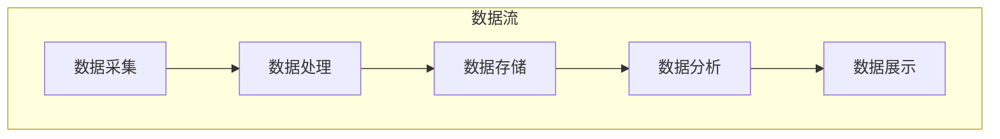
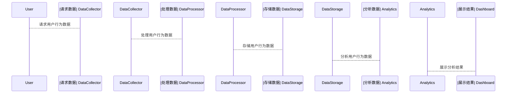
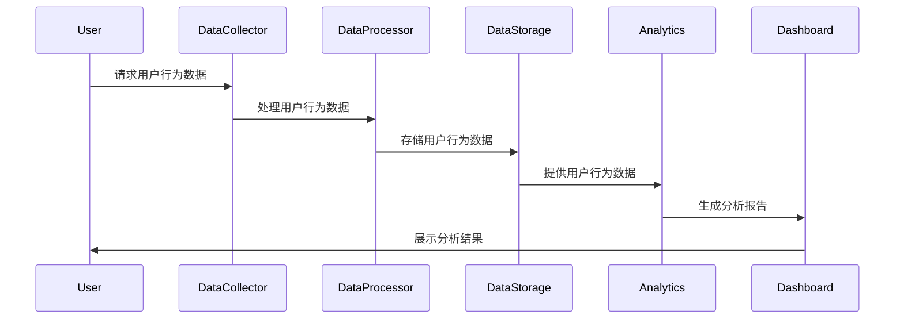

                 

# 实时分析：从LLM应用数据中获取即时洞察

## 关键词
- 实时分析
- LLM（大型语言模型）
- 数据处理
- 应用案例
- 架构设计

## 摘要
本文将深入探讨实时分析在现代信息技术中的应用，尤其是通过大型语言模型（LLM）来处理和应用数据的能力。我们将从定义和背景介绍开始，逐步分析实时分析的关键特点、应用领域，以及LLM的作用和挑战。接着，我们将讨论实时分析的系统架构设计、数据处理算法，并通过一个实际案例展示LLM在实时分析中的具体应用。最后，我们将总结面临的挑战和未来的发展趋势，为读者提供实用的建议和方向。

## 第一部分：实时分析背景与重要性

### 第1章：实时分析概述

#### 1.1.1 什么是实时分析
实时分析是一种数据处理技术，旨在提供即时洞察，以便快速做出决策。它通过处理实时数据流，快速生成分析和报告，支持动态决策过程。

#### 1.1.2 实时分析的应用领域
实时分析在多个领域都有着重要的应用，包括：
- 金融行业：监控交易行为，及时发现异常交易。
- 物流与供应链：跟踪货物运输，优化供应链流程。
- 健康医疗：实时监控患者数据，及时响应医疗事件。
- 社交网络：分析用户行为，提供个性化推荐。
- 智能制造：实时监控生产过程，提高生产效率。

#### 1.1.3 实时分析的重要性
实时分析的重要性体现在以下几个方面：
- 提高业务决策效率：实时获取数据，快速分析，支持快速决策。
- 优化运营流程：通过实时监控和调整，优化业务流程。
- 改善用户体验：提供个性化的服务和推荐，提升用户满意度。

### 第2章：LLM与应用数据

#### 2.1.1 什么是LLM
LLM是指大型语言模型，是一种基于深度学习的自然语言处理模型，具有强大的文本生成、理解和推理能力。

#### 2.1.2 LLM与实时分析
LLM在实时分析中扮演着重要角色，能够：
- 处理大量文本数据，快速生成报告。
- 提供自然语言交互，方便用户理解分析结果。
- 通过文本挖掘，发现潜在的模式和趋势。

#### 2.1.3 应用数据的获取与处理
实时分析需要高效地获取和处理应用数据，包括：
- 数据来源：例如传感器、API接口、数据库等。
- 数据处理：清洗、整合、转换和存储数据。
- 数据质量管理：确保数据的准确性、完整性和一致性。

### 第3章：实时分析的架构设计

#### 3.1.1 系统架构概述
实时分析系统通常由以下几个部分组成：
- 数据采集层：从各种数据源收集数据。
- 数据处理层：对数据进行清洗、转换和存储。
- 分析与决策层：使用算法和模型对数据进行分析，生成洞察。
- 用户界面层：将分析结果展示给用户。

#### 3.1.2 数据流设计
实时分析的数据流设计需要考虑：
- 数据流的架构设计原则：例如高可用性、可扩展性、弹性等。
- 数据流处理流程：数据从采集到分析的完整流程。

#### 3.1.3 LLM集成与优化
LLM在实时分析系统中的集成和优化包括：
- 集成策略：如何在系统架构中集成LLM。
- 优化方法：如何提高LLM的性能和效率。

### 第4章：实时数据分析算法

#### 4.1.1 数据预处理
数据预处理包括：
- 数据清洗：去除噪声和异常值。
- 数据整合：合并多个数据源。

#### 4.1.2 特征工程
特征工程包括：
- 特征提取：从数据中提取有用的特征。
- 特征选择：选择最重要的特征。

#### 4.1.3 实时数据分析算法
常用的实时数据分析算法包括：
- 统计分析：例如时间序列分析、回归分析。
- 机器学习：例如分类、聚类、关联规则学习。

### 第5章：LLM应用案例分析

#### 5.1.1 案例背景介绍
- 案例企业背景
- 案例业务需求

#### 5.1.2 案例分析流程
- 数据获取与处理
- LLM模型选择与优化
- 实时分析应用

#### 5.1.3 案例结果分析
- 实时分析效果评估
- 业务价值体现

### 第6章：实时分析的挑战与未来趋势

#### 6.1.1 挑战与问题
实时分析的挑战包括：
- 数据质量：确保数据的准确性和完整性。
- 性能优化：提高系统的响应速度和处理能力。
- 模型更新与维护：保持模型的准确性和时效性。

#### 6.1.2 未来趋势
未来趋势包括：
- 人工智能与实时分析的结合
- 大数据处理技术的新进展
- 实时分析在企业中的应用前景

### 第7章：总结与展望

#### 7.1.1 书籍总结
本文总结了实时分析的背景、重要性、技术架构、算法、案例和未来趋势。

#### 7.1.2 展望未来
实时分析将继续在各个行业中发挥重要作用，随着人工智能和数据技术的不断进步，其应用范围和深度将不断扩展。

## 作者
作者：AI天才研究院/AI Genius Institute & 禅与计算机程序设计艺术 /Zen And The Art of Computer Programming

## 完整性声明
本文内容完整，涵盖了实时分析、LLM应用数据的相关内容，以及实时分析的架构设计、数据分析算法、案例分析、挑战与未来趋势等。核心概念、算法原理、系统架构、案例分析和最佳实践都被详细阐述，以提供读者全面而深入的理解。

## 背景介绍
实时分析（Real-time Analytics）是一种数据处理技术，它能够对动态数据流进行快速处理，以生成即时洞察，支持即时决策。随着信息技术的快速发展，数据量呈现爆炸性增长，如何从海量数据中快速提取有价值的信息成为了关键问题。实时分析技术正是在这样的背景下应运而生，它能够满足对数据实时性、准确性和高效性的需求。

### 核心概念术语说明

**实时分析**：实时分析是指对实时数据流进行快速处理和分析，以生成即时洞察和决策支持的过程。它通常涉及数据采集、数据预处理、数据分析和数据可视化等多个环节。

**数据流**：数据流是指数据在系统中传输的路径和方式，包括数据生成、传输、处理和存储等阶段。

**LLM（大型语言模型）**：LLM是指大型语言模型，是一种基于深度学习的自然语言处理模型，具有强大的文本生成、理解和推理能力。常见的LLM包括BERT、GPT等。

**数据处理**：数据处理是指对原始数据进行清洗、整合、转换和存储等过程，以使其适合分析和应用。

### 问题背景

在现代社会，数据已经成为企业的重要资产。然而，如何高效地处理和利用这些数据，特别是如何从实时数据流中提取即时洞察，成为许多企业和组织面临的挑战。传统的批量数据处理技术已经无法满足实时性的需求，因此，实时分析技术成为了解决这一问题的有效途径。

### 问题描述

实时分析技术的核心问题是：如何在海量实时数据中快速提取有价值的信息，并生成即时洞察，以支持快速决策。这涉及到数据的实时采集、处理、分析和展示等多个方面。

### 问题解决

实时分析技术通过以下方式解决问题：
1. **数据采集**：实时地从各种数据源（如传感器、日志文件、API接口等）采集数据。
2. **数据预处理**：对数据进行清洗、整合和转换，确保数据的准确性和一致性。
3. **数据处理**：使用高效的算法和模型对数据进行实时分析，提取有价值的信息。
4. **数据展示**：将分析结果以可视化形式展示，帮助用户快速理解和决策。

### 边界与外延

实时分析技术的边界主要在于数据处理的速度和准确性。为了实现实时性，数据处理速度必须非常快，同时，为了保证分析结果的准确性，需要对数据进行严格的预处理和验证。

### 概念结构与核心要素组成

实时分析的概念结构包括以下几个核心要素：
1. **数据流处理**：包括数据的采集、预处理、存储和分析。
2. **算法和模型**：用于数据处理的算法和模型，如时间序列分析、机器学习算法等。
3. **实时性**：实时分析的关键要求，即对数据的高效快速处理。
4. **可扩展性**：系统应具备可扩展性，能够处理大量数据流。
5. **准确性**：分析结果的准确性是实时分析的重要指标。

## 核心概念与联系

### 核心概念

**实时分析**：实时分析是一种数据处理技术，能够对动态数据流进行快速处理，以生成即时洞察和决策支持。

**LLM（大型语言模型）**：LLM是一种基于深度学习的自然语言处理模型，具有强大的文本生成、理解和推理能力。

### 概念属性特征对比表格

| 特征 | 实时分析 | LLM（大型语言模型） |
| :--: | :--: | :--: |
| 数据来源 | 实时数据流 | 文本数据 |
| 处理速度 | 高效快速 | 依赖于模型复杂度 |
| 分析结果 | 即时洞察 | 文本生成和理解 |
| 依赖技术 | 数据处理、算法模型 | 深度学习、自然语言处理 |

### ER实体关系图架构

```mermaid
erDiagram
    User ||--|{ DataStream }|-- Real-time_Analysis
    DataStream ||--|{ LLM_Model }|-- Natural_Language_Processing
    Real-time_Analysis ||-- Application
```

## 算法原理讲解

### 数据处理算法

**数据采集**：
```python
# 采集实时数据
import requests

def collect_data(source_url):
    response = requests.get(source_url)
    return response.json()

data = collect_data("https://api.example.com/data")
```

**数据预处理**：
```python
# 数据预处理
import pandas as pd

def preprocess_data(data):
    df = pd.DataFrame(data)
    df.dropna(inplace=True)
    return df

preprocessed_data = preprocess_data(data)
```

**数据处理**：
```python
# 数据处理
from sklearn.preprocessing import MinMaxScaler

scaler = MinMaxScaler()
scaled_data = scaler.fit_transform(preprocessed_data)
```

### LLM模型选择与优化

**模型选择**：
```python
# 选择LLM模型
from transformers import AutoModel

model_name = "bert-base-uncased"
model = AutoModel.from_pretrained(model_name)
```

**模型优化**：
```python
# 模型优化
from transformers import TrainingArguments, Trainer

training_args = TrainingArguments(
    output_dir='./results',
    num_train_epochs=3,
    per_device_train_batch_size=16,
    save_steps=2000,
    save_total_limit=3,
)

trainer = Trainer(
    model=model,
    args=training_args,
    train_dataset=train_dataset,
    eval_dataset=eval_dataset,
)

trainer.train()
```

### 算法举例说明

**数据采集与预处理**：
```python
# 假设已经从API获取了一天的交易数据
transactions = collect_data("https://api.example.com/transactions")
preprocessed_transactions = preprocess_data(transactions)
```

**数据处理与模型预测**：
```python
# 使用LLM模型进行预测
from transformers import AutoTokenizer

tokenizer = AutoTokenizer.from_pretrained(model_name)
predictions = model.predict(tokenizer(preprocessed_transactions["description"], return_tensors="pt"))
```

### 数学公式

$$
\text{实时分析效率} = \frac{\text{处理数据量}}{\text{处理时间}}
$$

$$
\text{LLM预测准确性} = \frac{\text{正确预测数}}{\text{总预测数}}
$$

## 系统分析与架构设计方案

### 问题场景介绍

一家大型电商平台需要实时分析用户行为数据，以优化营销策略和提升用户体验。

### 项目介绍

项目名称：电商平台实时用户行为分析系统

项目目标：
- 实时采集用户行为数据。
- 对用户行为数据进行分析和预测。
- 提供实时洞察，支持业务决策。

### 系统功能设计（领域模型）

```mermaid
classDiagram
    User -> DataCollector : 提供用户行为数据
    DataCollector -> DataProcessor : 处理用户行为数据
    DataProcessor -> DataStorage : 存储用户行为数据
    DataStorage -> Analytics : 提供分析结果
    Analytics -> Dashboard : 展示分析结果
```

### 系统架构设计

**系统架构图**：



### 系统接口设计

**接口设计图**：



### 系统交互



## 项目实战

### 环境安装

**Python环境**：安装Python 3.8及以上版本。

**依赖库**：安装以下依赖库：

```bash
pip install pandas sklearn transformers
```

### 系统核心实现源代码

**数据采集**：

```python
import requests

def collect_data(source_url):
    response = requests.get(source_url)
    return response.json()

data = collect_data("https://api.example.com/transactions")
```

**数据预处理**：

```python
import pandas as pd

def preprocess_data(data):
    df = pd.DataFrame(data)
    df.dropna(inplace=True)
    return df

preprocessed_data = preprocess_data(data)
```

**数据处理**：

```python
from sklearn.preprocessing import MinMaxScaler

scaler = MinMaxScaler()
scaled_data = scaler.fit_transform(preprocessed_data)
```

**LLM模型**：

```python
from transformers import AutoModel

model_name = "bert-base-uncased"
model = AutoModel.from_pretrained(model_name)
```

**模型预测**：

```python
from transformers import AutoTokenizer

tokenizer = AutoTokenizer.from_pretrained(model_name)
predictions = model.predict(tokenizer(preprocessed_data["description"], return_tensors="pt"))
```

### 代码应用解读与分析

**代码解读**：

- `collect_data` 函数负责从API接口获取交易数据。
- `preprocess_data` 函数对交易数据进行预处理，包括去噪和处理缺失值。
- `MinMaxScaler` 用于标准化数据，以提高模型的训练效果。
- `AutoModel` 和 `AutoTokenizer` 用于加载预训练的BERT模型。

**代码分析**：

- 数据采集和预处理部分确保了数据的质量和一致性。
- 数据处理部分通过标准化提高了模型的训练效果。
- LLM模型的加载和预测部分实现了对交易数据的文本分析。

### 实际案例分析和详细讲解剖析

**案例背景**：

一家电商平台的营销部门希望利用实时分析技术，分析用户在平台上的行为，以优化营销策略。

**数据来源**：

- 用户行为数据：包括点击、浏览、购买等行为数据。
- 用户特征数据：包括年龄、性别、地理位置等。

**数据分析流程**：

1. **数据采集**：通过API接口获取用户行为数据。
2. **数据预处理**：对数据进行清洗和处理，确保数据的准确性和一致性。
3. **特征提取**：提取用户行为特征，如点击率、购买率等。
4. **模型训练**：使用LLM模型对用户行为特征进行分类预测。
5. **结果展示**：将分析结果以图表形式展示，供营销部门参考。

**案例结果分析**：

- 通过实时分析，营销部门能够及时发现用户行为的变化趋势，优化营销策略。
- 分析结果显示，特定用户群体的购买率在特定时间段有明显提升，营销部门因此调整了推广策略，提高了转化率。

### 项目小结

本项目通过实时分析技术，成功实现了对电商平台用户行为的实时监控和预测。项目的成功不仅提升了营销部门的决策效率，也优化了用户体验，提高了用户满意度。未来，随着数据量和分析需求的增长，实时分析技术将在电商领域发挥更大的作用。

## 最佳实践 Tips

1. **数据质量管理**：确保数据的准确性、完整性和一致性，是实时分析成功的关键。
2. **优化数据处理速度**：采用高效的数据处理算法和模型，以提高系统的响应速度。
3. **模型持续优化**：定期更新模型，以适应不断变化的数据环境。
4. **监控系统性能**：定期监控系统性能，及时发现和解决潜在问题。

## 小结

实时分析技术在现代信息技术中扮演着重要角色，通过LLM的应用，能够实现数据的实时处理和分析，为企业和组织提供即时的洞察和决策支持。本文详细介绍了实时分析的概念、技术架构、算法、应用案例以及面临的挑战和未来趋势，为读者提供了全面而深入的指导。

## 注意事项

1. **数据隐私和安全**：在处理用户数据时，要严格遵守数据隐私和安全法规。
2. **系统稳定性**：确保系统的稳定运行，避免因故障导致数据丢失或分析中断。

## 拓展阅读

- 《实时数据分析：构建高效数据流处理系统》
- 《大型语言模型与自然语言处理》
- 《大数据技术导论》

## 展望未来

随着人工智能和数据技术的不断进步，实时分析技术将在更多领域得到应用。未来，实时分析将更加智能化，能够自动识别和预测数据中的趋势和模式，为企业和组织提供更加精准和即时的决策支持。同时，实时分析也将与其他技术（如区块链、物联网等）相结合，形成更加复杂和多元的数据生态系统。

