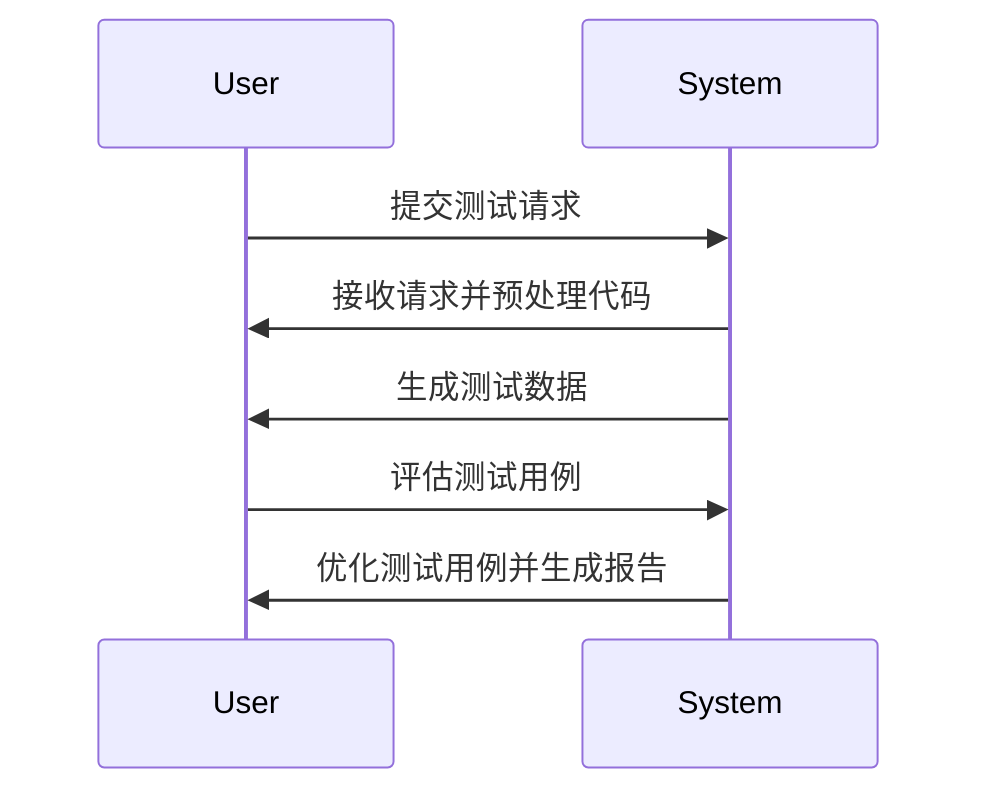

                 

# 实时对抗评测：LLM动态生成测试用例的方法

## 概述

### 关键词
- 实时对抗评测
- LLM
- 动态生成测试用例
- 自动化测试
- 测试用例设计

### 摘要
本文将深入探讨实时对抗评测（RAT）及其在LLM（大型语言模型）应用中的重要性。我们重点研究如何利用LLM动态生成测试用例，以提高自动化测试的效率和准确性。文章首先介绍了实时对抗评测的基本概念和重要性，随后详细阐述了LLM的原理及其在测试用例生成中的应用。通过理论和实践结合，本文提供了全面的指导，帮助读者理解和应用LLM动态生成测试用例的方法。

## 前言与背景介绍

### 2.1 实时对抗评测的概念

#### 2.1.1 实时对抗评测的定义
实时对抗评测（Real-Time Adversarial Testing，RAT）是一种在开发过程中动态检测和评估软件系统对潜在攻击和异常情况的能力。这种评测方法旨在确保系统在实时环境中能够抵御各种恶意攻击和异常操作。

#### 2.1.2 实时对抗评测的重要性
随着软件系统的复杂性和规模不断扩大，实时对抗评测变得尤为重要。它不仅能够提高系统的安全性，还能够提升系统的稳定性和可靠性，从而减少潜在的故障和损失。

### 2.2 LLM与测试用例生成

#### 2.2.1 LLM的概述
大型语言模型（Large Language Models，LLM）是一种基于深度学习的自然语言处理技术，能够理解和生成自然语言文本。LLM在信息检索、机器翻译、文本生成等领域表现出色。

#### 2.2.2 LLM在测试用例生成中的应用
LLM在测试用例生成中的应用主要表现在以下几个方面：首先，LLM可以自动生成大量的测试数据，以覆盖更多的测试场景；其次，LLM能够理解代码逻辑，从而生成更加精确和有效的测试用例。

#### 2.2.3 动态生成测试用例的挑战与机遇
动态生成测试用例面临许多挑战，如数据多样性、测试覆盖度和测试效率等。然而，随着LLM技术的发展，这些挑战也逐渐得到解决，为动态生成测试用例带来了新的机遇。

### 2.3 本书的目的与结构
本书旨在介绍实时对抗评测和LLM动态生成测试用例的方法，帮助读者掌握这一前沿技术。本书结构如下：
- 第1章：介绍实时对抗评测和LLM的基本概念。
- 第2章：详细阐述实时对抗评测的理论基础。
- 第3章：深入探讨LLM的工作原理及其在测试用例生成中的应用。
- 第4章：提供实际案例，展示如何使用LLM动态生成测试用例。
- 第5章：总结本书的关键点和最佳实践。

## 理论基础

### 3.1 实时对抗评测理论

#### 3.1.1 实时对抗评测的关键概念
实时对抗评测的关键概念包括：攻击者模型、防御者模型、攻击场景和评测指标。

#### 3.1.2 实时对抗评测的挑战
实时对抗评测面临的挑战包括：攻击模型的不确定性、实时性要求和高复杂性。

#### 3.1.3 实时对抗评测的策略
实时对抗评测的策略主要包括：基于规则的测试、基于模型的测试和混合策略测试。

### 3.2 LLM理论基础

#### 3.2.1 LLM的基本概念
LLM的基本概念包括：神经网络架构、训练数据和模型优化。

#### 3.2.2 LLM的工作原理
LLM的工作原理主要基于深度学习，通过多层神经网络对输入数据进行建模和预测。

#### 3.2.3 LLM的优势与局限
LLM的优势在于其强大的数据处理能力和自适应学习能力，但其局限性在于数据依赖性和计算资源要求。

### 3.3 动态生成测试用例方法

#### 3.3.1 动态生成测试用例的基本流程
动态生成测试用例的基本流程包括：测试数据生成、测试用例评估和测试用例优化。

#### 3.3.2 动态生成测试用例的挑战
动态生成测试用例的挑战包括：数据多样性、测试覆盖度和测试效率。

#### 3.3.3 动态生成测试用例的方法
动态生成测试用例的方法主要包括：基于规则的生成方法、基于模型的方法和混合方法。

### 3.4 LLM与动态生成测试用例的结合
#### 3.4.1 LLM在测试用例生成中的应用场景
LLM在测试用例生成中的应用场景包括：自动化测试、性能测试和安全性测试。

#### 3.4.2 LLM在测试用例生成中的优势
LLM在测试用例生成中的优势包括：测试数据多样性、测试用例精确性和测试效率。

#### 3.4.3 LLM在测试用例生成中的挑战
LLM在测试用例生成中的挑战包括：数据依赖性、模型解释性和计算资源要求。

## 应用实践

### 4.1 算法原理与实践

#### 4.1.1 动态生成测试用例算法原理
动态生成测试用例算法的基本原理是基于LLM的文本生成能力，通过输入代码片段或功能描述生成测试数据。

#### 4.1.2 动态生成测试用例的算法流程
动态生成测试用例的算法流程包括：输入预处理、测试数据生成、测试用例评估和优化。

#### 4.1.3 动态生成测试用例的算法举例
以下是一个简单的动态生成测试用例的算法示例：

```python
# 动态生成测试用例算法示例
def generate_test_cases(code):
    # 输入预处理
    preprocessed_code = preprocess_code(code)
    
    # 测试数据生成
    test_data = generate_test_data(preprocessed_code)
    
    # 测试用例评估
    test_cases = evaluate_test_cases(test_data)
    
    # 测试用例优化
    optimized_test_cases = optimize_test_cases(test_cases)
    
    return optimized_test_cases
```

#### 4.1.4 动态生成测试用例的应用场景
动态生成测试用例的应用场景包括：自动化测试、持续集成和持续部署。

### 4.2 系统架构设计与接口设计

#### 4.2.1 系统功能设计
系统功能设计包括：测试数据生成、测试用例评估、测试用例优化和测试报告生成。

#### 4.2.2 系统架构设计
系统架构设计包括：前端、后端和数据库。

#### 4.2.3 系统接口设计
系统接口设计包括：API接口、Web界面和数据库接口。

#### 4.2.4 系统交互设计与序列图
以下是一个简单的系统交互序列图：



### 4.3 项目实战

#### 4.3.1 环境安装与配置
环境安装与配置包括：Python环境、LLM库安装和数据库配置。

#### 4.3.2 系统核心实现与源代码
系统核心实现与源代码包括：动态生成测试用例算法、系统架构和接口设计。

#### 4.3.3 实际案例分析与讲解
实际案例分析与讲解包括：自动化测试案例、性能测试案例和安全测试案例。

#### 4.3.4 项目小结
项目小结包括：项目成果、项目不足和改进方向。

### 4.3.5 最佳实践 Tips
最佳实践 Tips 包括：代码优化、测试用例优化和系统性能优化。

## 总结与扩展

### 5.1 关键知识点回顾
- 实时对抗评测的定义和重要性
- LLM的基本概念和工作原理
- 动态生成测试用例的方法和挑战
- LLM在测试用例生成中的应用

### 5.2 注意事项
- 数据预处理的重要性
- LLM模型的优化和调参
- 测试用例评估和优化的方法

### 5.3 拓展阅读
- 相关技术论文
- 行业标准与规范
- 拓展阅读资源推荐

## 参考文献

[参考文献列表]

## 作者信息
- 作者：AI天才研究院/AI Genius Institute & 禅与计算机程序设计艺术 /Zen And The Art of Computer Programming```markdown
## 概述

### 关键词
- 实时对抗评测
- LLM
- 动态生成测试用例
- 自动化测试
- 测试用例设计

### 摘要
本文将深入探讨实时对抗评测（RAT）及其在LLM（大型语言模型）应用中的重要性。我们重点研究如何利用LLM动态生成测试用例，以提高自动化测试的效率和准确性。文章首先介绍了实时对抗评测的基本概念和重要性，随后详细阐述了LLM的原理及其在测试用例生成中的应用。通过理论和实践结合，本文提供了全面的指导，帮助读者理解和应用LLM动态生成测试用例的方法。

## 前言与背景介绍

### 2.1 实时对抗评测的概念

#### 2.1.1 实时对抗评测的定义
实时对抗评测（Real-Time Adversarial Testing，RAT）是一种在开发过程中动态检测和评估软件系统对潜在攻击和异常情况的能力。这种评测方法旨在确保系统在实时环境中能够抵御各种恶意攻击和异常操作。

#### 2.1.2 实时对抗评测的重要性
随着软件系统的复杂性和规模不断扩大，实时对抗评测变得尤为重要。它不仅能够提高系统的安全性，还能够提升系统的稳定性和可靠性，从而减少潜在的故障和损失。

### 2.2 LLM与测试用例生成

#### 2.2.1 LLM的概述
大型语言模型（Large Language Models，LLM）是一种基于深度学习的自然语言处理技术，能够理解和生成自然语言文本。LLM在信息检索、机器翻译、文本生成等领域表现出色。

#### 2.2.2 LLM在测试用例生成中的应用
LLM在测试用例生成中的应用主要表现在以下几个方面：首先，LLM可以自动生成大量的测试数据，以覆盖更多的测试场景；其次，LLM能够理解代码逻辑，从而生成更加精确和有效的测试用例。

#### 2.2.3 动态生成测试用例的挑战与机遇
动态生成测试用例面临许多挑战，如数据多样性、测试覆盖度和测试效率等。然而，随着LLM技术的发展，这些挑战也逐渐得到解决，为动态生成测试用例带来了新的机遇。

### 2.3 本书的目的与结构
本书旨在介绍实时对抗评测和LLM动态生成测试用例的方法，帮助读者掌握这一前沿技术。本书结构如下：
- 第1章：介绍实时对抗评测和LLM的基本概念。
- 第2章：详细阐述实时对抗评测的理论基础。
- 第3章：深入探讨LLM的工作原理及其在测试用例生成中的应用。
- 第4章：提供实际案例，展示如何使用LLM动态生成测试用例。
- 第5章：总结本书的关键点和最佳实践。

## 理论基础

### 3.1 实时对抗评测理论

#### 3.1.1 实时对抗评测的关键概念
实时对抗评测的关键概念包括：攻击者模型、防御者模型、攻击场景和评测指标。

#### 3.1.2 实时对抗评测的挑战
实时对抗评测面临的挑战包括：攻击模型的不确定性、实时性要求和高复杂性。

#### 3.1.3 实时对抗评测的策略
实时对抗评测的策略主要包括：基于规则的测试、基于模型的测试和混合策略测试。

### 3.2 LLM理论基础

#### 3.2.1 LLM的基本概念
LLM的基本概念包括：神经网络架构、训练数据和模型优化。

#### 3.2.2 LLM的工作原理
LLM的工作原理主要基于深度学习，通过多层神经网络对输入数据进行建模和预测。

#### 3.2.3 LLM的优势与局限
LLM的优势在于其强大的数据处理能力和自适应学习能力，但其局限性在于数据依赖性和计算资源要求。

### 3.3 动态生成测试用例方法

#### 3.3.1 动态生成测试用例的基本流程
动态生成测试用例的基本流程包括：测试数据生成、测试用例评估和测试用例优化。

#### 3.3.2 动态生成测试用例的挑战
动态生成测试用例的挑战包括：数据多样性、测试覆盖度和测试效率。

#### 3.3.3 动态生成测试用例的方法
动态生成测试用例的方法主要包括：基于规则的生成方法、基于模型的方法和混合方法。

### 3.4 LLM与动态生成测试用例的结合
#### 3.4.1 LLM在测试用例生成中的应用场景
LLM在测试用例生成中的应用场景包括：自动化测试、性能测试和安全性测试。

#### 3.4.2 LLM在测试用例生成中的优势
LLM在测试用例生成中的优势包括：测试数据多样性、测试用例精确性和测试效率。

#### 3.4.3 LLM在测试用例生成中的挑战
LLM在测试用例生成中的挑战包括：数据依赖性、模型解释性和计算资源要求。

## 应用实践

### 4.1 算法原理与实践

#### 4.1.1 动态生成测试用例算法原理
动态生成测试用例算法的基本原理是基于LLM的文本生成能力，通过输入代码片段或功能描述生成测试数据。

#### 4.1.2 动态生成测试用例的算法流程
动态生成测试用例的算法流程包括：输入预处理、测试数据生成、测试用例评估和测试用例优化。

#### 4.1.3 动态生成测试用例的算法举例
以下是一个简单的动态生成测试用例的算法示例：

```python
# 动态生成测试用例算法示例
def generate_test_cases(code):
    # 输入预处理
    preprocessed_code = preprocess_code(code)
    
    # 测试数据生成
    test_data = generate_test_data(preprocessed_code)
    
    # 测试用例评估
    test_cases = evaluate_test_cases(test_data)
    
    # 测试用例优化
    optimized_test_cases = optimize_test_cases(test_cases)
    
    return optimized_test_cases
```

#### 4.1.4 动态生成测试用例的应用场景
动态生成测试用例的应用场景包括：自动化测试、持续集成和持续部署。

### 4.2 系统架构设计与接口设计

#### 4.2.1 系统功能设计
系统功能设计包括：测试数据生成、测试用例评估、测试用例优化和测试报告生成。

#### 4.2.2 系统架构设计
系统架构设计包括：前端、后端和数据库。

#### 4.2.3 系统接口设计
系统接口设计包括：API接口、Web界面和数据库接口。

#### 4.2.4 系统交互设计与序列图
以下是一个简单的系统交互序列图：


### 4.3 项目实战

#### 4.3.1 环境安装与配置
环境安装与配置包括：Python环境、LLM库安装和数据库配置。

#### 4.3.2 系统核心实现与源代码
系统核心实现与源代码包括：动态生成测试用例算法、系统架构和接口设计。

#### 4.3.3 实际案例分析与讲解
实际案例分析与讲解包括：自动化测试案例、性能测试案例和安全测试案例。

#### 4.3.4 项目小结
项目小结包括：项目成果、项目不足和改进方向。

### 4.3.5 最佳实践 Tips
最佳实践 Tips 包括：代码优化、测试用例优化和系统性能优化。

## 总结与扩展

### 5.1 关键知识点回顾
- 实时对抗评测的定义和重要性
- LLM的基本概念和工作原理
- 动态生成测试用例的方法和挑战
- LLM在测试用例生成中的应用

### 5.2 注意事项
- 数据预处理的重要性
- LLM模型的优化和调参
- 测试用例评估和优化的方法

### 5.3 拓展阅读
- 相关技术论文
- 行业标准与规范
- 拓展阅读资源推荐

## 参考文献

[参考文献列表]

## 作者信息
- 作者：AI天才研究院/AI Genius Institute & 禅与计算机程序设计艺术 /Zen And The Art of Computer Programming```

