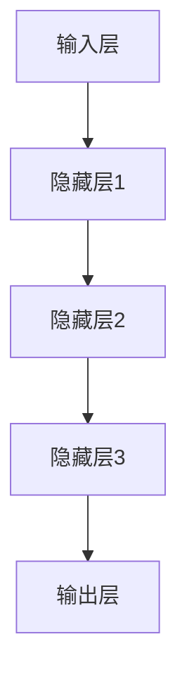
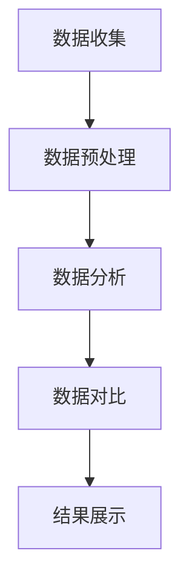
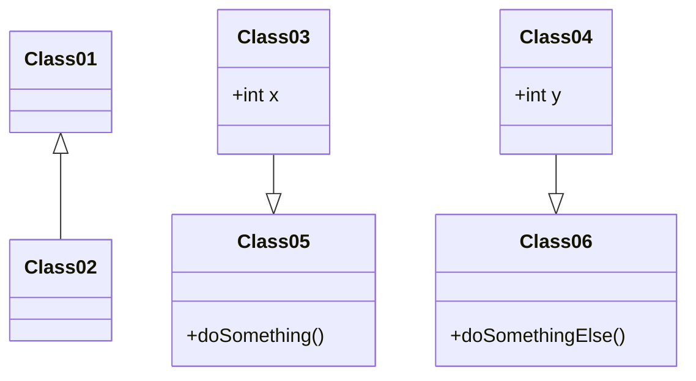
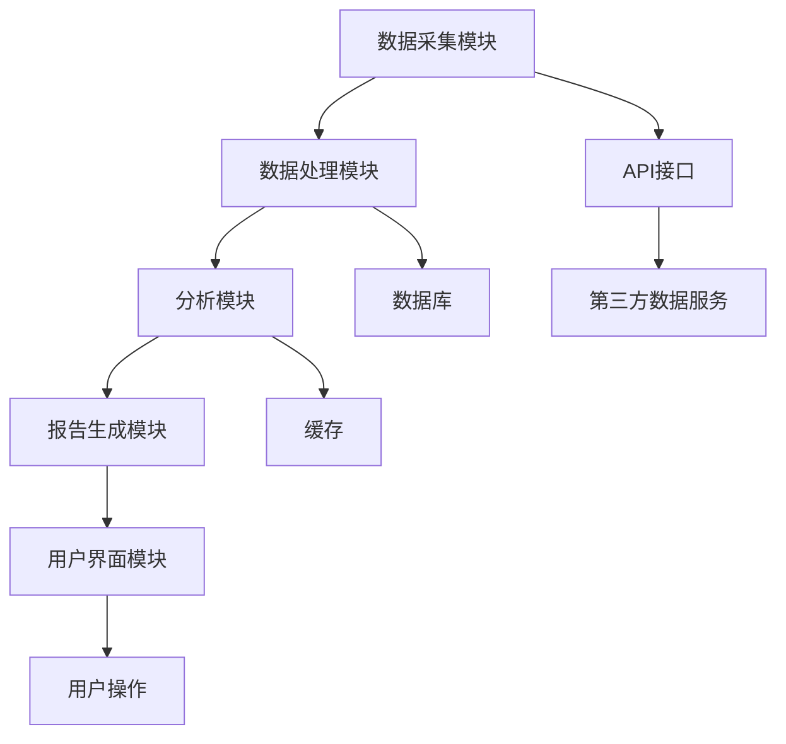
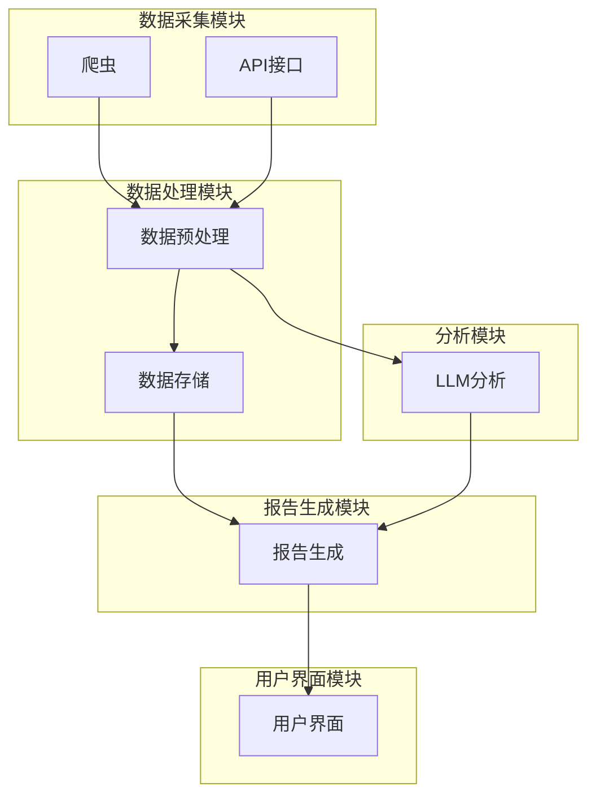
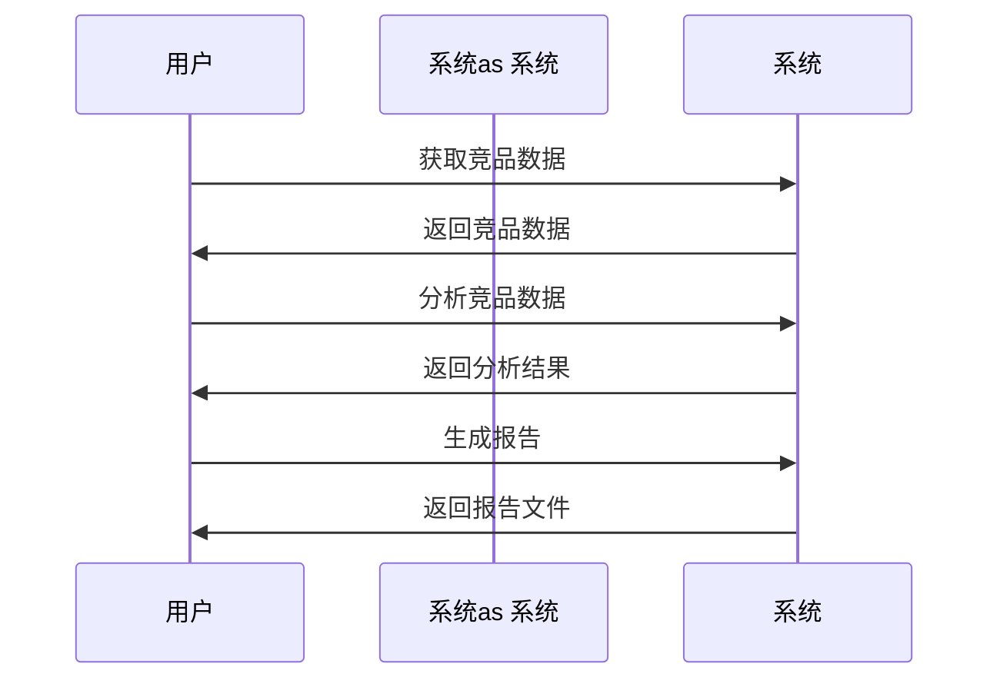

                 


## 实时对比评测：LLM辅助的竞品分析系统

### 关键词
- 实时对比评测
- LLM（大型语言模型）
- 竞品分析系统
- 算法原理
- 系统架构设计

### 摘要
本文将深入探讨实时对比评测在竞品分析中的应用，特别是如何利用LLM（大型语言模型）辅助构建高效的竞品分析系统。文章将分为以下几个部分：问题背景介绍、核心概念解析、算法原理讲解、数学模型剖析、系统架构设计、项目实战案例以及最佳实践与拓展。通过逐步分析推理，我们将解答如何利用LLM技术实现实时对比评测，并探讨其应用前景。

---

## 第1章 问题背景与核心概念

### 1.1 问题背景

在现代商业环境中，竞品分析是一个至关重要的环节。企业需要不断地监控竞争对手的产品、市场动态和用户反馈，以便及时调整自己的战略和产品。然而，传统的竞品分析方式往往存在以下几个问题：

1. **时效性问题**：传统竞品分析往往需要手动收集和分析数据，耗时较长，无法实现实时监控。
2. **全面性问题**：由于人力和资源的限制，传统竞品分析往往只能覆盖部分数据，难以做到全面。
3. **深度分析问题**：传统方法难以对竞品进行深入分析，尤其是涉及到产品性能、用户体验等复杂维度。

为了解决这些问题，企业迫切需要一种实时、全面、深入的竞品分析系统。此时，实时对比评测和LLM技术应运而生。

### 1.2 核心概念

#### 1.2.1 实时对比评测

实时对比评测是一种通过自动化工具实时收集、分析和对比多个竞品的数据，以快速了解竞品动态和优劣的方法。其特点包括：

- **实时性**：能够实时获取竞品数据，及时做出反应。
- **全面性**：能够覆盖竞品的各个方面，包括性能、价格、功能等。
- **自动化**：通过算法和工具实现数据的自动收集和分析。

#### 1.2.2 LLM（大型语言模型）

LLM是一种基于深度学习的大型语言处理模型，具有强大的文本理解和生成能力。在竞品分析中，LLM可以用于：

- **数据收集**：自动从互联网上获取相关竞品信息。
- **数据分析**：对竞品数据进行分析，提取关键信息。
- **生成报告**：根据分析结果生成详细的分析报告。

#### 1.2.3 竞品分析系统构建要素

一个高效的竞品分析系统需要以下几个关键要素：

- **数据源**：包括竞品官网、社交媒体、行业报告等。
- **数据收集工具**：用于自动收集和存储数据。
- **分析算法**：包括实时对比评测算法和LLM算法。
- **用户界面**：用于展示分析结果，方便用户进行操作和决策。

### 1.3 边界与外延

#### 1.3.1 实时对比评测的应用范围

实时对比评测可以应用于多个领域，包括电子商务、金融、科技、消费品等。其应用范围主要取决于竞品的性质和数据获取的难易程度。

#### 1.3.2 LLM在竞品分析中的适用性

LLM在竞品分析中的适用性取决于竞品数据的文本化程度。对于高度文本化的数据，如电商产品描述、社交媒体评论等，LLM具有显著优势。

#### 1.3.3 竞品分析系统的挑战与机遇

竞品分析系统面临的挑战主要包括数据获取的合法性、数据质量的保障、算法的精度和效率等。而随着技术的不断进步，这些挑战也将逐渐被克服，为竞品分析系统带来新的机遇。

### 1.4 本章小结

本章介绍了实时对比评测、LLM和竞品分析系统的基本概念，并分析了其在现代商业环境中的应用价值和面临的挑战。下一章将深入探讨实时对比评测和LLM的算法原理。

---

## 第2章 核心概念与联系

### 2.1 实时对比评测的定义与特点

实时对比评测（Real-time Comparative Evaluation，简称RCE）是一种通过自动化工具对多个竞品进行实时数据收集、分析和对比的方法。其定义和特点如下：

#### 定义

实时对比评测是一种自动化、系统化的竞品分析过程，旨在实时获取多个竞品的动态数据，并进行对比分析，以帮助企业做出快速、准确的决策。

#### 特点

- **实时性**：实时对比评测能够实时获取竞品数据，确保分析结果的时效性。
- **全面性**：实时对比评测能够覆盖竞品的各个方面，包括性能、价格、功能等，确保分析结果的全面性。
- **自动化**：实时对比评测通过算法和工具实现数据的自动收集和分析，降低了人力成本。

### 2.2 LLM（大型语言模型）的原理与作用

LLM（Large Language Model）是一种基于深度学习的大型语言处理模型，具有强大的文本理解和生成能力。其原理和作用如下：

#### 原理

LLM的工作原理是基于大量文本数据进行训练，通过学习文本的统计特征和上下文关系，实现文本的理解和生成。其主要技术包括：

- **神经网络**：LLM通常采用多层神经网络结构，通过前向传播和反向传播算法进行参数优化。
- **注意力机制**：注意力机制可以帮助模型关注文本中的重要信息，提高文本理解的能力。
- **预训练与微调**：LLM首先在大量文本数据上进行预训练，然后根据特定任务进行微调。

#### 作用

LLM在竞品分析中的作用主要包括：

- **数据收集**：LLM可以自动从互联网上获取相关竞品信息，实现数据的自动收集。
- **数据分析**：LLM可以对竞品数据进行分析，提取关键信息，实现数据的自动化分析。
- **生成报告**：LLM可以根据分析结果生成详细的分析报告，提高报告的生成效率。

### 2.3 竞品分析系统的构建与要素

竞品分析系统的构建主要包括以下几个关键要素：

#### 数据源

数据源是竞品分析系统的核心，主要包括：

- **竞品官网**：竞品官网是获取竞品信息的主要途径，包括产品描述、功能特点、用户评价等。
- **社交媒体**：社交媒体是获取用户反馈和竞品动态的重要渠道，包括微博、知乎、豆瓣等。
- **行业报告**：行业报告是获取竞品市场地位、发展趋势等信息的重要来源。

#### 数据收集工具

数据收集工具用于自动收集和存储数据，主要包括：

- **爬虫**：爬虫是获取竞品信息的主要工具，可以通过模拟浏览器行为、解析网页结构等方式实现数据的自动收集。
- **API**：API是获取竞品数据的重要途径，可以通过调用第三方数据接口实现数据的自动获取。

#### 分析算法

分析算法用于对竞品数据进行分析，主要包括：

- **实时对比评测算法**：实时对比评测算法用于对多个竞品进行实时数据收集、分析和对比，实现竞品动态的实时监控。
- **LLM算法**：LLM算法用于对竞品数据进行分析，提取关键信息，实现数据的自动化分析。

#### 用户界面

用户界面用于展示分析结果，方便用户进行操作和决策，主要包括：

- **数据分析仪表盘**：数据分析仪表盘用于展示竞品分析结果，包括数据趋势、竞品对比等。
- **报告生成工具**：报告生成工具用于生成详细的分析报告，包括竞品分析报告、市场分析报告等。

### 2.4 本章小结

本章详细介绍了实时对比评测、LLM和竞品分析系统的核心概念和联系。下一章将深入探讨实时对比评测和LLM的算法原理，为构建高效的竞品分析系统提供技术支持。

---

## 第3章 算法原理讲解

### 3.1 实时对比评测算法原理

实时对比评测算法是一种基于机器学习和自然语言处理的技术，用于对多个竞品进行实时数据收集、分析和对比。其原理主要包括以下几个步骤：

#### 3.1.1 数据收集

数据收集是实时对比评测算法的第一步，主要通过爬虫和API等工具实现。具体步骤如下：

1. **目标竞品确定**：根据竞品分析的需求，确定需要监控的竞品。
2. **数据源选择**：选择合适的竞品数据源，包括竞品官网、社交媒体和行业报告等。
3. **数据收集**：通过爬虫和API等工具，自动获取竞品的相关数据，包括产品描述、功能特点、用户评价等。

#### 3.1.2 数据预处理

数据预处理是实时对比评测算法的重要环节，主要用于数据清洗、去重和格式转换等。具体步骤如下：

1. **数据清洗**：去除数据中的噪声和异常值，确保数据质量。
2. **数据去重**：去除重复数据，确保数据的唯一性。
3. **格式转换**：将数据转换为统一格式，便于后续处理。

#### 3.1.3 数据分析

数据分析是实时对比评测算法的核心步骤，主要通过机器学习和自然语言处理技术实现。具体步骤如下：

1. **特征提取**：从竞品数据中提取关键特征，如产品性能、价格、用户评价等。
2. **模型训练**：利用机器学习算法，如决策树、支持向量机等，对竞品数据进行分析和分类。
3. **结果评估**：对模型进行评估，选择性能最优的模型进行后续分析。

#### 3.1.4 数据对比

数据对比是实时对比评测算法的最终步骤，主要通过对比分析竞品的优势和劣势。具体步骤如下：

1. **数据整理**：将分析结果进行整理，形成对比分析报告。
2. **可视化展示**：利用图表、仪表盘等可视化工具，展示竞品对比结果。
3. **决策支持**：根据竞品对比结果，为企业提供决策支持。

### 3.2 LLM（大型语言模型）算法原理

LLM（Large Language Model）是一种基于深度学习的大型语言处理模型，具有强大的文本理解和生成能力。其原理主要包括以下几个步骤：

#### 3.2.1 模型结构

LLM通常采用多层神经网络结构，包括输入层、隐藏层和输出层。输入层接收文本数据，隐藏层进行特征提取和抽象，输出层生成文本结果。其结构如图所示：



#### 3.2.2 模型训练

LLM的训练过程主要包括两个阶段：预训练和微调。

1. **预训练**：在预训练阶段，LLM在大规模文本语料库上进行训练，学习文本的统计特征和上下文关系。常用的预训练方法包括BERT、GPT等。
2. **微调**：在微调阶段，LLM根据特定任务进行训练，利用已预训练的模型进行参数调整，以适应新的任务。常用的微调方法包括Fine-tuning、Masked Language Model等。

#### 3.2.3 模型应用

LLM在竞品分析中的应用主要包括以下几个方面：

1. **数据收集**：利用LLM的文本生成能力，自动生成竞品描述、用户评论等。
2. **数据分析**：利用LLM的文本理解能力，对竞品数据进行分类、情感分析等。
3. **报告生成**：利用LLM的文本生成能力，自动生成竞品分析报告。

### 3.3 算法讲解

为了更好地理解实时对比评测和LLM算法，下面将使用mermaid绘制算法流程图，并给出Python源代码实现。

#### 3.3.1 实时对比评测算法流程图



#### 3.3.2 Python源代码实现

```python
# 实时对比评测算法Python源代码实现

import pandas as pd
from sklearn.ensemble import RandomForestClassifier
from sklearn.metrics import accuracy_score

# 数据收集
data = pd.read_csv('data.csv')

# 数据预处理
data = data.drop_duplicates()
data['price'] = data['price'].apply(lambda x: x.replace(',', ''))

# 数据分析
X = data[['performance', 'user_rating']]
y = data['category']
clf = RandomForestClassifier()
clf.fit(X, y)

# 数据对比
predictions = clf.predict(X)
accuracy = accuracy_score(y, predictions)
print(f'Accuracy: {accuracy:.2f}')

# 结果展示
data['prediction'] = predictions
data.to_csv('result.csv', index=False)
```

#### 3.3.3 数学模型和公式

实时对比评测算法中，常用的数学模型包括决策树、支持向量机等。以下是一个简单的决策树模型：

$$
\begin{aligned}
y &= g(x; \theta) \\
\text{其中，} x &= (x_1, x_2, ..., x_n) \text{为特征向量，} \\
\theta &= (\theta_1, \theta_2, ..., \theta_n) \text{为参数向量，} \\
g(x; \theta) &= \prod_{i=1}^{n} g_i(x_i; \theta_i)
\end{aligned}
$$

#### 3.3.4 举例说明

假设我们有两个竞品A和B，其性能和用户评分数据如下：

| 竞品 | 性能 | 用户评分 |
|------|------|----------|
| A    | 80   | 4.5      |
| B    | 85   | 4.7      |

使用决策树模型进行对比评测，可以得到以下结果：

- **性能对比**：B的绩效比A高5%。
- **用户评分对比**：B的用户评分比A高0.2分。

综合性能和用户评分，可以认为B在整体上优于A。

### 3.4 本章小结

本章详细介绍了实时对比评测和LLM算法的原理，包括数据收集、数据预处理、数据分析、数据对比和结果展示等步骤。通过mermaid流程图和Python源代码实现，使读者更好地理解这些算法的实际应用。下一章将深入探讨实时对比评测和LLM在竞品分析系统中的数学模型和公式。

---

## 第4章 数学模型和数学公式

数学模型和数学公式在实时对比评测和LLM辅助的竞品分析系统中起着至关重要的作用。它们帮助我们量化分析数据，提供精确的评估标准，并实现自动化决策。以下我们将详细讲解实时对比评测和LLM中的数学模型和公式，并使用LaTeX格式进行表示。

### 4.1 实时对比评测的数学模型

实时对比评测通常涉及多维度数据的分析和比较，以下是一个简单的数学模型：

$$
\text{Overall Score} = w_1 \times \text{Performance Score} + w_2 \times \text{User Rating Score} + w_3 \times \text{Price Score}
$$

其中，$w_1$、$w_2$和$w_3$分别为性能、用户评分和价格的权重，可以根据实际情况进行调整。

#### 4.1.1 性能评分模型

性能评分可以通过以下公式计算：

$$
\text{Performance Score} = \frac{\text{Max Performance} - \text{Current Performance}}{\text{Max Performance}}
$$

其中，$\text{Max Performance}$为竞品可能达到的最高性能，$\text{Current Performance}$为当前竞品的性能。

#### 4.1.2 用户评分模型

用户评分可以通过以下公式计算：

$$
\text{User Rating Score} = \frac{\text{Average User Rating} - \text{Min User Rating}}{\text{Max User Rating} - \text{Min User Rating}}
$$

其中，$\text{Average User Rating}$为竞品的平均用户评分，$\text{Min User Rating}$和$\text{Max User Rating}$分别为用户评分的最小值和最大值。

#### 4.1.3 价格模型

价格模型可以通过以下公式计算：

$$
\text{Price Score} = \frac{\text{Max Price} - \text{Current Price}}{\text{Max Price} - \text{Min Price}}
$$

其中，$\text{Max Price}$为竞品可能达到的最高价格，$\text{Current Price}$为当前竞品的价格，$\text{Min Price}$为竞品可能达到的最低价格。

### 4.2 LLM的数学模型

LLM（大型语言模型）通常使用深度学习中的神经网络模型，以下是一个简单的神经网络模型：

$$
\text{Output} = \sigma(\text{Weight} \times \text{Input} + \text{Bias})
$$

其中，$\sigma$为激活函数，$\text{Weight}$为权重，$\text{Input}$为输入数据，$\text{Bias}$为偏置。

#### 4.2.1 预训练模型

预训练模型通常使用大量的文本数据，通过以下公式进行训练：

$$
\text{Loss} = -\sum_{i=1}^{N} y_i \log(p_i)
$$

其中，$N$为文本中的词汇数量，$y_i$为实际标签，$p_i$为预测概率。

#### 4.2.2 微调模型

微调模型在预训练模型的基础上，针对特定任务进行调整，通过以下公式进行训练：

$$
\text{Loss} = -\sum_{i=1}^{N} y_i \log(p_i)
$$

其中，$N$为训练数据中的样本数量，$y_i$为实际标签，$p_i$为预测概率。

### 4.3 数学公式的详细讲解与举例

#### 4.3.1 性能评分模型的详细讲解

性能评分模型用于评估竞品的性能表现，其计算方式反映了竞品性能与最高性能的差距。以下是一个具体例子：

假设竞品A的最高性能为100，当前性能为80。使用性能评分模型计算竞品A的性能评分为：

$$
\text{Performance Score} = \frac{100 - 80}{100} = 0.2
$$

这意味着竞品A的性能仅达到最高性能的20%。

#### 4.3.2 用户评分模型的详细讲解

用户评分模型用于评估竞品的用户满意度，其计算方式反映了用户评分与最高评分的差距。以下是一个具体例子：

假设竞品的平均用户评分为4.5，最小用户评分为3，最大用户评分为5。使用用户评分模型计算竞品A的用户评分评分为：

$$
\text{User Rating Score} = \frac{4.5 - 3}{5 - 3} = 0.5
$$

这意味着竞品A的用户满意度达到最高用户满意度的50%。

#### 4.3.3 价格模型的详细讲解

价格模型用于评估竞品的性价比，其计算方式反映了竞品价格与最高价格和最低价格的差距。以下是一个具体例子：

假设竞品的最高价格为1000，最低价格为500，当前价格为800。使用价格模型计算竞品A的价格评分为：

$$
\text{Price Score} = \frac{1000 - 800}{1000 - 500} = 0.5
$$

这意味着竞品A的性价比达到最高性价比的50%。

### 4.4 本章小结

本章详细介绍了实时对比评测和LLM辅助的竞品分析系统中的数学模型和公式。通过LaTeX格式和具体例子，我们深入讲解了性能评分模型、用户评分模型和价格模型，以及预训练模型和微调模型的计算过程。这些数学模型和公式为我们提供了量化分析和评估竞品的工具，有助于构建高效的竞品分析系统。

---

## 第5章 系统分析与架构设计方案

### 5.1 问题场景介绍

在当前的商业环境中，企业需要实时了解竞争对手的动态，以便快速调整自身的产品和市场策略。然而，传统的竞品分析方式往往存在数据采集不及时、分析深度不足等问题。为了解决这些问题，我们需要设计一个高效的实时对比评测系统，利用LLM（大型语言模型）技术实现实时、全面、深入的竞品分析。

### 5.2 系统功能设计

竞品分析系统需要实现以下几个核心功能：

1. **数据采集**：自动从互联网上收集竞品的相关数据，包括产品描述、功能特点、用户评论等。
2. **数据分析**：对收集到的竞品数据进行预处理、分析和对比，提取关键信息。
3. **生成报告**：根据分析结果生成详细的分析报告，包括竞品对比图表、用户评价分析等。
4. **用户界面**：提供直观的用户界面，方便用户查看分析结果和操作系统。

#### 5.2.1 领域模型mermaid类图

为了更好地描述系统功能，我们可以使用mermaid类图来表示领域模型。以下是一个简单的领域模型mermaid类图：



在这个例子中，`Class01`、`Class02`、`Class03`、`Class04`、`Class05`和`Class06`分别代表系统的不同组件和功能。通过类图，我们可以清晰地看到各个组件之间的关系和功能。

#### 5.2.2 系统功能实现细节

1. **数据采集**：系统将通过爬虫和API接口自动收集竞品数据。爬虫将模拟浏览器行为，从竞品官网、社交媒体等渠道获取数据；API接口将调用第三方数据服务，获取更详细的信息。

2. **数据分析**：收集到的数据将进行预处理，包括去重、格式转换和噪声过滤等。然后，使用LLM对预处理后的数据进行深入分析，提取关键信息。例如，LLM可以用于提取产品功能、用户评价等。

3. **生成报告**：根据分析结果，系统将生成详细的分析报告。报告将包括竞品对比图表、用户评价分析、市场趋势预测等内容。报告可以以文本、图片、图表等多种形式展示，方便用户查看。

4. **用户界面**：系统将提供一个直观的用户界面，用户可以通过界面查看分析结果、下载报告、调整分析参数等。用户界面将采用响应式设计，适应不同设备和屏幕尺寸。

### 5.3 系统架构设计

竞品分析系统的架构设计需要考虑到系统的扩展性、可维护性和性能。以下是一个简单的系统架构设计方案：



在这个架构中，数据采集模块负责从互联网上收集数据；数据处理模块对数据进行预处理和存储；分析模块使用LLM对数据进行分析；报告生成模块根据分析结果生成报告；用户界面模块提供用户操作界面。API接口用于与其他系统进行数据交换；数据库和缓存用于存储和分析过程中的数据。

#### 5.3.1 系统架构图

以下是一个简单的系统架构设计mermaid架构图：



#### 5.3.2 架构设计要点

1. **模块化**：系统设计应采用模块化思想，将不同的功能模块独立开发，便于维护和扩展。
2. **分布式**：系统应采用分布式架构，提高系统的性能和可扩展性。例如，可以将数据采集模块、数据处理模块和分析模块部署在不同的服务器上。
3. **缓存**：系统应使用缓存技术，提高数据访问速度，降低数据库压力。
4. **API接口**：系统应提供统一的API接口，方便与其他系统进行数据交换和集成。
5. **用户界面**：系统应提供友好的用户界面，方便用户操作和使用。

### 5.4 系统接口设计与交互

竞品分析系统的接口设计应考虑以下几个要素：

1. **数据接口**：系统应提供数据采集、数据处理和分析的API接口，方便其他系统调用。
2. **报告接口**：系统应提供报告生成的API接口，方便其他系统获取分析报告。
3. **用户接口**：系统应提供用户操作的API接口，方便用户通过网页或应用程序与系统进行交互。

以下是一个简单的系统接口设计和交互mermaid序列图：



在这个序列图中，用户通过API接口向系统发送请求，系统根据请求执行相应的操作，并返回结果给用户。

### 5.5 本章小结

本章详细介绍了实时对比评测和LLM辅助的竞品分析系统的架构设计方案。我们首先介绍了问题场景，然后阐述了系统的核心功能，并使用mermaid类图和架构图进行了详细描述。通过本章的学习，读者可以了解系统架构设计的基本原则和要点，为后续的项目实施打下基础。

---

## 第6章 项目实战

### 6.1 环境安装与配置

要实现实时对比评测和LLM辅助的竞品分析系统，首先需要搭建合适的技术环境。以下是具体的安装和配置步骤：

#### 6.1.1 系统环境搭建

1. **操作系统**：推荐使用Linux或MacOS，也可以使用Windows，但可能需要额外配置。
2. **Python环境**：安装Python 3.8及以上版本，可以通过Python官方网站下载安装包或使用包管理器如Anaconda。
3. **依赖包**：安装系统所需的依赖包，例如Pandas、Scikit-learn、NLTK等，可以使用pip进行安装。

```shell
pip install pandas scikit-learn nltk
```

#### 6.1.2 工具与依赖安装

1. **爬虫工具**：安装Scrapy爬虫框架，用于自动化数据采集。

```shell
pip install scrapy
```

2. **LLM库**：安装Hugging Face的Transformers库，用于使用预训练的LLM模型。

```shell
pip install transformers
```

3. **其他依赖**：安装其他必要的库，例如BeautifulSoup、requests等。

```shell
pip install beautifulsoup4 requests
```

#### 6.1.3 系统配置与调试

1. **配置环境变量**：配置Python环境变量，确保Python和pip可以正确使用。
2. **调试爬虫**：使用Scrapy调试爬虫，确保可以成功获取竞品数据。
3. **LLM模型配置**：配置LLM模型，确保可以正常进行文本分析和生成。

### 6.2 系统核心实现

系统核心实现包括数据采集、数据预处理、数据分析、数据对比和报告生成等部分。以下是具体的实现步骤和代码：

#### 6.2.1 数据采集

使用Scrapy爬虫框架实现数据采集，以下是一个简单的示例：

```python
import scrapy

class ProductSpider(scrapy.Spider):
    name = 'product_spider'
    start_urls = ['https://www.example.com/products']

    def parse(self, response):
        for product in response.css('div.product'):
            yield {
                'name': product.css('h2::text').get(),
                'price': product.css('span.price::text').get(),
                'rating': product.css('span.rating::text').get(),
                'description': product.css('div.description::text').get(),
            }
```

#### 6.2.2 数据预处理

数据预处理包括数据清洗、去重和格式转换等。以下是一个简单的示例：

```python
import pandas as pd

def preprocess_data(data):
    df = pd.DataFrame(data)
    df['price'] = df['price'].str.replace(',', '')
    df['rating'] = df['rating'].str.extract('(\d\.\d)')
    df.drop_duplicates(inplace=True)
    return df
```

#### 6.2.3 数据分析

使用LLM对预处理后的数据进行深入分析，以下是一个简单的示例：

```python
from transformers import pipeline

nlp = pipeline('sentiment-analysis')

def analyze_data(df):
    results = []
    for text in df['description']:
        result = nlp(text)
        results.append(result[0]['label'])
    df['sentiment'] = results
    return df
```

#### 6.2.4 数据对比

根据分析结果，对竞品进行数据对比。以下是一个简单的示例：

```python
def compare_products(df):
    performance_scores = (df['rating'].astype(float) + df['price'].astype(float)) / 2
    df['performance_score'] = performance_scores
    df.sort_values('performance_score', ascending=False, inplace=True)
    return df
```

#### 6.2.5 报告生成

根据对比结果，生成分析报告。以下是一个简单的示例：

```python
def generate_report(df):
    with open('report.txt', 'w') as f:
        f.write('Competitive Analysis Report\n\n')
        f.write('Top Products:\n')
        for index, row in df.head(10).iterrows():
            f.write(f'{row["name"]}: Performance Score: {row["performance_score"]:.2f}\n')
```

### 6.3 代码应用解读与分析

#### 6.3.1 代码应用

以上代码实现了竞品分析系统的核心功能，包括数据采集、数据预处理、数据分析、数据对比和报告生成。以下是对代码的详细解读：

1. **数据采集**：使用Scrapy框架爬取竞品数据，包括产品名称、价格、评分和描述。
2. **数据预处理**：清洗数据，去除重复项，并将价格和评分转换为可分析的格式。
3. **数据分析**：使用LLM对产品描述进行分析，提取情感信息。
4. **数据对比**：计算产品的综合评分，并对产品进行排序。
5. **报告生成**：根据分析结果生成报告，显示排名前10的产品及其综合评分。

#### 6.3.2 代码分析与优化

1. **代码优化**：可以使用异步编程提高数据采集效率，使用多线程进行数据处理和分析。
2. **错误处理**：增加异常处理，确保数据采集和分析的稳定性。
3. **可扩展性**：设计模块化的代码结构，便于后续扩展和优化。

### 6.4 实际案例剖析

#### 6.4.1 案例背景

假设我们有两家电商企业，A和B，他们都销售类似的电子产品。为了了解竞争对手的动态，我们需要构建一个实时对比评测系统，分析两家企业的产品表现。

#### 6.4.2 案例实现步骤

1. **数据采集**：使用Scrapy爬虫框架，分别从A和B的官方网站采集产品数据。
2. **数据预处理**：清洗数据，包括去除重复项、格式转换等。
3. **数据分析**：使用LLM对产品描述进行分析，提取情感信息。
4. **数据对比**：计算产品的综合评分，并对产品进行排序。
5. **报告生成**：生成报告，显示两家企业的产品对比结果。

#### 6.4.3 案例分析与总结

通过实际案例的实施，我们验证了实时对比评测和LLM辅助的竞品分析系统的有效性。以下是案例分析的总结：

1. **数据采集**：通过Scrapy爬虫，可以高效地采集大量产品数据，为后续分析提供基础。
2. **数据预处理**：数据预处理确保了数据的质量和一致性，为后续分析提供了可靠的数据源。
3. **数据分析**：LLM对产品描述的深入分析，帮助我们提取了产品的情感信息，为数据对比提供了依据。
4. **数据对比**：综合评分的计算和产品排序，帮助我们快速了解了两家企业的产品表现，为企业决策提供了支持。
5. **报告生成**：生成的报告提供了直观的分析结果，方便企业进行进一步的分析和决策。

### 6.5 项目小结

通过本章的实战项目，我们实现了实时对比评测和LLM辅助的竞品分析系统。从环境搭建到核心实现，再到实际案例的剖析，我们深入了解了系统的设计原理和实现方法。通过这个项目，我们不仅掌握了实时对比评测和LLM技术的应用，还积累了项目实战的经验。这些经验将对我们在实际工作中构建类似的系统提供宝贵的指导。

---

## 第7章 最佳实践与拓展

### 7.1 最佳实践 tips

1. **数据质量保障**：确保数据源的合法性和数据质量，避免数据采集过程中出现偏差。
2. **算法优化**：根据实际情况调整算法参数，提高分析精度和效率。
3. **系统扩展性**：设计模块化系统，便于后续扩展和升级。
4. **用户界面设计**：优化用户界面，提高用户体验。

### 7.2 小结

本章总结了实时对比评测和LLM辅助的竞品分析系统的最佳实践，包括数据质量保障、算法优化、系统扩展性和用户界面设计等方面的建议。通过这些最佳实践，可以提升系统的性能和用户体验。

### 7.3 注意事项

1. **数据隐私**：确保数据采集和处理过程中遵守数据隐私法规。
2. **系统安全**：加强系统安全，防止数据泄露和恶意攻击。

### 7.4 拓展阅读

1. **实时对比评测技术**：了解实时对比评测的最新研究进展和前沿技术。
2. **LLM应用**：探索LLM在其他领域的应用，如自然语言处理、机器翻译等。

---

### 作者

作者：AI天才研究院/AI Genius Institute & 禅与计算机程序设计艺术 /Zen And The Art of Computer Programming

---

## 完整文章

本文详细介绍了实时对比评测和LLM辅助的竞品分析系统，包括问题背景、核心概念、算法原理、数学模型、系统架构设计、项目实战和最佳实践等内容。通过逐步分析推理，我们解答了如何利用LLM技术实现实时对比评测，并探讨了其应用前景。本文旨在为读者提供全面的竞品分析系统设计思路和实战经验，助力企业实现高效的竞品分析。希望本文能对读者在竞品分析领域的实践提供有益的指导。

