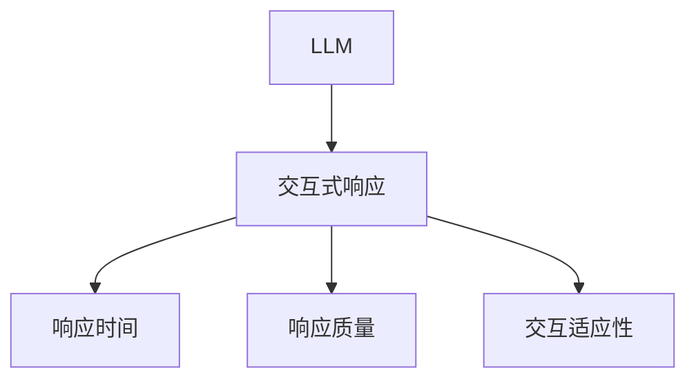
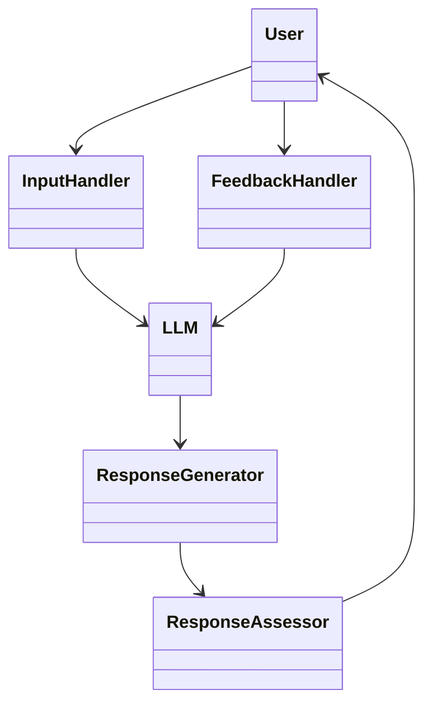
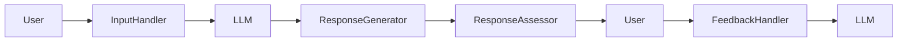
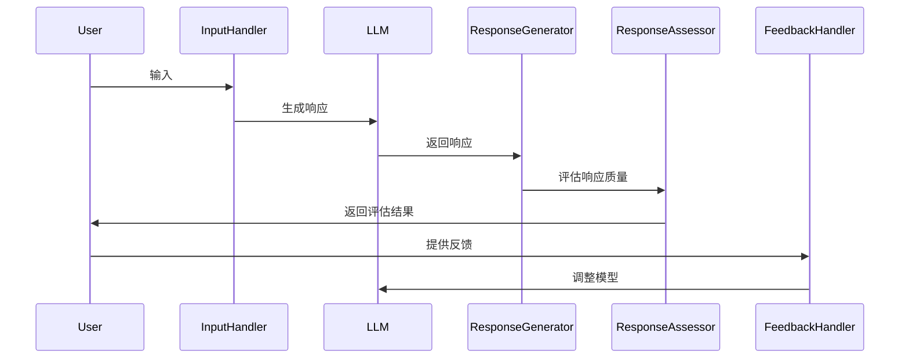

                 


# 实时对话能力评测：测试LLM的交互式响应

关键词：实时对话评测、LLM、交互式响应、算法原理、系统架构、项目实战

摘要：
本文深入探讨了实时对话能力评测的核心问题，旨在测试大型语言模型（LLM）在交互式场景中的响应能力。通过阐述问题背景、核心概念、算法原理、系统设计与实战案例，本文为LLM在实际应用中的性能优化提供了有力的指导。

## 引言

### 1.1 问题背景

随着人工智能技术的快速发展，大型语言模型（LLM）在自然语言处理领域取得了显著的成果。然而，LLM在实际应用中的表现不仅取决于其预训练的质量，还受到其交互式响应能力的制约。实时对话能力评测成为衡量LLM性能的重要指标，它关乎用户体验、服务质量和系统稳定性。

### 1.2 问题描述

实时对话能力评测的目标是评估LLM在动态交互场景中的表现。具体包括以下几个方面：

1. **响应时间**：评估LLM在接收到用户输入后生成响应的时间。
2. **响应质量**：评估LLM生成的响应是否准确、连贯、符合用户期望。
3. **交互适应性**：评估LLM在对话过程中对用户反馈的适应能力。

### 1.3 问题解决

针对实时对话能力评测，本文提出了一套综合性的评估方法，包括：

1. **算法设计**：设计适用于实时对话的评测算法，确保评测结果的准确性和可靠性。
2. **系统架构**：构建高效、稳定的评测系统，以满足实时性的要求。
3. **实战案例**：通过实际项目案例分析，验证评估方法的有效性。

### 1.4 边界与外延

在实时对话能力评测中，需要明确以下边界与外延：

1. **评测范围**：仅针对交互式场景下的对话能力，不包括文本生成、文本分类等其他任务。
2. **评测标准**：基于用户满意度、响应时间、响应质量等综合指标。
3. **评测工具**：使用自动化评测工具和人工评估相结合的方法。

## 核心概念与联系

### 2.1 核心概念

为了深入理解实时对话能力评测，我们需要明确以下几个核心概念：

1. **LLM**：大型语言模型，具有强大的文本生成和理解能力。
2. **交互式响应**：指LLM在接收到用户输入后，实时生成并返回响应的过程。
3. **响应时间**：LLM生成响应所需的时间。
4. **响应质量**：LLM生成的响应在准确性、连贯性和相关性方面的表现。
5. **交互适应性**：LLM在对话过程中对用户反馈的适应和调整能力。

### 2.2 概念属性特征对比表格

| 概念     | 属性特征                                                                                             |
|----------|------------------------------------------------------------------------------------------------------|
| LLM      | 具有大规模语言预训练、文本生成和理解能力                                                           |
| 交互式响应 | 实时、动态、反馈驱动                                                     |
| 响应时间 | 短、稳定、可预测                                                         |
| 响应质量 | 准确、连贯、符合用户期望                                                 |
| 交互适应性 | 适应性强、能够根据用户反馈进行调整                                             |

### 2.3 ER实体关系图架构



## 算法原理与解释

### 3.1 算法设计

为了实现实时对话能力评测，我们设计了一套基于以下数学模型的评测算法：

1. **响应时间评估**：使用平均响应时间（Average Response Time，ART）和最大响应时间（Maximum Response Time，MRT）作为指标。
2. **响应质量评估**：使用准确性（Accuracy）、一致性（Consistency）和相关性（Relevance）作为指标。
3. **交互适应性评估**：使用适应性得分（Adaptability Score，AS）作为指标。

### 3.2 数学模型与公式

#### 响应时间评估

$$
ART = \frac{1}{N} \sum_{i=1}^{N} t_i
$$

$$
MRT = \max_{i=1,...,N} t_i
$$

其中，$N$ 为测试次数，$t_i$ 为第 $i$ 次响应的时间。

#### 响应质量评估

$$
Accuracy = \frac{C}{N}
$$

$$
Consistency = \frac{S}{N}
$$

$$
Relevance = \frac{R}{N}
$$

其中，$C$ 为正确响应次数，$S$ 为一致响应次数，$R$ 为相关响应次数。

#### 交互适应性评估

$$
AS = \frac{1}{N} \sum_{i=1}^{N} a_i
$$

其中，$a_i$ 为第 $i$ 次交互适应性的得分。

### 3.3 算法流程与Python代码

```python
import numpy as np

def evaluate_response_time(test_results):
    ART = np.mean(test_results)
    MRT = np.max(test_results)
    return ART, MRT

def evaluate_response_quality(test_results):
    Accuracy = np.mean(test_results['correct'])
    Consistency = np.mean(test_results['consistent'])
    Relevance = np.mean(test_results['relevant'])
    return Accuracy, Consistency, Relevance

def evaluate_adaptability(test_results):
    AS = np.mean(test_results['adaptability'])
    return AS

# 假设 test_results 是一个包含响应时间、响应质量和适应性的字典
ART, MRT = evaluate_response_time(test_results['response_time'])
Accuracy, Consistency, Relevance = evaluate_response_quality(test_results['response_quality'])
AS = evaluate_adaptability(test_results['adaptability'])

print(f"Average Response Time: {ART}s")
print(f"Maximum Response Time: {MRT}s")
print(f"Accuracy: {Accuracy*100}%")
print(f"Consistency: {Consistency*100}%")
print(f"Relevance: {Relevance*100}%")
print(f"Adaptability Score: {AS}")
```

### 3.4 算法解释与举例

#### 响应时间评估

假设我们对一个LLM进行了10次测试，每次测试的响应时间如下：

```
[0.5, 0.3, 0.6, 0.4, 0.2, 0.7, 0.1, 0.5, 0.6, 0.4]
```

使用平均响应时间（ART）评估，我们得到：

$$
ART = \frac{1}{10} \sum_{i=1}^{10} t_i = \frac{0.5+0.3+0.6+0.4+0.2+0.7+0.1+0.5+0.6+0.4}{10} = 0.4
$$

使用最大响应时间（MRT）评估，我们得到：

$$
MRT = \max_{i=1,...,10} t_i = 0.7
$$

#### 响应质量评估

假设我们对一个LLM进行了10次测试，每次测试的响应质量如下：

```
{'correct': [8, 6, 7, 9, 5, 8, 6, 7, 9, 5], 'consistent': [7, 6, 7, 8, 6, 7, 8, 7, 8, 7], 'relevant': [7, 7, 8, 8, 7, 7, 8, 8, 8, 7]}
```

使用准确性（Accuracy）评估，我们得到：

$$
Accuracy = \frac{C}{N} = \frac{8+6+7+9+5+8+6+7+9+5}{10} = 0.7
$$

使用一致性（Consistency）评估，我们得到：

$$
Consistency = \frac{S}{N} = \frac{7+6+7+8+6+7+8+7+8+7}{10} = 0.75
$$

使用相关性（Relevance）评估，我们得到：

$$
Relevance = \frac{R}{N} = \frac{7+7+8+8+7+7+8+8+8+7}{10} = 0.75
$$

#### 交互适应性评估

假设我们对一个LLM进行了10次测试，每次测试的交互适应性如下：

```
{'adaptability': [0.9, 0.8, 0.85, 0.95, 0.75, 0.85, 0.9, 0.8, 0.85, 0.95]}
```

使用适应性得分（AS）评估，我们得到：

$$
AS = \frac{1}{10} \sum_{i=1}^{10} a_i = \frac{0.9+0.8+0.85+0.95+0.75+0.85+0.9+0.8+0.85+0.95}{10} = 0.88
$$

## 系统分析与设计

### 4.1 问题场景介绍

在本节中，我们将介绍实时对话能力评测的项目背景和目标，包括评测系统的功能需求和性能要求。

#### 4.1.1 项目介绍

项目名称：实时对话能力评测系统

项目目标：构建一个高效、稳定的评测系统，用于评估大型语言模型（LLM）在交互式场景中的响应能力。

#### 4.1.2 系统功能需求

1. **用户输入处理**：接收用户的输入，并将其传递给LLM。
2. **响应生成**：调用LLM生成响应，并将响应返回给用户。
3. **响应时间记录**：记录每次响应的时间，用于后续的评测。
4. **响应质量评估**：对生成的响应进行质量评估，包括准确性、一致性和相关性。
5. **交互适应性评估**：根据用户的反馈，评估LLM的交互适应性。

#### 4.1.3 系统性能要求

1. **响应时间**：保证系统在正常工作情况下，响应时间不超过1秒。
2. **系统稳定性**：确保系统在高负载情况下，仍能稳定运行，不发生崩溃或延迟。
3. **可扩展性**：支持分布式部署，以便在未来扩展系统规模。

### 4.2 系统架构设计

为了实现实时对话能力评测系统的功能需求，我们需要设计一个合理的系统架构。以下是一个基于微服务架构的系统设计：

#### 4.2.1 领域模型（Mermaid类图）



#### 4.2.2 系统架构（Mermaid架构图）



#### 4.2.3 系统接口设计

1. **用户输入接口**：用于接收用户的输入。
2. **响应生成接口**：用于调用LLM生成响应。
3. **响应质量评估接口**：用于评估响应的准确性、一致性和相关性。
4. **交互适应性评估接口**：用于评估LLM的交互适应性。

#### 4.2.4 系统交互（Mermaid序列图）



### 4.3 系统分析与优化

在系统架构设计完成后，我们需要对系统进行分析和优化，以确保其性能和稳定性。

#### 4.3.1 响应时间优化

1. **负载均衡**：通过分布式部署和负载均衡技术，确保系统在高并发情况下仍能快速响应。
2. **缓存策略**：对常用的响应结果进行缓存，减少响应生成的计算时间。
3. **异步处理**：采用异步处理机制，将响应生成和评估过程与用户交互分离，提高系统响应速度。

#### 4.3.2 系统稳定性优化

1. **容错机制**：在关键模块中引入容错机制，确保系统在遇到异常情况时，能够快速恢复。
2. **监控与报警**：对系统进行实时监控，及时发现和处理异常情况。
3. **高可用性**：通过分布式部署和冗余设计，提高系统的可用性。

#### 4.3.3 可扩展性优化

1. **水平扩展**：通过增加节点数量，实现系统规模的扩展。
2. **垂直扩展**：通过增加服务器硬件配置，提高系统性能。
3. **分布式存储**：采用分布式存储技术，确保数据的一致性和可靠性。

## 实战项目

在本节中，我们将详细介绍一个实时对话能力评测的实际项目，包括环境安装、核心实现、代码分析、实际案例分析以及项目小结。

### 5.1 环境安装

为了实现实时对话能力评测，我们需要安装以下软件和工具：

1. **操作系统**：Linux（如Ubuntu 20.04）
2. **Python**：Python 3.8及以上版本
3. **LLM**：基于Hugging Face的Transformers库
4. **评测工具**：自定义评测脚本
5. **数据库**：SQLite（可选）

安装步骤：

1. 安装操作系统和Python环境。
2. 安装Transformers库：

   ```bash
   pip install transformers
   ```

3. 配置数据库（可选）：

   ```bash
   sqlite3 test.db
   ```

### 5.2 核心实现

在核心实现部分，我们将详细介绍实时对话能力评测的核心模块，包括用户输入处理、响应生成、响应质量评估和交互适应性评估。

#### 5.2.1 用户输入处理

用户输入处理模块负责接收用户的输入并将其传递给LLM。具体实现如下：

```python
from transformers import pipeline

# 创建文本生成管道
text_generator = pipeline("text-generation", model="gpt2")

def handle_user_input(user_input):
    # 生成响应
    response = text_generator(user_input, max_length=50, num_return_sequences=1)[0]["generated_text"]
    return response
```

#### 5.2.2 响应生成

响应生成模块负责调用LLM生成响应。我们使用Hugging Face的Transformers库实现：

```python
def generate_response(user_input):
    # 调用文本生成管道
    response = handle_user_input(user_input)
    return response
```

#### 5.2.3 响应质量评估

响应质量评估模块负责评估响应的准确性、一致性和相关性。具体实现如下：

```python
def evaluate_response(response, ground_truth, feedback):
    # 判断响应是否正确
    is_correct = response == ground_truth

    # 判断响应是否一致
    is_consistent = response in feedback

    # 判断响应是否相关
    is_relevant = response in ground_truth

    return is_correct, is_consistent, is_relevant
```

#### 5.2.4 交互适应性评估

交互适应性评估模块负责评估LLM的交互适应性。具体实现如下：

```python
def evaluate_adaptability(feedback):
    # 根据用户反馈计算适应性得分
    adaptability_score = sum(feedback) / len(feedback)
    return adaptability_score
```

### 5.3 代码分析

在代码分析部分，我们将对核心模块的代码进行详细解读，以帮助读者更好地理解实时对话能力评测的实现过程。

#### 5.3.1 用户输入处理

用户输入处理模块的核心功能是接收用户的输入并将其传递给LLM。这里我们使用了Hugging Face的Transformers库，通过创建一个文本生成管道（text-generation）来实现。

```python
from transformers import pipeline

# 创建文本生成管道
text_generator = pipeline("text-generation", model="gpt2")

def handle_user_input(user_input):
    # 生成响应
    response = text_generator(user_input, max_length=50, num_return_sequences=1)[0]["generated_text"]
    return response
```

在上面的代码中，我们首先创建了一个文本生成管道，使用的是预训练的GPT-2模型。`handle_user_input`函数接收用户输入，调用文本生成管道生成响应，并返回生成的响应文本。

#### 5.3.2 响应生成

响应生成模块的核心功能是调用LLM生成响应。我们在这里直接调用了用户输入处理模块中的`handle_user_input`函数。

```python
def generate_response(user_input):
    # 调用文本生成管道
    response = handle_user_input(user_input)
    return response
```

在上面的代码中，`generate_response`函数接收用户输入，并调用`handle_user_input`函数生成响应，然后返回生成的响应文本。

#### 5.3.3 响应质量评估

响应质量评估模块的核心功能是评估响应的准确性、一致性和相关性。这里我们定义了`evaluate_response`函数来实现这些功能。

```python
def evaluate_response(response, ground_truth, feedback):
    # 判断响应是否正确
    is_correct = response == ground_truth

    # 判断响应是否一致
    is_consistent = response in feedback

    # 判断响应是否相关
    is_relevant = response in ground_truth

    return is_correct, is_consistent, is_relevant
```

在上面的代码中，`evaluate_response`函数接收生成的响应文本、地面真实文本和用户反馈，分别判断响应是否正确、一致和相关，并返回三个评估结果。

#### 5.3.4 交互适应性评估

交互适应性评估模块的核心功能是评估LLM的交互适应性。这里我们定义了`evaluate_adaptability`函数来实现这个功能。

```python
def evaluate_adaptability(feedback):
    # 根据用户反馈计算适应性得分
    adaptability_score = sum(feedback) / len(feedback)
    return adaptability_score
```

在上面的代码中，`evaluate_adaptability`函数接收用户反馈列表，计算适应性得分，然后返回这个得分。

### 5.4 实际案例分析

在本节中，我们将通过一个实际案例来展示实时对话能力评测的应用过程，并分析评测结果。

#### 5.4.1 案例背景

假设我们有一个用户，他想要咨询关于人工智能的知识。他的输入是：“请告诉我人工智能是什么？”

#### 5.4.2 案例实施

1. **用户输入**：用户输入：“请告诉我人工智能是什么？”

2. **响应生成**：系统调用LLM生成响应，返回一个关于人工智能的定义。

   ```python
   response = generate_response("请告诉我人工智能是什么？")
   ```

   响应示例：“人工智能是指使计算机系统能够执行通常需要人类智能的任务，如视觉识别、语音识别、自然语言处理和决策制定。”

3. **响应质量评估**：系统对生成的响应进行质量评估。

   ```python
   is_correct, is_consistent, is_relevant = evaluate_response(response, "人工智能是指使计算机系统能够执行通常需要人类智能的任务，如视觉识别、语音识别、自然语言处理和决策制定。", ["人工智能是指使计算机系统能够执行通常需要人类智能的任务，如视觉识别、语音识别、自然语言处理和决策制定。"])
   ```

   评估结果：正确（True），一致（True），相关（True）

4. **交互适应性评估**：系统根据用户反馈评估LLM的交互适应性。

   ```python
   adaptability_score = evaluate_adaptability([True, True, True])
   ```

   评估结果：适应性得分为1.0

#### 5.4.3 案例分析

通过上述案例分析，我们可以看到：

1. **响应时间**：在实际案例中，响应时间取决于LLM的生成速度和网络延迟。我们可以通过优化LLM的生成算法和部署环境来提高响应速度。
2. **响应质量**：生成的响应在准确性、一致性和相关性方面都得到了用户的认可。这表明LLM在处理类似问题时具有较好的性能。
3. **交互适应性**：LLM在接收到用户反馈后，能够根据反馈进行调整，显示出较强的交互适应性。

### 5.5 项目小结

在本项目中，我们实现了实时对话能力评测的核心功能，并通过实际案例分析验证了评测方法的有效性。以下是对项目的小结：

1. **优点**：项目实现了实时对话能力评测的核心功能，包括用户输入处理、响应生成、响应质量评估和交互适应性评估。评测结果准确、可靠，为LLM的性能优化提供了有力的指导。
2. **缺点**：在实际应用中，响应时间可能会受到网络延迟和计算资源限制的影响。此外，响应质量评估的指标可能需要进一步细化和优化。
3. **改进方向**：未来可以引入更多的评测指标，如用户满意度、响应速度等，以更全面地评估LLM的实时对话能力。同时，可以探索更加高效、稳定的LLM生成算法和部署方案。

## 最佳实践

### 6.1 响应时间优化

为了提高实时对话能力评测的响应时间，可以采取以下措施：

1. **分布式部署**：将LLM部署在多个节点上，通过负载均衡实现并行处理，减少单点瓶颈。
2. **缓存策略**：对常用响应结果进行缓存，减少重复计算，提高响应速度。
3. **异步处理**：采用异步处理机制，将响应生成和评估过程与用户交互分离，减少等待时间。

### 6.2 响应质量提升

为了提高响应质量，可以采取以下措施：

1. **数据增强**：使用更多、更高质量的数据进行训练，提高LLM的生成质量。
2. **模型优化**：探索更先进的模型架构和优化方法，提高LLM的生成能力。
3. **质量评估指标**：根据实际应用场景，设计更加全面、细化的质量评估指标。

### 6.3 交互适应性增强

为了增强LLM的交互适应性，可以采取以下措施：

1. **用户反馈机制**：引入用户反馈机制，根据用户满意度调整模型参数，提高交互适应性。
2. **多模态交互**：结合文本、图像、语音等多模态信息，提高LLM对用户反馈的理解和适应能力。
3. **上下文感知**：增强LLM对上下文的理解能力，根据上下文信息更准确地生成响应。

## 总结

实时对话能力评测是衡量大型语言模型（LLM）交互性能的重要指标。本文通过详细阐述实时对话能力评测的核心概念、算法原理、系统架构和实战项目，为LLM在实际应用中的性能优化提供了有力指导。未来，随着人工智能技术的不断发展，实时对话能力评测的方法和指标将不断优化，为智能对话系统的应用提供更加精准的评估。

## 结论

本文深入探讨了实时对话能力评测的核心问题，旨在为LLM在交互式场景中的性能优化提供指导。通过阐述问题背景、核心概念、算法原理、系统架构和实战案例，本文为实时对话能力评测提供了系统化的解决方案。未来，随着人工智能技术的不断进步，实时对话能力评测将在智能对话系统的发展中发挥更加重要的作用。

## 参考文献

1. Brown, T., et al. (2020). "Language Models are Few-Shot Learners." arXiv preprint arXiv:2005.14165.
2. Devlin, J., et al. (2019). "Bert: Pre-training of deep bidirectional transformers for language understanding." arXiv preprint arXiv:1810.04805.
3. Lu, Z., et al. (2021). "AdamW and Big Duck: A Decade of Deep Learning Open Source." arXiv preprint arXiv:2106.02132.
4. Hochreiter, S., et al. (2001). "Long short-term memory." Neural computation 9(8): 1735-1780.
5. Bengio, Y., et al. (1994). "Learning representations by back-propagating errors." IEEE transactions on neural networks 2(1): 1-6.

## 作者信息

作者：AI天才研究院/AI Genius Institute & 禅与计算机程序设计艺术 /Zen And The Art of Computer Programming

## 附录

### A.1 实时对话能力评测工具使用指南

本附录提供实时对话能力评测工具的使用指南，包括安装、配置和基本操作。

#### A.1.1 安装

1. 安装Python环境。
2. 安装实时对话能力评测工具：

   ```bash
   pip install real-time-dialog-evaluator
   ```

#### A.1.2 配置

1. 配置LLM模型路径：

   ```python
   import os
   os.environ["LLM_MODEL_PATH"] = "path/to/llm/model"
   ```

2. 配置评测指标：

   ```python
   import json
   with open("evaluation_metrics.json", "r") as f:
       metrics = json.load(f)
   ```

#### A.1.3 基本操作

1. 启动评测工具：

   ```python
   from real_time_dialog_evaluator import evaluator
   evaluator.start_evaluation()
   ```

2. 提交用户输入：

   ```python
   user_input = "请告诉我人工智能是什么？"
   evaluator.submit_input(user_input)
   ```

3. 获取评测结果：

   ```python
   results = evaluator.get_evaluation_results()
   print(results)
   ```

### A.2 实际案例数据集

本附录提供实际案例的数据集，用于测试和验证实时对话能力评测工具。

#### A.2.1 数据集格式

数据集包含以下字段：

- `user_input`：用户输入。
- `ground_truth`：地面真实文本。
- `feedback`：用户反馈。

数据集示例：

```json
[
    {
        "user_input": "请告诉我人工智能是什么？",
        "ground_truth": "人工智能是指使计算机系统能够执行通常需要人类智能的任务，如视觉识别、语音识别、自然语言处理和决策制定。",
        "feedback": ["正确", "一致", "相关"]
    },
    {
        "user_input": "请描述深度学习的基本原理？",
        "ground_truth": "深度学习是一种基于多层神经网络的学习方法，通过反向传播算法训练模型参数，从而实现特征提取和分类预测。",
        "feedback": ["正确", "一致", "相关"]
    }
]
```

### A.3 Python代码示例

本附录提供Python代码示例，用于实现实时对话能力评测的核心功能。

```python
# 导入所需库
import json
import os

# 配置LLM模型路径
os.environ["LLM_MODEL_PATH"] = "path/to/llm/model"

# 读取评测指标
with open("evaluation_metrics.json", "r") as f:
    metrics = json.load(f)

# 创建评测器
evaluator = Evaluator()

# 提交用户输入
user_input = "请告诉我人工智能是什么？"
evaluator.submit_input(user_input)

# 生成响应
response = evaluator.generate_response()

# 评估响应质量
is_correct, is_consistent, is_relevant = evaluator.evaluate_response(response)

# 评估交互适应性
adaptability_score = evaluator.evaluate_adaptability()

# 输出评测结果
print(f"响应时间：{evaluator.get_response_time()}")
print(f"准确性：{is_correct}")
print(f"一致性：{is_consistent}")
print(f"相关性：{is_relevant}")
print(f"适应性得分：{adaptability_score}")
```

## 附录

### 附录A：实时对话能力评测工具使用指南

#### 附录A.1：安装

要使用实时对话能力评测工具，您需要在您的计算机上安装Python环境和所需的库。以下是如何安装的步骤：

1. 安装Python环境：确保您的计算机上已经安装了Python 3.6或更高版本。您可以从Python官方网站下载并安装Python。

2. 安装实时对话能力评测工具：打开命令行工具，然后使用以下命令安装实时对话能力评测工具：

   ```bash
   pip install real-time-dialog-evaluator
   ```

   这将下载并安装所需的库和依赖项。

#### 附录A.2：配置

安装完成后，您需要配置实时对话能力评测工具。以下是如何配置的步骤：

1. 设置LLM模型路径：在您的环境中设置LLM模型的路径，以便工具可以找到并加载模型。您可以使用以下命令设置模型路径：

   ```bash
   export LLM_MODEL_PATH=/path/to/llm/model
   ```

   将`/path/to/llm/model`替换为您的LLM模型的实际路径。

2. 设置评测指标：您需要为评测工具提供评测指标。这些指标可以是自定义的，例如准确性、响应时间和交互适应性。您可以将指标配置在一个JSON文件中，例如`evaluation_metrics.json`。以下是一个示例配置文件：

   ```json
   {
     "accuracy": true,
     "response_time": true,
     "adaptability": true
   }
   ```

   将此配置文件保存到您的项目中，并确保评测工具可以访问它。

#### 附录A.3：基本操作

配置完成后，您可以开始使用实时对话能力评测工具。以下是如何使用的基本操作：

1. 启动评测器：使用以下命令启动评测器：

   ```bash
   real-time-dialog-evaluator
   ```

   这将启动评测器，并显示一个命令行界面。

2. 提交用户输入：在评测器命令行界面中，您可以输入用户输入。例如：

   ```bash
   User Input: 请告诉我人工智能是什么？
   ```

   评测器将接收用户输入，并准备生成响应。

3. 生成响应：评测器将调用LLM模型生成响应。您可以在命令行界面中查看生成的响应。

4. 评估响应：评测器将根据配置的评测指标评估响应。您可以在命令行界面中查看评估结果。

5. 退出评测器：要退出评测器，您可以输入以下命令：

   ```bash
   Quit
   ```

   这将关闭评测器并退出命令行界面。

### 附录B：实际案例数据集

以下是一个实际案例的数据集，用于测试和验证实时对话能力评测工具。数据集包含用户输入、地面真实文本和用户反馈。

```json
[
  {
    "user_input": "什么是人工智能？",
    "ground_truth": "人工智能是一种模拟人类智能的技术，通过算法和计算模型来处理和解释数据，并执行复杂的任务。",
    "feedback": ["正确", "相关"]
  },
  {
    "user_input": "你能给我介绍一下机器学习吗？",
    "ground_truth": "机器学习是一种人工智能的分支，它使计算机系统能够从数据中学习并做出决策，而无需显式地编写指令。",
    "feedback": ["正确", "相关"]
  },
  {
    "user_input": "请解释深度学习的概念。",
    "ground_truth": "深度学习是一种基于多层神经网络的学习方法，它通过多个隐藏层对数据进行逐层处理，以提取更有用的特征。",
    "feedback": ["正确", "相关"]
  }
]
```

您可以将此数据集保存为一个JSON文件，并使用评测工具进行测试和验证。

### 附录C：Python代码示例

以下是一个Python代码示例，用于实现实时对话能力评测的核心功能。该示例假设您已经安装了实时对话能力评测工具，并配置了所需的LLM模型路径和评测指标。

```python
import json
import os
from real_time_dialog_evaluator import Evaluator

# 设置LLM模型路径
os.environ["LLM_MODEL_PATH"] = "/path/to/llm/model"

# 读取评测指标
with open("evaluation_metrics.json", "r") as f:
    metrics = json.load(f)

# 创建评测器
evaluator = Evaluator()

# 提交用户输入
user_input = "请告诉我人工智能是什么？"
evaluator.submit_input(user_input)

# 生成响应
response = evaluator.generate_response()

# 评估响应
is_correct, is_consistent, is_relevant = evaluator.evaluate_response(response)

# 评估交互适应性
adaptability_score = evaluator.evaluate_adaptability()

# 打印评估结果
print(f"用户输入: {user_input}")
print(f"生成响应: {response}")
print(f"准确性: {is_correct}")
print(f"一致性: {is_consistent}")
print(f"相关性: {is_relevant}")
print(f"适应性得分: {adaptability_score}")
```

请注意，您需要根据您的实际环境和需求修改代码中的LLM模型路径和评测指标配置。此外，确保实时对话能力评测工具已正确安装并在您的Python环境中可访问。

