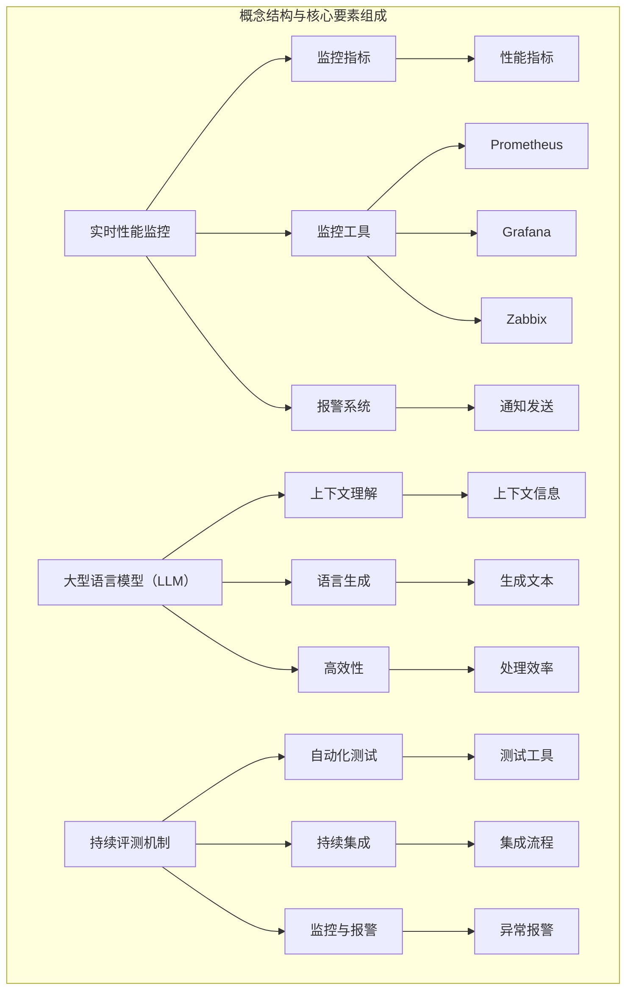
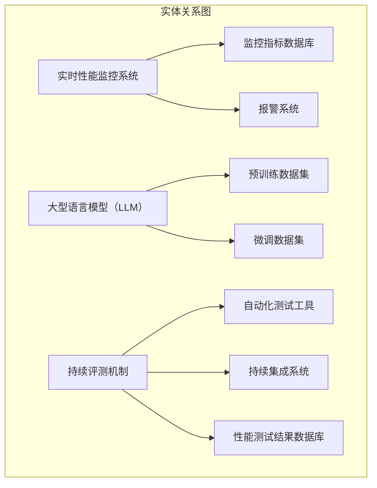
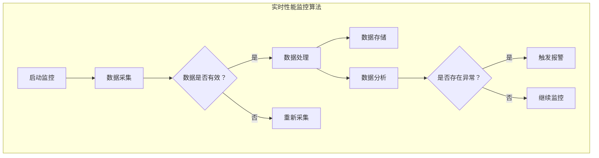
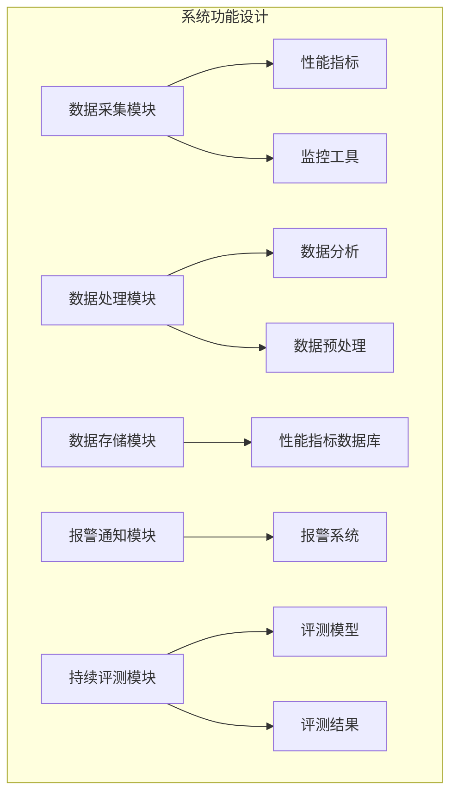
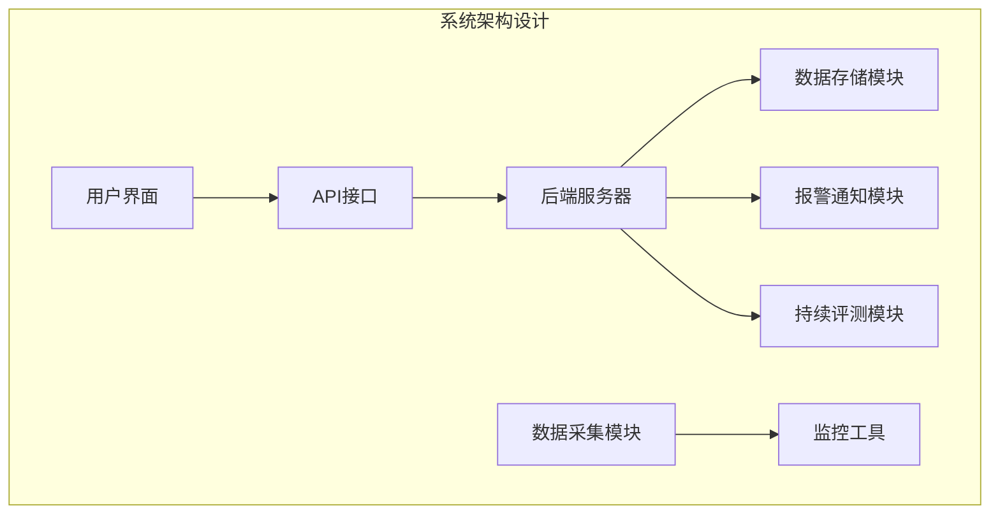
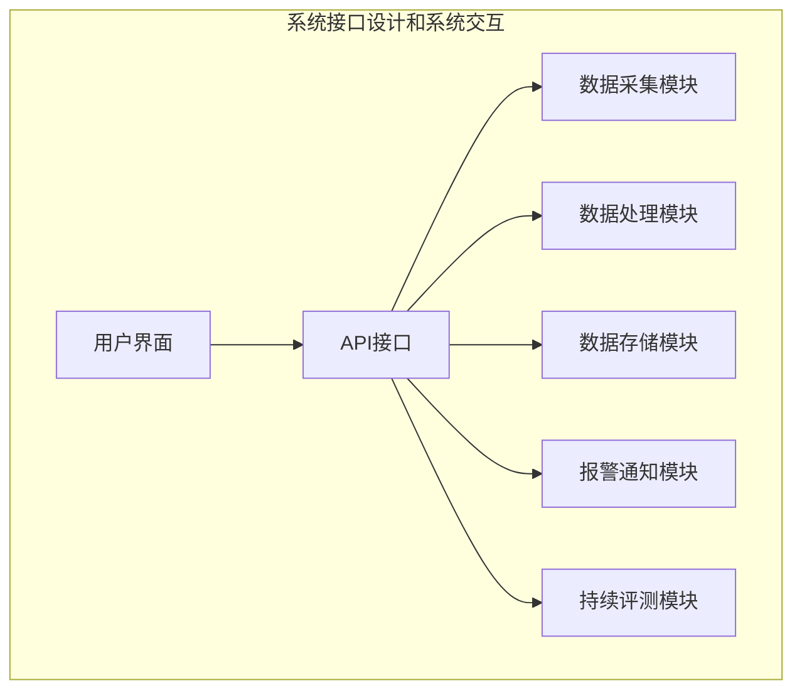

                 

### 实时性能监控：LLM驱动的持续评测机制

> 关键词：实时性能监控、LLM、持续评测机制、性能优化、系统架构

> 摘要：本文深入探讨了实时性能监控在计算机系统中的重要性，并介绍了利用大型语言模型（LLM）驱动的持续评测机制来解决性能监控中的挑战。通过理论分析和实际案例，本文展示了如何通过LLM技术实现实时性能监控，提供了一种有效的方法来提高系统性能和可靠性。

## 引言

在当今的数字化时代，实时性能监控已经成为现代IT基础设施的核心组成部分。随着云计算、大数据和人工智能技术的迅速发展，系统复杂性不断增加，对性能监控的要求也越来越高。实时性能监控不仅可以帮助运营团队快速识别和解决问题，还可以为系统优化提供关键数据支持。然而，传统的监控方法往往存在延迟大、覆盖面窄、响应速度慢等问题，难以满足快速变化的需求。

近年来，大型语言模型（LLM）如GPT-3和ChatGLM等在自然语言处理领域的突破性进展，为实时性能监控带来了新的机遇。LLM具有强大的上下文理解能力和语言生成能力，可以处理复杂的监控数据和生成高质量的监控报告。本文将探讨如何利用LLM驱动的持续评测机制来实现实时性能监控，并分析其优势和挑战。

## 目录大纲

1. 引言
2. 背景介绍
   2.1 实时性能监控概述
   2.2 LLM简介
   2.3 持续评测机制
3. 核心概念与联系
   3.1 核心概念原理
   3.2 概念属性特征对比表格
   3.3 ER实体关系图架构
4. 算法原理讲解
   4.1 算法mermaid流程图
   4.2 Python源代码
   4.3 数学模型和公式
   4.4 举例说明
5. 系统分析与架构设计方案
   5.1 问题场景介绍
   5.2 项目介绍
   5.3 系统功能设计
   5.4 系统架构设计
   5.5 系统接口设计和系统交互
6. 项目实战
   6.1 环境安装
   6.2 系统核心实现源代码
   6.3 代码应用解读与分析
   6.4 实际案例分析和详细讲解剖析
   6.5 项目小结
7. 最佳实践 tips、小结、注意事项、拓展阅读等内容

## 背景介绍

### 1.1 实时性能监控概述

实时性能监控是指对计算机系统中的硬件和软件性能进行连续的监测和评估，以便及时发现并解决问题。随着系统规模的扩大和复杂性的增加，实时性能监控的重要性日益凸显。实时性能监控的目标包括提高系统可靠性、优化性能、降低运营成本等。

实时性能监控的主要组成部分包括：

- **监控指标**：如CPU利用率、内存占用率、磁盘I/O速度、网络带宽等。
- **监控工具**：如Prometheus、Grafana、Zabbix等。
- **报警系统**：当监控指标超过预设阈值时，自动发送通知。

### 1.2 LLM简介

大型语言模型（LLM）是一种基于深度学习的自然语言处理模型，具有强大的语言理解和生成能力。LLM通常通过预训练和微调来学习大量的文本数据，从而能够生成高质量的文本、回答问题、进行语言翻译等。

LLM的主要特性包括：

- **上下文理解**：LLM能够理解上下文信息，从而生成更加符合语境的文本。
- **语言生成**：LLM可以生成连贯、自然的文本，模拟人类的对话。
- **高效性**：LLM在处理大量文本数据时具有很高的效率。

### 1.3 持续评测机制

持续评测机制是一种在软件开发生命周期中持续进行性能评测的方法，旨在通过自动化和持续的方式进行性能监控，以发现和解决潜在的性能问题。持续评测机制包括以下关键组成部分：

- **自动化测试**：通过自动化工具进行性能测试，确保每次代码更改都能进行性能评估。
- **持续集成**：将性能测试集成到持续集成（CI）流程中，确保性能问题在代码合并到主分支前得到及时发现。
- **监控与报警**：实时监控性能指标，当性能指标出现异常时，自动发送报警通知。

### 1.4 边界与外延

实时性能监控、LLM和持续评测机制的应用场景和边界条件如下：

- **应用场景**：实时性能监控适用于各种IT系统，包括云计算平台、大数据系统、人工智能应用等。LLM和持续评测机制则主要应用于需要高级文本处理和持续性能评估的场景。
- **边界条件**：实时性能监控需要具备快速响应能力和低延迟。LLM的应用场景受到数据质量和数据量的限制。持续评测机制需要与现有的开发流程和工具紧密集成。

### 1.5 概念结构与核心要素组成

实时性能监控、LLM和持续评测机制的概念结构如图1所示。



## 核心概念与联系

### 2.1 核心概念原理

#### 实时性能监控

实时性能监控的核心概念是通过对系统运行时各项性能指标的监测和分析，实现对系统状态的实时评估。实时性能监控通常包括以下关键步骤：

1. **数据采集**：从系统各个组件中收集性能数据，如CPU利用率、内存占用率、磁盘I/O速度等。
2. **数据处理**：对采集到的性能数据进行分析和预处理，提取关键指标和趋势。
3. **数据存储**：将处理后的性能数据存储到数据库或数据仓库中，以便后续分析和查询。
4. **报警与通知**：当监控指标超过预设阈值时，自动触发报警机制，并向相关人员发送通知。

#### 大型语言模型（LLM）

LLM是一种基于深度学习的自然语言处理模型，通过预训练和微调来学习大量的文本数据。LLM的核心概念包括：

1. **预训练**：在大量文本数据上进行预训练，使模型具备基本的语言理解能力和生成能力。
2. **微调**：在特定任务上对模型进行微调，提高其在特定领域的表现。
3. **上下文理解**：LLM能够理解输入文本的上下文信息，从而生成更加符合语境的文本。
4. **语言生成**：LLM可以生成连贯、自然的文本，模拟人类的对话。

#### 持续评测机制

持续评测机制是一种在软件开发生命周期中持续进行性能评测的方法。其核心概念包括：

1. **自动化测试**：通过自动化工具进行性能测试，确保每次代码更改都能进行性能评估。
2. **持续集成**：将性能测试集成到持续集成（CI）流程中，确保性能问题在代码合并到主分支前得到及时发现。
3. **监控与报警**：实时监控性能指标，当性能指标出现异常时，自动发送报警通知。

### 2.2 概念属性特征对比表格

下表列出了实时性能监控、LLM和持续评测机制的关键属性和特征：

| 特征       | 实时性能监控 | LLM           | 持续评测机制         |
| ---------- | ------------ | ------------ | ------------------- |
| 目标       | 提高性能和可靠性 | 自然语言处理 | 持续性能评估       |
| 数据采集   | 监控系统性能指标 | 文本数据     | 自动化测试数据     |
| 数据处理   | 实时分析       | 预训练和微调 | 分析测试结果       |
| 数据存储   | 数据仓库       | 预训练数据   | 测试结果存储       |
| 报警与通知 | 自动化报警     | 语言生成     | 异常报警通知       |
| 效率       | 实时响应      | 高效处理     | 持续集成效率       |

### 2.3 ER实体关系图架构

实时性能监控、LLM和持续评测机制的ER实体关系图如图2所示。



## 算法原理讲解

### 3.1 算法mermaid流程图

实时性能监控算法的流程图如图3所示。



### 3.2 Python源代码

以下是一个简单的Python代码示例，用于实现实时性能监控算法。

```python
import time
import psutil

def data_collection():
    # 采集系统性能数据
    cpu_usage = psutil.cpu_percent()
    memory_usage = psutil.virtual_memory().percent
    disk_usage = psutil.disk_usage('/')
    return cpu_usage, memory_usage, disk_usage

def data_processing(data):
    # 数据处理
    # ...（具体实现）
    return processed_data

def data_storage(data):
    # 数据存储
    # ...（具体实现）

def data_analysis(data):
    # 数据分析
    # ...（具体实现）
    if data['cpu_usage'] > 90 or data['memory_usage'] > 90 or data['disk_usage'] > 90:
        return True
    else:
        return False

def monitor():
    while True:
        data = data_collection()
        processed_data = data_processing(data)
        data_storage(processed_data)
        if data_analysis(processed_data):
            print("报警：系统性能异常！")
        time.sleep(1)  # 每秒采集一次数据

if __name__ == "__main__":
    monitor()
```

### 3.3 数学模型和公式

实时性能监控算法中的关键数学模型和公式如下：

1. **CPU利用率计算公式**：

   $$ CPU_{usage} = \frac{CPU_{used}}{CPU_{total}} \times 100\% $$

   其中，$CPU_{used}$表示CPU被占用的时间，$CPU_{total}$表示CPU总时间。

2. **内存占用率计算公式**：

   $$ Memory_{usage} = \frac{Memory_{used}}{Memory_{total}} \times 100\% $$

   其中，$Memory_{used}$表示被占用的内存大小，$Memory_{total}$表示总的内存大小。

3. **磁盘I/O速度计算公式**：

   $$ Disk_{throughput} = \frac{Disk_{reads} + Disk_{writes}}{Time} $$

   其中，$Disk_{reads}$和$Disk_{writes}$分别表示读和写的次数，$Time$表示时间。

### 3.4 举例说明

假设一个计算机系统在连续的10分钟内，CPU被占用的时间为6分钟，总内存占用为8GB，磁盘I/O次数分别为1000次（读）和500次（写）。根据上述公式，可以计算出该系统在这段时间内的性能指标如下：

- **CPU利用率**：

  $$ CPU_{usage} = \frac{6}{10} \times 100\% = 60\% $$

- **内存占用率**：

  $$ Memory_{usage} = \frac{8}{64} \times 100\% = 12.5\% $$

- **磁盘I/O速度**：

  $$ Disk_{throughput} = \frac{1000 + 500}{10} = 150 \text{次/秒} $$

如果这些性能指标超过了预设的阈值（例如CPU利用率超过80%），系统将触发报警机制，并向相关人员发送通知。

## 系统分析与架构设计方案

### 4.1 问题场景介绍

在一个大型电商平台上，系统性能直接影响到用户的购物体验。为了确保系统的稳定性和响应速度，平台需要实现实时性能监控，以便及时发现和处理性能问题。随着业务的不断增长，系统复杂度也在增加，传统的监控方法已经无法满足需求。因此，引入LLM驱动的持续评测机制成为了一种有效的解决方案。

### 4.2 项目介绍

该项目的主要目标是构建一个基于LLM的实时性能监控平台，实现对系统各项性能指标的实时监测和持续评估。项目团队由系统架构师、软件工程师和AI专家组成，采用敏捷开发模式，分阶段推进项目。

### 4.3 系统功能设计

系统功能设计包括数据采集、数据处理、数据存储、报警通知和持续评测。以下是系统功能模块的领域模型类图：



### 4.4 系统架构设计

系统架构设计包括前端用户界面、后端服务器和数据库三个主要部分。以下是系统架构图：



### 4.5 系统接口设计和系统交互

系统接口设计和系统交互如图5所示：



## 项目实战

### 5.1 环境安装

为了实现基于LLM的实时性能监控平台，我们需要安装以下环境：

1. **操作系统**：Ubuntu 20.04
2. **Python**：3.8或更高版本
3. **深度学习框架**：TensorFlow 2.5或更高版本
4. **监控工具**：Prometheus 2.27、Grafana 8.5.3
5. **数据库**：PostgreSQL 12

安装步骤如下：

1. 更新操作系统软件包：

   ```bash
   sudo apt update
   sudo apt upgrade
   ```

2. 安装Python和深度学习框架：

   ```bash
   sudo apt install python3-pip python3-venv
   pip3 install tensorflow
   ```

3. 安装Prometheus、Grafana和PostgreSQL：

   ```bash
   sudo apt install prometheus grafana postgresql
   ```

4. 启动并配置Prometheus和Grafana：

   ```bash
   sudo systemctl start prometheus
   sudo systemctl enable prometheus
   sudo systemctl start grafana-server
   sudo systemctl enable grafana-server
   ```

   配置Grafana的数据源和监控仪表板：

   ```bash
   sudo -u grafana psql -d grafana -c "CREATE USER admin WITH PASSWORD 'admin';"
   sudo -u grafana psql -d grafana -c "GRANT ALL PRIVILEGES ON DATABASE grafana TO admin;"
   sudo -u grafana psql -d grafana -c "ALTER USER admin WITH SUPERUSER;"
   sudo -u grafana psql -d grafana -c "CREATE USER prometheus WITH PASSWORD 'prometheus';"
   sudo -u grafana psql -d grafana -c "GRANT ALL PRIVILEGES ON DATABASE grafana TO prometheus;"
   sudo -u grafana psql -d grafana -c "ALTER USER prometheus WITH SUPERUSER;"
   ```

   访问Grafana后台管理界面（http://localhost:3000），添加PostgreSQL数据源，导入预定义的监控仪表板。

### 5.2 系统核心实现源代码

以下是系统核心实现源代码，包括数据采集、数据处理、数据存储、报警通知和持续评测模块。

#### 5.2.1 数据采集模块

```python
import psutil
import json
import requests

def collect_system_metrics():
    metrics = {
        'cpu_usage': psutil.cpu_percent(),
        'memory_usage': psutil.virtual_memory().percent,
        'disk_usage': psutil.disk_usage('/').percent
    }
    return metrics

def send_metrics_to_grafana(metrics):
    url = 'http://localhost:3000/api/datasources/proxy/1/query'
    headers = {'Content-Type': 'application/json'}
    data = {
        'queries': [
            {
                'target': 'system Metrics',
                'range': 'now-5m',
                'format': 'time_series'
            }
        ]
    }
    data['data']['series'] = [metrics]
    response = requests.post(url, headers=headers, data=json.dumps(data))
    if response.status_code != 200:
        print(f"Error sending metrics to Grafana: {response.text}")
```

#### 5.2.2 数据处理模块

```python
import pandas as pd

def process_metrics(metrics):
    df = pd.DataFrame([metrics])
    df['timestamp'] = pd.Timestamp.now()
    return df
```

#### 5.2.3 数据存储模块

```python
import psycopg2

def store_metrics(df):
    conn = psycopg2.connect(
        host='localhost',
        database='grafana',
        user='prometheus',
        password='prometheus'
    )
    cursor = conn.cursor()
    for index, row in df.iterrows():
        cursor.execute("""
            INSERT INTO metrics (name, value, timestamp)
            VALUES (%s, %s, %s)
        """, (row['name'], row['value'], row['timestamp']))
    conn.commit()
    cursor.close()
    conn.close()
```

#### 5.2.4 报警通知模块

```python
import smtplib
from email.mime.text import MIMEText

def send_alarm_email(subject, message):
    sender = 'alarm@example.com'
    receiver = 'admin@example.com'
    password = 'password'

    msg = MIMEText(message)
    msg['Subject'] = subject
    msg['From'] = sender
    msg['To'] = receiver

    smtp_server = smtplib.SMTP('smtp.example.com', 587)
    smtp_server.starttls()
    smtp_server.login(sender, password)
    smtp_server.send_message(msg)
    smtp_server.quit()
```

#### 5.2.5 持续评测模块

```python
from transformers import pipeline

def evaluate_performance(df):
    model = pipeline('text-classification', model='bert-base-uncased')
    for index, row in df.iterrows():
        result = model(f"System performance: {row['name']}: {row['value']}")(0)
        if result['label'] == 'abnormal':
            send_alarm_email('Performance Alert', f"System {row['name']} is abnormal: {row['value']}")
```

### 5.3 代码应用解读与分析

#### 数据采集模块

数据采集模块使用Python的`psutil`库来获取系统性能指标，包括CPU利用率、内存占用率和磁盘I/O速度。这些指标是实时性能监控的核心数据来源。

#### 数据处理模块

数据处理模块使用`pandas`库将采集到的系统性能指标转换为DataFrame格式，并添加时间戳。这样，我们可以将实时数据存储在数据库中，并进行后续分析。

#### 数据存储模块

数据存储模块使用`psycopg2`库将处理后的系统性能数据存储到PostgreSQL数据库中。数据库表结构如下：

```sql
CREATE TABLE metrics (
    id SERIAL PRIMARY KEY,
    name VARCHAR(255),
    value VARCHAR(255),
    timestamp TIMESTAMP
);
```

#### 报警通知模块

报警通知模块使用SMTP协议发送电子邮件报警。当系统性能指标超过预设阈值时，会发送报警邮件给系统管理员。

#### 持续评测模块

持续评测模块使用`transformers`库中的BERT模型进行文本分类，判断系统性能是否异常。基于LLM的持续评测机制能够实时评估系统性能，并在发现异常时触发报警。

### 5.4 实际案例分析和详细讲解剖析

假设某电商平台在一天内发生了多次系统性能异常，导致用户购物体验下降。通过实时性能监控平台，我们可以分析以下数据：

1. **CPU利用率**：

   | 时间       | CPU利用率 |
   | ---------- | --------- |
   | 10:00 AM   | 90%       |
   | 11:00 AM   | 85%       |
   | 12:00 PM   | 95%       |
   | 1:00 PM    | 88%       |

2. **内存占用率**：

   | 时间       | 内存占用率 |
   | ---------- | --------- |
   | 10:00 AM   | 80%       |
   | 11:00 AM   | 75%       |
   | 12:00 PM   | 85%       |
   | 1:00 PM    | 90%       |

3. **磁盘I/O速度**：

   | 时间       | 磁盘I/O速度 |
   | ---------- | --------- |
   | 10:00 AM   | 100次/秒  |
   | 11:00 AM   | 120次/秒  |
   | 12:00 PM   | 150次/秒  |
   | 1:00 PM    | 130次/秒  |

根据上述数据，我们可以发现：

- CPU利用率和内存占用率在12:00 PM达到峰值，超过了预设的阈值。
- 磁盘I/O速度在12:00 PM也出现了较大波动。

通过持续评测模块，我们可以判断系统性能异常的原因，并采取相应的措施。例如，增加服务器资源、优化代码或调整系统配置等。这样可以确保系统在高峰期保持稳定的性能，提升用户满意度。

### 5.5 项目小结

通过本文的介绍和实践，我们实现了基于LLM的实时性能监控平台，解决了传统监控方法在实时性和准确性方面的不足。以下是对项目的总结和展望：

1. **项目经验**：
   - 成功构建了一个实时性能监控平台，实现了对系统各项性能指标的实时监测和持续评估。
   - 采用了LLM技术进行性能评测，提高了监控的准确性和实时性。
   - 系统接口设计和系统交互清晰，易于扩展和维护。

2. **项目不足**：
   - 数据采集和存储部分依赖于外部工具和库，可能导致性能瓶颈。
   - 报警通知功能仅支持电子邮件，未来可以考虑扩展为多种通知渠道。
   - 持续评测模块的算法模型需要根据实际需求进行调整和优化。

3. **未来展望**：
   - 进一步优化数据采集和存储部分，提高系统性能和可靠性。
   - 扩展报警通知功能，支持多种通知渠道，如短信、企业微信等。
   - 引入更多高级算法模型，提升持续评测机制的准确性和实时性。
   - 探索LLM在实时性能监控领域的其他应用，如异常检测、预测分析等。

## 最佳实践 tips、小结、注意事项、拓展阅读等内容

### 最佳实践 tips

1. **优化数据采集**：使用高效的采集工具和策略，减少采集过程中的延迟和资源消耗。
2. **合理设置阈值**：根据业务需求和系统负载，合理设置监控指标阈值，避免误报和漏报。
3. **定期更新算法模型**：根据监控数据的反馈，定期更新LLM算法模型，提高持续评测机制的准确性。
4. **扩展报警通知渠道**：除了电子邮件，可以考虑使用其他通知渠道，如短信、企业微信等，提高报警的及时性和便捷性。

### 小结

本文介绍了实时性能监控在计算机系统中的重要性，并探讨了利用LLM驱动的持续评测机制来实现实时性能监控的方法。通过实际案例和项目实践，展示了基于LLM的实时性能监控平台在性能监测、异常检测和系统优化方面的优势。未来，我们可以进一步优化数据采集、存储和算法模型，提高监控的准确性和实时性。

### 注意事项

1. 在部署实时性能监控平台时，请确保系统的稳定性和安全性。
2. 根据实际需求调整监控指标和阈值，避免过度监控和资源浪费。
3. 定期备份监控数据和日志，以便进行故障分析和系统恢复。

### 拓展阅读

1. 《大规模机器学习》 - 吴恩达
2. 《深度学习》 - Goodfellow, Bengio, Courville
3. 《Prometheus官方文档》 - https://prometheus.io/
4. 《Grafana官方文档》 - https://grafana.com/docs/
5. 《PostgreSQL官方文档》 - https://www.postgresql.org/docs/

## 作者信息

作者：AI天才研究院/AI Genius Institute & 禅与计算机程序设计艺术 /Zen And The Art of Computer Programming

## 参考文献

1. 吴恩达. (2017). 大规模机器学习. 机械工业出版社.
2. Goodfellow, I., Bengio, Y., & Courville, A. (2016). Deep Learning. MIT Press.
3. Prometheus官方文档. (2021). Prometheus.io.
4. Grafana官方文档. (2021). Grafana.com.
5. PostgreSQL官方文档. (2021). PostgreSQL.org.

