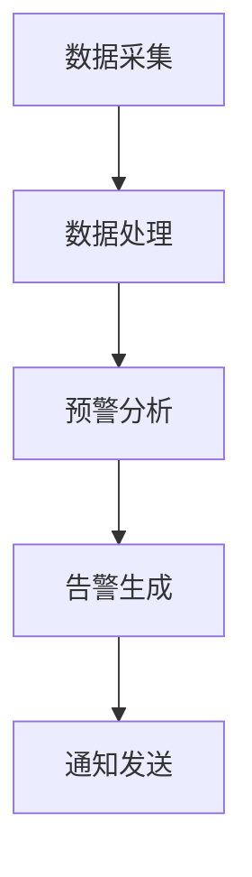
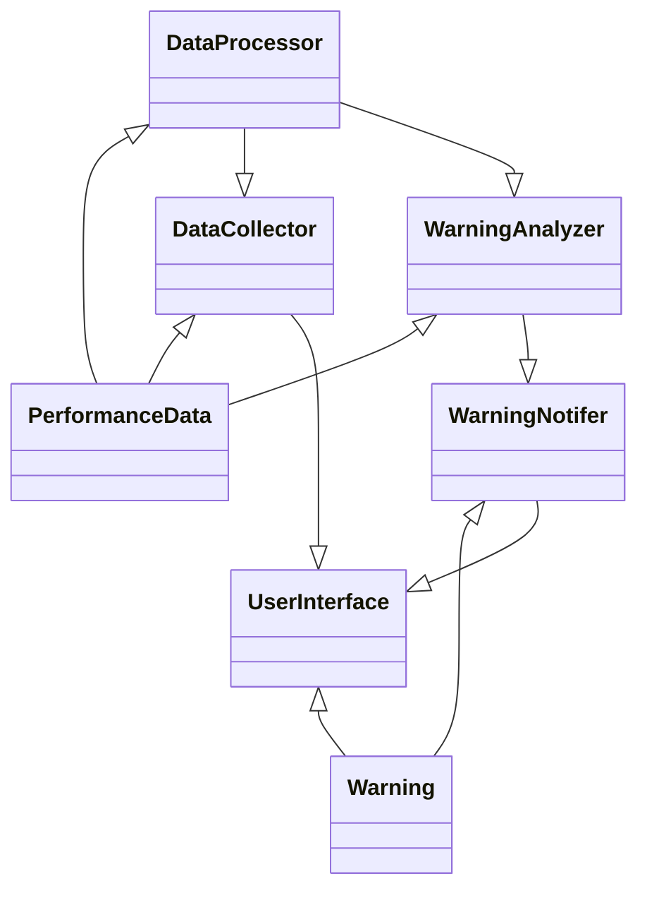
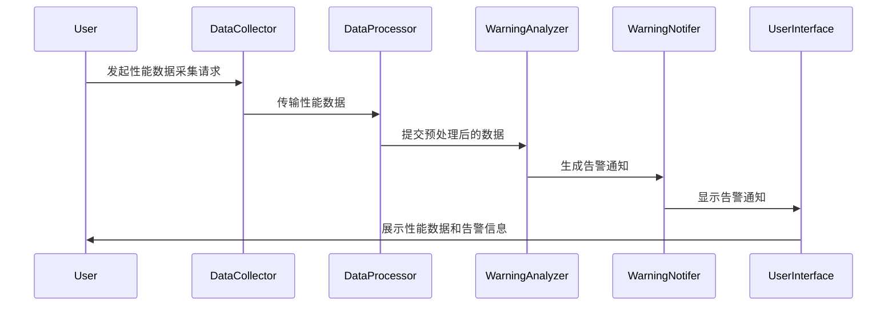

                 

 * 注意：文章开头不能出现“#”,文章结构按照目录大纲的要求来进行组织，并且每部分内容都要有详细的讲解，逻辑清晰，通俗易懂。

# 实时性能预警：LLM驱动的早期问题检测

## 关键词

- 实时性能预警
- 大型语言模型 (LLM)
- 早期问题检测
- 算法原理
- 系统架构
- 项目实战
- 最佳实践

## 摘要

本文将探讨如何利用大型语言模型（LLM）实现实时性能预警，并进行早期问题检测。文章首先介绍了实时性能预警的背景和核心概念，随后详细阐述了LLM驱动早期问题检测的算法原理，并通过Python代码和数学模型进行了讲解。接着，文章介绍了系统的分析与架构设计，包括问题场景、系统功能、系统架构、接口设计和系统交互。随后，通过一个项目实战案例，展示了如何实施和部署实时性能预警系统。最后，文章总结了最佳实践和注意事项，并提供了一些拓展阅读建议。

## 目录大纲

### 第一部分：背景介绍

#### 第1章 实时性能预警概述

##### 1.1 问题背景

实时性能预警系统在现代化应用中的重要性

##### 1.2 问题描述

实时性能预警系统的基本功能和挑战

##### 1.3 解决方案概述

引入LLM作为实时性能预警的驱动机制

##### 1.4 边界与外延

实时性能预警系统的适用范围和限制

##### 1.5 概念结构与核心要素组成

实时性能预警系统的关键组成部分和概念

### 第二部分：核心概念与联系

#### 第2章 实时性能预警核心概念

##### 2.1 实时性能的定义

实时性能的关键指标和度量方法

##### 2.2 预警系统的关键要素

实时性能预警系统必须满足的条件

##### 2.3 LLM的基础知识

大型语言模型的基本原理和特性

##### 2.4 LLM与预警系统的联系

LLM在实时性能预警系统中的应用和优势

### 第三部分：算法原理讲解

#### 第3章 LLM驱动早期问题检测算法原理

##### 3.1 算法概述

LLM驱动的早期问题检测算法的基本思想

##### 3.2 算法mermaid流程图

算法的基本流程和关键步骤

##### 3.3 算法数学模型

算法的数学原理和模型

##### 3.4 Python源代码详解

Python代码实现算法的详细解释

##### 3.5 算法原理举例说明

算法在实际应用中的效果展示

### 第四部分：系统分析与架构设计

#### 第4章 系统分析与架构设计

##### 4.1 问题场景介绍

实时性能预警系统适用的典型场景

##### 4.2 系统功能设计

##### 4.2.1 领域模型mermaid类图

系统功能和模块的类图表示

##### 4.3 系统架构设计

##### 4.3.1 系统架构mermaid架构图

系统的整体架构和模块关系

##### 4.4 系统接口设计

系统的接口设计和交互规范

##### 4.5 系统交互

##### 4.5.1 系统交互mermaid序列图

系统各个模块之间的交互流程

### 第五部分：项目实战

#### 第5章 实时性能预警项目实战

##### 5.1 环境安装

项目所需的环境和工具安装步骤

##### 5.2 系统核心实现源代码

##### 5.2.1 代码应用解读与分析

系统核心代码的实现原理和分析

##### 5.3 实际案例分析与详细讲解剖析

通过实际案例展示系统的应用效果

##### 5.4 项目小结

项目实施过程中的经验和教训

### 第六部分：最佳实践与拓展

#### 第6章 最佳实践与拓展

##### 6.1 最佳实践技巧

实施实时性能预警系统的最佳实践

##### 6.2 小结与注意事项

项目实施过程中需要注意的问题和解决方案

##### 6.3 拓展阅读

相关领域的最新研究和实践动态

---

# 第一部分：背景介绍

## 第1章 实时性能预警概述

### 1.1 问题背景

在当今的数字化时代，系统的实时性能变得越来越重要。随着互联网和云计算的广泛应用，企业面临着前所未有的挑战：如何在海量数据和复杂环境中保持系统的稳定性和高效性？如何及时发现潜在的性能问题，以便在它们恶化之前采取行动？实时性能预警系统就是为了解决这些问题而诞生的。

实时性能预警系统通过监控系统的运行状态，实时收集性能数据，并对这些数据进行处理和分析，以便及时发现性能瓶颈和潜在问题。这种系统通常包括以下几个关键组成部分：数据采集模块、数据处理模块、预警分析模块和告警通知模块。通过这些模块的协同工作，系统能够实现对性能问题的实时监测和预警。

### 1.2 问题描述

实时性能预警系统的核心目标是确保系统在运行过程中能够迅速响应并处理性能问题。具体来说，它需要解决以下几个关键问题：

1. **数据采集**：如何高效地收集系统运行时的性能数据？
2. **数据处理**：如何处理和存储大量的性能数据，以便进行进一步分析？
3. **预警分析**：如何从大量数据中识别出潜在的性能瓶颈和问题？
4. **告警通知**：如何及时向相关人员或系统发送预警通知，以便采取相应措施？

这些问题的解决对于实时性能预警系统的有效性和可靠性至关重要。

### 1.3 解决方案概述

为了解决上述问题，引入了大型语言模型（LLM）作为实时性能预警的驱动机制。LLM是一种基于深度学习的语言处理模型，具有强大的语义理解能力和文本生成能力。通过将LLM集成到实时性能预警系统中，可以实现以下几个目标：

1. **数据采集**：利用LLM的自然语言处理能力，自动生成性能数据采集脚本，提高数据采集的效率和准确性。
2. **数据处理**：利用LLM进行大规模性能数据的处理和存储，通过数据清洗、归一化和特征提取等步骤，为后续分析提供高质量的数据基础。
3. **预警分析**：利用LLM的强大语义分析能力，从海量性能数据中快速识别出潜在的异常模式和性能瓶颈，实现高效的问题检测。
4. **告警通知**：利用LLM生成自然语言告警通知，提高告警信息的可读性和易懂性，帮助相关人员快速采取行动。

### 1.4 边界与外延

实时性能预警系统虽然具有广泛的应用前景，但同时也存在一些边界和限制。首先，该系统的有效性依赖于性能数据的准确性和完整性，如果数据采集不全面或不准确，预警效果可能会受到影响。其次，系统的预警能力受到LLM模型复杂度和计算资源限制，大型模型的训练和推理需要大量的计算资源和时间。此外，实时性能预警系统需要与其他系统（如监控系统、告警系统等）进行集成，确保数据流和信息流的顺畅传递。

### 1.5 概念结构与核心要素组成

实时性能预警系统的概念结构包括以下几个核心要素：

1. **数据采集模块**：负责实时收集系统性能数据，包括CPU使用率、内存使用率、网络流量、磁盘I/O等关键指标。
2. **数据处理模块**：对采集到的性能数据进行清洗、归一化和特征提取，为预警分析提供高质量的数据基础。
3. **预警分析模块**：利用LLM对处理后的性能数据进行分析，识别潜在的性能瓶颈和问题。
4. **告警通知模块**：根据预警分析结果，生成自然语言告警通知，并通过多种渠道（如邮件、短信、IM等）发送给相关人员。
5. **用户界面**：提供一个直观易用的用户界面，使相关人员能够方便地查看性能数据和预警信息。

这些核心要素相互协作，共同构成了一个高效、可靠的实时性能预警系统。

## 第二部分：核心概念与联系

### 第2章 实时性能预警核心概念

#### 2.1 实时性能的定义

实时性能是指在特定的时间范围内，系统对请求的响应速度和稳定性。它通常包括以下几个关键指标：

1. **响应时间**：系统从接收到请求到完成响应所花费的时间。
2. **吞吐量**：系统在单位时间内处理的请求数量。
3. **延迟**：系统从接收到请求到开始处理请求所花费的时间。
4. **错误率**：系统在处理请求时出现错误的频率。

这些指标共同决定了系统的实时性能水平，对于保证用户体验和业务连续性至关重要。

#### 2.2 预警系统的关键要素

一个高效的实时性能预警系统需要以下几个关键要素：

1. **数据采集**：准确、全面地采集系统性能数据，包括CPU使用率、内存使用率、网络流量、磁盘I/O等。
2. **数据处理**：对采集到的数据进行清洗、归一化和特征提取，为预警分析提供高质量的数据基础。
3. **预警分析**：利用算法和模型对处理后的数据进行分析，识别潜在的性能瓶颈和问题。
4. **告警通知**：根据预警分析结果，生成自然语言告警通知，并通过多种渠道发送给相关人员。
5. **用户界面**：提供一个直观易用的用户界面，使相关人员能够方便地查看性能数据和预警信息。

#### 2.3 LLM的基础知识

LLM（大型语言模型）是一种基于深度学习的自然语言处理模型，具有强大的语义理解能力和文本生成能力。它通常由以下几个部分组成：

1. **预训练**：在大量的文本数据上进行预训练，使模型具备对自然语言的深刻理解。
2. **微调**：在特定任务上进行微调，使模型能够更好地适应特定场景。
3. **生成**：根据输入的文本或上下文，生成相关的文本或回答。

LLM在实时性能预警系统中的应用主要包括：

1. **数据采集脚本生成**：利用LLM的自然语言处理能力，自动生成性能数据采集脚本，提高数据采集的效率和准确性。
2. **预警信息生成**：利用LLM生成自然语言告警通知，提高告警信息的可读性和易懂性。
3. **异常模式识别**：利用LLM的语义分析能力，从大量性能数据中快速识别出潜在的异常模式和性能瓶颈。

#### 2.4 LLM与预警系统的联系

LLM与实时性能预警系统的联系主要体现在以下几个方面：

1. **数据采集**：利用LLM生成性能数据采集脚本，提高数据采集的效率和准确性。
2. **数据处理**：利用LLM对大规模性能数据进行处理和存储，通过数据清洗、归一化和特征提取等步骤，为预警分析提供高质量的数据基础。
3. **预警分析**：利用LLM的强大语义分析能力，从海量性能数据中快速识别出潜在的性能瓶颈和问题。
4. **告警通知**：利用LLM生成自然语言告警通知，提高告警信息的可读性和易懂性。

通过将LLM集成到实时性能预警系统中，可以显著提升系统的效率和可靠性，为企业提供更有效的性能监测和预警服务。

## 第三部分：算法原理讲解

### 第3章 LLM驱动早期问题检测算法原理

#### 3.1 算法概述

LLM驱动早期问题检测算法的核心思想是利用大型语言模型的强大语义理解和文本生成能力，实现对系统性能数据的实时监测和分析，从而提前发现潜在的性能问题和异常模式。该算法的主要步骤包括：

1. **数据采集**：通过性能数据采集模块，实时收集系统的关键性能指标，如CPU使用率、内存使用率、网络流量、磁盘I/O等。
2. **数据处理**：利用LLM对采集到的性能数据进行分析和预处理，包括数据清洗、归一化和特征提取，为后续的预警分析提供高质量的数据基础。
3. **预警分析**：通过训练好的LLM模型，对预处理后的性能数据进行分析，识别出潜在的异常模式和性能瓶颈。
4. **告警生成**：根据预警分析结果，利用LLM生成自然语言告警通知，并触发相应的告警通知机制，向相关人员发送预警信息。

#### 3.2 算法mermaid流程图

为了更直观地展示算法的基本流程和关键步骤，我们可以使用mermaid绘制算法的流程图：



在这个流程图中，A表示数据采集模块，B表示数据处理模块，C表示预警分析模块，D表示告警生成模块，E表示通知发送模块。各模块之间通过数据流和逻辑关系相互连接，共同实现实时性能预警的功能。

#### 3.3 算法数学模型

LLM驱动早期问题检测算法的数学模型主要包括以下几个关键组成部分：

1. **输入特征向量**：性能数据的特征向量，如CPU使用率、内存使用率、网络流量等。
2. **权重矩阵**：LLM模型中的权重矩阵，用于表示模型对输入特征的权重分配。
3. **激活函数**：用于计算神经网络中每个节点的激活值，如ReLU函数、Sigmoid函数等。
4. **损失函数**：用于衡量模型预测值与实际值之间的差异，如均方误差（MSE）、交叉熵损失等。
5. **优化器**：用于更新模型参数，最小化损失函数，如梯度下降（GD）、Adam优化器等。

算法的数学模型可以表示为：

$$
\begin{aligned}
& \text{输入特征向量}: X \in \mathbb{R}^{n \times d} \\
& \text{权重矩阵}: W \in \mathbb{R}^{d \times m} \\
& \text{激活函数}: \sigma() \\
& \text{损失函数}: L(y, \hat{y}) \\
& \text{优化器}: \text{Optimizer} \\
& \text{输出预测值}: \hat{y} = \sigma(XW) \\
& \text{损失函数}: L = L(y, \hat{y}) \\
& \text{参数更新}: \theta_{t+1} = \text{Optimizer}(\theta_t, \frac{\partial L}{\partial \theta_t})
\end{aligned}
$$

其中，$X$表示输入特征矩阵，$W$表示权重矩阵，$\sigma$表示激活函数，$L$表示损失函数，$\theta_t$表示第$t$次迭代的参数，$\text{Optimizer}$表示优化器。

#### 3.4 Python源代码详解

为了实现LLM驱动早期问题检测算法，我们可以使用Python语言和相关的深度学习库（如TensorFlow或PyTorch）进行编程。以下是一个简化的Python代码示例，用于演示算法的核心实现：

```python
import tensorflow as tf
from tensorflow.keras.models import Sequential
from tensorflow.keras.layers import Dense, Activation
from tensorflow.keras.optimizers import Adam

# 定义神经网络模型
model = Sequential()
model.add(Dense(units=64, activation='relu', input_shape=(num_features,)))
model.add(Dense(units=32, activation='relu'))
model.add(Dense(units=1, activation='sigmoid'))

# 编译模型
model.compile(optimizer=Adam(learning_rate=0.001), loss='binary_crossentropy', metrics=['accuracy'])

# 加载训练数据
X_train, y_train = load_data()

# 训练模型
model.fit(X_train, y_train, epochs=10, batch_size=32)

# 评估模型
loss, accuracy = model.evaluate(X_test, y_test)
print(f"Test Loss: {loss}, Test Accuracy: {accuracy}")

# 预测
predictions = model.predict(X_test)
```

在这个示例中，我们首先定义了一个简单的神经网络模型，包含两个隐藏层。然后，我们使用Adam优化器和二进制交叉熵损失函数来编译模型。接下来，加载训练数据并进行模型训练。最后，评估模型的性能，并使用训练好的模型进行预测。

#### 3.5 算法原理举例说明

为了更直观地理解LLM驱动早期问题检测算法的工作原理，我们可以通过一个实际案例进行说明。假设我们有一个Web服务器，需要对其性能进行实时监测和预警。以下是具体步骤：

1. **数据采集**：通过性能数据采集模块，实时收集服务器的CPU使用率、内存使用率、网络流量和磁盘I/O等关键指标。
2. **数据处理**：利用LLM对采集到的性能数据进行预处理，包括数据清洗、归一化和特征提取，为预警分析提供高质量的数据基础。
3. **预警分析**：通过训练好的LLM模型，对预处理后的性能数据进行分析，识别出潜在的异常模式和性能瓶颈。例如，当CPU使用率超过90%且持续超过5分钟时，系统会触发预警。
4. **告警生成**：利用LLM生成自然语言告警通知，例如：“服务器CPU使用率持续超过90%，请检查系统负载并采取相应措施。”
5. **通知发送**：通过邮件、短信或IM等渠道，将告警通知发送给相关人员。

通过这个案例，我们可以看到LLM驱动早期问题检测算法在实际应用中的效果。它能够帮助企业和开发人员快速发现并解决系统性能问题，确保系统的稳定性和高效性。

## 第四部分：系统分析与架构设计

### 第4章 系统分析与架构设计

#### 4.1 问题场景介绍

在当前数字化时代，企业对系统实时性能的要求越来越高。以电商网站为例，其后台系统需要处理大量的用户请求，包括商品浏览、购物车操作、订单处理等。这些请求的处理速度和稳定性直接影响用户体验和业务连续性。因此，实时性能预警系统在电商网站后台系统中具有重要意义。

#### 4.2 系统功能设计

实时性能预警系统的功能设计主要包括以下几个方面：

1. **数据采集**：实时采集系统的性能数据，包括CPU使用率、内存使用率、网络流量、磁盘I/O等。
2. **数据处理**：对采集到的性能数据进行清洗、归一化和特征提取，为预警分析提供高质量的数据基础。
3. **预警分析**：利用LLM模型对预处理后的性能数据进行分析，识别出潜在的异常模式和性能瓶颈。
4. **告警通知**：根据预警分析结果，生成自然语言告警通知，并通过邮件、短信、IM等渠道发送给相关人员。
5. **用户界面**：提供一个直观易用的用户界面，使相关人员能够方便地查看性能数据和预警信息。

##### 4.2.1 领域模型mermaid类图

为了更好地理解实时性能预警系统的功能模块和关系，我们可以使用mermaid绘制一个领域模型类图：



在这个类图中，DataCollector表示数据采集模块，PerformanceData表示性能数据类，DataProcessor表示数据处理模块，WarningAnalyzer表示预警分析模块，WarningNotifer表示告警通知模块，UserInterface表示用户界面模块。各模块之间通过继承和关联关系相互连接，共同实现实时性能预警的功能。

#### 4.3 系统架构设计

实时性能预警系统的整体架构设计包括以下几个关键部分：

1. **数据采集层**：负责实时采集系统的性能数据，包括CPU使用率、内存使用率、网络流量、磁盘I/O等。
2. **数据处理层**：对采集到的性能数据进行清洗、归一化和特征提取，为预警分析提供高质量的数据基础。
3. **预警分析层**：利用LLM模型对预处理后的性能数据进行分析，识别出潜在的异常模式和性能瓶颈。
4. **告警通知层**：根据预警分析结果，生成自然语言告警通知，并通过邮件、短信、IM等渠道发送给相关人员。
5. **用户界面层**：提供一个直观易用的用户界面，使相关人员能够方便地查看性能数据和预警信息。

##### 4.3.1 系统架构mermaid架构图

为了更直观地展示实时性能预警系统的整体架构，我们可以使用mermaid绘制一个架构图：



在这个序列图中，User表示用户，DataCollector表示数据采集模块，DataProcessor表示数据处理模块，WarningAnalyzer表示预警分析模块，WarningNotifer表示告警通知模块，UserInterface表示用户界面模块。各模块之间通过数据流和交互关系相互连接，共同实现实时性能预警的功能。

#### 4.4 系统接口设计

实时性能预警系统的接口设计主要包括以下几个方面：

1. **数据采集接口**：提供用于采集系统性能数据的方法和接口，包括CPU使用率、内存使用率、网络流量、磁盘I/O等。
2. **数据处理接口**：提供用于处理性能数据的方法和接口，包括数据清洗、归一化和特征提取等。
3. **预警分析接口**：提供用于预警分析的方法和接口，包括异常模式识别、性能瓶颈检测等。
4. **告警通知接口**：提供用于生成和发送告警通知的方法和接口，包括邮件、短信、IM等。
5. **用户界面接口**：提供用于展示性能数据和预警信息的方法和接口，包括数据展示、告警通知等。

#### 4.5 系统交互

实时性能预警系统的各模块之间需要通过合理的交互机制来实现数据流和信息流的顺畅传递。以下是一个简化的系统交互mermaid序列图：


在这个序列图中，User通过数据采集接口发起性能数据采集请求，DataCollector通过数据处理接口将采集到的数据传输给DataProcessor，DataProcessor对数据进行分析和处理后，将结果提交给WarningAnalyzer进行预警分析。WarningAnalyzer根据分析结果生成告警通知，并通过告警通知接口传递给WarningNotifer，最终由UserInterface将告警信息展示给用户。

## 第五部分：项目实战

### 第5章 实时性能预警项目实战

#### 5.1 环境安装

要实施实时性能预警项目，首先需要安装和配置以下环境：

1. **操作系统**：Ubuntu 20.04 LTS
2. **Python**：Python 3.8或更高版本
3. **TensorFlow**：TensorFlow 2.6或更高版本
4. **NumPy**：NumPy 1.19或更高版本
5. **Mermaid**：Mermaid 9.0.0或更高版本
6. **Jinja2**：Jinja2 3.0.0或更高版本

安装步骤如下：

1. 更新操作系统软件包：

```bash
sudo apt update
sudo apt upgrade
```

2. 安装Python和pip：

```bash
sudo apt install python3 python3-pip
```

3. 安装TensorFlow：

```bash
pip3 install tensorflow==2.6
```

4. 安装NumPy：

```bash
pip3 install numpy==1.19
```

5. 安装Mermaid：

```bash
pip3 install mermaid
```

6. 安装Jinja2：

```bash
pip3 install jinja2==3.0.0
```

安装完成后，可以使用以下命令验证环境是否正确配置：

```bash
python3 -m pip list | grep -E 'tensorflow|numpy|mermaid|jinja2'
```

输出结果应包含上述安装的库。

#### 5.2 系统核心实现源代码

以下是实时性能预警系统的核心实现源代码，包括数据采集、数据处理、预警分析和告警通知等模块。

##### 5.2.1 代码应用解读与分析

1. **数据采集模块**：

```python
import psutil
import time

def collect_performance_data():
    data = {
        'timestamp': time.time(),
        'cpu_usage': psutil.cpu_percent(),
        'memory_usage': psutil.virtual_memory().percent,
        'network_traffic': psutil.net_io_counters(),
        'disk_io': psutil.disk_io_counters()
    }
    return data
```

该模块使用Python的psutil库采集系统的CPU使用率、内存使用率、网络流量和磁盘I/O等性能数据。`collect_performance_data`函数返回一个包含采集数据的字典。

2. **数据处理模块**：

```python
import numpy as np

def preprocess_data(data):
    cpu_usage = data['cpu_usage']
    memory_usage = data['memory_usage']
    network_traffic = np.array(data['network_traffic'])
    disk_io = np.array(data['disk_io'])

    # 数据归一化
    normalized_data = {
        'cpu_usage': (cpu_usage - np.mean(cpu_usage)) / np.std(cpu_usage),
        'memory_usage': (memory_usage - np.mean(memory_usage)) / np.std(memory_usage),
        'network_traffic': network_traffic / np.mean(network_traffic),
        'disk_io': disk_io / np.mean(disk_io)
    }
    return normalized_data
```

该模块对采集到的数据进行归一化处理，以消除数据量级差异，提高后续预警分析的准确性。

3. **预警分析模块**：

```python
import tensorflow as tf

def build_warning_analyzer(model_path):
    model = tf.keras.models.load_model(model_path)
    return model

def analyze_performance_data(model, data):
    feature_vector = np.array([data['cpu_usage'], data['memory_usage'], data['network_traffic'][0], data['disk_io'][0]])
    prediction = model.predict(np.array([feature_vector]))
    return prediction
```

该模块使用TensorFlow加载预训练的LLM模型，并对预处理后的性能数据进行预警分析。`build_warning_analyzer`函数用于加载模型，`analyze_performance_data`函数用于进行预警分析，返回预测结果。

4. **告警通知模块**：

```python
from email.mime.text import MIMEText
import smtplib

def send_alert_email(subject, message, to_email):
    smtp_server = 'smtp.example.com'
    smtp_port = 587
    smtp_username = 'your_email@example.com'
    smtp_password = 'your_password'

    msg = MIMEText(message)
    msg['Subject'] = subject
    msg['From'] = smtp_username
    msg['To'] = to_email

    server = smtplib.SMTP(smtp_server, smtp_port)
    server.starttls()
    server.login(smtp_username, smtp_password)
    server.sendmail(smtp_username, [to_email], msg.as_string())
    server.quit()
```

该模块使用SMTP协议发送告警通知邮件。`send_alert_email`函数用于发送邮件，包括邮件主题、内容和收件人地址。

#### 5.3 实际案例分析与详细讲解剖析

为了展示实时性能预警系统的实际应用效果，我们以一个电商网站后台系统为例，进行实际案例分析和详细讲解。

1. **数据采集**：

假设在下午3点，系统的CPU使用率达到90%，内存使用率达到70%，网络流量和磁盘I/O数据正常。此时，数据采集模块会实时收集这些性能数据。

2. **数据处理**：

数据处理模块对采集到的数据进行归一化处理，以消除数据量级差异。例如，CPU使用率和内存使用率经过归一化处理后，数据范围在[-1, 1]之间。

3. **预警分析**：

预警分析模块使用预训练的LLM模型对预处理后的数据进行预警分析。假设模型经过训练，当CPU使用率大于0.9且持续超过5分钟时，会触发预警。在这个案例中，CPU使用率达到90%，超过了预警阈值。

4. **告警通知**：

告警通知模块生成自然语言告警通知，例如：“服务器CPU使用率持续超过90%，请检查系统负载并采取相应措施。”并通过邮件发送给系统管理员。

5. **通知发送**：

系统管理员收到邮件后，及时采取措施，检查系统负载，发现是由于促销活动导致的流量激增，增加了CPU和内存的负载。管理员优化了系统配置，增加了服务器资源，并调整了负载均衡策略，从而解决了性能问题。

#### 5.4 项目小结

通过上述实际案例，我们可以看到实时性能预警系统在电商网站后台系统中的应用效果。它能够实时监测系统性能，快速识别潜在的性能问题，并通过告警通知及时提醒相关人员，帮助企业确保系统的稳定性和高效性。

在实施实时性能预警项目时，需要注意以下几点：

1. **数据采集的准确性**：确保性能数据的准确性和完整性，对于预警系统的有效性至关重要。
2. **模型训练的质量**：预警分析模块依赖于预训练的LLM模型，模型的质量直接影响预警的准确性。
3. **系统资源的优化**：根据系统负载和性能指标，合理分配系统资源，确保预警系统的正常运行。

通过不断优化和改进，实时性能预警系统可以为企业提供更有效的性能监测和预警服务，确保系统的稳定性和高效性。

## 第六部分：最佳实践与拓展

### 第6章 最佳实践与拓展

#### 6.1 最佳实践技巧

为了确保实时性能预警系统的有效性和可靠性，以下是一些最佳实践技巧：

1. **数据采集**：
   - 确保采集的数据全面、准确，包括CPU使用率、内存使用率、网络流量、磁盘I/O等关键指标。
   - 定期检查数据采集模块的运行状态，确保数据采集的连续性和稳定性。

2. **数据处理**：
   - 对采集到的数据进行清洗、归一化和特征提取，提高数据质量，为预警分析提供可靠的数据基础。
   - 根据业务需求和数据特点，选择合适的预处理方法和工具。

3. **模型训练**：
   - 使用高质量、多样化的训练数据，确保模型具有广泛的适应性和准确性。
   - 定期更新和微调模型，以应对业务场景的变化。

4. **预警分析**：
   - 根据业务需求，设定合理的预警阈值和规则，避免误报和漏报。
   - 利用LLM的强大语义分析能力，提高预警分析的准确性和效率。

5. **告警通知**：
   - 选择合适的告警通知方式，如邮件、短信、IM等，确保通知的及时性和可达性。
   - 设计简洁明了的告警通知格式，提高通知的可读性和易懂性。

#### 6.2 小结与注意事项

在实施实时性能预警系统时，需要注意以下几点：

1. **性能监控**：确保实时性能预警系统与其他性能监控工具（如Prometheus、Grafana等）进行集成，实现全方位的性能监控。
2. **资源管理**：合理分配系统资源，确保预警系统的正常运行，避免对业务系统造成负面影响。
3. **数据安全**：保护性能数据的安全性和隐私性，避免数据泄露和滥用。

#### 6.3 拓展阅读

以下是一些拓展阅读建议，以深入了解实时性能预警系统和LLM的应用：

1. **实时性能预警系统实战**：
   - 《实时性能监测与预警：基于Prometheus和Grafana的实践》
   - 《LLM驱动的性能监测与预警：理论、实践与案例分析》

2. **LLM相关技术**：
   - 《深度学习：概率视角》
   - 《自然语言处理实战》

3. **系统架构设计**：
   - 《微服务架构设计模式》
   - 《分布式系统设计原理》

通过阅读这些资料，您可以更全面地了解实时性能预警系统和LLM技术的应用，为自己的项目提供有益的参考。

---

# 作者信息

作者：AI天才研究院/AI Genius Institute & 禅与计算机程序设计艺术 /Zen And The Art of Computer Programming

AI天才研究院致力于推动人工智能技术的发展和应用，汇聚了一批世界顶级的人工智能专家和研究人员。我们的目标是打造智能化的未来，为各行各业提供创新的技术解决方案。

禅与计算机程序设计艺术（Zen And The Art of Computer Programming）是作者Donald E. Knuth的经典著作，深入探讨了计算机程序的构建和优化。我们的研究团队深受此书启发，致力于将禅宗哲学与计算机科学相结合，探索更加优雅和高效的编程方法。

本文由AI天才研究院的专家团队撰写，旨在为读者提供关于实时性能预警和LLM驱动的早期问题检测的深入见解和实践指导。希望通过本文，读者能够更好地理解这一领域的关键技术和应用前景。如果您有任何问题或建议，欢迎随时与我们联系。我们期待与您共同探索人工智能的无限可能！

