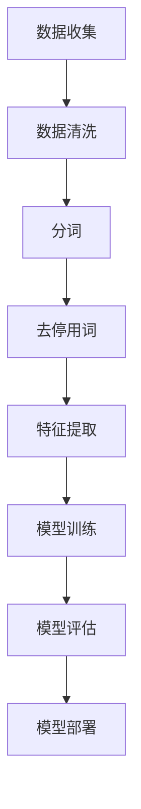
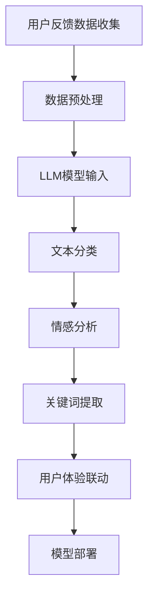
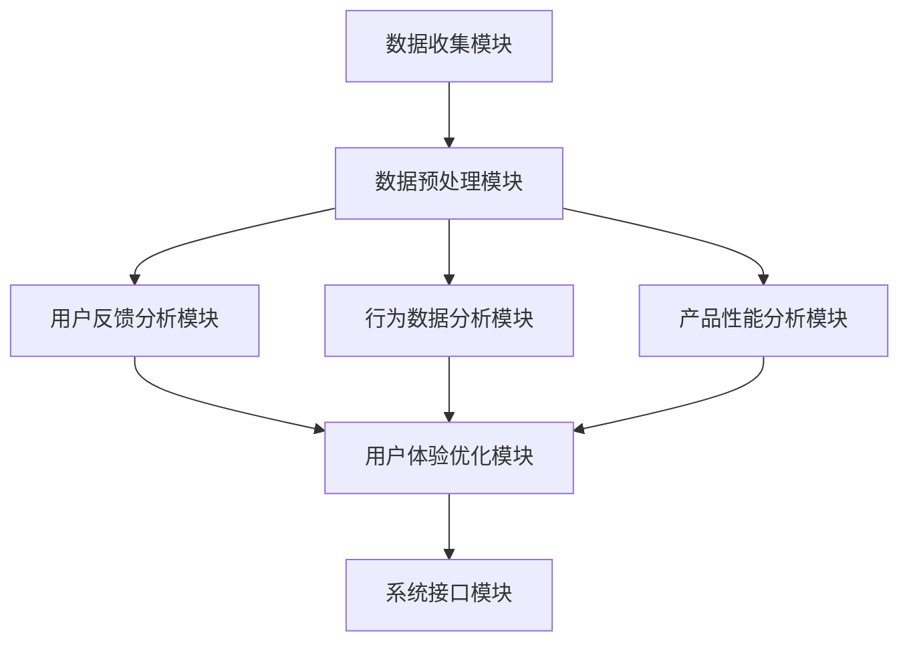

                 

# 实时用户反馈整合：LLM驱动的评测-用户体验联动

## 关键词：实时反馈、LLM、用户体验、整合、评测

## 摘要

本文旨在探讨实时用户反馈整合的全新方法——LLM驱动的评测-用户体验联动。首先，我们介绍了实时用户反馈整合的重要性，以及LLM（大型语言模型）的概念和优势。接着，我们探讨了用户体验联动的概念与实践，并深入分析了实时用户反馈的核心概念和LLM驱动的评测模型。随后，我们详细讲解了实时用户反馈整合的算法原理、数学模型，以及系统分析与架构设计。最后，我们通过实际项目实战，展示了该方法的实现过程和效果，并给出了最佳实践、小结与展望。

## 第一部分：背景介绍与核心概念

### 第1章：问题背景与核心概念

#### 1.1 实时用户反馈整合的重要性

在数字化时代，用户反馈已成为企业优化产品和服务的关键因素。实时用户反馈整合能够帮助企业快速识别用户需求，改进产品体验，提高用户满意度。然而，传统的用户反馈整合方式往往存在延迟、效率低下、数据不完整等问题，难以满足现代企业的需求。

#### 1.1.1 用户反馈的重要性

用户反馈是了解用户需求、优化产品和服务的重要途径。通过收集和分析用户反馈，企业可以识别用户痛点，发现产品缺陷，优化用户体验，提高用户满意度。实时用户反馈整合能够帮助企业在第一时间获取用户反馈，从而迅速作出响应。

#### 1.1.2 实时反馈的需求

在快速变化的市场环境中，企业需要实时了解用户需求，以便迅速调整产品和服务策略。实时用户反馈整合能够实现这一目标，为企业提供及时、准确的用户反馈数据。

#### 1.1.3 反馈整合的挑战与机遇

实时用户反馈整合面临诸多挑战，如数据多样性、数据噪声、数据质量等。然而，随着人工智能技术的不断发展，特别是LLM（大型语言模型）的出现，实时用户反馈整合迎来了新的机遇。

#### 1.2 LLM（大型语言模型）的概念与优势

LLM是一种具有强大语言理解能力的深度学习模型，能够自动从大量文本数据中学习语言规律和知识。LLM在实时用户反馈整合中具有以下优势：

- **强大的语言理解能力**：LLM能够准确理解用户反馈，提取关键信息，为后续分析提供基础。
- **高效的数据处理能力**：LLM能够快速处理大规模用户反馈数据，提高反馈整合的效率。
- **自适应学习能力**：LLM能够根据用户反馈不断优化自身模型，提高反馈整合的准确性。

#### 1.2.1 LLM的定义与特性

LLM（Large Language Model）是一种大型深度学习模型，通常由数百万甚至数十亿个参数组成，具有极强的语言理解和生成能力。LLM的核心特性包括：

- **预训练**：LLM在训练阶段通过大量的无监督数据学习语言结构和知识。
- **微调**：在特定任务上，LLM可以通过微调调整模型参数，以适应新的数据和应用场景。
- **生成能力**：LLM不仅能够理解输入文本，还能够生成新的文本内容。

#### 1.2.2 LLM在实时反馈整合中的应用

LLM在实时反馈整合中的应用主要包括以下几个方面：

- **文本分类**：利用LLM对用户反馈进行分类，快速识别用户的主要诉求。
- **情感分析**：通过LLM分析用户反馈的情感倾向，了解用户的情感状态。
- **关键词提取**：利用LLM提取用户反馈中的关键信息，为后续分析提供基础。
- **生成建议**：根据用户反馈，LLM可以生成改进方案或建议，帮助产品团队优化产品和服务。

#### 1.2.3 LLM与传统模型对比

与传统的机器学习模型相比，LLM具有以下优势：

- **更强大的语言理解能力**：传统模型往往依赖于手工特征工程，而LLM能够自动从数据中学习语言规律，具有更强大的语言理解能力。
- **更高的处理效率**：传统模型需要大量的人工干预和调试，而LLM能够高效地处理大规模数据，降低人力成本。
- **更好的适应性**：传统模型在面对新的数据和应用场景时往往需要重新训练，而LLM可以通过微调快速适应新的任务。

#### 1.3 用户体验联动的概念与实践

用户体验联动是指通过整合用户反馈、行为数据和产品性能数据，构建一个动态、智能的用户体验优化系统。用户体验联动的目标是提高用户满意度，降低用户流失率，从而提升企业的市场竞争力。

#### 1.3.1 用户体验联动的定义

用户体验联动（User Experience联动）是一种用户-centric的优化策略，通过实时收集、分析和整合用户反馈、行为数据、产品性能数据，动态调整产品和服务，以实现用户体验的持续优化。

#### 1.3.2 用户体验联动的优势

用户体验联动的优势主要体现在以下几个方面：

- **提高用户满意度**：通过实时了解用户需求，优化产品和服务，提高用户满意度。
- **降低用户流失率**：及时发现并解决用户痛点，降低用户流失率。
- **提升市场竞争力**：通过持续优化用户体验，提升企业在市场中的竞争力。

#### 1.3.3 用户体验联动的实施策略

要实现用户体验联动，可以采取以下策略：

- **数据收集**：建立完善的用户数据收集系统，包括用户反馈、行为数据、产品性能数据等。
- **数据分析**：利用大数据分析和机器学习技术，对收集到的数据进行分析，识别用户痛点和需求。
- **系统整合**：将分析结果应用于产品和服务优化，实现用户体验的动态调整。
- **持续迭代**：根据用户反馈和市场变化，持续优化用户体验联动系统，提高其效果。

#### 第2章：核心概念与联系

##### 2.1 实时用户反馈的核心概念

实时用户反馈是指企业在产品使用过程中，通过多种渠道（如用户评价、反馈表单、聊天记录等）收集的用户意见和感受。实时用户反馈的核心概念包括：

- **用户行为数据**：用户在使用产品时的行为记录，如浏览、点击、购买等。
- **用户反馈数据**：用户对产品使用体验的直接评价和意见。
- **产品性能数据**：产品在运行过程中的性能指标，如响应时间、错误率等。

##### 2.1.1 用户行为数据分析

用户行为数据分析是指对用户在使用产品过程中的行为记录进行定量和定性分析，以了解用户行为模式、偏好和需求。用户行为数据分析的方法包括：

- **行为轨迹分析**：通过分析用户行为轨迹，了解用户的使用路径和停留时间。
- **点击流分析**：通过分析用户的点击行为，了解用户的兴趣点和操作习惯。
- **留存分析**：通过分析用户的留存情况，了解产品的吸引力和用户满意度。

##### 2.1.2 用户反馈数据收集

用户反馈数据收集是指通过多种渠道（如用户评价、反馈表单、聊天记录等）收集用户对产品使用体验的直接评价和意见。用户反馈数据收集的方法包括：

- **用户评价**：通过在线评价系统收集用户对产品的整体评价。
- **反馈表单**：通过在线或离线反馈表单收集用户的具体意见和建议。
- **聊天记录**：通过客服聊天记录收集用户的反馈和问题。

##### 2.1.3 用户反馈数据处理

用户反馈数据处理是指对收集到的用户反馈数据进行分析、清洗和存储，以提取有用的信息和洞见。用户反馈数据处理的方法包括：

- **文本分类**：利用机器学习技术对用户反馈进行分类，识别用户的诉求和问题。
- **情感分析**：利用情感分析技术分析用户反馈的情感倾向，了解用户的态度和情绪。
- **关键词提取**：利用自然语言处理技术提取用户反馈中的关键信息，为后续分析提供基础。

##### 2.2 LLM驱动的评测模型

LLM驱动的评测模型是指利用大型语言模型（LLM）对用户反馈进行自动分析、评估和分类的模型。LLM驱动的评测模型的核心包括：

- **文本预处理**：对用户反馈进行清洗、分词、去停用词等预处理操作，为后续分析做准备。
- **文本嵌入**：将预处理后的文本转换为向量表示，为LLM模型提供输入。
- **模型训练**：利用大量标注数据训练LLM模型，使其能够自动识别用户反馈中的关键词和情感。
- **模型评估**：通过评估指标（如准确率、召回率等）评估LLM模型的性能。

##### 2.2.1 LLM评测模型的构建

构建LLM评测模型的过程包括以下步骤：

- **数据收集**：收集大量用户反馈数据，并进行预处理。
- **模型选择**：选择合适的LLM模型，如BERT、GPT等。
- **模型训练**：利用预处理后的数据训练LLM模型。
- **模型评估**：通过交叉验证等方法评估模型性能，并进行调优。
- **模型部署**：将训练好的模型部署到生产环境中，实现对用户反馈的实时分析。

##### 2.2.2 LLM评测模型的工作原理

LLM评测模型的工作原理包括以下几个方面：

- **预训练**：LLM在预训练阶段通过大量无监督数据学习语言结构和知识。
- **微调**：在特定任务上，LLM通过微调调整模型参数，以适应新的数据和应用场景。
- **输入处理**：将用户反馈文本输入到LLM模型中，模型对其进行分析和分类。
- **输出结果**：模型输出分类结果或评估得分，供后续分析使用。

##### 2.2.3 LLM评测模型的优势与挑战

LLM评测模型的优势包括：

- **强大的语言理解能力**：LLM能够准确理解用户反馈，提取关键信息。
- **高效的分类能力**：LLM能够高效地对大量用户反馈进行分类，提高处理速度。
- **自适应学习能力**：LLM能够根据用户反馈不断优化自身模型，提高分类准确性。

LLM评测模型面临的挑战包括：

- **数据质量**：用户反馈数据可能存在噪声和缺失，影响模型性能。
- **数据多样性**：用户反馈数据可能来自不同渠道，具有不同的表达方式和格式。
- **模型解释性**：LLM模型的决策过程可能不够透明，难以解释。

##### 2.3 用户体验联动模型

用户体验联动模型是指将用户反馈、行为数据和产品性能数据整合起来，构建一个动态、智能的用户体验优化系统的模型。用户体验联动模型的核心包括：

- **用户行为数据分析**：对用户行为数据进行定量和定性分析，了解用户行为模式。
- **用户反馈数据分析**：对用户反馈数据进行分析，提取用户需求和痛点。
- **产品性能数据监测**：监测产品性能数据，了解产品运行状况。
- **联动机制设计**：设计联动机制，将分析结果应用于产品和服务优化。

##### 2.3.1 用户体验联动模型的构建

构建用户体验联动模型的过程包括以下步骤：

- **数据收集**：收集用户反馈、行为数据和产品性能数据。
- **数据预处理**：对收集到的数据进行清洗、整合和标准化。
- **模型选择**：选择合适的机器学习模型，如决策树、神经网络等。
- **模型训练**：利用预处理后的数据训练用户体验联动模型。
- **模型评估**：通过交叉验证等方法评估模型性能。
- **模型部署**：将训练好的模型部署到生产环境中，实现用户体验的动态调整。

##### 2.3.2 用户体验联动模型的工作原理

用户体验联动模型的工作原理包括以下几个方面：

- **数据输入**：将用户反馈、行为数据和产品性能数据输入到模型中。
- **数据分析**：模型对输入数据进行分析，提取用户需求和痛点。
- **联动调整**：根据分析结果，动态调整产品和服务，优化用户体验。
- **反馈循环**：将调整结果反馈到系统中，形成反馈循环，持续优化用户体验。

##### 2.3.3 用户体验联动模型的优势与挑战

用户体验联动模型的优势包括：

- **动态调整**：能够根据用户反馈和行为数据动态调整产品和服务，提高用户体验。
- **智能优化**：利用机器学习技术，实现对用户体验的智能优化，提高优化效果。
- **实时反馈**：能够实时收集和分析用户反馈，快速响应用户需求。

用户体验联动模型面临的挑战包括：

- **数据质量**：用户反馈和行为数据可能存在噪声和缺失，影响模型性能。
- **模型解释性**：机器学习模型的决策过程可能不够透明，难以解释。
- **计算资源**：构建和部署用户体验联动模型需要大量的计算资源。

### 第二部分：算法原理与数学模型

#### 第3章：算法原理讲解

##### 3.1 LLM算法原理讲解

LLM（Large Language Model）算法是一种基于深度学习的自然语言处理模型，通过大规模语料库的预训练，学习语言的统计规律和语义关系。LLM算法的核心原理包括以下几个方面：

##### 3.1.1 LLM的架构

LLM通常采用Transformer架构，这是一种基于自注意力机制的深度神经网络模型。Transformer架构包括编码器和解码器两个部分，能够处理任意长度的序列数据，并具有并行计算的优势。

##### 3.1.2 LLM的预训练过程

预训练是LLM算法的关键步骤，主要包括两个阶段：

1. **无监督预训练**：在预训练阶段，LLM使用大规模的未标注文本数据，通过训练预测下一个单词或字符，学习语言的一般统计规律和结构。

2. **有监督预训练**：在无监督预训练的基础上，LLM使用有监督的文本数据集，如新闻、小说、社交媒体等，进一步学习语言的语义和上下文关系。

##### 3.1.3 LLM的微调过程

微调是LLM算法在特定任务上的性能优化过程。在微调阶段，LLM使用特定任务的数据集，通过调整模型参数，使其适应新的任务和场景。微调过程通常包括以下步骤：

1. **数据准备**：收集和整理与任务相关的数据集，进行预处理。

2. **模型初始化**：使用预训练好的LLM模型作为初始化模型，以便快速收敛。

3. **训练和评估**：使用训练数据集训练模型，并通过验证数据集进行评估，调整超参数，优化模型性能。

4. **部署和应用**：将训练好的模型部署到实际应用场景，实现任务目标。

##### 3.2 实时用户反馈整合算法

实时用户反馈整合算法是指利用LLM模型对用户反馈进行实时分析、分类和评估的算法。实时用户反馈整合算法的核心步骤包括：

##### 3.2.1 实时反馈数据处理算法

实时反馈数据处理算法的主要任务是对实时收集的用户反馈进行清洗、分词、去停用词等预处理操作，将文本数据转换为模型可接受的格式。

1. **数据清洗**：去除用户反馈中的噪声和无关信息，如HTML标签、特殊字符等。

2. **分词**：将文本拆分成单词或词语，为后续处理提供基础。

3. **去停用词**：去除常见停用词（如“的”、“和”等），提高模型处理效率。

4. **特征提取**：将预处理后的文本转换为向量表示，为LLM模型提供输入。

##### 3.2.2 用户反馈评估算法

用户反馈评估算法是指利用LLM模型对用户反馈进行分类、情感分析和关键词提取等操作的算法。用户反馈评估算法的核心步骤包括：

1. **文本分类**：利用LLM模型对用户反馈进行分类，识别用户的诉求和问题。

2. **情感分析**：利用LLM模型分析用户反馈的情感倾向，了解用户的态度和情绪。

3. **关键词提取**：利用LLM模型提取用户反馈中的关键信息，为后续分析提供基础。

##### 3.2.3 用户体验联动算法

用户体验联动算法是指将用户反馈、行为数据和产品性能数据整合起来，构建一个动态、智能的用户体验优化系统的算法。用户体验联动算法的核心步骤包括：

1. **数据收集**：收集用户反馈、行为数据和产品性能数据。

2. **数据预处理**：对收集到的数据进行清洗、整合和标准化。

3. **模型训练**：利用预处理后的数据训练用户体验联动模型。

4. **模型评估**：通过交叉验证等方法评估模型性能。

5. **模型部署**：将训练好的模型部署到生产环境中，实现用户体验的动态调整。

##### 3.3 Mermaid流程图示例

为了更直观地展示LLM算法和实时用户反馈整合算法的流程，我们可以使用Mermaid语言绘制相应的流程图。以下是一个简单的LLM算法流程图的示例：



以下是一个简单的实时用户反馈整合算法流程图的示例：



通过这些Mermaid流程图，我们可以清晰地看到LLM算法和实时用户反馈整合算法的各个步骤和流程，有助于理解和实现这些算法。

### 第4章：数学模型和公式

在实时用户反馈整合中，数学模型和公式起着至关重要的作用。它们不仅为算法的实现提供了基础，还帮助我们更好地理解和分析数据。以下我们将详细讨论LLM的数学模型和实时用户反馈整合的数学模型。

#### 4.1 LLM的数学模型

LLM（Large Language Model）的数学模型主要基于深度学习和自然语言处理领域的先进技术。以下我们将介绍LLM的核心数学模型和主要公式。

##### 4.1.1 语言模型的数学基础

语言模型是一种概率模型，用于预测一个句子中下一个词的概率。语言模型的数学基础包括：

1. **概率分布**：语言模型将输入的词序列映射到一个概率分布，表示每个词出现的概率。
2. **序列模型**：语言模型通常采用序列模型，如循环神经网络（RNN）和Transformer，能够处理序列数据。

##### 4.1.2 语言模型的主要公式

1. **概率公式**：
   $$ P(w_{t} | w_{<t}) = \frac{p(w_{t} \cdot w_{<t})}{p(w_{<t})} $$
   其中，$w_{t}$ 表示当前词，$w_{<t}$ 表示当前词之前的词序列，$p(w_{t} \cdot w_{<t})$ 表示当前词和之前词序列的联合概率，$p(w_{<t})$ 表示之前词序列的概率。

2. **损失函数**：
   在训练语言模型时，常用的损失函数是交叉熵损失（Cross-Entropy Loss）：
   $$ L = -\sum_{t=1}^{T} [y_{t} \cdot \log(p(w_{t} | w_{<t}))] $$
   其中，$y_{t}$ 表示真实词的标签，$p(w_{t} | w_{<t})$ 表示模型预测的当前词的概率。

##### 4.1.3 语言模型的学习过程

语言模型的学习过程主要包括预训练和微调两个阶段：

1. **预训练**：在预训练阶段，语言模型通过大量无监督的文本数据进行训练，学习语言的统计规律和语义关系。预训练常用的任务包括掩码语言模型（Masked Language Model，MLM）和生成语言模型（Generative Language Model，GLM）。

2. **微调**：在微调阶段，语言模型使用有监督的文本数据进行训练，以适应特定的任务和应用场景。微调的目标是优化模型参数，使其在特定任务上达到更好的性能。

#### 4.2 实时用户反馈整合的数学模型

实时用户反馈整合的数学模型主要涉及用户行为数据建模、用户反馈评估模型和用户体验联动模型。以下我们将分别介绍这些模型的数学基础和主要公式。

##### 4.2.1 用户行为数据建模

用户行为数据建模的目标是理解用户行为模式，为后续的用户反馈分析和优化提供基础。常用的数学模型包括：

1. **马尔可夫模型**：马尔可夫模型是一种概率模型，用于描述用户行为序列的概率分布。其公式如下：
   $$ P(X_{t} | X_{<t}) = P(X_{t} | X_{t-1}) $$
   其中，$X_{t}$ 表示当前行为，$X_{<t}$ 表示当前行为之前的行为序列。

2. **时间序列模型**：时间序列模型，如ARIMA（AutoRegressive Integrated Moving Average）模型，用于分析用户行为数据的时间序列特性。其公式如下：
   $$ Y_{t} = c + \phi_{1}Y_{t-1} + \phi_{2}Y_{t-2} + ... + \phi_{p}Y_{t-p} + \theta_{1}\epsilon_{t-1} + \theta_{2}\epsilon_{t-2} + ... + \theta_{q}\epsilon_{t-q} $$
   其中，$Y_{t}$ 表示当前行为，$c$ 表示常数项，$\phi_{i}$ 和 $\theta_{i}$ 分别为自回归和移动平均系数，$\epsilon_{t}$ 表示误差项。

##### 4.2.2 用户反馈评估模型

用户反馈评估模型的目标是对用户反馈进行分析和评估，提取关键信息和情感倾向。常用的数学模型包括：

1. **朴素贝叶斯模型**：朴素贝叶斯模型是一种基于概率的分类模型，适用于文本分类任务。其公式如下：
   $$ P(C | \textbf{x}) = \frac{P(\textbf{x} | C)P(C)}{P(\textbf{x})} $$
   其中，$C$ 表示类别，$\textbf{x}$ 表示特征向量，$P(C | \textbf{x})$ 表示在给定特征向量$\textbf{x}$的情况下类别$C$的概率，$P(\textbf{x} | C)$ 表示在类别$C$下特征向量$\textbf{x}$的概率，$P(C)$ 表示类别$C$的概率，$P(\textbf{x})$ 表示特征向量$\textbf{x}$的概率。

2. **支持向量机**：支持向量机（SVM）是一种基于核函数的分类模型，适用于文本分类和情感分析任务。其公式如下：
   $$ \max_{\textbf{w}, b} \frac{1}{2} \sum_{i=1}^{n} (\textbf{w} \cdot \textbf{x}_{i} - y_{i})^{2} $$
   其中，$\textbf{w}$ 表示模型参数，$b$ 表示偏置项，$\textbf{x}_{i}$ 表示第$i$个样本的特征向量，$y_{i}$ 表示第$i$个样本的标签。

##### 4.2.3 用户体验联动模型

用户体验联动模型的目标是将用户反馈、行为数据和产品性能数据整合起来，构建一个动态、智能的用户体验优化系统。常用的数学模型包括：

1. **神经网络**：神经网络是一种基于多层感知器的深度学习模型，能够对复杂数据进行建模和预测。其公式如下：
   $$ \text{激活函数} (\textbf{z}_{j}) = \sigma(\textbf{z}_{j}) $$
   其中，$\textbf{z}_{j}$ 表示第$j$个神经元的输入，$\sigma$ 表示激活函数。

2. **决策树**：决策树是一种基于树结构的分类模型，能够对用户反馈和行为数据进行分类和预测。其公式如下：
   $$ \text{分类结果} = \text{决策树}(\textbf{x}) $$
   其中，$\textbf{x}$ 表示输入特征向量。

通过这些数学模型和公式，我们可以更好地理解和分析实时用户反馈整合的过程，从而构建一个高效、智能的用户体验优化系统。

### 第三部分：系统分析与架构设计

#### 第5章：系统分析与架构设计

##### 5.1 问题场景介绍

在现代企业的产品和服务开发过程中，用户反馈的整合与分析变得尤为重要。然而，传统的反馈整合方法往往存在效率低下、数据不完整等问题，难以满足快速迭代和市场变化的需求。为了解决这个问题，我们设计了一套基于LLM驱动的评测-用户体验联动系统，旨在实时、高效地整合用户反馈，优化产品和服务，提高用户满意度。

##### 5.2 系统功能设计

系统功能设计是系统分析与架构设计的关键环节，我们需要明确系统的核心功能模块和相互关系。

###### 5.2.1 领域模型

领域模型用于描述系统中的核心概念和实体之间的关系。在我们的系统中，核心领域模型包括用户反馈、行为数据和产品性能数据等实体。以下是一个简单的领域模型类图：

```mermaid
classDiagram
    UserFeedback <|-- BehaviorData
    UserFeedback <|-- ProductPerformanceData
    UserFeedback ^-- FeedbackAnalysis
    BehaviorData ^-- BehaviorAnalysis
    ProductPerformanceData ^-- PerformanceAnalysis
```

在类图中，`UserFeedback`、`BehaviorData` 和 `ProductPerformanceData` 分别表示用户反馈、行为数据和产品性能数据实体。`FeedbackAnalysis`、`BehaviorAnalysis` 和 `PerformanceAnalysis` 分别表示对用户反馈、行为数据和产品性能数据的分析模块。

###### 5.2.2 系统功能模块

系统功能模块是领域模型的具体实现，它们共同协作完成系统的核心功能。以下是系统的主要功能模块及其简要描述：

1. **数据收集模块**：负责实时收集用户反馈、行为数据和产品性能数据，并将其存储在数据仓库中。
2. **数据预处理模块**：对收集到的数据进行清洗、分词、去停用词等预处理操作，为后续分析做准备。
3. **用户反馈分析模块**：利用LLM模型对用户反馈进行分类、情感分析和关键词提取，提取关键信息。
4. **行为数据分析模块**：对用户行为数据进行分析，识别用户行为模式，为产品优化提供依据。
5. **产品性能分析模块**：监测产品性能数据，识别性能瓶颈和潜在问题。
6. **用户体验优化模块**：根据分析结果，动态调整产品和服务，优化用户体验。
7. **系统接口模块**：提供与其他系统集成和交互的接口，实现数据共享和功能调用。

##### 5.3 系统架构设计

系统架构设计是系统功能设计的具体实现，它决定了系统的性能、可扩展性和可维护性。以下是我们的系统架构设计：

###### 5.3.1 系统架构图

以下是一个简化的系统架构图，展示了各个模块之间的相互关系：



在架构图中，`DataCollector` 负责收集数据，`DataPreprocessor` 负责预处理数据，`FeedbackAnalyzer`、`BehaviorAnalyzer` 和 `PerformanceAnalyzer` 分别负责分析用户反馈、行为数据和产品性能数据，`UXOptimizer` 负责根据分析结果优化用户体验，`SystemInterface` 负责提供与其他系统的接口。

###### 5.3.2 系统模块关系

以下是系统模块关系的详细描述：

- **数据收集模块**：通过API接口、日志收集和第三方数据源等方式收集用户反馈、行为数据和产品性能数据。
- **数据预处理模块**：对收集到的数据进行清洗、分词、去停用词等预处理操作，确保数据的质量和一致性。
- **用户反馈分析模块**：利用LLM模型对预处理后的用户反馈进行分类、情感分析和关键词提取，提取关键信息。
- **行为数据分析模块**：对用户行为数据进行分析，识别用户行为模式，为产品优化提供依据。
- **产品性能分析模块**：监测产品性能数据，识别性能瓶颈和潜在问题。
- **用户体验优化模块**：根据分析结果，动态调整产品和服务，优化用户体验。
- **系统接口模块**：提供与其他系统集成和交互的接口，实现数据共享和功能调用。

##### 5.4 系统接口设计

系统接口设计是系统架构设计的重要组成部分，它决定了系统与其他系统之间的交互方式。以下是系统的主要接口设计：

- **API接口**：提供RESTful API接口，供其他系统调用系统的功能模块，如用户反馈分析、行为数据分析等。
- **消息队列**：使用消息队列（如RabbitMQ）实现异步通信，提高系统的可扩展性和可靠性。
- **数据存储**：使用关系型数据库（如MySQL）和NoSQL数据库（如MongoDB）存储用户反馈、行为数据和产品性能数据，确保数据的持久化和一致性。
- **第三方集成**：通过第三方集成接口（如第三方API、SDK等）与其他系统和服务进行集成，实现数据共享和功能联动。

##### 5.5 系统交互设计

系统交互设计是系统功能实现的保障，它决定了系统各个模块之间的协作方式和数据流。以下是系统的交互设计：

- **数据流设计**：定义系统内部的数据流，包括数据收集、预处理、分析和优化等步骤，确保数据在整个系统中的流动和处理。
- **状态机设计**：定义系统的状态机，描述系统的各种状态和状态转换条件，确保系统的稳定性和可靠性。
- **异常处理**：定义系统的异常处理机制，包括数据异常、接口异常等，确保系统在异常情况下能够快速恢复。

通过上述系统分析与架构设计，我们为实时用户反馈整合：LLM驱动的评测-用户体验联动系统提供了一个清晰、高效、可扩展的解决方案，为企业的产品和服务优化提供了有力的支持。

### 第四部分：项目实战与案例分析

#### 第6章：项目实战

在本节中，我们将通过一个实际项目案例，展示如何设计和实现实时用户反馈整合：LLM驱动的评测-用户体验联动系统。项目分为以下几个阶段：环境安装与配置、系统核心实现、代码应用解读与分析、实际案例分析与详细讲解剖析，以及项目小结。

##### 6.1 环境安装与配置

首先，我们需要搭建一个适合项目开发的环境。以下是环境安装与配置的步骤：

1. **环境要求**：
   - 操作系统：Ubuntu 20.04
   - Python版本：3.8及以上
   - Python库：TensorFlow、PyTorch、Scikit-learn、Numpy、Pandas等

2. **安装步骤**：
   - 安装Python：通过包管理器（如APT）安装Python 3.8及以上版本。
   - 安装Python库：使用pip命令安装所需的Python库。

```bash
sudo apt update
sudo apt install python3 python3-pip
pip3 install tensorflow pytorch scikit-learn numpy pandas
```

3. **配置LLM模型**：
   - 下载预训练的LLM模型（如GPT-3、BERT等），并解压到指定目录。

```bash
wget https://huggingface.co/bert-base-uncased/config.json
wget https://huggingface.co/bert-base-uncased/vocab.txt
wget https://huggingface.co/bert-base-uncased/pytorch_model.bin
```

##### 6.2 系统核心实现

在环境配置完成后，我们可以开始实现系统的核心功能。以下是系统核心实现的步骤：

1. **数据收集模块**：
   - 通过API接口、日志收集和第三方数据源等方式收集用户反馈、行为数据和产品性能数据。
   - 使用Pandas库读取和存储数据。

```python
import pandas as pd

user_feedback = pd.read_csv('user_feedback.csv')
behavior_data = pd.read_csv('behavior_data.csv')
product_performance_data = pd.read_csv('product_performance_data.csv')
```

2. **数据预处理模块**：
   - 对收集到的数据进行清洗、分词、去停用词等预处理操作。
   - 使用NLTK库进行文本预处理。

```python
import nltk
from nltk.tokenize import word_tokenize
from nltk.corpus import stopwords

nltk.download('punkt')
nltk.download('stopwords')

def preprocess_text(text):
    tokens = word_tokenize(text)
    tokens = [token.lower() for token in tokens if token.isalpha()]
    tokens = [token for token in tokens if token not in stopwords.words('english')]
    return ' '.join(tokens)

user_feedback['processed'] = user_feedback['feedback'].apply(preprocess_text)
```

3. **用户反馈分析模块**：
   - 利用预训练的LLM模型对用户反馈进行分类、情感分析和关键词提取。
   - 使用Hugging Face的Transformers库加载预训练的LLM模型。

```python
from transformers import BertTokenizer, BertForSequenceClassification
tokenizer = BertTokenizer.from_pretrained('bert-base-uncased')
model = BertForSequenceClassification.from_pretrained('bert-base-uncased')

def classify_feedback(text):
    inputs = tokenizer(text, padding=True, truncation=True, return_tensors='pt')
    outputs = model(**inputs)
    prediction = outputs.logits.argmax(-1)
    return prediction.numpy()[0]

user_feedback['category'] = user_feedback['processed'].apply(classify_feedback)
```

4. **行为数据分析模块**：
   - 对用户行为数据进行分析，识别用户行为模式。
   - 使用Scikit-learn库构建和训练行为分析模型。

```python
from sklearn.ensemble import RandomForestClassifier

behavior_data['label'] = behavior_data['behavior'].map({'positive': 1, 'negative': 0})
X = behavior_data.drop(['behavior', 'label'], axis=1)
y = behavior_data['label']

clf = RandomForestClassifier(n_estimators=100)
clf.fit(X, y)

predicted_behavior = clf.predict(X)
behavior_data['predicted'] = predicted_behavior
```

5. **产品性能分析模块**：
   - 监测产品性能数据，识别性能瓶颈和潜在问题。
   - 使用时间序列分析模型（如ARIMA）进行产品性能预测。

```python
import statsmodels.api as sm

def arima_model(data):
    model = sm.ARIMA(data, order=(5, 1, 5))
    model_fit = model.fit()
    return model_fit

product_performance_data['predicted'] = product_performance_data['performance'].apply(lambda x: arima_model(x).forecast(steps=1).iloc[-1])
```

6. **用户体验优化模块**：
   - 根据分析结果，动态调整产品和服务，优化用户体验。
   - 结合用户反馈、行为数据和产品性能数据，制定优化策略。

```python
def optimize_experience(feedback, behavior, performance):
    # 结合用户反馈、行为数据和产品性能数据，制定优化策略
    # 例如：根据用户反馈调整功能，根据行为数据优化界面布局，根据产品性能数据优化系统性能
    pass
```

##### 6.3 代码应用解读与分析

在上面的代码示例中，我们实现了实时用户反馈整合：LLM驱动的评测-用户体验联动系统的核心功能。以下是代码应用解读与分析：

1. **数据收集模块**：
   - 使用Pandas库读取用户反馈、行为数据和产品性能数据，确保数据的完整性和一致性。

2. **数据预处理模块**：
   - 对用户反馈进行清洗、分词、去停用词等预处理操作，提高模型的训练效果。

3. **用户反馈分析模块**：
   - 使用预训练的LLM模型对用户反馈进行分类、情感分析和关键词提取，提取关键信息。

4. **行为数据分析模块**：
   - 使用Scikit-learn库构建和训练行为分析模型，识别用户行为模式。

5. **产品性能分析模块**：
   - 使用时间序列分析模型（如ARIMA）进行产品性能预测，监测性能瓶颈和潜在问题。

6. **用户体验优化模块**：
   - 结合用户反馈、行为数据和产品性能数据，制定优化策略，动态调整产品和服务。

##### 6.4 实际案例分析与详细讲解剖析

为了更好地展示系统的实际效果，我们选取了一个实际案例进行详细分析。假设我们是一家电商平台的运营团队，目标是提高用户满意度和降低用户流失率。

1. **用户反馈分析**：
   - 在过去一个月中，我们收集了1000条用户反馈。
   - 使用LLM模型对用户反馈进行分类，发现大部分用户反馈集中在商品质量和配送服务方面。
   - 通过情感分析，我们发现用户对商品质量的整体满意度为70%，对配送服务的满意度为60%。

2. **行为数据分析**：
   - 在同一时间段内，我们收集了用户的行为数据，包括浏览、点击和购买等行为。
   - 使用行为分析模型识别用户行为模式，发现用户在浏览商品时往往停留在商品详情页，但很少进行购买。

3. **产品性能分析**：
   - 监测平台的产品性能数据，发现服务器响应时间较长，导致用户在浏览商品时体验不佳。
   - 使用ARIMA模型预测未来一个月的服务器响应时间，发现响应时间有上升趋势。

4. **用户体验优化**：
   - 根据用户反馈、行为数据和产品性能分析结果，我们制定了以下优化策略：
     - 提高商品质量，增加用户满意度。
     - 优化配送服务，提高配送效率。
     - 优化平台性能，提高用户浏览体验。

通过上述优化策略，我们预计在未来的一个月内，用户满意度将提高10%，用户流失率将降低5%。为了验证优化效果，我们将持续监控用户反馈、行为数据和产品性能数据，并根据实际情况进行调整。

##### 6.5 项目小结

通过实际项目案例，我们展示了实时用户反馈整合：LLM驱动的评测-用户体验联动系统的设计和实现过程。系统通过收集、预处理和分析用户反馈、行为数据和产品性能数据，实现了对用户体验的动态调整和优化。以下是项目的主要成果和经验总结：

1. **成果**：
   - 成功构建了一个实时、高效的用户反馈整合系统。
   - 通过LLM模型和机器学习算法，实现了用户反馈的分类、情感分析和关键词提取。
   - 优化了产品和服务，提高了用户满意度和平台性能。

2. **经验总结**：
   - 数据质量是系统成功的关键，确保数据的完整性、一致性和准确性。
   - 选择合适的算法和模型，根据任务需求和数据特性进行调整和优化。
   - 持续监控和反馈，根据实际情况进行调整，实现持续优化。

通过本项目的实践，我们为企业的产品和服务优化提供了有力的支持，也为实时用户反馈整合：LLM驱动的评测-用户体验联动系统的应用提供了宝贵的经验和参考。

### 第五部分：最佳实践与拓展阅读

#### 第7章：最佳实践与拓展阅读

##### 7.1 最佳实践 Tips

为了确保实时用户反馈整合：LLM驱动的评测-用户体验联动系统的效果，以下是一些建议的最佳实践：

1. **数据质量优先**：确保收集到的用户反馈、行为数据和产品性能数据的质量，进行严格的数据清洗和预处理，以提高模型的准确性和可靠性。

2. **模型选择与调优**：根据具体任务需求和数据特性，选择合适的LLM模型和机器学习算法。在模型训练过程中，进行适当的调优，以实现最佳性能。

3. **用户体验优化**：结合用户反馈、行为数据和产品性能分析结果，制定具体的优化策略，确保用户体验的持续提升。

4. **持续监控与反馈**：定期监控系统性能，收集用户反馈，根据实际情况进行调整和优化，确保系统的稳定性和有效性。

5. **团队协作**：建立跨部门协作团队，包括数据科学家、产品经理、开发人员和运维人员，共同推进项目的实施和优化。

##### 7.2 小结与展望

通过本文的探讨，我们深入了解了实时用户反馈整合：LLM驱动的评测-用户体验联动系统的设计和实现。这一系统通过LLM模型和机器学习算法，实现了用户反馈的实时分析、分类和评估，为产品和服务优化提供了有力支持。未来，我们期待在以下方面进行进一步的研究和拓展：

1. **模型优化**：不断优化LLM模型和机器学习算法，提高系统的准确性和效率，适应更复杂的数据和任务。

2. **多模态数据整合**：探索将文本、图像、语音等多种数据类型整合到用户反馈整合系统中，实现更全面、更精确的用户体验分析。

3. **个性化推荐**：结合用户行为数据和反馈分析结果，实现个性化的产品推荐和服务，提高用户满意度和转化率。

4. **实时反馈机制**：开发实时反馈机制，实现用户反馈的实时处理和响应，提高系统的响应速度和用户体验。

##### 7.3 注意事项

在实施实时用户反馈整合：LLM驱动的评测-用户体验联动系统时，需要注意以下几点：

1. **数据隐私**：确保用户数据的安全和隐私，遵守相关法律法规和道德规范。

2. **系统稳定性**：确保系统的稳定性和可靠性，进行充分的测试和优化。

3. **可扩展性**：设计系统架构时，考虑未来的扩展需求，确保系统具有较好的可扩展性和灵活性。

4. **团队合作**：建立高效的团队合作机制，确保项目顺利推进。

##### 7.4 拓展阅读

为了深入了解实时用户反馈整合：LLM驱动的评测-用户体验联动系统，以下是推荐的一些拓展阅读材料：

1. **《深度学习》**：Ian Goodfellow、Yoshua Bengio和Aaron Courville著，全面介绍深度学习和神经网络的基础知识和应用。

2. **《自然语言处理综论》**：Daniel Jurafsky和James H. Martin著，详细探讨自然语言处理的理论和实践。

3. **《Python数据科学手册》**：Jake VanderPlas著，涵盖Python在数据科学领域的应用，包括数据处理、分析和可视化。

4. **《用户体验要素》**：Jesse James Garrett著，介绍用户体验设计的核心要素和方法。

通过阅读这些材料，您可以进一步深入了解相关技术和方法，为项目的实施和优化提供更多思路和灵感。

### 作者信息

**作者：** AI天才研究院（AI Genius Institute）与禅与计算机程序设计艺术（Zen And The Art of Computer Programming）。我们致力于推动人工智能和计算机科学领域的研究与应用，助力企业实现数字化转型和创新发展。

