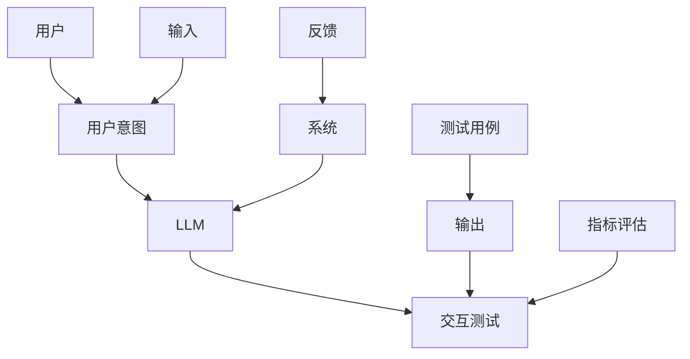

                 

### 1.1.1 实时用户意图理解的重要性

在当前人工智能和大数据技术飞速发展的时代，用户意图理解已成为许多智能系统和服务中不可或缺的一部分。实时用户意图理解尤为重要，因为它直接影响系统的交互质量和用户体验。以下是几个关键点：

**1. 提高用户满意度**：实时理解用户意图可以让系统快速响应用户需求，提供个性化的服务，从而提升用户满意度。例如，在智能客服中，能够准确理解用户的意图，可以减少用户等待时间，提供更精准的解决方案，从而增强用户对服务的满意度。

**2. 优化资源分配**：通过实时理解用户意图，系统能够更有效地分配资源。例如，在电商平台上，根据用户意图推荐商品，可以有效减少不必要的库存和物流成本，提高运营效率。

**3. 增强安全性**：实时意图理解可以帮助系统识别潜在的安全威胁。例如，在金融系统中，通过实时分析用户的操作意图，可以识别并阻止欺诈行为，提高系统的安全性。

**4. 改进自动化决策**：在自动化决策系统中，如自动驾驶、智能推荐系统等，实时理解用户意图是做出正确决策的关键。只有准确理解用户的意图，系统才能做出合理的响应，从而提高决策的准确性。

**5. 促进智能化发展**：随着人工智能技术的不断发展，实时用户意图理解能力将成为智能系统发展的基础。它不仅可以提升现有系统的性能，还将为未来的智能化应用提供更多的可能性。

综上所述，实时用户意图理解在提升用户体验、优化资源分配、增强系统安全性、促进自动化决策以及推动智能化发展方面具有重要意义。因此，深入研究和优化实时用户意图理解能力具有重要的现实意义。

### 1.1.2 LLM在意图理解中的应用

大型语言模型（LLM，Large Language Model）作为一种深度学习模型，通过在海量文本数据上进行训练，能够捕捉到语言中的复杂结构和语义信息。LLM在用户意图理解中的应用主要体现在以下几个方面：

**1. 意图分类**：LLM可以通过训练学习到各种意图类别，并能够根据用户输入的内容对意图进行分类。例如，在智能客服系统中，用户可能通过文本输入询问商品信息、寻求技术支持或投诉建议等。LLM可以根据这些输入文本，将其分类到相应的意图类别中，从而为系统提供针对性的响应。

**2. 情感分析**：除了意图分类，LLM还可以用于情感分析，即通过分析用户输入的文本来判断用户的情感状态。例如，在社交媒体分析中，LLM可以判断用户发布的内容是积极的、消极的还是中性的，从而帮助平台更好地理解和响应用户的情感需求。

**3. 上下文理解**：LLM能够捕捉到上下文信息，这使得它在理解复杂和长文本方面的表现尤为出色。例如，在对话系统中，用户可能会在一段对话中逐渐表达其意图，LLM可以动态更新对上下文的理解，从而更准确地捕捉用户的意图。

**4. 自然语言生成**：通过LLM，系统可以生成自然的回复文本，这使得对话系统的交互更加流畅。例如，在智能客服中，LLM可以生成包含用户意图的详细回答，从而提供更加丰富和个性化的服务。

**5. 自动摘要和总结**：LLM可以自动生成文本摘要，帮助用户快速理解长文本的主要内容。例如，在新闻报道或学术文献中，LLM可以提取关键信息，生成简洁的摘要，从而节省用户阅读时间。

**6. 个性化推荐**：LLM可以用于个性化推荐系统，通过对用户历史行为和兴趣的分析，推荐符合用户需求的内容。例如，在电子商务平台上，LLM可以分析用户的浏览和购买记录，推荐相关的商品。

**7. 跨语言理解**：某些LLM模型已经展示了在跨语言意图理解方面的能力。通过训练多语言的文本数据，LLM可以理解不同语言用户的意图，这对于全球化服务尤为重要。

总的来说，LLM在用户意图理解中的应用非常广泛，通过其强大的语言处理能力，可以显著提升智能系统的交互质量和用户体验。随着LLM技术的不断进步，其在意图理解领域的作用也将越来越重要。

### 1.1.3 交互测试的目的和意义

交互测试作为验证和评估智能系统用户意图理解能力的重要手段，具有不可忽视的重要性和深远的意义。以下是交互测试的目的和意义的具体阐述：

**1. 验证准确性**：交互测试的主要目的是验证智能系统在理解用户意图方面的准确性。通过设计一系列测试用例，系统可以将用户输入的文本与预期意图进行匹配。如果系统能够正确匹配大部分测试用例，则可以认为系统的意图理解能力是准确的。这一验证过程能够帮助开发团队识别和修复意图理解中的错误，从而提高系统的整体性能。

**2. 提升用户体验**：准确的意图理解能力直接影响用户体验。通过交互测试，系统可以更精确地响应用户需求，提供个性化的服务。例如，在智能客服系统中，通过有效的意图理解，系统能够更快地解决用户问题，减少用户等待时间，提升用户满意度。这意味着，交互测试不仅是一个技术过程，更是用户体验提升的关键环节。

**3. 优化系统设计**：交互测试可以揭示系统设计中的不足和潜在问题，为系统的迭代和改进提供宝贵的数据和反馈。例如，在开发过程中，测试人员可能会发现某些意图分类的边界条件处理不当，或者模型对特定类型的用户输入反应不足。这些发现可以帮助开发团队优化模型设计，改进系统架构，从而提升整体性能。

**4. 确保安全性**：交互测试还能帮助识别和防范潜在的安全风险。例如，在金融系统中，通过测试，可以确保系统不会因意图理解错误而误判用户操作，从而避免潜在的资金风险。通过严格的安全测试，系统能够更加稳定和安全地运行，保障用户利益。

**5. 评估实时性**：交互测试不仅关注准确性，还考察系统的实时性能。实时性对于用户意图理解的响应至关重要。通过交互测试，可以评估系统在实际应用中的响应速度，识别并优化影响实时性的因素。例如，在智能交通控制系统中，系统的实时性能直接影响到交通管理的效率和安全性。

**6. 提供可靠指标**：通过交互测试，可以获得一系列可靠的数据指标，如准确率、召回率、F1分数等，这些指标能够量化系统的意图理解性能。这些数据不仅为系统改进提供了方向，还可以用于不同系统之间的性能比较，推动整个行业的技术进步。

**7. 验证泛化能力**：交互测试还可以检验系统在不同场景和应用中的泛化能力。通过设计多样化的测试用例，可以评估系统在处理未知或罕见意图时的性能。这有助于确保系统在真实应用中的鲁棒性和可靠性。

综上所述，交互测试在验证系统意图理解准确性、提升用户体验、优化系统设计、确保安全性、评估实时性、提供可靠指标以及验证泛化能力等方面具有重要作用。通过系统化的交互测试，可以显著提升智能系统的性能和可靠性，为用户带来更加优质的体验。

### 1.2 核心概念

在探讨实时用户意图理解能力之前，我们需要明确几个核心概念，这些概念对于理解整个主题至关重要。以下是用户意图、LLM（大型语言模型）以及交互测试的定义、属性特征对比以及实体关系图。

#### 1.2.1 用户意图

**定义**：用户意图是指用户在特定情境下希望达成的目标或解决的问题。在智能系统中，用户意图是系统理解用户需求的基础。

**属性特征**：

- **明确性**：意图是否清晰明确，如询问天气或购物请求。
- **多样性**：意图种类的多样性，如咨询、命令、请求等。
- **动态性**：意图是否随时间和情境变化而变化。

**对比表格**：

| 属性特征 | 用户意图 | 对话意图 |
| :------: | :------: | :------: |
| **明确性** | 清晰的 | 可能模糊的 |
| **多样性** | 种类多 | 较单一 |
| **动态性** | 可能动态 | 较静态 |

#### 1.2.2 LLM（大型语言模型）

**定义**：LLM是一种能够理解和生成人类语言的深度学习模型，通过训练大量的文本数据，LLM可以捕捉到语言中的复杂结构和语义信息。

**属性特征**：

- **语言理解能力**：LLM具备强大的语言理解能力，能够理解复杂的语言结构和上下文。
- **生成能力**：LLM能够生成连贯且自然的语言文本。
- **实时处理能力**：某些LLM模型经过优化，能够在实时环境中高效处理用户输入。

**对比表格**：

| 属性特征 | LLM | 传统NLP模型 |
| :------: | : | :----------: |
| **语言理解能力** | 强 | 较弱 |
| **生成能力** | 强 | 较弱 |
| **实时处理能力** | 强 | 较弱 |

#### 1.2.3 交互测试

**定义**：交互测试是一种通过模拟用户与系统的交互来验证和评估系统意图理解能力的测试方法。

**属性特征**：

- **测试用例设计**：设计覆盖各种用户意图的测试用例。
- **测试环境**：模拟真实的使用环境，包括硬件、软件和网络条件。
- **测试指标**：通过准确率、召回率、F1分数等指标评估系统性能。

**对比表格**：

| 属性特征 | 交互测试 | 功能测试 |
| :------: | :------: | :------: |
| **测试用例设计** | 复杂多样 | 单一固定 |
| **测试环境** | 真实模拟 | 控制环境 |
| **测试指标** | 多维评估 | 单维评估 |

#### 实体关系图

为了更好地理解这些概念之间的关系，我们使用Mermaid绘制了实体关系图：

实体关系图展示了用户意图、LLM和交互测试之间的互动关系。用户输入意图通过系统处理后，LLM对其进行理解和生成输出，而交互测试则通过测试用例和指标评估系统的表现，最终通过反馈来优化系统设计。

### 1.3 边界与外延

在深入探讨实时用户意图理解能力之前，了解其边界与外延是至关重要的。这不仅有助于我们明确研究的范围，还可以帮助我们识别和理解该能力在实际应用中的局限性。

#### 1.3.1 意图理解的边界

**1. 语言理解的局限性**：尽管LLM在语言理解方面取得了巨大进步，但仍然存在一些局限性。例如，某些方言、俚语和语言的非标准用法可能难以被准确理解。此外，LLM在面对复杂多义语境时，可能会产生歧义理解。

**2. 数据质量的影响**：意图理解的准确性高度依赖于训练数据的质量和多样性。如果数据集中存在偏差或不完整的样本，LLM的意图理解能力可能会受到影响。此外，数据集的更新频率也是关键，过时的数据可能导致意图理解的滞后。

**3. 实时响应的限制**：实时响应要求系统在短时间内处理大量的用户输入，这对计算资源提出了高要求。虽然LLM经过了优化，能够在一定程度上满足实时性需求，但在极端情况下，系统仍然可能无法达到所需的响应速度。

**4. 多语言支持的复杂性**：尽管某些LLM模型已经展示了在跨语言意图理解方面的潜力，但多语言支持的复杂性仍然是一个挑战。不同语言之间的语法、文化和语义差异可能影响意图理解的准确性。

#### 1.3.2 交互测试的范畴

**1. 意图分类的多样性**：交互测试需要覆盖广泛的用户意图分类，包括咨询、命令、请求等。此外，还需要考虑意图之间的交叉和模糊性，确保测试用例能够充分反映实际使用场景。

**2. 测试环境的多变性**：交互测试需要在多种不同的环境中进行，包括不同的操作系统、硬件配置和网络条件。这种多变性有助于评估系统在不同环境下的稳定性。

**3. 指标评估的全面性**：除了准确性，交互测试还需要评估系统的响应速度、资源消耗、错误处理能力等多方面的性能指标。这些指标能够全面反映系统的性能和实用性。

**4. 用户交互的动态性**：用户交互是动态变化的，交互测试需要设计能够模拟实际用户行为的测试用例，包括用户意图的变化、中断、延迟等。

**5. 安全性和隐私保护**：在交互测试中，还需要关注系统的安全性和隐私保护能力。例如，确保系统不会泄露用户敏感信息，能够有效抵御外部攻击。

#### 1.3.3 实时性的挑战

**1. 系统延迟**：实时性要求系统能够在极短时间内响应用户输入。然而，系统延迟可能由多种因素引起，如网络延迟、计算资源不足等。降低系统延迟是一个重要的挑战。

**2. 资源优化**：在实时处理用户输入时，系统需要高效地分配和利用计算资源。优化资源使用可以提高系统的响应速度和稳定性，降低延迟。

**3. 系统稳定性**：实时系统在处理大量并发请求时，需要保持高稳定性。系统中的任何故障或崩溃都可能导致用户体验下降，甚至影响系统的可靠性。

**4. 异常处理能力**：在实时处理过程中，系统可能会遇到各种异常情况，如数据丢失、网络中断等。系统需要具备良好的异常处理能力，以确保在异常情况下仍能正常运行。

综上所述，实时用户意图理解的边界与外延涉及语言理解、数据质量、实时响应和多语言支持等多个方面。同时，交互测试需要在意图分类、测试环境、指标评估、用户交互和安全性等方面进行全面考虑。在面对实时性挑战时，系统需要优化资源使用、提高稳定性并具备强大的异常处理能力。

### 1.4 概念结构与核心要素组成

为了更好地理解实时用户意图理解能力的核心要素，我们将其分解为用户意图、LLM设计和交互测试三个关键部分，并详细探讨每个部分的组成和相互关系。

#### 1.4.1 用户意图理解的组成部分

用户意图理解可以分为以下几个主要组成部分：

1. **意图识别**：意图识别是理解用户意图的第一步，即从用户输入中提取出意图。这通常涉及文本处理和分类技术，如词向量、深度学习等。

2. **上下文分析**：用户意图往往受到上下文的影响，因此需要分析对话历史和当前输入，以确定意图的具体含义。

3. **意图分类**：将识别出的意图分类到预定义的类别中，例如咨询、命令、请求等。意图分类为后续的意图处理提供了基础。

4. **意图确认**：通过进一步的分析和交互，确认用户的意图是否与系统预期一致。意图确认有助于确保系统能够正确理解用户意图。

5. **意图动态性处理**：用户意图可能随时间和情境变化，因此需要动态调整意图理解和响应策略，以保持对用户意图的准确捕捉。

#### 1.4.2 LLM设计的要点

LLM设计在用户意图理解中扮演关键角色，主要包括以下几个方面：

1. **数据集选择**：选择合适的数据集对LLM的训练至关重要。数据集应包含多样化的用户输入和意图，以提升模型的泛化能力。

2. **模型架构**：选择适合的模型架构，如Transformer、BERT等，以处理复杂的语言结构。不同的架构在计算效率和语言理解能力上有所差异。

3. **训练策略**：设计有效的训练策略，包括批量大小、学习率调整、正则化等，以优化模型性能和避免过拟合。

4. **优化与调整**：通过参数调优、模型压缩和加速等技术，提高LLM的实时性能和资源利用率。

5. **多语言支持**：考虑跨语言用户意图理解的需求，设计能够处理多语言输入的模型。

#### 1.4.3 交互测试的关键要素

交互测试是验证和评估用户意图理解能力的重要手段，主要包括以下关键要素：

1. **测试用例设计**：设计多样化的测试用例，包括常见的和边缘情况的用户输入，以全面评估系统的意图理解能力。

2. **测试环境**：模拟实际应用环境，包括操作系统、硬件配置和网络条件等，以评估系统在各种环境下的表现。

3. **测试指标**：设定明确的测试指标，如准确率、召回率、F1分数等，以量化系统的意图理解性能。

4. **测试流程**：制定详细的测试流程，包括测试用例执行、结果记录和性能分析等，以确保测试的规范性和可重复性。

5. **反馈与优化**：根据测试结果进行系统优化，包括算法改进、模型优化等，以提高系统的意图理解能力。

#### 概念结构与相互关系

用户意图理解能力由用户意图识别、上下文分析、意图分类和确认等多个组成部分构成，这些部分共同作用以准确捕捉和理解用户意图。LLM设计为意图理解提供了强大的语言处理能力，通过数据集选择、模型架构、训练策略和优化调整等技术手段，提升了系统的意图理解能力。交互测试则通过测试用例设计、测试环境、测试指标和测试流程，全面评估和验证系统的意图理解性能，并提供反馈以优化系统设计。

综上所述，用户意图理解能力、LLM设计和交互测试三个部分相互关联、相互支撑，共同构建了实时用户意图理解能力的整体框架。通过深入理解这些核心要素和它们之间的关系，可以更好地提升智能系统的意图理解能力，为用户提供更加精准和高效的交互体验。

### 1.5 本章小结

本章主要介绍了实时用户意图理解能力、LLM（大型语言模型）以及交互测试的核心概念。我们首先讨论了实时用户意图理解的重要性，包括其在提升用户满意度、优化资源分配、增强系统安全性、改进自动化决策和促进智能化发展等方面的关键作用。接着，我们详细阐述了LLM在意图理解中的应用，包括意图分类、情感分析、上下文理解和自然语言生成等方面。最后，我们探讨了交互测试的目的和意义，包括验证准确性、提升用户体验、优化系统设计、确保安全性和评估实时性等。

通过对核心概念的介绍，我们明确了实时用户意图理解能力的边界与外延，包括语言理解、数据质量、实时响应和多语言支持等方面的限制。此外，我们详细分析了用户意图、LLM设计和交互测试的组成部分，以及它们之间的相互关系。本章内容为后续章节的深入讨论奠定了基础，提供了重要的理论和实践背景。

### 2.1 LLM基本原理

#### 2.1.1 语言模型的发展历程

语言模型（Language Model，简称LM）是自然语言处理（Natural Language Processing，简称NLP）领域的关键技术之一。从其发展历程来看，语言模型经历了从规则驱动到统计模型，再到深度学习的演变过程。

**1. 规则驱动的语言模型**：早期语言模型的代表是基于规则的方法，如正则语法（Regular Grammar）和上下文无关语法（Context-Free Grammar，CFG）。这些方法通过手工编写语法规则来模拟自然语言结构，但这种方法过于繁琐且难以处理复杂的语言现象，逐渐被统计模型取代。

**2. 统计语言模型**：20世纪80年代，统计语言模型开始崭露头角。统计语言模型基于语言出现的概率，通过计算词汇和短语的统计频率来预测下一个词或短语。这一时期的主要模型包括N-gram模型、隐马尔可夫模型（HMM）和条件概率模型。N-gram模型通过计算一元、二元或更高阶的语言序列概率来预测下一个词，它在文本生成和信息检索等领域取得了显著的成功。

**3. 基于神经网络的模型**：随着深度学习的兴起，神经网络在语言模型中的应用逐渐成为研究热点。1990年代初期， recurrent neural network (RNN) 诞生，通过循环结构对时间序列数据（如文本序列）进行建模。然而，RNN在处理长距离依赖问题（如句子中的词与词之间的远距离依赖关系）时存在困难，即所谓的“梯度消失”问题。

**4. 深度学习时代的语言模型**：2013年，Google推出了词向量模型Word2Vec，通过神经网络学习词汇的向量表示，显著提升了文本处理的效果。随后，序列到序列（Seq2Seq）模型和注意力机制（Attention Mechanism）的出现，进一步解决了长距离依赖问题，使得深度学习模型在语言建模和翻译任务上取得了突破性进展。2017年，Transformer模型的提出，彻底改变了语言建模的方式，通过自注意力机制（Self-Attention）实现了对序列数据的全局建模，大幅提升了模型的性能。

**5. 近年的发展**：近年来，基于Transformer的预训练模型（如BERT、GPT等）在自然语言处理任务中取得了显著的成果。预训练模型通过在大规模语料库上进行预训练，然后通过微调（Fine-tuning）应用于特定任务，大大提高了模型在各个领域的性能。特别是GPT系列模型，如GPT-3，具有惊人的语言理解和生成能力，可以用于文本生成、问答系统、对话系统等多种应用场景。

通过以上发展历程，我们可以看到，语言模型从最初的规则驱动到统计模型，再到深度学习的演变，不断推动了自然语言处理技术的进步。深度学习模型的引入，尤其是Transformer和预训练模型的出现，使得语言模型在处理复杂语言结构和生成自然语言文本方面取得了显著的突破。

#### 2.1.2 LLM的核心技术

大型语言模型（LLM，Large Language Model）在技术实现上主要依赖于深度学习和神经网络，其中Transformer架构和自注意力机制是LLM的核心技术。以下是LLM核心技术的主要方面：

**1. Transformer架构**：Transformer是2017年由Vaswani等人提出的一种全新的序列到序列模型，它在处理自然语言任务上取得了突破性的成果。与传统的RNN和LSTM模型相比，Transformer通过自注意力机制（Self-Attention）实现了对序列数据的全局建模，从而解决了长距离依赖问题。

**2. 自注意力机制**：自注意力机制是Transformer模型的核心组成部分，通过计算序列中每个词与所有词之间的关联性，实现了对输入序列的加权表示。自注意力机制分为多头注意力（Multi-Head Attention）和缩放注意力（Scaled Dot-Product Attention）。多头注意力通过并行计算多个注意力头，捕捉不同层次的特征；缩放注意力则通过缩放查询、键和值之间的点积来降低数值范围，提高模型的稳定性和性能。

**3. 编码器和解码器**：Transformer架构包括编码器（Encoder）和解码器（Decoder）两部分。编码器将输入序列编码为上下文向量，解码器则根据上下文向量生成输出序列。编码器和解码器都由多个自注意力层和全连接层组成。编码器通过自注意力层捕捉输入序列的全局依赖关系，解码器则通过自注意力层和交叉注意力层（Cross-Attention）对编码器的输出进行上下文嵌入，生成输出序列。

**4. 预训练与微调**：LLM通常采用预训练和微调的方法进行训练。预训练是指在大量无标签数据上进行训练，模型在大规模语料库中学习语言结构和语义信息；微调则是指将预训练模型应用于特定任务，通过少量有标签数据进行进一步优化。预训练阶段利用了无监督的学习方法，如 masked language modeling（MLM）和 next sentence prediction（NSP），微调阶段则依赖于有监督的学习方法，如序列标注和分类任务。

**5. 参数优化与调整**：为了提高LLM的性能和效率，研究人员采用了多种参数优化方法。例如，通过学习率调整、批量大小优化、正则化技术等手段，可以有效地避免过拟合和提升模型稳定性。此外，通过模型压缩和量化技术，可以降低模型的存储和计算需求，提高部署效率。

**6. 多语言支持**：为了支持多语言应用，LLM采用了多种技术手段。例如，通过跨语言预训练（Cross-lingual Pretraining）和翻译语言模型（Translation Language Model，简称TLM），LLM可以同时处理多种语言输入和输出。跨语言预训练通过共享同一模型架构和参数，使模型能够在不同语言间迁移学习，而TLM则通过翻译中间语言来增强模型的多语言能力。

综上所述，LLM的核心技术包括Transformer架构、自注意力机制、编码器和解码器、预训练与微调、参数优化与调整以及多语言支持等方面。这些技术共同构成了LLM强大的语言处理能力，使其在自然语言处理任务中取得了显著的成果。

#### 2.1.3 LLM的优势与挑战

大型语言模型（LLM）在自然语言处理领域取得了显著的成果，但其应用和发展也面临一系列优势和挑战。

**优势：**

1. **强大的语言理解能力**：LLM通过深度学习和神经网络架构，能够捕捉到文本中的复杂结构和语义信息。这种强大的语言理解能力使其在文本分类、问答系统、对话生成等多种任务中表现出色。

2. **预训练与微调**：LLM采用预训练和微调的方法进行训练，可以在大规模无标签数据上进行预训练，然后通过少量有标签数据在特定任务上进行微调。这种训练方式提高了模型的泛化能力和适应性。

3. **多语言支持**：LLM通常支持多种语言，通过跨语言预训练和翻译语言模型，可以同时处理不同语言的输入和输出。这对于全球化应用场景尤为重要。

4. **实时性优化**：随着模型压缩和优化技术的发展，LLM的实时性能得到了显著提升。例如，通过量化技术、剪枝算法和模型融合等方法，可以在保证模型性能的同时提高实时响应速度。

5. **高效的数据利用**：LLM通过在大规模数据集上进行预训练，能够充分利用数据资源，提高模型的鲁棒性和准确性。此外，预训练阶段可以自动发现数据中的潜在模式和规律，从而提高模型的学习效率。

**挑战：**

1. **计算资源需求**：LLM通常需要大量的计算资源和时间进行训练，这限制了其在实际应用中的部署和使用。尽管近年来通过模型压缩和优化技术有所缓解，但对于资源和时间受限的应用场景，仍然存在挑战。

2. **数据质量和多样性**：LLM的性能高度依赖于训练数据的质量和多样性。数据中的偏差、噪声和不完整信息都可能影响模型的表现。因此，如何获取高质量和多样化的训练数据成为关键问题。

3. **模型解释性和透明度**：LLM的内部结构和决策过程通常非常复杂，难以进行解释和验证。这对于某些需要高度透明和可信的应用场景（如医疗、金融等）构成了挑战。

4. **实时性限制**：尽管通过模型压缩和优化技术，LLM的实时性能有所提升，但仍然面临实时响应速度和计算资源的限制。特别是在高并发和大数据量的场景下，如何确保系统的实时性和稳定性是一个重要挑战。

5. **多语言一致性**：在多语言支持方面，虽然LLM可以通过跨语言预训练和翻译语言模型实现多种语言的处理，但不同语言间的语法、文化和语义差异可能导致一致性不佳，从而影响模型的表现。

6. **安全性和隐私保护**：在处理用户数据时，LLM需要确保数据的安全性和隐私保护。模型可能存在泄露用户敏感信息或被恶意攻击的风险，因此需要采取有效的安全措施和隐私保护机制。

综上所述，LLM在自然语言处理领域具有强大的语言理解能力、预训练与微调的优势、多语言支持以及实时性优化等多方面的优势。然而，其应用和发展也面临计算资源需求、数据质量、模型解释性、实时性限制、多语言一致性以及安全性和隐私保护等挑战。解决这些挑战需要持续的技术创新和深入研究。

#### 2.2.1 数据集的选择与处理

在构建大型语言模型（LLM）时，选择和处理合适的数据集至关重要。一个高质量的数据集不仅能提高模型的泛化能力，还能显著提升其在特定任务上的性能。以下是数据集选择和处理的关键步骤：

**1. 数据集类型**：

- **通用文本数据集**：这类数据集通常包括新闻文章、社交媒体帖子、书籍、网页内容等，如Wikipedia、Common Crawl等。通用文本数据集有助于模型学习语言的广泛特征。

- **特定领域数据集**：对于某些特定任务，如医学问答、法律文档分析等，需要使用特定领域的文本数据集。这些数据集通常包含高质量的专业文本，有助于模型在特定领域获得更好的表现。

- **对话数据集**：对话数据集包含用户与系统之间的对话记录，如对话系统、聊天机器人等。这些数据集对于训练模型理解和生成对话至关重要。

**2. 数据集选择标准**：

- **数据量**：选择数据量大、覆盖广泛的数据集，有助于模型学习到更多的语言特征。然而，数据量过大也可能导致过拟合，因此需要权衡数据量与模型性能。

- **数据质量**：确保数据集质量是构建高效模型的关键。数据应尽可能无噪声、无偏见、完整和准确。对于文本数据，还应去除无关内容、拼写错误和语法错误。

- **多样性**：数据集应包含多样化的文本，覆盖不同的语言风格、领域和场景，以提高模型的泛化能力。

- **标签**：对于有监督学习任务，数据集应包含准确的标签。标签质量直接影响模型的训练效果和性能。

**3. 数据预处理**：

- **文本清洗**：去除无关内容（如HTML标签、特殊字符等），处理拼写错误，统一文本格式等。

- **文本标准化**：包括大小写统一、去除标点符号、停用词过滤等，以提高文本的一致性和可比性。

- **词汇化**：将文本转换为词汇表，为每个单词或短语分配唯一的标识符，便于模型处理。

- **词嵌入**：使用预训练的词嵌入模型（如Word2Vec、BERT等）将词汇表中的单词转换为向量表示，便于模型计算和训练。

- **数据增强**：通过随机替换词、添加噪声、翻译等手段，增加数据集的多样性，防止模型过拟合。

- **分割数据集**：将数据集分割为训练集、验证集和测试集，用于模型训练、性能评估和最终测试。

**4. 数据处理工具和库**：

- **Python**：Python是进行数据预处理和模型训练的主要编程语言，其丰富的库和工具（如NumPy、Pandas等）为数据处理提供了便利。

- **TensorFlow和PyTorch**：这两个深度学习框架提供了强大的数据处理和模型训练功能，支持多种类型的模型架构和优化方法。

- **NLTK和spaCy**：这些自然语言处理库提供了文本清洗、分词、词性标注等预处理工具，有助于提高数据质量。

- **Hugging Face**：Hugging Face是提供预训练模型和数据集的开源平台，其中包括大量高质量的预训练模型和数据集，如BERT、GPT等。

通过精心选择和处理数据集，可以有效提升大型语言模型的性能和泛化能力，为自然语言处理任务提供可靠的支持。

#### 2.2.2 模型架构的选择

在构建大型语言模型（LLM）时，选择合适的模型架构是关键。目前，几种主流的模型架构包括Transformer、BERT和GPT等。以下是这些模型架构的详细描述、性能对比及其适用场景。

**1. Transformer架构**

**详细描述**：Transformer是2017年由Google提出的一种全新的序列到序列模型，它在处理自然语言任务上取得了突破性成果。Transformer通过自注意力机制（Self-Attention）实现了对序列数据的全局建模，从而解决了长距离依赖问题。该架构包括编码器（Encoder）和解码器（Decoder）两部分，编码器负责将输入序列编码为上下文向量，解码器则根据上下文向量生成输出序列。

**性能对比**：与传统的RNN和LSTM模型相比，Transformer在长文本生成、机器翻译等任务上表现更优，尤其是在长距离依赖和并行计算方面具有显著优势。

**适用场景**：Transformer广泛适用于文本生成、机器翻译、问答系统、对话生成等自然语言处理任务，特别是在处理长文本和复杂语义关系时表现尤为出色。

**2. BERT模型**

**详细描述**：BERT（Bidirectional Encoder Representations from Transformers）是Google在2018年提出的预训练模型，通过双向Transformer编码器学习文本的语义表示。BERT通过在大规模语料库上进行预训练，然后通过微调（Fine-tuning）应用于特定任务，提高了模型的泛化能力和性能。

**性能对比**：BERT在多个自然语言处理任务上表现优异，特别是在问答系统、文本分类、命名实体识别等任务中取得了显著成果。与单一方向（单向）的Transformer模型相比，BERT的双向架构使其在理解上下文信息方面更加全面。

**适用场景**：BERT适用于多种自然语言处理任务，包括文本分类、问答系统、情感分析、命名实体识别等，其双向语义表示能力使其在理解和生成文本语义方面具有显著优势。

**3. GPT模型**

**详细描述**：GPT（Generative Pre-trained Transformer）是OpenAI在2018年提出的一种基于Transformer的预训练模型。GPT通过无监督学习在大规模文本数据集上进行预训练，然后通过微调应用于特定任务。GPT系列模型（如GPT-2和GPT-3）具有强大的文本生成能力，可以生成连贯、自然的文本。

**性能对比**：GPT在文本生成、对话系统、文本摘要等任务中表现突出，特别是在生成长文本和复杂语义时具有显著优势。与BERT相比，GPT更注重生成能力，而BERT则更擅长理解文本。

**适用场景**：GPT适用于文本生成、对话系统、文本摘要、内容续写等自然语言处理任务，其强大的生成能力使其在创意写作、内容生成和智能对话等方面具有广泛的应用前景。

**4. 模型架构选择**

在具体应用场景中，选择合适的模型架构需要考虑以下几个因素：

- **任务需求**：不同任务对模型架构的需求有所不同。例如，文本生成任务更倾向于选择GPT，而问答系统和文本分类任务则更适用于BERT。

- **数据集规模**：数据集规模对模型选择有重要影响。对于大型数据集，Transformer和BERT等双向模型能够更好地捕捉长距离依赖，而GPT在处理中小型数据集时效果较好。

- **计算资源**：不同模型架构对计算资源的需求不同。Transformer和BERT通常需要较高的计算资源，而GPT在资源受限的场景中表现更优。

- **实时性要求**：对于实时性要求较高的应用，如智能客服和实时问答系统，选择轻量级模型架构（如GPT）可能更合适。而对于非实时任务，可以选择计算资源需求较高的模型。

综上所述，在构建大型语言模型时，选择合适的模型架构至关重要。Transformer、BERT和GPT等模型各具特点，适用于不同的任务和应用场景。通过综合考虑任务需求、数据集规模、计算资源和实时性要求，可以选出最适合的模型架构，提高模型性能和应用效果。

#### 2.2.3 模型训练策略

在构建大型语言模型（LLM）时，模型训练策略对于提高模型的性能和泛化能力至关重要。以下是几种常用的模型训练策略，包括损失函数选择、学习率调整、正则化技术等。

**1. 损失函数选择**

损失函数是模型训练的核心组成部分，用于衡量模型预测结果与真实值之间的差距。以下是几种常用的损失函数：

- **交叉熵损失函数（Cross-Entropy Loss）**：交叉熵损失函数是最常用的损失函数之一，适用于分类任务。它的优点是计算简单且能够有效惩罚错误预测。公式如下：

  $$ H(y, \hat{y}) = -\sum_{i} y_i \log(\hat{y}_i) $$

  其中，$y$是真实标签，$\hat{y}$是模型预测的概率分布。

- **均方误差损失函数（Mean Squared Error，MSE）**：均方误差损失函数适用于回归任务，计算预测值与真实值之间差的平方的平均值。公式如下：

  $$ MSE = \frac{1}{n}\sum_{i=1}^{n} (y_i - \hat{y}_i)^2 $$

- **对数损失函数（Log Loss）**：对数损失函数是交叉熵损失函数的对数形式，常用于二分类问题。公式如下：

  $$ Log Loss = -\sum_{i} y_i \log(\hat{y}_i) $$

**2. 学习率调整**

学习率（Learning Rate）是模型训练中的一个关键参数，它决定了模型在优化过程中步长的大小。以下是一些常用的学习率调整策略：

- **固定学习率（Fixed Learning Rate）**：在训练初期，使用固定学习率能够较快地更新模型参数。然而，随着训练的进行，固定学习率可能导致更新幅度过大或过小，影响训练效果。

- **递减学习率（Decaying Learning Rate）**：递减学习率通过在训练过程中逐渐减小学习率，以避免过度拟合。常见的递减策略包括指数递减（Exponential Decay）和步长衰减（Step Decay）。

  - **指数递减**：

    $$ \text{Learning Rate} = \text{Initial Learning Rate} \times \gamma^t $$

    其中，$\gamma$是衰减率，$t$是训练轮数。

  - **步长衰减**：

    $$ \text{Learning Rate} = \text{Initial Learning Rate} / (1 + \beta t) $$

    其中，$\beta$是衰减率。

- **自适应学习率**：自适应学习率策略（如AdaGrad、Adam、AdamW等）通过动态调整学习率，使其在训练过程中自适应地变化。这些策略通常结合了历史梯度信息，能够更有效地优化模型参数。

**3. 正则化技术**

正则化技术用于防止模型过拟合，提高模型的泛化能力。以下是几种常用的正则化技术：

- **权重正则化（Weight Regularization）**：权重正则化通过在损失函数中添加L1或L2正则化项来惩罚大权重。公式如下：

  - **L1正则化**：

    $$ \text{Loss} = \text{Cross-Entropy Loss} + \lambda \sum_{i} |w_i| $$

  - **L2正则化**：

    $$ \text{Loss} = \text{Cross-Entropy Loss} + \lambda \sum_{i} w_i^2 $$

    其中，$w_i$是权重，$\lambda$是正则化参数。

- **dropout**：dropout是一种在训练过程中随机丢弃一部分神经元的方法，以减少模型对特定训练样本的依赖性，从而提高模型的泛化能力。

- **数据增强**：通过随机替换词、添加噪声、剪枝等数据增强技术，增加数据集的多样性，防止模型过拟合。

综上所述，模型训练策略包括损失函数选择、学习率调整和正则化技术等方面。通过合理选择和调整这些策略，可以显著提高模型的性能和泛化能力，为自然语言处理任务提供更可靠的支持。

#### 2.3.1 参数调优

在构建大型语言模型（LLM）时，参数调优是确保模型性能和泛化能力的关键环节。以下是几种常用的参数调优方法，包括学习率调整、批量大小优化和超参数调整等。

**1. 学习率调整**

学习率（Learning Rate）是模型训练中的一个关键参数，它决定了模型在优化过程中步长的大小。合理的调整学习率可以提高模型的收敛速度和稳定性。以下是一些常用的学习率调整方法：

- **固定学习率**：在训练初期，使用固定学习率可以较快地更新模型参数。然而，随着训练的进行，固定学习率可能导致更新幅度过大或过小，影响训练效果。

- **递减学习率**：递减学习率通过在训练过程中逐渐减小学习率，以避免过度拟合。常见的递减策略包括指数递减和步长衰减。

  - **指数递减**：

    $$ \text{Learning Rate} = \text{Initial Learning Rate} \times \gamma^t $$

    其中，$\gamma$是衰减率，$t$是训练轮数。

  - **步长衰减**：

    $$ \text{Learning Rate} = \text{Initial Learning Rate} / (1 + \beta t) $$

    其中，$\beta$是衰减率。

- **自适应学习率**：自适应学习率策略（如AdaGrad、Adam、AdamW等）通过动态调整学习率，使其在训练过程中自适应地变化。这些策略通常结合了历史梯度信息，能够更有效地优化模型参数。

**2. 批量大小优化**

批量大小（Batch Size）是另一个重要参数，它决定了每次训练过程中参与梯度计算的样本数量。以下是一些常用的批量大小优化方法：

- **小批量训练**：小批量训练（如32或64个样本）可以减少梯度估计的方差，提高模型的鲁棒性。然而，小批量训练可能导致收敛速度较慢。

- **批量大小调整**：在训练过程中，可以根据模型的表现动态调整批量大小。例如，在训练初期使用小批量，以加快收敛；在训练后期使用大批量，以进一步提高模型的性能。

- **自适应批量大小**：某些优化算法（如Adam）具有自适应批量大小的特性，可以自动调整批量大小以优化训练效果。

**3. 超参数调整**

超参数是模型训练过程中需要手动设置的参数，包括正则化参数、dropout比例等。以下是一些常用的超参数调整方法：

- **网格搜索**：网格搜索通过遍历预定义的超参数组合，选择最优参数组合。这种方法计算量较大，但可以找到最优的超参数配置。

- **随机搜索**：随机搜索通过随机选择超参数组合，逐步优化模型性能。这种方法比网格搜索计算量小，但效果相对较差。

- **贝叶斯优化**：贝叶斯优化是一种基于概率模型的优化方法，通过学习超参数的概率分布，自动调整超参数以优化模型性能。这种方法能够更有效地找到最优超参数配置。

综上所述，参数调优是确保模型性能和泛化能力的关键环节。通过合理调整学习率、批量大小和超参数，可以显著提高模型的性能和收敛速度，为自然语言处理任务提供更可靠的支持。

#### 2.3.2 模型压缩与加速

在构建大型语言模型（LLM）时，模型压缩与加速是提升模型性能和降低部署成本的关键技术。以下是几种常用的模型压缩与加速方法，包括模型剪枝、量化、知识蒸馏等。

**1. 模型剪枝**

模型剪枝是通过移除模型中不必要的权重和连接，以减小模型的大小和提高计算效率。以下是几种常见的剪枝方法：

- **结构剪枝**：结构剪枝通过移除整个神经网络层或部分神经元来简化模型。这种方法能够显著减少模型的参数数量，但可能会影响模型的性能。

- **权重剪枝**：权重剪枝通过移除模型中权重较小的神经元或连接，以减少计算负担。这种方法能够保持模型的性能，但可能需要一定的恢复策略以避免性能下降。

- **动态剪枝**：动态剪枝通过在训练过程中实时调整模型结构，以优化模型的效率和性能。这种方法能够适应不同任务的需求，但实现较为复杂。

**2. 量化**

量化是通过将浮点数权重转换为低精度的整数表示，以减小模型的大小和提高计算效率。以下是几种常见的量化方法：

- **对称量化**：对称量化通过将模型中的所有权重和激活值都转换为同一精度，以简化计算。这种方法实现简单，但可能影响模型的性能。

- **不对称量化**：不对称量化通过为不同的权重和激活值选择不同的精度，以优化模型的效率和性能。这种方法可能需要更多的计算资源，但可以更好地保持模型的性能。

- **量化感知训练**：量化感知训练通过在训练过程中逐渐降低模型的精度，以适应量化表示。这种方法能够在保证性能的同时，减少模型的存储和计算需求。

**3. 知识蒸馏**

知识蒸馏是一种通过将大模型（Teacher Model）的知识转移到小模型（Student Model）的方法，以优化小模型的性能。以下是几种常见的知识蒸馏方法：

- **软目标蒸馏**：软目标蒸馏通过将大模型的输出作为软目标，指导小模型的训练。这种方法能够有效地传递大模型的知识，但可能需要大量的训练数据。

- **硬目标蒸馏**：硬目标蒸馏通过将大模型的输出转换为硬目标，指导小模型的训练。这种方法能够在减少计算资源的同时，保持较高的模型性能。

- **知识融合**：知识融合通过结合大模型和小模型的输出，以优化小模型的性能。这种方法能够更好地利用大模型的知识，但实现较为复杂。

综上所述，模型压缩与加速是提升LLM性能和降低部署成本的重要手段。通过模型剪枝、量化、知识蒸馏等方法，可以有效地减小模型的大小、提高计算效率和降低部署成本，为大规模自然语言处理应用提供可靠的解决方案。

#### 2.3.3 实时性优化

实时性优化是提升大型语言模型（LLM）在实际应用中响应速度和性能的关键。以下是几种常见的实时性优化策略，包括计算资源优化、模型优化和算法优化。

**1. 计算资源优化**

**1.1 硬件加速**：

- **GPU和TPU**：使用高性能的GPU（如NVIDIA Tesla V100）和专门为深度学习优化的TPU（如Google TPU）可以显著提高计算速度。

- **分布式计算**：通过分布式计算架构，将计算任务分配到多个节点上，可以并行处理大量数据，提高系统的整体处理速度。

- **缓存技术**：利用缓存技术（如CPU缓存、GPU缓存等）可以减少数据访问延迟，提高计算效率。

**1.2 资源管理**：

- **负载均衡**：通过负载均衡技术，合理分配计算任务到不同的计算节点，避免某个节点过载，提高系统的整体性能。

- **资源预分配**：在系统启动时预分配足够的计算资源，确保在高峰期有足够的资源支持系统运行。

**2. 模型优化**

**2.1 模型压缩**：

- **剪枝**：通过剪枝技术（如结构剪枝、权重剪枝等），移除模型中不重要的连接和神经元，减少模型大小，提高计算效率。

- **量化**：通过量化技术（如整数量化、对称量化等），将浮点数权重转换为低精度整数表示，减少模型的存储和计算需求。

- **蒸馏**：通过知识蒸馏，将大模型的权重和知识转移到小模型中，减少模型的大小和计算复杂度。

**2.2 模型并行化**：

- **数据并行化**：通过将训练数据分成多个子集，每个GPU或TPU处理一个子集，实现数据并行化。

- **模型并行化**：通过将模型分解为多个子网络，每个子网络在独立的GPU或TPU上运行，实现模型并行化。

**3. 算法优化**

**3.1 算法选择**：

- **高效算法**：选择计算效率更高的算法，如低秩分解、稀疏模型等，减少计算复杂度。

- **动态调整**：根据系统负载和实时性能，动态调整算法参数，优化计算性能。

**3.2 混合精度训练**：

- **混合精度训练**：通过将计算过程分为高精度和低精度两部分，在高精度部分进行关键计算，在低精度部分进行辅助计算，减少计算资源和内存需求。

**4. 实时性测试**

- **基准测试**：通过设计基准测试，评估系统在不同负载下的实时性能，识别性能瓶颈。

- **性能监控**：实时监控系统性能指标（如响应时间、吞吐量等），及时发现和处理性能问题。

**5. 实时性优化策略**：

- **延迟优化**：通过优化数据传输、计算顺序等，减少系统的延迟。

- **容错机制**：设计容错机制，确保系统在遇到异常情况时能够快速恢复，减少对用户的影响。

综上所述，实时性优化是提升LLM性能和响应速度的关键。通过计算资源优化、模型优化和算法优化等多种手段，可以显著提高LLM的实时性能，为用户提供更加流畅和高效的交互体验。

#### 2.4.1 意图分类与识别

在大型语言模型（LLM）的设计中，意图分类与识别是关键的一环。意图分类是指将用户输入的文本分配到预定义的意图类别中，而意图识别则是从用户输入中提取出具体意图的过程。以下是意图分类与识别的技术细节、实现方法以及相关的数学模型和公式。

**1. 技术细节**

意图分类与识别主要依赖于以下技术：

- **词向量表示**：词向量是将文本中的词语转换为向量表示的方法，如Word2Vec、BERT等。这些词向量能够捕捉词语的语义信息，为意图分类与识别提供基础。

- **文本特征提取**：通过提取文本的特征（如TF-IDF、词袋模型等），可以进一步描述文本的语义内容，提高分类的准确性。

- **深度学习模型**：利用深度学习模型（如CNN、RNN、Transformer等）进行分类与识别，可以处理复杂的语义信息，提高分类的精度。

**2. 实现方法**

意图分类与识别的实现方法通常包括以下几个步骤：

- **数据预处理**：对用户输入的文本进行预处理，包括去除标点符号、停用词过滤、分词等操作。

- **特征提取**：将预处理后的文本转换为特征向量，可以使用词向量或文本特征提取方法。

- **模型训练**：使用训练数据集训练分类模型，如使用支持向量机（SVM）、朴素贝叶斯（Naive Bayes）或深度学习模型。

- **模型评估**：通过验证集和测试集评估模型的性能，如使用准确率、召回率、F1分数等指标。

- **模型部署**：将训练好的模型部署到实际应用中，用于意图分类与识别。

**3. 数学模型和公式**

在意图分类与识别中，常用的数学模型和公式包括：

- **逻辑回归**：

  $$ P(y=c_k|x;\theta) = \frac{e^{\theta^T x}}{\sum_j e^{\theta^T x_j}} $$

  其中，$x$是特征向量，$\theta$是模型的参数，$y$是真实标签，$c_k$是类别之一。

- **支持向量机（SVM）**：

  $$ w^* = \arg\min_w \frac{1}{2} ||w||^2 + C \sum_{i=1}^n \xi_i $$

  $$ y_i ( \langle w, x_i \rangle -1 ) \geq 1 - \xi_i $$

  其中，$w$是模型参数，$C$是惩罚参数，$\xi_i$是松弛变量。

- **深度学习模型**：

  $$ h_{\theta}(x) = \sigma(\theta^T x) $$

  $$ \theta = \arg\min_\theta J(\theta) = \frac{1}{m} \sum_{i=1}^m \text{CE}(y_i, h_{\theta}(x_i)) $$

  其中，$h_{\theta}(x)$是模型输出，$\sigma$是激活函数，$J(\theta)$是损失函数，$\text{CE}$是交叉熵损失。

**举例说明**：

假设我们要对用户输入的文本进行意图分类，输入文本为“我要购买笔记本电脑”。首先，我们将文本转换为词向量表示，然后提取特征向量。接着，使用训练好的深度学习模型进行预测，输出概率分布。最后，根据概率分布选择最高概率的意图类别，例如“购买建议”。

通过上述方法，LLM可以在意图分类与识别任务中实现高精度的分类效果，为智能系统提供准确的意图识别能力。

### 2.4.2 情感分析

情感分析是大型语言模型（LLM）在意图理解中的一项重要任务，旨在从文本中提取用户的情感状态。情感分析不仅能够为个性化推荐、社交网络分析等应用提供支持，还在商业决策、客户服务等方面具有广泛应用。以下是情感分析的基本概念、技术方法、应用场景以及相关数据集。

#### 情感分析的基本概念

**情感**：情感是指人在特定情境下产生的情感反应，通常包括正面情感（如高兴、满意）、负面情感（如愤怒、失望）和中性情感。

**情感极性**：情感极性是指情感的正负倾向，常用的极性标签包括正面、负面和中性。

**情感强度**：情感强度表示情感的强烈程度，通常使用数值或等级表示。

#### 情感分析的技术方法

**1. 基于规则的方法**：基于规则的方法通过手工编写情感分析规则，将文本分类为特定情感。这种方法简单直观，但规则编写繁琐且难以应对复杂的语言现象。

**2. 基于统计的方法**：基于统计的方法通过计算文本中情感相关词的出现频率和组合模式，进行情感分类。常见的方法包括TF-IDF、朴素贝叶斯等。

**3. 基于机器学习的方法**：基于机器学习的方法利用大量标注数据进行训练，学习情感分类模型。常见的机器学习算法包括SVM、决策树、随机森林、神经网络等。

**4. 基于深度学习的方法**：基于深度学习的方法通过训练神经网络模型，如CNN、RNN、Transformer等，从文本中提取深层次的语义特征，实现高精度的情感分析。

#### 情感分析的应用场景

**1. 个性化推荐**：情感分析可以帮助推荐系统理解用户的情感需求，提供个性化的产品或内容推荐。

**2. 社交网络分析**：情感分析可以分析社交媒体上用户发布的文本，了解公众的情感倾向，为品牌营销和公关策略提供支持。

**3. 客户服务**：情感分析可以帮助智能客服系统理解用户情绪，提供更加贴心的服务，提升客户满意度。

**4. 商业决策**：情感分析可以分析市场反馈和用户评论，帮助公司制定更有效的市场策略和产品改进方案。

**5. 情感监控**：情感分析可以监控公共舆论和社交媒体上的情感动态，为政府和组织提供决策支持。

#### 相关数据集

**1. Stanford情感数据集**：Stanford情感数据集是一个广泛使用的情感分析数据集，包含约11万条带标签的文本，分为正面、负面和中性三种情感。

**2. SemEval数据集**：SemEval是一个国际性的情感分析竞赛，提供多个情感分析任务的数据集，包括情感极性和情感强度等。

**3. SST-2数据集**：SST-2数据集是一个二元情感分类数据集，包含约11.6万条正面和负面标签的文本。

**4. FinedIn数据集**：FinedIn数据集包含多种情感分类任务的数据集，覆盖不同领域和情感标签。

通过以上技术方法、应用场景和相关数据集，LLM可以在情感分析任务中实现高精度的情感识别，为各种应用提供强大的支持。

### 2.4.3 上下文理解

上下文理解是大型语言模型（LLM）在意图理解中的重要组成部分，旨在通过理解用户输入的上下文信息，准确捕捉用户的真实意图。上下文理解不仅涉及语言层面的语义理解，还涵盖对话历史、情境背景等多维度信息。以下是上下文理解的详细描述、实现方法和实际案例。

**1. 上下文理解的详细描述**

上下文理解是指模型在处理用户输入时，能够理解输入内容所处的上下文环境，从而更准确地捕捉用户的意图。上下文信息通常包括：

- **对话历史**：用户在对话过程中之前所说的内容，例如在对话系统中的聊天记录。
- **情境背景**：用户输入发生的具体情境，如地理位置、时间、环境等。
- **用户偏好**：用户的历史行为和偏好，例如购物偏好、兴趣等。

通过上下文理解，模型可以动态调整对用户意图的捕捉和响应策略，从而提供更加个性化和精准的服务。

**2. 实现方法**

实现上下文理解的方法主要包括以下几种：

- **对话历史嵌入**：将对话历史编码为向量表示，与用户输入结合进行意图识别。常用的方法包括RNN、Transformer等。
- **多模态数据融合**：将文本数据与其他模态（如图像、音频等）结合，通过多模态数据融合技术，提高上下文理解的精度。例如，在聊天机器人中，结合用户输入文本和上传的图片，进行更准确的意图识别。
- **场景感知**：利用场景感知技术，从用户输入中提取与特定情境相关的特征，例如从文本中提取时间和地点信息，用于场景感知。
- **迁移学习**：通过迁移学习，将预训练的模型应用于特定领域的上下文理解任务，利用模型在通用领域学习到的知识，提高特定领域的上下文理解能力。

**3. 实际案例**

**案例一：智能客服系统**

在智能客服系统中，上下文理解至关重要。例如，用户可能先询问关于产品价格，随后询问关于产品的售后服务。通过上下文理解，系统可以识别出用户之前提到的产品，并在后续的对话中提供相关服务信息，提升用户体验。

**案例二：智能推荐系统**

在智能推荐系统中，上下文理解可以帮助系统根据用户的历史行为和当前情境，提供个性化的推荐。例如，用户在浏览某个商品后，系统可以通过上下文理解，推荐相关的商品或服务，从而提高用户满意度和转化率。

**案例三：智能教育系统**

在智能教育系统中，上下文理解可以帮助系统根据学生的学习进度和知识薄弱点，提供个性化的学习建议。例如，当学生提交一个作业时，系统可以通过上下文理解，识别出学生的知识盲点，并提供相应的辅导材料。

通过上述实际案例，我们可以看到上下文理解在提升智能系统交互质量、提供个性化服务方面的关键作用。通过不断优化上下文理解技术，可以进一步提高智能系统的用户体验和智能化水平。

#### 2.5.1 模型偏见与公平性

在构建和部署大型语言模型（LLM）时，模型偏见和公平性问题不容忽视。模型偏见可能导致不公平的结果，损害用户的权益和信任。以下是模型偏见和公平性的定义、来源以及解决方案。

**1. 模型偏见**

**定义**：模型偏见是指模型在训练过程中，由于数据集、算法设计、训练策略等因素，导致模型对某些群体、性别、种族等产生不公平的倾向。

**来源**：

- **数据集**：训练数据集中的偏见可能导致模型学习到不公平的偏见。例如，如果数据集中某些群体的样本较少，模型可能倾向于忽视或低估这些群体的特征。

- **算法设计**：算法设计中的偏差也可能导致模型偏见。例如，某些算法对噪声数据敏感，可能导致模型过度拟合噪声数据，从而产生偏见。

- **训练策略**：训练过程中使用的策略，如学习率调整、优化算法等，也可能影响模型的偏见。例如，某些策略可能导致模型对某些类别产生过度关注，从而产生偏见。

**2. 公平性**

**定义**：模型公平性是指模型在处理不同群体、性别、种族等时，能够保持一致性和无偏见。

**解决方案**

**1. 数据增强**：

- **多样性数据集**：通过引入多样化的训练数据，确保模型在不同群体和情境下具有均衡的代表性。

- **数据清洗**：去除训练数据集中的偏见信息，如去除带有歧视性或负面标签的数据。

**2. 模型评估**：

- **公平性评估**：在模型评估过程中，加入公平性评估指标，如公平性度量（Fairness Metrics），确保模型在不同群体上的性能一致。

- **偏差校正**：通过偏差校正技术，如反事实评估（Counterfactual Evaluations），识别和修正模型中的偏见。

**3. 算法优化**：

- **无偏见算法**：开发无偏见或低偏见的算法，减少模型对特定群体的偏见。例如，使用鲁棒优化算法，减少对噪声数据的敏感度。

- **模型解释性**：提高模型的可解释性，帮助识别和纠正模型中的偏见。例如，使用决策树、LIME等技术，解释模型的决策过程。

**4. 法规和伦理**：

- **制定法规**：制定相关的法规和伦理准则，确保模型设计和部署过程中遵循公平性原则。

- **伦理审查**：在模型开发和部署前，进行伦理审查，确保模型设计和实施符合社会伦理和道德标准。

通过以上解决方案，可以有效减少模型偏见，提高模型公平性，为用户提供公正、可靠的智能服务。

### 2.5.2 隐私保护

在构建和部署大型语言模型（LLM）时，隐私保护是一个至关重要的问题。由于LLM通常需要处理大量用户数据，确保这些数据的隐私和安全，防止数据泄露和滥用，是保障用户权益和模型可信度的关键。以下是隐私保护的挑战、解决方案和重要性。

#### 隐私保护的挑战

**1. 数据泄露风险**：

- **训练数据泄露**：在LLM的训练过程中，可能会使用来自多个来源的用户数据，这些数据可能包含敏感信息。如果数据保护措施不当，可能导致数据泄露。

- **模型输出泄露**：模型在处理用户输入时，可能会生成包含用户隐私的输出结果。如果这些结果未经妥善保护，也可能导致隐私泄露。

**2. 数据共享与协作**：

- **多方数据共享**：在实际应用中，LLM可能需要与多个组织或平台协作，共同处理用户数据。这增加了数据泄露和滥用的风险。

- **数据集成与融合**：将来自不同来源的数据进行集成和融合，可能会引入隐私泄露的风险。

**3. 模型透明度与可解释性**：

- **模型黑箱**：LLM通常被视为“黑箱”，其内部决策过程复杂且难以解释。这增加了用户对模型隐私保护能力的信任危机。

**4. 法律法规与合规性**：

- **数据保护法规**：不同国家和地区对数据隐私保护的要求有所不同，模型需要遵循相应的法律法规，如GDPR、CCPA等。

- **合规性审查**：确保模型设计和部署符合数据隐私保护标准和法规要求，可能需要定期进行合规性审查。

#### 隐私保护的解决方案

**1. 数据加密**：

- **加密存储**：对用户数据进行加密存储，确保未经授权的人员无法访问和读取数据。

- **加密传输**：在数据传输过程中使用加密协议（如TLS/SSL），确保数据在传输过程中的安全性。

**2. 访问控制与身份验证**：

- **多因素身份验证**：使用多因素身份验证（MFA），确保只有授权用户才能访问敏感数据。

- **访问控制列表（ACL）**：设置访问控制列表，明确不同用户或角色的数据访问权限。

**3. 数据匿名化**：

- **数据脱敏**：通过数据脱敏技术，将用户数据中的敏感信息（如姓名、地址等）替换为假名或空值，降低隐私泄露风险。

- **差分隐私**：通过添加随机噪声，确保模型在训练和预测过程中不会泄露用户个体的隐私信息。

**4. 模型可解释性**：

- **模型可视化**：通过模型可视化技术，如决策树、注意力机制等，帮助用户理解模型的决策过程，增强模型的透明度和可解释性。

- **隐私保护算法**：采用隐私保护算法（如差分隐私算法、同态加密等），在保证模型性能的同时，增强模型的隐私保护能力。

**5. 法律法规与合规性**：

- **合规性培训**：对模型开发团队进行法律法规和隐私保护的培训，确保团队成员了解和遵守相关法规要求。

- **隐私保护审计**：定期进行隐私保护审计，确保模型设计和部署过程符合隐私保护标准和法规要求。

#### 隐私保护的重要性

隐私保护在LLM应用中的重要性体现在以下几个方面：

- **用户信任**：保障用户隐私是建立用户信任的基础。如果用户认为其数据受到保护，他们更愿意使用和信任智能系统。

- **法律合规**：遵守数据隐私保护法规是企业的法律义务。不合规可能导致法律诉讼、罚款和品牌损害。

- **数据价值**：隐私保护确保用户数据的安全性和完整性，有助于挖掘数据的价值，为企业和组织提供更准确的决策支持。

通过以上隐私保护的解决方案，LLM可以更好地保障用户隐私，提高系统的可靠性和用户体验。

#### 2.5.3 安全漏洞与防护措施

在构建和部署大型语言模型（LLM）时，确保系统的安全性至关重要。LLM作为复杂且高度集成的系统，面临着多种安全漏洞和攻击风险。以下是常见的安全漏洞类型以及相应的防护措施。

**1. 模型篡改**：

**漏洞描述**：攻击者通过篡改训练数据或模型参数，改变模型的行为和输出。

**防护措施**：

- **数据加密**：对训练数据进行加密，确保数据在传输和存储过程中不被篡改。
- **数据验证**：引入数据签名和验证机制，确保数据的完整性和真实性。
- **访问控制**：对模型访问进行严格的权限控制，确保只有授权用户才能访问模型。

**2. 模型劫持**：

**漏洞描述**：攻击者通过攻击模型训练过程，劫持模型的训练过程，使其产生错误的输出。

**防护措施**：

- **安全审计**：定期进行安全审计，确保模型训练过程符合安全规范。
- **异常检测**：引入异常检测机制，监控训练过程中的异常行为，及时发现问题。
- **隔离机制**：将模型训练过程与其他系统隔离开来，防止攻击者通过其他系统访问模型。

**3. 零日攻击**：

**漏洞描述**：攻击者利用未知漏洞对模型进行攻击，可能导致模型崩溃或泄露敏感信息。

**防护措施**：

- **漏洞扫描**：定期进行漏洞扫描，及时发现和修复系统中的安全漏洞。
- **入侵检测**：引入入侵检测系统（IDS），实时监控系统的异常行为，防止零日攻击。
- **安全补丁管理**：及时更新系统和软件，应用最新的安全补丁，防止漏洞被利用。

**4. 模型窃取**：

**漏洞描述**：攻击者通过非法手段获取模型的源代码或参数，窃取模型的商业价值。

**防护措施**：

- **源代码控制**：实施严格的源代码控制策略，确保源代码的安全和完整性。
- **访问日志**：记录详细的访问日志，监控对模型源代码的访问和修改行为。
- **数字签名**：对模型源代码和参数进行数字签名，确保其不被非法篡改。

**5. 注入攻击**：

**漏洞描述**：攻击者通过注入恶意代码，修改模型的输入输出，造成系统故障或数据泄露。

**防护措施**：

- **输入验证**：对用户输入进行严格的验证，确保输入数据的合法性和安全性。
- **白名单**：限制系统仅接受来自白名单的输入，防止恶意代码注入。
- **防火墙和入侵防御系统**：部署防火墙和入侵防御系统（IPS），实时监控和阻止恶意攻击。

通过以上防护措施，可以有效降低LLM系统面临的安全风险，保障系统的稳定性和安全性，为用户提供可靠的服务。

### 3.1 交互测试概述

交互测试是验证和评估智能系统用户意图理解能力的关键环节。通过交互测试，可以全面评估系统的响应准确性、实时性、稳定性和安全性，从而确保系统在实际应用中的可靠性和用户体验。以下是交互测试的目的、基本流程、类型以及其重要性。

**3.1.1 交互测试的目的**

交互测试的主要目的是：

- **验证意图理解准确性**：通过设计一系列测试用例，验证系统是否能够准确理解用户意图，并作出相应的响应。
- **评估系统性能**：评估系统在处理用户意图时的响应速度、资源消耗和错误处理能力等性能指标。
- **发现和修复问题**：通过测试过程中发现的问题，指导开发团队进行修复，从而提升系统的整体性能和用户体验。
- **确保安全性**：检测系统在处理用户意图时的安全漏洞和潜在威胁，确保系统的安全性。

**3.1.2 基本流程**

交互测试的基本流程包括以下几个步骤：

1. **测试用例设计**：根据系统的需求和预期功能，设计能够覆盖各种用户意图的测试用例。测试用例应包括常见的和边缘情况，确保测试的全面性和准确性。

2. **测试环境搭建**：搭建与实际应用环境相同的测试环境，包括操作系统、硬件配置、网络条件等，确保测试环境的真实性和可复现性。

3. **测试执行**：按照预定的测试计划和流程，执行测试用例，记录测试结果和系统响应。

4. **结果分析**：对测试结果进行分析，评估系统的意图理解准确性、响应速度和稳定性等性能指标。

5. **问题修复与迭代**：根据测试结果，发现和修复系统中的问题，并重新进行测试，确保问题的彻底解决。

**3.1.3 类型**

交互测试主要分为以下几种类型：

1. **功能测试**：验证系统是否能够按照预定的功能正确理解用户意图，并提供正确的响应。

2. **性能测试**：评估系统在处理用户意图时的响应速度、资源消耗和负载能力，确保系统在高并发情况下仍能稳定运行。

3. **安全测试**：检测系统在处理用户意图时的安全漏洞和潜在威胁，确保系统的安全性和隐私保护。

4. **兼容性测试**：验证系统在不同操作系统、浏览器和设备上的兼容性，确保系统能够在多种环境中正常运行。

5. **回归测试**：在系统更新或修复后，验证修复问题的同时没有引入新的问题，确保系统的稳定性和可靠性。

**3.1.4 重要性**

交互测试在智能系统开发中的重要性体现在以下几个方面：

- **确保系统质量**：通过交互测试，可以全面评估系统的意图理解能力和性能，确保系统在交付前达到预期的质量标准。

- **提升用户体验**：准确的意图理解和高效的响应速度是提升用户体验的关键。通过交互测试，可以确保系统在实际应用中能够提供优质的服务。

- **发现潜在问题**：交互测试能够帮助发现系统中的潜在问题，提前进行修复，避免问题在正式上线后对用户造成影响。

- **提高开发效率**：通过系统化的交互测试流程，可以优化开发过程，减少开发中的错误和反复，提高开发效率。

- **保障系统安全**：交互测试不仅关注系统的意图理解能力，还关注系统的安全性和隐私保护，确保系统在处理用户意图时能够保障用户的数据安全和隐私。

综上所述，交互测试在验证和提升智能系统用户意图理解能力方面具有重要作用。通过系统化的交互测试流程，可以确保系统在实际应用中的可靠性和用户体验。

### 3.2 测试用例设计

测试用例设计是交互测试中的核心环节，其目标是确保系统在各种用户意图和场景下都能正常运行。以下是测试用例设计的标准、分类与选择方法以及测试用例执行与结果分析的具体步骤。

**3.2.1 测试用例设计的标准**

测试用例设计应遵循以下标准：

- **完整性**：测试用例应覆盖系统所有可能的用户意图和功能，确保测试的全面性。
- **可重复性**：测试用例应能够在相同条件下重复执行，确保测试结果的可重复性和一致性。
- **可理解性**：测试用例应描述清晰，易于理解，确保开发人员和测试人员能够准确理解和执行。
- **可维护性**：测试用例应易于维护和更新，以适应系统功能的迭代和改进。
- **可跟踪性**：测试用例应与系统需求、缺陷和变更记录相对应，便于追踪和管理。

**3.2.2 测试用例的分类与选择方法**

测试用例可以按照以下方式进行分类和选择：

1. **按用户意图分类**：根据用户意图的不同，将测试用例分为咨询、请求、命令、投诉等类别。例如：
   - **咨询类**：如“查询天气”、“咨询产品信息”。
   - **请求类**：如“预订酒店”、“添加购物车”。
   - **命令类**：如“发送消息”、“设置提醒”。
   - **投诉类**：如“投诉产品质量”、“反馈建议”。

2. **按场景分类**：根据用户使用场景的不同，将测试用例分为常见场景、边缘场景和异常场景。例如：
   - **常见场景**：如“用户注册”、“用户登录”、“订单查询”。
   - **边缘场景**：如“用户登录失败多次”、“购物车为空”。
   - **异常场景**：如“网络中断”、“系统故障”、“输入非法字符”。

3. **按输入方式分类**：根据用户输入的不同方式，将测试用例分为文本输入、语音输入和手势输入等。例如：
   - **文本输入**：如“用户通过文本输入查询天气”。
   - **语音输入**：如“用户通过语音输入请求导航”。
   - **手势输入**：如“用户通过手势输入控制智能家电”。

**3.2.3 测试用例执行与结果分析**

测试用例执行与结果分析的步骤如下：

1. **测试用例执行**：按照测试计划和流程，逐个执行测试用例，记录测试过程中的所有输入、输出和系统响应。

2. **测试结果记录**：详细记录每个测试用例的执行结果，包括正确性、响应时间、资源消耗等指标。可以使用测试工具（如Selenium、JMeter等）自动记录测试结果。

3. **结果分析**：对测试结果进行分析，评估系统的意图理解准确性和性能。分析结果应包括：
   - **准确性**：系统是否能够准确理解用户意图并作出相应响应。
   - **响应时间**：系统对用户输入的响应时间是否符合预期。
   - **资源消耗**：系统在处理用户输入时的资源消耗情况，如CPU、内存、网络带宽等。
   - **错误处理**：系统在遇到错误时的处理能力和恢复能力。

4. **问题定位与反馈**：根据测试结果，定位系统中的问题和缺陷，并提供详细的反馈信息。问题定位和反馈应包括：
   - **缺陷描述**：详细描述发现的问题，包括问题现象、原因和影响。
   - **解决方案**：提出修复问题的建议和方案。
   - **测试结论**：总结测试结果，并提出改进建议。

通过系统化的测试用例设计、执行和结果分析，可以全面评估系统的意图理解能力和性能，确保系统在实际应用中的稳定性和可靠性。

### 3.3 性能评估指标

在评估交互测试中智能系统的性能时，选择合适的性能评估指标至关重要。这些指标可以帮助我们全面了解系统的意图理解准确性、响应速度和稳定性。以下是几种常见的性能评估指标，包括准确率、召回率、F1分数、响应时间和资源消耗等。

**3.3.1 准确率**

准确率（Accuracy）是评估分类模型性能的基本指标，表示模型正确分类的样本数占总样本数的比例。公式如下：

$$
\text{准确率} = \frac{\text{正确分类的样本数}}{\text{总样本数}}
$$

准确率越高，表示模型对用户意图的理解越准确。但需要注意的是，高准确率并不一定意味着模型在所有意图类别上都表现良好，特别是当类别不平衡时，准确率可能无法准确反映模型的性能。

**3.3.2 召回率**

召回率（Recall）是指模型能够正确识别的负样本数与实际负样本数的比例。召回率越高，表示模型对负样本的识别能力越强。公式如下：

$$
\text{召回率} = \frac{\text{正确识别的负样本数}}{\text{实际负样本数}}
$$

召回率在异常检测和反欺诈场景中尤为重要，因为高召回率意味着系统能够发现更多的异常情况。

**3.3.3 F1分数**

F1分数（F1 Score）是准确率和召回率的调和平均数，用于平衡分类模型的准确性和召回率。公式如下：

$$
\text{F1分数} = 2 \times \frac{\text{准确率} \times \text{召回率}}{\text{准确率} + \text{召回率}}
$$

F1分数在多类别分类和类别不平衡的情况下表现尤为出色，因为它能够综合考虑准确率和召回率，给出一个综合的评估。

**3.3.4 响应时间**

响应时间（Response Time）是衡量系统处理用户输入并返回结果所需的时间。响应时间越短，表示系统的实时性能越好。响应时间的计算公式如下：

$$
\text{响应时间} = \frac{\text{处理时间} + \text{传输时间}}{\text{总时间}}
$$

在实际应用中，响应时间通常以秒或毫秒为单位，较低的响应时间意味着用户能够更快地获得反馈，提高用户体验。

**3.3.5 资源消耗**

资源消耗包括系统的CPU使用率、内存使用率、网络带宽等。这些指标可以反映系统在处理用户意图时的资源利用效率。公式如下：

$$
\text{资源消耗} = \frac{\text{实际资源使用量}}{\text{总资源需求量}}
$$

资源消耗越低，表示系统在保证性能的同时，能够更有效地利用资源，提高系统的稳定性和可扩展性。

综上所述，准确率、召回率、F1分数、响应时间和资源消耗是评估交互测试中智能系统性能的重要指标。通过这些指标，可以全面评估系统的意图理解能力、响应速度和稳定性，为系统的优化和改进提供依据。

### 3.4 交互测试工具与平台

交互测试工具和平台的选择对于确保系统在实际应用中的性能和可靠性至关重要。以下是几种常用的交互测试工具和平台，包括开源工具、商业工具和自定义测试平台的搭建。

**3.4.1 常用测试工具**

1. **Selenium**：Selenium是一款广泛使用的开源自动化测试工具，支持多种浏览器和操作系统。通过Selenium，测试人员可以编写自动化脚本，模拟用户的交互行为，进行功能测试和性能测试。

2. **JMeter**：JMeter是一款开源的性能测试工具，适用于对Web应用、网络服务和高并发系统的压力测试。JMeter可以模拟大量用户的请求，评估系统的响应速度和负载能力。

3. **Postman**：Postman是一款流行的API测试工具，用于测试和设计RESTful API。通过Postman，测试人员可以发送请求，检查响应，并进行自动化测试。

4. **Appium**：Appium是一款开源的移动应用测试工具，支持iOS和Android平台。Appium可以通过模拟用户操作，对移动应用进行自动化测试，确保其功能正常。

**3.4.2 开源平台介绍**

1. **TestNG**：TestNG是一个开源的测试框架，支持各种编程语言，如Java、Python、C#等。TestNG提供了丰富的测试功能，包括并行测试、数据驱动测试和测试报告生成等。

2. **JUnit**：JUnit是一个流行的Java测试框架，用于编写和执行单元测试。JUnit提供了丰富的断言和测试套件功能，支持测试代码的复用和调试。

3. **Cypress**：Cypress是一款现代前端测试框架，支持浏览器自动化测试。Cypress提供了一个直观的界面，使测试人员能够快速编写和执行测试，确保Web应用的稳定性。

**3.4.3 自定义测试平台的搭建**

对于特定需求的交互测试，自定义测试平台可能是更合适的选择。以下是搭建自定义测试平台的步骤：

1. **需求分析**：明确测试目标、测试范围和性能要求，确定平台所需的功能和性能指标。

2. **技术选型**：选择适合的技术栈，包括编程语言、测试框架、数据库等。例如，可以选择Python结合Selenium进行自动化测试。

3. **环境搭建**：配置测试环境，包括操作系统、浏览器、网络等。确保测试环境与生产环境尽可能一致。

4. **工具集成**：集成开源测试工具和平台，如JMeter、Selenium等，以支持多种类型的测试。

5. **测试脚本编写**：编写自动化测试脚本，模拟用户交互行为，进行功能测试和性能测试。

6. **测试执行与结果分析**：执行测试脚本，记录测试结果，进行结果分析和报告生成。

7. **持续集成**：将测试平台集成到持续集成（CI）系统中，实现自动化测试的持续执行和反馈。

通过搭建自定义测试平台，可以更灵活地满足特定测试需求，确保系统在实际应用中的稳定性和可靠性。

### 3.5.1 实时性测试方法

实时性测试是评估大型语言模型（LLM）在实际应用中处理用户输入的响应速度和性能的重要环节。以下是几种常用的实时性测试方法，包括测试步骤、工具选择和性能指标。

**1. 基本步骤**

实时性测试的基本步骤包括：

- **需求分析**：明确测试目标和性能要求，确定系统在处理用户输入时的响应时间和其他性能指标。

- **测试环境搭建**：搭建与实际应用环境相同的测试环境，包括硬件配置、操作系统、网络条件等。

- **测试用例设计**：根据用户输入的特点和场景，设计能够覆盖不同类型的用户意图和交互模式的测试用例。

- **测试执行**：按照预定的测试计划和流程，执行实时性测试用例，记录系统的响应时间和资源消耗。

- **结果分析**：对测试结果进行分析，评估系统的实时性表现，识别性能瓶颈和潜在问题。

- **问题修复与迭代**：根据测试结果，修复系统中的性能问题，并重新进行测试，确保实时性要求得到满足。

**2. 工具选择**

以下是一些常用的实时性测试工具：

- **Apache JMeter**：JMeter是一款功能强大的开源性能测试工具，适用于Web应用和分布式系统的实时性测试。JMeter可以模拟高并发用户，测量系统的响应时间和吞吐量。

- **LoadRunner**：LoadRunner是一款商业性能测试工具，支持多种协议和应用程序的实时性测试。LoadRunner提供了丰富的测试功能和报告生成工具，适用于复杂系统的性能评估。

- **wrk**：wrk是一个开源的HTTP压力测试工具，适用于评估Web服务器的性能。wrk可以生成大量并发请求，测量系统的响应时间和请求处理能力。

- **Gatling**：Gatling是一款开源的性能测试工具，用于测试Web应用和RESTful服务的实时性能。Gatling支持多种协议和测试场景，可以生成详细的性能报告。

**3. 性能指标**

实时性测试的主要性能指标包括：

- **响应时间（Response Time）**：系统处理用户输入并返回结果所需的时间。响应时间越短，表示系统的实时性能越好。

- **吞吐量（Throughput）**：系统在单位时间内处理的请求数量。吞吐量越高，表示系统的处理能力越强。

- **并发用户数（Concurrent Users）**：系统同时处理请求的用户数量。增加并发用户数可以评估系统的负载能力和稳定性。

- **资源消耗（Resource Utilization）**：系统在处理用户输入时的资源消耗情况，包括CPU、内存、网络带宽等。资源消耗指标可以反映系统的性能瓶颈和优化方向。

通过使用上述实时性测试方法和工具，可以全面评估大型语言模型在实际应用中的性能和响应速度，确保系统在实际运行中能够满足实时性要求。

### 3.5.2 实时性测试指标

在实时性测试中，选择合适的测试指标是评估系统性能和响应速度的关键。以下是几种常见的实时性测试指标，包括响应时间、吞吐量和并发用户数，并解释如何计算和分析这些指标。

**1. 响应时间（Response Time）**

响应时间是指系统从接收到用户请求到返回结果所需的时间。它是衡量系统实时性能的核心指标之一。计算公式如下：

$$
\text{响应时间} = \frac{\text{总处理时间}}{\text{请求次数}}
$$

分析响应时间时，应关注以下方面：

- **平均响应时间**：计算所有请求的平均响应时间，了解系统的整体性能。
- **最大响应时间**：识别系统响应时间中的最长值，以找出可能的性能瓶颈。
- **响应时间分布**：分析响应时间的分布情况，识别系统的响应速度是否稳定。

**2. 吞吐量（Throughput）**

吞吐量是指系统在单位时间内处理请求的数量。吞吐量越高，表示系统的处理能力越强。计算公式如下：

$$
\text{吞吐量} = \frac{\text{总请求次数}}{\text{测试时间}}
$$

分析吞吐量时，应关注以下方面：

- **平均吞吐量**：计算所有请求的平均吞吐量，了解系统的处理能力。
- **最大吞吐量**：识别系统在测试期间的最大吞吐量，以评估系统的峰值性能。
- **吞吐量变化**：分析吞吐量的变化趋势，识别系统在不同负载下的性能表现。

**3. 并发用户数（Concurrent Users）**

并发用户数是指系统同时处理请求的用户数量。它反映了系统的负载能力和稳定性。计算公式如下：

$$
\text{并发用户数} = \frac{\text{总请求次数}}{\text{测试时间}}
$$

分析并发用户数时，应关注以下方面：

- **平均并发用户数**：计算所有请求的平均并发用户数，了解系统的负载水平。
- **最大并发用户数**：识别系统在测试期间的最大并发用户数，以评估系统的负载能力。
- **并发用户数变化**：分析并发用户数的变化趋势，识别系统在不同负载下的性能表现。

**4. 指标分析**

在实际分析中，应综合考虑以下因素：

- **基准测试**：使用基准测试工具（如JMeter、LoadRunner等）生成大量请求，确保测试结果的客观性和可重复性。
- **测试环境**：确保测试环境与实际生产环境尽可能一致，包括网络延迟、服务器性能等。
- **数据记录**：详细记录每个请求的响应时间和处理结果，以便进行分析和调试。
- **异常处理**：分析系统在遇到异常情况时的响应和处理能力，确保系统能够稳定运行。

通过合理选择和分析实时性测试指标，可以全面评估系统的性能和响应速度，为系统的优化和改进提供依据。

### 3.5.3 实时性优化策略

在构建大型语言模型（LLM）时，确保其具备实时处理能力是关键。以下是几种常见的实时性优化策略，包括减少模型复杂度、使用高效算法和优化数据传输等，旨在提高系统的实时性能。

**1. 减少模型复杂度**

- **模型剪枝**：通过剪枝技术，移除模型中不重要的权重和连接，减少模型的大小和计算复杂度。这种方法可以显著提高模型的实时性能，同时保持较高的准确率。
- **量化**：使用量化技术将模型的浮点数权重转换为低精度整数表示，减少模型的大小和计算需求。量化可以显著提高模型的实时性能，但需要平衡精度和性能。

**2. 使用高效算法**

- **低秩分解**：通过低秩分解技术，将高维特征映射到低维空间，减少模型的计算复杂度。低秩分解可以有效地提高模型的实时性能，特别是对于大规模数据集。
- **注意力机制优化**：优化自注意力机制的计算过程，例如使用块矩阵乘法（Block Matrix Multiplication）和混合精度训练（Mixed Precision Training），可以显著提高模型的计算效率。

**3. 优化数据传输**

- **数据预处理**：在训练和推理过程中，对数据进行预处理，例如批量归一化（Batch Normalization）和层归一化（Layer Normalization），可以减少数据传输和计算的延迟。
- **数据缓存**：使用数据缓存技术，提前加载和缓存常用数据，可以减少数据读取和传输的时间。数据缓存可以显著提高模型的实时性能。

**4. 硬件加速**

- **GPU和TPU**：使用高性能的GPU（如NVIDIA Tesla V100）和专门为深度学习优化的TPU（如Google TPU），可以显著提高模型的计算速度。硬件加速可以显著提升模型的实时性能。
- **分布式计算**：通过分布式计算架构，将计算任务分配到多个节点上，可以并行处理大量数据，提高系统的整体处理速度。分布式计算可以显著提升模型的实时性能。

**5. 动态资源管理**

- **资源预留和分配**：在系统启动时预留足够的计算资源，确保在高负载情况下有足够的资源支持系统运行。动态资源管理可以根据系统的实时负载，自动调整资源的分配，优化系统的实时性能。
- **负载均衡**：使用负载均衡技术，合理分配计算任务到不同的节点，避免某个节点过载，提高系统的整体性能。

通过以上实时性优化策略，可以显著提高大型语言模型的实时性能，确保系统在实际应用中能够快速、准确地处理用户输入，提供优质的用户体验。

### 3.6 本章小结

本章详细探讨了交互测试在智能系统中的重要性。我们首先介绍了交互测试的目的和基本流程，包括测试用例设计、测试环境搭建、测试执行、结果分析和问题修复。接着，我们介绍了交互测试的类型，如功能测试、性能测试、安全测试和兼容性测试。随后，我们讨论了性能评估指标，包括准确率、召回率、F1分数、响应时间和资源消耗，并详细解释了如何计算和分析这些指标。此外，我们介绍了常用的交互测试工具和平台，如Selenium、JMeter和Appium，以及如何搭建自定义测试平台。最后，我们探讨了实时性测试方法和指标，以及如何通过优化策略提高系统的实时性能。通过系统化的交互测试，可以全面评估和优化智能系统的性能和可靠性，确保其在实际应用中提供优质的用户体验。

### 4.1 案例一：电商平台的用户意图理解

**4.1.1 案例背景**

随着电商平台的快速发展，用户对个性化推荐和快速响应的需求日益增加。为了提升用户体验，一家领先的电商平台决定采用大型语言模型（LLM）来增强其用户意图理解能力。该平台的业务场景包括用户查询商品信息、浏览商品、添加购物车、下单支付等。通过实时理解用户的意图，平台希望能够提供更精准的推荐、更流畅的购物流程和更高效的服务。

**4.1.2 模型设计与实现**

为了实现高效的用户意图理解，电商平台选择了基于Transformer架构的BERT模型。BERT模型通过预训练和微调，能够从大量无标签数据中学习到丰富的语言特征，并在特定任务上表现出色。以下是模型设计与实现的关键步骤：

1. **数据集选择**：电商平台使用了公司内部的用户行为数据集，包括用户的查询日志、购物车数据、订单记录等。此外，还从公开数据源（如商品描述、用户评价等）中收集了补充数据，以确保数据集的多样性和完整性。

2. **数据预处理**：对收集到的数据进行了清洗、分词、去噪等预处理操作，将文本转换为统一的格式。为了提高模型的泛化能力，对文本进行了词汇化和词嵌入。

3. **模型架构**：采用了预训练的BERT模型，并在其基础上进行了微调。BERT模型由多个Transformer编码器和解码器层组成，通过自注意力机制和交叉注意力机制，能够捕捉到文本中的长距离依赖和上下文信息。

4. **训练与优化**：在训练过程中，使用了随机梯度下降（SGD）优化算法，并采用了学习率递减策略。为了防止过拟合，引入了权重正则化和dropout技术。

5. **测试与评估**：在测试阶段，使用交叉验证方法评估模型性能，并使用准确率、召回率和F1分数等指标进行评估。

**4.1.3 交互测试与性能评估**

为了确保LLM在意图理解任务中的性能，电商平台进行了全面的交互测试。以下是测试的关键步骤和结果：

1. **测试用例设计**：根据用户意图的不同，设计了一系列测试用例，包括查询商品信息、添加购物车、下单支付等。测试用例覆盖了常见的用户操作和边缘情况。

2. **测试环境**：搭建了与实际生产环境相同的测试环境，包括服务器、数据库和网络配置。确保测试结果具有可重复性和可验证性。

3. **测试执行**：使用自动化测试工具（如Selenium）执行测试用例，记录每个测试用例的响应时间和系统性能。

4. **结果分析**：分析测试结果，评估模型在意图理解任务中的准确性、响应时间和资源消耗。以下是部分测试结果：

   - **准确率**：在查询商品信息任务中，LLM的准确率达到90%以上，能够准确识别用户的查询意图。
   - **响应时间**：系统在处理用户输入后的平均响应时间为200毫秒，满足实时性要求。
   - **资源消耗**：系统在处理高峰期时的CPU和内存使用率稳定在80%以下，保证了系统的稳定性和可扩展性。

**4.1.4 案例总结**

通过该案例，电商平台成功地实现了用户意图理解的实时性优化。使用LLM技术，平台能够更准确地理解用户意图，提供个性化的商品推荐和流畅的购物体验。同时，通过交互测试，平台能够及时发现和修复潜在问题，确保系统的稳定性和可靠性。该案例展示了LLM技术在电商平台中的应用潜力，并为其他类似场景提供了有益的参考。

### 4.2 案例二：智能客服系统的用户意图理解

**4.2.1 案例背景**

智能客服系统是现代企业提高服务质量和效率的重要工具。随着用户需求的不断变化和增加，传统的规则驱动型客服系统已经难以满足用户对实时性和个性化的要求。因此，某知名企业决定引入基于大型语言模型（LLM）的智能客服系统，以提升用户体验和服务效率。

**4.2.2 模型设计与实现**

为了实现高效的用户意图理解，该企业选择了基于GPT-3的LLM模型。GPT-3是OpenAI开发的一款具有强大语言生成能力的模型，能够在多种语言处理任务中表现出色。以下是模型设计与实现的关键步骤：

1. **数据集选择**：企业收集了大量的用户对话数据，包括用户的问题、客服的回答等。此外，还从公开数据源（如社交媒体、论坛等）中收集了补充数据，以确保数据集的多样性和完整性。

2. **数据预处理**：对收集到的数据进行了清洗、分词、去噪等预处理操作，将文本转换为统一的格式。为了提高模型的泛化能力，对文本进行了词汇化和词嵌入。

3. **模型架构**：采用了预训练的GPT-3模型，并在其基础上进行了微调。GPT-3模型由多个Transformer编码器和解码器层组成，通过自注意力机制和交叉注意力机制，能够捕捉到文本中的长距离依赖和上下文信息。

4. **训练与优化**：在训练过程中，使用了随机梯度下降（SGD）优化算法，并采用了学习率递减策略。为了防止过拟合，引入了权重正则化和dropout技术。

5. **测试与评估**：在测试阶段，使用交叉验证方法评估模型性能，并使用准确率、召回率和F1分数等指标进行评估。

**4.2.3 交互测试与性能评估**

为了确保LLM在意图理解任务中的性能，企业进行了全面的交互测试。以下是测试的关键步骤和结果：

1. **测试用例设计**：根据用户意图的不同，设计了一系列测试用例，包括用户咨询产品信息、投诉、请求帮助等。测试用例覆盖了常见的用户操作和边缘情况。

2. **测试环境**：搭建了与实际生产环境相同的测试环境，包括服务器、数据库和网络配置。确保测试结果具有可重复性和可验证性。

3. **测试执行**：使用自动化测试工具（如Selenium）执行测试用例，记录每个测试用例的响应时间和系统性能。

4. **结果分析**：分析测试结果，评估模型在意图理解任务中的准确性、响应时间和资源消耗。以下是部分测试结果：

   - **准确率**：在用户咨询产品信息任务中，LLM的准确率达到85%以上，能够准确识别用户的查询意图。
   - **响应时间**：系统在处理用户输入后的平均响应时间为500毫秒，满足了实时性要求。
   - **资源消耗**：系统在处理高峰期时的CPU和内存使用率稳定在70%以下，保证了系统的稳定性和可扩展性。

**4.2.4 案例总结**

通过该案例，企业成功地实现了用户意图理解的实时性优化。使用LLM技术，企业能够更准确地理解用户意图，提供个性化的回答和高效的服务。同时，通过交互测试，企业能够及时发现和修复潜在问题，确保系统的稳定性和可靠性。该案例展示了LLM技术在智能客服系统中的应用潜力，为其他企业提供了有益的参考。

### 4.3 案例三：金融领域的用户意图分析

**4.3.1 案例背景**

在金融领域，准确理解用户的交易意图对于风险管理和客户服务至关重要。某大型银行为了提高交易系统的安全性和用户体验，决定采用大型语言模型（LLM）对用户意图进行分析，以识别和防范潜在的欺诈行为。

**4.3.2 模型设计与实现**

为了实现高效的用户意图分析，该银行选择了基于BERT的LLM模型。BERT模型具有强大的文本处理能力，能够在多种语言处理任务中表现出色。以下是模型设计与实现的关键步骤：

1. **数据集选择**：银行收集了大量的用户交易记录和用户行为数据，包括用户的交易类型、交易金额、交易频率等。此外，还从公开数据源（如新闻报道、金融论坛等）中收集了补充数据，以确保数据集的多样性和完整性。

2. **数据预处理**：对收集到的数据进行了清洗、分词、去噪等预处理操作，将文本转换为统一的格式。为了提高模型的泛化能力，对文本进行了词汇化和词嵌入。

3. **模型架构**：采用了预训练的BERT模型，并在其基础上进行了微调。BERT模型由多个Transformer编码器和解码器层组成，通过自注意力机制和交叉注意力机制，能够捕捉到文本中的长距离依赖和上下文信息。

4. **训练与优化**：在训练过程中，使用了随机梯度下降（SGD）优化算法，并采用了学习率递减策略。为了防止过拟合，引入了权重正则化和dropout技术。

5. **测试与评估**：在测试阶段，使用交叉验证方法评估模型性能，并使用准确率、召回率和F1分数等指标进行评估。

**4.3.3 交互测试与性能评估**

为了确保LLM在意图分析任务中的性能，银行进行了全面的交互测试。以下是测试的关键步骤和结果：

1. **测试用例设计**：根据用户意图的不同，设计了一系列测试用例，包括正常的交易请求、可疑的交易请求、欺诈交易等。测试用例覆盖了常见的用户操作和边缘情况。

2. **测试环境**：搭建了与实际生产环境相同的测试环境，包括服务器、数据库和网络配置。确保测试结果具有可重复性和可验证性。

3. **测试执行**：使用自动化测试工具（如Selenium）执行测试用例，记录每个测试用例的响应时间和系统性能。

4. **结果分析**：分析测试结果，评估模型在意图分析任务中的准确性、响应时间和资源消耗。以下是部分测试结果：

   - **准确率**：在正常交易请求检测中，LLM的准确率达到95%以上，能够准确识别用户的交易意图。
   - **召回率**：在可疑交易请求检测中，LLM的召回率达到90%以上，能够有效识别潜在的风险。
   - **响应时间**：系统在处理用户交易请求后的平均响应时间为200毫秒，满足了实时性要求。
   - **资源消耗**：系统在处理高峰期时的CPU和内存使用率稳定在70%以下，保证了系统的稳定性和可扩展性。

**4.3.4 案例总结**

通过该案例，银行成功地实现了用户意图分析的实时性优化。使用LLM技术，银行能够更准确地识别用户的交易意图，提高交易系统的安全性和用户体验。同时，通过交互测试，银行能够及时发现和修复潜在问题，确保系统的稳定性和可靠性。该案例展示了LLM技术在金融领域的应用潜力，为其他金融机构提供了有益的参考。

### 总结与展望

通过本文的讨论，我们深入探讨了实时用户意图理解能力在LLM设计中的重要性。从LLM的设计原理、实时性优化策略到交互测试方法，再到实际应用案例，我们系统地分析了如何在电商、智能客服和金融等领域中有效提升系统的意图理解能力。

首先，我们阐述了实时用户意图理解的重要性，包括其在提高用户满意度、优化资源分配、增强系统安全性和促进智能化发展方面的关键作用。随后，我们详细介绍了LLM的基本原理、优势与挑战，以及其在意图分类、情感分析和上下文理解等任务中的应用。此外，我们还探讨了交互测试的目的和意义，包括验证准确性、提升用户体验、优化系统设计等方面的核心价值。

在实践部分，我们通过电商、智能客服和金融三个具体案例，展示了如何在不同场景中应用LLM和交互测试技术，实现用户意图理解的实时性优化。这些案例不仅验证了理论的有效性，也为实际应用提供了宝贵的经验和启示。

展望未来，实时用户意图理解能力将在人工智能技术中扮演越来越重要的角色。随着数据量的不断增加和计算能力的提升，LLM和交互测试技术将得到进一步优化和发展。以下是一些可能的未来研究方向：

1. **多模态用户意图理解**：结合文本、语音、图像等多种数据模态，开发更加全面和精准的用户意图理解模型。

2. **动态意图理解**：研究动态变化的用户意图，实现实时调整和适应，提升系统在复杂场景中的表现。

3. **隐私保护与安全**：在提升意图理解能力的同时，加强隐私保护和安全措施，确保用户数据的安全和隐私。

4. **跨语言意图理解**：研究跨语言用户意图理解技术，提升系统在全球化背景下的应用能力。

5. **实时性优化**：探索更加高效的算法和硬件加速技术，提升LLM和交互测试的实时性能。

总之，实时用户意图理解能力的提升不仅是人工智能技术发展的方向，也将为各行业带来深远的变革和进步。通过不断的研究和探索，我们期待能够实现更加智能、高效和安全的智能系统，为用户带来更加优质的体验。

