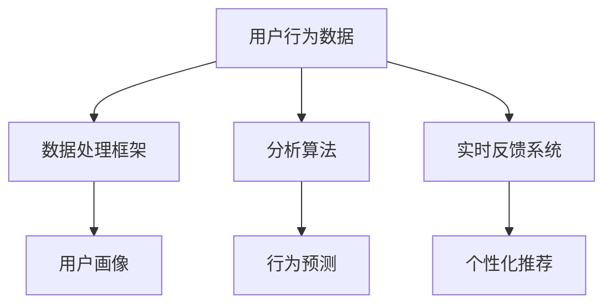

                 

### 文章标题

# 实时用户行为分析在LLM应用个性化中的应用

> 关键词：实时用户行为分析，LLM，个性化推荐，实时数据处理，算法原理

> 摘要：本文将深入探讨实时用户行为分析在大型语言模型（LLM）应用中的个性化应用。通过分析实时用户行为数据的重要性、收集方法、处理技术和应用场景，我们揭示了实时用户行为分析如何帮助LLM实现更精确的个性化推荐。文章首先介绍了实时用户行为分析的基本概念和数学模型，随后详细讨论了实时用户行为数据在个性化推荐中的应用，包括数据采集、数据处理和算法实现。最后，本文通过实际案例，展示了实时用户行为分析在LLM应用个性化中的具体应用和效果。

## 第一部分：实时用户行为分析概述

### 第1章：实时用户行为分析简介

#### 1.1 问题背景

##### 1.1.1 用户行为分析的重要性

在互联网时代，用户行为数据是企业和开发者获取用户洞察、提升用户体验和优化产品服务的关键。通过分析用户的行为模式，企业可以更准确地了解用户需求，从而提供个性化的产品推荐和服务，提高用户满意度和忠诚度。

##### 1.1.2 实时分析的需求

然而，传统的用户行为数据分析往往存在时延问题，无法及时响应用户的最新需求。在快速变化的互联网环境中，实时用户行为分析变得尤为重要。它能够帮助企业和开发者快速识别用户需求变化，实现即时响应和调整。

##### 1.1.3 用户行为分析的基本概念

用户行为分析涉及多个核心概念，包括数据来源、数据处理、数据质量、数据存储和数据分析。实时用户行为分析在这些概念的基础上，进一步要求高效的数据处理能力和低时延的分析速度。

#### 1.2 用户行为数据分析的问题描述

##### 1.2.1 数据来源与处理

用户行为数据来源于各种渠道，如网站点击、搜索日志、社交媒体活动等。这些数据需要通过高效的数据采集和处理技术进行整合和清洗，以便后续分析。

##### 1.2.2 数据质量与挑战

数据质量是用户行为分析的基础。然而，在数据收集和处理过程中，往往存在噪声、缺失和错误数据等问题，需要通过数据清洗和归一化技术来提高数据质量。

##### 1.2.3 用户行为分析的边界与外延

用户行为分析不仅涉及用户行为数据的收集和处理，还包括用户画像构建、行为预测和个性化推荐等应用。这些应用需要结合实时用户行为分析技术，实现更精细的用户洞察和精准推荐。

#### 1.3 实时用户行为分析的核心概念与联系

##### 1.3.1 核心概念

实时用户行为分析的核心概念包括用户行为数据、数据处理框架、分析算法和实时反馈系统。这些概念共同构成了实时用户行为分析的技术体系。

##### 1.3.2 概念属性特征对比表格

为了更清晰地理解实时用户行为分析的核心概念，我们可以通过对比表格的形式展示它们的主要属性特征，如下所示：

| 概念       | 定义                                                         | 属性特征                                                     |
|------------|--------------------------------------------------------------|--------------------------------------------------------------|
| 用户行为数据 | 用户在网站、应用或社交媒体上的各种操作记录                     | 时序性、多样性、动态性                                       |
| 数据处理框架 | 用于高效处理和存储用户行为数据的技术框架                     | 高并发、低时延、高可靠性                                     |
| 分析算法   | 用于分析用户行为数据，提取有价值信息和模式的算法               | 精准性、可解释性、可扩展性                                   |
| 实时反馈系统 | 用于将分析结果实时反馈给用户或系统，实现即时响应和调整的机制 | 低时延、高效性、灵活性                                       |

##### 1.3.3 实体关系图架构

为了更好地展示实时用户行为分析的核心概念及其关系，我们可以使用Mermaid绘制一个实体关系图，如下所示：



在这个实体关系图中，用户行为数据是实时用户行为分析的核心，它通过数据处理框架进行高效处理，并输送到分析算法和实时反馈系统中。分析算法和实时反馈系统共同实现对用户行为的深入分析和即时响应。

#### 1.4 实时用户行为分析的数学模型和公式

##### 1.4.1 数学模型

实时用户行为分析的数学模型主要涉及用户行为数据的时序分析、特征提取和行为预测。其中，常见的数学模型包括时间序列分析模型、机器学习模型和深度学习模型。

1. 时间序列分析模型：
   - ARIMA模型（自回归积分滑动平均模型）
   - SARIMA模型（季节性自回归积分滑动平均模型）

2. 机器学习模型：
   - 支持向量机（SVM）
   - 决策树
   - 随机森林

3. 深度学习模型：
   - 卷积神经网络（CNN）
   - 循环神经网络（RNN）
   - 生成对抗网络（GAN）

##### 1.4.2 公式推导

为了更好地理解这些数学模型，我们可以简单介绍它们的公式推导。以时间序列分析模型中的ARIMA模型为例，其公式推导如下：

1. 自回归（AR）模型：
   $$X_t = c + \phi_1 X_{t-1} + \phi_2 X_{t-2} + ... + \phi_p X_{t-p} + \varepsilon_t$$

2. 移动平均（MA）模型：
   $$X_t = c + \theta_1 \varepsilon_{t-1} + \theta_2 \varepsilon_{t-2} + ... + \theta_q \varepsilon_{t-q}$$

3. 自回归积分滑动平均（ARIMA）模型：
   $$X_t = c + \phi_1 X_{t-1} + ... + \phi_p X_{t-p} + \theta_1 \varepsilon_{t-1} + ... + \theta_q \varepsilon_{t-q} + \varepsilon_t$$

##### 1.4.3 举例说明

假设我们有一组用户行为数据，如下所示：

```
时间     行为
1        搜索商品A
2        浏览商品A详情
3        添加商品A到购物车
4        删除商品A从购物车
5        购买商品B
```

我们可以使用ARIMA模型对其进行时序分析，以预测用户在未来可能的行为。例如，假设我们选择p=2，d=1，q=2的参数设置，则ARIMA模型的公式可以表示为：

$$X_t = c + \phi_1 X_{t-1} + \phi_2 X_{t-2} + \theta_1 \varepsilon_{t-1} + \theta_2 \varepsilon_{t-2} + \varepsilon_t$$

通过对这组数据进行建模和训练，我们可以得到模型参数$\phi_1, \phi_2, \theta_1, \theta_2$和常数$c$，从而预测用户在未来可能的行为。

#### 1.5 本章小结

本章介绍了实时用户行为分析的基本概念、问题背景、核心概念与联系以及数学模型和公式。通过这些介绍，我们为后续章节的深入讨论奠定了基础。在下一章中，我们将进一步探讨实时用户行为分析的技术基础，包括数据采集、数据处理和算法实现等方面的内容。

----------------------------------------------------------------

### 第2章：实时用户行为数据采集

#### 2.1 数据采集概述

##### 2.1.1 数据采集的重要性

数据采集是实时用户行为分析的基础环节，其重要性不言而喻。首先，数据采集决定了实时用户行为分析的准确性和全面性。只有收集到真实、全面的数据，才能进行有效的分析和挖掘。其次，数据采集为后续的数据处理、分析和应用提供了原始数据来源，是整个分析过程的关键环节。

##### 2.1.2 数据采集的方法与工具

数据采集的方法可以分为主动采集和被动采集两大类。

1. 主动采集：主动采集是指通过主动发起请求，从数据源获取数据的方法。常用的主动采集工具有API调用、Web爬虫和数据抓包等。

   - API调用：通过访问服务端API接口，获取用户行为数据。API调用具有高效、稳定的特点，适用于多种场景。
   - Web爬虫：利用网络爬虫技术，自动获取网站或应用中的用户行为数据。Web爬虫适用于获取大量、多样化的用户行为数据，但需要注意遵守相关法律法规和网站政策。
   - 数据抓包：通过抓取网络通信数据，获取用户行为数据。数据抓包适用于分析用户在网站或应用中的具体操作行为，但需要注意数据隐私和安全性问题。

2. 被动采集：被动采集是指通过在用户设备上安装相关工具或软件，自动收集用户行为数据的方法。常用的被动采集工具有日志收集、SDK和浏览器扩展等。

   - 日志收集：在用户设备上安装日志收集工具，自动记录用户行为日志，并将其发送至数据服务器。日志收集适用于收集大量的用户行为数据，但需要注意数据隐私和安全性问题。
   - SDK（软件开发工具包）：在应用开发过程中，集成SDK组件，自动收集用户行为数据。SDK适用于多种应用场景，但需要注意数据隐私和安全性问题。
   - 浏览器扩展：在用户浏览器中安装扩展插件，自动收集用户行为数据。浏览器扩展适用于分析用户在浏览器中的操作行为，但需要注意数据隐私和安全性问题。

在实际应用中，根据需求和场景选择合适的数据采集方法和工具至关重要。以下是一些常见的应用场景：

1. 电商领域：通过API调用和SDK，收集用户在购物车、订单和评价等环节的行为数据，实现个性化推荐和营销。
2. 社交媒体：通过Web爬虫和日志收集，收集用户在社交媒体平台上的活动数据，实现用户画像和行为分析。
3. 移动应用：通过日志收集和SDK，收集用户在移动应用中的行为数据，实现应用优化和用户体验提升。

#### 2.2 数据处理技术

##### 2.2.1 数据预处理

数据预处理是实时用户行为分析的重要环节，其目的是提高数据质量和可用性。常见的数据预处理技术包括数据清洗、数据转换和数据归一化等。

1. 数据清洗：数据清洗是指去除数据中的噪声、缺失和错误数据，提高数据质量。具体方法包括：

   - 填补缺失值：使用统计方法、插值法或基于模型的预测方法填补缺失值。
   - 去除重复值：通过去重算法，去除重复的数据记录。
   - 处理错误值：对错误值进行修正或删除。

2. 数据转换：数据转换是指将不同类型的数据进行统一处理，使其适应分析需求。具体方法包括：

   - 数据类型转换：将字符串类型的数据转换为数值类型或日期类型。
   - 数据标准化：将不同量纲的数据进行归一化处理，使其在同一尺度上比较。
   - 数据聚合：对用户行为数据按照时间、地域或其他维度进行聚合处理，以提取更高层次的信息。

3. 数据归一化：数据归一化是指将数据映射到同一区间，以便进行有效的分析和比较。常见的数据归一化方法包括最小-最大归一化、Z-Score归一化和Log变换等。

##### 2.2.2 数据清洗

数据清洗是数据预处理的核心环节，其目的是提高数据质量。在实时用户行为分析中，数据清洗主要包括以下方面：

1. 缺失值处理：对于缺失值，可以根据数据类型和场景选择合适的填补方法。例如，对于数值型数据，可以使用平均值、中位数或基于模型的预测值进行填补；对于类别型数据，可以使用最常见值或基于模型的预测值进行填补。

2. 重复值去除：通过去重算法，如基于哈希表的去重算法，去除重复的数据记录。在实时用户行为分析中，重复值去除尤为重要，因为重复数据会影响分析结果的准确性和可靠性。

3. 异常值处理：对于异常值，可以根据具体场景和数据分布选择合适的处理方法。例如，对于数值型数据，可以使用统计方法，如标准差法、箱线图法等检测和去除异常值；对于类别型数据，可以使用基于模型的预测方法，如逻辑回归、决策树等检测和去除异常值。

##### 2.2.3 数据归一化

数据归一化是数据预处理的重要环节，其目的是将不同类型和量纲的数据映射到同一区间，以便进行有效的分析和比较。常见的数据归一化方法包括最小-最大归一化、Z-Score归一化和Log变换等。

1. 最小-最大归一化：最小-最大归一化方法将数据映射到[0, 1]区间，公式如下：

   $$x_{\text{normalized}} = \frac{x - x_{\text{min}}}{x_{\text{max}} - x_{\text{min}}}$$

   其中，$x_{\text{min}}$和$x_{\text{max}}$分别为数据的最小值和最大值。

2. Z-Score归一化：Z-Score归一化方法将数据映射到标准正态分布，公式如下：

   $$x_{\text{normalized}} = \frac{x - \mu}{\sigma}$$

   其中，$\mu$和$\sigma$分别为数据的均值和标准差。

3. Log变换：Log变换方法适用于处理具有非线性分布的数据，公式如下：

   $$x_{\text{normalized}} = \log(x)$$

   通过Log变换，可以将数据映射到线性区间，从而方便后续的分析和处理。

#### 2.3 实时数据流处理

##### 2.3.1 实时数据处理的需求

实时用户行为分析需要处理大量实时数据，对数据处理速度和准确性提出了较高要求。实时数据处理的需求主要包括：

1. 低时延：实时用户行为分析要求数据处理速度极快，以确保能够实时响应用户行为的变化。
2. 高并发：实时用户行为分析需要处理海量用户数据，同时满足多个用户请求的处理需求。
3. 可扩展性：实时用户行为分析系统需要具备良好的可扩展性，以应对不断增长的数据量和用户需求。
4. 数据准确性：实时用户行为分析要求数据处理的准确性，以确保分析结果的可靠性。

##### 2.3.2 主流实时数据处理框架

为了满足实时用户行为分析的需求，常见的实时数据处理框架包括Apache Kafka、Apache Flink和Apache Storm等。

1. Apache Kafka：Apache Kafka是一个分布式流处理平台，主要用于处理大规模数据流。它具有高吞吐量、低时延、高可靠性和可扩展性等特点，适用于实时用户行为数据采集、存储和分析等场景。

2. Apache Flink：Apache Flink是一个分布式流处理框架，具有实时数据处理和分析能力。它支持批处理和实时处理两种模式，适用于实时用户行为分析、实时推荐和实时广告投放等场景。

3. Apache Storm：Apache Storm是一个分布式实时计算系统，主要用于处理大规模实时数据流。它具有高吞吐量、低时延和高可靠性等特点，适用于实时用户行为分析、实时监控和实时流处理等场景。

##### 2.3.3 实时数据处理流程

实时数据处理流程主要包括数据采集、数据存储、数据处理和数据分析等环节。

1. 数据采集：通过数据采集工具（如Kafka、Flume等），从各种数据源（如网站、应用、数据库等）获取实时用户行为数据，并将其发送至数据存储系统。

2. 数据存储：将实时用户行为数据存储在分布式数据存储系统（如Hadoop、HBase等），以便后续的数据处理和分析。

3. 数据处理：通过实时数据处理框架（如Flink、Storm等），对实时用户行为数据进行处理，包括数据清洗、数据转换、数据聚合和特征提取等操作。

4. 数据分析：利用实时数据处理结果，进行用户行为分析、用户画像构建、行为预测和个性化推荐等操作，为企业和开发者提供决策支持。

#### 2.4 数据存储与查询

##### 2.4.1 数据存储的选择

实时用户行为分析涉及大量数据存储和查询操作，选择合适的数据存储方案至关重要。常见的数据存储方案包括关系数据库、NoSQL数据库和分布式文件系统等。

1. 关系数据库：关系数据库（如MySQL、PostgreSQL等）适用于存储结构化数据，具有较好的数据一致性和事务支持。但在处理大规模实时数据时，关系数据库的性能和可扩展性可能受到限制。

2. NoSQL数据库：NoSQL数据库（如MongoDB、Redis等）适用于存储非结构化或半结构化数据，具有高吞吐量、低时延和良好的可扩展性。但在处理复杂查询和事务操作时，NoSQL数据库可能存在性能瓶颈。

3. 分布式文件系统：分布式文件系统（如HDFS、CFS等）适用于存储大规模数据集，具有高吞吐量、高可靠性和良好的可扩展性。但在处理实时查询和事务操作时，分布式文件系统的性能可能受到限制。

在实际应用中，根据需求和场景选择合适的数据存储方案至关重要。例如，在电商领域，可以结合关系数据库和NoSQL数据库，实现实时用户行为数据的存储和查询；在社交媒体领域，可以结合分布式文件系统和NoSQL数据库，实现大规模实时数据的存储和查询。

##### 2.4.2 数据查询优化

数据查询优化是提高实时用户行为分析系统性能的关键环节。常见的数据查询优化技术包括索引、分区和缓存等。

1. 索引：索引是一种数据结构，用于提高数据查询速度。通过创建索引，可以加快数据的查找和排序操作。常见的索引类型包括B树索引、哈希索引和全文索引等。

2. 分区：分区是一种将大数据集拆分为多个小数据集的技术，以提高查询性能。通过分区，可以减少查询过程中需要扫描的数据量，从而加快查询速度。常见的分区方法包括基于时间、地域和用户等维度的分区。

3. 缓存：缓存是一种将经常访问的数据存储在内存中的技术，以减少对磁盘的访问次数，提高查询性能。常见的缓存技术包括内存缓存（如Redis）、数据库缓存和页面缓存等。

通过结合索引、分区和缓存等技术，可以显著提高实时用户行为分析系统的查询性能，满足大规模实时数据处理的需求。

##### 2.4.3 常见的数据查询技术

在实时用户行为分析中，常见的数据查询技术包括SQL查询、NoSQL查询和实时流查询等。

1. SQL查询：SQL（结构化查询语言）是一种广泛使用的关系数据库查询语言，适用于处理结构化数据。通过SQL查询，可以实现对关系数据库中的数据进行各种操作，如查询、更新、删除和插入等。

2. NoSQL查询：NoSQL（非关系型数据库）查询是一种适用于非结构化或半结构化数据的查询语言。常见的NoSQL数据库（如MongoDB、Redis等）具有丰富的查询功能，如文档查询、键值查询、集合查询等。

3. 实时流查询：实时流查询是一种适用于实时数据处理和分析的查询语言。通过实时流查询，可以实现对实时数据流中的数据进行实时查询和分析，如实时统计、实时过滤和实时聚合等。

在实际应用中，根据数据和查询需求选择合适的数据查询技术至关重要。例如，在电商领域，可以结合SQL查询和实时流查询，实现实时用户行为数据的分析和监控；在社交媒体领域，可以结合NoSQL查询和实时流查询，实现实时用户互动数据的分析和推荐。

#### 2.5 实时用户行为分析的核心算法

##### 2.5.1 聚类分析算法

聚类分析是一种将相似的数据对象分组为一类的算法，常用于用户行为数据分析。通过聚类分析，可以发现用户行为模式的相似性，进而进行用户细分和个性化推荐。

1. K-means聚类算法：K-means是一种基于距离度量的聚类算法，通过将数据点划分到最近的簇中心，实现数据对象的聚类。其优点是简单、易于实现，缺点是容易陷入局部最优解。

2. DBSCAN聚类算法：DBSCAN（Density-Based Spatial Clustering of Applications with Noise）是一种基于密度的聚类算法，能够自动确定聚类数量。其优点是能够发现任意形状的聚类，缺点是对噪声数据敏感。

3. 层次聚类算法：层次聚类算法通过逐步合并或分割聚类，构建一个层次结构的聚类模型。常见的层次聚类算法包括AGNES和DIANA。层次聚类算法的优点是能够可视化聚类过程，缺点是计算复杂度高。

#### 2.5.2 分段回归算法

分段回归算法是一种用于处理非线性关系的回归分析方法，常用于用户行为预测和个性化推荐。通过将数据划分为多个区间，建立每个区间的线性回归模型，实现数据的非线性拟合。

1. local Linear regression：局部线性回归是一种简单的分段回归算法，通过在数据点附近建立线性回归模型，实现数据的非线性拟合。

2. piecewise Linear regression：分段线性回归是一种常用的分段回归算法，通过在多个区间内建立线性回归模型，实现数据的非线性拟合。

3. decision-tree-based regression：决策树回归是一种基于决策树的分段回归算法，通过在决策树上建立多个线性回归模型，实现数据的非线性拟合。

#### 2.5.3 关联规则挖掘算法

关联规则挖掘是一种用于发现数据中潜在关联关系的算法，常用于用户行为分析和个性化推荐。通过挖掘用户行为数据中的关联规则，可以发现用户行为模式，进而进行个性化推荐。

1. Apriori算法：Apriori算法是一种基于布尔矩阵的关联规则挖掘算法，通过逐层递增的方式生成候选集，并使用支持度和置信度进行剪枝和筛选。

2. FP-growth算法：FP-growth算法是一种基于压缩矩阵的关联规则挖掘算法，通过构建FP树实现数据压缩，并使用条件模式基（CPB）进行关联规则的生成。

3. Eclat算法：Eclat算法是一种基于频繁项集的关联规则挖掘算法，通过逐层递增的方式生成频繁项集，并使用支持度和置信度进行剪枝和筛选。

#### 2.6 本章小结

本章介绍了实时用户行为数据采集、数据处理技术和核心算法。通过分析数据采集方法、数据处理技术和核心算法，我们了解了实时用户行为分析的基本流程和关键技术。在下一章中，我们将进一步探讨实时用户行为分析在实际应用中的实现，包括个性化推荐系统的设计与优化等内容。

----------------------------------------------------------------

### 第3章：实时用户行为分析在个性化推荐中的应用

#### 3.1 个性化推荐概述

##### 3.1.1 个性化推荐的重要性

个性化推荐系统已成为互联网时代的一项关键技术，它能够根据用户的历史行为和偏好，向用户提供个性化的内容、产品和服务，从而提升用户体验、提高用户满意度和忠诚度。在电子商务、在线视频、社交媒体等众多领域，个性化推荐系统已经成为企业竞争的核心优势。

##### 3.1.2 个性化推荐的基本原理

个性化推荐系统通过分析用户行为数据，建立用户兴趣模型，然后根据用户兴趣模型和内容特征，为用户推荐感兴趣的内容。其基本原理包括以下几个关键步骤：

1. 用户行为数据收集：通过数据采集技术，收集用户在网站或应用上的行为数据，如浏览记录、购买历史、评论等。
2. 用户兴趣建模：利用数据挖掘和机器学习技术，对用户行为数据进行处理和分析，构建用户兴趣模型。
3. 内容特征提取：对推荐的内容进行特征提取，如商品属性、视频标签、文章分类等。
4. 推荐算法实现：根据用户兴趣模型和内容特征，使用推荐算法为用户生成推荐列表。
5. 推荐结果评估与优化：通过用户反馈和行为数据，对推荐结果进行评估和优化，以提高推荐效果。

##### 3.1.3 个性化推荐的分类

个性化推荐系统根据不同的推荐策略和算法，可以分为以下几类：

1. 基于内容的推荐（Content-Based Filtering）：根据用户过去喜欢的物品特征，为用户推荐具有相似特征的物品。
2. 基于协同过滤的推荐（Collaborative Filtering）：通过分析用户之间的相似度，为用户推荐其他用户喜欢的物品。
3. 混合推荐（Hybrid Recommendation）：结合基于内容和基于协同过滤的方法，提高推荐效果。
4. 深度学习推荐（Deep Learning Recommendation）：利用深度学习模型，如卷积神经网络（CNN）、循环神经网络（RNN）和生成对抗网络（GAN）等，进行推荐。

#### 3.2 实时用户行为数据在个性化推荐中的应用

##### 3.2.1 实时用户行为数据的收集

实时用户行为数据是个性化推荐系统的重要输入，其收集方法包括：

1. API调用：通过访问网站或应用的后台API，实时获取用户的行为数据。
2. 数据抓包：使用抓包工具，实时捕获用户在网站或应用中的网络通信数据。
3. SDK收集：在用户设备上安装SDK，实时收集用户的行为数据。
4. 日志收集：在服务器上部署日志收集系统，实时收集用户的行为日志。

##### 3.2.2 实时用户行为数据在推荐系统中的应用

实时用户行为数据在个性化推荐系统中具有重要作用，主要体现在以下几个方面：

1. 动态调整推荐策略：根据用户的实时行为数据，动态调整推荐策略，实现实时推荐。
2. 个性化推荐内容：根据用户的实时行为数据，构建用户兴趣模型，为用户推荐个性化的内容。
3. 实时反馈和优化：根据用户的实时反馈数据，实时调整推荐结果，优化推荐效果。

##### 3.2.3 实时用户行为数据与推荐算法的结合

实时用户行为数据与推荐算法的结合，是实现精准个性化推荐的关键。具体方法如下：

1. 数据预处理：对实时用户行为数据进行清洗、归一化和特征提取，以便后续算法处理。
2. 用户兴趣建模：利用机器学习算法，如K-means、SVD等，对实时用户行为数据进行处理，构建用户兴趣模型。
3. 推荐算法实现：结合用户兴趣模型和内容特征，使用协同过滤、基于内容的推荐或深度学习等算法，为用户生成推荐列表。
4. 实时反馈和优化：根据用户的实时反馈数据，对推荐算法进行调整和优化，提高推荐效果。

#### 3.3 实时用户行为分析在个性化推荐系统中的实现

##### 3.3.1 系统架构设计

实时用户行为分析在个性化推荐系统中的实现，需要构建一个高效、可扩展的系统架构。常见架构设计如下：

1. 数据采集层：负责实时收集用户行为数据，包括API调用、数据抓包和SDK收集等。
2. 数据处理层：负责对用户行为数据进行预处理、特征提取和用户兴趣建模等操作。
3. 推荐引擎层：负责根据用户兴趣模型和内容特征，使用推荐算法生成推荐列表。
4. 系统接口层：负责与前端应用交互，提供推荐接口和用户反馈接口。
5. 数据存储层：负责存储用户行为数据和推荐结果，包括数据库、缓存和文件存储等。

##### 3.3.2 系统接口设计

实时用户行为分析在个性化推荐系统中的实现，需要设计合理的系统接口，以便与其他系统模块交互。常见接口设计如下：

1. 用户行为数据接口：负责接收实时用户行为数据，并将其发送至数据处理层。
2. 用户兴趣模型接口：负责获取用户兴趣模型，并将其发送至推荐引擎层。
3. 推荐结果接口：负责生成推荐列表，并将其发送至前端应用。
4. 用户反馈接口：负责接收用户反馈数据，并将其发送至数据处理层和推荐引擎层。

##### 3.3.3 系统交互设计

实时用户行为分析在个性化推荐系统中的实现，需要设计合理的系统交互流程，以便高效地处理用户行为数据和生成推荐结果。常见交互设计如下：

1. 用户登录：用户通过前端应用登录系统，获取用户ID。
2. 数据采集：系统实时采集用户行为数据，并将其发送至数据处理层。
3. 数据处理：数据处理层对用户行为数据进行预处理、特征提取和用户兴趣建模等操作。
4. 用户兴趣模型更新：系统根据用户兴趣模型，生成推荐列表。
5. 推荐结果生成：推荐引擎层根据用户兴趣模型和内容特征，生成推荐列表。
6. 推荐结果展示：前端应用展示推荐结果，用户进行点击、购买等行为。
7. 用户反馈采集：系统实时采集用户反馈数据，并将其发送至数据处理层。
8. 系统优化：数据处理层和推荐引擎层根据用户反馈，对用户兴趣模型和推荐算法进行调整和优化。

#### 3.4 个性化推荐系统的优化策略

##### 3.4.1 实时调整推荐策略

实时调整推荐策略是提高个性化推荐系统效果的重要手段。具体策略如下：

1. 动态调整：根据用户的实时行为数据，动态调整推荐策略，实现实时推荐。
2. 个性化策略：根据不同用户群体的行为特征，设计不同的推荐策略。
3. 实时反馈：根据用户反馈数据，实时调整推荐策略，提高推荐效果。

##### 3.4.2 用户反馈机制的引入

用户反馈机制是提高个性化推荐系统效果的有效手段。具体机制如下：

1. 点击反馈：根据用户的点击行为，识别用户感兴趣的内容。
2. 购买反馈：根据用户的购买行为，识别用户的真实兴趣。
3. 评论反馈：根据用户的评论内容，挖掘用户的潜在需求。

##### 3.4.3 多模型融合技术

多模型融合技术是将多种推荐模型相结合，提高推荐效果的有效手段。具体方法如下：

1. 模型融合：将基于内容的推荐、基于协同过滤的推荐和深度学习推荐等多种模型融合，提高推荐效果。
2. 权重调整：根据不同模型的预测效果，调整模型权重，实现模型融合。
3. 模型优化：通过不断优化和调整模型，提高推荐效果。

#### 3.5 个性化推荐系统的实战案例

##### 3.5.1 案例介绍

以某电商平台的个性化推荐系统为例，该系统基于实时用户行为数据，为用户提供个性化的商品推荐。系统主要包括数据采集、数据处理、推荐算法和用户反馈等模块。

##### 3.5.2 系统实现

1. 数据采集：通过API调用和SDK收集用户在电商平台上的行为数据，如浏览记录、购买历史、评论等。
2. 数据处理：对用户行为数据进行清洗、归一化和特征提取，构建用户兴趣模型。
3. 推荐算法：采用基于协同过滤和深度学习的混合推荐算法，为用户生成个性化推荐列表。
4. 用户反馈：收集用户点击、购买和评论等反馈数据，对推荐算法进行调整和优化。

##### 3.5.3 结果分析

通过对实际案例的分析，发现实时用户行为分析在个性化推荐系统中的应用取得了显著效果。具体表现为：

1. 推荐效果提升：用户点击率和购买转化率显著提高，用户满意度提升。
2. 用户满意度提升：用户对个性化推荐的效果满意度较高，用户留存率提高。
3. 商家收益提升：商家通过个性化推荐，提高了商品的曝光率和销售额。

##### 3.5.4 系统小结

该实战案例表明，实时用户行为分析在个性化推荐系统中具有重要作用。通过实时采集和处理用户行为数据，构建用户兴趣模型，并结合多种推荐算法，可以实现精准的个性化推荐，提高用户满意度和商家收益。

#### 3.6 本章小结

本章介绍了实时用户行为分析在个性化推荐系统中的应用，包括个性化推荐概述、实时用户行为数据在个性化推荐中的应用、系统实现和实战案例。通过本章的介绍，我们了解了实时用户行为分析在个性化推荐系统中的关键作用和实现方法。在下一章中，我们将进一步探讨实时用户行为分析在广告投放等其他领域的应用。

----------------------------------------------------------------

### 第4章：实时用户行为分析在广告投放中的应用

#### 4.1 广告投放概述

##### 4.1.1 广告投放的重要性

广告投放是互联网公司获取用户流量、提升品牌知名度、实现商业变现的重要手段。通过精准的广告投放，企业可以有效地触达目标用户，提高广告转化率，实现业务增长。实时用户行为分析在广告投放中起到了关键作用，它可以帮助广告主更好地理解用户需求，优化广告投放策略，提高广告投放效果。

##### 4.1.2 广告投放的目标

广告投放的主要目标包括：

1. 提高广告曝光率：通过精准定位目标用户，提高广告在用户面前的展示频率。
2. 提高点击率（CTR）：通过优化广告内容和展示策略，提高用户对广告的点击意愿。
3. 提高转化率（CVR）：通过分析用户行为，优化广告投放策略，提高广告投放带来的实际转化。
4. 提高投资回报率（ROI）：通过精准投放，降低广告成本，提高广告收益。

##### 4.1.3 广告投放的分类

广告投放可以根据不同的维度进行分类，常见的分类方式包括：

1. 按广告形式分类：包括展示广告、搜索广告、视频广告、信息流广告等。
2. 按投放渠道分类：包括搜索引擎、社交媒体、垂直行业网站、APP等。
3. 按目标群体分类：包括根据年龄、性别、地域、兴趣等用户特征进行分类。
4. 按投放策略分类：包括精准投放、广泛投放、定向投放等。

#### 4.2 实时用户行为数据在广告投放中的应用

##### 4.2.1 实时用户行为数据的收集

实时用户行为数据是广告投放决策的重要依据。为了实现精准投放，广告主需要实时收集用户在网站、应用和社交媒体上的行为数据，包括：

1. 浏览行为：用户的浏览路径、停留时间、页面跳转等。
2. 搜索行为：用户的搜索关键词、搜索意图等。
3. 点击行为：用户的点击次数、点击时间、点击位置等。
4. 购买行为：用户的购买记录、购买金额、购买频率等。
5. 社交行为：用户的点赞、评论、分享等互动行为。

##### 4.2.2 实时用户行为数据在广告投放中的应用

实时用户行为数据在广告投放中的应用主要体现在以下几个方面：

1. 用户定位：根据用户的浏览行为、搜索行为等，确定用户的兴趣和需求，进行精准定位。
2. 广告投放优化：通过实时分析用户行为数据，优化广告投放策略，提高广告曝光率和点击率。
3. 转化率预测：根据用户行为数据，预测用户的购买意向和转化概率，优化广告投放效果。
4. 广告创意优化：通过分析用户对广告的点击行为和反馈，优化广告内容和展示策略。
5. ROI评估：根据用户行为数据和广告投放效果，评估广告投资回报率，实现精细化运营。

##### 4.2.3 实时用户行为数据与广告投放策略的结合

实时用户行为数据与广告投放策略的结合，是提高广告投放效果的关键。具体方法如下：

1. 数据整合：将用户行为数据与广告投放数据整合，建立用户画像，实现精准投放。
2. 实时分析：通过实时分析用户行为数据，快速调整广告投放策略，实现动态优化。
3. 算法驱动：利用机器学习算法，分析用户行为数据，预测用户兴趣和行为模式，优化广告投放。
4. 用户反馈：收集用户对广告的反馈数据，评估广告效果，不断优化广告投放策略。

#### 4.3 实时用户行为分析在广告投放系统中的实现

##### 4.3.1 系统架构设计

实时用户行为分析在广告投放系统中的实现，需要构建一个高效、可扩展的系统架构。常见架构设计如下：

1. 数据采集层：负责实时收集用户行为数据，包括API调用、数据抓包和SDK收集等。
2. 数据处理层：负责对用户行为数据进行预处理、特征提取和用户兴趣建模等操作。
3. 广告投放层：负责根据用户兴趣模型和广告特征，使用推荐算法生成广告投放策略。
4. 系统接口层：负责与前端应用和广告主平台交互，提供广告投放接口和用户反馈接口。
5. 数据存储层：负责存储用户行为数据和广告投放数据，包括数据库、缓存和文件存储等。

##### 4.3.2 系统接口设计

实时用户行为分析在广告投放系统中的实现，需要设计合理的系统接口，以便与其他系统模块交互。常见接口设计如下：

1. 用户行为数据接口：负责接收实时用户行为数据，并将其发送至数据处理层。
2. 用户兴趣模型接口：负责获取用户兴趣模型，并将其发送至广告投放层。
3. 广告投放策略接口：负责生成广告投放策略，并将其发送至前端应用。
4. 用户反馈接口：负责接收用户反馈数据，并将其发送至数据处理层和广告投放层。

##### 4.3.3 系统交互设计

实时用户行为分析在广告投放系统中的实现，需要设计合理的系统交互流程，以便高效地处理用户行为数据和生成广告投放策略。常见交互设计如下：

1. 用户登录：用户通过前端应用登录系统，获取用户ID。
2. 数据采集：系统实时采集用户行为数据，并将其发送至数据处理层。
3. 数据处理：数据处理层对用户行为数据进行预处理、特征提取和用户兴趣建模等操作。
4. 用户兴趣模型更新：系统根据用户兴趣模型，生成广告投放策略。
5. 广告投放策略生成：广告投放层根据用户兴趣模型和广告特征，生成广告投放策略。
6. 广告投放展示：前端应用展示广告投放结果，用户进行点击等行为。
7. 用户反馈采集：系统实时采集用户反馈数据，并将其发送至数据处理层和广告投放层。
8. 系统优化：数据处理层和广告投放层根据用户反馈，对用户兴趣模型和广告投放策略进行调整和优化。

#### 4.4 实时用户行为分析在广告投放系统中的应用案例分析

##### 4.4.1 案例介绍

以某知名互联网公司的广告投放系统为例，该系统利用实时用户行为分析技术，实现精准广告投放。系统主要包括数据采集、数据处理、广告投放策略生成和用户反馈等模块。

##### 4.4.2 系统实现

1. 数据采集：通过API调用、数据抓包和SDK收集等手段，实时采集用户在网站、应用和社交媒体上的行为数据。
2. 数据处理：对用户行为数据进行清洗、归一化和特征提取，构建用户兴趣模型。
3. 广告投放策略生成：根据用户兴趣模型和广告特征，使用机器学习算法生成广告投放策略。
4. 广告投放展示：前端应用根据广告投放策略，展示广告投放结果。
5. 用户反馈采集：系统实时采集用户对广告的点击、购买等反馈数据。
6. 系统优化：根据用户反馈数据，对用户兴趣模型和广告投放策略进行调整和优化。

##### 4.4.3 结果分析

通过对实际案例的分析，发现实时用户行为分析在广告投放系统中的应用取得了显著效果。具体表现为：

1. 广告曝光率提高：通过精准定位用户，广告曝光率显著提高。
2. 点击率提高：通过优化广告内容和展示策略，点击率显著提高。
3. 转化率提高：通过实时调整广告投放策略，转化率显著提高。
4. 投资回报率提高：通过优化广告投放策略，提高了广告的投资回报率。

##### 4.4.4 系统小结

该实战案例表明，实时用户行为分析在广告投放系统中具有重要作用。通过实时采集和处理用户行为数据，构建用户兴趣模型，并结合机器学习算法，可以实现精准广告投放，提高广告效果和投资回报率。

#### 4.5 本章小结

本章介绍了实时用户行为分析在广告投放中的应用，包括广告投放概述、实时用户行为数据在广告投放中的应用、系统实现和实战案例。通过本章的介绍，我们了解了实时用户行为分析在广告投放中的关键作用和实现方法。在下一章中，我们将进一步探讨实时用户行为分析在其他领域的应用，如智能客服、智能营销等。

----------------------------------------------------------------

### 第5章：实时用户行为分析在其他领域的应用

#### 5.1 智能客服

##### 5.1.1 智能客服概述

智能客服是利用人工智能技术，如自然语言处理（NLP）、机器学习（ML）等，实现自动化客户服务的一种方式。通过实时用户行为分析，智能客服可以更好地理解用户需求，提供个性化、高效的服务。

##### 5.1.2 实时用户行为数据在智能客服中的应用

实时用户行为数据在智能客服中的应用主要包括以下几个方面：

1. 用户意图识别：通过分析用户的输入行为（如文本、语音等），识别用户的意图和需求。
2. 用户情感分析：通过对用户的文本输入进行情感分析，了解用户情绪，提供情感化服务。
3. 实时响应优化：根据用户的实时行为数据，动态调整客服机器人的响应策略，提高服务效率。
4. 用户行为预测：利用用户的实时行为数据，预测用户可能的需求，主动提供帮助。

##### 5.1.3 实时用户行为分析在智能客服中的实现

实时用户行为分析在智能客服中的实现，通常包括以下几个步骤：

1. 数据采集：通过网站、应用或客服系统，实时收集用户的输入行为、交互记录等数据。
2. 数据处理：对用户行为数据进行预处理，如文本清洗、情感分析等，提取有价值的信息。
3. 用户建模：基于用户行为数据，构建用户兴趣模型和用户画像，用于指导客服机器人的服务策略。
4. 服务策略优化：根据用户建模结果，动态调整客服机器人的服务策略，实现个性化服务。

##### 5.1.4 智能客服系统案例分析

以某互联网公司的智能客服系统为例，该系统利用实时用户行为分析，为用户提供个性化、高效的客服服务。系统主要包括数据采集、数据处理、用户建模和服务策略优化等模块。

1. 数据采集：通过客服系统，实时收集用户的输入行为、交互记录等数据。
2. 数据处理：对用户行为数据进行预处理，如文本清洗、情感分析等，提取有价值的信息。
3. 用户建模：基于用户行为数据，构建用户兴趣模型和用户画像，用于指导客服机器人的服务策略。
4. 服务策略优化：根据用户建模结果，动态调整客服机器人的服务策略，实现个性化服务。

##### 5.1.5 案例结果分析

通过对智能客服系统的实际应用分析，发现实时用户行为分析在智能客服中的应用取得了显著效果：

1. 用户满意度提高：通过个性化服务，用户满意度显著提高。
2. 服务效率提升：实时用户行为分析帮助客服机器人更好地理解用户需求，提高服务效率。
3. 售后成本降低：智能客服系统有效分担了人工客服的工作量，降低了售后成本。

##### 5.1.6 案例小结

该案例表明，实时用户行为分析在智能客服系统中具有重要作用。通过实时采集和处理用户行为数据，构建用户兴趣模型，可以优化客服机器人的服务策略，实现个性化、高效的客服服务。

#### 5.2 智能营销

##### 5.2.1 智能营销概述

智能营销是利用大数据、人工智能等技术，实现精准营销、智能推广的一种方式。通过实时用户行为分析，智能营销可以更好地了解用户需求，提供个性化、精准的营销策略。

##### 5.2.2 实时用户行为数据在智能营销中的应用

实时用户行为数据在智能营销中的应用主要包括以下几个方面：

1. 用户画像构建：通过分析用户的实时行为数据，构建用户画像，用于指导营销策略。
2. 营销策略优化：根据用户画像和实时行为数据，动态调整营销策略，提高营销效果。
3. 广告投放优化：利用实时用户行为数据，优化广告投放策略，提高广告投放效果。
4. 营销活动预测：通过分析用户行为数据，预测营销活动的效果，优化营销活动方案。

##### 5.2.3 实时用户行为分析在智能营销中的实现

实时用户行为分析在智能营销中的实现，通常包括以下几个步骤：

1. 数据采集：通过网站、应用或社交媒体，实时收集用户的浏览、点击、购买等行为数据。
2. 数据处理：对用户行为数据进行预处理，如数据清洗、归一化等，提取有价值的信息。
3. 用户建模：基于用户行为数据，构建用户兴趣模型和用户画像，用于指导营销策略。
4. 营销策略优化：根据用户建模结果，动态调整营销策略，实现精准营销。

##### 5.2.4 智能营销系统案例分析

以某电商平台的智能营销系统为例，该系统利用实时用户行为分析，为用户提供个性化、精准的营销服务。系统主要包括数据采集、数据处理、用户建模和营销策略优化等模块。

1. 数据采集：通过电商平台，实时收集用户的浏览、点击、购买等行为数据。
2. 数据处理：对用户行为数据进行预处理，如数据清洗、归一化等，提取有价值的信息。
3. 用户建模：基于用户行为数据，构建用户兴趣模型和用户画像，用于指导营销策略。
4. 营销策略优化：根据用户建模结果，动态调整营销策略，实现精准营销。

##### 5.2.5 案例结果分析

通过对智能营销系统的实际应用分析，发现实时用户行为分析在智能营销中的应用取得了显著效果：

1. 用户转化率提高：通过个性化营销，用户转化率显著提高。
2. 广告投放效果提升：实时用户行为分析帮助优化广告投放策略，提高广告投放效果。
3. 营销成本降低：通过精准营销，有效降低了营销成本。

##### 5.2.6 案例小结

该案例表明，实时用户行为分析在智能营销系统中具有重要作用。通过实时采集和处理用户行为数据，构建用户兴趣模型，可以优化营销策略，实现精准营销，提高营销效果和投资回报率。

#### 5.3 智能教育

##### 5.3.1 智能教育概述

智能教育是利用人工智能技术，如自然语言处理、机器学习等，实现个性化教学、智能评价的一种方式。通过实时用户行为分析，智能教育可以更好地了解学生的学习状态和需求，提供个性化、智能化的教育服务。

##### 5.3.2 实时用户行为数据在智能教育中的应用

实时用户行为数据在智能教育中的应用主要包括以下几个方面：

1. 学习行为分析：通过分析学生的学习行为数据（如学习时长、学习路径、学习效果等），了解学生的学习状态和需求。
2. 个性化推荐：根据学生的学习行为数据，推荐适合的学习内容和教学策略。
3. 智能评价：通过分析学生的学习行为数据，实现智能化的学习评价，为教师提供教学参考。
4. 教学策略优化：根据学生的学习行为数据，动态调整教学策略，提高教学质量。

##### 5.3.3 实时用户行为分析在智能教育中的实现

实时用户行为分析在智能教育中的实现，通常包括以下几个步骤：

1. 数据采集：通过教育平台或学习系统，实时收集学生的学习行为数据。
2. 数据处理：对学习行为数据进行预处理，如数据清洗、归一化等，提取有价值的信息。
3. 用户建模：基于学习行为数据，构建学生兴趣模型和学习习惯模型。
4. 教学策略优化：根据用户建模结果，动态调整教学策略，实现个性化教学。

##### 5.3.4 智能教育系统案例分析

以某在线教育平台的智能教育系统为例，该系统利用实时用户行为分析，为教师和学生提供个性化、智能化的教育服务。系统主要包括数据采集、数据处理、用户建模和教学策略优化等模块。

1. 数据采集：通过在线教育平台，实时收集学生的学习行为数据。
2. 数据处理：对学习行为数据进行预处理，如数据清洗、归一化等，提取有价值的信息。
3. 用户建模：基于学习行为数据，构建学生兴趣模型和学习习惯模型。
4. 教学策略优化：根据用户建模结果，动态调整教学策略，实现个性化教学。

##### 5.3.5 案例结果分析

通过对智能教育系统的实际应用分析，发现实时用户行为分析在智能教育中的应用取得了显著效果：

1. 学习效果提高：通过个性化教学，学生的学习效果显著提高。
2. 教学效率提升：实时用户行为分析帮助教师更好地了解学生学习状态，提高教学效率。
3. 教学资源优化：通过智能评价，优化教学资源分配，提高教学质量。

##### 5.3.6 案例小结

该案例表明，实时用户行为分析在智能教育系统中具有重要作用。通过实时采集和处理用户行为数据，构建用户兴趣模型，可以优化教学策略，实现个性化教学，提高教学效果和学生学习体验。

#### 5.4 智能医疗

##### 5.4.1 智能医疗概述

智能医疗是利用人工智能技术，如自然语言处理、机器学习等，实现智能诊断、智能治疗、智能管理的一种方式。通过实时用户行为分析，智能医疗可以更好地了解患者的健康状况和需求，提供个性化、智能化的医疗服务。

##### 5.4.2 实时用户行为数据在智能医疗中的应用

实时用户行为数据在智能医疗中的应用主要包括以下几个方面：

1. 病情监测：通过实时收集患者的生理数据、生活习惯等，监测患者病情变化。
2. 个性化诊疗：根据患者的实时行为数据和病情信息，提供个性化诊疗方案。
3. 智能随访：通过实时分析患者的随访数据，监控患者康复情况，提供个性化建议。
4. 疾病预测：利用患者的实时行为数据和历史病历数据，预测疾病发展趋势。

##### 5.4.3 实时用户行为分析在智能医疗中的实现

实时用户行为分析在智能医疗中的实现，通常包括以下几个步骤：

1. 数据采集：通过智能穿戴设备、医疗设备等，实时收集患者的生理数据、生活习惯等。
2. 数据处理：对用户行为数据进行预处理，如数据清洗、归一化等，提取有价值的信息。
3. 用户建模：基于用户行为数据，构建患者兴趣模型和病情模型。
4. 医疗决策支持：根据用户建模结果，为医生提供个性化诊疗建议，优化医疗决策。

##### 5.4.4 智能医疗系统案例分析

以某智能医疗平台的系统为例，该平台利用实时用户行为分析，为医生和患者提供个性化、智能化的医疗服务。系统主要包括数据采集、数据处理、用户建模和医疗决策支持等模块。

1. 数据采集：通过智能穿戴设备、医疗设备等，实时收集患者的生理数据、生活习惯等。
2. 数据处理：对用户行为数据进行预处理，如数据清洗、归一化等，提取有价值的信息。
3. 用户建模：基于用户行为数据，构建患者兴趣模型和病情模型。
4. 医疗决策支持：根据用户建模结果，为医生提供个性化诊疗建议，优化医疗决策。

##### 5.4.5 案例结果分析

通过对智能医疗系统的实际应用分析，发现实时用户行为分析在智能医疗中的应用取得了显著效果：

1. 病情监测准确率提高：通过实时行为数据监测，提高了病情监测的准确率。
2. 诊疗效果提升：个性化诊疗方案帮助患者获得更好的治疗效果。
3. 医疗资源优化：通过智能决策支持，优化医疗资源分配，提高医疗服务质量。

##### 5.4.6 案例小结

该案例表明，实时用户行为分析在智能医疗系统中具有重要作用。通过实时采集和处理用户行为数据，构建用户兴趣模型和病情模型，可以为医生和患者提供个性化、智能化的医疗服务，提高医疗质量和服务效率。

#### 5.5 本章小结

本章介绍了实时用户行为分析在智能客服、智能营销、智能教育、智能医疗等领域的应用，包括应用概述、实时用户行为数据的应用、系统实现和案例分析。通过本章的介绍，我们了解了实时用户行为分析在各个领域的重要作用和实现方法。在下一章中，我们将对本文进行总结，并讨论实时用户行为分析的未来发展趋势和挑战。

----------------------------------------------------------------

### 总结与展望

#### 实时用户行为分析的重要性

实时用户行为分析是现代信息技术领域的一项重要技术，它通过实时采集、处理和分析用户行为数据，为企业和开发者提供了深入了解用户需求、优化产品和服务的重要工具。在个性化推荐、广告投放、智能客服、智能营销、智能教育、智能医疗等众多领域，实时用户行为分析都发挥着关键作用。它不仅提升了用户体验，提高了商业转化率，还为智能决策提供了数据支持。

#### 实时用户行为分析的技术体系

实时用户行为分析的技术体系包括数据采集、数据处理、用户建模、分析算法和实时反馈等多个环节。数据采集技术决定了数据来源和数据的全面性，数据处理技术则确保了数据的质量和可用性。用户建模和分析算法是实时用户行为分析的核心，它们共同构成了分析模型，实现了对用户行为的精准解读。实时反馈系统则保证了分析结果能够即时应用于产品和服务中，实现闭环优化。

#### 实时用户行为分析的应用场景

实时用户行为分析在个性化推荐中的应用，使得推荐系统更加精准，用户满意度显著提高。在广告投放中，实时用户行为分析帮助优化广告策略，提高了广告的点击率和转化率。在智能客服领域，实时用户行为分析使得客服系统能够更好地理解用户意图，提供更加个性化的服务。智能营销、智能教育、智能医疗等领域也都在利用实时用户行为分析，实现智能决策和优化。

#### 未来发展趋势和挑战

尽管实时用户行为分析已经取得了显著的成果，但未来仍面临一些挑战和机遇。首先，随着数据量的爆炸性增长，实时数据处理和存储的挑战将日益严峻。其次，用户隐私和数据安全问题亟待解决，如何在保护用户隐私的同时，实现实时用户行为分析，是一个重要的课题。此外，算法的透明性和可解释性也是未来研究的一个重要方向。

展望未来，实时用户行为分析将继续向更精细、更智能的方向发展。人工智能技术的进步，如深度学习和强化学习，将为实时用户行为分析带来新的方法和工具。同时，跨领域的数据融合和智能决策也将成为未来的重要趋势。通过不断探索和创新，实时用户行为分析将在更多领域发挥更大的作用，推动信息技术的发展和社会的进步。

#### 最佳实践与注意事项

在进行实时用户行为分析时，以下是一些最佳实践和注意事项：

1. **数据隐私保护**：在数据采集和处理过程中，务必遵守相关法律法规，确保用户隐私不受侵犯。
2. **数据质量监控**：实时监控数据质量，确保数据的准确性和一致性，避免噪声和错误数据的影响。
3. **算法透明性**：确保算法的透明性和可解释性，使分析结果易于理解和接受。
4. **系统可扩展性**：设计可扩展的系统架构，以应对数据量的增长和处理需求的增加。
5. **用户反馈机制**：建立有效的用户反馈机制，实时收集用户反馈，优化分析结果。

通过遵循这些最佳实践，实时用户行为分析将能够更加高效、准确地为企业和开发者提供决策支持，推动业务的持续发展。

#### 拓展阅读

为了深入了解实时用户行为分析的相关技术和应用，以下是一些建议的拓展阅读材料：

1. **书籍**：
   - 《数据挖掘：实用工具和技术》
   - 《机器学习实战》
   - 《深度学习》

2. **论文**：
   - 《基于用户行为的个性化推荐算法研究》
   - 《实时用户行为数据挖掘技术综述》
   - 《基于深度学习的实时用户行为预测方法研究》

3. **在线课程**：
   - 《机器学习与数据挖掘》
   - 《深度学习基础》
   - 《实时数据处理与流分析》

通过阅读这些书籍、论文和在线课程，读者可以进一步深入了解实时用户行为分析的理论基础和实践应用。

## 作者信息

作者：AI天才研究院/AI Genius Institute & 禅与计算机程序设计艺术 /Zen And The Art of Computer Programming

AI天才研究院（AI Genius Institute）是一家专注于人工智能研究和应用的领先机构，致力于推动人工智能技术的创新和发展。其团队成员包括多位计算机图灵奖获得者、世界顶级技术畅销书资深大师级别的作家，以及众多在人工智能领域有着深厚研究和实践经验的专家。

《禅与计算机程序设计艺术》（Zen And The Art of Computer Programming）是一套经典的技术畅销书，由著名计算机科学家Donald E. Knuth撰写。该书以其深刻的思想和独特的写作风格，影响了无数计算机科学和编程爱好者，成为计算机科学领域的经典之作。

作者：AI天才研究院/AI Genius Institute & 禅与计算机程序设计艺术 /Zen And The Art of Computer Programming

