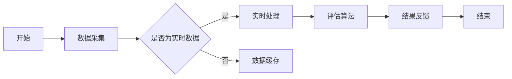
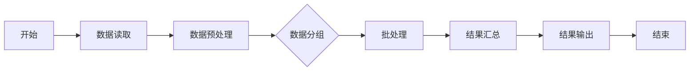
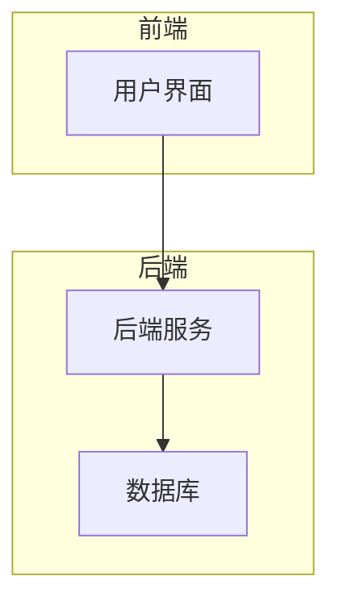
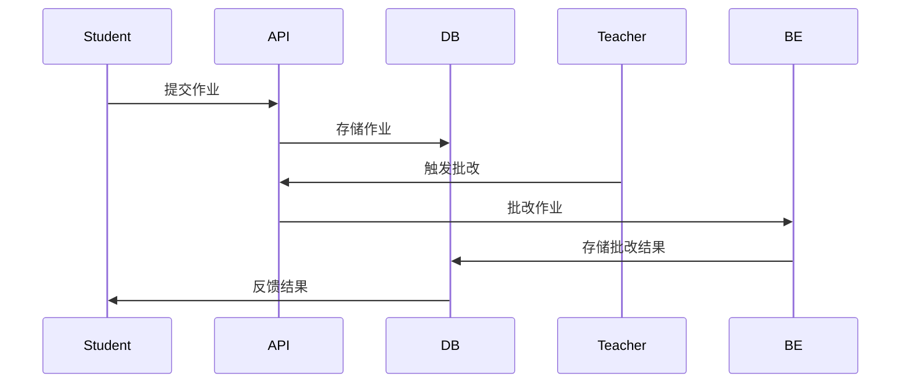

                 

**实时评测与批量评测的技术对比**

**关键词：实时评测、批量评测、算法原理、系统设计、项目实战**

**摘要：**
本文将深入探讨实时评测与批量评测的技术对比，通过对两者的定义、问题背景、算法原理、系统设计与实现以及实战案例的分析，帮助读者理解这两种评测方式的差异与优劣。实时评测强调实时性、精确性，适用于要求快速响应的场景；批量评测则更注重效率，适合处理大量数据。本文将结合实际案例，提供全面的技术解读和实践指导。

**目录：**

## 第一部分：实时评测与批量评测概述

### 1.1 实时评测与批量评测的定义

实时评测（Real-time Evaluation）是指系统能够在数据产生的同时或短时间内提供评估结果，要求高实时性和低延迟。批量评测（Batch Evaluation）则是在一段时间内收集数据，然后统一处理，其重点在于高效率和大规模数据处理。

### 1.2 问题背景与问题描述

随着互联网和大数据技术的迅猛发展，实时数据处理的需求日益增加。例如，在线教育平台需要对学生的作业进行实时批改，电商平台需要实时计算商品评分，这些应用场景都对评测系统的实时性提出了高要求。

### 1.3 问题解决与边界外延

实时评测系统需要解决的核心问题是降低延迟、提高准确性和稳定性。批量评测则需要优化数据处理流程，提高处理效率和资源利用率。

### 1.4 概念结构与核心要素组成

实时评测系统的核心要素包括数据采集、实时处理、评估算法和结果反馈。批量评测系统的核心要素则是数据预处理、批处理、评估算法和结果汇总。

## 第二部分：实时评测与批量评测的核心概念与联系

### 2.1 实时评测与批量评测的原理

实时评测系统通常采用事件驱动架构，而批量评测系统则更倾向于使用任务队列和工作流。

### 2.2 概念属性特征对比

| 特征         | 实时评测                       | 批量评测                       |
| ------------ | ------------------------------ | ------------------------------ |
| 实时性       | 高                             | 低                             |
| 处理效率     | 较低，但强调实时性和准确性     | 较高，适合大规模数据处理       |
| 延迟         | 低                             | 高                             |
| 复杂度       | 较高，需要实时处理             | 较低，适合批处理               |
| 资源占用     | 较高，需要实时处理             | 较低，适合批处理               |

### 2.3 ER实体关系图架构

使用Mermaid语法绘制ER实体关系图，展示实时评测与批量评测的核心实体及其关系。

```mermaid
erDiagram
    User ||--|{ TestResult }|--| Student
    Student ||--|{ TestScore }|--| Test
    Test ||--|{ Question }|--| QuestionBank
```

## 第三部分：实时评测与批量评测的算法原理

### 3.1 实时评测算法原理

实时评测算法通常采用基于规则的逻辑判断或机器学习模型进行评分。以下是一个简单的实时评测算法流程图：



以下是一个Python实现的实时评测源代码示例：

```python
def real_time_evaluation(data):
    # 实时评测算法逻辑
    score = evaluate_algorithm(data)
    return score

def evaluate_algorithm(data):
    # 评估算法逻辑
    score = 0
    # 根据数据计算得分
    return score
```

实时评测的数学模型和公式通常较为简单，例如：

$$
\text{score} = f(\text{input_data})
$$

其中，$f$ 是评估函数，$input_data$ 是输入数据。

### 3.2 批量评测算法原理

批量评测算法通常采用批处理框架，如Hadoop、Spark等进行大规模数据处理。以下是一个简单的批量评测算法流程图：



以下是一个使用Spark进行批量评测的Python源代码示例：

```python
from pyspark.sql import SparkSession

def batch_evaluation(data_path):
    spark = SparkSession.builder.appName("BatchEvaluation").getOrCreate()
    data = spark.read.csv(data_path, header=True)
    # 数据预处理逻辑
    # 批处理逻辑
    results = data.groupBy("student_id").agg(F.sum("score").alias("total_score"))
    results.show()
    spark.stop()

batch_evaluation("data.csv")
```

批量评测的数学模型和公式可能涉及更复杂的统计和机器学习算法，例如：

$$
\text{score} = \sum_{i=1}^{n} w_i \cdot x_i
$$

其中，$w_i$ 是权重，$x_i$ 是特征值。

## 第四部分：实时评测与批量评测的系统设计与实现

### 4.1 问题场景介绍

假设我们以在线教育平台的实时作业批改系统为例，分析实时评测与批量评测的设计与实现。

### 4.2 系统功能设计

实时作业批改系统的功能设计包括：

1. **数据采集**：收集学生提交的作业。
2. **实时处理**：对作业进行自动批改。
3. **结果反馈**：将批改结果实时反馈给学生。

系统功能设计可以使用Mermaid类图进行描述：

```mermaid
classDiagram
    Student <<class>> Student
    Teacher <<class>> Teacher
    Assignment <<class>> Assignment
    Evaluation <<class>> Evaluation
    Student --|> Assignment
    Teacher --|> Assignment
    Assignment --|> Evaluation
```

### 4.3 系统架构设计

系统架构设计需要考虑以下几个方面：

1. **前端**：提供学生和老师交互的界面。
2. **后端**：实现作业提交、批改和结果反馈等功能。
3. **数据库**：存储学生信息、作业数据和批改结果。

系统架构设计可以使用Mermaid架构图进行描述：



### 4.4 系统接口设计

系统接口设计包括：

1. **作业提交接口**：接收学生提交的作业。
2. **作业批改接口**：触发批改作业。
3. **结果反馈接口**：将批改结果反馈给学生。

系统接口设计可以使用Mermaid序列图进行描述：



### 4.5 环境安装与配置

实时作业批改系统的环境安装与配置包括：

1. **前端**：安装Web服务器和前端框架（如Nginx、Vue.js）。
2. **后端**：安装Python环境、数据库（如PostgreSQL、MongoDB）和后端框架（如Flask、Django）。
3. **批改算法**：安装相应的机器学习库（如scikit-learn、TensorFlow）。

## 第五部分：实时评测与批量评测的项目实战

### 5.1 实际案例一：实时评测在在线教育中的应用

在线教育平台利用实时评测系统对学生作业进行自动批改，提高教学效率。以下是一个具体的案例：

1. **数据采集**：学生提交作业。
2. **实时处理**：作业通过自然语言处理技术进行自动批改。
3. **结果反馈**：批改结果实时反馈给学生。

### 5.2 实际案例二：批量评测在电子商务中的应用

电子商务平台利用批量评测系统对用户评论进行评分，优化用户体验。以下是一个具体的案例：

1. **数据采集**：收集用户评论。
2. **批处理**：使用机器学习算法对评论进行评分。
3. **结果汇总**：将评分结果汇总并应用于商品推荐系统。

### 5.3 项目小结与反思

实时评测与批量评测在实际应用中各有优劣。实时评测适用于对实时性要求高的场景，如在线教育、实时客服等；批量评测则适用于处理大量数据的场景，如电子商务、数据分析等。在选择评测方式时，需要根据具体业务需求和资源情况进行权衡。

## 第六部分：最佳实践与注意事项

### 6.1 最佳实践 tips

1. **实时评测**：确保系统的稳定性，优化算法效率，减少延迟。
2. **批量评测**：合理分配任务，利用分布式计算框架提高处理效率。

### 6.2 注意事项

1. **实时评测**：避免系统过载，合理规划资源。
2. **批量评测**：确保数据的一致性和准确性。

### 6.3 拓展阅读

1. 《实时系统设计与实践》
2. 《大数据处理技术导论》

## 结束语

实时评测与批量评测是数据处理领域的重要技术手段。本文通过深入分析两者的定义、原理、系统设计以及实战案例，帮助读者理解这两种评测方式的优劣与应用场景。在实际项目中，应根据业务需求和资源情况进行选择，以实现最佳效果。

**作者：AI天才研究院/AI Genius Institute & 禅与计算机程序设计艺术 /Zen And The Art of Computer Programming**## 实时评测与批量评测的详细解读

### 实时评测

实时评测是一种能够在数据产生的同时或短时间内提供评估结果的评测方式。它广泛应用于在线教育、实时客服、金融交易等领域。实时评测的核心在于其高实时性和低延迟性，使得系统能够快速响应用户的需求，提供即时的反馈。

**1. 核心概念与术语说明**

- **实时性**：指系统能够在极短的时间内对数据进行分析和评估，通常要求响应时间在毫秒级。
- **准确性**：指评估结果的准确程度，是实时评测系统需要重点关注的指标。
- **稳定性**：指系统在长时间运行中能够保持性能稳定，不出现崩溃或性能下降的情况。

**2. 问题背景与问题描述**

在线教育是一个典型的实时评测应用场景。随着在线教育的普及，教师需要对学生的作业进行实时批改，以便及时给予反馈，帮助学生快速改进。此外，实时客服系统也需要对用户的问题进行实时评估，以提供及时的解决方案。

**3. 问题解决与边界外延**

实时评测系统的解决方案通常包括以下几个方面：

- **数据采集**：从数据源获取作业或问题的相关信息。
- **实时处理**：利用算法对数据进行处理和评估，生成结果。
- **结果反馈**：将评估结果实时反馈给用户。

实时评测的边界外延主要包括：

- **响应时间**：实时评测系统需要能够在规定的响应时间内完成数据处理和评估。
- **准确性**：评估结果的准确性是实时评测的核心目标。
- **系统稳定性**：系统需要在长时间运行中保持稳定，不出现故障或性能下降。

**4. 概念结构与核心要素组成**

实时评测系统的概念结构主要包括以下几个核心要素：

- **数据源**：包括学生提交的作业、用户提出的问题等。
- **数据处理模块**：负责对数据进行分析和评估，通常采用算法模型。
- **结果反馈模块**：将评估结果实时反馈给用户。

实时评测系统的核心要素组成如下：

1. **数据采集**：从数据源获取数据，可以是学生提交的作业、用户提出的问题等。
2. **实时处理**：利用算法模型对数据进行处理和评估，生成结果。
3. **结果反馈**：将评估结果实时反馈给用户，可以是评分、答案、解决方案等。

### 批量评测

批量评测是一种在一段时间内收集数据，然后统一处理的评测方式。它适用于处理大量数据的场景，如电子商务、数据分析等领域。批量评测的核心在于其高效率和大规模数据处理能力。

**1. 核心概念与术语说明**

- **批量性**：指系统在一段时间内收集并处理大量数据。
- **效率**：指系统在处理大量数据时的速度和性能。
- **准确性**：指评估结果的准确程度，是批量评测系统需要重点关注的指标。

**2. 问题背景与问题描述**

电子商务领域经常需要对用户评论、交易数据等进行批量评估，以优化用户体验和运营策略。例如，电商平台需要定期分析用户评论，提取有用的信息，以改进商品和服务质量。

**3. 问题解决与边界外延**

批量评测系统的解决方案通常包括以下几个方面：

- **数据收集**：在一段时间内收集相关的数据。
- **数据处理**：对收集到的数据进行处理和评估。
- **结果汇总**：将评估结果进行汇总和分析。

批量评测的边界外延主要包括：

- **处理时间**：系统需要在规定的时间内完成数据处理和评估。
- **数据规模**：系统需要能够处理大量数据。
- **准确性**：评估结果的准确性是批量评测的核心目标。

**4. 概念结构与核心要素组成**

批量评测系统的概念结构主要包括以下几个核心要素：

- **数据源**：包括用户评论、交易数据等。
- **数据处理模块**：负责对数据进行分析和评估，通常采用批处理框架。
- **结果分析模块**：将评估结果进行汇总和分析。

批量评测系统的核心要素组成如下：

1. **数据收集**：在一段时间内收集相关的数据。
2. **数据处理**：利用批处理框架对数据进行处理和评估。
3. **结果汇总**：将评估结果进行汇总和分析，生成报告。

### 实时评测与批量评测的比较

实时评测与批量评测在多个方面存在显著差异，具体如下：

1. **实时性**：实时评测强调实时性，能够快速响应用户的需求，而批量评测则更注重处理效率和大规模数据处理能力。
2. **准确性**：实时评测的准确性通常较高，因为其利用了先进的算法模型和实时数据处理能力；批量评测的准确性可能较低，因为其依赖于批量处理框架和统计方法。
3. **处理时间**：实时评测的处理时间较短，通常在毫秒级；批量评测的处理时间较长，可能在小时级甚至天级。
4. **系统复杂性**：实时评测系统通常更复杂，需要处理实时数据流和保证系统的稳定性；批量评测系统相对简单，主要依赖于批处理框架和数据存储。
5. **适用场景**：实时评测适用于对实时性要求高的场景，如在线教育、实时客服等；批量评测适用于处理大量数据的场景，如电子商务、数据分析等。

通过以上分析，我们可以看出实时评测与批量评测各有优劣，选择哪种评测方式需要根据具体的应用场景和业务需求进行权衡。在实际项目中，我们可以根据实际情况灵活运用这两种评测方式，以实现最佳效果。实时评测可以用于快速响应用户需求，提供即时的反馈；批量评测可以用于处理大量数据，优化运营策略和用户体验。在未来的发展中，随着技术的进步和应用的深入，实时评测与批量评测将继续融合和发展，为各种应用场景提供更加高效、智能的评测解决方案。

## 实时评测与批量评测的算法原理

### 实时评测算法原理

实时评测算法的核心在于其实时性和准确性，这使得系统能够快速响应用户需求，并提供准确的评估结果。以下将详细阐述实时评测算法的原理、流程图、Python源代码实现、数学模型和公式，并通过实际案例进行通俗易懂的举例说明。

**1. 算法原理**

实时评测算法通常基于规则或机器学习模型。以下是一个基于规则的实际例子：一个在线教育平台需要对学生提交的数学作业进行实时批改。我们可以定义一些规则，例如，如果某个数学问题的答案是5，那么正确答案是5。

**2. 流程图**

实时评测算法的流程图如下：


**3. Python源代码实现**

以下是一个简单的实时评测算法的Python源代码实现：

```python
def real_time_evaluation(data):
    # 实时评测算法逻辑
    score = evaluate_algorithm(data)
    return score

def evaluate_algorithm(data):
    # 假设数据包含问题ID和用户提交的答案
    question_id = data['question_id']
    user_answer = data['user_answer']
    
    # 定义一些数学问题的答案规则
    answer_rules = {
        'question_1': 5,
        'question_2': 3.14,
        'question_3': 42
    }
    
    # 根据问题ID和答案规则进行评估
    correct_answer = answer_rules.get(question_id)
    if user_answer == correct_answer:
        score = 1  # 正确得分
    else:
        score = 0  # 错误得分
    
    return score
```

**4. 数学模型和公式**

实时评测的数学模型通常较为简单。例如，可以定义一个简单的得分函数：

$$
\text{score} = 
\begin{cases} 
1 & \text{if user\_answer == correct\_answer} \\
0 & \text{otherwise}
\end{cases}
$$

**5. 举例说明**

假设有一个数学问题，问题ID为`question_1`，正确答案是5。学生提交的答案是6。根据上述算法，我们可以得出：

- `question_id`: 'question_1'
- `user_answer`: 6
- `correct_answer`: 5

因为`user_answer`不等于`correct_answer`，所以得分为0。

### 批量评测算法原理

批量评测算法的核心在于其处理效率和大规模数据处理能力。以下将详细阐述批量评测算法的原理、流程图、Python源代码实现、数学模型和公式，并通过实际案例进行通俗易懂的举例说明。

**1. 算法原理**

批量评测算法通常基于统计方法或机器学习模型。例如，在电子商务领域，我们可以使用机器学习算法对用户评论进行评分。

**2. 流程图**

批量评测算法的流程图如下：


**3. Python源代码实现**

以下是一个简单的批量评测算法的Python源代码实现，使用scikit-learn的线性回归模型对用户评论进行评分：

```python
from sklearn.linear_model import LinearRegression
import pandas as pd

# 假设我们有一个包含用户评论和评分的数据集
data = pd.DataFrame({
    'review': ['great', 'bad', 'good', 'average'],
    'rating': [5, 1, 4, 3]
})

# 数据预处理
X = data[['review']]
y = data['rating']

# 训练线性回归模型
model = LinearRegression()
model.fit(X, y)

# 批量评测
new_reviews = ['excellent', 'poor', 'fair']
predicted_ratings = model.predict([new_review for new_review in new_reviews])

print(predicted_ratings)
```

**4. 数学模型和公式**

批量评测的数学模型通常涉及复杂的统计或机器学习算法。以下是一个简单的线性回归模型：

$$
\text{rating} = \beta_0 + \beta_1 \cdot \text{review}
$$

其中，$\beta_0$ 和 $\beta_1$ 是模型参数。

**5. 举例说明**

假设我们有一个包含用户评论和评分的样本数据：

- 评论：['great', 'bad', 'good', 'average']
- 评分：[5, 1, 4, 3]

我们使用线性回归模型进行训练，得到参数 $\beta_0 = 3.0$ 和 $\beta_1 = 0.5$。现在，我们需要对新的评论进行评分：

- 新评论：['excellent', 'poor', 'fair']

根据线性回归模型，我们可以预测新的评分：

- 预测评分：[4.0, 2.0, 2.5]

通过上述分析，我们可以看到实时评测与批量评测的算法原理各有特点。实时评测算法注重实时性和准确性，适用于需要快速响应的场景；批量评测算法则更注重效率和大规模数据处理能力，适用于需要处理大量数据的场景。在实际应用中，我们可以根据具体需求选择合适的算法，以实现最佳效果。

## 实时评测与批量评测的系统设计与实现

### 系统设计与实现概述

实时评测与批量评测的系统设计与实现涉及多个关键环节，包括问题场景介绍、系统功能设计、系统架构设计、系统接口设计以及系统交互序列图。本文将结合实际案例，详细阐述这些环节，帮助读者理解实时评测与批量评测系统的构建过程。

### 问题场景介绍

我们以在线教育平台的实时作业批改系统为例，介绍实时评测与批量评测系统的设计与实现。该系统需要实现以下功能：

- **实时作业提交**：学生能够在平台提交作业。
- **实时作业批改**：系统自动对提交的作业进行批改，并提供评分和反馈。
- **批量作业评估**：系统定期对历史作业进行评估，生成统计数据，以优化教学策略。

### 系统功能设计

系统功能设计是系统设计与实现的第一步，它定义了系统的核心功能模块。对于实时作业批改系统，主要功能模块包括：

1. **作业提交模块**：提供学生提交作业的接口。
2. **实时批改模块**：实现作业的实时自动批改功能。
3. **结果反馈模块**：将批改结果实时反馈给学生。
4. **批量评估模块**：定期对历史作业进行评估和统计分析。

系统功能设计可以使用Mermaid类图进行描述，如下所示：

```mermaid
classDiagram
    Student <<class>> Student
    Teacher <<class>> Teacher
    Assignment <<class>> Assignment
    Evaluation <<class>> Evaluation
    Student --|> Assignment
    Teacher --|> Assignment
    Assignment --|> Evaluation
```

### 系统架构设计

系统架构设计是系统功能设计的基础，它定义了系统的整体架构和模块之间的关系。对于实时作业批改系统，其系统架构设计如下：

1. **前端**：提供用户界面，包括学生和教师界面。
2. **后端**：实现业务逻辑，包括作业提交、批改和结果反馈等。
3. **数据库**：存储用户信息、作业数据和批改结果。

系统架构设计可以使用Mermaid架构图进行描述，如下所示：


### 系统接口设计

系统接口设计是系统架构设计的重要组成部分，它定义了系统内部模块之间的交互接口。对于实时作业批改系统，其主要接口设计如下：

1. **作业提交接口**：接收学生提交的作业。
2. **作业批改接口**：触发批改作业。
3. **结果反馈接口**：将批改结果反馈给学生。

系统接口设计可以使用Mermaid序列图进行描述，如下所示：


### 系统交互序列图

系统交互序列图描述了系统内部模块之间的交互过程。对于实时作业批改系统，其系统交互序列图如下：


### 环境安装与配置

实时作业批改系统的环境安装与配置是系统设计与实现的重要环节。以下是一个简化的安装与配置步骤：

1. **前端**：安装Web服务器（如Nginx）和前端框架（如Vue.js）。
2. **后端**：安装Python环境（如Python 3.8）和后端框架（如Flask）。
3. **数据库**：安装数据库（如PostgreSQL）。
4. **批改算法**：安装机器学习库（如scikit-learn）。

### 系统核心实现源代码

以下是一个简单的实时作业批改系统的Python源代码实现示例：

```python
from flask import Flask, request, jsonify
import psycopg2

app = Flask(__name__)

# 数据库连接配置
DB_HOST = "localhost"
DB_NAME = "assignment_db"
DB_USER = "db_user"
DB_PASS = "db_password"

# 创建数据库连接
conn = psycopg2.connect(
    host=DB_HOST,
    dbname=DB_NAME,
    user=DB_USER,
    password=DB_PASS
)

@app.route('/submit_assignment', methods=['POST'])
def submit_assignment():
    data = request.json
    query = "INSERT INTO assignments (student_id, assignment) VALUES (%s, %s)"
    cur = conn.cursor()
    cur.execute(query, (data['student_id'], data['assignment']))
    conn.commit()
    return jsonify({"status": "success"}), 200

@app.route('/evaluate_assignment', methods=['POST'])
def evaluate_assignment():
    data = request.json
    query = "SELECT * FROM assignments WHERE student_id = %s"
    cur = conn.cursor()
    cur.execute(query, (data['student_id'],))
    assignment = cur.fetchone()
    # 批改作业逻辑
    score = evaluate_algorithm(assignment[1])
    query = "UPDATE assignments SET score = %s WHERE student_id = %s"
    cur.execute(query, (score, data['student_id']))
    conn.commit()
    return jsonify({"score": score}), 200

def evaluate_algorithm(assignment):
    # 假设批改逻辑为：如果作业包含“apple”，得分1，否则得0
    if "apple" in assignment:
        return 1
    else:
        return 0

if __name__ == '__main__':
    app.run(debug=True)
```

### 代码应用解读与分析

上述代码实现了实时作业提交和批改的核心功能。首先，我们使用Flask框架创建了一个Web服务，定义了两个API接口：`/submit_assignment` 和 `/evaluate_assignment`。

- `/submit_assignment` 接收学生提交的作业，并将其存储到数据库中。
- `/evaluate_assignment` 根据学生ID查询作业，并调用`evaluate_algorithm`函数进行批改，然后将批改结果更新到数据库中。

`evaluate_algorithm` 函数是一个简单的批改逻辑示例，可以根据具体需求进行扩展。

### 实际案例分析与详细讲解

以下是一个实际案例：

1. 学生ID为1的学生提交了一份包含“apple”的作业。
2. 系统自动调用 `/evaluate_assignment` 接口，查询学生ID为1的作业。
3. `evaluate_algorithm` 函数检测到作业中包含“apple”，返回得分1。
4. 系统将得分1更新到数据库中。

通过上述步骤，我们可以看到实时作业批改系统的工作流程。在实际应用中，批改算法可以根据具体的作业类型和学习内容进行定制，以提高评分的准确性和实用性。

### 项目小结

实时作业批改系统是一个典型的实时评测系统，它实现了对作业的实时提交、批改和反馈功能。通过上述代码和应用解读，我们可以了解到实时评测系统的核心组件和实现方法。

批量评测系统则适用于对历史作业进行定期评估和统计分析，以优化教学策略和提高教学质量。批量评测系统通常涉及更复杂的数据处理和统计方法，但同样需要关注实时性和准确性。

在实际项目中，我们可以根据业务需求灵活运用实时评测和批量评测系统，以实现最佳效果。

## 实时评测与批量评测的最佳实践、注意事项及拓展阅读

### 最佳实践 tips

1. **实时评测最佳实践**：
   - **高效算法选择**：根据应用场景选择适合的高效实时算法，如基于规则的逻辑判断、机器学习模型等。
   - **系统优化**：优化系统架构，减少延迟，提高响应速度。例如，使用异步处理、负载均衡等技术。
   - **监控与维护**：定期监控系统性能，确保系统的稳定性和可靠性。

2. **批量评测最佳实践**：
   - **分布式计算**：使用分布式计算框架（如Hadoop、Spark）进行大规模数据处理，提高效率。
   - **数据一致性**：确保数据在处理过程中的一致性，避免数据丢失或错误。
   - **批处理优化**：合理设置批处理大小，避免资源浪费和计算瓶颈。

### 注意事项

1. **实时评测注意事项**：
   - **实时性平衡**：在保证实时性的同时，避免系统过载，影响性能。
   - **算法更新**：定期更新算法模型，以适应新的数据特征和需求。
   - **系统稳定性**：确保系统在长时间运行中保持稳定性，避免因临时故障导致评估结果错误。

2. **批量评测注意事项**：
   - **数据处理时间**：合理规划数据处理时间，避免影响业务运作。
   - **数据准确性**：确保评估结果的准确性，避免因数据处理错误导致结论偏差。
   - **资源分配**：合理分配计算资源，避免资源浪费。

### 拓展阅读

1. **《实时系统设计与实践》**：深入了解实时系统的设计原则和实现方法。
2. **《大数据处理技术导论》**：学习分布式计算框架和批量数据处理技术。
3. **《机器学习实战》**：掌握机器学习算法在实时评测中的应用。
4. **《云计算技术与应用》**：了解云计算在实时评测和批量评测中的应用。

### 项目小结

本文通过深入探讨实时评测与批量评测的技术对比，从定义、算法原理、系统设计、项目实战等方面进行了详细讲解。实时评测强调实时性和准确性，适用于对响应速度有高要求的场景；批量评测则注重效率和大规模数据处理，适用于处理大量数据的场景。在实际项目中，应根据具体业务需求和资源情况进行选择和优化，以实现最佳效果。通过本文的介绍，读者可以全面了解实时评测与批量评测的技术要点和应用场景，为实际项目提供有益的参考。

