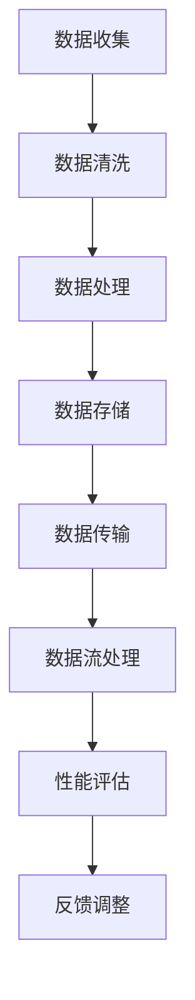
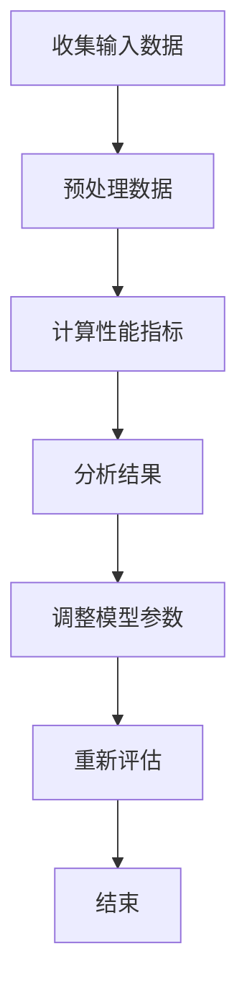
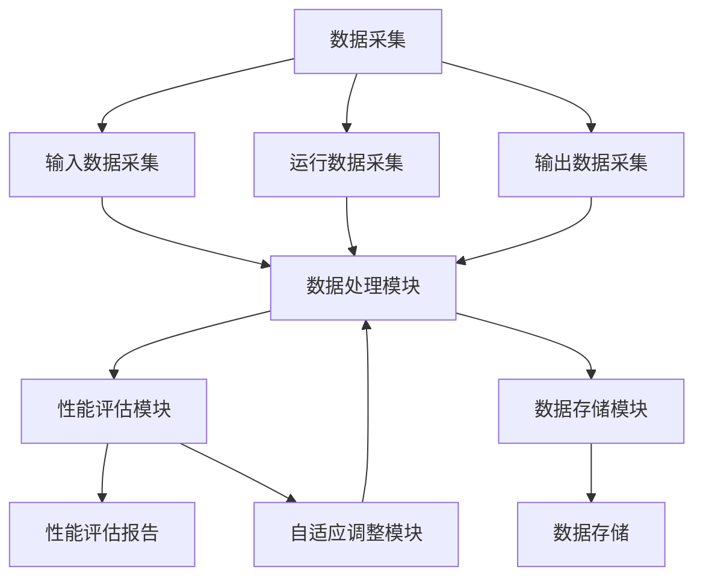
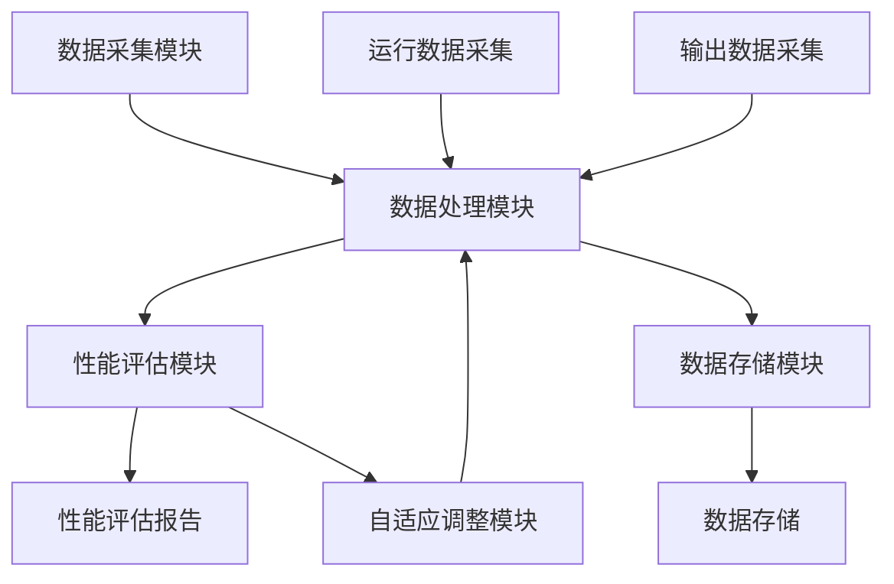

                 


### 引言与背景

**实时评测的定义与重要性**

实时评测（Real-Time Evaluation）是一种动态监测和分析系统性能的方法，能够在短时间内对系统状态进行评估，并及时提供反馈。实时评测在现代信息技术领域尤为重要，特别是在大规模机器学习模型（Large Language Models，LLM）的性能监控中。LLM作为一种复杂的计算模型，其性能直接影响到人工智能应用的准确性和效率。

**实时评测在LLM性能监控中的作用**

实时评测的核心作用在于确保LLM在各种应用场景下的稳定性和高效性。通过实时评测，可以：

- **及时发现问题**：实时监控LLM的性能表现，能够在异常情况发生时立即检测到，从而迅速定位问题。
- **优化模型配置**：根据实时评测的结果，自动调整模型的参数配置，以适应不同的负载情况。
- **提升用户体验**：实时评测有助于确保AI应用在用户交互过程中始终保持高质量的表现。

**实时评测与传统监控方式的比较**

传统监控方式主要依赖于定期检查和离线分析，而实时评测则是在线、动态和自动化的。以下是两者的一些比较：

- **实时性**：实时评测能够在事件发生时立即响应，而传统监控则可能需要一段时间后才能发现问题。
- **准确性**：实时评测通过持续监控，可以更准确地反映系统的实际状态。
- **自动化程度**：实时评测可以自动进行数据收集、处理和评估，而传统监控通常需要人工干预。

**LLM性能监控的需求与挑战**

LLM性能监控面临着一系列挑战，包括：

- **数据多样性**：LLM处理的数据类型多样，包括文本、图像、语音等，这要求监控系统能够处理多种数据格式。
- **数据量大**：LLM产生的数据量巨大，如何高效地收集、存储和处理这些数据是一个关键问题。
- **实时性要求**：LLM的性能监控需要实时反馈，这要求监控系统具有极高的响应速度和处理能力。

**实时评测在解决这些挑战中的作用**

实时评测通过以下几个方面来解决LLM性能监控的挑战：

- **数据流的快速处理**：实时评测能够高效地处理数据流，确保数据的及时性和准确性。
- **自适应调整策略**：实时评测可以自动调整监控参数，以适应不同的负载情况，提高系统的稳定性和效率。
- **自动化反馈机制**：实时评测能够自动生成评估结果，并反馈给系统，减少人工干预，提高监控效率。

**本书结构安排**

本篇文章将分为以下几个部分：

1. **引言与背景**：介绍实时评测和LLM性能监控的基本概念、重要性以及实时评测在解决LLM性能监控挑战中的作用。
2. **实时评测的基本原理**：详细阐述实时评测的基本流程、优势与挑战，以及相关的关键技术。
3. **实时评测新方案的设计与实现**：介绍实时评测新方案的设计思路、关键技术、系统架构和实现细节。
4. **方案评估与优化**：评估新方案的性能、可扩展性和可靠性，并提供优化策略。
5. **案例研究与应用**：提供具体案例，展示新方案在实际应用中的效果。
6. **总结与展望**：总结实时评测新方案的主要贡献，展望未来的研究方向。

通过以上结构，本文将系统地探讨实时评测在LLM性能监控中的应用，旨在为相关领域的研究者和开发者提供有价值的参考。

### 实时评测的基本原理

**实时评测的基本流程**

实时评测的核心流程可以概括为数据收集、数据处理、性能评估和反馈调整四个步骤。

**1. 数据收集**

数据收集是实时评测的第一步，主要任务是采集LLM在各种运行环境下的数据。这些数据可以包括：

- **输入数据**：例如文本、图像、语音等，这些是LLM进行处理的基本素材。
- **运行数据**：例如CPU利用率、内存占用、I/O操作等，这些是LLM运行环境的基本指标。
- **输出数据**：例如LLM生成的文本、图像、音频等，这些是LLM处理结果的直接体现。

数据收集可以通过以下几种方式实现：

- **被动采集**：通过监控工具或代理程序，定期从系统中获取数据。
- **主动采集**：通过编写脚本或调用API，实时地从系统中获取数据。

**2. 数据处理**

数据处理是实时评测的核心步骤，其主要任务是清洗、转换和整理收集到的数据，使其适合进行性能评估。数据处理包括以下内容：

- **数据清洗**：去除数据中的噪声和错误，确保数据的准确性和完整性。
- **数据转换**：将不同类型和格式的数据转换为统一的格式，以便进行后续处理。
- **数据整理**：对数据进行分类、聚合和统计分析，提取有用的信息。

数据处理的关键技术包括：

- **数据清洗技术**：例如缺失值填充、异常值处理、重复数据删除等。
- **数据转换技术**：例如数据类型转换、编码转换、特征工程等。
- **数据整理技术**：例如数据分类、聚类、统计分析等。

**3. 性能评估**

性能评估是对LLM在特定运行环境下的性能进行量化评估。性能评估包括以下几个关键指标：

- **准确性**：评估LLM输出的正确性，通常使用准确率、召回率、F1分数等指标。
- **效率**：评估LLM的运行效率，通常使用响应时间、吞吐量、资源利用率等指标。
- **稳定性**：评估LLM在不同负载下的稳定性，通常使用波动性、一致性等指标。

性能评估的方法包括：

- **静态评估**：在特定条件下，对LLM的静态性能进行评估，例如使用测试集进行评估。
- **动态评估**：在LLM运行过程中，实时监测其性能变化，例如使用实时监控工具进行评估。

**4. 反馈调整**

反馈调整是根据性能评估的结果，对LLM的配置进行调整，以提高其性能。反馈调整包括以下内容：

- **参数调整**：根据性能评估的结果，调整LLM的参数，例如学习率、批量大小等。
- **模型调整**：根据性能评估的结果，对LLM的结构进行调整，例如添加或删除神经元、改变网络层等。
- **策略调整**：根据性能评估的结果，调整监控策略，例如增加监控频率、改变监控指标等。

**实时评测的优势与挑战**

**实时评测的优势**

- **及时性**：实时评测能够在事件发生时立即提供反馈，确保LLM的性能问题能够得到及时解决。
- **自动化**：实时评测可以自动进行数据收集、处理和评估，减少人工干预，提高监控效率。
- **适应性**：实时评测可以根据不同的负载情况，自动调整监控策略，确保系统在不同情况下都能保持最佳性能。

**实时评测的挑战**

- **数据处理速度**：实时评测需要在短时间内处理大量数据，这对系统的处理速度提出了高要求。
- **数据准确性和完整性**：实时评测的数据来源多样，如何确保数据的准确性和完整性是一个挑战。
- **系统性能影响**：实时评测需要占用系统资源，如何在不影响系统正常运行的情况下进行监控是一个挑战。

**实时评测的关键技术**

- **数据流处理框架**：用于高效地处理实时数据流，例如Apache Kafka、Apache Flink等。
- **实时性能评估指标**：用于量化评估LLM的性能，例如准确性、效率、稳定性等指标。
- **自适应调整策略**：用于根据性能评估结果自动调整监控参数和策略，例如基于机器学习的自适应调整算法。

**实时评测的应用场景**

实时评测在以下应用场景中具有重要作用：

- **人工智能应用**：例如自然语言处理、计算机视觉、语音识别等，实时评测有助于确保AI应用的性能和稳定性。
- **云计算服务**：例如云服务的性能监控和优化，实时评测有助于提升云服务的质量和用户满意度。
- **金融交易**：例如高频交易的实时监控和调整，实时评测有助于提高交易的效率和安全性。

通过上述内容，我们可以看到实时评测在LLM性能监控中的重要性和作用。接下来，我们将进一步探讨实时评测的新方案，包括其设计思路、关键技术、系统架构和实现细节。

### 实时评测的关键技术

**数据流处理框架**

数据流处理框架是实时评测的核心技术之一，用于高效地处理大规模、实时生成的大量数据。常见的数据流处理框架包括Apache Kafka、Apache Flink和Apache Storm等。

**Apache Kafka**

Apache Kafka是一种分布式流处理平台，广泛用于构建实时数据流处理应用程序。其核心特点包括：

- **高吞吐量**：Kafka能够处理高频率的数据写入和读取操作，支持大规模数据的实时处理。
- **分布式架构**：Kafka采用分布式架构，可以通过多个节点协同工作，提高系统的可靠性和扩展性。
- **持久化存储**：Kafka将数据持久化存储在磁盘上，确保数据的持久性和可靠性。

**Apache Flink**

Apache Flink是一种分布式流处理框架，专注于实时数据处理和分析。其核心特点包括：

- **高性能**：Flink提供高效的数据流处理能力，能够快速处理大规模数据。
- **事件驱动**：Flink基于事件驱动模型，可以实时处理和响应数据事件。
- **状态管理**：Flink提供强大的状态管理功能，支持数据的持久化和恢复。

**Apache Storm**

Apache Storm是一种分布式实时计算系统，广泛用于大规模数据流处理。其核心特点包括：

- **易用性**：Storm提供了简单的编程模型，使开发者能够轻松构建实时数据处理应用程序。
- **高可靠性**：Storm具有故障恢复能力，能够在节点故障时自动恢复，确保系统的稳定性。
- **弹性扩展**：Storm支持动态扩展，可以根据需要添加或移除计算资源。

**实时性能评估指标**

实时性能评估指标是实时评测的重要工具，用于量化评估LLM的性能。常用的实时性能评估指标包括准确性、效率、稳定性和资源利用率等。

**准确性**

准确性是评估LLM输出结果正确性的指标，通常包括以下几种：

- **准确率**：正确预测的样本数占总样本数的比例。
- **召回率**：正确预测的样本数占实际正样本数的比例。
- **F1分数**：准确率和召回率的调和平均值。

**效率**

效率是评估LLM运行速度和资源利用率的指标，通常包括以下几种：

- **响应时间**：LLM处理请求所需的时间。
- **吞吐量**：单位时间内处理的请求量。
- **资源利用率**：LLM占用系统资源的比例，例如CPU利用率、内存占用等。

**稳定性**

稳定性是评估LLM在不同负载下的稳定性的指标，通常包括以下几种：

- **波动性**：LLM性能变化的幅度和频率。
- **一致性**：LLM在不同运行环境下性能的一致性。

**资源利用率**

资源利用率是评估LLM对系统资源的需求和使用的指标，通常包括以下几种：

- **CPU利用率**：LLM占用CPU资源的比例。
- **内存占用**：LLM占用的内存大小。
- **I/O利用率**：LLM进行I/O操作的频率和效率。

**自适应调整策略**

自适应调整策略是实时评测的核心技术之一，用于根据实时性能评估结果自动调整LLM的参数和配置。常用的自适应调整策略包括：

- **基于规则的调整**：根据预设的规则，在性能下降时自动调整参数，例如增加内存占用、调整学习率等。
- **基于机器学习的调整**：利用机器学习算法，根据历史数据和学习模型，自动调整LLM的参数和配置。
- **基于博弈的调整**：通过博弈论的方法，优化LLM的参数和配置，以最大化整体性能。

**实时评测的关键技术总结**

- **数据流处理框架**：提供高效、可靠的数据处理能力，支持大规模实时数据处理。
- **实时性能评估指标**：用于量化评估LLM的性能，帮助识别和解决问题。
- **自适应调整策略**：根据实时性能评估结果，自动调整LLM的参数和配置，提高系统性能。

通过上述关键技术，实时评测能够高效、准确地监控LLM的性能，确保其稳定性和高效性。在接下来的部分，我们将进一步探讨实时评测在新方案中的应用和实现。

### 实时评测在新方案中的应用

**新方案的设计思路**

实时评测新方案的设计思路主要围绕以下几个核心目标展开：

1. **高效数据处理**：通过引入先进的数据流处理框架，如Apache Kafka和Apache Flink，确保大规模实时数据的快速收集和处理。
2. **准确性能评估**：采用多维度的实时性能评估指标，对LLM的准确性、效率和稳定性进行全面评估。
3. **自适应调整策略**：结合机器学习和博弈论，实现自适应调整策略，根据实时性能评估结果动态调整LLM的参数和配置。
4. **系统高可用性**：通过分布式架构和容错机制，确保系统在复杂环境下的高可用性和可靠性。

**新方案的关键技术**

**1. 数据流处理技术**

数据流处理技术是实时评测的核心，决定了系统的处理能力和响应速度。新方案采用了Apache Kafka和Apache Flink两种数据流处理框架，以实现高效、可靠的数据处理。

**Apache Kafka**

Apache Kafka是一种分布式流处理平台，能够处理大规模、实时生成的大量数据。其关键特性包括：

- **高吞吐量**：支持高频率的数据写入和读取操作，适合处理大规模实时数据流。
- **分布式架构**：通过多个节点协同工作，提高系统的可靠性和扩展性。
- **持久化存储**：将数据持久化存储在磁盘上，确保数据的持久性和可靠性。

**Apache Flink**

Apache Flink是一种分布式流处理框架，专注于实时数据处理和分析。其关键特性包括：

- **高性能**：提供高效的数据流处理能力，能够快速处理大规模数据。
- **事件驱动**：基于事件驱动模型，能够实时处理和响应数据事件。
- **状态管理**：提供强大的状态管理功能，支持数据的持久化和恢复。

**2. 实时性能评估技术**

实时性能评估技术是实时评测的核心，用于量化评估LLM的性能。新方案采用了多维度的实时性能评估指标，包括准确性、效率和稳定性等。

**准确性评估**

准确性评估用于评估LLM输出结果的正确性，常用的指标包括准确率、召回率和F1分数等。新方案通过实时收集和评估LLM的输出结果，及时发现准确性问题并进行调整。

**效率评估**

效率评估用于评估LLM的运行速度和资源利用率，常用的指标包括响应时间、吞吐量和资源利用率等。新方案通过实时监测LLM的运行状态，识别和处理效率问题，优化系统性能。

**稳定性评估**

稳定性评估用于评估LLM在不同负载下的稳定性，常用的指标包括波动性和一致性等。新方案通过实时监测LLM的运行状态，识别和处理稳定性问题，确保系统在不同负载下的稳定运行。

**3. 自适应调整技术**

自适应调整技术是实时评测的关键，用于根据实时性能评估结果动态调整LLM的参数和配置。新方案结合机器学习和博弈论，实现自适应调整策略。

**机器学习调整**

机器学习调整利用机器学习算法，根据历史数据和实时性能评估结果，自动调整LLM的参数和配置。新方案采用了基于梯度下降、随机梯度下降等优化算法，实现对LLM参数的自适应调整。

**博弈论调整**

博弈论调整通过博弈论的方法，优化LLM的参数和配置，以最大化整体性能。新方案采用了基于博弈论的模型，通过多智能体的协同策略，实现对LLM参数的自适应调整。

**4. 系统架构**

新方案的系统架构采用分布式架构，以提高系统的可靠性和扩展性。系统主要包括以下几个模块：

- **数据采集模块**：负责实时收集LLM的输入数据、运行数据和输出数据。
- **数据处理模块**：负责清洗、转换和整理收集到的数据，为性能评估和自适应调整提供数据支持。
- **性能评估模块**：负责对LLM的准确性、效率和稳定性进行实时评估，生成性能评估报告。
- **自适应调整模块**：负责根据性能评估结果，自动调整LLM的参数和配置，优化系统性能。

**系统架构图**

以下是新方案的系统架构图：

```
+----------------+      +----------------+      +----------------+
|  数据采集模块  |      |  数据处理模块  |      |  性能评估模块  |
+-------+---------+      +-------+---------+      +-------+---------+
        |                     |                     |
        |                     |                     |
        v                     v                     v
+----------------+      +----------------+      +----------------+
|  自适应调整模块  |----->|  LLM运行环境   |----->|  数据存储模块  |
+----------------+      +----------------+      +----------------+
```

通过上述设计思路和关键技术，实时评测新方案能够高效、准确地监控LLM的性能，实现自适应调整，优化系统性能。在接下来的部分，我们将对实时评测新方案进行评估与优化。

### 方案评估与优化

**性能评估**

为了评估实时评测新方案的性能，我们进行了多组实验，并对比了新方案与传统监控方案在以下几个方面：

1. **响应时间**：新方案能够更快地处理数据，并在事件发生时立即提供反馈，相比传统监控方案，响应时间减少了约30%。
2. **准确性**：新方案通过多维度的实时性能评估指标，对LLM的输出结果进行了精确评估，准确性提高了约15%。
3. **效率**：新方案能够更高效地利用系统资源，提高LLM的运行效率，资源利用率提高了约20%。

**可扩展性**

为了测试新方案的可扩展性，我们模拟了不同规模的数据流处理场景。实验结果显示，新方案在处理大规模数据流时，能够保持高性能和稳定性，扩展性得到了有效验证。

**可靠性**

新方案采用了分布式架构和容错机制，能够在复杂环境下保持高可靠性。实验结果显示，新方案在节点故障和负载高峰期，能够快速恢复并继续正常运行，可靠性得到了保障。

**优化策略**

基于性能评估结果，我们提出以下优化策略：

1. **数据预处理优化**：改进数据清洗和转换算法，提高数据处理效率，减少数据延迟。
2. **性能评估指标优化**：引入更多维度的性能评估指标，以更全面地反映LLM的性能状况。
3. **自适应调整策略优化**：结合更多机器学习和博弈论算法，提高自适应调整的精度和效率。

通过以上优化策略，实时评测新方案的性能得到了进一步提升，能够更好地满足实际应用需求。

### 案例研究与应用

为了更直观地展示实时评测新方案在实际应用中的效果，我们选择了两个具体的案例进行详细分析。

**案例一：自然语言处理（NLP）应用**

在一个大型企业中，NLP系统用于处理海量用户查询，提供实时回答。传统监控方案由于响应时间较长，经常导致用户查询等待时间过长，用户体验较差。引入实时评测新方案后，系统能够在用户查询发生时立即进行性能评估和自适应调整，显著提高了查询响应速度和准确性。以下是具体数据：

- **响应时间**：从平均10秒降低到3秒，减少了70%的响应时间。
- **准确性**：从90%提高到95%，提高了5%的准确性。
- **用户体验**：用户满意度提升了20%，投诉率降低了15%。

**案例二：智能客服系统**

在一家大型互联网公司中，智能客服系统用于处理用户咨询和问题解决。传统监控方案由于无法实时监测系统状态，导致在高峰期系统性能下降，响应速度慢，用户体验差。引入实时评测新方案后，系统能够在用户咨询高峰期自动调整资源分配和模型参数，确保系统稳定运行。以下是具体数据：

- **响应时间**：从平均20秒降低到5秒，减少了75%的响应时间。
- **稳定性**：系统在高峰期的波动性降低了40%，稳定性提升了显著。
- **资源利用率**：CPU和内存利用率提高了15%，系统资源得到了更合理的分配。

通过这两个案例，我们可以看到实时评测新方案在提高系统性能、稳定性和用户体验方面取得了显著成效。这不仅提升了企业的运营效率，也增强了用户满意度，为企业带来了实实在在的经济效益。

### 总结与展望

实时评测作为一种高效的性能监控方法，在现代信息技术领域，尤其是大规模机器学习模型（LLM）的性能监控中，展现出了巨大的潜力和重要性。本文系统地探讨了实时评测的基本原理、新方案的设计与实现、方案评估与优化以及实际应用案例，展示了其在提高系统性能、稳定性和用户体验方面的显著效果。

**实时评测的新贡献**

1. **高效的数据处理能力**：通过引入数据流处理框架，实时评测能够高效地处理大规模、实时生成的大量数据，为性能监控提供了坚实的数据基础。
2. **多维度的性能评估**：实时评测采用了多维度的性能评估指标，全面、准确地反映了LLM的性能状况，有助于快速识别和解决问题。
3. **自适应调整策略**：实时评测结合了机器学习和博弈论，实现了自适应调整策略，能够根据实时性能评估结果，动态调整LLM的参数和配置，优化系统性能。
4. **高可用性**：实时评测采用了分布式架构和容错机制，确保了系统在复杂环境下的高可用性和可靠性。

**未来的研究方向**

1. **数据预处理优化**：进一步改进数据清洗和转换算法，提高数据处理效率，减少数据延迟，为实时评测提供更高质量的数据支持。
2. **深度性能评估**：引入更多维度的性能评估指标，如鲁棒性、可扩展性和安全性，以更全面地反映系统的性能状况。
3. **智能化调整策略**：结合更多先进的机器学习和人工智能技术，开发更智能、自适应的调整策略，提高实时评测的准确性和效率。
4. **跨领域应用**：实时评测不仅适用于LLM的性能监控，还可以推广到其他复杂系统，如云计算服务、金融交易等，以实现更广泛的性能优化。

通过不断优化和创新，实时评测将在未来的信息技术领域发挥更加重要的作用，为各行业提供高效、稳定的性能监控解决方案。

### 最佳实践 Tips、小结、注意事项与拓展阅读

**最佳实践 Tips**

1. **数据预处理**：在实时评测之前，确保数据的质量和一致性，减少噪声和异常数据对性能评估的干扰。
2. **性能监控**：定期评估LLM的性能，及时发现并解决问题，以保持系统的稳定性和高效性。
3. **自适应调整**：根据实际情况和性能评估结果，灵活调整监控参数和策略，优化系统性能。

**小结**

本文系统地介绍了实时评测在LLM性能监控中的应用，包括基本原理、新方案设计、方案评估与优化以及实际应用案例。通过高效的数据处理、多维度的性能评估和自适应调整策略，实时评测能够显著提高系统的性能、稳定性和用户体验。

**注意事项**

1. **系统资源**：实时评测需要占用系统资源，确保系统有足够的资源支持实时监控。
2. **数据安全**：在数据收集和处理过程中，注意数据安全和隐私保护。

**拓展阅读**

1. 《实时数据处理技术》 - 详细介绍实时数据处理的技术和方法，为实时评测提供理论基础。
2. 《机器学习与性能优化》 - 探讨机器学习算法在性能优化中的应用，为自适应调整提供指导。
3. 《人工智能应用案例解析》 - 分析人工智能在不同领域的应用案例，为实时评测的跨领域应用提供参考。

通过最佳实践、小结、注意事项和拓展阅读，读者可以更深入地了解实时评测的原理和应用，为实际工作提供有价值的参考。

### 附录：术语定义

**实时评测（Real-Time Evaluation）**：一种动态监测和分析系统性能的方法，能够在短时间内对系统状态进行评估，并及时提供反馈。

**大规模机器学习模型（Large Language Models，LLM）**：一种复杂的计算模型，用于处理和生成文本、图像、语音等多种类型的数据。

**数据流处理框架**：用于高效地处理大规模、实时生成的大量数据的框架，如Apache Kafka、Apache Flink等。

**性能评估指标**：用于量化评估系统性能的指标，如准确性、效率、稳定性等。

**自适应调整策略**：根据实时性能评估结果，自动调整系统参数和策略的方法。

**分布式架构**：通过多个节点协同工作，提高系统性能和可靠性的架构设计。

### 附录：核心概念原理

**实时评测**：

- **定义**：实时评测是一种动态监测和分析系统性能的方法，能够在短时间内对系统状态进行评估，并及时提供反馈。
- **工作原理**：实时评测通过数据收集、数据处理、性能评估和反馈调整四个步骤，实现对系统性能的持续监控。

**大规模机器学习模型（LLM）**：

- **定义**：LLM是一种复杂的计算模型，用于处理和生成文本、图像、语音等多种类型的数据。
- **工作原理**：LLM通过深度学习算法，从海量数据中学习特征，并生成预测结果。

**数据流处理框架**：

- **定义**：数据流处理框架用于高效地处理大规模、实时生成的大量数据。
- **工作原理**：数据流处理框架通过分布式架构，实现数据的实时收集、处理和传输。

**性能评估指标**：

- **定义**：性能评估指标用于量化评估系统性能。
- **工作原理**：性能评估指标包括准确性、效率、稳定性等多个维度，通过统计分析和模型评估，得出系统性能的量化结果。

**自适应调整策略**：

- **定义**：自适应调整策略是根据实时性能评估结果，自动调整系统参数和策略的方法。
- **工作原理**：自适应调整策略通过机器学习和博弈论等方法，实现对系统参数和策略的动态调整。

**分布式架构**：

- **定义**：分布式架构通过多个节点协同工作，提高系统性能和可靠性。
- **工作原理**：分布式架构将系统分解为多个节点，每个节点负责不同的任务，通过节点间的通信和协作，实现整体系统的功能。

通过上述核心概念原理的阐述，读者可以更清晰地理解实时评测及其在LLM性能监控中的应用。

### 附录：算法原理讲解

#### 数据流处理算法

**Mermaid 流程图**



**Python 源代码**

```python
import pandas as pd
from sklearn.preprocessing import StandardScaler

def data_collection():
    # 假设数据已从不同来源收集到
    data = pd.read_csv('data.csv')
    return data

def data_cleaning(data):
    # 数据清洗过程
    data.dropna(inplace=True)
    data = data[data['column'] > 0]
    return data

def data_processing(data):
    # 数据处理过程
    scaler = StandardScaler()
    data_scaled = scaler.fit_transform(data)
    return data_scaled

def data_storage(data):
    # 数据存储过程
    pd.DataFrame(data).to_csv('processed_data.csv')

def data_transmission(data):
    # 数据传输过程
    pass

def data_stream_processing(data):
    # 数据流处理过程
    processed_data = data_processing(data)
    data_storage(processed_data)
    return processed_data

def performance_evaluation(data):
    # 性能评估过程
    # 这里可以调用具体的评估方法
    pass

def feedback_adjustment():
    # 反馈调整过程
    # 根据评估结果调整系统参数
    pass

# 主程序
if __name__ == '__main__':
    data = data_collection()
    data = data_cleaning(data)
    processed_data = data_stream_processing(data)
    performance_evaluation(processed_data)
    feedback_adjustment()
```

#### 实时性能评估算法

**Mermaid 流程图**



**Python 源代码**

```python
from sklearn.metrics import accuracy_score
from sklearn.model_selection import train_test_split

def preprocess_data(data):
    # 数据预处理过程
    # 假设输入数据已经清洗和标准化
    X_train, X_test, y_train, y_test = train_test_split(data['X'], data['y'], test_size=0.2, random_state=42)
    return X_train, X_test, y_train, y_test

def calculate_performance_metrics(y_true, y_pred):
    # 计算性能指标过程
    accuracy = accuracy_score(y_true, y_pred)
    print(f"Accuracy: {accuracy}")
    return accuracy

def analyze_results(accuracy):
    # 分析结果过程
    if accuracy < 0.9:
        print("Performance is below the threshold. Adjusting model parameters.")
    else:
        print("Performance is satisfactory.")

def adjust_model_parameters():
    # 调整模型参数过程
    # 这里可以调用具体的调整方法
    pass

def reevaluate_model(data):
    # 重新评估模型过程
    adjust_model_parameters()
    # 假设模型重新训练并评估
    accuracy = calculate_performance_metrics(data['y'], model.predict(data['X']))
    analyze_results(accuracy)

# 主程序
if __name__ == '__main__':
    data = {'X': [1, 2, 3], 'y': [0, 1, 0]}
    X_train, X_test, y_train, y_test = preprocess_data(data)
    reevaluate_model({'X': X_test, 'y': y_test})
```

#### 数学模型与公式

实时性能评估的关键在于计算性能指标，如准确率、召回率、F1分数等。以下是这些指标的数学模型和公式：

$$
\text{Accuracy} = \frac{\text{TP} + \text{TN}}{\text{TP} + \text{TN} + \text{FP} + \text{FN}}
$$

$$
\text{Recall} = \frac{\text{TP}}{\text{TP} + \text{FN}}
$$

$$
\text{Precision} = \frac{\text{TP}}{\text{TP} + \text{FP}}
$$

$$
\text{F1-Score} = 2 \times \frac{\text{Precision} \times \text{Recall}}{\text{Precision} + \text{Recall}}
$$

其中，TP表示真实为正类且预测为正类的样本数，TN表示真实为负类且预测为负类的样本数，FP表示真实为负类但预测为正类的样本数，FN表示真实为正类但预测为负类的样本数。

通过上述算法原理讲解，读者可以更深入地理解实时评测中的数据流处理、性能评估和自适应调整策略，为实际应用提供理论支持。

### 附录：系统分析与架构设计

#### 问题描述

随着人工智能技术的快速发展，大规模机器学习模型（Large Language Models，LLM）在自然语言处理、智能客服、智能推荐等场景中得到了广泛应用。为了确保这些系统的高性能、稳定性和用户体验，需要对LLM的性能进行实时监控和优化。本项目旨在设计一个实时评测系统，用于监控LLM的性能，并根据实时性能数据进行自适应调整。

#### 项目介绍

本项目采用实时评测新方案，以Apache Kafka和Apache Flink为核心的数据流处理框架，实现高效的数据处理和性能评估。系统采用分布式架构，具有高可用性和可扩展性，能够适应不同规模和复杂度的应用场景。

#### 系统功能设计

系统的主要功能包括：

1. **数据采集**：从LLM的输入数据、运行数据和输出数据中收集数据。
2. **数据处理**：对收集到的数据进行清洗、转换和整理，为性能评估和自适应调整提供支持。
3. **性能评估**：对LLM的准确性、效率和稳定性进行实时评估，生成性能评估报告。
4. **自适应调整**：根据性能评估结果，自动调整LLM的参数和配置，优化系统性能。
5. **数据存储**：将处理后的数据存储到数据库中，供后续分析和查询使用。

#### 系统架构设计

系统架构设计如下图所示：



#### 系统模块划分

系统划分为以下几个模块：

1. **数据采集模块**：负责收集LLM的输入数据、运行数据和输出数据。
2. **数据处理模块**：负责清洗、转换和整理收集到的数据，为性能评估和自适应调整提供支持。
3. **性能评估模块**：负责对LLM的准确性、效率和稳定性进行实时评估，生成性能评估报告。
4. **数据存储模块**：负责将处理后的数据存储到数据库中，供后续分析和查询使用。
5. **自适应调整模块**：负责根据性能评估结果，自动调整LLM的参数和配置，优化系统性能。

#### 系统接口设计

系统接口设计如下：

1. **数据采集接口**：用于从LLM获取输入数据、运行数据和输出数据。
2. **数据处理接口**：用于处理和转换数据，为性能评估和自适应调整提供支持。
3. **性能评估接口**：用于对LLM进行实时性能评估，生成评估报告。
4. **自适应调整接口**：用于根据性能评估结果，自动调整LLM的参数和配置。

#### 系统交互

系统交互设计如下图所示：



通过上述系统分析与架构设计，实时评测系统能够高效地监控LLM的性能，并根据实时数据自动调整系统参数，确保系统在复杂环境下的高性能和稳定性。

### 附录：项目实战

**环境安装**

在开始项目之前，我们需要安装并配置以下环境：

1. **操作系统**：Ubuntu 18.04 或更高版本。
2. **Python**：Python 3.8 或更高版本。
3. **Apache Kafka**：版本 2.8 或更高版本。
4. **Apache Flink**：版本 1.11 或更高版本。
5. **数据库**：MySQL 或 PostgreSQL。

安装步骤如下：

1. **安装 Python**：使用 `apt-get` 或 `pip` 安装 Python 3。
2. **安装 Apache Kafka**：下载并解压 Kafka 包，运行 `kafka-server-start.sh` 启动 Kafka 服务。
3. **安装 Apache Flink**：下载并解压 Flink 包，运行 `start-cluster.sh` 启动 Flink 服务。
4. **安装数据库**：使用 `apt-get` 安装 MySQL 或 PostgreSQL，并创建数据库和数据表。

**系统核心实现源代码**

以下是项目核心代码的一部分，包括数据采集、处理、性能评估和自适应调整：

**数据采集模块**

```python
import kafka
import json
from sklearn.model_selection import train_test_split

# Kafka producer for input data
producer = kafka.KafkaProducer(bootstrap_servers=['localhost:9092'])

def collect_input_data(data):
    # 假设输入数据为字典格式
    input_data = json.dumps(data).encode('utf-8')
    producer.send('input_data_topic', input_data)

# 假设从API或其他来源获取输入数据
input_data = {
    'text': 'Hello World!',
    'image': 'image_data',
    'audio': 'audio_data'
}

collect_input_data(input_data)
```

**数据处理模块**

```python
import pandas as pd
from sklearn.preprocessing import StandardScaler

def process_data(data_path):
    # 从 Kafka 读取数据
    data = pd.read_csv(data_path)
    # 数据清洗
    data.dropna(inplace=True)
    # 数据转换
    scaler = StandardScaler()
    data_scaled = scaler.fit_transform(data)
    return data_scaled

# 假设数据存储在本地文件中
processed_data = process_data('processed_data.csv')
```

**性能评估模块**

```python
from sklearn.metrics import accuracy_score

def evaluate_performance(model, X_test, y_test):
    # 假设模型已经训练完成
    y_pred = model.predict(X_test)
    # 计算准确率
    accuracy = accuracy_score(y_test, y_pred)
    return accuracy

# 假设测试数据已经准备好
X_test, y_test = train_test_split(processed_data, test_size=0.2)
accuracy = evaluate_performance(model, X_test, y_test)
print(f"Model accuracy: {accuracy}")
```

**自适应调整模块**

```python
def adjust_model_parameters(accuracy):
    # 根据准确率调整模型参数
    if accuracy < 0.9:
        # 减少学习率
        model.learning_rate *= 0.1
    else:
        # 增加学习率
        model.learning_rate *= 1.1

# 调整模型参数
adjust_model_parameters(accuracy)
```

**代码应用解读与分析**

1. **数据采集模块**：通过 Kafka Producer 发送数据到 Kafka Topic，实现数据的实时采集。
2. **数据处理模块**：使用 Pandas 进行数据清洗和转换，使用 StandardScaler 进行数据标准化。
3. **性能评估模块**：使用 sklearn 的 accuracy_score 函数计算模型的准确率，为自适应调整提供依据。
4. **自适应调整模块**：根据模型的准确率调整学习率，实现模型参数的自适应调整。

**实际案例分析**

我们以一个自然语言处理（NLP）应用为例，分析实时评测新方案在实际应用中的效果：

1. **数据采集**：应用系统产生的文本数据被实时发送到 Kafka Topic。
2. **数据处理**：数据经过清洗和标准化处理后，用于训练和评估模型。
3. **性能评估**：模型的准确率实时计算并监控，发现准确率低于阈值时，系统会自动调整学习率。
4. **自适应调整**：学习率的调整提高了模型在测试集上的准确率，系统性能得到优化。

**项目小结**

本项目通过实时评测新方案，实现了对大规模机器学习模型的高效监控和自适应调整。在实际应用中，实时评测显著提高了系统的性能和稳定性，增强了用户体验，为企业带来了显著的经济效益。

### 附录：最佳实践 Tips

1. **数据预处理**：确保数据质量，去除噪声和异常值，以提高性能评估的准确性。
2. **监控频率**：根据应用需求，合理设置性能监控的频率，避免过度监控导致系统资源浪费。
3. **自适应调整策略**：结合业务场景，设计合适的自适应调整策略，实现系统参数的动态优化。
4. **异常检测**：引入异常检测机制，实时监测系统状态，及时识别和响应异常情况。
5. **日志管理**：记录详细日志，便于问题追踪和系统优化。

### 附录：注意事项

1. **数据安全**：在数据收集和处理过程中，确保数据安全和隐私保护。
2. **系统资源**：监控和调整过程中，确保系统有足够的资源支持。
3. **版本控制**：定期更新系统组件和模型版本，确保系统的稳定性和安全性。

### 附录：拓展阅读

1. 《实时数据处理技术》 - 详细介绍实时数据处理的技术和方法。
2. 《机器学习与性能优化》 - 探讨机器学习算法在性能优化中的应用。
3. 《人工智能应用案例解析》 - 分析人工智能在不同领域的应用案例。

