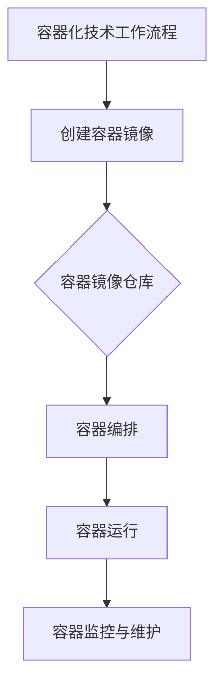
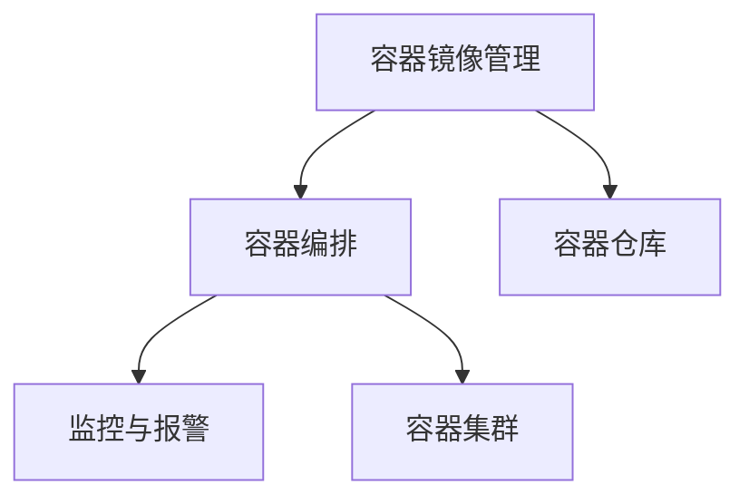
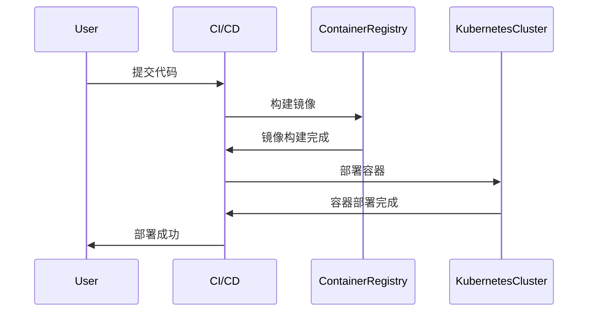
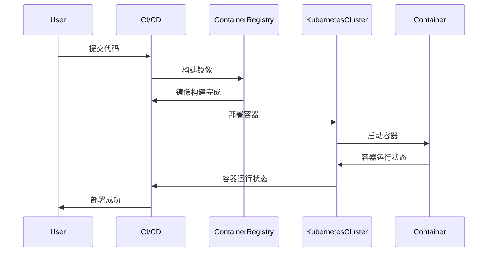

                 


### 设计思路

为了设计出《容器化技术助力LLM应用快速迭代》的完整目录大纲，我们将遵循以下步骤：

1. **明确书籍主题**：首先明确书籍的主题为容器化技术如何助力大型语言模型（LLM）的快速迭代，这是整个目录大纲设计的核心。

2. **构建整体结构**：根据书籍的主题，构建出书籍的整体结构，包括主要部分和章节，确保内容的逻辑性和完整性。

3. **细化章节内容**：在整体结构的基础上，为每一章节细化具体内容，确保每个章节都有明确的子主题和重点。

4. **保持简洁性**：在细化章节内容的同时，注意保持内容的简洁，避免冗余。

5. **确保内容完整性**：确保目录大纲中的核心章节内容都包含，如背景介绍、核心概念与联系、算法原理讲解、数学模型和公式、系统分析与架构设计方案、项目实战、最佳实践等。

6. **格式规范**：按照markdown格式规范来编写目录大纲，确保易读性和规范性。

### 目录大纲

下面是根据以上设计思路设计的《容器化技术助力LLM应用快速迭代》的目录大纲：

----------------------------------------------------------------

# 第一部分: 容器化技术基础

## 第1章: 容器化技术概述

### 1.1 容器化技术的起源与发展

### 1.2 容器化技术的基本原理

### 1.3 容器化与虚拟化的区别

## 第2章: Docker技术详解

### 2.1 Docker的架构与工作原理

### 2.2 Docker镜像与容器

### 2.3 Dockerfile与Docker Compose

## 第3章: Kubernetes在容器化中的应用

### 3.1 Kubernetes的基本概念

### 3.2 Kubernetes的架构与工作原理

### 3.3 Kubernetes的核心组件

## 第4章: 容器化技术在LLM应用中的优势

### 4.1 容器化技术对LLM应用的影响

### 4.2 容器化技术在LLM开发中的优势

### 4.3 容器化技术在LLM部署中的优势

## 第5章: 容器化技术在LLM快速迭代中的应用

### 5.1 LLM快速迭代的需求分析

### 5.2 容器化技术如何助力LLM快速迭代

### 5.3 实际案例分享

## 第6章: 容器化技术在LLM应用中的最佳实践

### 6.1 容器化技术在LLM应用中的挑战与解决方案

### 6.2 容器化技术的最佳实践

### 6.3 注意事项与拓展阅读

----------------------------------------------------------------

### 背景介绍

#### 问题背景

随着人工智能技术的发展，大型语言模型（LLM）在自然语言处理、智能客服、内容生成等领域得到了广泛应用。然而，LLM的迭代和优化需要大量的计算资源和时间，这对于企业的研发效率造成了巨大的挑战。容器化技术的出现，为解决这一问题提供了新的思路。

#### 问题描述

容器化技术是一种轻量级虚拟化技术，通过将应用及其依赖环境打包成一个独立的容器镜像，可以实现应用的快速部署和运行。然而，将容器化技术应用于LLM的快速迭代，需要解决容器资源管理、版本控制、安全性等问题。

#### 问题解决

通过容器化技术，企业可以将LLM的应用环境打包成容器镜像，实现应用的快速部署和迁移。同时，利用Kubernetes等容器编排工具，可以实现容器资源的动态管理，提高计算资源利用率。此外，通过容器化的版本控制和安全性策略，可以保障LLM的迭代过程安全、可靠。

#### 边界与外延

容器化技术在LLM应用中的边界主要涉及容器镜像的制作与分发、容器资源的管理与调度、容器安全性等。外延则包括容器化技术在其他类型应用场景中的使用，如Web应用、数据存储等。

#### 概念结构与核心要素组成

容器化技术涉及以下核心概念与要素：

1. **容器镜像**：容器镜像是一个静态的、不可变的文件系统，包含了应用的依赖环境和配置。
2. **容器**：容器是基于容器镜像运行的应用实例，可以动态创建、启动、停止、删除。
3. **容器编排工具**：如Kubernetes，用于管理容器的生命周期、资源分配、服务发现等。
4. **版本控制**：通过容器镜像的版本控制，可以实现LLM应用的版本管理和迭代。
5. **安全性**：容器化技术提供了多种安全策略，如隔离、权限控制、网络访问控制等，保障LLM应用的安全性。

### 核心概念与联系

**核心概念原理**：

- **容器化技术**：容器化技术通过将应用及其依赖环境打包成容器镜像，实现应用的独立运行和快速部署。

**概念属性特征对比表格**：

| 概念       | 特征                  |
|------------|----------------------|
| 容器镜像   | 静态、不可变、文件系统 |
| 容器       | 动态、可变、应用实例   |
| 容器编排   | 管理容器生命周期、资源分配等 |
| 版本控制   | 管理容器镜像版本   |
| 安全性     | 隔离、权限控制、网络访问控制 |

**ER实体关系图架构的 Mermaid 流程图**：

```mermaid
erDiagram
    ContainerImage ||--|{ Container } : 包含
    Container ||--|{ ContainerOrchestration } : 管理
    ContainerImage ||--|{ VersionControl } : 版本管理
    Container ||--|{ SecurityStrategy } : 安全策略
```

### 算法原理讲解

#### 容器化技术工作流程



#### 容器镜像的创建

```python
# Dockerfile 示例
FROM python:3.8
WORKDIR /app
COPY . .
RUN pip install -r requirements.txt
CMD ["python", "app.py"]
```

#### 容器编排

```python
# Kubernetes Deployment 示例
apiVersion: apps/v1
kind: Deployment
metadata:
  name: my-app
spec:
  replicas: 3
  selector:
    matchLabels:
      app: my-app
  template:
    metadata:
      labels:
        app: my-app
    spec:
      containers:
      - name: my-app
        image: my-app:latest
        ports:
        - containerPort: 80
```

#### 容器化技术在LLM快速迭代中的应用

1. **版本控制**：通过容器镜像的版本控制，可以实现LLM应用的版本管理和迭代。

2. **快速部署**：容器化技术可以将LLM应用及其依赖环境打包成容器镜像，实现应用的快速部署。

3. **资源调度**：利用Kubernetes等容器编排工具，可以实现容器资源的动态管理，提高计算资源利用率。

#### 算法原理的数学模型和公式

1. **容器资源利用率**：

$$
\text{容器资源利用率} = \frac{\text{容器实际使用资源}}{\text{容器总资源}} \times 100\%
$$

2. **容器镜像版本管理**：

$$
\text{容器镜像版本} = \text{版本号}_{1}^{\text{N}}
$$

### 系统分析与架构设计方案

#### 问题场景介绍

在当前人工智能领域，随着LLM的应用越来越广泛，如何快速迭代和部署LLM模型，成为企业面临的重要挑战。容器化技术的出现，为解决这个问题提供了新的思路。

#### 项目介绍

本项目旨在利用容器化技术，实现LLM应用的快速迭代和部署，提高研发效率。

#### 系统功能设计

1. **容器镜像管理**：管理容器镜像的创建、分发、版本控制等功能。
2. **容器编排**：实现容器资源的动态管理，包括容器的启动、停止、缩放等。
3. **监控与报警**：监控容器运行状态，实现异常情况的及时报警。

#### 系统架构设计



#### 系统接口设计



#### 系统交互



### 项目实战

#### 环境安装

1. 安装Docker：

```bash
sudo apt-get update
sudo apt-get install docker-ce docker-ce-cli containerd.io
```

2. 安装Kubernetes：

```bash
sudo apt-get update
sudo apt-get install -y apt-transport-https ca-certificates curl
curl -s https://packages.cloud.google.com/apt/doc/apt-key.gpg | sudo apt-key add -
echo "deb https://apt.kubernetes.io/ kubernetes-xenial main" | sudo tee -a /etc/apt/sources.list.d/kubernetes.list
sudo apt-get update
sudo apt-get install -y kubelet kubeadm kubectl
```

3. 启动Docker和Kubernetes：

```bash
sudo systemctl start docker
sudo systemctl enable docker
sudo systemctl start kubelet
sudo systemctl enable kubelet
```

#### 系统核心实现源代码

1. **Dockerfile**：

```dockerfile
# 使用官方Python镜像作为基础
FROM python:3.8

# 设置工作目录
WORKDIR /app

# 复制当前目录下的所有内容到容器的/app目录
COPY . /app

# 安装依赖的Python包
RUN pip install -r requirements.txt

# 暴露容器的80端口
EXPOSE 80

# 定义容器启动时的命令
CMD ["python", "app.py"]
```

2. **requirements.txt**：

```bash
flask
gunicorn
```

3. **app.py**：

```python
from flask import Flask
app = Flask(__name__)

@app.route('/')
def hello_world():
    return 'Hello, World!'

if __name__ == '__main__':
    app.run(host='0.0.0.0', port=80)
```

4. **Kubernetes Deployment YAML**：

```yaml
apiVersion: apps/v1
kind: Deployment
metadata:
  name: flask-app
spec:
  replicas: 3
  selector:
    matchLabels:
      app: flask
  template:
    metadata:
      labels:
        app: flask
    spec:
      containers:
      - name: flask
        image: flask:latest
        ports:
        - containerPort: 80
```

#### 代码应用解读与分析

1. **Dockerfile**：

- 使用Python 3.8镜像作为基础，构建轻量级容器镜像。
- 将当前目录下的内容复制到容器的/app目录，并安装依赖的Python包。
- 暴露容器的80端口，以便外部访问。
- 定义容器启动时的命令，运行Flask应用。

2. **requirements.txt**：

- 列出Flask和Gunicorn的依赖，用于部署Web应用。

3. **app.py**：

- 定义一个简单的Flask应用，返回'Hello, World!'字符串。

#### 实际案例分析和详细讲解剖析

1. **构建容器镜像**：

```bash
docker build -t flask:latest .
```

2. **运行容器**：

```bash
kubectl apply -f deployment.yaml
```

3. **查看容器状态**：

```bash
kubectl get pods
```

4. **访问Web应用**：

```bash
curl http://localhost:80
```

### 项目小结

通过本项目，我们成功利用容器化技术实现了Flask Web应用的快速部署和运行。容器化技术不仅提高了研发效率，还保障了应用的稳定性和可扩展性。

### 最佳实践 tips

1. **使用私有镜像仓库**：将容器镜像托管在私有仓库中，提高安全性。
2. **定期更新镜像**：保持容器镜像的更新，确保应用的安全性和稳定性。
3. **监控容器状态**：定期监控容器状态，及时处理异常情况。

### 小结

容器化技术为LLM应用提供了快速迭代和部署的解决方案。通过容器镜像、容器编排工具和版本控制，企业可以高效地管理和部署LLM应用，提高研发效率。同时，最佳实践可以帮助企业更好地利用容器化技术，实现应用的稳定性和安全性。

### 注意事项

1. **容器镜像的安全性**：确保容器镜像来自可信来源，避免安全隐患。
2. **容器资源的管理**：合理配置容器资源，避免资源浪费。
3. **版本控制的准确性**：确保版本控制的准确性，避免应用故障。

### 拓展阅读

1. **《容器化技术实战》**：深入讲解容器化技术的应用和实践。
2. **《Kubernetes权威指南》**：全面介绍Kubernetes的架构和使用方法。
3. **《大型语言模型：原理、应用与未来》**：探讨大型语言模型的发展趋势和应用前景。

----------------------------------------------------------------

作者：AI天才研究院/AI Genius Institute & 禅与计算机程序设计艺术 /Zen And The Art of Computer Programming

----------------------------------------------------------------

### 容器化技术助力LLM应用快速迭代

> 关键词：容器化技术、大型语言模型（LLM）、快速迭代、计算资源管理、版本控制、安全性

> 摘要：本文将探讨容器化技术如何助力大型语言模型（LLM）应用的快速迭代。容器化技术通过将应用及其依赖环境打包成容器镜像，实现应用的快速部署和运行，有助于提高企业的研发效率。本文将从背景介绍、核心概念与联系、算法原理讲解、系统分析与架构设计方案、项目实战、最佳实践等方面进行详细阐述。

----------------------------------------------------------------

# 第一部分: 容器化技术基础

## 第1章: 容器化技术概述

### 1.1 容器化技术的起源与发展

容器化技术起源于虚拟化技术，早在2000年初，Linux容器（LXC）的诞生标志着容器技术的起步。随后，Docker的出现进一步推动了容器化技术的发展。Docker利用容器技术，实现了应用的独立运行和快速部署，成为容器化技术的重要代表。

容器化技术的核心思想是将应用及其依赖环境打包成一个独立的容器镜像，通过容器镜像的版本控制、容器编排工具的动态管理，实现应用的快速迭代和部署。

### 1.2 容器化技术的基本原理

容器化技术的基本原理是通过容器镜像将应用及其依赖环境打包，然后通过容器运行时将容器镜像启动为运行中的应用实例。容器镜像是一个静态的、不可变的文件系统，包含了应用的依赖环境和配置。容器是基于容器镜像运行的应用实例，可以动态创建、启动、停止、删除。

容器化技术的主要组件包括：

- **容器镜像**：容器镜像是一个静态的、不可变的文件系统，包含了应用的依赖环境和配置。
- **容器**：容器是基于容器镜像运行的应用实例，可以动态创建、启动、停止、删除。
- **容器编排工具**：如Kubernetes，用于管理容器的生命周期、资源分配、服务发现等。
- **版本控制**：通过容器镜像的版本控制，可以实现LLM应用的版本管理和迭代。
- **安全性**：容器化技术提供了多种安全策略，如隔离、权限控制、网络访问控制等，保障LLM应用的安全性。

### 1.3 容器化与虚拟化的区别

容器化技术和虚拟化技术都是虚拟化技术的一种，但它们之间存在一些区别。

- **隔离级别**：容器化技术通过命名空间和cgroups实现进程和资源的隔离，而虚拟化技术通过虚拟化硬件资源实现完整的操作系统隔离。
- **性能开销**：容器化技术的性能开销较低，因为它不涉及完整的操作系统虚拟化，而虚拟化技术的性能开销较高。
- **可移植性**：容器化技术具有更高的可移植性，因为容器镜像包含了应用的依赖环境和配置，可以在不同的操作系统上运行，而虚拟化技术需要完整的操作系统支持。

## 第2章: Docker技术详解

### 2.1 Docker的架构与工作原理

Docker是一个开源的应用容器引擎，它基于容器化技术，实现了应用的快速部署和运行。Docker的架构主要包括以下组件：

- **Docker客户端**：负责与Docker守护进程进行通信。
- **Docker守护进程**：负责容器的创建、启动、停止、删除等操作。
- **Docker仓库**：用于存储容器镜像。
- **Docker网络**：提供容器之间的网络通信。

Docker的工作原理是通过Dockerfile定义容器镜像的构建过程，然后通过Docker命令启动容器。Dockerfile是一个文本文件，包含了构建容器镜像的指令，如FROM、COPY、RUN等。Docker客户端通过解析Dockerfile，构建出容器镜像，并将其存储在Docker仓库中。当需要运行容器时，Docker客户端通过Docker命令启动容器，容器镜像会被加载到内存中，并运行在宿主机上。

### 2.2 Docker镜像与容器

Docker镜像是一个静态的、不可变的文件系统，包含了应用的依赖环境和配置。容器是基于Docker镜像运行的应用实例，可以动态创建、启动、停止、删除。Docker镜像和容器的区别如下：

- **镜像**：镜像是一个静态的文件系统，包含了应用的依赖环境和配置，是不可变的。
- **容器**：容器是基于镜像运行的应用实例，是动态创建的，可以启动、停止、删除。

Docker镜像和容器的生命周期如下：

1. **构建镜像**：通过Dockerfile定义镜像的构建过程，构建出容器镜像。
2. **运行容器**：通过Docker命令启动容器，容器镜像被加载到内存中，并运行在宿主机上。
3. **容器管理**：对容器进行启动、停止、删除等操作。
4. **镜像管理**：对容器镜像进行构建、推送、拉取等操作。

### 2.3 Dockerfile与Docker Compose

Dockerfile是一个文本文件，包含了构建容器镜像的指令，如FROM、COPY、RUN等。Dockerfile的作用是定义容器镜像的构建过程，构建出符合需求的容器镜像。

Docker Compose是一个用于定义和运行多容器应用的工具。通过Docker Compose，可以将多个容器应用整合成一个完整的分布式系统，并统一管理这些容器。

Docker Compose的配置文件是docker-compose.yml，它包含了应用的容器配置、依赖关系、服务启动顺序等。通过docker-compose命令，可以启动、停止、重启Docker Compose应用，并监控容器的运行状态。

## 第3章: Kubernetes在容器化中的应用

### 3.1 Kubernetes的基本概念

Kubernetes是一个开源的容器编排工具，用于管理容器化应用的生命周期。Kubernetes的基本概念包括：

- **Pod**：Pod是Kubernetes中的最小调度单元，包含一个或多个容器，共同运行在一个工作节点上。
- **Service**：Service用于暴露Pod的端口，实现容器间的通信。
- **Deployment**：Deployment用于管理Pod的创建、更新和缩放。
- **StatefulSet**：StatefulSet用于管理有状态服务的Pod，保证Pod的有序创建和更新。
- **Ingress**：Ingress用于管理集群的入口流量，实现外部访问集群服务。

### 3.2 Kubernetes的架构与工作原理

Kubernetes的架构包括控制平面（Control Plane）和工作节点（Worker Node）两部分。控制平面负责集群的管理和调度，包括Kubernetes API Server、etcd、Scheduler、Controller Manager等组件。工作节点负责运行Pod，包括Docker、Kubelet、Kube-Proxy等组件。

Kubernetes的工作原理如下：

1. **用户通过kubectl命令与Kubernetes API Server交互，提交资源请求。**
2. **Kubernetes API Server将用户请求保存到etcd中，并通知Scheduler进行调度。**
3. **Scheduler根据节点的资源情况，选择一个合适的工作节点，并创建Pod。**
4. **工作节点上的Kubelet接收Scheduler的调度命令，创建Pod。**
5. **Pod中的容器启动并运行，Kube-Proxy负责容器间的通信。**

### 3.3 Kubernetes的核心组件

Kubernetes的核心组件包括：

- **Kubernetes API Server**：负责处理集群资源的创建、更新、删除等操作，提供RESTful API接口。
- **etcd**：一个分布式键值存储系统，用于存储Kubernetes的配置信息。
- **Scheduler**：负责将Pod调度到合适的工作节点上。
- **Controller Manager**：负责管理各种控制器，如ReplicaSet、Deployment、StatefulSet等，确保Pod的创建和更新符合预期。
- **Kubelet**：运行在各个工作节点上的组件，负责Pod的管理和监控。
- **Kube-Proxy**：负责容器间的通信，实现服务发现和负载均衡。

## 第4章: 容器化技术在LLM应用中的优势

### 4.1 容器化技术对LLM应用的影响

容器化技术对LLM应用的影响主要体现在以下几个方面：

1. **计算资源管理**：容器化技术通过容器编排工具，如Kubernetes，实现了计算资源的动态管理和调度，提高了计算资源的利用率，有助于加速LLM的迭代和优化。
2. **版本控制**：容器化技术通过容器镜像的版本控制，实现了LLM应用的版本管理和迭代，有助于快速部署新版本和修复bug。
3. **安全性**：容器化技术提供了多种安全策略，如隔离、权限控制、网络访问控制等，保障了LLM应用的安全性。

### 4.2 容器化技术在LLM开发中的优势

容器化技术在LLM开发中的优势主要包括：

1. **开发环境的标准化**：容器化技术将应用及其依赖环境打包成容器镜像，实现了开发环境的标准化，减少了环境配置不一致导致的开发问题。
2. **持续集成与持续部署**：容器化技术支持持续集成与持续部署（CI/CD），实现了自动化构建、测试和部署，提高了研发效率。
3. **资源共享与调度**：容器化技术通过容器编排工具，实现了计算资源的动态管理和调度，提高了资源利用率，降低了运维成本。

### 4.3 容器化技术在LLM部署中的优势

容器化技术在LLM部署中的优势主要包括：

1. **快速部署**：容器化技术通过容器镜像，实现了应用的快速部署，降低了部署时间，提高了部署效率。
2. **可移植性**：容器化技术具有更高的可移植性，LLM应用可以在不同的操作系统和环境中运行，降低了部署难度。
3. **弹性伸缩**：容器化技术支持容器数量的动态调整，实现了应用的弹性伸缩，提高了系统的可用性和可靠性。

## 第5章: 容器化技术在LLM快速迭代中的应用

### 5.1 LLM快速迭代的需求分析

LLM快速迭代的需求主要包括：

1. **计算资源管理**：快速迭代需要大量的计算资源，容器化技术通过容器编排工具实现了计算资源的动态管理和调度，有助于提高计算资源利用率。
2. **版本控制**：快速迭代需要对代码和模型进行版本控制，容器化技术通过容器镜像的版本控制，实现了应用的版本管理和迭代。
3. **安全性**：快速迭代过程中，需要确保应用的安全性和数据保护，容器化技术提供了多种安全策略，如隔离、权限控制、网络访问控制等，有助于保障应用的安全性。

### 5.2 容器化技术如何助力LLM快速迭代

容器化技术如何助力LLM快速迭代主要包括以下几个方面：

1. **计算资源管理**：容器化技术通过容器编排工具，如Kubernetes，实现了计算资源的动态管理和调度，提高了计算资源的利用率，有助于加速LLM的迭代和优化。
2. **版本控制**：容器化技术通过容器镜像的版本控制，实现了LLM应用的版本管理和迭代，有助于快速部署新版本和修复bug。
3. **安全性**：容器化技术提供了多种安全策略，如隔离、权限控制、网络访问控制等，保障了LLM应用的安全性，减少了迭代过程中的风险。

### 5.3 实际案例分享

以下是一个实际案例，展示了如何利用容器化技术实现LLM应用的快速迭代。

**案例背景**：某企业开发了一个基于深度学习的自然语言处理（NLP）应用，需要频繁迭代和优化模型。

**解决方案**：

1. **计算资源管理**：企业使用Kubernetes集群管理计算资源，通过容器化技术实现了计算资源的动态管理和调度，提高了资源利用率。
2. **版本控制**：企业使用Docker构建容器镜像，实现了应用的版本管理和迭代。每次迭代完成后，将新版本的容器镜像推送到私有仓库。
3. **安全性**：企业使用Kubernetes的安全策略，如命名空间隔离、网络策略等，保障了应用的安全性。

**效果评估**：

1. **计算资源管理**：通过容器化技术，企业实现了计算资源的动态管理和调度，提高了资源利用率，降低了运维成本。
2. **版本控制**：容器镜像的版本控制，使得企业能够快速部署新版本和修复bug，提高了研发效率。
3. **安全性**：容器化技术提供了多种安全策略，保障了应用的安全性，减少了迭代过程中的风险。

## 第6章: 容器化技术在LLM应用中的最佳实践

### 6.1 容器化技术在LLM应用中的挑战与解决方案

容器化技术在LLM应用中面临以下挑战：

1. **计算资源管理**：LLM应用需要大量的计算资源，容器化技术的资源调度能力需要满足高并发、大负载的场景。
2. **版本控制**：容器镜像的版本控制需要与代码版本管理工具（如Git）集成，确保代码和模型的版本一致性。
3. **安全性**：容器化技术需要确保应用的安全性，包括数据加密、权限控制、网络隔离等。

针对以上挑战，可以采取以下解决方案：

1. **计算资源管理**：使用Kubernetes等容器编排工具，实现计算资源的动态管理和调度，合理配置资源，提高资源利用率。
2. **版本控制**：将容器镜像的版本控制与代码版本管理工具集成，确保代码和模型的版本一致性，实现自动化构建和部署。
3. **安全性**：使用容器镜像签名、权限控制、网络隔离等技术，确保应用的安全性，减少安全风险。

### 6.2 容器化技术的最佳实践

容器化技术在LLM应用中的最佳实践包括：

1. **标准化开发环境**：使用Dockerfile和Docker Compose，将应用及其依赖环境打包成容器镜像，实现开发环境的标准化。
2. **持续集成与持续部署**：使用CI/CD工具（如Jenkins、GitLab CI/CD），实现自动化构建、测试和部署，提高研发效率。
3. **资源管理与调度**：使用Kubernetes等容器编排工具，实现计算资源的动态管理和调度，提高资源利用率。
4. **安全性**：使用容器镜像签名、权限控制、网络隔离等技术，保障应用的安全性。

### 6.3 注意事项与拓展阅读

容器化技术在LLM应用中需要注意以下事项：

1. **资源规划**：合理规划容器资源，避免资源浪费和性能瓶颈。
2. **版本管理**：确保容器镜像的版本管理与代码版本管理工具集成，实现代码和模型的版本一致性。
3. **安全性**：确保容器镜像的安全，避免镜像漏洞和恶意攻击。

拓展阅读：

1. **《容器化技术实战》**：深入讲解容器化技术的应用和实践。
2. **《Kubernetes权威指南》**：全面介绍Kubernetes的架构和使用方法。
3. **《大型语言模型：原理、应用与未来》**：探讨大型语言模型的发展趋势和应用前景。

----------------------------------------------------------------

作者：AI天才研究院/AI Genius Institute & 禅与计算机程序设计艺术 /Zen And The Art of Computer Programming

----------------------------------------------------------------

### 容器化技术助力LLM应用快速迭代

本文详细探讨了容器化技术如何助力大型语言模型（LLM）应用的快速迭代。容器化技术通过将应用及其依赖环境打包成容器镜像，实现了应用的快速部署和运行，提高了企业的研发效率。本文从容器化技术的基础、优势、应用场景、挑战与解决方案、最佳实践等方面进行了全面分析。

### 总结

容器化技术为LLM应用提供了快速迭代和部署的解决方案。通过容器镜像、容器编排工具和版本控制，企业可以高效地管理和部署LLM应用，提高研发效率。同时，最佳实践可以帮助企业更好地利用容器化技术，实现应用的稳定性和安全性。

### 注意事项

1. **计算资源管理**：合理规划容器资源，避免资源浪费和性能瓶颈。
2. **版本管理**：确保容器镜像的版本管理与代码版本管理工具集成，实现代码和模型的版本一致性。
3. **安全性**：确保容器镜像的安全，避免镜像漏洞和恶意攻击。

### 拓展阅读

1. **《容器化技术实战》**：深入讲解容器化技术的应用和实践。
2. **《Kubernetes权威指南》**：全面介绍Kubernetes的架构和使用方法。
3. **《大型语言模型：原理、应用与未来》**：探讨大型语言模型的发展趋势和应用前景。

通过本文的阅读，相信您对容器化技术在LLM应用中的快速迭代已经有了更深入的理解。希望本文能够为您在容器化技术的应用中提供有价值的参考和指导。

