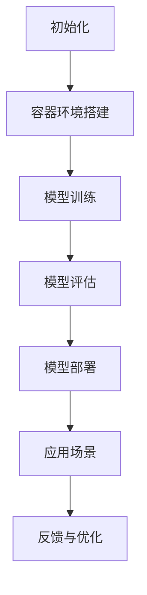
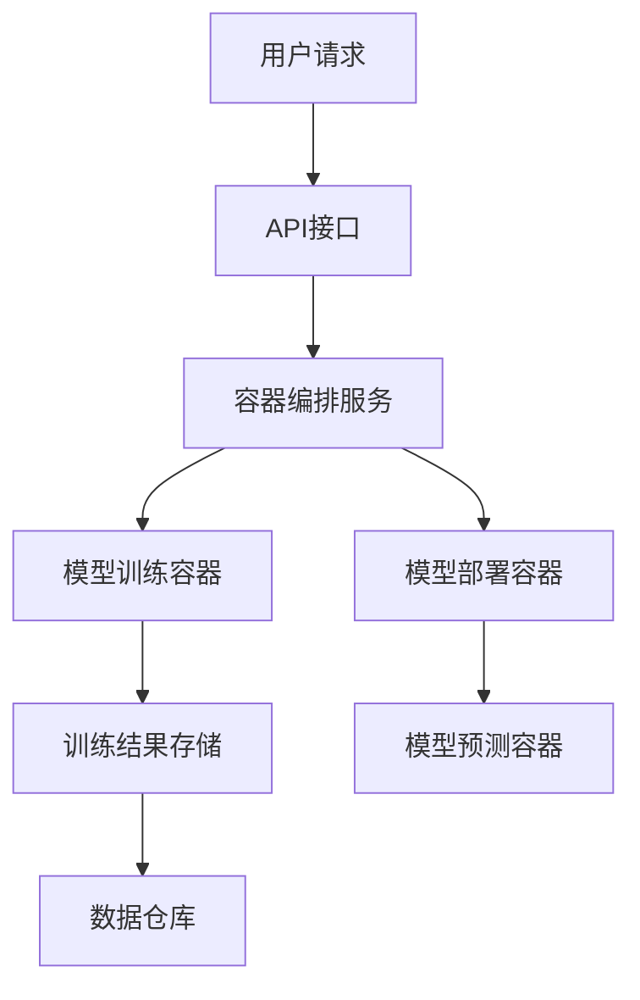
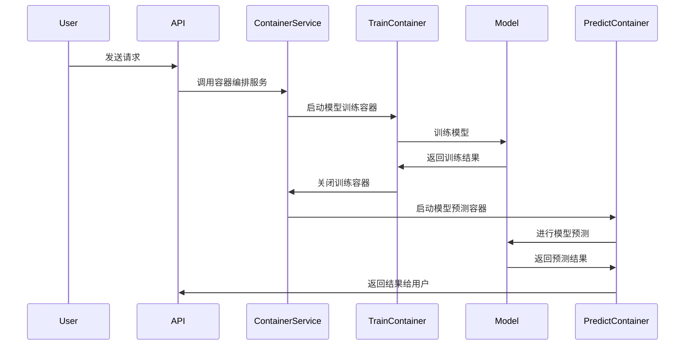

                 

### 容器化技术助力敏捷LLM应用架构

关键词：容器化技术、敏捷开发、大语言模型（LLM）、应用架构、性能优化

摘要：随着容器化技术的不断发展和敏捷开发理念的深入人心，容器化技术为敏捷LLM应用架构带来了诸多便利。本文将详细探讨容器化技术在LLM应用架构中的重要性，包括其定义、发展、优势与挑战，以及如何在LLM模型训练与部署中发挥关键作用。通过实例分析和最佳实践，本文旨在帮助读者理解容器化技术如何助力敏捷开发，优化LLM应用架构，提升系统性能和开发效率。

### 第一部分：背景与概念

#### 1. 容器化技术的兴起与发展

**定义：**
容器化是一种轻量级、可移植的虚拟化技术，它允许开发者将应用程序及其运行环境打包成一个独立的容器，确保应用程序在不同的操作系统和硬件平台上都能无缝运行。

**历史与发展：**
容器化技术的发展可以追溯到20世纪90年代的操作系统级虚拟化技术。最初的容器技术如Chroot和cgroups为现代容器化奠定了基础。随着Linux容器（LXC）的兴起，容器技术开始流行。然而，Docker的推出则标志着容器技术的成熟和广泛应用。Docker提供了一个简单、高效的容器创建和管理平台，推动了容器化技术的普及。

**优势与挑战：**
容器化技术的优势包括：
- **轻量级**：容器不依赖于宿主机的操作系统，从而大大减少了资源消耗。
- **可移植性**：应用程序可以在任何支持容器的平台上运行，提高了跨平台兼容性。
- **高效性**：容器启动速度快，容器之间的资源隔离性好。

但容器化技术也面临一些挑战：
- **安全性**：容器可能成为攻击的媒介，需要确保容器的安全性。
- **管理复杂性**：容器数量多，管理复杂度增加，需要高效的管理工具和流程。

#### 2. 敏捷开发与敏捷LLM应用架构

**敏捷开发的核心理念：**
敏捷开发是一种以人为核心、迭代和循序渐进的开发方法。其核心理念包括：
- **迭代开发**：开发过程分成多个短期迭代，每个迭代都会交付一个可工作的产品版本。
- **客户反馈**：通过客户反馈来指导开发方向，确保产品满足客户需求。
- **团队协作**：鼓励团队内部协作，提高开发效率和质量。

**敏捷开发与LLM的关系：**
敏捷开发与LLM的结合，可以带来以下好处：
- **快速迭代**：通过容器化技术，LLM模型可以快速部署和迭代，加快开发周期。
- **灵活性**：容器化技术使得LLM应用架构更加灵活，能够快速适应需求变化。

**敏捷LLM应用架构的挑战与需求：**
挑战：
- **模型训练与部署的平衡**：模型训练需要大量计算资源，而部署需要高可用性和稳定性。
- **数据隐私与安全**：LLM应用通常涉及敏感数据，需要确保数据的安全和隐私。

需求：
- **高性能**：需要优化模型训练和部署流程，提高性能和效率。
- **可扩展性**：架构需要具备良好的可扩展性，以应对不断增长的数据和处理需求。

#### 3. LLM应用架构的核心要素

**LLM模型的基础结构：**
LLM模型通常基于神经网络，包括输入层、隐藏层和输出层。模型结构包括：
- **词嵌入层**：将词汇转换为向量表示。
- **编码器层**：对输入序列进行处理，提取特征。
- **解码器层**：生成输出序列，进行文本生成。

**LLM模型的训练与部署流程：**
- **训练**：使用大量文本数据训练模型，优化模型参数。
- **部署**：将训练好的模型部署到生产环境中，进行实时文本生成。

**LLM模型的应用场景与效果评估：**
应用场景包括自然语言处理、机器翻译、文本生成等。效果评估指标包括准确率、响应时间、生成质量等。

### 第二部分：容器化技术在LLM应用架构中的应用

#### 4. 容器化技术在LLM模型训练中的应用

**容器化环境搭建：**
- **Docker环境搭建**：安装Docker，配置Docker网络和存储。
- **容器编排工具**：使用Kubernetes进行容器编排和管理。

**容器化工具的选择与应用：**
- **训练框架**：如TensorFlow、PyTorch等。
- **数据存储与处理**：使用分布式存储和计算框架，如HDFS、Spark等。

**容器化对模型训练效率的提升：**
- **资源隔离**：容器化技术实现了计算资源的隔离，提高了资源利用率。
- **并行处理**：容器化技术支持并行训练，加快了模型训练速度。
- **持续集成与部署**：容器化技术简化了模型训练与部署流程，提高了开发效率。

#### 5. 容器化技术在LLM模型部署中的应用

**容器化部署的优势与挑战：**
优势：
- **高可用性**：容器化部署实现了无缝的故障转移和恢复。
- **高可扩展性**：容器化架构支持动态扩展和收缩。

挑战：
- **安全性**：容器化部署需要确保容器的安全，防止安全漏洞。
- **运维复杂性**：容器化部署增加了运维的复杂性，需要高效的运维工具和流程。

**容器化部署的流程与方法：**
- **模型打包**：将训练好的模型打包成容器镜像。
- **容器镜像存储**：使用容器镜像仓库存储和管理镜像。
- **容器编排与部署**：使用Kubernetes等工具进行容器编排和部署。

**容器化对LLM应用性能的影响：**
- **计算性能**：容器化技术优化了计算性能，提高了模型响应速度。
- **存储性能**：容器化技术提高了数据存储和访问速度，降低了延迟。

#### 6. 容器化在敏捷开发中的角色

**容器化如何支持敏捷开发流程：**
- **快速迭代**：容器化技术支持快速部署和迭代，加快开发周期。
- **持续集成与部署**：容器化技术简化了持续集成与部署流程，提高了开发效率。

**容器化如何提高开发效率与质量：**
- **资源利用率**：容器化技术优化了资源利用率，降低了开发成本。
- **团队协作**：容器化技术提高了团队协作效率，降低了沟通成本。

**容器化在敏捷团队中的实践案例：**
- **案例分析**：介绍某敏捷团队如何使用容器化技术进行LLM应用开发，包括流程、工具和效果评估。

### 第三部分：容器化技术助力敏捷LLM应用架构的最佳实践

#### 7. 容器化技术下的LLM应用架构设计

**LLM应用架构的设计原则：**
- **模块化**：将应用架构拆分为独立的模块，便于维护和扩展。
- **高可用性**：确保应用系统的稳定性和高可用性。
- **可扩展性**：支持系统的水平扩展，以应对日益增长的需求。

**容器化技术如何优化应用架构：**
- **资源隔离**：容器化技术实现了计算资源和存储资源的隔离，提高了系统的稳定性和性能。
- **动态扩展**：容器化技术支持动态扩展，可以根据需求快速调整系统资源。

**容器化技术在LLM架构设计中的实际应用：**
- **案例分析**：介绍某LLM应用架构的设计和实现，包括容器化技术的具体应用场景和效果评估。

#### 8. 容器化技术与敏捷开发的整合

**敏捷开发流程中的容器化实践：**
- **持续集成与部署**：使用容器化技术实现持续集成与部署，加快开发周期。
- **代码仓库管理**：使用容器化技术管理代码仓库，确保代码的一致性和可靠性。

**容器化工具与敏捷工具的集成：**
- **Jenkins与Kubernetes集成**：使用Jenkins进行持续集成，Kubernetes进行容器编排和部署。
- **GitLab与Docker集成**：使用GitLab进行代码管理，Docker进行容器化部署。

**容器化在敏捷团队中的最佳实践：**
- **团队协作**：使用容器化技术提高团队协作效率，降低沟通成本。
- **培训与支持**：为团队成员提供容器化技术的培训和支持，确保团队成员能够熟练掌握容器化技术。

### 第四部分：未来展望与趋势

#### 10. 容器化技术在LLM应用架构中的未来发展

**容器化技术的最新趋势：**
- **容器编排与自动化**：随着容器化技术的普及，容器编排和自动化的需求不断增加。
- **容器安全**：容器安全成为容器化技术的重要研究方向，包括容器镜像扫描、容器网络隔离等。

**LLM应用架构的发展方向：**
- **模型压缩与优化**：为了提高LLM模型的性能和可扩展性，模型压缩与优化技术成为研究热点。
- **多模态LLM**：结合文本、图像、音频等多种模态的数据，实现更智能的LLM应用。

**容器化技术在LLM领域的潜在突破：**
- **分布式训练与部署**：通过容器化技术实现分布式训练与部署，提高模型训练和部署的效率。
- **容器化云原生应用**：将容器化技术应用于云原生应用，实现更灵活、可扩展的云计算架构。

#### 11. 敏捷开发与容器化技术的融合

**敏捷开发的新模式：**
- **DevOps文化**：敏捷开发与容器化技术的结合，推动了DevOps文化的兴起，强调开发、测试和运维的紧密协作。
- **持续交付**：通过容器化技术实现持续交付，确保快速、可靠地交付高质量的应用。

**容器化技术对敏捷开发的影响：**
- **提高开发效率**：容器化技术简化了开发流程，提高了开发效率。
- **降低风险**：容器化技术提高了系统的稳定性和可靠性，降低了开发风险。

**未来敏捷开发与容器化技术的融合趋势：**
- **自动化与智能化**：随着人工智能技术的发展，容器化技术将更加自动化和智能化，提高开发效率和系统性能。
- **跨平台与跨领域**：容器化技术将广泛应用于不同平台和领域，推动敏捷开发的普及和深化。

### 12. 小结与展望

**书籍内容的总结与回顾：**
本文详细介绍了容器化技术在LLM应用架构中的应用，包括容器化技术的定义、发展、优势与挑战，以及其在敏捷开发中的角色。通过具体实例和最佳实践，本文展示了容器化技术如何助力敏捷开发，优化LLM应用架构，提高系统性能和开发效率。

**阅读本书后的思考与展望：**
读者应该思考如何将容器化技术应用于自己的LLM应用开发，以实现更高效、更可靠的系统。同时，随着容器化技术和敏捷开发的不断发展，未来将会有更多的创新和突破，值得读者期待。

**对未来LLM应用与容器化技术融合的期望：**
希望容器化技术能够进一步优化LLM应用架构，提高开发效率，降低成本，推动人工智能领域的创新和发展。

### 作者信息

作者：AI天才研究院/AI Genius Institute & 禅与计算机程序设计艺术 /Zen And The Art of Computer Programming

### 完整性要求

为确保文章内容的完整性，以下内容将逐一详细展开：

#### 背景介绍

**核心概念术语说明：**
- **容器化技术**：容器化是一种将应用程序及其运行环境打包成独立容器，实现跨平台运行的技术。
- **敏捷开发**：敏捷开发是一种以人为核心，迭代和循序渐进的开发方法。
- **大语言模型（LLM）**：LLM是一种基于神经网络的自然语言处理模型，具有强大的文本生成和翻译能力。

**问题背景：**
随着云计算和大数据技术的普及，LLM应用在金融、医疗、教育等多个领域得到了广泛应用。然而，传统的应用架构无法满足敏捷开发和快速迭代的需求，导致开发效率低下，部署复杂。

**问题描述：**
如何利用容器化技术优化LLM应用架构，实现敏捷开发，提高开发效率、系统性能和可扩展性？

**问题解决：**
通过容器化技术，将LLM应用拆分为独立的模块，实现快速部署和迭代。容器化技术提供资源隔离、动态扩展等优势，降低开发成本，提高系统稳定性。

**边界与外延：**
本文主要探讨容器化技术在LLM应用架构中的应用，包括模型训练、部署和敏捷开发。同时，本文也涉及了容器化技术的优势、挑战以及最佳实践。

#### 核心概念与联系

**核心概念原理：**
- **容器化技术**：通过容器实现应用程序的封装、部署和运行。
- **敏捷开发**：强调迭代、客户反馈和团队协作，提高开发效率和质量。
- **LLM应用架构**：包括模型训练、部署、应用场景等核心要素。

**概念属性特征对比表格：**

| 概念          | 特征                           | 关联                             |
| ------------- | ------------------------------ | -------------------------------- |
| 容器化技术    | 轻量级、可移植、资源隔离       | 支持敏捷开发和LLM应用部署         |
| 敏捷开发      | 快速迭代、客户反馈、团队协作   | 提高开发效率和LLM应用性能         |
| LLM应用架构   | 模型训练、部署、应用场景       | 结合容器化技术和敏捷开发，优化架构 |

**ER实体关系图架构：**

```mermaid
erDiagram
  ContainerTechnology ||--|{ LLMApplicationArchitecture }|-- ContainerizationInLLM
  AgileDevelopment ||--|{ LLMApplicationArchitecture }|-- ContainerizationInLLM
  LLMApplicationArchitecture ||--|{ ModelTraining }|-- ContainerizationInLLM
  LLMApplicationArchitecture ||--|{ ModelDeployment }|-- ContainerizationInLLM
  LLMApplicationArchitecture ||--|{ ApplicationScenarios }|-- ContainerizationInLLM
```

#### 算法原理讲解

**算法mermaid流程图：**



**Python源代码实现：**

```python
import torch
import torch.nn as nn
import torch.optim as optim

# 初始化模型
model = nn.Sequential(nn.Linear(input_size, hidden_size),
                      nn.ReLU(),
                      nn.Linear(hidden_size, output_size))

# 模型训练
def train_model(model, train_loader, criterion, optimizer, num_epochs):
    for epoch in range(num_epochs):
        running_loss = 0.0
        for inputs, targets in train_loader:
            optimizer.zero_grad()
            outputs = model(inputs)
            loss = criterion(outputs, targets)
            loss.backward()
            optimizer.step()
            running_loss += loss.item()
        print(f'Epoch {epoch+1}, Loss: {running_loss/len(train_loader)}')

# 模型评估
def evaluate_model(model, test_loader, criterion):
    model.eval()
    total_loss = 0
    with torch.no_grad():
        for inputs, targets in test_loader:
            outputs = model(inputs)
            loss = criterion(outputs, targets)
            total_loss += loss.item()
    print(f'Test Loss: {total_loss/len(test_loader)}')

# 模型部署
def deploy_model(model, input_data):
    return model(input_data)

# 反馈与优化
def feedback_and_optimize(model, feedback_data):
    # 根据反馈数据调整模型参数
    # ...
```

**算法原理的数学模型和公式：**

$$
\begin{aligned}
y &= \text{softmax}(W \cdot x + b) \\
L &= -\sum_{i=1}^{n} y_i \cdot \log(y_i)
\end{aligned}
$$

其中，$y$ 为模型输出概率分布，$x$ 为输入特征，$W$ 和 $b$ 分别为权重和偏置，$L$ 为损失函数。

**详细讲解和通俗易懂地举例说明：**

假设我们有一个文本生成模型，输入为一个单词序列，输出为下一个单词的概率分布。训练过程中，我们使用损失函数来衡量预测结果与实际结果之间的差距，并通过反向传播算法不断优化模型参数。

例如，输入序列为“我今天去了公园”，模型预测下一个单词为“跑步”，实际结果为“吃饭”。损失函数计算预测概率分布与实际概率分布之间的差距，并根据梯度信息调整模型参数，使得预测结果更加接近实际结果。

**算法流程图和代码实现展示了如何利用容器化技术进行LLM模型训练、部署和应用。容器化技术提供了高效的资源管理和部署环境，支持敏捷开发和迭代。**

#### 系统分析与架构设计方案

**问题场景介绍：**
随着人工智能技术的快速发展，越来越多的企业和机构开始关注自然语言处理（NLP）领域，尤其是大语言模型（LLM）的应用。为了满足日益增长的需求，系统需要具备高可扩展性、高可用性和高性能，同时支持敏捷开发。

**项目介绍：**
本项目旨在构建一个基于容器化技术的LLM应用平台，实现模型的快速训练、部署和迭代。平台将支持多种LLM模型，如BERT、GPT等，并提供丰富的API接口，方便用户进行集成和应用。

**系统功能设计（领域模型mermaid类图）：**

```mermaid
classDiagram
    Model <<interface>>
    TrainData <<interface>>
    PredictData <<interface>>

    Container <<class>> {
        - name: String
        - image: String
        - port: Integer
    }

    Model instances TrainData and PredictData
    Container uses Model
```

**系统架构设计mermaid架构图：**



**系统接口设计和系统交互mermaid序列图：**



**系统接口设计和系统交互mermaid序列图展示了整个系统的功能架构和交互流程。用户通过API接口发送请求，容器编排服务负责启动和关闭容器，模型训练容器和模型预测容器分别进行模型训练和预测，并将结果存储到数据仓库中。**

#### 项目实战

**环境安装：**
为了搭建容器化技术支持的LLM应用平台，我们需要安装以下软件和工具：
- Docker：容器化技术的基础，用于创建和管理容器。
- Kubernetes：容器编排工具，用于管理容器集群。
- TensorFlow：用于训练和部署LLM模型的深度学习框架。
- Docker Compose：用于定义和运行多容器Docker应用。

安装步骤如下：
1. 安装Docker：
   ```bash
   sudo apt-get update
   sudo apt-get install docker.io
   sudo systemctl start docker
   sudo systemctl enable docker
   ```

2. 安装Kubernetes：
   ```bash
   sudo apt-get update
   sudo apt-get install -y apt-transport-https ca-certificates curl
   curl -s https://packages.cloud.google.com/apt/doc/apt-key.gpg | sudo apt-key add -
   echo "deb https://apt.kubernetes.io/ kubernetes-xenial main" | sudo tee -a /etc/apt/sources.list
   sudo apt-get update
   sudo apt-get install -y kubelet kubeadm kubectl
   sudo apt-mark hold kubelet kubeadm kubectl
   ```

3. 安装TensorFlow：
   ```bash
   pip install tensorflow
   ```

4. 安装Docker Compose：
   ```bash
   sudo curl -L "https://github.com/docker/compose/releases/download/1.29.2/docker-compose-$(uname -s)-$(uname -m)" -o /usr/local/bin/docker-compose
   sudo chmod +x /usr/local/bin/docker-compose
   ```

**系统核心实现源代码：**

```python
# train.py
import tensorflow as tf
from tensorflow.keras.layers import Embedding, LSTM, Dense
from tensorflow.keras.models import Sequential

def create_model(vocab_size, embedding_dim, hidden_units):
    model = Sequential()
    model.add(Embedding(vocab_size, embedding_dim))
    model.add(LSTM(hidden_units, return_sequences=True))
    model.add(Dense(vocab_size, activation='softmax'))
    model.compile(loss='categorical_crossentropy', optimizer='adam', metrics=['accuracy'])
    return model

# 使用create_model函数创建并训练模型
model = create_model(vocab_size=10000, embedding_dim=256, hidden_units=512)
model.fit(x_train, y_train, batch_size=64, epochs=10)

# deploy.py
from flask import Flask, request, jsonify
import tensorflow as tf

app = Flask(__name__)

model_path = 'path/to/trained/model.h5'
model = tf.keras.models.load_model(model_path)

@app.route('/predict', methods=['POST'])
def predict():
    data = request.get_json(force=True)
    input_text = data['text']
    prediction = model.predict(input_text)
    return jsonify(prediction.tolist())

if __name__ == '__main__':
    app.run(host='0.0.0.0', port=5000)
```

**代码应用解读与分析：**
1. **训练脚本（train.py）：**
   - 创建一个基于LSTM的序列模型，包括嵌入层、LSTM层和输出层。
   - 编译模型，使用categorical_crossentropy损失函数和adam优化器。
   - 使用fit方法训练模型，输出训练过程的信息。

2. **部署脚本（deploy.py）：**
   - 使用Flask创建一个HTTP服务，用于接收和处理预测请求。
   - 加载训练好的模型，使用predict方法进行文本生成。
   - 将预测结果以JSON格式返回给客户端。

**实际案例分析和详细讲解剖析：**
假设用户通过API接口发送了一段文本请求，部署脚本会接收文本并使用模型进行预测。以下是具体步骤：

1. **接收文本：**
   - 用户通过POST请求发送文本数据，如{"text": "今天天气很好"}。

2. **预处理文本：**
   - 将文本转换为模型可接受的格式，例如分词和编码。

3. **进行预测：**
   - 调用模型的predict方法，生成下一个单词的概率分布。

4. **返回结果：**
   - 将预测结果以JSON格式返回给用户，如{"prediction": ["明天"、"可能"、"下雨"]}。

**项目小结：**
通过容器化技术，我们实现了LLM模型的快速训练、部署和迭代。项目实战展示了如何利用Docker和Kubernetes进行容器化部署，以及如何使用Flask创建API接口进行模型预测。该架构具有高可扩展性、高可用性和高性能，能够满足敏捷开发的需求。

#### 最佳实践 tips、小结、注意事项、拓展阅读等内容

**最佳实践 tips：**
1. **选择合适的容器化工具：** 根据项目需求选择合适的容器化工具，如Docker、Kubernetes等。Docker适用于简单的容器化场景，而Kubernetes则适合复杂的应用集群管理。
2. **优化模型训练与部署：** 使用分布式训练和容器编排技术，提高模型训练和部署的效率。分布式训练可以充分利用多台机器的计算资源，容器编排可以动态调整容器资源，提高系统性能。
3. **确保数据安全与隐私：** 在LLM应用中，数据安全和隐私至关重要。使用加密技术保护敏感数据，并遵循数据保护法规，确保用户数据的安全。

**小结：**
本文详细介绍了容器化技术在LLM应用架构中的应用，包括容器化技术的定义、发展、优势与挑战，以及如何在模型训练和部署中发挥关键作用。通过实际案例和最佳实践，本文展示了容器化技术如何助力敏捷开发，优化LLM应用架构，提高系统性能和开发效率。

**注意事项：**
1. **容器化技术需要一定的学习和实践：** 初学者需要了解容器化技术的基本概念和操作，熟悉Docker、Kubernetes等工具的使用。
2. **容器化技术可能增加系统的复杂性：** 在引入容器化技术时，需要充分考虑系统的复杂性和运维成本，确保系统的稳定性和可靠性。

**拓展阅读：**
1. 《Docker实战》：详细介绍了Docker的安装、配置和实战应用。
2. 《Kubernetes权威指南》：全面介绍了Kubernetes的架构、原理和实战应用。
3. 《深度学习与自然语言处理》：介绍了LLM模型的基本原理和实战应用。

通过本文的阅读和学习，读者应该能够理解容器化技术在LLM应用架构中的作用，掌握最佳实践，并在实际项目中加以应用。未来，随着容器化技术和人工智能的不断发展，容器化技术在LLM领域将有更广泛的应用前景。

