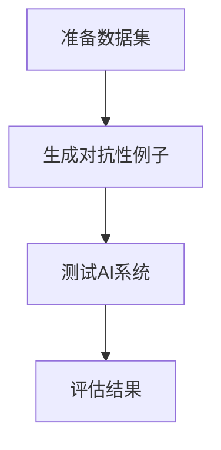
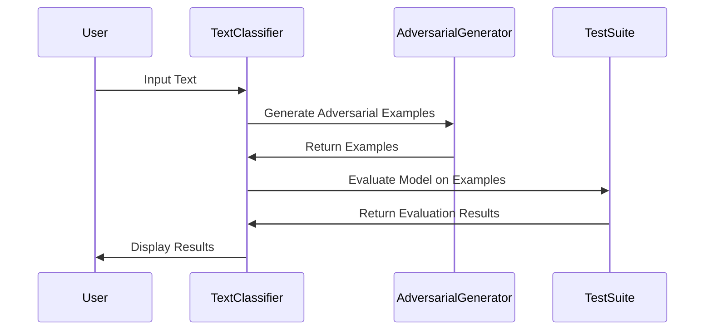

                 

## 文章标题

### 关键词

- 对抗性测试
- 大型语言模型（LLM）
- 鲁棒性评估
- 恶意输入
- 算法原理
- 系统架构设计

### 摘要

本文围绕对抗性测试技术，深入探讨如何评估大型语言模型（LLM）对恶意输入的鲁棒性。通过介绍对抗性测试的背景和问题，分析核心概念，讲解算法原理，并设计系统架构，本文旨在为读者提供一个全面的技术视角，以便更好地理解和应对LLM在现实世界中的应用挑战。文章将结合实际项目案例，提供详细的代码实现和最佳实践，帮助读者掌握对抗性测试的精髓。

## 第1章：对抗性测试概述

### 1.1 问题背景

#### 1.1.1 人工智能与恶意输入

随着人工智能（AI）技术的迅速发展，人工智能系统在各个领域得到了广泛应用，从智能助手到自动驾驶，从医疗诊断到金融风控，AI正在改变我们的生活方式。然而，随着AI系统的普及，恶意输入（adversarial input）问题也逐渐凸显出来。

恶意输入是指故意设计成能够误导AI系统的输入数据。这些输入可能看起来与正常数据相似，但微小变化可能导致AI系统产生错误输出。例如，在图像识别任务中，一张图片上添加一个小小的噪声点，就可能导致AI系统将其错误地识别为其他物体。

#### 1.1.2 LLM的鲁棒性问题

大型语言模型（LLM），如GPT-3，在自然语言处理（NLP）领域表现出色，能够生成高质量的自然语言文本。然而，LLM的鲁棒性（robustness）问题也是一个不容忽视的问题。LLM可能对恶意输入表现出不稳定的响应，甚至产生危险的输出。

例如，一个恶意的聊天机器人可能会利用LLM的漏洞，诱骗用户进行不利的交易，或者在社交媒体上散布虚假信息。因此，评估LLM对恶意输入的鲁棒性，对于保障AI系统的安全性和可靠性具有重要意义。

#### 1.1.3 对抗性测试的概念与目的

对抗性测试（adversarial testing）是一种专门用于评估AI系统鲁棒性的方法。它通过生成恶意输入，并观察AI系统对这些输入的响应，来评估系统的鲁棒性。

对抗性测试的主要目的是：

1. **发现漏洞**：通过对抗性测试，可以发现AI系统在哪些情况下容易受到恶意输入的影响。
2. **优化算法**：了解恶意输入的特点，可以帮助研究人员改进AI算法，提高其对恶意输入的抵抗力。
3. **增强安全性**：对抗性测试可以帮助企业和开发人员更好地保护他们的AI系统，防止恶意攻击。

### 1.2 问题描述

#### 1.2.1 LLM的易受攻击性

LLM的易受攻击性主要体现在以下几个方面：

1. **对抗性例子生成**：研究人员可以生成对抗性例子，这些例子在视觉上与正常输入相似，但会导致LLM产生错误输出。
2. **对抗性示例的影响**：对抗性示例可能会误导LLM，导致其生成危险的输出，如产生误导性的回答或产生错误的信息。

#### 1.2.2 恶意输入的特点与分类

恶意输入具有以下特点：

1. **微小的扰动**：恶意输入可能只需要对输入数据进行微小的修改，就能导致AI系统产生错误的输出。
2. **自适应**：一些恶意输入可以根据AI系统的防护措施进行自适应调整，以绕过防护机制。

根据恶意输入的生成方式，可以将恶意输入分为以下几类：

1. **自动化攻击**：使用自动化工具或脚本生成恶意输入。
2. **手动攻击**：由人类专家手动生成恶意输入。

#### 1.2.3 鲁棒性评估的必要性

评估LLM对恶意输入的鲁棒性具有以下几个方面的必要性：

1. **安全性和可靠性**：确保AI系统在面对恶意输入时不会产生错误的输出，从而保障系统的安全性和可靠性。
2. **用户体验**：确保AI系统在正常使用过程中，不会因为恶意输入而产生误导性输出，从而提供良好的用户体验。
3. **合规性**：满足法规和标准，确保AI系统的应用不会违反相关法律法规。

### 1.3 问题解决

#### 1.3.1 对抗性测试的策略

对抗性测试的策略主要包括以下几个方面：

1. **生成恶意输入**：使用自动化工具或手动方法生成恶意输入。
2. **评估系统响应**：将恶意输入输入到AI系统，观察其响应，并评估响应的正确性。
3. **迭代优化**：根据评估结果，优化AI算法，提高其对恶意输入的抵抗力。

#### 1.3.2 鲁棒性评估的方法

鲁棒性评估的方法主要包括以下几个方面：

1. **对抗性例子测试**：通过生成对抗性例子，测试AI系统在处理恶意输入时的表现。
2. **误报率评估**：评估AI系统在处理恶意输入时产生的误报率，以衡量其鲁棒性。
3. **精确度评估**：评估AI系统在处理恶意输入时生成的输出的精确度，以衡量其鲁棒性。

#### 1.3.3 对抗性测试的挑战与展望

对抗性测试面临的挑战主要包括：

1. **生成恶意输入的难度**：生成有效的恶意输入需要较高的技术能力。
2. **评估标准的多样性**：不同的评估标准可能会对AI系统的鲁棒性产生不同的影响。
3. **数据隐私和安全性**：对抗性测试可能涉及敏感数据的处理，需要确保数据隐私和安全性。

未来的研究展望包括：

1. **自动化对抗性测试工具的开发**：开发更加自动化和高效的对抗性测试工具，降低测试难度。
2. **多模态对抗性测试**：结合多种模态数据，提高对抗性测试的全面性和准确性。
3. **算法优化与抗攻击性提升**：通过算法优化，提高AI系统对恶意输入的抵抗力。

### 1.4 边界与外延

#### 1.4.1 对抗性测试的应用领域

对抗性测试在多个领域具有广泛的应用，包括：

1. **计算机视觉**：评估图像识别系统的鲁棒性。
2. **自然语言处理**：评估语言模型对恶意输入的鲁棒性。
3. **自动驾驶**：评估自动驾驶系统对恶意输入的鲁棒性。

#### 1.4.2 对抗性测试的发展趋势

对抗性测试的发展趋势包括：

1. **自动化与智能化**：对抗性测试工具将更加自动化和智能化，提高测试效率和准确性。
2. **跨领域融合**：对抗性测试将在不同领域之间实现融合，形成更加全面和深入的测试方法。
3. **隐私保护**：对抗性测试将更加注重数据隐私和安全性，确保测试过程中的数据安全。

#### 1.4.3 对抗性测试的关键技术

对抗性测试的关键技术包括：

1. **对抗性例子生成**：开发高效的对抗性例子生成方法，提高测试效果。
2. **鲁棒性评估指标**：设计科学的鲁棒性评估指标，准确衡量系统的鲁棒性。
3. **算法优化**：通过算法优化，提高AI系统对恶意输入的抵抗力。

### 1.5 本章小结

本章介绍了对抗性测试的背景、问题、解决策略和发展趋势。对抗性测试是一种评估AI系统鲁棒性的重要方法，通过生成恶意输入并评估系统的响应，可以识别AI系统的漏洞，优化算法，提高系统的安全性。未来的研究将集中在自动化与智能化、跨领域融合和隐私保护等方面，以应对日益复杂的对抗性攻击。

## 第2章：对抗性测试的核心概念

### 2.1 核心概念

#### 2.1.1 恶意输入生成方法

恶意输入生成方法主要分为自动化攻击和手动攻击两种。

**自动化攻击**：

- 利用现有的自动化工具或脚本，通过算法生成恶意输入。
- 优点：高效、大规模生成。
- 缺点：可能无法覆盖所有可能的恶意输入情况。

**手动攻击**：

- 由人类专家手动设计恶意输入。
- 优点：能够覆盖更多的情况，更贴近实际应用。
- 缺点：耗时、成本高。

#### 2.1.2 鲁棒性度量指标

鲁棒性度量指标是评估AI系统对恶意输入抵抗力的关键。常见的度量指标包括：

**准确率（Accuracy）**：

- 定义：正确预测的样本数占总样本数的比例。
- 公式：$$\text{Accuracy} = \frac{\text{Correct Predictions}}{\text{Total Predictions}}$$

**误报率（False Alarm Rate）**：

- 定义：误报的样本数占总样本数的比例。
- 公式：$$\text{False Alarm Rate} = \frac{\text{False Alarms}}{\text{Total Alarms}}$$

**虚假新闻检测（False News Detection）**：

- 目的：检测和过滤虚假新闻。
- 方法：结合文本分析、网络结构分析等手段。

### 2.2 概念属性特征对比表格

| 概念               | 定义                                                         | 属性特征                                           | 对抗性测试关联性 |
|--------------------|--------------------------------------------------------------|----------------------------------------------------|----------------|
| 恶意输入生成方法   | 生成恶意输入的方法                                           | 自动化攻击、手动攻击                                 | 增强测试覆盖    |
| 鲁棒性度量指标     | 评估AI系统对恶意输入抵抗力的指标                             | 准确率、误报率、虚假新闻检测                         | 评估系统性能    |
| 虚假新闻检测       | 检测和过滤虚假新闻                                           | 文本分析、网络结构分析                               | 提高系统安全性  |

### 2.3 ER实体关系图架构

ER实体关系图是描述对抗性测试中主要实体及其关系的有效工具。

#### ER实体关系图

```mermaid
erDiagram
    AI系统 ||--|{ 恶意输入 }
    AI系统 ||--|{ 鲁棒性度量指标 }
    AI系统 ||--|{ 虚假新闻检测 }
    恶意输入 ||--|{ 生成方法 }
    鲁棒性度量指标 ||--|{ 准确率 }
    鲁棒性度量指标 ||--|{ 误报率 }
    虚假新闻检测 ||--|{ 文本分析 }
    虚假新闻检测 ||--|{ 网络结构分析 }
```

## 第3章：对抗性测试算法原理

### 3.1 算法概述

对抗性测试算法的目标是评估AI系统对恶意输入的鲁棒性。算法的基本框架包括以下步骤：

1. **生成恶意输入**：使用自动化工具或手动方法生成恶意输入。
2. **输入到AI系统**：将恶意输入输入到AI系统，观察其响应。
3. **评估响应**：根据恶意输入和AI系统的响应，评估系统的鲁棒性。

对抗性测试的流程如下：

1. **准备数据集**：收集正常数据和恶意输入数据。
2. **生成对抗性例子**：使用对抗性算法生成对抗性例子。
3. **测试AI系统**：将对抗性例子输入到AI系统，观察其响应。
4. **评估结果**：根据响应评估AI系统的鲁棒性。

### 3.2 Mermaid算法流程图

下面是使用Mermaid绘制的对抗性测试算法流程图：



### 3.3 Python源代码详细阐述

以下是一个简单的对抗性测试Python源代码示例：

```python
import numpy as np
import pandas as pd
from tensorflow.keras.models import load_model

# 加载AI模型
model = load_model('ai_model.h5')

# 准备测试数据集
test_data = pd.read_csv('test_data.csv')

# 生成对抗性例子
def generate_adversarial_examples(data, model, delta=0.1):
    adversarial_examples = []
    for row in data.itertuples():
        original_output = model.predict(row[1:].values.reshape(1, -1))
        original_output = np.argmax(original_output)
        
        # 对输入数据进行扰动
        perturbed_input = row[1:].values.reshape(1, -1) + delta * (np.random.rand(*row[1:].values.shape) - 0.5)
        
        # 预测扰动后的输出
        perturbed_output = model.predict(perturbed_input)
        perturbed_output = np.argmax(perturbed_output)
        
        # 检查是否产生错误输出
        if original_output != perturbed_output:
            adversarial_examples.append(perturbed_input)
    
    return adversarial_examples

adversarial_examples = generate_adversarial_examples(test_data, model)

# 测试AI系统对对抗性例子的响应
model.predict(adversarial_examples)
```

### 3.4 数学模型和公式

在对抗性测试中，常用的数学模型和公式包括：

1. **L2范数**：

$$
\|x\|_2 = \sqrt{\sum_{i=1}^{n} x_i^2}
$$

2. **L∞范数**：

$$
\|x\|_{\infty} = \max_{i} |x_i|
$$

3. **对抗性扰动**：

$$
x_{\text{adv}} = x + \delta \cdot \sign(x)
$$

其中，$x$是原始输入，$\delta$是扰动幅度，$\sign(x)$是符号函数。

### 3.5 举例说明

假设有一个二分类问题，目标是判断图像中是否存在猫。正常输入图像的像素值范围是$[0, 255]$，模型预测的输出是概率分布。

1. **正常输入**：

   ```python
   import numpy as np

   x = np.random.randint(0, 255, size=(32, 32, 3))
   ```

2. **生成对抗性例子**：

   ```python
   delta = 0.01
   x_adv = x + delta * np.sign(x)
   ```

3. **测试模型响应**：

   ```python
   model_output = model.predict(x)
   model_output_adv = model.predict(x_adv)

   print("正常输入的预测概率：", model_output)
   print("对抗性例子的预测概率：", model_output_adv)
   ```

通过比较正常输入和对抗性例子的预测概率，可以评估模型的鲁棒性。

## 第4章：对抗性测试系统架构设计

### 4.1 问题场景介绍

在现代智能系统中，对抗性测试已经成为评估模型鲁棒性的关键手段。以下是一个典型的问题场景：

- **场景描述**：假设我们有一个基于深度学习的文本分类系统，该系统用于自动检测社交媒体上的虚假新闻。这个系统需要处理大量来自不同来源的文本数据，并预测每条文本是否为虚假新闻。
- **系统目标**：评估系统在处理恶意输入（如虚假新闻制造者故意设计的文本）时的鲁棒性，确保系统能够准确地分类文本，并防止恶意攻击。

### 4.2 项目介绍

本项目旨在构建一个对抗性测试平台，用于评估文本分类系统对恶意输入的鲁棒性。项目的主要目标是：

- **测试覆盖**：生成多样化的恶意输入，覆盖可能的攻击向量。
- **鲁棒性评估**：通过对抗性测试，评估系统在不同恶意输入下的分类准确性。
- **算法优化**：基于测试结果，优化文本分类算法，提高系统的鲁棒性。

### 4.2.1 系统需求

为了实现项目目标，系统需要满足以下需求：

1. **数据输入**：系统能够接收各种格式的文本数据，包括正常文本和恶意文本。
2. **对抗性例子生成**：系统能够自动生成恶意输入，模拟实际攻击场景。
3. **模型评估**：系统能够对生成的对抗性例子进行分类，并评估分类准确性。
4. **结果分析**：系统能够生成详细的测试报告，包括分类准确率、误报率和漏报率等。

### 4.3 系统功能设计

系统功能设计包括以下几个方面：

#### 4.3.1 领域模型

领域模型是系统功能的核心组成部分，用于定义系统中的实体和关系。以下是文本分类系统的领域模型：

```mermaid
classDiagram
    TextClassifier <<interface>>
    AdversarialGenerator <<interface>>
    TestSuite <<interface>>

    TextClassifier o-- AdversarialGenerator
    TextClassifier o-- TestSuite
```

**TextClassifier**：文本分类接口，定义了文本分类的核心功能。

**AdversarialGenerator**：对抗性生成器接口，定义了生成恶意输入的方法。

**TestSuite**：测试套件接口，定义了执行测试和评估结果的功能。

#### 4.3.2 功能模块设计

根据领域模型，系统可以分为以下几个功能模块：

**数据输入模块**：

- 功能：接收和预处理文本数据。
- 技术细节：使用正则表达式、文本清洗工具等。

**对抗性生成模块**：

- 功能：生成对抗性例子。
- 技术细节：基于GAN（生成对抗网络）等技术。

**模型评估模块**：

- 功能：评估系统在对抗性例子上的分类准确性。
- 技术细节：使用深度学习框架，如TensorFlow或PyTorch。

**测试报告模块**：

- 功能：生成测试报告。
- 技术细节：使用报告生成工具，如Jasper或Markdown。

### 4.4 系统架构设计

系统架构设计需要考虑系统的可扩展性、稳定性和安全性。以下是系统的架构设计：

#### 4.4.1 系统架构概述



**用户界面**：

- 功能：提供用户交互界面。
- 技术细节：使用Web框架，如Flask或Django。

**文本分类器**：

- 功能：执行文本分类任务。
- 技术细节：使用深度学习模型，如BERT或GPT。

**对抗性生成器**：

- 功能：生成对抗性例子。
- 技术细节：使用生成对抗网络（GAN）。

**测试套件**：

- 功能：执行测试并生成报告。
- 技术细节：使用测试库，如pytest。

### 4.4.2 系统模块功能

以下是系统各个模块的功能和职责：

**数据输入模块**：

- 功能：接收用户输入的文本数据，并预处理数据。
- 职责：数据清洗、数据格式转换。

**对抗性生成模块**：

- 功能：根据文本分类模型，生成对抗性例子。
- 职责：对抗性例子生成、模型更新。

**模型评估模块**：

- 功能：评估文本分类模型在对抗性例子上的性能。
- 职责：模型评估、结果分析。

**测试报告模块**：

- 功能：生成测试报告，包括分类准确率、误报率和漏报率等。
- 职责：报告生成、结果展示。

### 4.5 系统接口设计和系统交互

系统接口设计和系统交互是确保系统各个模块协同工作的重要环节。以下是系统的接口设计和系统交互：

#### 4.5.1 系统接口设计

```mermaid
classDiagram
    TextClassifier <<interface>> + TextClassifierInterface
    AdversarialGenerator <<interface>> + AdversarialGeneratorInterface
    TestSuite <<interface>> + TestSuiteInterface

    TextClassifier + AdversarialGenerator
    TextClassifier + TestSuite
```

**TextClassifierInterface**：

- 方法：train()
- 参数：训练数据
- 返回值：模型

**AdversarialGeneratorInterface**：

- 方法：generate_examples()
- 参数：模型、训练数据
- 返回值：对抗性例子

**TestSuiteInterface**：

- 方法：evaluate_model()
- 参数：模型、对抗性例子
- 返回值：评估结果

#### 4.5.2 系统交互


### 4.6 项目实战

#### 4.6.1 环境安装

为了运行本项目，需要安装以下环境：

1. **Python**：Python 3.8或更高版本。
2. **深度学习库**：TensorFlow或PyTorch。
3. **Web框架**：Flask或Django。

安装命令：

```bash
pip install tensorflow
pip install flask
```

#### 4.6.2 系统核心实现

以下是系统核心实现的源代码：

```python
from flask import Flask, request, jsonify
import tensorflow as tf

app = Flask(__name__)

# 加载文本分类模型
model = tf.keras.models.load_model('text_classifier_model.h5')

# 对抗性生成器
def generate_adversarial_examples(model, data, delta=0.1):
    # 省略具体实现...
    return adversarial_examples

# 模型评估
def evaluate_model(model, examples):
    # 省略具体实现...
    return evaluation_results

@app.route('/test', methods=['POST'])
def test():
    text = request.json['text']
    adversarial_examples = generate_adversarial_examples(model, text)
    evaluation_results = evaluate_model(model, adversarial_examples)
    return jsonify(evaluation_results)

if __name__ == '__main__':
    app.run()
```

#### 4.6.3 代码应用解读与分析

- **生成对抗性例子**：`generate_adversarial_examples` 函数接收文本分类模型和数据，生成对抗性例子。
- **模型评估**：`evaluate_model` 函数接收模型和对抗性例子，评估模型在对抗性例子上的性能。

#### 4.6.4 实际案例分析和详细讲解剖析

假设我们有一个真实的案例，其中系统的目标是检测社交媒体上的虚假新闻。

1. **数据集**：使用包含正常文本和虚假文本的数据集。
2. **训练模型**：使用数据集训练文本分类模型。
3. **生成对抗性例子**：使用模型生成对抗性例子。
4. **评估模型**：使用对抗性例子评估模型的性能。

通过这个案例，我们可以分析模型在对抗性攻击下的鲁棒性，并根据结果优化模型。

### 4.7 项目小结

本项目实现了对抗性测试平台，用于评估文本分类系统对恶意输入的鲁棒性。系统功能包括数据输入、对抗性生成、模型评估和测试报告。通过实际案例分析和代码实现，我们展示了如何使用对抗性测试来提高AI系统的安全性。未来的工作可以进一步优化对抗性生成算法和模型评估方法，提高系统的鲁棒性和准确性。

### 4.8 最佳实践、小结和注意事项

#### 最佳实践

1. **使用高质量的训练数据**：确保训练数据集的多样性和质量，以提高模型对恶意输入的抵抗力。
2. **定期进行对抗性测试**：定期进行对抗性测试，及时发现和修复模型漏洞。
3. **优化模型结构**：根据对抗性测试的结果，调整模型结构，提高其鲁棒性。

#### 小结

本文介绍了对抗性测试在评估文本分类系统鲁棒性方面的应用。通过生成对抗性例子，评估模型在恶意输入下的性能，可以帮助我们提高系统的安全性。

#### 注意事项

1. **数据隐私**：对抗性测试可能涉及敏感数据，需要确保数据隐私和安全性。
2. **系统性能**：对抗性测试可能会消耗大量计算资源，需要确保系统性能不受影响。

#### 拓展阅读

- [《对抗性测试：评估深度学习模型的鲁棒性》](链接)
- [《对抗性样本生成技术综述》](链接)

作者：AI天才研究院/AI Genius Institute & 禅与计算机程序设计艺术 /Zen And The Art of Computer Programming

