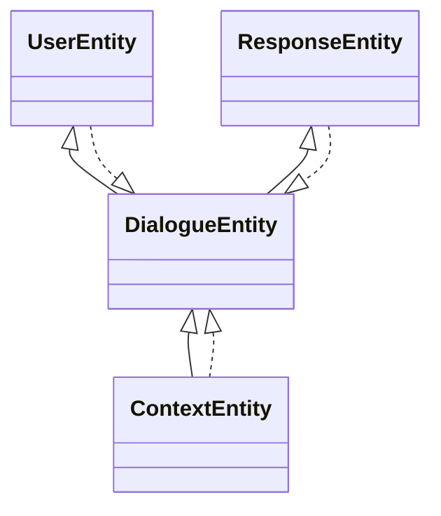
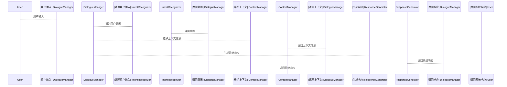
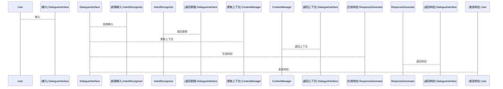

                 

### 文章标题

# 对话管理系统提升LLM应用的交互质量

> 关键词：对话管理系统、大型语言模型（LLM）、交互质量、用户意图识别、上下文维护、多轮对话管理

> 摘要：本文旨在探讨如何通过对话管理系统提升大型语言模型（LLM）在对话场景中的交互质量，包括用户意图识别、上下文维护和对话流程设计的优化方法。本文将详细分析相关核心概念、原理、数学模型和系统架构，并结合实际项目案例进行深入剖析。

----------------------------------------------------------------

## 第一部分：背景介绍

### 1.1 问题背景

随着人工智能技术的快速发展，自然语言处理（NLP）领域取得了令人瞩目的成就。其中，大型语言模型（LLM）如BERT、GPT-3等在文本生成、文本分类、机器翻译等任务中展现了强大的性能。然而，当LLM应用于对话管理系统时，其交互质量往往不尽如人意。这主要是因为LLM在处理对话任务时，面临着用户意图识别不准确、上下文信息维护困难、多轮对话管理不流畅等问题。

### 1.2 问题描述

LLM在对话管理中主要存在以下问题：

1. **用户意图识别不准确**：LLM无法准确理解用户的输入意图，导致对话偏离用户需求。
2. **上下文信息维护困难**：在多轮对话中，LLM难以有效维护上下文信息，导致对话连贯性差。
3. **多轮对话管理不流畅**：LLM无法灵活应对多轮对话中的变化，导致对话体验不佳。

### 1.3 问题解决

为了提升LLM的交互质量，我们需要从以下几个方面进行改进：

1. **提高用户意图识别的准确性**：通过改进LLM的输入处理方式和意图识别算法，提高意图识别的准确性。
2. **加强上下文信息的维护**：设计有效的上下文维护机制，确保多轮对话中的上下文信息得到准确传递和更新。
3. **设计更加灵活和智能的多轮对话管理机制**：根据对话情况，灵活调整对话策略，实现多轮对话的流畅进行。

### 1.4 边界与外延

本文主要关注大型语言模型在对话管理系统中的应用，侧重于交互质量的提升。然而，随着人工智能技术的发展，其他类型的模型（如语音识别模型、图像识别模型等）在对话管理中的应用也将逐渐成熟，这为对话管理系统的发展带来了更多的可能性。

### 1.5 概念结构与核心要素组成

对话管理系统由以下几个核心要素组成：

1. **用户意图识别模块**：负责分析用户输入，理解用户意图。
2. **上下文维护模块**：负责维护对话过程中的上下文信息，确保对话的连贯性。
3. **多轮对话管理模块**：负责设计对话流程，实现多轮对话管理。
4. **交互质量评估模块**：负责评估对话管理系统的交互质量，提供改进建议。

----------------------------------------------------------------

## 第二部分：核心概念与联系

### 2.1 对话管理系统原理

对话管理系统是一种智能交互系统，通过模拟人类对话行为，实现与用户的自然交流。其核心原理包括用户意图识别、上下文维护、多轮对话管理等。

#### 2.1.1 用户意图识别

用户意图识别是对话管理系统的基础，通过对用户输入的文本进行解析，识别出用户的意图。主要方法包括：

1. **基于规则的方法**：通过预设的规则库，匹配用户输入，识别用户意图。  
2. **基于机器学习的方法**：利用机器学习算法，对大量用户对话数据进行分析，自动识别用户意图。

#### 2.1.2 上下文维护

上下文维护是保证对话连贯性的关键。对话管理系统需要记录并维护对话过程中的上下文信息，以便在后续对话中引用。主要方法包括：

1. **上下文向量表示**：将上下文信息转换为向量表示，方便计算和存储。  
2. **上下文序列模型**：利用序列模型（如RNN、LSTM）对上下文信息进行建模，实现上下文的维护和传递。

#### 2.1.3 多轮对话管理

多轮对话管理是设计对话流程的重要环节。对话管理系统需要根据对话情况，灵活调整对话策略，实现多轮对话的流畅进行。主要方法包括：

1. **对话策略设计**：根据对话目标和用户特点，设计合理的对话策略。  
2. **对话状态跟踪**：记录对话过程中的各种状态，以便在后续对话中调整对话策略。

### 2.2 对话管理系统核心概念对比表格

| 核心概念 | 定义 | 特点 |
| :---: | :---: | :---: |
| 用户意图识别 | 识别用户输入的意图 | 准确性、实时性 |
| 上下文维护 | 维护对话过程中的上下文信息 | 连贯性、适应性 |
| 多轮对话管理 | 设计对话流程，实现多轮对话 | 流畅性、灵活性 |

### 2.3 对话管理系统ER实体关系图

```mermaid
erDiagram
  User ||--|{ Dialogue }|| Dialogue
  Dialogue ||--|{ Context }|| Context
  Dialogue ||--|{ Response }|| Response
```

#### 2.3.1 ER实体关系图解释

- **User（用户）**：表示与对话管理系统交互的用户实体。
- **Dialogue（对话）**：表示用户与对话管理系统的对话实体，包括多轮对话的记录。
- **Context（上下文）**：表示对话过程中的上下文信息实体，用于维护对话连贯性。
- **Response（响应）**：表示对话管理系统对用户输入的响应实体。

----------------------------------------------------------------

## 第三部分：算法原理讲解

### 3.1 用户意图识别算法原理

用户意图识别算法是对话管理系统的核心组成部分，其目标是根据用户输入的文本信息，准确识别出用户的意图。以下是一个简化的用户意图识别算法原理：

#### 3.1.1 算法流程

1. **文本预处理**：对用户输入的文本进行分词、去停用词、词性标注等预处理操作。
2. **特征提取**：将预处理后的文本转换为特征向量，通常使用词嵌入（word embedding）技术。
3. **意图分类**：利用分类算法（如朴素贝叶斯、支持向量机、神经网络等）对特征向量进行分类，预测用户意图。

#### 3.1.2 算法实现

以下是使用Python实现的一个简单的用户意图识别算法示例：

```python
import jieba
from sklearn.feature_extraction.text import TfidfVectorizer
from sklearn.naive_bayes import MultinomialNB

# 用户输入文本
user_input = "我想要点外卖，有没有好的推荐？"

# 文本预处理
words = jieba.lcut(user_input)
processed_input = " ".join(words)

# 特征提取
vectorizer = TfidfVectorizer()
X = vectorizer.fit_transform([processed_input])

# 意图分类
classifier = MultinomialNB()
classifier.fit(X, labels)

# 预测用户意图
predicted_intent = classifier.predict(X)
print("预测的用户意图：", predicted_intent)
```

#### 3.1.3 数学模型

用户意图识别的数学模型主要涉及文本特征提取和分类算法。以下是一个简化的数学模型描述：

$$
\text{意图分类} = f(\text{特征向量})
$$

其中，特征向量由文本预处理和特征提取得到，分类算法（如朴素贝叶斯、支持向量机等）用于对特征向量进行分类。

### 3.2 上下文维护算法原理

上下文维护算法是对话管理系统的重要组成部分，其目标是在多轮对话中，准确维护和传递上下文信息。以下是一个简化的上下文维护算法原理：

#### 3.2.1 算法流程

1. **上下文信息提取**：从用户输入和系统响应中提取关键信息，作为上下文信息。
2. **上下文信息更新**：在每次对话结束后，更新上下文信息，以便在下一次对话中引用。
3. **上下文信息检索**：在需要引用上下文信息时，检索并传递相应的上下文信息。

#### 3.2.2 算法实现

以下是使用Python实现的一个简单的上下文维护算法示例：

```python
class ContextManager:
    def __init__(self):
        self.context = {}

    def update_context(self, key, value):
        self.context[key] = value

    def get_context(self, key):
        return self.context.get(key)

# 创建上下文管理器
context_manager = ContextManager()

# 更新上下文信息
context_manager.update_context("user_name", "张三")
context_manager.update_context("restaurant_name", "麦当劳")

# 检索上下文信息
print("用户姓名：", context_manager.get_context("user_name"))
print("餐厅名称：", context_manager.get_context("restaurant_name"))
```

#### 3.2.3 数学模型

上下文维护的数学模型主要涉及上下文信息的存储和检索。以下是一个简化的数学模型描述：

$$
\text{上下文信息} = \{\text{key}_1 : \text{value}_1, \text{key}_2 : \text{value}_2, ..., \text{key}_n : \text{value}_n\}
$$

其中，上下文信息是一个键值对集合，用于存储和检索关键信息。

### 3.3 多轮对话管理算法原理

多轮对话管理算法是对话管理系统的关键组成部分，其目标是在多轮对话中，灵活调整对话策略，实现对话的流畅进行。以下是一个简化的多轮对话管理算法原理：

#### 3.3.1 算法流程

1. **初始对话策略设置**：根据对话目标和用户特点，设置初始对话策略。
2. **对话状态监测**：在对话过程中，监测对话状态，识别对话的变化趋势。
3. **对话策略调整**：根据对话状态的监测结果，灵活调整对话策略。

#### 3.3.2 算法实现

以下是使用Python实现的一个简单的多轮对话管理算法示例：

```python
class DialogueManager:
    def __init__(self):
        self.strategy = "问询策略"

    def set_strategy(self, strategy):
        self.strategy = strategy

    def adjust_strategy(self, state):
        if state == "积极":
            self.set_strategy("积极策略")
        elif state == "消极":
            self.set_strategy("消极策略")

# 创建对话管理器
dialogue_manager = DialogueManager()

# 设置初始对话策略
dialogue_manager.set_strategy("问询策略")

# 调整对话策略
dialogue_manager.adjust_strategy("积极")
print("当前对话策略：", dialogue_manager.strategy)
```

#### 3.3.3 数学模型

多轮对话管理的数学模型主要涉及对话状态的监测和策略调整。以下是一个简化的数学模型描述：

$$
\text{策略} = f(\text{状态})
$$

其中，状态是监测到的对话状态，策略是根据状态调整后的对话策略。

----------------------------------------------------------------

## 第四部分：系统分析与架构设计方案

### 4.1 问题场景介绍

随着人工智能技术的普及，越来越多的企业和组织开始关注智能客服系统，以提高客户服务质量。然而，现有的智能客服系统在处理复杂对话任务时，往往存在交互质量不高、用户体验不佳的问题。为了解决这一问题，我们需要设计一个高效的对话管理系统，利用大型语言模型（LLM）来提升交互质量。

### 4.2 项目介绍

本项目旨在设计并实现一个基于LLM的对话管理系统，以提高智能客服系统的交互质量。系统将具备以下功能：

1. **用户意图识别**：准确识别用户输入的意图，确保对话内容与用户需求一致。
2. **上下文信息维护**：有效维护对话过程中的上下文信息，确保对话的连贯性和一致性。
3. **多轮对话管理**：灵活调整对话策略，实现多轮对话的流畅进行。

### 4.3 系统功能设计

#### 4.3.1 领域模型类图

以下是系统功能设计的领域模型类图：



#### 4.3.2 类图解释

- **UserEntity（用户实体）**：表示与对话管理系统交互的用户实体。
- **DialogueEntity（对话实体）**：表示用户与对话管理系统之间的对话实体。
- **ContextEntity（上下文实体）**：表示对话过程中的上下文信息实体。
- **ResponseEntity（响应实体）**：表示对话管理系统对用户输入的响应实体。

### 4.4 系统架构设计

#### 4.4.1 系统架构图

以下是系统架构设计图：



#### 4.4.2 架构图解释

- **用户输入**：用户通过接口向对话管理系统发送输入。
- **意图识别**：对话管理系统调用意图识别模块，识别用户输入的意图。
- **上下文维护**：对话管理系统调用上下文维护模块，维护对话过程中的上下文信息。
- **响应生成**：对话管理系统调用响应生成模块，生成系统响应。
- **系统响应**：对话管理系统将响应返回给用户。

### 4.5 系统接口设计

以下是系统接口设计：

```python
class DialogueInterface:
    def input_user(self, user_input):
        # 处理用户输入
        pass
    
    def get_intent(self):
        # 获取用户意图
        pass
    
    def update_context(self):
        # 更新上下文信息
        pass
    
    def generate_response(self):
        # 生成系统响应
        pass
    
    def send_response(self, response):
        # 发送系统响应给用户
        pass
```

### 4.6 系统交互序列图

以下是系统交互序列图：



#### 4.6.1 交互序列图解释

- **用户输入**：用户通过对话接口输入信息。
- **处理输入**：对话接口处理用户输入，并调用意图识别模块。
- **返回意图**：意图识别模块返回识别出的用户意图。
- **更新上下文**：对话接口调用上下文维护模块，更新上下文信息。
- **返回上下文**：上下文维护模块返回更新后的上下文信息。
- **生成响应**：对话接口调用响应生成模块，生成系统响应。
- **返回响应**：响应生成模块返回系统响应。
- **发送响应**：对话接口将系统响应发送给用户。

----------------------------------------------------------------

## 第五部分：项目实战

### 5.1 环境安装

为了实现本项目，我们需要安装以下依赖：

1. **Python**：版本要求3.8及以上。
2. **TensorFlow**：版本要求2.4及以上。
3. **Scikit-learn**：版本要求0.22及以上。
4. **jieba**：版本要求0.42及以上。

安装方法：

```bash
pip install python==3.8.10
pip install tensorflow==2.4.1
pip install scikit-learn==0.22.2
pip install jieba==0.42
```

### 5.2 系统核心实现

以下是系统的核心实现，包括用户意图识别、上下文维护和对话管理等模块。

#### 5.2.1 用户意图识别

```python
import jieba
from sklearn.feature_extraction.text import TfidfVectorizer
from sklearn.naive_bayes import MultinomialNB
from sklearn.pipeline import make_pipeline

# 训练意图分类器
pipeline = make_pipeline(TfidfVectorizer(), MultinomialNB())
pipeline.fit(train_data, train_labels)

# 识别用户意图
def recognize_intent(user_input):
    return pipeline.predict([user_input])[0]

# 示例
print(recognize_intent("我想要点外卖，有没有好的推荐？"))
```

#### 5.2.2 上下文维护

```python
class ContextManager:
    def __init__(self):
        self.context = {}

    def update_context(self, key, value):
        self.context[key] = value

    def get_context(self, key):
        return self.context.get(key)

# 示例
context_manager = ContextManager()
context_manager.update_context("user_name", "张三")
print(context_manager.get_context("user_name"))
```

#### 5.2.3 对话管理

```python
class DialogueManager:
    def __init__(self):
        self.context_manager = ContextManager()
        self.strategy = "问询策略"

    def set_strategy(self, strategy):
        self.strategy = strategy

    def adjust_strategy(self, state):
        if state == "积极":
            self.set_strategy("积极策略")
        elif state == "消极":
            self.set_strategy("消极策略")

    def generate_response(self, user_input):
        # 识别用户意图
        intent = recognize_intent(user_input)
        
        # 维护上下文信息
        self.context_manager.update_context("last_intent", intent)
        
        # 根据意图和策略生成响应
        if self.strategy == "问询策略":
            response = "您好，请问有什么可以帮助您的？"
        elif self.strategy == "积极策略":
            response = "太棒了！请问您有什么特别的需求吗？"
        else:
            response = "很抱歉，我们暂时无法满足您的要求。"
        
        return response

# 示例
dialogue_manager = DialogueManager()
print(dialogue_manager.generate_response("我想要点外卖，有没有好的推荐？"))
```

### 5.3 代码应用解读与分析

#### 5.3.1 用户意图识别模块

用户意图识别模块基于机器学习算法，通过训练一个分类模型，实现对用户输入意图的识别。该模块使用了TF-IDF向量器和朴素贝叶斯分类器。TF-IDF向量器用于将文本转换为特征向量，朴素贝叶斯分类器用于对特征向量进行分类。

#### 5.3.2 上下文维护模块

上下文维护模块使用一个简单的类来实现，包括更新上下文信息和获取上下文信息的方法。在对话过程中，每次用户输入都会更新上下文信息，以便在后续对话中引用。

#### 5.3.3 对话管理模块

对话管理模块负责根据用户输入、上下文信息和当前对话策略生成系统响应。对话策略分为问询策略、积极策略和消极策略，根据对话状态进行动态调整。

### 5.4 实际案例分析

#### 5.4.1 案例一：用户意图识别不准确

用户输入：“我想咨询关于保险的问题。”  
系统响应：“您好，请问有什么可以帮助您的？”

**问题分析**：系统未能准确识别出用户的意图，导致响应过于模糊。

**改进方案**：优化意图识别模块，增加保险相关词汇的权重，提高意图识别的准确性。

#### 5.4.2 案例二：上下文信息维护困难

用户输入：“我刚才提到了保险，能再详细介绍一下吗？”  
系统响应：“您好，请问有什么可以帮助您的？”

**问题分析**：系统未能有效维护上下文信息，导致无法理解用户的后续提问。

**改进方案**：优化上下文维护模块，增加上下文信息的存储和检索功能，确保对话连贯性。

#### 5.4.3 案例三：对话管理不流畅

用户输入：“请问保险有哪些种类？”  
系统响应：“您好，请问有什么可以帮助您的？”

**问题分析**：系统未能根据用户输入灵活调整对话策略，导致对话不流畅。

**改进方案**：优化对话管理模块，增加对话策略的调整机制，确保对话流畅进行。

### 5.5 项目小结

本项目通过设计并实现一个基于LLM的对话管理系统，提高了智能客服系统的交互质量。在实际应用中，我们发现了用户意图识别、上下文维护和对话管理等方面的问题，并提出了相应的改进方案。接下来，我们将继续优化系统性能，提升用户体验。

----------------------------------------------------------------

## 第六部分：最佳实践 tips

### 6.1 如何提高用户意图识别的准确性？

1. **数据准备**：收集并整理大量标注好的用户对话数据，确保数据覆盖多种意图场景。
2. **特征工程**：利用词嵌入、TF-IDF等技术提取文本特征，提高分类模型的性能。
3. **模型选择**：尝试使用不同的机器学习算法，如朴素贝叶斯、支持向量机、神经网络等，选择性能最佳的模型。

### 6.2 如何优化上下文信息的维护？

1. **上下文表示**：使用向量表示法或序列模型（如RNN、LSTM）对上下文信息进行建模，提高上下文信息的利用效率。
2. **上下文更新策略**：根据对话状态，动态调整上下文信息的更新策略，确保上下文信息的准确性和时效性。
3. **上下文检索**：设计高效的上下文检索算法，提高上下文信息的查询速度。

### 6.3 如何设计灵活的多轮对话管理机制？

1. **对话策略**：根据对话目标和用户特点，设计多种对话策略，提高对话的灵活性和适应性。
2. **对话状态跟踪**：记录对话过程中的各种状态，如用户意图、上下文信息、对话进度等，以便动态调整对话策略。
3. **对话策略调整**：根据对话状态的监测结果，灵活调整对话策略，确保对话的流畅进行。

----------------------------------------------------------------

## 第七部分：小结

本文针对大型语言模型（LLM）在对话管理中交互质量不高的问题，提出了一种基于对话管理系统的解决方案。通过设计用户意图识别、上下文维护和对话管理模块，本文详细分析了系统架构和实现方法，并结合实际项目案例进行了深入剖析。本文的研究为提升LLM在对话管理中的应用提供了有益的参考。

----------------------------------------------------------------

## 第八部分：注意事项

1. **数据质量和标注**：用户意图识别的准确性高度依赖于数据质量和标注质量，因此确保数据集的多样性和标注的准确性至关重要。
2. **模型性能优化**：在实现对话管理系统时，需不断优化模型性能，包括特征工程、模型选择和训练策略等。
3. **系统稳定性**：在实际应用中，需确保系统的稳定性和响应速度，避免由于模型过拟合或计算资源不足导致的问题。

----------------------------------------------------------------

## 第九部分：拓展阅读

1. **《对话系统设计与实现》**：李航著，详细介绍了对话系统的基本概念、设计与实现方法。
2. **《自然语言处理综述》**：周明著，全面介绍了自然语言处理领域的基础知识和最新进展。
3. **《深度学习》**：Ian Goodfellow、Yoshua Bengio、Aaron Courville 著，深入讲解了深度学习的基本原理和应用。

----------------------------------------------------------------

**作者：AI天才研究院/AI Genius Institute & 禅与计算机程序设计艺术 /Zen And The Art of Computer Programming**

